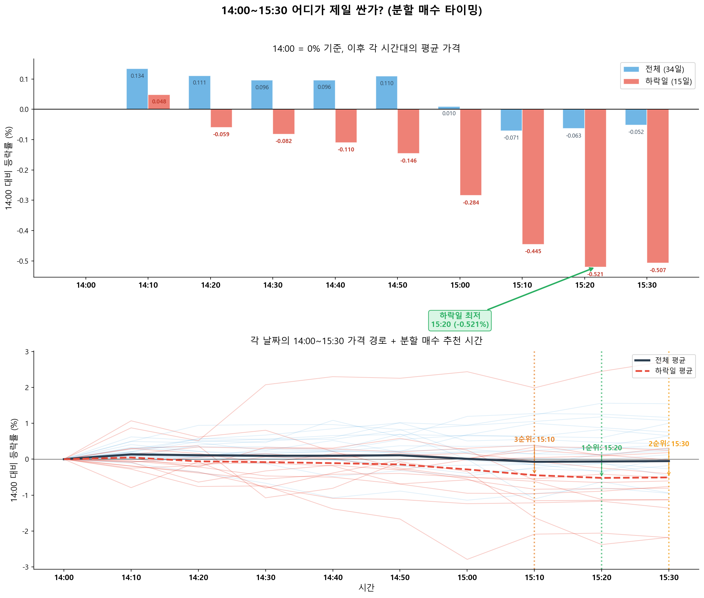
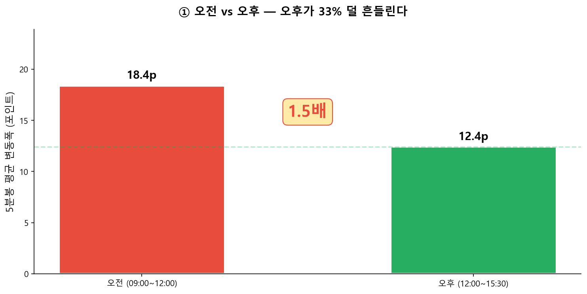
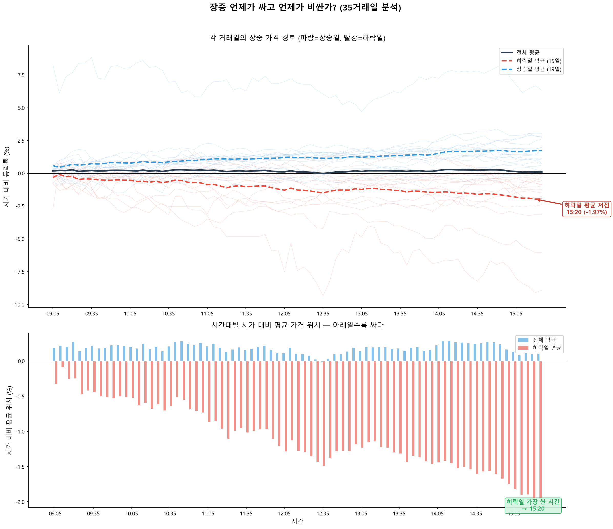
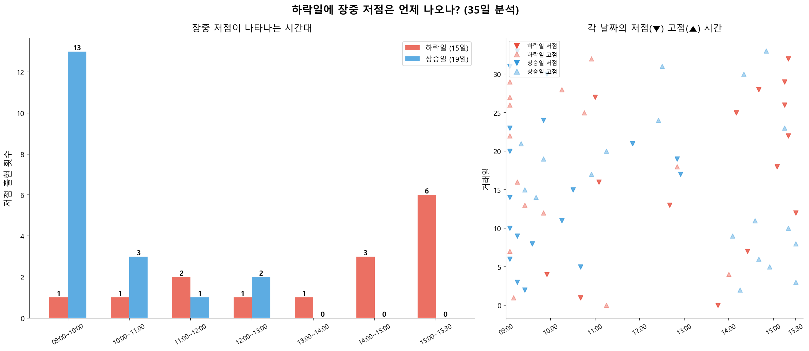
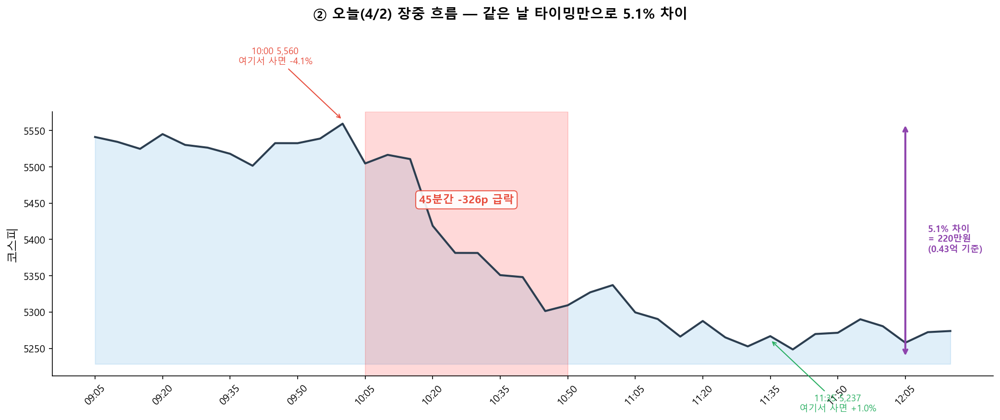
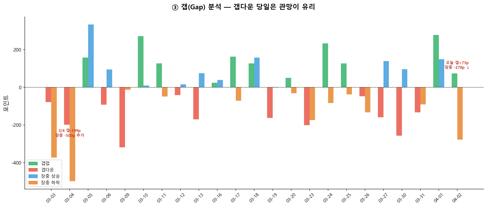
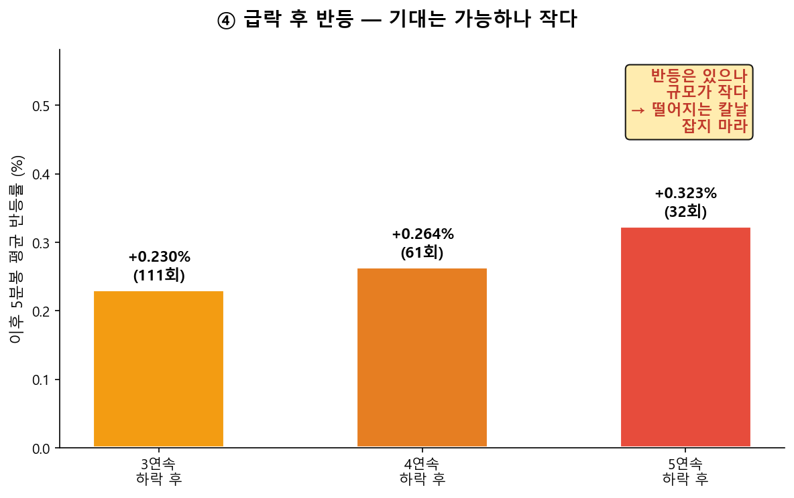
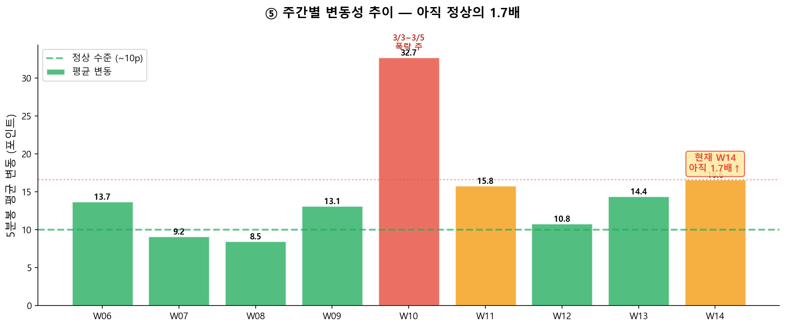

# 5분봉 변동성 분석 기반 매매 실행 가이드

**분석일**: 2026-04-02 장중 (데이터: 2/6~4/2, 36거래일 2,691봉)  
**현재 코스피**: 5,274 | **오늘 변동폭**: 5,575→5,237 = **338p (6.1%)**

---

## 결론: 이렇게 실행하라

### 1. 하락일엔 늦게 살수록 싸다

단순히 오후가 "안정적"인 게 아니다. **하락일에는 장이 끝날 때까지 계속 떨어진다.** 35거래일 중 하락일(15일)의 평균 장중 경로:

- 09:10 가장 비싼 시간 (-0.09%)
- 15:20 가장 싼 시간 (-1.97%)
- **차이: 1.88% = 코스피 5,270 기준 약 99p**

또한 하락일 저점이 나타나는 시간: **15시 이후가 6회로 최다**, 14시대 3회. 오전에 저점이 나온 날은 15일 중 2일뻐.

> **매수 실행 시간: 15:00~15:20** (하락일 기준 가장 싼 구간)

### 2. 14:00~15:20 안에서도 시간에 따라 다르다

오후라고 다 같은 가격이 아니다. 14:00을 기준으로 10분 단위로 하락일 평균 가격을 비교하면:

| 시간 | 14:00 대비 | 5,270 기준 |
|:---:|:---:|:---:|
| 14:00 | 0 | 기준점 |
| 14:10 | +0.05% | **+3p (비싼)** |
| 14:20 | -0.06% | -3p |
| 14:30 | -0.08% | -4p |
| 14:40 | -0.11% | -6p |
| 14:50 | -0.15% | -8p |
| **15:00** | **-0.28%** | **-15p** |
| **15:10** | **-0.45%** | **-23p** |
| **15:20** | **-0.52%** | **-27p (최저)** |
| 15:30 | -0.51% | -27p (동시호가, 유동성 불안) |

14:00에 사면 15:20보다 **평균 27p 비싸게** 사는 것. 하락이 15:00 이후에 가속되기 때문이다.

> 

**분할 매수 추천:**
- **2분할**: 15:10 + 15:20
- **3분할**: 15:00 + 15:10 + 15:20

> 15:30은 동시호가라 유동성이 불안정하므로 **15:20이 실전 마지막 주문 시점**

### 3. 급락 당일 바로 사지 마라

대형 갭다운(-3%+) 후 당일 추가 하락 경향이 있다(3/4, 3/23). 오전 급락이 오후까지 이어지는 패턴이 빈번하다.

> **급락일은 오후까지 관망 → 당일 14시 이후 또는 다음날 오전 갭 확인 후 진입**

### 4. 5,100은 매물대가 지지한다

최근 5일 매물대 분석 결과, **5,080~5,120** 구간에 거래량이 집중(62~47만)되어 있다. 이 가격대에서 매수세가 버텼다는 뜻이며, 기존 1-C(5,100) 매수 타겟이 **매물대 지지선과 일치**한다.

반면 **5,480~5,580**은 전체기간 최대 매물대(거래량 350~420만)로, 반등 시 강한 저항이 예상된다.

> **5,100 = 매물대 지지 + 90% 반등 확신 → 1차 분할의 핵심 매수 구간**  
> **5,500 = 매물 벽 → 반등 시 첫 번째 익절 포인트로 유효**

### 5. 기존 매수 플랜에 시간축 + 매물대를 결합하라

| 매수 | 목표가 | 금액 | 매물대 | 실행 방법 |
|:---:|:---:|---:|:---:|:---|
| **1-A** | 5,270 | **0.43억** | 현재가 부근 매물 소화 중 | 오늘 **15:00~15:20** 가격 확인 후 2회 분할 지정가 |
| **1-B** | 5,100 | **0.86억** | **강한 지지 매물대** | 적극 진입, 3회 분할 (매물대 + 반등 확신 90%) |

> ~~5,180은 삭제~~ — 매물대 근거 없음(거래량 순위 11위), MDD 기준선도 아님, 단순 중간값이었음.  
> 5,100에 확신이 높으므로 **0.86억으로 비중 2배** 배정. 반등 시 수익도 커진다.

---

## 근거: 5분봉이 보여주는 것

### ① 오전 vs 오후 — 숫자로 확인

| 구간 | 5분봉 평균 변동 | 비고 |
|:---:|:---:|:---|
| **09:05** | **49.9p** | 하루 중 최대. 방향 예측 불가 |
| 09:10~09:40 | 20~33p | 여전히 큼 |
| 09:45~10:30 | 16~20p | 약간 안정 |
| **10:30~11:30** | 11~18p | 오전 저변동 구간 |
| **12:00~14:00** | 11~16p | 가장 안정적 |
| **14:00~15:00** | 11~16p | 매수 적기 |
| 15:00~15:20 | 10~14p | 마감 전 안정 |

오전(09~12시) 평균 **18.4p** vs 오후(12~15시) 평균 **12.4p** → **오후가 33% 덜 흔들림**

> 

### ② 장중 언제가 비싸고 언제가 싸나

35거래일의 장중 가격 경로를 겉쳐보면, **하락일에는 장 끝으로 갈수록 계속 떨어진다**:

> 

하락일 15일의 저점 시간 분포를 보면:
- **15:00~15:30**: 6회 (최다)
- **14:00~15:00**: 3회
- 오전(09~12시): 겨우 4회

> 

**결론: 하락일에 오전에 사면 거의 확실하게 더 비싼 가격에 사는 것. 15시 부근이 가장 싸다.**

**오늘(4/2) 사례도 이 패턴 그대로:**

```
10:00  5,560에 매수했다면 → 30분 후 5,330  = -4.1%  💀
11:35  5,237에 매수했다면 → 30분 후 5,290  = +1.0%  ✅
→ 같은 0.43억, 2시간 차이로 약 220만원 손익 차이
```

> 

### ③ 갭(Gap) — 전날 종가와 다음날 시가의 차이

3월 이후 갭 현황:

| 날짜 | 갭 | 방향 | 특징 |
|:---:|:---:|:---:|:---|
| 3/4 | **-199p** | 추가 하락 | 갭다운 후 장중 -613p 폭락 |
| 3/9 | **-320p** | 추가 하락 | 갭다운 후 소폭 추가 하락 |
| 3/23 | **-201p** | 추가 하락 | 갭다운 후 장중 -182p 추가 |
| 3/27 | -160p | **반등** | 갭다운 후 장중 +242p 반등 |
| 3/30 | -257p | **반등** | 갭다운 후 장중 +146p 반등 |
| 4/1 | +278p | 유지 | 갭업 후 추가 상승 |
| 4/2 | +73p | **급락** | 갭업 후 -338p 급락 |

**패턴**: 대형 갭다운 연속 2일째는 반등 확률 높음. 갭업 후 급락은 함정(오늘 사례).

**→ 갭다운 당일은 관망이 유리. 갭다운 2일차에 매수 검토.**

> 

### ④ 급락 후 반등 — 기대는 가능하나 작다

3월 이후 5분봉 기준:

| 패턴 | 횟수 | 이후 10분 평균 반등 |
|:---:|:---:|:---:|
| 5분 -0.3%+ 하락 | 194회 | +0.031% (미미) |
| 3연속 하락봉 후 | 111회 | +0.23% |
| 5연속 하락봉 후 | 32회 | +0.32% |

**급락 중 "떨어지는 칼날"을 잡아서 단타 수익을 노리는 전략은 비효율적.** 급락이 끝난 후 안정 구간(오후)에서 잡는 게 낫다.

> 

### ⑤ 매물대 — 어디에 거래가 몰려 있나

5분봉 가격대별 거래량을 집계하면, 매수세/매도세가 집중된 가격대를 알 수 있다.

**전체기간 매물대 상위 (2/6~4/2)**

| 가격대 | 거래량 | 해석 |
|:---:|---:|:---|
| **5,500~5,560** | 420만 | 전체 최대 매물대 → **반등 시 저항선** |
| 5,460~5,500 | 340만 | 두 번째 저항 |
| 5,660~5,700 | 240만 | 추가 저항 |
| 5,280~5,320 | 230만 | **현재가 부근** — 매물 소화 중 |
| 5,080~5,120 | 62~47만 | 최근 형성된 **지지선** |

**최근 5일 매물대 (3/27~4/2)** — 최근 매물이 더 중요

| 가격대 | 거래량 | 해석 |
|:---:|---:|:---|
| **5,280~5,320** | **90만** | 1위. 현재가 부근 최대 매물 = 공방 중 |
| 5,260~5,280 | 74만 | 현재가 바로 아래 |
| **5,080~5,120** | **47~62만** | **1-C(5,100) 타겟 = 지지 매물대** |
| 5,360~5,380 | 45만 | 바로 위 저항 |
| 5,500~5,520 | 34만 | 반등 시 첫 저항 (매도 타겟 5,500과 일치) |

**결론**: 5,100 부근에 최근 거래가 집중 = 매수세가 이 가격에서 버텼다. 기존 1-C 매수 타겟(5,100)이 매물대 지지선과 정확히 일치한다. 반면 5,500 위는 매물 벽이 두꺼워 반등 시 저항이 예상되므로, 기존 매도 플랜의 첫 익절(5,500)도 근거가 있다.

> 차트: [5분봉_매물대_상세.png](5분봉_매물대_상세_20260402_122148.png) 참조

### ⑥ 주간별 변동성 — 아직 경계 구간

| 주차 | 5분 평균 변동 | 최대 변동 | 종가 | 상태 |
|:---:|:---:|:---:|:---:|:---:|
| W07 (2/9~) | 9.2p | 38p | 5,507 | 정상 |
| W09 (2/23~) | 13.1p | 55p | 6,244 | 고점 부근 |
| **W10 (3/3~)** | **32.7p** | **440p** | 5,585 | **극단적 폭락** |
| W11 (3/9~) | 15.8p | 77p | 5,487 | 안정화 중 |
| W13 (3/23~) | 14.4p | 51p | 5,439 | 재불안 |
| **W14 (3/30~)** | **16.6p** | **99p** | 5,274 | **재확대** |

W10(폭락 주)보다는 줄었지만 정상(9~10p) 대비 아직 **1.7배** 높은 상태. 변동성이 완전히 정상화되지 않았다.

> 

---

## 실전 체크리스트

```
□ 15:00~15:20에 매수 주문 넣기 (하락일 기준 가장 싼 시간)
□ 오전(09:00~12:00)에는 매수 주문 넣지 않기
□ 0.43억을 2~3회 분할 (각 1,500~2,000만원씩)
□ 급락 당일은 관망, 다음날 오후에 실행 검토
□ 시장가 주문 절대 금지 — 5분 만에 1~2% 슬리피지 발생 가능
□ 장 마감 10분 전(15:20) 이후엔 유동성 감소로 주문 자제
```

---

## 그냥 이대로 따라하면 된다

### 코스피 5,270 이하일 때 (지금) — 1-A: 0.43억

```
① 15:00 되면 HTS 켠다
② 현재가가 5,270 이하인지 확인한다
③ 맞으면 아래 3건 지정가 주문 넣는다:

   15:00  주문 1: 1,500만원 어치  →  지정가 현재가 기준
   15:10  주문 2: 1,500만원 어치  →  지정가 현재가 기준
   15:20  주문 3: 1,300만원 어치  →  지정가 현재가 기준

④ 체결 안 된 건 내일 같은 방법으로 다시
⑤ 총 0.43억 체결되면 끝. 5,100 알림 설정하고 대기.
```

### 코스피 5,100 이하로 떨어지면 — 1-B: 0.86억

```
① 여기는 매물대 지지선 + 90% 반등 확신 구간
② 조금 더 적극적으로: 14:00 안 기다려도 됨
③ 단 오전 09:00~10:30은 피한다 (변동성 1.5배)
④ 0.86억을 3회 분할:

   15:00  주문 1: 2,900만원 어치  →  지정가 현재가 기준
   15:10  주문 2: 2,900만원 어치  →  지정가 현재가 기준
   15:20  주문 3: 2,800만원 어치  →  지정가 현재가 기준

⑤ 총 0.86억 체결되면 1차 매수 완료 (1.29억 전량 소진)
```

### 반등해서 올라갈 때 (매도)

```
코스피 5,500 도달 → 추가 매수분의 30% 매도 (약 3,900만원)
코스피 5,700 도달 → 추가 매수분의 30% 매도 (약 3,900만원)
코스피 5,900 도달 → 추가 매수분의 20% 매도 (약 2,600만원)
코스피 6,100 도달 → 나머지 전량 매도 → 대출 상환
```

### 절대 하지 말 것

```
✗ 오전 09:00~10:30에 사는 것
✗ 시장가 주문 넣는 것
✗ 급락 보고 겁나서 안 사는 것
✗ 급등 보고 급해서 한번에 다 사는 것
✗ 이 계획에 없는 금액을 추가로 넣는 것
```

---

## 참고 차트

| 차트 | 설명 |
|:---|:---|
| [5분봉_시간대별_변동성.png](5분봉_시간대별_변동성_20260402_122148.png) | 시간대별 변동폭/거래량/오늘 장중 흐름 (종합) |
| [근거1_오전오후비교.png](근거1_오전오후비교_20260402_122736.png) | ① 오전 vs 오후 변동성 1.5배 차이 || [장중_저가시간대.png](장중_저가시간대_20260402_124937.png) | ② 장중 언제가 싸고 비싼지 (하락일/상승일 평균 경로) |
| [장중_저점시간분포.png](장중_저점시간분포_20260402_124937.png) | ② 하락일 저점 시간 분포 (15시 이후가 최다) |
| [오후분할매수타이밍.png](오후분할매수타이밍_20260402_125829.png) | ② 14:00~15:30 10분단위 평균 가격 + 분할매수 추천 |
| [근거2_일별평균장중패턴.png](근거2_일별평균장중패턴_20260402_123154.png) | 35일 장중 등락 패턴 겹치기 + 시간대별 변동폭 |
| [근거2_시간대별매수위험.png](근거2_시간대별매수위험_20260402_123154.png) | ② 시간대별 매수 후 당일 최대 하락폭 |
| [근거2_오늘장중흐름.png](근거2_오늘장중흐름_20260402_122736.png) | ② 4/2 장중 가격 흐름 + 급락 구간 표시 |
| [근거3_갭분석.png](근거3_갭분석_20260402_122736.png) | ③ 3월 이후 갭 + 장중 변화 비교 |
| [근거4_급락후반등.png](근거4_급락후반등_20260402_122736.png) | ④ 연속 하락 후 반등 규모 |
| [근거5_주간변동성.png](근거5_주간변동성_20260402_122736.png) | ⑤ 주간별 변동성 추이 |
| [5분봉_매물대_분석.png](5분봉_매물대_분석_20260402_122148.png) | ⑥ 전체기간 가격대별 거래량 분포 |
| [5분봉_매물대_상세.png](5분봉_매물대_상세_20260402_122148.png) | ⑥ 최근 5일 매물대 상세 (지지/저항 표시) |

---

*본 분석은 2/6~4/2 코스피 5분봉 2,691개 기반. 과거 패턴이 미래를 보장하지 않음.*
