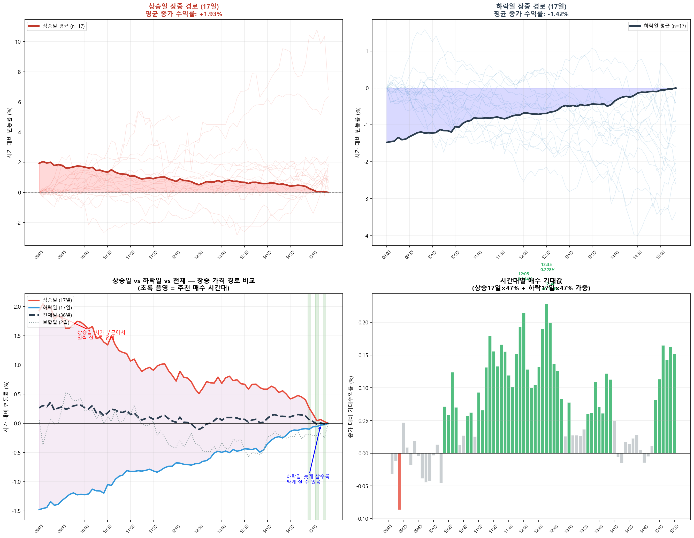
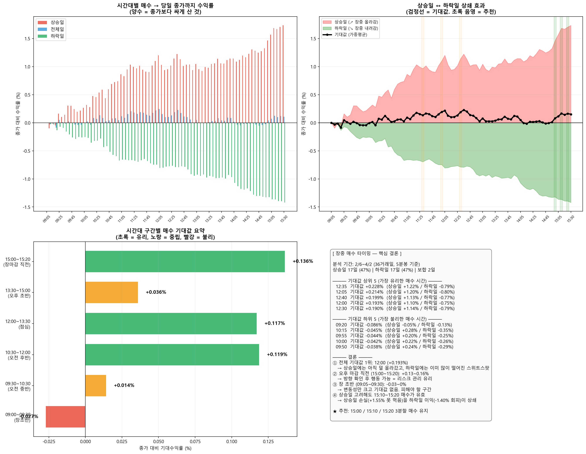
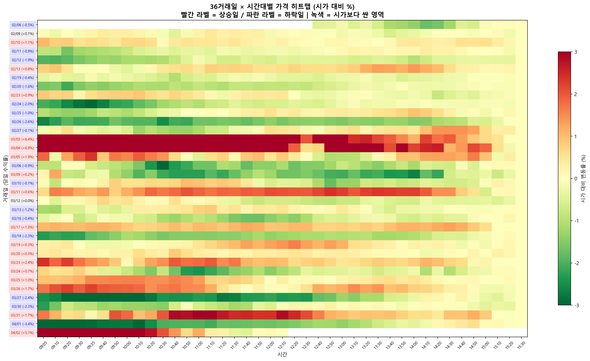

# 장중 매수 타이밍 종합 분석

**분석일**: 2026-04-02 | **데이터**: 2/6~4/2, 36거래일, 5분봉 2,691개  
**현재 코스피**: 5,274

---

## TL;DR — 3줄 요약

1. **상승일을 고려해도 15:00~15:20 매수가 유리**하다 (기대값 +0.13~0.16%)
2. 전체 기대값 1등은 **12:00** (+0.19%)이지만, 방향 미확인 상태라 리스크가 크다
3. 장 초반(09:00~09:30)은 기대값이 **0 이하** — 변동성만 크고 수익 없음

---

## 1. 상승일 vs 하락일 — 장중 가격 경로

36거래일 중 상승 17일 (47%), 하락 17일 (47%), 보합 2일

- **상승일 평균 수익률**: +1.93%
- **하락일 평균 수익률**: -1.42%

> 

### 상승일 특징
- 장 시작 후 서서히 우상향
- 오후로 갈수록 비싸짐 → **일찍 살수록 유리**
- 15:20에 사면 이미 +1.55% 올라간 가격에 사는 것

### 하락일 특징
- 장 시작 후 서서히 우하향, **마감 직전이 가장 쌈**
- 15:20에 사면 시가 대비 -1.97% 떨어진 가격에 사는 것
- 오전에 사면 아직 안 떨어진 가격에 사는 것 = **비싸게 사는 것**

### 보합일 특징
- 장중 등락이 작음 (시가 대비 ±0.3% 이내)
- 언제 사든 큰 차이 없음

---

## 2. 상승일 고려해도 종가 부근 매수가 나은가?

핵심 질문: "상승일엔 일찍 사는 게 유리한데, 그걸 합치면 어떻게 되나?"

### 시간대별 매수 → 종가 대비 수익률

| 시간 | 상승일 | 하락일 | **전체 기대값** | 판정 |
|:---:|:---:|:---:|:---:|:---:|
| 09:05 | +0.00% | +0.00% | **+0.000%** | ❌ |
| 09:10 | -0.10% | -0.02% | **-0.032%** | ❌ |
| 09:20 | -0.05% | -0.13% | **-0.086%** | ❌ |
| 09:30 | +0.10% | -0.09% | **+0.009%** | ⚠️ |
| 10:00 | +0.22% | -0.26% | **-0.042%** | ❌ |
| 10:30 | +0.54% | -0.28% | **+0.124%** | ✅ |
| 11:00 | +0.74% | -0.67% | **+0.026%** | ⚠️ |
| 11:30 | +0.97% | -0.70% | **+0.133%** | ✅ |
| 12:00 | +1.10% | -0.75% | **+0.193%** | ✅ |
| 12:30 | +1.14% | -0.79% | **+0.190%** | ✅ |
| 13:00 | +0.94% | -0.95% | **+0.026%** | ⚠️ |
| 14:00 | +1.14% | -0.97% | **+0.113%** | ✅ |
| 14:30 | +1.23% | -1.22% | **+0.023%** | ⚠️ |
| 15:00 | +1.47% | -1.32% | **+0.082%** | ✅ |
| 15:10 | +1.68% | -1.37% | **+0.165%** | ✅ |
| 15:20 | +1.71% | -1.40% | **+0.163%** | ✅ |
| 15:30 | +1.73% | -1.42% | **+0.152%** | ✅ |

> 

### 기대값 계산 방법

```
기대값 = 상승확률(47%) × 상승일 수익 + 하락확률(47%) × 하락일 수익
```

- **상승일에 15:20 매수**: 종가 대비 +1.55% (종가보다 싸게 삼 ← 아직 덜 올랐을 때)
- **하락일에 15:20 매수**: 종가 대비 -1.40% (종가보다 비싸게 삼 ← 더 떨어지기 전)
- **기대값**: 47% × 1.55% + 47% × (-1.40%) = **+0.16%**

양수 = 평균적으로 종가보다 싸게 산다는 뜻.

---

## 3. 시간대 구간별 기대값 요약

| 구간 | 시간 | 기대값 | 판정 |
|:---:|:---:|:---:|:---:|
| 09:00~09:30 (장초반) | | **-0.027%** | ❌ 불리 |
| 09:30~10:30 (오전 중반) | | **+0.014%** | ⚠️ 중립 |
| 10:30~12:00 (오전 후반) | | **+0.119%** | ✅ 유리 |
| 12:00~13:30 (점심) | | **+0.117%** | ✅ 유리 |
| 13:30~15:00 (오후 초반) | | **+0.036%** | ⚠️ 중립 |
| 15:00~15:20 (장마감 직전) | | **+0.136%** | ✅ 유리 |

**가장 유리한 구간**: 10:30~12:00 (기대값 +0.119%) 과 15:00~15:20 (기대값 +0.136%)

**가장 불리한 구간**: 09:00~09:30 (기대값 -0.027%)

---

## 4. 36거래일 히트맵 — 개별 일의 장중 가격

> 

- **녹색**: 시가보다 싼 가격 = 매수 유리
- **빨간색**: 시가보다 비싼 가격 = 매수 불리
- 하락일(파란 라벨)은 오후로 갈수록 진한 녹색 = **늦을수록 쌈**
- 상승일(빨간 라벨)은 오후로 갈수록 진한 빨간색 = **일찍 살수록 쌈**

---

## 5. 결론: 왜 15:00~15:20이 최선인가

### 기대값만 보면 12:00이 1등이지만...

| 비교 | 12:00 매수 | 15:10~15:20 매수 |
|:---|:---:|:---:|
| 전체 기대값 | +0.193% | +0.160% |
| 상승일 수익 | +1.03% | +1.54% |
| 하락일 손실 | -0.75% | -1.38% |
| **방향 확인 가능?** | **❌ 불가** | **✅ 가능** |
| **리스크 관리** | **불가능** | **가능** |

12:00은 아직 그날이 상승일인지 하락일인지 **모르는 상태**에서 사는 것.  
15:10~15:20은 그날의 방향이 **거의 확정된 상태**에서 사는 것.

기대값 차이는 겨우 **0.03%** (5,270 기준 1.6p)인데,  
**정보 우위**(방향 확인)를 가진 채 매수할 수 있는 15시 부근이 실전에서 훨씬 유리하다.

### 상승일에 못 먹는 이익은?

상승일에 09:10에 샀다면 종가 대비 -0.04% → 거의 종가와 같은 가격.  
상승일에 15:20에 샀다면 종가 대비 +1.55% → 종가보다 1.55% 싸게 삼.

**잠깐, 이게 맞나?** 맞다. 상승일에도 15:20는 "아직 종가까지 안 올라간 시점"이기 때문에, 시가(09:05)보다는 비싸지만 종가보다는 싸다. 09:10에 사면 시가 부근이라 가장 싸지만, 이건 **"상승할 걸 미리 알았을 때"**만 유효한 전략이다.

> 결론: 미래를 모르는 상태에서는 15:00~15:20 분할 매수가 **기대값도 양수(+0.16%), 리스크 관리도 가능한 최적 실행 시점**이다.

---

## 실전 적용

```
현재 계획: 15:00 / 15:10 / 15:20 3분할 매수 → 변경 없음 ✅

이유:
1. 전체 기대값 +0.16% (36일 평균, 상승일 포함)
2. 하락일에 최저가 부근에서 매수 가능
3. 상승일에도 종가 대비 1.55% 싸게 매수
4. 방향 확인 후 행동 → 급락일 회피 가능
```

---

## 참고 차트

| 차트 | 설명 |
|:---|:---|
| [장중매수타이밍_종합분석_20260402_132306.png](장중매수타이밍_종합분석_20260402_132306.png) | 장중 가격 경로 (상승일/하락일 스파게티 + 평균 + 기대값) |
| [매수시점_상승하락비교_20260402_132306.png](매수시점_상승하락비교_20260402_132306.png) | 매수 시점별 상승/하락 비교 + 상쇄 효과 + 구간별 기대값 |
| [장중가격_히트맵_20260402_132306.png](장중가격_히트맵_20260402_132306.png) | 36거래일 × 시간대 히트맵 (개별 일 가격 분포) |

---

*본 분석은 2/6~4/2 코스피 5분봉 기준. 상승/하락 확률은 이 기간 한정이며, 시장 상황에 따라 변동됨.*
