# 📊 보통주 vs 우선주 괴리율 분석 리포트

**분석일시**: 2026년 04월 08일 09:57:46
**분석 기준**: 2010년 이후 데이터 (금융위기 등 이상치 제외)

---

## 🎯 오늘의 투자 결론

| 종목 | 보통주 | 우선주 | 현재 괴리율 | 역사적 위치 | 판정 | 추천 |
|:----:|-------:|-------:|:----------:|:----------:|:----:|:-----|
| **삼성전자** | 208,250원 | 136,900원 | -34.26% | 하위 22% | 🟦 | 🟦 우선주 매수 |
| **삼성전기** | 497,500원 | 184,900원 | -62.83% | 하위 31% | ⚪ | ⚪ 중립 |
| **현대차** | 491,500원 | 243,000원 | -50.56% | 하위 54% | ⚪ | ⚪ 중립 |
| **미래에셋증권** | 66,000원 | 21,300원 | -67.73% | 하위 19% | 🟦 | 🟦 우선주 강력 매수 |
| **CJ** | 195,400원 | 85,400원 | -56.29% | 하위 57% | ⚪ | ⚪ 중립 |
| **대상** | 20,050원 | 16,170원 | -19.35% | 하위 95% | 🟥 | 🟥 보통주 강력 매수 |
| **SK** | 334,500원 | 251,500원 | -24.81% | 하위 47% | ⚪ | ⚪ 중립 |
| **한화** | 122,900원 | 46,500원 | -62.16% | 하위 18% | 🟦 | 🟦 우선주 강력 매수 |
| **LG** | 91,600원 | 67,100원 | -26.75% | 하위 83% | 🟥 | 🟥 보통주 매수 |
| **GS** | 68,200원 | 53,900원 | -20.97% | 하위 75% | ⚪ | ⚪ 중립 |
| **두산** | 1,194,000원 | 487,000원 | -59.21% | 하위 28% | ⚪ | ⚪ 중립 |
| **아모레퍼시픽** | 129,900원 | 45,550원 | -64.93% | 하위 52% | ⚪ | ⚪ 중립 |
| **LG화학** | 333,000원 | 162,400원 | -51.23% | 하위 47% | ⚪ | ⚪ 중립 |
| **삼성SDI** | 457,000원 | 225,500원 | -50.66% | 하위 53% | ⚪ | ⚪ 중립 |
| **LG전자** | 113,700원 | 50,600원 | -55.50% | 하위 68% | ⚪ | ⚪ 중립 |
| **삼성화재** | 470,000원 | 375,500원 | -20.11% | 하위 100% | 🟥 | 🟥 보통주 강력 매수 |
| **S-Oil** | 115,300원 | 54,800원 | -52.47% | 하위 9% | 🟦 | 🟦 우선주 강력 매수 |
| **대한항공** | 24,750원 | 23,550원 | -4.85% | 하위 62% | ⚪ | ⚪ 중립 |
| **유한양행** | 93,900원 | 84,700원 | -9.80% | 하위 33% | ⚪ | ⚪ 중립 |
| **LG생활건강** | 240,500원 | 105,800원 | -56.01% | 하위 57% | ⚪ | ⚪ 중립 |
| **CJ제일제당** | 234,250원 | 134,800원 | -42.45% | 하위 95% | 🟥 | 🟥 보통주 강력 매수 |
| **현대건설** | 173,900원 | 74,900원 | -56.93% | 하위 2% | 🟦 | 🟦 우선주 강력 매수 |
| **금호석유** | 127,600원 | 58,100원 | -54.47% | 하위 72% | ⚪ | ⚪ 중립 |
| **코오롱인더** | 81,400원 | 28,700원 | -64.74% | 하위 47% | ⚪ | ⚪ 중립 |
| **코오롱** | 65,800원 | 29,500원 | -55.17% | 하위 48% | ⚪ | ⚪ 중립 |
| **호텔신라** | 46,750원 | 34,500원 | -26.20% | 하위 63% | ⚪ | ⚪ 중립 |
| **DL** | 69,300원 | 28,650원 | -58.66% | 하위 16% | 🟦 | 🟦 우선주 강력 매수 |

### 💡 핵심 요약

- **삼성전자**: 우선주가 역사적 평균(-24.3%)보다 10.0%p 더 저렴. 과거 78%의 경우보다 우선주가 싸므로 **삼성전자우 매수 유리** (승률 ~78%)
- **삼성전기**: 괴리율(-62.8%)이 평균(-59.4%) 부근. **선호도에 따라 선택** (배당→우선주, 의결권→보통주)
- **현대차**: 괴리율(-50.6%)이 평균(-54.2%) 부근. **선호도에 따라 선택** (배당→우선주, 의결권→보통주)
- **미래에셋증권**: 우선주가 역사적 평균(-54.2%)보다 13.6%p 더 저렴. 과거 81%의 경우보다 우선주가 싸므로 **미래에셋증권우 매수 유리** (승률 ~81%)
- **CJ**: 괴리율(-56.3%)이 평균(-59.6%) 부근. **선호도에 따라 선택** (배당→우선주, 의결권→보통주)
- **대상**: 우선주가 역사적 평균(-50.2%)보다 30.9%p 비쌈. 과거 95%의 경우보다 우선주가 비싸므로 **대상(보통주) 매수 유리** (승률 ~95%)
- **SK**: 괴리율(-24.8%)이 평균(-27.4%) 부근. **선호도에 따라 선택** (배당→우선주, 의결권→보통주)
- **한화**: 우선주가 역사적 평균(-56.1%)보다 6.1%p 더 저렴. 과거 82%의 경우보다 우선주가 싸므로 **한화3우B 매수 유리** (승률 ~82%)
- **LG**: 우선주가 역사적 평균(-47.0%)보다 20.2%p 비쌈. 과거 83%의 경우보다 우선주가 비싸므로 **LG(보통주) 매수 유리** (승률 ~83%)
- **GS**: 괴리율(-21.0%)이 평균(-38.6%) 부근. **선호도에 따라 선택** (배당→우선주, 의결권→보통주)
- **두산**: 괴리율(-59.2%)이 평균(-49.9%) 부근. **선호도에 따라 선택** (배당→우선주, 의결권→보통주)
- **아모레퍼시픽**: 괴리율(-64.9%)이 평균(-63.5%) 부근. **선호도에 따라 선택** (배당→우선주, 의결권→보통주)
- **LG화학**: 괴리율(-51.2%)이 평균(-51.5%) 부근. **선호도에 따라 선택** (배당→우선주, 의결권→보통주)
- **삼성SDI**: 괴리율(-50.7%)이 평균(-52.8%) 부근. **선호도에 따라 선택** (배당→우선주, 의결권→보통주)
- **LG전자**: 괴리율(-55.5%)이 평균(-60.3%) 부근. **선호도에 따라 선택** (배당→우선주, 의결권→보통주)
- **삼성화재**: 우선주가 역사적 평균(-43.5%)보다 23.4%p 비쌈. 과거 100%의 경우보다 우선주가 비싸므로 **삼성화재(보통주) 매수 유리** (승률 ~100%)
- **S-Oil**: 우선주가 역사적 평균(-40.1%)보다 12.4%p 더 저렴. 과거 91%의 경우보다 우선주가 싸므로 **S-Oil우 매수 유리** (승률 ~91%)
- **대한항공**: 괴리율(-4.8%)이 평균(-17.1%) 부근. **선호도에 따라 선택** (배당→우선주, 의결권→보통주)
- **유한양행**: 괴리율(-9.8%)이 평균(1.4%) 부근. **선호도에 따라 선택** (배당→우선주, 의결권→보통주)
- **LG생활건강**: 괴리율(-56.0%)이 평균(-58.1%) 부근. **선호도에 따라 선택** (배당→우선주, 의결권→보통주)
- **CJ제일제당**: 우선주가 역사적 평균(-62.6%)보다 20.1%p 비쌈. 과거 95%의 경우보다 우선주가 비싸므로 **CJ제일제당(보통주) 매수 유리** (승률 ~95%)
- **현대건설**: 우선주가 역사적 평균(68.7%)보다 125.7%p 더 저렴. 과거 98%의 경우보다 우선주가 싸므로 **현대건설우 매수 유리** (승률 ~98%)
- **금호석유**: 괴리율(-54.5%)이 평균(-64.8%) 부근. **선호도에 따라 선택** (배당→우선주, 의결권→보통주)
- **코오롱인더**: 괴리율(-64.7%)이 평균(-62.7%) 부근. **선호도에 따라 선택** (배당→우선주, 의결권→보통주)
- **코오롱**: 괴리율(-55.2%)이 평균(-50.5%) 부근. **선호도에 따라 선택** (배당→우선주, 의결권→보통주)
- **호텔신라**: 괴리율(-26.2%)이 평균(-36.5%) 부근. **선호도에 따라 선택** (배당→우선주, 의결권→보통주)
- **DL**: 우선주가 역사적 평균(-46.9%)보다 11.8%p 더 저렴. 과거 84%의 경우보다 우선주가 싸므로 **DL우 매수 유리** (승률 ~84%)

### 📋 투자 시점 가이드

| 종목 | 우선주 매수 구간 | 중립 구간 | 보통주 매수 구간 |
|:----:|:---------------:|:---------:|:---------------:|
| 삼성전자 | 괴리율 < -30.4% | -30.4% ~ -17.7% | 괴리율 > -17.7% |
| 삼성전기 | 괴리율 < -64.6% | -64.6% ~ -53.5% | 괴리율 > -53.5% |
| 현대차 | 괴리율 < -60.9% | -60.9% ~ -46.2% | 괴리율 > -46.2% |
| 미래에셋증권 | 괴리율 < -65.4% | -65.4% ~ -46.8% | 괴리율 > -46.8% |
| CJ | 괴리율 < -69.7% | -69.7% ~ -49.2% | 괴리율 > -49.2% |
| 대상 | 괴리율 < -67.2% | -67.2% ~ -28.8% | 괴리율 > -28.8% |
| SK | 괴리율 < -43.7% | -43.7% ~ -14.0% | 괴리율 > -14.0% |
| 한화 | 괴리율 < -60.8% | -60.8% ~ -51.2% | 괴리율 > -51.2% |
| LG | 괴리율 < -56.9% | -56.9% ~ -29.6% | 괴리율 > -29.6% |
| GS | 괴리율 < -54.9% | -54.9% ~ -20.8% | 괴리율 > -20.8% |
| 두산 | 괴리율 < -65.0% | -65.0% ~ -37.1% | 괴리율 > -37.1% |
| 아모레퍼시픽 | 괴리율 < -72.1% | -72.1% ~ -54.2% | 괴리율 > -54.2% |
| LG화학 | 괴리율 < -57.8% | -57.8% ~ -40.6% | 괴리율 > -40.6% |
| 삼성SDI | 괴리율 < -62.4% | -62.4% ~ -44.1% | 괴리율 > -44.1% |
| LG전자 | 괴리율 < -65.0% | -65.0% ~ -54.5% | 괴리율 > -54.5% |
| 삼성화재 | 괴리율 < -53.2% | -53.2% ~ -28.7% | 괴리율 > -28.7% |
| S-Oil | 괴리율 < -46.5% | -46.5% ~ -33.5% | 괴리율 > -33.5% |
| 대한항공 | 괴리율 < -42.6% | -42.6% ~ 10.0% | 괴리율 > 10.0% |
| 유한양행 | 괴리율 < -13.1% | -13.1% ~ 15.0% | 괴리율 > 15.0% |
| LG생활건강 | 괴리율 < -62.4% | -62.4% ~ -48.5% | 괴리율 > -48.5% |
| CJ제일제당 | 괴리율 < -69.9% | -69.9% ~ -56.1% | 괴리율 > -56.1% |
| 현대건설 | 괴리율 < -34.3% | -34.3% ~ 72.5% | 괴리율 > 72.5% |
| 금호석유 | 괴리율 < -72.9% | -72.9% ~ -53.3% | 괴리율 > -53.3% |
| 코오롱인더 | 괴리율 < -72.1% | -72.1% ~ -53.4% | 괴리율 > -53.4% |
| 코오롱 | 괴리율 < -63.1% | -63.1% ~ -38.3% | 괴리율 > -38.3% |
| 호텔신라 | 괴리율 < -55.9% | -55.9% ~ -20.6% | 괴리율 > -20.6% |
| DL | 괴리율 < -53.3% | -53.3% ~ -40.4% | 괴리율 > -40.4% |

### 📈 시장 상황별 전략

| 종목 | 상승장 예상 | 하락장 예상 | 패턴 |
|:----:|:----------:|:----------:|:-----|
| 삼성전자 | 우선주(삼성전자우) | 보통주(삼성전자) | 상승장에서 우선주가 더 저렴 |
| 삼성전기 | 우선주(삼성전기우) | 보통주(삼성전기) | 상승장에서 우선주가 더 저렴 |
| 현대차 | 우선주(현대차우) | 보통주(현대차) | 상승장에서 우선주가 더 저렴 |
| 미래에셋증권 | 우선주(미래에셋증권우) | 보통주(미래에셋증권) | 상승장에서 우선주가 더 저렴 |
| CJ | 우선주(CJ우) | 보통주(CJ) | 상승장에서 우선주가 더 저렴 |
| 대상 | 우선주(대상우) | 보통주(대상) | 상승장에서 우선주가 더 저렴 |
| SK | 우선주(SK우) | 보통주(SK) | 상승장에서 우선주가 더 저렴 |
| 한화 | 우선주(한화3우B) | 보통주(한화) | 상승장에서 우선주가 더 저렴 |
| LG | 우선주(LG우) | 보통주(LG) | 상승장에서 우선주가 더 저렴 |
| GS | 우선주(GS우) | 보통주(GS) | 상승장에서 우선주가 더 저렴 |
| 두산 | 우선주(두산우) | 보통주(두산) | 상승장에서 우선주가 더 저렴 |
| 아모레퍼시픽 | 우선주(아모레퍼시픽우) | 보통주(아모레퍼시픽) | 상승장에서 우선주가 더 저렴 |
| LG화학 | 우선주(LG화학우) | 보통주(LG화학) | 상승장에서 우선주가 더 저렴 |
| 삼성SDI | 우선주(삼성SDI우) | 보통주(삼성SDI) | 상승장에서 우선주가 더 저렴 |
| LG전자 | 우선주(LG전자우) | 보통주(LG전자) | 상승장에서 우선주가 더 저렴 |
| 삼성화재 | 보통주(삼성화재) | 우선주(삼성화재우) | 하락장에서 우선주가 더 저렴 |
| S-Oil | 우선주(S-Oil우) | 보통주(S-Oil) | 상승장에서 우선주가 더 저렴 |
| 대한항공 | 보통주(대한항공) | 우선주(대한항공우) | 하락장에서 우선주가 더 저렴 |
| 유한양행 | 우선주(유한양행우) | 보통주(유한양행) | 상승장에서 우선주가 더 저렴 |
| LG생활건강 | 우선주(LG생활건강우) | 보통주(LG생활건강) | 상승장에서 우선주가 더 저렴 |
| CJ제일제당 | 우선주(CJ제일제당우) | 보통주(CJ제일제당) | 상승장에서 우선주가 더 저렴 |
| 현대건설 | 우선주(현대건설우) | 보통주(현대건설) | 상승장에서 우선주가 더 저렴 |
| 금호석유 | 우선주(금호석유우) | 보통주(금호석유) | 상승장에서 우선주가 더 저렴 |
| 코오롱인더 | 우선주(코오롱인더우) | 보통주(코오롱인더) | 상승장에서 우선주가 더 저렴 |
| 코오롱 | 우선주(코오롱우) | 보통주(코오롱) | 상승장에서 우선주가 더 저렴 |
| 호텔신라 | 우선주(호텔신라우) | 보통주(호텔신라) | 상승장에서 우선주가 더 저렴 |
| DL | 우선주(DL우) | 보통주(DL) | 상승장에서 우선주가 더 저렴 |

---

## 📌 삼성전자 (005930) vs 삼성전자우 (005935)

**분석 기간**: 2010-01-04 ~ 2026-04-08 (4,000일)
**전체 데이터**: 2005-09-29 ~ 2026-04-08 (5,070일) — 2010년 이전은 참고용

### 현재 상황

| 항목 | 값 |
|:----:|:---|
| 삼성전자 | 208,250원 |
| 삼성전자우 | 136,900원 |
| **현재 괴리율** | **-34.26%** |
| 우선주 할인율 | 34.26% |
| 역사적 위치 | 하위 21.8% |
| Z-Score | -0.98σ |
| 종합 점수 | 35점 (±100점 만점) |
| **판정** | **🟦 우선주 매수** |

**판정 근거:**

- ✅ 역사적 하위 25% (우선주 저평가)
- ✅ 최근 30일 평균보다 1%p 이상 낮음

### 괴리율 통계 (2010년~)

| 지표 | 값 |
|:----:|:---|
| 평균 | -24.30% |
| 중간값 | -21.98% |
| 표준편차 | 10.16% |
| 최소 (우선주 최저평가) | -48.45% |
| 최대 (우선주 최고평가) | -6.47% |

| 백분위 | 괴리율 | 의미 |
|:-----:|:------:|:-----|
| 10% | -40.79% | 우선주 매우 저평가 |
| 25% | -30.39% | 우선주 저평가 |
| 50% | -21.98% | 중간값 |
| 75% | -17.69% | 우선주 고평가 |
| 90% | -11.25% | 우선주 매우 고평가 |

**📎 참고: 전체 기간 (2005-09-29~) 통계 비교**

| 지표 | 2010년 이후 | 전체 기간 |
|:----:|:----------:|:---------:|
| 평균 | -24.30% | -26.49% |
| 중간값 | -21.98% | -24.91% |
| 표준편차 | 10.16% | 10.34% |
| 최소 | -48.45% | -49.81% |
| 최대 | -6.47% | -6.47% |

### 기간별 괴리율

| 기간 | 평균 | 최소 | 최대 | 현재 대비 |
|:----:|:----:|:----:|:----:|:---------:|
| 최근 1개월 | -30.69% | -34.26% | -26.71% | -3.57%p |
| 최근 3개월 | -27.75% | -34.26% | -21.76% | -6.51%p |
| 최근 6개월 | -23.97% | -34.26% | -16.85% | -10.29%p |
| 최근 1년 | -20.64% | -34.26% | -14.05% | -13.62%p |
| 최근 3년 | -16.76% | -34.26% | -7.14% | -17.50%p |
| 최근 5년 | -16.52% | -34.26% | -6.47% | -17.75%p |

### 시장 상황별 괴리율

| 구분 | 기간 | 평균 괴리율 | 중간값 |
|:----:|:----:|:----------:|:------:|
| 상승장 | 1353일 (33.8%) | -25.55% | -23.17% |
| 하락장 | 660일 (16.5%) | -23.13% | -21.91% |
| 중립장 | 1987일 (49.7%) | -23.84% | -21.18% |

### 역사적 극단값 (Top 5)

**🟦 우선주 최저평가 시점 (괴리율 최저)**

| 날짜 | 삼성전자 | 삼성전자우 | 괴리율 |
|:----:|--------:|----------:|:------:|
| 2013-01-02 | 23,644원 | 12,188원 | **-48.45%** |
| 2013-01-14 | 23,284원 | 12,117원 | **-47.96%** |
| 2013-01-04 | 22,879원 | 11,976원 | **-47.66%** |
| 2012-05-08 | 20,007원 | 10,514원 | **-47.45%** |
| 2013-01-03 | 23,149원 | 12,174원 | **-47.41%** |

**🟥 보통주 최저평가 시점 (괴리율 최고)**

| 날짜 | 삼성전자 | 삼성전자우 | 괴리율 |
|:----:|--------:|----------:|:------:|
| 2021-09-09 | 68,340원 | 63,916원 | **-6.47%** |
| 2021-09-29 | 67,570원 | 63,165원 | **-6.52%** |
| 2022-06-16 | 56,073원 | 52,069원 | **-7.14%** |
| 2021-11-05 | 64,014원 | 59,402원 | **-7.20%** |
| 2020-12-22 | 63,442원 | 58,870원 | **-7.21%** |

### 차트

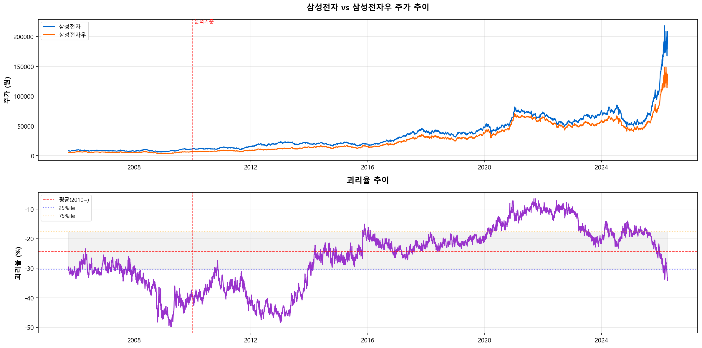

---

## 📌 삼성전기 (009150) vs 삼성전기우 (009155)

**분석 기간**: 2010-01-04 ~ 2026-04-08 (4,000일)
**전체 데이터**: 2005-09-29 ~ 2026-04-08 (5,070일) — 2010년 이전은 참고용

### 현재 상황

| 항목 | 값 |
|:----:|:---|
| 삼성전기 | 497,500원 |
| 삼성전기우 | 184,900원 |
| **현재 괴리율** | **-62.83%** |
| 우선주 할인율 | 62.83% |
| 역사적 위치 | 하위 30.9% |
| Z-Score | -0.40σ |
| 종합 점수 | 10점 (±100점 만점) |
| **판정** | **⚪ 중립** |

**판정 근거:**

- ✅ 최근 30일 평균보다 1%p 이상 낮음

### 괴리율 통계 (2010년~)

| 지표 | 값 |
|:----:|:---|
| 평균 | -59.36% |
| 중간값 | -58.08% |
| 표준편차 | 8.70% |
| 최소 (우선주 최저평가) | -79.74% |
| 최대 (우선주 최고평가) | -32.54% |

| 백분위 | 괴리율 | 의미 |
|:-----:|:------:|:-----|
| 10% | -73.31% | 우선주 매우 저평가 |
| 25% | -64.61% | 우선주 저평가 |
| 50% | -58.08% | 중간값 |
| 75% | -53.50% | 우선주 고평가 |
| 90% | -48.99% | 우선주 매우 고평가 |

**📎 참고: 전체 기간 (2005-09-29~) 통계 비교**

| 지표 | 2010년 이후 | 전체 기간 |
|:----:|:----------:|:---------:|
| 평균 | -59.36% | -60.23% |
| 중간값 | -58.08% | -59.67% |
| 표준편차 | 8.70% | 8.33% |
| 최소 | -79.74% | -79.74% |
| 최대 | -32.54% | -32.54% |

### 기간별 괴리율

| 기간 | 평균 | 최소 | 최대 | 현재 대비 |
|:----:|:----:|:----:|:----:|:---------:|
| 최근 1개월 | -60.44% | -62.98% | -57.97% | -2.40%p |
| 최근 3개월 | -57.30% | -62.98% | -52.26% | -5.54%p |
| 최근 6개월 | -56.38% | -62.98% | -52.26% | -6.45%p |
| 최근 1년 | -55.52% | -62.98% | -51.03% | -7.32%p |
| 최근 3년 | -52.90% | -62.98% | -43.75% | -9.93%p |
| 최근 5년 | -54.32% | -65.95% | -32.54% | -8.51%p |

### 시장 상황별 괴리율

| 구분 | 기간 | 평균 괴리율 | 중간값 |
|:----:|:----:|:----------:|:------:|
| 상승장 | 1370일 (34.2%) | -59.98% | -58.90% |
| 하락장 | 1127일 (28.2%) | -58.09% | -56.07% |
| 중립장 | 1503일 (37.6%) | -59.75% | -57.36% |

### 역사적 극단값 (Top 5)

**🟦 우선주 최저평가 시점 (괴리율 최저)**

| 날짜 | 삼성전기 | 삼성전기우 | 괴리율 |
|:----:|--------:|----------:|:------:|
| 2012-06-21 | 93,451원 | 18,936원 | **-79.74%** |
| 2012-06-18 | 93,451원 | 19,043원 | **-79.62%** |
| 2012-06-19 | 92,154원 | 18,864원 | **-79.53%** |
| 2012-06-20 | 92,154원 | 18,864원 | **-79.53%** |
| 2012-06-15 | 93,019원 | 19,043원 | **-79.53%** |

**🟥 보통주 최저평가 시점 (괴리율 최고)**

| 날짜 | 삼성전기 | 삼성전기우 | 괴리율 |
|:----:|--------:|----------:|:------:|
| 2021-01-27 | 202,419원 | 136,554원 | **-32.54%** |
| 2021-01-26 | 204,778원 | 136,554원 | **-33.32%** |
| 2021-01-28 | 197,701원 | 130,367원 | **-34.06%** |
| 2021-01-29 | 192,510원 | 121,971원 | **-36.64%** |
| 2021-02-03 | 197,701원 | 122,855원 | **-37.86%** |

### 차트

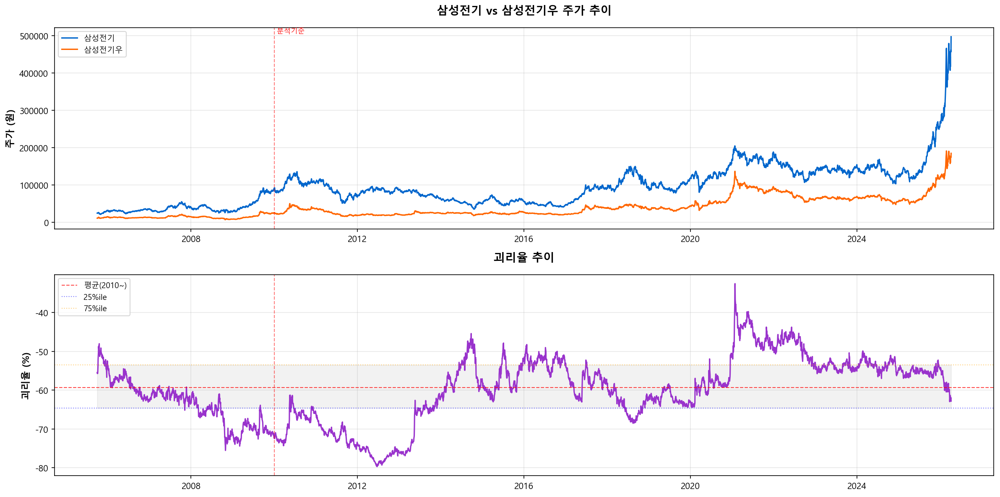

---

## 📌 현대차 (005380) vs 현대차우 (005385)

**분석 기간**: 2010-01-04 ~ 2026-04-08 (4,000일)
**전체 데이터**: 2005-09-29 ~ 2026-04-08 (5,070일) — 2010년 이전은 참고용

### 현재 상황

| 항목 | 값 |
|:----:|:---|
| 현대차 | 491,500원 |
| 현대차우 | 243,000원 |
| **현재 괴리율** | **-50.56%** |
| 우선주 할인율 | 50.56% |
| 역사적 위치 | 하위 53.7% |
| Z-Score | 0.26σ |
| 종합 점수 | 10점 (±100점 만점) |
| **판정** | **⚪ 중립** |

**판정 근거:**

- ✅ 최근 30일 평균보다 1%p 이상 낮음

### 괴리율 통계 (2010년~)

| 지표 | 값 |
|:----:|:---|
| 평균 | -54.21% |
| 중간값 | -51.43% |
| 표준편차 | 14.19% |
| 최소 (우선주 최저평가) | -79.50% |
| 최대 (우선주 최고평가) | -20.11% |

| 백분위 | 괴리율 | 의미 |
|:-----:|:------:|:-----|
| 10% | -76.14% | 우선주 매우 저평가 |
| 25% | -60.85% | 우선주 저평가 |
| 50% | -51.43% | 중간값 |
| 75% | -46.19% | 우선주 고평가 |
| 90% | -38.82% | 우선주 매우 고평가 |

**📎 참고: 전체 기간 (2005-09-29~) 통계 비교**

| 지표 | 2010년 이후 | 전체 기간 |
|:----:|:----------:|:---------:|
| 평균 | -54.21% | -57.07% |
| 중간값 | -51.43% | -56.36% |
| 표준편차 | 14.19% | 14.19% |
| 최소 | -79.50% | -82.21% |
| 최대 | -20.11% | -20.11% |

### 기간별 괴리율

| 기간 | 평균 | 최소 | 최대 | 현재 대비 |
|:----:|:----:|:----:|:----:|:---------:|
| 최근 1개월 | -49.44% | -52.61% | -47.16% | -1.12%p |
| 최근 3개월 | -41.34% | -52.61% | -25.17% | -9.22%p |
| 최근 6개월 | -33.29% | -52.61% | -23.49% | -17.27%p |
| 최근 1년 | -29.74% | -52.61% | -20.11% | -20.82%p |
| 최근 3년 | -43.13% | -60.05% | -20.11% | -7.43%p |
| 최근 5년 | -47.45% | -63.08% | -20.11% | -3.11%p |

### 시장 상황별 괴리율

| 구분 | 기간 | 평균 괴리율 | 중간값 |
|:----:|:----:|:----------:|:------:|
| 상승장 | 1137일 (28.4%) | -55.29% | -52.36% |
| 하락장 | 788일 (19.7%) | -51.74% | -49.30% |
| 중립장 | 2075일 (51.9%) | -54.56% | -51.50% |

### 역사적 극단값 (Top 5)

**🟦 우선주 최저평가 시점 (괴리율 최저)**

| 날짜 | 현대차 | 현대차우 | 괴리율 |
|:----:|--------:|----------:|:------:|
| 2012-04-20 | 169,084원 | 34,658원 | **-79.50%** |
| 2012-04-23 | 166,421원 | 34,406원 | **-79.33%** |
| 2012-06-20 | 168,751원 | 34,909원 | **-79.31%** |
| 2012-08-02 | 158,765원 | 32,897원 | **-79.28%** |
| 2012-04-19 | 172,745원 | 35,815원 | **-79.27%** |

**🟥 보통주 최저평가 시점 (괴리율 최고)**

| 날짜 | 현대차 | 현대차우 | 괴리율 |
|:----:|--------:|----------:|:------:|
| 2025-05-23 | 173,027원 | 138,223원 | **-20.11%** |
| 2025-06-04 | 181,332원 | 144,557원 | **-20.28%** |
| 2025-05-26 | 174,950원 | 139,076원 | **-20.51%** |
| 2025-05-27 | 174,950원 | 138,508원 | **-20.83%** |
| 2025-06-05 | 184,842원 | 146,100원 | **-20.96%** |

### 차트

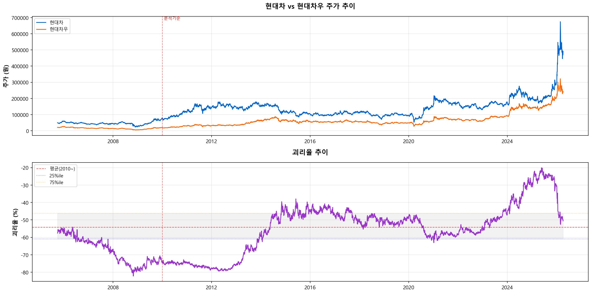

---

## 📌 미래에셋증권 (006800) vs 미래에셋증권우 (006805)

**분석 기간**: 2010-01-04 ~ 2026-04-08 (4,000일)
**전체 데이터**: 2005-09-29 ~ 2026-04-08 (5,070일) — 2010년 이전은 참고용

### 현재 상황

| 항목 | 값 |
|:----:|:---|
| 미래에셋증권 | 66,000원 |
| 미래에셋증권우 | 21,300원 |
| **현재 괴리율** | **-67.73%** |
| 우선주 할인율 | 67.73% |
| 역사적 위치 | 하위 18.9% |
| Z-Score | -1.30σ |
| 종합 점수 | 55점 (±100점 만점) |
| **판정** | **🟦 우선주 강력 매수** |

**판정 근거:**

- ✅ 역사적 하위 25% (우선주 저평가)
- ✅ 평균 대비 1.0σ 이상 낮음
- ✅ 최근 30일 평균보다 1%p 이상 낮음

### 괴리율 통계 (2010년~)

| 지표 | 값 |
|:----:|:---|
| 평균 | -54.16% |
| 중간값 | -52.25% |
| 표준편차 | 10.45% |
| 최소 (우선주 최저평가) | -73.11% |
| 최대 (우선주 최고평가) | -30.41% |

| 백분위 | 괴리율 | 의미 |
|:-----:|:------:|:-----|
| 10% | -69.82% | 우선주 매우 저평가 |
| 25% | -65.41% | 우선주 저평가 |
| 50% | -52.25% | 중간값 |
| 75% | -46.78% | 우선주 고평가 |
| 90% | -40.89% | 우선주 매우 고평가 |

**📎 참고: 전체 기간 (2005-09-29~) 통계 비교**

| 지표 | 2010년 이후 | 전체 기간 |
|:----:|:----------:|:---------:|
| 평균 | -54.16% | -56.04% |
| 중간값 | -52.25% | -54.49% |
| 표준편차 | 10.45% | 10.60% |
| 최소 | -73.11% | -76.17% |
| 최대 | -30.41% | -30.41% |

### 기간별 괴리율

| 기간 | 평균 | 최소 | 최대 | 현재 대비 |
|:----:|:----:|:----:|:----:|:---------:|
| 최근 1개월 | -66.07% | -67.73% | -64.53% | -1.66%p |
| 최근 3개월 | -56.34% | -67.73% | -30.41% | -11.39%p |
| 최근 6개월 | -54.98% | -67.73% | -30.41% | -12.75%p |
| 최근 1년 | -53.93% | -67.73% | -30.41% | -13.80%p |
| 최근 3년 | -47.81% | -67.73% | -30.41% | -19.92%p |
| 최근 5년 | -47.79% | -67.73% | -30.41% | -19.94%p |

### 시장 상황별 괴리율

| 구분 | 기간 | 평균 괴리율 | 중간값 |
|:----:|:----:|:----------:|:------:|
| 상승장 | 1077일 (26.9%) | -56.03% | -53.64% |
| 하락장 | 1026일 (25.7%) | -54.93% | -53.40% |
| 중립장 | 1897일 (47.4%) | -52.67% | -49.75% |

### 역사적 극단값 (Top 5)

**🟦 우선주 최저평가 시점 (괴리율 최저)**

| 날짜 | 미래에셋증권 | 미래에셋증권우 | 괴리율 |
|:----:|--------:|----------:|:------:|
| 2012-09-27 | 9,530원 | 2,563원 | **-73.11%** |
| 2012-09-19 | 9,933원 | 2,674원 | **-73.08%** |
| 2012-09-21 | 9,750원 | 2,635원 | **-72.97%** |
| 2012-10-02 | 9,310원 | 2,518원 | **-72.95%** |
| 2012-09-24 | 9,566원 | 2,590원 | **-72.92%** |

**🟥 보통주 최저평가 시점 (괴리율 최고)**

| 날짜 | 미래에셋증권 | 미래에셋증권우 | 괴리율 |
|:----:|--------:|----------:|:------:|
| 2025-12-26 | 22,635원 | 15,752원 | **-30.41%** |
| 2022-08-16 | 6,153원 | 4,167원 | **-32.27%** |
| 2022-08-19 | 6,098원 | 4,079원 | **-33.10%** |
| 2022-08-04 | 5,960원 | 3,987원 | **-33.11%** |
| 2022-08-12 | 6,217원 | 4,155원 | **-33.17%** |

### 차트

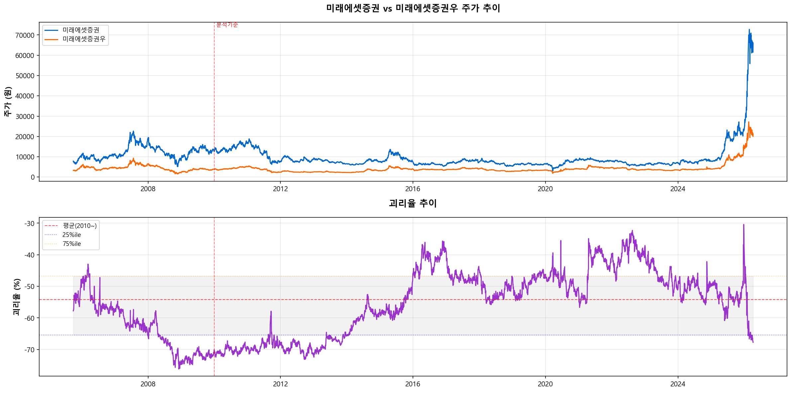

---

## 📌 CJ (001040) vs CJ우 (001045)

**분석 기간**: 2010-01-04 ~ 2026-04-08 (4,000일)
**전체 데이터**: 2000-01-04 ~ 2026-04-08 (6,567일) — 2010년 이전은 참고용

### 현재 상황

| 항목 | 값 |
|:----:|:---|
| CJ | 195,400원 |
| CJ우 | 85,400원 |
| **현재 괴리율** | **-56.29%** |
| 우선주 할인율 | 56.29% |
| 역사적 위치 | 하위 57.3% |
| Z-Score | 0.27σ |
| 종합 점수 | 10점 (±100점 만점) |
| **판정** | **⚪ 중립** |

**판정 근거:**

- ✅ 최근 30일 평균보다 1%p 이상 낮음

### 괴리율 통계 (2010년~)

| 지표 | 값 |
|:----:|:---|
| 평균 | -59.60% |
| 중간값 | -59.36% |
| 표준편차 | 12.28% |
| 최소 (우선주 최저평가) | -83.09% |
| 최대 (우선주 최고평가) | -34.59% |

| 백분위 | 괴리율 | 의미 |
|:-----:|:------:|:-----|
| 10% | -79.93% | 우선주 매우 저평가 |
| 25% | -69.68% | 우선주 저평가 |
| 50% | -59.36% | 중간값 |
| 75% | -49.16% | 우선주 고평가 |
| 90% | -44.18% | 우선주 매우 고평가 |

**📎 참고: 전체 기간 (2000-01-04~) 통계 비교**

| 지표 | 2010년 이후 | 전체 기간 |
|:----:|:----------:|:---------:|
| 평균 | -59.60% | 71.97% |
| 중간값 | -59.36% | -52.44% |
| 표준편차 | 12.28% | 214.82% |
| 최소 | -83.09% | -83.09% |
| 최대 | -34.59% | 845.98% |

### 기간별 괴리율

| 기간 | 평균 | 최소 | 최대 | 현재 대비 |
|:----:|:----:|:----:|:----:|:---------:|
| 최근 1개월 | -55.18% | -57.39% | -51.94% | -1.12%p |
| 최근 3개월 | -53.13% | -57.39% | -48.87% | -3.17%p |
| 최근 6개월 | -50.16% | -57.39% | -42.34% | -6.14%p |
| 최근 1년 | -47.90% | -57.39% | -39.60% | -8.39%p |
| 최근 3년 | -46.88% | -58.15% | -34.59% | -9.42%p |
| 최근 5년 | -49.21% | -63.67% | -34.59% | -7.08%p |

### 시장 상황별 괴리율

| 구분 | 기간 | 평균 괴리율 | 중간값 |
|:----:|:----:|:----------:|:------:|
| 상승장 | 1281일 (32.0%) | -60.83% | -59.28% |
| 하락장 | 1033일 (25.8%) | -57.75% | -59.03% |
| 중립장 | 1686일 (42.1%) | -59.80% | -59.91% |

### 역사적 극단값 (Top 5)

**🟦 우선주 최저평가 시점 (괴리율 최저)**

| 날짜 | CJ | CJ우 | 괴리율 |
|:----:|--------:|----------:|:------:|
| 2013-02-28 | 105,339원 | 17,815원 | **-83.09%** |
| 2012-10-29 | 76,722원 | 13,029원 | **-83.02%** |
| 2013-02-21 | 95,474원 | 16,273원 | **-82.96%** |
| 2013-02-05 | 95,122원 | 16,216원 | **-82.95%** |
| 2013-02-27 | 101,464원 | 17,329원 | **-82.92%** |

**🟥 보통주 최저평가 시점 (괴리율 최고)**

| 날짜 | CJ | CJ우 | 괴리율 |
|:----:|--------:|----------:|:------:|
| 2023-07-13 | 57,779원 | 37,792원 | **-34.59%** |
| 2023-07-26 | 57,873원 | 37,530원 | **-35.15%** |
| 2023-07-12 | 58,529원 | 37,749원 | **-35.51%** |
| 2023-07-10 | 57,591원 | 37,049원 | **-35.67%** |
| 2023-07-14 | 58,623원 | 37,661원 | **-35.76%** |

### 차트

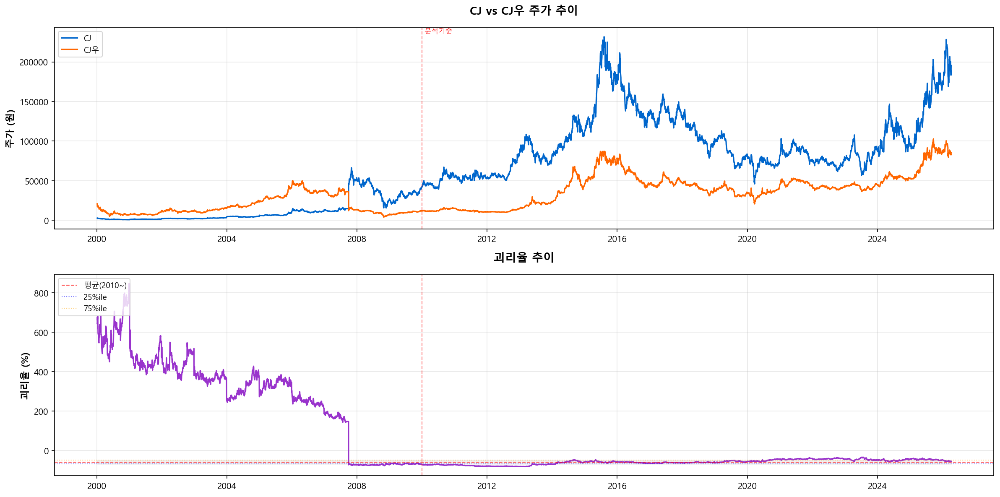

---

## 📌 대상 (001680) vs 대상우 (001685)

**분석 기간**: 2010-01-04 ~ 2026-04-08 (4,000일)
**전체 데이터**: 2005-09-29 ~ 2026-04-08 (5,070일) — 2010년 이전은 참고용

### 현재 상황

| 항목 | 값 |
|:----:|:---|
| 대상 | 20,050원 |
| 대상우 | 16,170원 |
| **현재 괴리율** | **-19.35%** |
| 우선주 할인율 | 19.35% |
| 역사적 위치 | 하위 95.4% |
| Z-Score | 1.43σ |
| 종합 점수 | -60점 (±100점 만점) |
| **판정** | **🟥 보통주 강력 매수** |

**판정 근거:**

- ❌ 역사적 상위 10% (우선주 매우 고평가)
- ❌ 평균 대비 1.0σ 이상 높음

### 괴리율 통계 (2010년~)

| 지표 | 값 |
|:----:|:---|
| 평균 | -50.21% |
| 중간값 | -55.19% |
| 표준편차 | 21.61% |
| 최소 (우선주 최저평가) | -85.54% |
| 최대 (우선주 최고평가) | 54.56% |

| 백분위 | 괴리율 | 의미 |
|:-----:|:------:|:-----|
| 10% | -77.71% | 우선주 매우 저평가 |
| 25% | -67.23% | 우선주 저평가 |
| 50% | -55.19% | 중간값 |
| 75% | -28.79% | 우선주 고평가 |
| 90% | -22.68% | 우선주 매우 고평가 |

**📎 참고: 전체 기간 (2005-09-29~) 통계 비교**

| 지표 | 2010년 이후 | 전체 기간 |
|:----:|:----------:|:---------:|
| 평균 | -50.21% | -53.62% |
| 중간값 | -55.19% | -59.48% |
| 표준편차 | 21.61% | 20.40% |
| 최소 | -85.54% | -85.54% |
| 최대 | 54.56% | 54.56% |

### 기간별 괴리율

| 기간 | 평균 | 최소 | 최대 | 현재 대비 |
|:----:|:----:|:----:|:----:|:---------:|
| 최근 1개월 | -19.45% | -25.63% | -17.35% | +0.10%p |
| 최근 3개월 | -21.18% | -26.25% | -16.68% | +1.83%p |
| 최근 6개월 | -22.71% | -29.90% | -16.68% | +3.36%p |
| 최근 1년 | -23.15% | -33.74% | -14.79% | +3.80%p |
| 최근 3년 | -22.60% | -33.74% | 54.56% | +3.25%p |
| 최근 5년 | -30.42% | -58.52% | 54.56% | +11.06%p |

### 시장 상황별 괴리율

| 구분 | 기간 | 평균 괴리율 | 중간값 |
|:----:|:----:|:----------:|:------:|
| 상승장 | 1214일 (30.3%) | -58.74% | -63.67% |
| 하락장 | 969일 (24.2%) | -49.36% | -54.17% |
| 중립장 | 1817일 (45.4%) | -44.96% | -47.13% |

### 역사적 극단값 (Top 5)

**🟦 우선주 최저평가 시점 (괴리율 최저)**

| 날짜 | 대상 | 대상우 | 괴리율 |
|:----:|--------:|----------:|:------:|
| 2013-03-26 | 25,069원 | 3,624원 | **-85.54%** |
| 2013-03-27 | 26,159원 | 3,806원 | **-85.45%** |
| 2013-03-22 | 24,742원 | 3,600원 | **-85.45%** |
| 2013-03-28 | 26,631원 | 3,878원 | **-85.44%** |
| 2013-03-15 | 24,197원 | 3,528원 | **-85.42%** |

**🟥 보통주 최저평가 시점 (괴리율 최고)**

| 날짜 | 대상 | 대상우 | 괴리율 |
|:----:|--------:|----------:|:------:|
| 2023-12-18 | 18,434원 | 28,493원 | **54.56%** |
| 2023-12-14 | 18,835원 | 28,667원 | **52.20%** |
| 2023-12-19 | 18,390원 | 26,965원 | **46.63%** |
| 2023-12-15 | 18,568원 | 27,053원 | **45.70%** |
| 2023-12-20 | 18,657원 | 26,005원 | **39.39%** |

### 차트

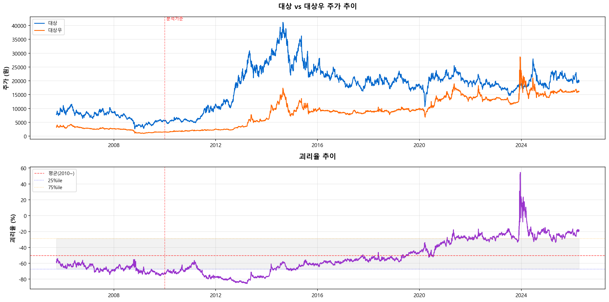

---

## 📌 SK (034730) vs SK우 (03473K)

**분석 기간**: 2015-08-17 ~ 2026-04-08 (2,606일)

### 현재 상황

| 항목 | 값 |
|:----:|:---|
| SK | 334,500원 |
| SK우 | 251,500원 |
| **현재 괴리율** | **-24.81%** |
| 우선주 할인율 | 24.81% |
| 역사적 위치 | 하위 46.9% |
| Z-Score | 0.16σ |
| 종합 점수 | -10점 (±100점 만점) |
| **판정** | **⚪ 중립** |

**판정 근거:**

- ❌ 최근 30일 평균보다 1%p 이상 높음

### 괴리율 통계

| 지표 | 값 |
|:----:|:---|
| 평균 | -27.35% |
| 중간값 | -22.53% |
| 표준편차 | 16.17% |
| 최소 (우선주 최저평가) | -53.66% |
| 최대 (우선주 최고평가) | 50.62% |

| 백분위 | 괴리율 | 의미 |
|:-----:|:------:|:-----|
| 10% | -47.94% | 우선주 매우 저평가 |
| 25% | -43.71% | 우선주 저평가 |
| 50% | -22.53% | 중간값 |
| 75% | -14.02% | 우선주 고평가 |
| 90% | -10.24% | 우선주 매우 고평가 |

### 기간별 괴리율

| 기간 | 평균 | 최소 | 최대 | 현재 대비 |
|:----:|:----:|:----:|:----:|:---------:|
| 최근 1개월 | -26.85% | -30.36% | -22.40% | +2.04%p |
| 최근 3개월 | -26.85% | -30.36% | -22.40% | +2.04%p |
| 최근 6개월 | -24.88% | -30.36% | -15.24% | +0.07%p |
| 최근 1년 | -20.43% | -30.36% | -7.52% | -4.38%p |
| 최근 3년 | -17.23% | -30.36% | 15.96% | -7.58%p |
| 최근 5년 | -19.65% | -53.66% | 50.62% | -5.17%p |

### 시장 상황별 괴리율

| 구분 | 기간 | 평균 괴리율 | 중간값 |
|:----:|:----:|:----------:|:------:|
| 상승장 | 586일 (22.5%) | -26.22% | -24.81% |
| 하락장 | 630일 (24.2%) | -21.48% | -15.91% |
| 중립장 | 1390일 (53.3%) | -30.49% | -33.46% |

### 역사적 극단값 (Top 5)

**🟦 우선주 최저평가 시점 (괴리율 최저)**

| 날짜 | SK | SK우 | 괴리율 |
|:----:|--------:|----------:|:------:|
| 2018-12-21 | 212,815원 | 98,612원 | **-53.66%** |
| 2018-12-19 | 215,997원 | 100,117원 | **-53.65%** |
| 2018-05-18 | 240,125원 | 111,374원 | **-53.62%** |
| 2019-01-17 | 215,796원 | 100,229원 | **-53.55%** |
| 2018-12-17 | 218,782원 | 101,623원 | **-53.55%** |

**🟥 보통주 최저평가 시점 (괴리율 최고)**

| 날짜 | SK | SK우 | 괴리율 |
|:----:|--------:|----------:|:------:|
| 2020-06-30 | 240,677원 | 362,516원 | **50.62%** |
| 2020-06-18 | 254,277원 | 378,368원 | **48.80%** |
| 2020-07-01 | 245,640원 | 361,714원 | **47.25%** |
| 2020-06-17 | 262,107원 | 375,968원 | **43.44%** |
| 2020-06-16 | 253,041원 | 340,371원 | **34.51%** |

### 차트

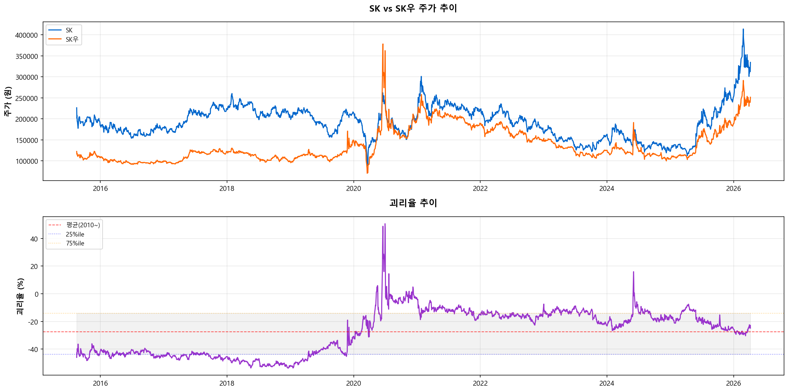

---

## 📌 한화 (000880) vs 한화3우B (00088K)

**분석 기간**: 2016-10-19 ~ 2026-04-08 (2,318일)

### 현재 상황

| 항목 | 값 |
|:----:|:---|
| 한화 | 122,900원 |
| 한화3우B | 46,500원 |
| **현재 괴리율** | **-62.16%** |
| 우선주 할인율 | 62.16% |
| 역사적 위치 | 하위 18.0% |
| Z-Score | -1.03σ |
| 종합 점수 | 55점 (±100점 만점) |
| **판정** | **🟦 우선주 강력 매수** |

**판정 근거:**

- ✅ 역사적 하위 25% (우선주 저평가)
- ✅ 평균 대비 1.0σ 이상 낮음
- ✅ 최근 30일 평균보다 1%p 이상 낮음

### 괴리율 통계

| 지표 | 값 |
|:----:|:---|
| 평균 | -56.09% |
| 중간값 | -56.04% |
| 표준편차 | 5.89% |
| 최소 (우선주 최저평가) | -68.35% |
| 최대 (우선주 최고평가) | -37.82% |

| 백분위 | 괴리율 | 의미 |
|:-----:|:------:|:-----|
| 10% | -64.39% | 우선주 매우 저평가 |
| 25% | -60.85% | 우선주 저평가 |
| 50% | -56.04% | 중간값 |
| 75% | -51.23% | 우선주 고평가 |
| 90% | -48.17% | 우선주 매우 고평가 |

### 기간별 괴리율

| 기간 | 평균 | 최소 | 최대 | 현재 대비 |
|:----:|:----:|:----:|:----:|:---------:|
| 최근 1개월 | -60.89% | -62.61% | -59.20% | -1.28%p |
| 최근 3개월 | -58.65% | -62.61% | -54.15% | -3.51%p |
| 최근 6개월 | -58.14% | -62.61% | -53.61% | -4.02%p |
| 최근 1년 | -55.80% | -64.11% | -44.91% | -6.37%p |
| 최근 3년 | -52.44% | -64.11% | -43.97% | -9.73%p |
| 최근 5년 | -53.93% | -64.11% | -37.82% | -8.23%p |

### 시장 상황별 괴리율

| 구분 | 기간 | 평균 괴리율 | 중간값 |
|:----:|:----:|:----------:|:------:|
| 상승장 | 664일 (28.6%) | -57.97% | -58.24% |
| 하락장 | 520일 (22.4%) | -54.49% | -54.15% |
| 중립장 | 1134일 (48.9%) | -55.72% | -55.02% |

### 역사적 극단값 (Top 5)

**🟦 우선주 최저평가 시점 (괴리율 최저)**

| 날짜 | 한화 | 한화3우B | 괴리율 |
|:----:|--------:|----------:|:------:|
| 2017-08-11 | 41,507원 | 13,138원 | **-68.35%** |
| 2017-08-16 | 41,831원 | 13,301원 | **-68.20%** |
| 2017-08-18 | 41,912원 | 13,366원 | **-68.11%** |
| 2017-08-24 | 41,669원 | 13,301원 | **-68.08%** |
| 2017-08-14 | 41,102원 | 13,138원 | **-68.04%** |

**🟥 보통주 최저평가 시점 (괴리율 최고)**

| 날짜 | 한화 | 한화3우B | 괴리율 |
|:----:|--------:|----------:|:------:|
| 2020-03-19 | 10,816원 | 6,725원 | **-37.82%** |
| 2020-03-18 | 12,763원 | 7,431원 | **-41.78%** |
| 2020-03-23 | 10,426원 | 5,974원 | **-42.70%** |
| 2020-03-13 | 14,710원 | 8,285원 | **-43.67%** |
| 2020-03-20 | 11,897원 | 6,688원 | **-43.79%** |

### 차트

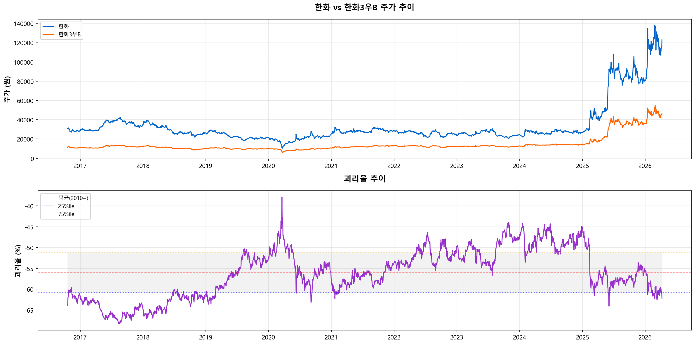

---

## 📌 LG (003550) vs LG우 (003555)

**분석 기간**: 2010-01-04 ~ 2026-04-08 (4,000일)
**전체 데이터**: 2005-09-29 ~ 2026-04-08 (5,070일) — 2010년 이전은 참고용

### 현재 상황

| 항목 | 값 |
|:----:|:---|
| LG | 91,600원 |
| LG우 | 67,100원 |
| **현재 괴리율** | **-26.75%** |
| 우선주 할인율 | 26.75% |
| 역사적 위치 | 하위 82.7% |
| Z-Score | 1.16σ |
| 종합 점수 | -35점 (±100점 만점) |
| **판정** | **🟥 보통주 매수** |

**판정 근거:**

- ❌ 역사적 상위 25% (우선주 고평가)
- ❌ 평균 대비 1.0σ 이상 높음
- ✅ 최근 30일 평균보다 1%p 이상 낮음

### 괴리율 통계 (2010년~)

| 지표 | 값 |
|:----:|:---|
| 평균 | -46.97% |
| 중간값 | -48.40% |
| 표준편차 | 17.47% |
| 최소 (우선주 최저평가) | -77.01% |
| 최대 (우선주 최고평가) | -12.16% |

| 백분위 | 괴리율 | 의미 |
|:-----:|:------:|:-----|
| 10% | -73.09% | 우선주 매우 저평가 |
| 25% | -56.93% | 우선주 저평가 |
| 50% | -48.40% | 중간값 |
| 75% | -29.56% | 우선주 고평가 |
| 90% | -23.69% | 우선주 매우 고평가 |

**📎 참고: 전체 기간 (2005-09-29~) 통계 비교**

| 지표 | 2010년 이후 | 전체 기간 |
|:----:|:----------:|:---------:|
| 평균 | -46.97% | -51.00% |
| 중간값 | -48.40% | -51.88% |
| 표준편차 | 17.47% | 17.56% |
| 최소 | -77.01% | -77.01% |
| 최대 | -12.16% | -12.16% |

### 기간별 괴리율

| 기간 | 평균 | 최소 | 최대 | 현재 대비 |
|:----:|:----:|:----:|:----:|:---------:|
| 최근 1개월 | -24.04% | -26.75% | -21.36% | -2.71%p |
| 최근 3개월 | -21.63% | -26.75% | -15.65% | -5.12%p |
| 최근 6개월 | -20.21% | -26.75% | -13.17% | -6.54%p |
| 최근 1년 | -20.45% | -26.75% | -12.16% | -6.29%p |
| 최근 3년 | -24.84% | -34.96% | -12.16% | -1.91%p |
| 최근 5년 | -31.68% | -53.92% | -12.16% | +4.93%p |

### 시장 상황별 괴리율

| 구분 | 기간 | 평균 괴리율 | 중간값 |
|:----:|:----:|:----------:|:------:|
| 상승장 | 921일 (23.0%) | -49.38% | -50.28% |
| 하락장 | 808일 (20.2%) | -47.65% | -47.76% |
| 중립장 | 2271일 (56.8%) | -45.76% | -47.96% |

### 역사적 극단값 (Top 5)

**🟦 우선주 최저평가 시점 (괴리율 최저)**

| 날짜 | LG | LG우 | 괴리율 |
|:----:|--------:|----------:|:------:|
| 2011-04-22 | 73,676원 | 16,936원 | **-77.01%** |
| 2011-04-21 | 73,158원 | 16,936원 | **-76.85%** |
| 2011-04-20 | 71,385원 | 16,775원 | **-76.50%** |
| 2011-04-25 | 73,380원 | 17,285원 | **-76.44%** |
| 2011-05-18 | 73,084원 | 17,258원 | **-76.39%** |

**🟥 보통주 최저평가 시점 (괴리율 최고)**

| 날짜 | LG | LG우 | 괴리율 |
|:----:|--------:|----------:|:------:|
| 2025-04-11 | 59,276원 | 52,067원 | **-12.16%** |
| 2025-04-10 | 58,698원 | 51,400원 | **-12.43%** |
| 2025-10-10 | 69,618원 | 60,447원 | **-13.17%** |
| 2025-04-09 | 56,385원 | 48,825원 | **-13.41%** |
| 2025-10-01 | 69,618원 | 59,963원 | **-13.87%** |

### 차트

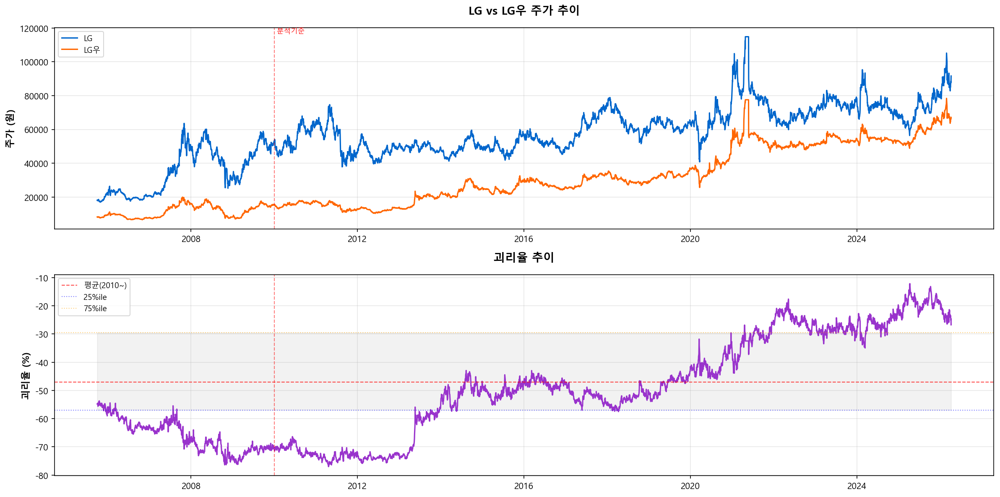

---

## 📌 GS (078930) vs GS우 (078935)

**분석 기간**: 2010-01-04 ~ 2026-04-08 (4,000일)
**전체 데이터**: 2005-09-29 ~ 2026-04-08 (5,070일) — 2010년 이전은 참고용

### 현재 상황

| 항목 | 값 |
|:----:|:---|
| GS | 68,200원 |
| GS우 | 53,900원 |
| **현재 괴리율** | **-20.97%** |
| 우선주 할인율 | 20.97% |
| 역사적 위치 | 하위 74.6% |
| Z-Score | 0.85σ |
| 종합 점수 | 10점 (±100점 만점) |
| **판정** | **⚪ 중립** |

**판정 근거:**

- ✅ 최근 30일 평균보다 1%p 이상 낮음

### 괴리율 통계 (2010년~)

| 지표 | 값 |
|:----:|:---|
| 평균 | -38.61% |
| 중간값 | -38.24% |
| 표준편차 | 20.85% |
| 최소 (우선주 최저평가) | -78.71% |
| 최대 (우선주 최고평가) | 1.02% |

| 백분위 | 괴리율 | 의미 |
|:-----:|:------:|:-----|
| 10% | -72.21% | 우선주 매우 저평가 |
| 25% | -54.86% | 우선주 저평가 |
| 50% | -38.24% | 중간값 |
| 75% | -20.81% | 우선주 고평가 |
| 90% | -13.61% | 우선주 매우 고평가 |

**📎 참고: 전체 기간 (2005-09-29~) 통계 비교**

| 지표 | 2010년 이후 | 전체 기간 |
|:----:|:----------:|:---------:|
| 평균 | -38.61% | -42.63% |
| 중간값 | -38.24% | -43.03% |
| 표준편차 | 20.85% | 20.21% |
| 최소 | -78.71% | -78.71% |
| 최대 | 1.02% | 1.02% |

### 기간별 괴리율

| 기간 | 평균 | 최소 | 최대 | 현재 대비 |
|:----:|:----:|:----:|:----:|:---------:|
| 최근 1개월 | -18.15% | -21.94% | -14.93% | -2.82%p |
| 최근 3개월 | -17.60% | -22.43% | -11.90% | -3.37%p |
| 최근 6개월 | -13.67% | -22.43% | -4.90% | -7.30%p |
| 최근 1년 | -9.95% | -22.43% | 0.36% | -11.02%p |
| 최근 3년 | -15.24% | -29.71% | 1.02% | -5.73%p |
| 최근 5년 | -19.97% | -38.59% | 1.02% | -1.00%p |

### 시장 상황별 괴리율

| 구분 | 기간 | 평균 괴리율 | 중간값 |
|:----:|:----:|:----------:|:------:|
| 상승장 | 1124일 (28.1%) | -43.81% | -43.54% |
| 하락장 | 858일 (21.4%) | -39.48% | -38.13% |
| 중립장 | 2018일 (50.4%) | -35.33% | -35.82% |

### 역사적 극단값 (Top 5)

**🟦 우선주 최저평가 시점 (괴리율 최저)**

| 날짜 | GS | GS우 | 괴리율 |
|:----:|--------:|----------:|:------:|
| 2011-04-21 | 57,127원 | 12,160원 | **-78.71%** |
| 2011-03-29 | 53,799원 | 11,500원 | **-78.62%** |
| 2011-04-25 | 56,018원 | 12,011원 | **-78.56%** |
| 2011-04-22 | 55,741원 | 12,011원 | **-78.45%** |
| 2011-04-07 | 52,524원 | 11,372원 | **-78.35%** |

**🟥 보통주 최저평가 시점 (괴리율 최고)**

| 날짜 | GS | GS우 | 괴리율 |
|:----:|--------:|----------:|:------:|
| 2024-07-26 | 42,470원 | 42,905원 | **1.02%** |
| 2025-02-28 | 34,575원 | 34,699원 | **0.36%** |
| 2025-03-04 | 34,239원 | 34,176원 | **-0.18%** |
| 2025-03-05 | 34,287원 | 34,176원 | **-0.32%** |
| 2025-04-09 | 33,472원 | 33,178원 | **-0.88%** |

### 차트

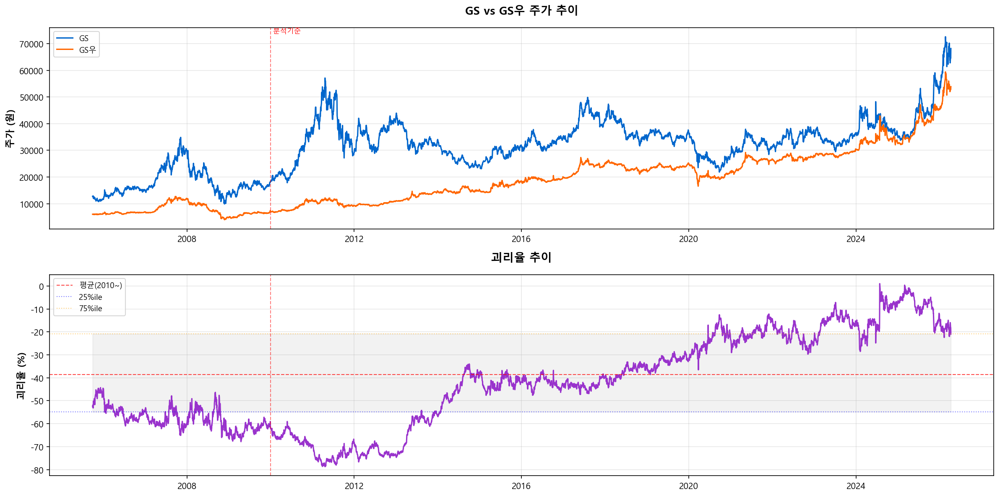

---

## 📌 두산 (000150) vs 두산우 (000155)

**분석 기간**: 2010-01-04 ~ 2026-04-08 (4,000일)
**전체 데이터**: 2000-01-04 ~ 2026-04-08 (6,567일) — 2010년 이전은 참고용

### 현재 상황

| 항목 | 값 |
|:----:|:---|
| 두산 | 1,194,000원 |
| 두산우 | 487,000원 |
| **현재 괴리율** | **-59.21%** |
| 우선주 할인율 | 59.21% |
| 역사적 위치 | 하위 27.6% |
| Z-Score | -0.49σ |
| 종합 점수 | 10점 (±100점 만점) |
| **판정** | **⚪ 중립** |

**판정 근거:**

- ✅ 최근 30일 평균보다 1%p 이상 낮음

### 괴리율 통계 (2010년~)

| 지표 | 값 |
|:----:|:---|
| 평균 | -49.93% |
| 중간값 | -46.51% |
| 표준편차 | 18.90% |
| 최소 (우선주 최저평가) | -84.18% |
| 최대 (우선주 최고평가) | 2.80% |

| 백분위 | 괴리율 | 의미 |
|:-----:|:------:|:-----|
| 10% | -79.55% | 우선주 매우 저평가 |
| 25% | -64.95% | 우선주 저평가 |
| 50% | -46.51% | 중간값 |
| 75% | -37.12% | 우선주 고평가 |
| 90% | -26.95% | 우선주 매우 고평가 |

**📎 참고: 전체 기간 (2000-01-04~) 통계 비교**

| 지표 | 2010년 이후 | 전체 기간 |
|:----:|:----------:|:---------:|
| 평균 | -49.93% | -59.83% |
| 중간값 | -46.51% | -67.72% |
| 표준편차 | 18.90% | 19.53% |
| 최소 | -84.18% | -89.30% |
| 최대 | 2.80% | 2.80% |

### 기간별 괴리율

| 기간 | 평균 | 최소 | 최대 | 현재 대비 |
|:----:|:----:|:----:|:----:|:---------:|
| 최근 1개월 | -55.21% | -59.76% | -50.81% | -4.00%p |
| 최근 3개월 | -46.03% | -59.76% | -35.25% | -13.18%p |
| 최근 6개월 | -42.17% | -59.76% | -31.88% | -17.05%p |
| 최근 1년 | -45.86% | -59.87% | -22.69% | -13.36%p |
| 최근 3년 | -43.46% | -63.14% | -15.67% | -15.75%p |
| 최근 5년 | -36.66% | -63.14% | 2.80% | -22.55%p |

### 시장 상황별 괴리율

| 구분 | 기간 | 평균 괴리율 | 중간값 |
|:----:|:----:|:----------:|:------:|
| 상승장 | 1400일 (35.0%) | -51.98% | -49.19% |
| 하락장 | 1046일 (26.2%) | -43.74% | -40.96% |
| 중립장 | 1554일 (38.9%) | -52.24% | -47.67% |

### 역사적 극단값 (Top 5)

**🟦 우선주 최저평가 시점 (괴리율 최저)**

| 날짜 | 두산 | 두산우 | 괴리율 |
|:----:|--------:|----------:|:------:|
| 2012-02-09 | 119,456원 | 18,901원 | **-84.18%** |
| 2012-02-06 | 118,030원 | 18,901원 | **-83.99%** |
| 2012-02-10 | 117,317원 | 18,953원 | **-83.84%** |
| 2012-02-03 | 116,960원 | 18,901원 | **-83.84%** |
| 2012-02-15 | 119,100원 | 19,290원 | **-83.80%** |

**🟥 보통주 최저평가 시점 (괴리율 최고)**

| 날짜 | 두산 | 두산우 | 괴리율 |
|:----:|--------:|----------:|:------:|
| 2020-06-18 | 37,870원 | 38,929원 | **2.80%** |
| 2020-03-26 | 33,079원 | 32,229원 | **-2.57%** |
| 2020-03-18 | 29,283원 | 28,285원 | **-3.41%** |
| 2020-06-19 | 36,604원 | 35,324원 | **-3.50%** |
| 2020-06-17 | 38,457원 | 36,554원 | **-4.95%** |

### 차트

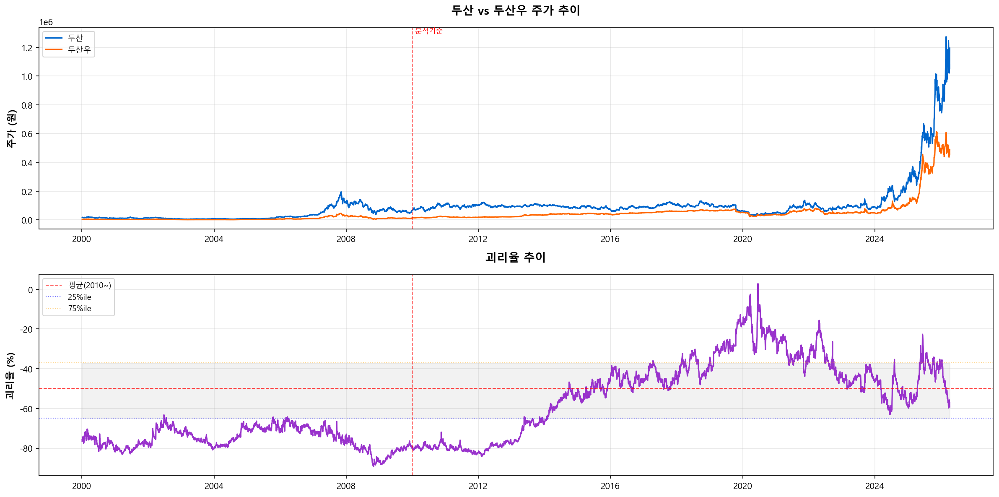

---

## 📌 아모레퍼시픽 (090430) vs 아모레퍼시픽우 (090435)

**분석 기간**: 2010-01-04 ~ 2026-04-08 (4,000일)
**전체 데이터**: 2006-06-29 ~ 2026-04-08 (4,881일) — 2010년 이전은 참고용

### 현재 상황

| 항목 | 값 |
|:----:|:---|
| 아모레퍼시픽 | 129,900원 |
| 아모레퍼시픽우 | 45,550원 |
| **현재 괴리율** | **-64.93%** |
| 우선주 할인율 | 64.93% |
| 역사적 위치 | 하위 52.0% |
| Z-Score | -0.14σ |
| 종합 점수 | 0점 (±100점 만점) |
| **판정** | **⚪ 중립** |

### 괴리율 통계 (2010년~)

| 지표 | 값 |
|:----:|:---|
| 평균 | -63.53% |
| 중간값 | -65.73% |
| 표준편차 | 10.28% |
| 최소 (우선주 최저평가) | -81.90% |
| 최대 (우선주 최고평가) | -39.31% |

| 백분위 | 괴리율 | 의미 |
|:-----:|:------:|:-----|
| 10% | -76.70% | 우선주 매우 저평가 |
| 25% | -72.10% | 우선주 저평가 |
| 50% | -65.73% | 중간값 |
| 75% | -54.25% | 우선주 고평가 |
| 90% | -48.94% | 우선주 매우 고평가 |

**📎 참고: 전체 기간 (2006-06-29~) 통계 비교**

| 지표 | 2010년 이후 | 전체 기간 |
|:----:|:----------:|:---------:|
| 평균 | -63.53% | -65.31% |
| 중간값 | -65.73% | -67.01% |
| 표준편차 | 10.28% | 10.51% |
| 최소 | -81.90% | -87.29% |
| 최대 | -39.31% | -39.31% |

### 기간별 괴리율

| 기간 | 평균 | 최소 | 최대 | 현재 대비 |
|:----:|:----:|:----:|:----:|:---------:|
| 최근 1개월 | -65.67% | -67.32% | -63.80% | +0.74%p |
| 최근 3개월 | -64.68% | -67.74% | -62.39% | -0.25%p |
| 최근 6개월 | -65.67% | -68.02% | -62.39% | +0.74%p |
| 최근 1년 | -67.99% | -73.51% | -62.39% | +3.05%p |
| 최근 3년 | -67.75% | -75.83% | -51.56% | +2.82%p |
| 최근 5년 | -64.94% | -75.83% | -46.66% | +0.01%p |

### 시장 상황별 괴리율

| 구분 | 기간 | 평균 괴리율 | 중간값 |
|:----:|:----:|:----------:|:------:|
| 상승장 | 1296일 (32.4%) | -64.10% | -64.87% |
| 하락장 | 1192일 (29.8%) | -61.71% | -64.35% |
| 중립장 | 1512일 (37.8%) | -64.48% | -66.46% |

### 역사적 극단값 (Top 5)

**🟦 우선주 최저평가 시점 (괴리율 최저)**

| 날짜 | 아모레퍼시픽 | 아모레퍼시픽우 | 괴리율 |
|:----:|--------:|----------:|:------:|
| 2011-10-27 | 118,892원 | 21,517원 | **-81.90%** |
| 2011-10-05 | 114,761원 | 21,201원 | **-81.53%** |
| 2011-10-25 | 111,364원 | 20,609원 | **-81.49%** |
| 2011-06-02 | 118,066원 | 21,912원 | **-81.44%** |
| 2011-10-06 | 117,331원 | 21,833원 | **-81.39%** |

**🟥 보통주 최저평가 시점 (괴리율 최고)**

| 날짜 | 아모레퍼시픽 | 아모레퍼시픽우 | 괴리율 |
|:----:|--------:|----------:|:------:|
| 2017-05-02 | 273,856원 | 166,209원 | **-39.31%** |
| 2017-05-04 | 296,086원 | 178,600원 | **-39.68%** |
| 2017-01-09 | 282,370원 | 168,345원 | **-40.38%** |
| 2017-04-28 | 276,221원 | 162,364원 | **-41.22%** |
| 2017-05-08 | 315,006원 | 185,009원 | **-41.27%** |

### 차트

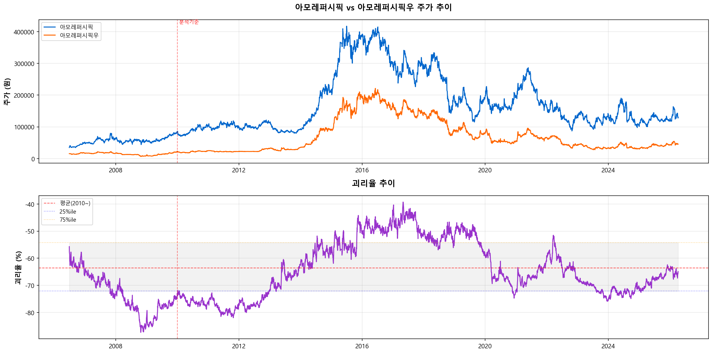

---

## 📌 LG화학 (051910) vs LG화학우 (051915)

**분석 기간**: 2010-01-04 ~ 2026-04-08 (4,000일)
**전체 데이터**: 2005-09-29 ~ 2026-04-08 (5,070일) — 2010년 이전은 참고용

### 현재 상황

| 항목 | 값 |
|:----:|:---|
| LG화학 | 333,000원 |
| LG화학우 | 162,400원 |
| **현재 괴리율** | **-51.23%** |
| 우선주 할인율 | 51.23% |
| 역사적 위치 | 하위 46.6% |
| Z-Score | 0.02σ |
| 종합 점수 | 0점 (±100점 만점) |
| **판정** | **⚪ 중립** |

### 괴리율 통계 (2010년~)

| 지표 | 값 |
|:----:|:---|
| 평균 | -51.47% |
| 중간값 | -50.35% |
| 표준편차 | 12.60% |
| 최소 (우선주 최저평가) | -75.07% |
| 최대 (우선주 최고평가) | -24.75% |

| 백분위 | 괴리율 | 의미 |
|:-----:|:------:|:-----|
| 10% | -71.60% | 우선주 매우 저평가 |
| 25% | -57.77% | 우선주 저평가 |
| 50% | -50.35% | 중간값 |
| 75% | -40.58% | 우선주 고평가 |
| 90% | -35.45% | 우선주 매우 고평가 |

**📎 참고: 전체 기간 (2005-09-29~) 통계 비교**

| 지표 | 2010년 이후 | 전체 기간 |
|:----:|:----------:|:---------:|
| 평균 | -51.47% | -53.90% |
| 중간값 | -50.35% | -53.34% |
| 표준편차 | 12.60% | 12.66% |
| 최소 | -75.07% | -75.07% |
| 최대 | -24.75% | -24.75% |

### 기간별 괴리율

| 기간 | 평균 | 최소 | 최대 | 현재 대비 |
|:----:|:----:|:----:|:----:|:---------:|
| 최근 1개월 | -51.03% | -52.91% | -49.00% | -0.20%p |
| 최근 3개월 | -50.44% | -52.91% | -47.58% | -0.79%p |
| 최근 6개월 | -50.42% | -52.91% | -46.18% | -0.81%p |
| 최근 1년 | -47.02% | -54.64% | -29.28% | -4.21%p |
| 최근 3년 | -46.62% | -59.07% | -29.16% | -4.61%p |
| 최근 5년 | -48.94% | -60.34% | -29.16% | -2.30%p |

### 시장 상황별 괴리율

| 구분 | 기간 | 평균 괴리율 | 중간값 |
|:----:|:----:|:----------:|:------:|
| 상승장 | 1241일 (31.0%) | -53.32% | -52.67% |
| 하락장 | 1166일 (29.1%) | -48.48% | -47.72% |
| 중립장 | 1593일 (39.8%) | -52.22% | -50.03% |

### 역사적 극단값 (Top 5)

**🟦 우선주 최저평가 시점 (괴리율 최저)**

| 날짜 | LG화학 | LG화학우 | 괴리율 |
|:----:|--------:|----------:|:------:|
| 2012-04-16 | 301,157원 | 75,089원 | **-75.07%** |
| 2012-04-17 | 296,165원 | 74,381원 | **-74.89%** |
| 2012-04-13 | 307,396원 | 77,214원 | **-74.88%** |
| 2012-07-11 | 253,321원 | 63,897원 | **-74.78%** |
| 2012-10-02 | 279,527원 | 70,555원 | **-74.76%** |

**🟥 보통주 최저평가 시점 (괴리율 최고)**

| 날짜 | LG화학 | LG화학우 | 괴리율 |
|:----:|--------:|----------:|:------:|
| 2014-12-02 | 166,026원 | 124,938원 | **-24.75%** |
| 2014-11-05 | 148,527원 | 111,309원 | **-25.06%** |
| 2014-12-04 | 169,014원 | 123,803원 | **-26.75%** |
| 2014-12-03 | 167,307원 | 122,288원 | **-26.91%** |
| 2014-11-07 | 160,905원 | 116,988원 | **-27.29%** |

### 차트

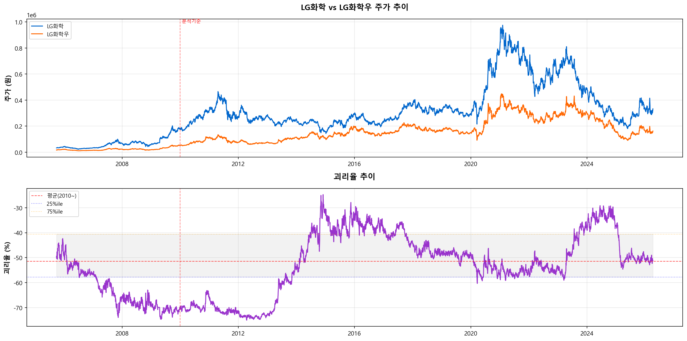

---

## 📌 삼성SDI (006400) vs 삼성SDI우 (006405)

**분석 기간**: 2010-01-04 ~ 2026-04-08 (4,000일)
**전체 데이터**: 2005-09-29 ~ 2026-04-08 (5,070일) — 2010년 이전은 참고용

### 현재 상황

| 항목 | 값 |
|:----:|:---|
| 삼성SDI | 457,000원 |
| 삼성SDI우 | 225,500원 |
| **현재 괴리율** | **-50.66%** |
| 우선주 할인율 | 50.66% |
| 역사적 위치 | 하위 53.3% |
| Z-Score | 0.19σ |
| 종합 점수 | 10점 (±100점 만점) |
| **판정** | **⚪ 중립** |

**판정 근거:**

- ✅ 최근 30일 평균보다 1%p 이상 낮음

### 괴리율 통계 (2010년~)

| 지표 | 값 |
|:----:|:---|
| 평균 | -52.76% |
| 중간값 | -51.83% |
| 표준편차 | 10.79% |
| 최소 (우선주 최저평가) | -72.87% |
| 최대 (우선주 최고평가) | -23.65% |

| 백분위 | 괴리율 | 의미 |
|:-----:|:------:|:-----|
| 10% | -67.72% | 우선주 매우 저평가 |
| 25% | -62.36% | 우선주 저평가 |
| 50% | -51.83% | 중간값 |
| 75% | -44.06% | 우선주 고평가 |
| 90% | -38.68% | 우선주 매우 고평가 |

**📎 참고: 전체 기간 (2005-09-29~) 통계 비교**

| 지표 | 2010년 이후 | 전체 기간 |
|:----:|:----------:|:---------:|
| 평균 | -52.76% | -52.93% |
| 중간값 | -51.83% | -51.99% |
| 표준편차 | 10.79% | 10.43% |
| 최소 | -72.87% | -72.87% |
| 최대 | -23.65% | -23.65% |

### 기간별 괴리율

| 기간 | 평균 | 최소 | 최대 | 현재 대비 |
|:----:|:----:|:----:|:----:|:---------:|
| 최근 1개월 | -45.29% | -51.15% | -40.00% | -5.37%p |
| 최근 3개월 | -43.60% | -51.15% | -37.38% | -7.05%p |
| 최근 6개월 | -40.64% | -51.15% | -32.82% | -10.01%p |
| 최근 1년 | -40.05% | -51.15% | -32.82% | -10.61%p |
| 최근 3년 | -45.56% | -56.60% | -32.82% | -5.10%p |
| 최근 5년 | -47.29% | -63.81% | -23.65% | -3.36%p |

### 시장 상황별 괴리율

| 구분 | 기간 | 평균 괴리율 | 중간값 |
|:----:|:----:|:----------:|:------:|
| 상승장 | 1327일 (33.2%) | -52.91% | -53.45% |
| 하락장 | 1136일 (28.4%) | -49.43% | -47.48% |
| 중립장 | 1537일 (38.4%) | -55.07% | -55.86% |

### 역사적 극단값 (Top 5)

**🟦 우선주 최저평가 시점 (괴리율 최저)**

| 날짜 | 삼성SDI | 삼성SDI우 | 괴리율 |
|:----:|--------:|----------:|:------:|
| 2012-08-20 | 141,303원 | 38,343원 | **-72.87%** |
| 2012-05-15 | 155,760원 | 42,906원 | **-72.45%** |
| 2012-08-21 | 138,505원 | 38,343원 | **-72.32%** |
| 2012-08-22 | 137,572원 | 38,257원 | **-72.19%** |
| 2012-05-21 | 145,967원 | 40,816원 | **-72.04%** |

**🟥 보통주 최저평가 시점 (괴리율 최고)**

| 날짜 | 삼성SDI | 삼성SDI우 | 괴리율 |
|:----:|--------:|----------:|:------:|
| 2021-01-27 | 781,721원 | 596,871원 | **-23.65%** |
| 2021-01-28 | 759,924원 | 573,311원 | **-24.56%** |
| 2021-03-17 | 633,105원 | 465,324원 | **-26.50%** |
| 2021-03-18 | 655,893원 | 481,522원 | **-26.59%** |
| 2020-06-11 | 383,254원 | 279,723원 | **-27.01%** |

### 차트

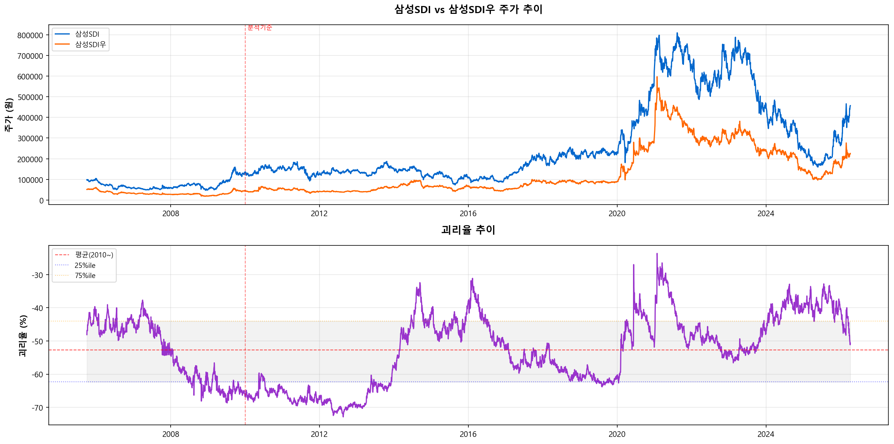

---

## 📌 LG전자 (066570) vs LG전자우 (066575)

**분석 기간**: 2010-01-04 ~ 2026-04-08 (4,000일)
**전체 데이터**: 2005-09-29 ~ 2026-04-08 (5,070일) — 2010년 이전은 참고용

### 현재 상황

| 항목 | 값 |
|:----:|:---|
| LG전자 | 113,700원 |
| LG전자우 | 50,600원 |
| **현재 괴리율** | **-55.50%** |
| 우선주 할인율 | 55.50% |
| 역사적 위치 | 하위 67.5% |
| Z-Score | 0.66σ |
| 종합 점수 | 0점 (±100점 만점) |
| **판정** | **⚪ 중립** |

### 괴리율 통계 (2010년~)

| 지표 | 값 |
|:----:|:---|
| 평균 | -60.29% |
| 중간값 | -58.92% |
| 표준편차 | 7.24% |
| 최소 (우선주 최저평가) | -77.93% |
| 최대 (우선주 최고평가) | -40.47% |

| 백분위 | 괴리율 | 의미 |
|:-----:|:------:|:-----|
| 10% | -70.12% | 우선주 매우 저평가 |
| 25% | -64.96% | 우선주 저평가 |
| 50% | -58.92% | 중간값 |
| 75% | -54.54% | 우선주 고평가 |
| 90% | -51.93% | 우선주 매우 고평가 |

**📎 참고: 전체 기간 (2005-09-29~) 통계 비교**

| 지표 | 2010년 이후 | 전체 기간 |
|:----:|:----------:|:---------:|
| 평균 | -60.29% | -59.70% |
| 중간값 | -58.92% | -58.84% |
| 표준편차 | 7.24% | 7.24% |
| 최소 | -77.93% | -77.93% |
| 최대 | -40.47% | -40.47% |

### 기간별 괴리율

| 기간 | 평균 | 최소 | 최대 | 현재 대비 |
|:----:|:----:|:----:|:----:|:---------:|
| 최근 1개월 | -54.59% | -55.76% | -53.21% | -0.90%p |
| 최근 3개월 | -50.90% | -56.58% | -44.94% | -4.60%p |
| 최근 6개월 | -50.36% | -56.58% | -40.47% | -5.14%p |
| 최근 1년 | -51.16% | -56.58% | -40.47% | -4.34%p |
| 최근 3년 | -53.90% | -60.02% | -40.47% | -1.59%p |
| 최근 5년 | -56.76% | -67.74% | -40.47% | +1.26%p |

### 시장 상황별 괴리율

| 구분 | 기간 | 평균 괴리율 | 중간값 |
|:----:|:----:|:----------:|:------:|
| 상승장 | 1171일 (29.3%) | -61.01% | -60.10% |
| 하락장 | 1154일 (28.8%) | -59.97% | -58.76% |
| 중립장 | 1675일 (41.9%) | -60.00% | -57.99% |

### 역사적 극단값 (Top 5)

**🟦 우선주 최저평가 시점 (괴리율 최저)**

| 날짜 | LG전자 | LG전자우 | 괴리율 |
|:----:|--------:|----------:|:------:|
| 2012-10-25 | 66,108원 | 14,593원 | **-77.93%** |
| 2012-10-19 | 65,750원 | 14,555원 | **-77.86%** |
| 2012-10-29 | 67,092원 | 14,861원 | **-77.85%** |
| 2012-10-23 | 65,302원 | 14,478원 | **-77.83%** |
| 2012-10-26 | 65,302원 | 14,555원 | **-77.71%** |

**🟥 보통주 최저평가 시점 (괴리율 최고)**

| 날짜 | LG전자 | LG전자우 | 괴리율 |
|:----:|--------:|----------:|:------:|
| 2025-11-07 | 87,630원 | 52,167원 | **-40.47%** |
| 2025-11-06 | 91,004원 | 52,854원 | **-41.92%** |
| 2025-11-10 | 88,920원 | 51,282원 | **-42.33%** |
| 2025-11-13 | 91,798원 | 52,363원 | **-42.96%** |
| 2025-11-11 | 89,912원 | 51,184원 | **-43.07%** |

### 차트

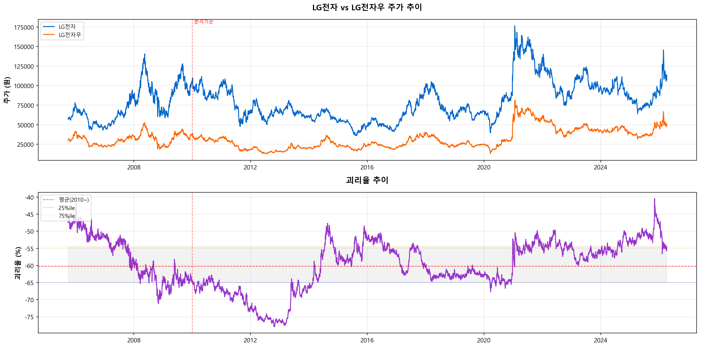

---

## 📌 삼성화재 (000810) vs 삼성화재우 (000815)

**분석 기간**: 2010-01-04 ~ 2026-04-08 (4,000일)
**전체 데이터**: 2005-09-29 ~ 2026-04-08 (5,070일) — 2010년 이전은 참고용

### 현재 상황

| 항목 | 값 |
|:----:|:---|
| 삼성화재 | 470,000원 |
| 삼성화재우 | 375,500원 |
| **현재 괴리율** | **-20.11%** |
| 우선주 할인율 | 20.11% |
| 역사적 위치 | 하위 99.5% |
| Z-Score | 1.45σ |
| 종합 점수 | -60점 (±100점 만점) |
| **판정** | **🟥 보통주 강력 매수** |

**판정 근거:**

- ❌ 역사적 상위 10% (우선주 매우 고평가)
- ❌ 평균 대비 1.0σ 이상 높음

### 괴리율 통계 (2010년~)

| 지표 | 값 |
|:----:|:---|
| 평균 | -43.55% |
| 중간값 | -41.33% |
| 표준편차 | 16.20% |
| 최소 (우선주 최저평가) | -75.65% |
| 최대 (우선주 최고평가) | -14.33% |

| 백분위 | 괴리율 | 의미 |
|:-----:|:------:|:-----|
| 10% | -70.48% | 우선주 매우 저평가 |
| 25% | -53.20% | 우선주 저평가 |
| 50% | -41.33% | 중간값 |
| 75% | -28.75% | 우선주 고평가 |
| 90% | -25.27% | 우선주 매우 고평가 |

**📎 참고: 전체 기간 (2005-09-29~) 통계 비교**

| 지표 | 2010년 이후 | 전체 기간 |
|:----:|:----------:|:---------:|
| 평균 | -43.55% | -48.52% |
| 중간값 | -41.33% | -44.92% |
| 표준편차 | 16.20% | 17.48% |
| 최소 | -75.65% | -80.28% |
| 최대 | -14.33% | -14.33% |

### 기간별 괴리율

| 기간 | 평균 | 최소 | 최대 | 현재 대비 |
|:----:|:----:|:----:|:----:|:---------:|
| 최근 1개월 | -19.55% | -24.77% | -14.33% | -0.56%p |
| 최근 3개월 | -23.33% | -40.46% | -14.33% | +3.22%p |
| 최근 6개월 | -24.34% | -40.46% | -14.33% | +4.23%p |
| 최근 1년 | -25.11% | -40.46% | -14.33% | +5.01%p |
| 최근 3년 | -26.26% | -40.46% | -14.33% | +6.15%p |
| 최근 5년 | -29.66% | -46.30% | -14.33% | +9.55%p |

### 시장 상황별 괴리율

| 구분 | 기간 | 평균 괴리율 | 중간값 |
|:----:|:----:|:----------:|:------:|
| 상승장 | 841일 (21.0%) | -41.34% | -36.01% |
| 하락장 | 527일 (13.2%) | -43.42% | -38.19% |
| 중립장 | 2632일 (65.8%) | -44.28% | -42.31% |

### 역사적 극단값 (Top 5)

**🟦 우선주 최저평가 시점 (괴리율 최저)**

| 날짜 | 삼성화재 | 삼성화재우 | 괴리율 |
|:----:|--------:|----------:|:------:|
| 2011-10-25 | 137,503원 | 33,479원 | **-75.65%** |
| 2011-10-31 | 141,059원 | 34,360원 | **-75.64%** |
| 2011-11-01 | 141,948원 | 34,592원 | **-75.63%** |
| 2012-06-01 | 130,266원 | 31,975원 | **-75.45%** |
| 2012-05-14 | 138,106원 | 33,922원 | **-75.44%** |

**🟥 보통주 최저평가 시점 (괴리율 최고)**

| 날짜 | 삼성화재 | 삼성화재우 | 괴리율 |
|:----:|--------:|----------:|:------:|
| 2026-03-27 | 443,000원 | 379,500원 | **-14.33%** |
| 2026-03-26 | 453,000원 | 377,500원 | **-16.67%** |
| 2026-03-23 | 437,373원 | 361,585원 | **-17.33%** |
| 2026-03-20 | 455,617원 | 375,858원 | **-17.51%** |
| 2026-03-30 | 445,500원 | 367,000원 | **-17.62%** |

### 차트

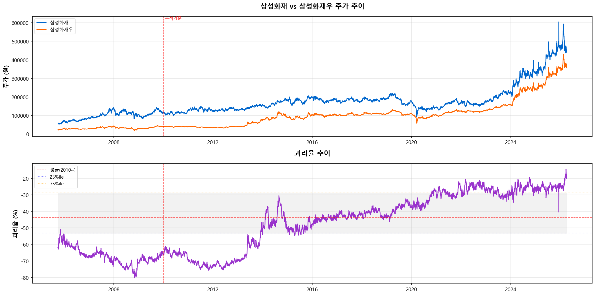

---

## 📌 S-Oil (010950) vs S-Oil우 (010955)

**분석 기간**: 2010-01-04 ~ 2026-04-08 (4,000일)
**전체 데이터**: 2000-01-04 ~ 2026-04-08 (6,567일) — 2010년 이전은 참고용

### 현재 상황

| 항목 | 값 |
|:----:|:---|
| S-Oil | 115,300원 |
| S-Oil우 | 54,800원 |
| **현재 괴리율** | **-52.47%** |
| 우선주 할인율 | 52.47% |
| 역사적 위치 | 하위 8.5% |
| Z-Score | -1.34σ |
| 종합 점수 | 60점 (±100점 만점) |
| **판정** | **🟦 우선주 강력 매수** |

**판정 근거:**

- ✅ 역사적 하위 10% (우선주 매우 저평가)
- ✅ 평균 대비 1.0σ 이상 낮음

### 괴리율 통계 (2010년~)

| 지표 | 값 |
|:----:|:---|
| 평균 | -40.12% |
| 중간값 | -40.23% |
| 표준편차 | 9.25% |
| 최소 (우선주 최저평가) | -64.19% |
| 최대 (우선주 최고평가) | -17.62% |

| 백분위 | 괴리율 | 의미 |
|:-----:|:------:|:-----|
| 10% | -50.75% | 우선주 매우 저평가 |
| 25% | -46.46% | 우선주 저평가 |
| 50% | -40.23% | 중간값 |
| 75% | -33.49% | 우선주 고평가 |
| 90% | -27.62% | 우선주 매우 고평가 |

**📎 참고: 전체 기간 (2000-01-04~) 통계 비교**

| 지표 | 2010년 이후 | 전체 기간 |
|:----:|:----------:|:---------:|
| 평균 | -40.12% | -41.20% |
| 중간값 | -40.23% | -41.17% |
| 표준편차 | 9.25% | 9.14% |
| 최소 | -64.19% | -67.72% |
| 최대 | -17.62% | 34.47% |

### 기간별 괴리율

| 기간 | 평균 | 최소 | 최대 | 현재 대비 |
|:----:|:----:|:----:|:----:|:---------:|
| 최근 1개월 | -51.56% | -56.50% | -48.66% | -0.91%p |
| 최근 3개월 | -46.49% | -56.50% | -40.43% | -5.98%p |
| 최근 6개월 | -41.55% | -56.50% | -32.20% | -10.92%p |
| 최근 1년 | -36.97% | -56.50% | -25.37% | -15.50%p |
| 최근 3년 | -36.02% | -56.50% | -24.34% | -16.45%p |
| 최근 5년 | -38.86% | -56.50% | -24.34% | -13.62%p |

### 시장 상황별 괴리율

| 구분 | 기간 | 평균 괴리율 | 중간값 |
|:----:|:----:|:----------:|:------:|
| 상승장 | 1327일 (33.2%) | -43.57% | -44.80% |
| 하락장 | 1109일 (27.7%) | -37.81% | -36.78% |
| 중립장 | 1564일 (39.1%) | -38.82% | -38.60% |

### 역사적 극단값 (Top 5)

**🟦 우선주 최저평가 시점 (괴리율 최저)**

| 날짜 | S-Oil | S-Oil우 | 괴리율 |
|:----:|--------:|----------:|:------:|
| 2011-07-27 | 110,438원 | 39,549원 | **-64.19%** |
| 2011-07-28 | 109,748원 | 39,436원 | **-64.07%** |
| 2011-07-26 | 109,748원 | 39,606원 | **-63.91%** |
| 2011-08-03 | 106,642원 | 38,811원 | **-63.61%** |
| 2011-08-01 | 108,022원 | 39,322원 | **-63.60%** |

**🟥 보통주 최저평가 시점 (괴리율 최고)**

| 날짜 | S-Oil | S-Oil우 | 괴리율 |
|:----:|--------:|----------:|:------:|
| 2018-07-03 | 89,651원 | 73,855원 | **-17.62%** |
| 2018-05-11 | 92,672원 | 76,083원 | **-17.90%** |
| 2018-05-14 | 92,672원 | 76,083원 | **-17.90%** |
| 2018-05-10 | 92,672원 | 76,002원 | **-17.99%** |
| 2018-05-30 | 92,672원 | 76,002원 | **-17.99%** |

### 차트

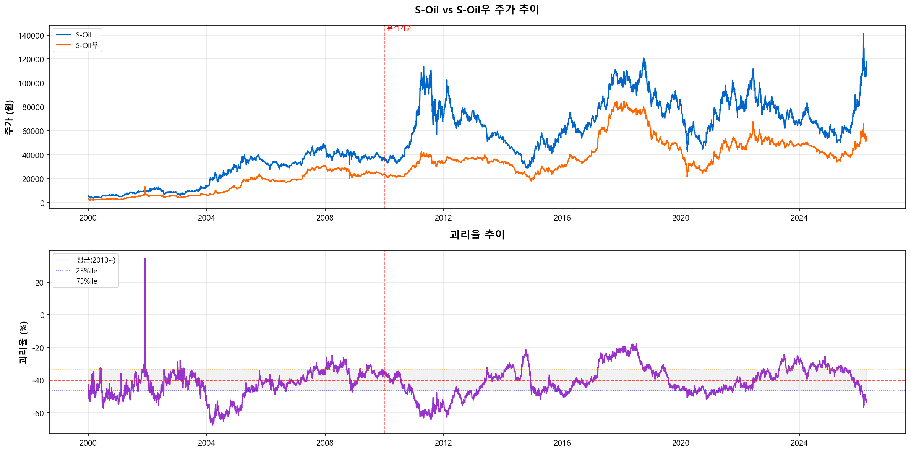

---

## 📌 대한항공 (003490) vs 대한항공우 (003495)

**분석 기간**: 2010-01-04 ~ 2026-04-08 (4,000일)
**전체 데이터**: 2005-09-29 ~ 2026-04-08 (5,070일) — 2010년 이전은 참고용

### 현재 상황

| 항목 | 값 |
|:----:|:---|
| 대한항공 | 24,750원 |
| 대한항공우 | 23,550원 |
| **현재 괴리율** | **-4.85%** |
| 우선주 할인율 | 4.85% |
| 역사적 위치 | 하위 61.6% |
| Z-Score | 0.36σ |
| 종합 점수 | 0점 (±100점 만점) |
| **판정** | **⚪ 중립** |

### 괴리율 통계 (2010년~)

| 지표 | 값 |
|:----:|:---|
| 평균 | -17.13% |
| 중간값 | -31.62% |
| 표준편차 | 34.41% |
| 최소 (우선주 최저평가) | -65.08% |
| 최대 (우선주 최고평가) | 140.76% |

| 백분위 | 괴리율 | 의미 |
|:-----:|:------:|:-----|
| 10% | -57.12% | 우선주 매우 저평가 |
| 25% | -42.57% | 우선주 저평가 |
| 50% | -31.62% | 중간값 |
| 75% | 10.04% | 우선주 고평가 |
| 90% | 29.68% | 우선주 매우 고평가 |

**📎 참고: 전체 기간 (2005-09-29~) 통계 비교**

| 지표 | 2010년 이후 | 전체 기간 |
|:----:|:----------:|:---------:|
| 평균 | -17.13% | -22.01% |
| 중간값 | -31.62% | -33.38% |
| 표준편차 | 34.41% | 32.51% |
| 최소 | -65.08% | -65.08% |
| 최대 | 140.76% | 140.76% |

### 기간별 괴리율

| 기간 | 평균 | 최소 | 최대 | 현재 대비 |
|:----:|:----:|:----:|:----:|:---------:|
| 최근 1개월 | -4.38% | -12.38% | 0.22% | -0.47%p |
| 최근 3개월 | 0.66% | -12.38% | 12.42% | -5.51%p |
| 최근 6개월 | 1.32% | -12.38% | 12.48% | -6.17%p |
| 최근 1년 | 0.02% | -12.38% | 22.18% | -4.87%p |
| 최근 3년 | 12.07% | -12.38% | 36.29% | -16.92%p |
| 최근 5년 | 14.51% | -41.64% | 140.76% | -19.36%p |

### 시장 상황별 괴리율

| 구분 | 기간 | 평균 괴리율 | 중간값 |
|:----:|:----:|:----------:|:------:|
| 상승장 | 1082일 (27.1%) | -17.79% | -36.93% |
| 하락장 | 1102일 (27.6%) | -22.31% | -31.65% |
| 중립장 | 1816일 (45.4%) | -13.60% | -9.54% |

### 역사적 극단값 (Top 5)

**🟦 우선주 최저평가 시점 (괴리율 최저)**

| 날짜 | 대한항공 | 대한항공우 | 괴리율 |
|:----:|--------:|----------:|:------:|
| 2012-07-06 | 30,430원 | 10,627원 | **-65.08%** |
| 2012-07-10 | 30,253원 | 10,585원 | **-65.01%** |
| 2012-07-05 | 30,371원 | 10,627원 | **-65.01%** |
| 2012-07-11 | 29,900원 | 10,501원 | **-64.88%** |
| 2012-07-19 | 30,488원 | 10,754원 | **-64.73%** |

**🟥 보통주 최저평가 시점 (괴리율 최고)**

| 날짜 | 대한항공 | 대한항공우 | 괴리율 |
|:----:|--------:|----------:|:------:|
| 2020-12-02 | 18,233원 | 43,899원 | **140.76%** |
| 2020-12-03 | 18,374원 | 43,327원 | **135.80%** |
| 2020-12-01 | 18,586원 | 43,459원 | **133.83%** |
| 2020-12-04 | 18,445원 | 41,962원 | **127.50%** |
| 2020-12-08 | 18,833원 | 42,270원 | **124.45%** |

### 차트

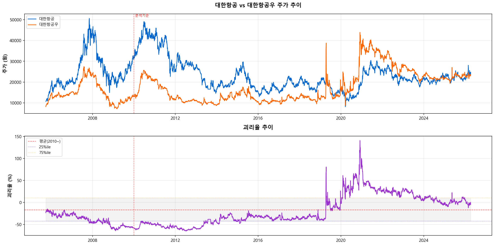

---

## 📌 유한양행 (000100) vs 유한양행우 (000105)

**분석 기간**: 2010-01-04 ~ 2026-04-08 (4,000일)
**전체 데이터**: 2005-09-29 ~ 2026-04-08 (5,070일) — 2010년 이전은 참고용

### 현재 상황

| 항목 | 값 |
|:----:|:---|
| 유한양행 | 93,900원 |
| 유한양행우 | 84,700원 |
| **현재 괴리율** | **-9.80%** |
| 우선주 할인율 | 9.80% |
| 역사적 위치 | 하위 33.4% |
| Z-Score | -0.61σ |
| 종합 점수 | -10점 (±100점 만점) |
| **판정** | **⚪ 중립** |

**판정 근거:**

- ❌ 최근 30일 평균보다 1%p 이상 높음

### 괴리율 통계 (2010년~)

| 지표 | 값 |
|:----:|:---|
| 평균 | 1.35% |
| 중간값 | 5.07% |
| 표준편차 | 18.15% |
| 최소 (우선주 최저평가) | -35.71% |
| 최대 (우선주 최고평가) | 57.25% |

| 백분위 | 괴리율 | 의미 |
|:-----:|:------:|:-----|
| 10% | -24.21% | 우선주 매우 저평가 |
| 25% | -13.11% | 우선주 저평가 |
| 50% | 5.07% | 중간값 |
| 75% | 15.01% | 우선주 고평가 |
| 90% | 23.71% | 우선주 매우 고평가 |

**📎 참고: 전체 기간 (2005-09-29~) 통계 비교**

| 지표 | 2010년 이후 | 전체 기간 |
|:----:|:----------:|:---------:|
| 평균 | 1.35% | 7.89% |
| 중간값 | 5.07% | 8.63% |
| 표준편차 | 18.15% | 23.68% |
| 최소 | -35.71% | -35.71% |
| 최대 | 57.25% | 92.74% |

### 기간별 괴리율

| 기간 | 평균 | 최소 | 최대 | 현재 대비 |
|:----:|:----:|:----:|:----:|:---------:|
| 최근 1개월 | -11.30% | -15.12% | -8.06% | +1.50%p |
| 최근 3개월 | -11.26% | -15.12% | -8.06% | +1.46%p |
| 최근 6개월 | -11.17% | -16.75% | -7.21% | +1.37%p |
| 최근 1년 | -10.48% | -16.75% | -2.67% | +0.68%p |
| 최근 3년 | -3.47% | -23.18% | 45.03% | -6.32%p |
| 최근 5년 | 4.41% | -23.18% | 55.76% | -14.21%p |

### 시장 상황별 괴리율

| 구분 | 기간 | 평균 괴리율 | 중간값 |
|:----:|:----:|:----------:|:------:|
| 상승장 | 1075일 (26.9%) | -2.68% | -4.17% |
| 하락장 | 746일 (18.6%) | 6.86% | 8.16% |
| 중립장 | 2179일 (54.5%) | 1.46% | 6.58% |

### 역사적 극단값 (Top 5)

**🟦 우선주 최저평가 시점 (괴리율 최저)**

| 날짜 | 유한양행 | 유한양행우 | 괴리율 |
|:----:|--------:|----------:|:------:|
| 2013-04-29 | 26,360원 | 16,947원 | **-35.71%** |
| 2015-05-11 | 33,180원 | 21,368원 | **-35.60%** |
| 2015-05-08 | 32,741원 | 21,185원 | **-35.29%** |
| 2013-04-30 | 25,867원 | 16,823원 | **-34.96%** |
| 2015-05-07 | 30,984원 | 20,363원 | **-34.28%** |

**🟥 보통주 최저평가 시점 (괴리율 최고)**

| 날짜 | 유한양행 | 유한양행우 | 괴리율 |
|:----:|--------:|----------:|:------:|
| 2011-08-24 | 13,751원 | 21,624원 | **57.25%** |
| 2020-07-23 | 42,343원 | 65,955원 | **55.76%** |
| 2020-07-27 | 45,045원 | 69,517원 | **54.33%** |
| 2011-02-14 | 17,083원 | 26,000원 | **52.20%** |
| 2011-08-18 | 14,721원 | 22,139원 | **50.39%** |

### 차트

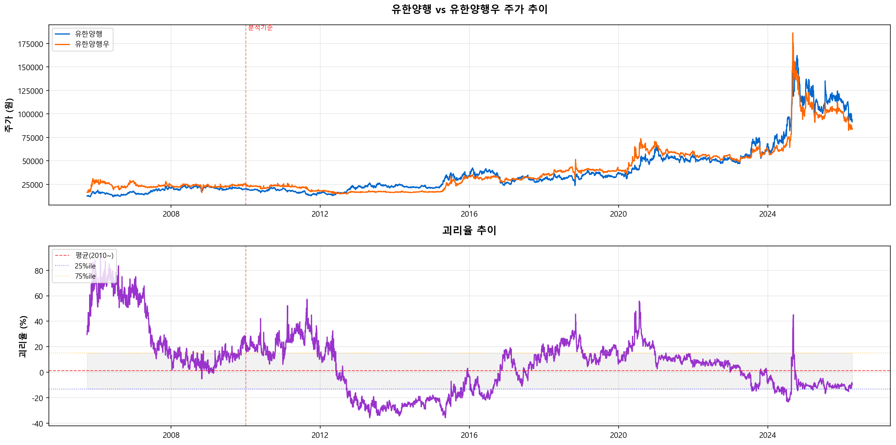

---

## 📌 LG생활건강 (051900) vs LG생활건강우 (051905)

**분석 기간**: 2010-01-04 ~ 2026-04-08 (4,000일)
**전체 데이터**: 2005-09-29 ~ 2026-04-08 (5,070일) — 2010년 이전은 참고용

### 현재 상황

| 항목 | 값 |
|:----:|:---|
| LG생활건강 | 240,500원 |
| LG생활건강우 | 105,800원 |
| **현재 괴리율** | **-56.01%** |
| 우선주 할인율 | 56.01% |
| 역사적 위치 | 하위 56.5% |
| Z-Score | 0.18σ |
| 종합 점수 | 0점 (±100점 만점) |
| **판정** | **⚪ 중립** |

### 괴리율 통계 (2010년~)

| 지표 | 값 |
|:----:|:---|
| 평균 | -58.12% |
| 중간값 | -57.19% |
| 표준편차 | 11.81% |
| 최소 (우선주 최저평가) | -82.82% |
| 최대 (우선주 최고평가) | -35.07% |

| 백분위 | 괴리율 | 의미 |
|:-----:|:------:|:-----|
| 10% | -78.11% | 우선주 매우 저평가 |
| 25% | -62.38% | 우선주 저평가 |
| 50% | -57.19% | 중간값 |
| 75% | -48.52% | 우선주 고평가 |
| 90% | -43.99% | 우선주 매우 고평가 |

**📎 참고: 전체 기간 (2005-09-29~) 통계 비교**

| 지표 | 2010년 이후 | 전체 기간 |
|:----:|:----------:|:---------:|
| 평균 | -58.12% | -60.67% |
| 중간값 | -57.19% | -58.66% |
| 표준편차 | 11.81% | 12.18% |
| 최소 | -82.82% | -86.83% |
| 최대 | -35.07% | -35.07% |

### 기간별 괴리율

| 기간 | 평균 | 최소 | 최대 | 현재 대비 |
|:----:|:----:|:----:|:----:|:---------:|
| 최근 1개월 | -56.43% | -57.95% | -53.15% | +0.42%p |
| 최근 3개월 | -57.15% | -59.27% | -53.15% | +1.15%p |
| 최근 6개월 | -58.49% | -61.37% | -53.15% | +2.48%p |
| 최근 1년 | -59.25% | -63.90% | -53.15% | +3.25%p |
| 최근 3년 | -56.28% | -63.90% | -40.73% | +0.27%p |
| 최근 5년 | -53.72% | -63.90% | -35.07% | -2.29%p |

### 시장 상황별 괴리율

| 구분 | 기간 | 평균 괴리율 | 중간값 |
|:----:|:----:|:----------:|:------:|
| 상승장 | 1079일 (27.0%) | -59.48% | -57.38% |
| 하락장 | 1056일 (26.4%) | -54.72% | -55.89% |
| 중립장 | 1865일 (46.6%) | -59.27% | -57.93% |

### 역사적 극단값 (Top 5)

**🟦 우선주 최저평가 시점 (괴리율 최저)**

| 날짜 | LG생활건강 | LG생활건강우 | 괴리율 |
|:----:|--------:|----------:|:------:|
| 2011-03-31 | 366,198원 | 62,906원 | **-82.82%** |
| 2011-03-30 | 361,303원 | 62,216원 | **-82.78%** |
| 2011-07-12 | 424,932원 | 73,493원 | **-82.70%** |
| 2011-07-11 | 431,606원 | 74,874원 | **-82.65%** |
| 2011-08-18 | 444,955원 | 77,866원 | **-82.50%** |

**🟥 보통주 최저평가 시점 (괴리율 최고)**

| 날짜 | LG생활건강 | LG생활건강우 | 괴리율 |
|:----:|--------:|----------:|:------:|
| 2018-10-31 | 974,804원 | 632,947원 | **-35.07%** |
| 2017-09-25 | 788,546원 | 489,741원 | **-37.89%** |
| 2017-09-26 | 788,546원 | 489,741원 | **-37.89%** |
| 2017-08-08 | 897,886원 | 553,732원 | **-38.33%** |
| 2017-09-13 | 821,904원 | 505,952원 | **-38.44%** |

### 차트

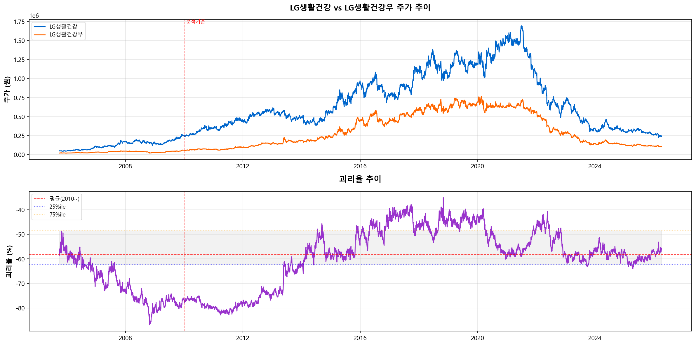

---

## 📌 CJ제일제당 (097950) vs CJ제일제당우 (097955)

**분석 기간**: 2010-01-04 ~ 2026-04-08 (4,000일)
**전체 데이터**: 2007-09-28 ~ 2026-04-08 (4,573일) — 2010년 이전은 참고용

### 현재 상황

| 항목 | 값 |
|:----:|:---|
| CJ제일제당 | 234,250원 |
| CJ제일제당우 | 134,800원 |
| **현재 괴리율** | **-42.45%** |
| 우선주 할인율 | 42.45% |
| 역사적 위치 | 하위 95.0% |
| Z-Score | 1.77σ |
| 종합 점수 | -60점 (±100점 만점) |
| **판정** | **🟥 보통주 강력 매수** |

**판정 근거:**

- ❌ 역사적 상위 10% (우선주 매우 고평가)
- ❌ 평균 대비 1.5σ 이상 높음
- ✅ 최근 30일 평균보다 1%p 이상 낮음

### 괴리율 통계 (2010년~)

| 지표 | 값 |
|:----:|:---|
| 평균 | -62.57% |
| 중간값 | -60.95% |
| 표준편차 | 11.35% |
| 최소 (우선주 최저평가) | -85.09% |
| 최대 (우선주 최고평가) | -32.37% |

| 백분위 | 괴리율 | 의미 |
|:-----:|:------:|:-----|
| 10% | -81.21% | 우선주 매우 저평가 |
| 25% | -69.90% | 우선주 저평가 |
| 50% | -60.95% | 중간값 |
| 75% | -56.14% | 우선주 고평가 |
| 90% | -49.61% | 우선주 매우 고평가 |

**📎 참고: 전체 기간 (2007-09-28~) 통계 비교**

| 지표 | 2010년 이후 | 전체 기간 |
|:----:|:----------:|:---------:|
| 평균 | -62.57% | -64.41% |
| 중간값 | -60.95% | -62.22% |
| 표준편차 | 11.35% | 11.70% |
| 최소 | -85.09% | -85.09% |
| 최대 | -32.37% | -32.37% |

### 기간별 괴리율

| 기간 | 평균 | 최소 | 최대 | 현재 대비 |
|:----:|:----:|:----:|:----:|:---------:|
| 최근 1개월 | -37.53% | -43.77% | -32.37% | -4.93%p |
| 최근 3개월 | -35.81% | -43.77% | -32.37% | -6.65%p |
| 최근 6개월 | -38.37% | -43.91% | -32.37% | -4.09%p |
| 최근 1년 | -43.19% | -55.22% | -32.37% | +0.73%p |
| 최근 3년 | -52.95% | -62.92% | -32.37% | +10.50%p |
| 최근 5년 | -56.41% | -69.37% | -32.37% | +13.96%p |

### 시장 상황별 괴리율

| 구분 | 기간 | 평균 괴리율 | 중간값 |
|:----:|:----:|:----------:|:------:|
| 상승장 | 930일 (23.2%) | -65.24% | -62.08% |
| 하락장 | 831일 (20.8%) | -59.62% | -57.67% |
| 중립장 | 2239일 (56.0%) | -62.55% | -61.42% |

### 역사적 극단값 (Top 5)

**🟦 우선주 최저평가 시점 (괴리율 최저)**

| 날짜 | CJ제일제당 | CJ제일제당우 | 괴리율 |
|:----:|--------:|----------:|:------:|
| 2012-05-09 | 315,982원 | 47,119원 | **-85.09%** |
| 2012-04-30 | 315,560원 | 47,187원 | **-85.05%** |
| 2012-05-10 | 313,029원 | 47,051원 | **-84.97%** |
| 2012-05-11 | 310,919원 | 46,778원 | **-84.95%** |
| 2012-05-04 | 312,185원 | 46,983원 | **-84.95%** |

**🟥 보통주 최저평가 시점 (괴리율 최고)**

| 날짜 | CJ제일제당 | CJ제일제당우 | 괴리율 |
|:----:|--------:|----------:|:------:|
| 2026-03-04 | 190,300원 | 128,700원 | **-32.37%** |
| 2026-01-07 | 201,613원 | 135,802원 | **-32.64%** |
| 2026-03-06 | 195,900원 | 131,300원 | **-32.98%** |
| 2025-12-11 | 204,096원 | 136,693원 | **-33.03%** |
| 2026-01-06 | 204,096원 | 136,594원 | **-33.07%** |

### 차트

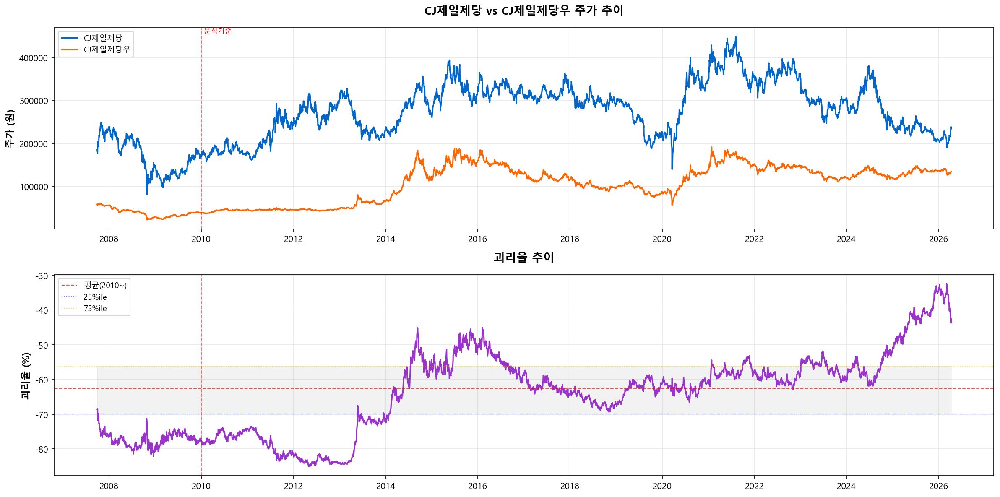

---

## 📌 현대건설 (000720) vs 현대건설우 (000725)

**분석 기간**: 2010-01-04 ~ 2026-04-08 (4,000일)
**전체 데이터**: 2005-09-29 ~ 2026-04-08 (5,070일) — 2010년 이전은 참고용

### 현재 상황

| 항목 | 값 |
|:----:|:---|
| 현대건설 | 173,900원 |
| 현대건설우 | 74,900원 |
| **현재 괴리율** | **-56.93%** |
| 우선주 할인율 | 56.93% |
| 역사적 위치 | 하위 2.2% |
| Z-Score | -0.89σ |
| 종합 점수 | 50점 (±100점 만점) |
| **판정** | **🟦 우선주 강력 매수** |

**판정 근거:**

- ✅ 역사적 하위 10% (우선주 매우 저평가)
- ✅ 최근 30일 평균보다 1%p 이상 낮음

### 괴리율 통계 (2010년~)

| 지표 | 값 |
|:----:|:---|
| 평균 | 68.74% |
| 중간값 | 31.10% |
| 표준편차 | 141.66% |
| 최소 (우선주 최저평가) | -61.19% |
| 최대 (우선주 최고평가) | 1296.81% |

| 백분위 | 괴리율 | 의미 |
|:-----:|:------:|:-----|
| 10% | -48.78% | 우선주 매우 저평가 |
| 25% | -34.31% | 우선주 저평가 |
| 50% | 31.10% | 중간값 |
| 75% | 72.46% | 우선주 고평가 |
| 90% | 271.96% | 우선주 매우 고평가 |

**📎 참고: 전체 기간 (2005-09-29~) 통계 비교**

| 지표 | 2010년 이후 | 전체 기간 |
|:----:|:----------:|:---------:|
| 평균 | 68.74% | 44.39% |
| 중간값 | 31.10% | -14.30% |
| 표준편차 | 141.66% | 134.42% |
| 최소 | -61.19% | -61.19% |
| 최대 | 1296.81% | 1296.81% |

### 기간별 괴리율

| 기간 | 평균 | 최소 | 최대 | 현재 대비 |
|:----:|:----:|:----:|:----:|:---------:|
| 최근 1개월 | -54.99% | -56.93% | -52.11% | -1.93%p |
| 최근 3개월 | -38.71% | -56.93% | -15.45% | -18.22%p |
| 최근 6개월 | -26.21% | -56.93% | -7.46% | -30.72%p |
| 최근 1년 | 6.93% | -56.93% | 78.37% | -63.86%p |
| 최근 3년 | 41.05% | -56.93% | 222.90% | -97.98%p |
| 최근 5년 | 149.59% | -56.93% | 1296.81% | -206.52%p |

### 시장 상황별 괴리율

| 구분 | 기간 | 평균 괴리율 | 중간값 |
|:----:|:----:|:----------:|:------:|
| 상승장 | 1173일 (29.3%) | 64.10% | 15.54% |
| 하락장 | 1171일 (29.3%) | 73.03% | 46.17% |
| 중립장 | 1656일 (41.4%) | 69.00% | 38.61% |

### 역사적 극단값 (Top 5)

**🟦 우선주 최저평가 시점 (괴리율 최저)**

| 날짜 | 현대건설 | 현대건설우 | 괴리율 |
|:----:|--------:|----------:|:------:|
| 2012-12-20 | 60,505원 | 23,481원 | **-61.19%** |
| 2013-01-29 | 60,943원 | 23,946원 | **-60.71%** |
| 2013-01-30 | 60,859원 | 23,946원 | **-60.65%** |
| 2013-03-08 | 56,578원 | 22,393원 | **-60.42%** |
| 2012-12-17 | 59,005원 | 23,354원 | **-60.42%** |

**🟥 보통주 최저평가 시점 (괴리율 최고)**

| 날짜 | 현대건설 | 현대건설우 | 괴리율 |
|:----:|--------:|----------:|:------:|
| 2020-06-25 | 30,599원 | 427,413원 | **1296.81%** |
| 2020-06-24 | 31,699원 | 427,413원 | **1248.36%** |
| 2020-06-23 | 31,470원 | 328,959원 | **945.32%** |
| 2020-06-26 | 30,737원 | 299,562원 | **874.61%** |
| 2020-07-08 | 31,561원 | 288,364원 | **813.66%** |

### 차트

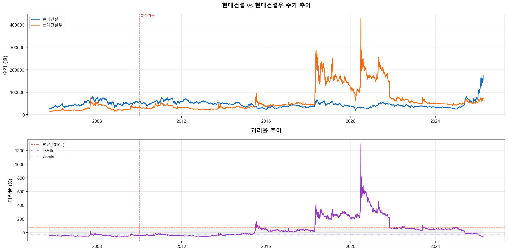

---

## 📌 금호석유 (011780) vs 금호석유우 (011785)

**분석 기간**: 2010-01-04 ~ 2026-04-08 (4,000일)
**전체 데이터**: 2005-09-29 ~ 2026-04-08 (5,070일) — 2010년 이전은 참고용

### 현재 상황

| 항목 | 값 |
|:----:|:---|
| 금호석유 | 127,600원 |
| 금호석유우 | 58,100원 |
| **현재 괴리율** | **-54.47%** |
| 우선주 할인율 | 54.47% |
| 역사적 위치 | 하위 71.6% |
| Z-Score | 0.79σ |
| 종합 점수 | 10점 (±100점 만점) |
| **판정** | **⚪ 중립** |

**판정 근거:**

- ✅ 최근 30일 평균보다 1%p 이상 낮음

### 괴리율 통계 (2010년~)

| 지표 | 값 |
|:----:|:---|
| 평균 | -64.77% |
| 중간값 | -66.43% |
| 표준편차 | 13.06% |
| 최소 (우선주 최저평가) | -87.43% |
| 최대 (우선주 최고평가) | -32.47% |

| 백분위 | 괴리율 | 의미 |
|:-----:|:------:|:-----|
| 10% | -82.84% | 우선주 매우 저평가 |
| 25% | -72.90% | 우선주 저평가 |
| 50% | -66.43% | 중간값 |
| 75% | -53.26% | 우선주 고평가 |
| 90% | -48.23% | 우선주 매우 고평가 |

**📎 참고: 전체 기간 (2005-09-29~) 통계 비교**

| 지표 | 2010년 이후 | 전체 기간 |
|:----:|:----------:|:---------:|
| 평균 | -64.77% | -67.03% |
| 중간값 | -66.43% | -69.46% |
| 표준편차 | 13.06% | 12.60% |
| 최소 | -87.43% | -87.43% |
| 최대 | -32.47% | -32.47% |

### 기간별 괴리율

| 기간 | 평균 | 최소 | 최대 | 현재 대비 |
|:----:|:----:|:----:|:----:|:---------:|
| 최근 1개월 | -52.76% | -55.22% | -49.61% | -1.71%p |
| 최근 3개월 | -51.09% | -55.22% | -46.18% | -3.38%p |
| 최근 6개월 | -49.70% | -55.22% | -45.74% | -4.77%p |
| 최근 1년 | -51.09% | -57.40% | -45.62% | -3.37%p |
| 최근 3년 | -49.15% | -59.15% | -32.47% | -5.32%p |
| 최근 5년 | -55.08% | -72.89% | -32.47% | +0.61%p |

### 시장 상황별 괴리율

| 구분 | 기간 | 평균 괴리율 | 중간값 |
|:----:|:----:|:----------:|:------:|
| 상승장 | 1323일 (33.1%) | -68.37% | -68.19% |
| 하락장 | 1164일 (29.1%) | -62.45% | -61.30% |
| 중립장 | 1513일 (37.8%) | -63.40% | -65.86% |

### 역사적 극단값 (Top 5)

**🟦 우선주 최저평가 시점 (괴리율 최저)**

| 날짜 | 금호석유 | 금호석유우 | 괴리율 |
|:----:|--------:|----------:|:------:|
| 2011-08-23 | 127,643원 | 16,041원 | **-87.43%** |
| 2011-08-24 | 122,552원 | 15,631원 | **-87.25%** |
| 2011-10-17 | 160,009원 | 20,631원 | **-87.11%** |
| 2011-10-18 | 157,099원 | 20,438원 | **-86.99%** |
| 2011-08-25 | 122,552원 | 15,945원 | **-86.99%** |

**🟥 보통주 최저평가 시점 (괴리율 최고)**

| 날짜 | 금호석유 | 금호석유우 | 괴리율 |
|:----:|--------:|----------:|:------:|
| 2022-09-02 | 113,287원 | 76,504원 | **-32.47%** |
| 2022-09-07 | 112,380원 | 75,836원 | **-32.52%** |
| 2022-09-05 | 114,193원 | 76,671원 | **-32.86%** |
| 2022-09-27 | 104,224원 | 69,913원 | **-32.92%** |
| 2022-09-06 | 114,646원 | 76,837원 | **-32.98%** |

### 차트

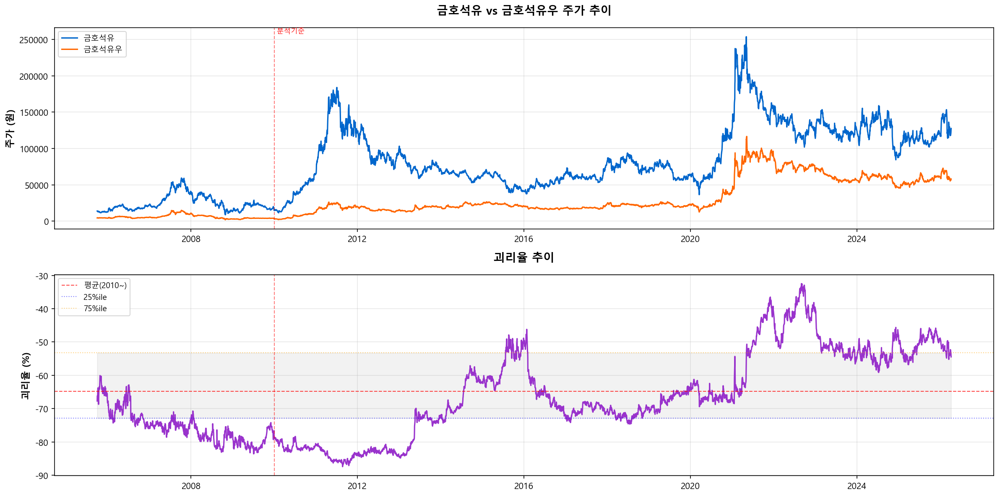

---

## 📌 코오롱인더 (120110) vs 코오롱인더우 (120115)

**분석 기간**: 2010-02-01 ~ 2026-04-08 (3,980일)

### 현재 상황

| 항목 | 값 |
|:----:|:---|
| 코오롱인더 | 81,400원 |
| 코오롱인더우 | 28,700원 |
| **현재 괴리율** | **-64.74%** |
| 우선주 할인율 | 64.74% |
| 역사적 위치 | 하위 46.6% |
| Z-Score | -0.17σ |
| 종합 점수 | 10점 (±100점 만점) |
| **판정** | **⚪ 중립** |

**판정 근거:**

- ✅ 최근 30일 평균보다 1%p 이상 낮음

### 괴리율 통계

| 지표 | 값 |
|:----:|:---|
| 평균 | -62.67% |
| 중간값 | -64.08% |
| 표준편차 | 12.39% |
| 최소 (우선주 최저평가) | -84.10% |
| 최대 (우선주 최고평가) | -30.95% |

| 백분위 | 괴리율 | 의미 |
|:-----:|:------:|:-----|
| 10% | -79.76% | 우선주 매우 저평가 |
| 25% | -72.08% | 우선주 저평가 |
| 50% | -64.08% | 중간값 |
| 75% | -53.37% | 우선주 고평가 |
| 90% | -45.49% | 우선주 매우 고평가 |

### 기간별 괴리율

| 기간 | 평균 | 최소 | 최대 | 현재 대비 |
|:----:|:----:|:----:|:----:|:---------:|
| 최근 1개월 | -60.94% | -65.53% | -54.53% | -3.80%p |
| 최근 3개월 | -51.71% | -65.53% | -40.66% | -13.03%p |
| 최근 6개월 | -45.72% | -65.53% | -34.04% | -19.03%p |
| 최근 1년 | -41.53% | -65.53% | -30.95% | -23.21%p |
| 최근 3년 | -47.68% | -65.53% | -30.95% | -17.07%p |
| 최근 5년 | -51.88% | -65.53% | -30.95% | -12.87%p |

### 시장 상황별 괴리율

| 구분 | 기간 | 평균 괴리율 | 중간값 |
|:----:|:----:|:----------:|:------:|
| 상승장 | 1262일 (31.7%) | -64.92% | -65.76% |
| 하락장 | 1201일 (30.2%) | -61.04% | -61.83% |
| 중립장 | 1517일 (38.1%) | -62.09% | -64.23% |

### 역사적 극단값 (Top 5)

**🟦 우선주 최저평가 시점 (괴리율 최저)**

| 날짜 | 코오롱인더 | 코오롱인더우 | 괴리율 |
|:----:|--------:|----------:|:------:|
| 2011-08-18 | 87,610원 | 13,929원 | **-84.10%** |
| 2011-08-17 | 83,543원 | 13,584원 | **-83.74%** |
| 2011-08-16 | 78,738원 | 13,107원 | **-83.35%** |
| 2011-08-11 | 77,259원 | 12,921원 | **-83.28%** |
| 2011-08-09 | 73,858원 | 12,364원 | **-83.26%** |

**🟥 보통주 최저평가 시점 (괴리율 최고)**

| 날짜 | 코오롱인더 | 코오롱인더우 | 괴리율 |
|:----:|--------:|----------:|:------:|
| 2024-12-09 | 24,006원 | 16,576원 | **-30.95%** |
| 2024-12-05 | 24,797원 | 17,018원 | **-31.37%** |
| 2024-12-06 | 24,936원 | 16,912원 | **-32.18%** |
| 2025-02-04 | 25,798원 | 17,471원 | **-32.28%** |
| 2024-12-02 | 25,495원 | 17,239원 | **-32.38%** |

### 차트

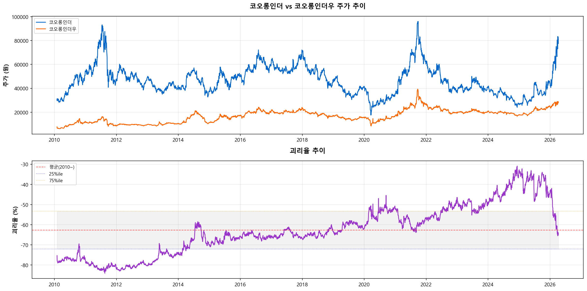

---

## 📌 코오롱 (002020) vs 코오롱우 (002025)

**분석 기간**: 2010-01-04 ~ 2026-04-08 (4,000일)
**전체 데이터**: 2005-09-29 ~ 2026-04-08 (5,070일) — 2010년 이전은 참고용

### 현재 상황

| 항목 | 값 |
|:----:|:---|
| 코오롱 | 65,800원 |
| 코오롱우 | 29,500원 |
| **현재 괴리율** | **-55.17%** |
| 우선주 할인율 | 55.17% |
| 역사적 위치 | 하위 47.6% |
| Z-Score | -0.29σ |
| 종합 점수 | 10점 (±100점 만점) |
| **판정** | **⚪ 중립** |

**판정 근거:**

- ✅ 최근 30일 평균보다 1%p 이상 낮음

### 괴리율 통계 (2010년~)

| 지표 | 값 |
|:----:|:---|
| 평균 | -50.47% |
| 중간값 | -54.09% |
| 표준편차 | 16.35% |
| 최소 (우선주 최저평가) | -78.13% |
| 최대 (우선주 최고평가) | -6.52% |

| 백분위 | 괴리율 | 의미 |
|:-----:|:------:|:-----|
| 10% | -69.31% | 우선주 매우 저평가 |
| 25% | -63.12% | 우선주 저평가 |
| 50% | -54.09% | 중간값 |
| 75% | -38.33% | 우선주 고평가 |
| 90% | -25.78% | 우선주 매우 고평가 |

**📎 참고: 전체 기간 (2005-09-29~) 통계 비교**

| 지표 | 2010년 이후 | 전체 기간 |
|:----:|:----------:|:---------:|
| 평균 | -50.47% | -52.53% |
| 중간값 | -54.09% | -55.69% |
| 표준편차 | 16.35% | 15.88% |
| 최소 | -78.13% | -80.65% |
| 최대 | -6.52% | -6.52% |

### 기간별 괴리율

| 기간 | 평균 | 최소 | 최대 | 현재 대비 |
|:----:|:----:|:----:|:----:|:---------:|
| 최근 1개월 | -53.66% | -57.02% | -49.81% | -1.51%p |
| 최근 3개월 | -51.51% | -58.19% | -46.03% | -3.66%p |
| 최근 6개월 | -50.89% | -58.19% | -45.14% | -4.27%p |
| 최근 1년 | -38.87% | -58.19% | -6.52% | -16.30%p |
| 최근 3년 | -31.66% | -58.19% | -6.52% | -23.51%p |
| 최근 5년 | -35.62% | -58.19% | -6.52% | -19.55%p |

### 시장 상황별 괴리율

| 구분 | 기간 | 평균 괴리율 | 중간값 |
|:----:|:----:|:----------:|:------:|
| 상승장 | 1150일 (28.7%) | -55.10% | -57.42% |
| 하락장 | 1323일 (33.1%) | -51.76% | -55.49% |
| 중립장 | 1527일 (38.2%) | -45.86% | -47.93% |

### 역사적 극단값 (Top 5)

**🟦 우선주 최저평가 시점 (괴리율 최저)**

| 날짜 | 코오롱 | 코오롱우 | 괴리율 |
|:----:|--------:|----------:|:------:|
| 2010-02-05 | 24,272원 | 5,309원 | **-78.13%** |
| 2010-02-04 | 24,272원 | 5,389원 | **-77.80%** |
| 2010-02-08 | 22,844원 | 5,150원 | **-77.46%** |
| 2010-07-27 | 25,700원 | 5,813원 | **-77.38%** |
| 2010-07-13 | 24,665원 | 5,601원 | **-77.29%** |

**🟥 보통주 최저평가 시점 (괴리율 최고)**

| 날짜 | 코오롱 | 코오롱우 | 괴리율 |
|:----:|--------:|----------:|:------:|
| 2024-12-19 | 13,939원 | 13,031원 | **-6.52%** |
| 2024-12-20 | 13,634원 | 12,573원 | **-7.78%** |
| 2024-11-14 | 12,585원 | 11,575원 | **-8.03%** |
| 2024-11-15 | 12,576원 | 11,565원 | **-8.04%** |
| 2024-11-13 | 12,595원 | 11,491원 | **-8.77%** |

### 차트

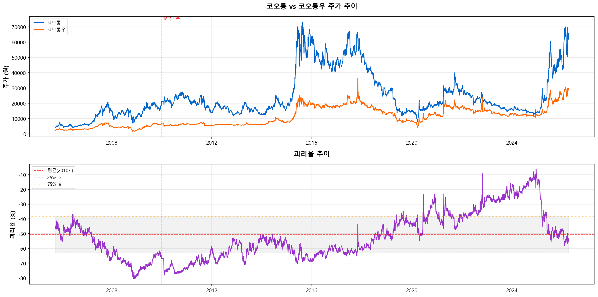

---

## 📌 호텔신라 (008770) vs 호텔신라우 (008775)

**분석 기간**: 2010-01-04 ~ 2026-04-08 (4,000일)
**전체 데이터**: 2005-09-29 ~ 2026-04-08 (5,070일) — 2010년 이전은 참고용

### 현재 상황

| 항목 | 값 |
|:----:|:---|
| 호텔신라 | 46,750원 |
| 호텔신라우 | 34,500원 |
| **현재 괴리율** | **-26.20%** |
| 우선주 할인율 | 26.20% |
| 역사적 위치 | 하위 63.0% |
| Z-Score | 0.46σ |
| 종합 점수 | 10점 (±100점 만점) |
| **판정** | **⚪ 중립** |

**판정 근거:**

- ✅ 최근 30일 평균보다 1%p 이상 낮음

### 괴리율 통계 (2010년~)

| 지표 | 값 |
|:----:|:---|
| 평균 | -36.50% |
| 중간값 | -36.85% |
| 표준편차 | 22.28% |
| 최소 (우선주 최저평가) | -77.64% |
| 최대 (우선주 최고평가) | 42.97% |

| 백분위 | 괴리율 | 의미 |
|:-----:|:------:|:-----|
| 10% | -67.83% | 우선주 매우 저평가 |
| 25% | -55.86% | 우선주 저평가 |
| 50% | -36.85% | 중간값 |
| 75% | -20.58% | 우선주 고평가 |
| 90% | -6.38% | 우선주 매우 고평가 |

**📎 참고: 전체 기간 (2005-09-29~) 통계 비교**

| 지표 | 2010년 이후 | 전체 기간 |
|:----:|:----------:|:---------:|
| 평균 | -36.50% | -40.15% |
| 중간값 | -36.85% | -41.59% |
| 표준편차 | 22.28% | 21.18% |
| 최소 | -77.64% | -77.64% |
| 최대 | 42.97% | 42.97% |

### 기간별 괴리율

| 기간 | 평균 | 최소 | 최대 | 현재 대비 |
|:----:|:----:|:----:|:----:|:---------:|
| 최근 1개월 | -21.75% | -26.20% | -18.91% | -4.46%p |
| 최근 3개월 | -20.86% | -29.77% | -14.91% | -5.35%p |
| 최근 6개월 | -17.53% | -29.77% | 0.32% | -8.67%p |
| 최근 1년 | -17.54% | -29.77% | 0.32% | -8.67%p |
| 최근 3년 | -19.46% | -41.14% | 6.33% | -6.74%p |
| 최근 5년 | -21.06% | -49.09% | 42.97% | -5.15%p |

### 시장 상황별 괴리율

| 구분 | 기간 | 평균 괴리율 | 중간값 |
|:----:|:----:|:----------:|:------:|
| 상승장 | 1246일 (31.1%) | -44.69% | -44.26% |
| 하락장 | 1070일 (26.8%) | -31.85% | -33.21% |
| 중립장 | 1684일 (42.1%) | -33.39% | -32.21% |

### 역사적 극단값 (Top 5)

**🟦 우선주 최저평가 시점 (괴리율 최저)**

| 날짜 | 호텔신라 | 호텔신라우 | 괴리율 |
|:----:|--------:|----------:|:------:|
| 2013-03-21 | 52,651원 | 11,773원 | **-77.64%** |
| 2013-03-22 | 51,787원 | 11,866원 | **-77.09%** |
| 2013-03-29 | 52,746원 | 12,098원 | **-77.06%** |
| 2013-03-20 | 51,691원 | 11,866원 | **-77.04%** |
| 2013-03-28 | 52,746원 | 12,144원 | **-76.98%** |

**🟥 보통주 최저평가 시점 (괴리율 최고)**

| 날짜 | 호텔신라 | 호텔신라우 | 괴리율 |
|:----:|--------:|----------:|:------:|
| 2021-04-26 | 83,920원 | 119,985원 | **42.97%** |
| 2021-04-27 | 83,424원 | 113,072원 | **35.54%** |
| 2017-02-17 | 46,277원 | 62,405원 | **34.85%** |
| 2017-02-22 | 47,449원 | 61,253원 | **29.09%** |
| 2017-03-10 | 43,934원 | 56,164원 | **27.84%** |

### 차트

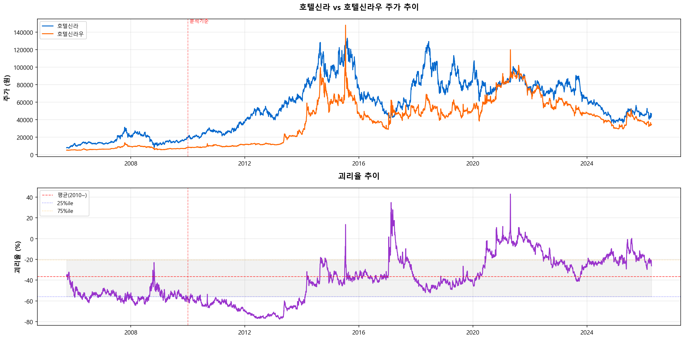

---

## 📌 DL (000210) vs DL우 (000215)

**분석 기간**: 2010-01-04 ~ 2026-04-08 (4,000일)
**전체 데이터**: 2005-09-29 ~ 2026-04-08 (5,070일) — 2010년 이전은 참고용

### 현재 상황

| 항목 | 값 |
|:----:|:---|
| DL | 69,300원 |
| DL우 | 28,650원 |
| **현재 괴리율** | **-58.66%** |
| 우선주 할인율 | 58.66% |
| 역사적 위치 | 하위 15.7% |
| Z-Score | -1.04σ |
| 종합 점수 | 55점 (±100점 만점) |
| **판정** | **🟦 우선주 강력 매수** |

**판정 근거:**

- ✅ 역사적 하위 25% (우선주 저평가)
- ✅ 평균 대비 1.0σ 이상 낮음
- ✅ 최근 30일 평균보다 1%p 이상 낮음

### 괴리율 통계 (2010년~)

| 지표 | 값 |
|:----:|:---|
| 평균 | -46.90% |
| 중간값 | -46.08% |
| 표준편차 | 11.28% |
| 최소 (우선주 최저평가) | -70.56% |
| 최대 (우선주 최고평가) | -2.22% |

| 백분위 | 괴리율 | 의미 |
|:-----:|:------:|:-----|
| 10% | -64.77% | 우선주 매우 저평가 |
| 25% | -53.26% | 우선주 저평가 |
| 50% | -46.08% | 중간값 |
| 75% | -40.44% | 우선주 고평가 |
| 90% | -35.52% | 우선주 매우 고평가 |

**📎 참고: 전체 기간 (2005-09-29~) 통계 비교**

| 지표 | 2010년 이후 | 전체 기간 |
|:----:|:----------:|:---------:|
| 평균 | -46.90% | -44.74% |
| 중간값 | -46.08% | -44.98% |
| 표준편차 | 11.28% | 12.74% |
| 최소 | -70.56% | -70.56% |
| 최대 | -2.22% | 3.03% |

### 기간별 괴리율

| 기간 | 평균 | 최소 | 최대 | 현재 대비 |
|:----:|:----:|:----:|:----:|:---------:|
| 최근 1개월 | -50.88% | -58.66% | -42.20% | -7.78%p |
| 최근 3개월 | -43.33% | -58.66% | -33.55% | -15.33%p |
| 최근 6개월 | -41.61% | -58.66% | -32.10% | -17.05%p |
| 최근 1년 | -42.11% | -58.66% | -32.10% | -16.55%p |
| 최근 3년 | -45.20% | -58.66% | -32.10% | -13.46%p |
| 최근 5년 | -41.41% | -58.66% | -2.22% | -17.25%p |

### 시장 상황별 괴리율

| 구분 | 기간 | 평균 괴리율 | 중간값 |
|:----:|:----:|:----------:|:------:|
| 상승장 | 1127일 (28.2%) | -50.24% | -49.62% |
| 하락장 | 1294일 (32.4%) | -46.58% | -44.81% |
| 중립장 | 1579일 (39.5%) | -44.79% | -44.98% |

### 역사적 극단값 (Top 5)

**🟦 우선주 최저평가 시점 (괴리율 최저)**

| 날짜 | DL | DL우 | 괴리율 |
|:----:|--------:|----------:|:------:|
| 2012-02-02 | 130,776원 | 38,506원 | **-70.56%** |
| 2012-02-03 | 131,866원 | 39,200원 | **-70.27%** |
| 2011-09-07 | 121,289원 | 36,564원 | **-69.85%** |
| 2012-02-06 | 130,232원 | 39,663원 | **-69.54%** |
| 2012-02-09 | 138,950원 | 42,364원 | **-69.51%** |

**🟥 보통주 최저평가 시점 (괴리율 최고)**

| 날짜 | DL | DL우 | 괴리율 |
|:----:|--------:|----------:|:------:|
| 2020-12-28 | 100,004원 | 97,788원 | **-2.22%** |
| 2020-12-29 | 102,664원 | 100,334원 | **-2.27%** |
| 2020-12-30 | 102,664원 | 100,334원 | **-2.27%** |
| 2021-01-04 | 102,664원 | 100,334원 | **-2.27%** |
| 2021-01-05 | 102,664원 | 100,334원 | **-2.27%** |

### 차트

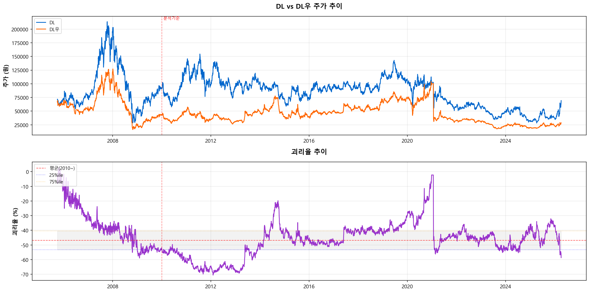

---

## ⚠️ 주의사항

1. **괴리율은 평균 회귀 경향**이 있지만, 장기간 지속될 수도 있습니다.
2. **우선주는 유동성이 낮아** 대량 매매 시 슬리피지가 발생할 수 있습니다.
3. **배당 기준일 전후**로 괴리율이 일시적으로 변동할 수 있습니다.
4. 이 분석은 **참고용**이며, 투자 판단은 본인의 책임입니다.

---

**데이터 출처**: market_data.db (SQLite) / Yahoo Finance (fallback)  
**분석 도구**: Python + pandas
