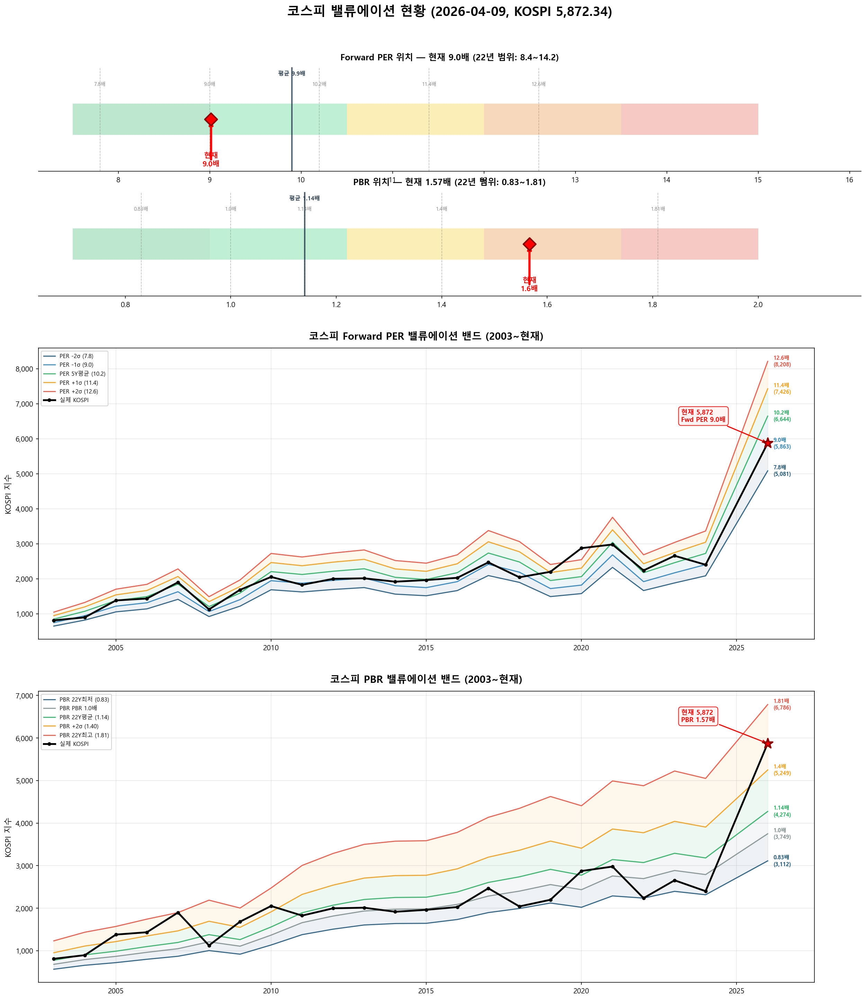

# 📋 MarketTop 일일 종합 (2026-04-09 08:06)

> A4 한 장 요약 — 상세는 각 시장 리포트 참조

---

### 🟢 코스피 5,872.34  —  📈 상승장 (신뢰도 100%)

| 과열 점수 | 72/100 🟡 주의 |
|:---:|:---|
| ⚠️ 과열 지표 | Stoch 95, CCI 142, BB 91% |

**📈 상승 시**

| 다음 매도 목표 | **6,089** (+3.7%) → 이격도111(MA15) + MFI88+ (승률 100%) |
|:---:|:---|

**📉 하락 시**

| 1차 방어선 | **5,696** (-3%) → 30% 손절 |
|:---:|:---|
| 핵심 하락감지 | BB95%반전 + CCI200+ (승률 100%) |
| 강력 매도 | 하락반전 5개 중 2개+ 동시 발동 시 → 50% 청산 |

**📍 분할매도 단계**

| 단계 | 목표가 | 등락률 | 전략 | 승률 |
|:---:|---:|:---:|:---|:---:|
| 🎯 1단계 | **6,089** | +3.7% | 이격도111(MA15) + MFI88+ | 100% |
| ⏳ 2단계 | **6,311** | +7.5% | 이격도113(MA30) + 거래량1.8배+ | 100% |
| ⏳ 3단계 | **6,391** | +8.8% | 이격도119(MA60) + MFI88+ | 100% |
| ⏳ 4단계 | **6,522** | +11.1% | 이격도123(MA65) + RSI85+ | 100% |
| ⏳ 5단계 | **6,792** | +15.7% | 이격도125(MA55) + Stoch95+ | 81% |

**🛑 손절 단계**

| 단계 | 손절가 | 비중 | 전략 | 승률 |
|:---:|---:|:---:|:---|:---:|
| 1단계 | **5,696** (-3%) | 30% | BB95%반전 + CCI200+ | 100% |
| 2단계 | **5,579** (-5%) | 30% | MACD+Stoch동시데드 + RSI60+ + MFI75+ | 100% |
| 3단계 | **5,403** (-8%) | 40% | ADX20+ + MACD데드 + RSI68+ | 86% |

---

### 🔵 코스닥 1,089.85  —  ↔️ 횡보장 (신뢰도 65%)

| 과열 점수 | 47/100 🟢 정상 |
|:---:|:---|
| ⚠️ 과열 지표 | MFI 99 |

**📈 상승 시**

| 다음 매도 목표 | **1,106** (+1.5%) → 이격도102(MA10) + 거래량2.5배+ (승률 86%) |
|:---:|:---|

**📉 하락 시**

| 1차 방어선 | **1,057** (-3%) → 30% 손절 |
|:---:|:---|
| 핵심 하락감지 | MACD데드 + RSI68+ + MFI78+ (승률 100%) |
| 강력 매도 | 하락반전 4개 중 2개+ 동시 발동 시 → 50% 청산 |

**📍 분할매도 단계**

| 단계 | 목표가 | 등락률 | 전략 | 승률 |
|:---:|---:|:---:|:---|:---:|
| ⚡ 1단계 | **1,106** | +1.5% | 이격도102(MA10) + 거래량2.5배+ | 86% |
| ⏳ 2단계 | **1,274** | +16.9% | 이격도122(MA85) + RSI88+ | 93% |
| ⏳ 3단계 | **1,340** | +23.0% | 이격도120(MA25) + RSI60+ | 100% |

**🛑 손절 단계**

| 단계 | 손절가 | 비중 | 전략 | 승률 |
|:---:|---:|:---:|:---|:---:|
| 1단계 | **1,057** (-3%) | 30% | MACD데드 + RSI68+ + MFI78+ | 100% |
| 2단계 | **1,035** (-5%) | 30% | MFI75반전 + CCI230+ | 100% |
| 3단계 | **1,003** (-8%) | 40% | BB95%반전 + CCI200+ | 75% |

---

### 📊 코스피 밸류에이션

| 지표 | 현재 | 22Y평균 | 판단 |
|:---:|:---:|:---:|:---|
| **Fwd PER** | **9.0배** | 9.9배 | 저평가 🟢 |
| **PBR** | **1.57배** | 1.14배 | 과열 🔴 |
| Fwd EPS | 651 | - | BPS 3749 |

| PER 밴드 | 적정지수 | 괴리 |
|:---:|---:|:---:|
| -2σ (7.8) | 5,081 | -13.5% |
| -1σ (9.0) | 5,863 | -0.2% ◀ |
| 5Y평균 (10.2) | 6,644 | +13.1% |
| +1σ (11.4) | 7,426 | +26.5% |
| +2σ (12.6) | 8,208 | +39.8% |

---

### 📎 상세 리포트

- 코스피: [코스피_고점판독리포트_20260409_080536.md](코스피_고점판독리포트_20260409_080536.md)
- 코스닥: [코스닥_고점판독리포트_20260409_080609.md](코스닥_고점판독리포트_20260409_080609.md)

---

*본 리포트는 백테스트 기반 참고용이며, 투자 판단의 최종 책임은 투자자 본인에게 있습니다.*