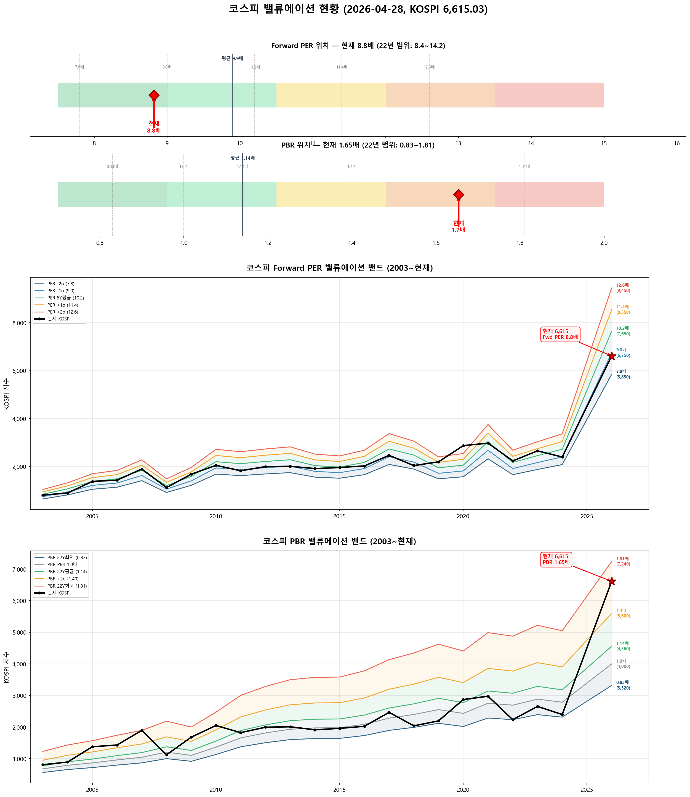

# 📋 MarketTop 일일 종합 (2026-04-28 08:10)

> A4 한 장 요약 — 상세는 각 시장 리포트 참조

---

### 🟢 코스피 6,615.03  —  📈 상승장 (신뢰도 60%)

| 과열 점수 | 85/100 🔴 과열 |
|:---:|:---|
| ⚠️ 과열 지표 | RSI 88, Stoch 95, CCI 121, BB 88% |

**📈 상승 시**

| 🔴 즉시 매도 | 전략 | 승률 |
|:---:|:---|:---:|
| **6,568** (-0.7%) | 이격도113(MA30) + 거래량1.8배+ | 100% |

**📉 하락 시**

| 1차 방어선 | **6,417** (-3%) → 30% 손절 |
|:---:|:---|
| 핵심 하락감지 | BB95%반전 + CCI200+ (승률 100%) |
| 강력 매도 | 하락반전 5개 중 2개+ 동시 발동 시 → 50% 청산 |

**📍 분할매도 단계**

| 단계 | 목표가 | 등락률 | 전략 | 승률 |
|:---:|---:|:---:|:---|:---:|
| 🔴 1단계 | **6,568** | -0.7% | 이격도113(MA30) + 거래량1.8배+ | 100% |
| ⚡ 2단계 | **6,740** | +1.9% | 이격도119(MA60) + MFI88+ | 100% |
| 🎯 3단계 | **6,799** | +2.8% | 이격도111(MA15) + MFI88+ | 100% |
| 🎯 4단계 | **6,902** | +4.3% | 이격도123(MA65) + RSI85+ | 100% |
| ⏳ 5단계 | **7,136** | +7.9% | 이격도125(MA55) + Stoch95+ | 81% |

**🛑 손절 단계**

| 단계 | 손절가 | 비중 | 전략 | 승률 |
|:---:|---:|:---:|:---|:---:|
| 1단계 | **6,417** (-3%) | 30% | BB95%반전 + CCI200+ | 100% |
| 2단계 | **6,284** (-5%) | 30% | MACD+Stoch동시데드 + RSI60+ + MFI75+ | 100% |
| 3단계 | **6,086** (-8%) | 40% | ADX20+ + MACD데드 + RSI68+ | 86% |

---

### 🟢 코스닥 1,226.18  —  📈 상승장 (신뢰도 100%)

| 과열 점수 | 93/100 🔴 과열 |
|:---:|:---|
| ⚠️ 과열 지표 | RSI 91, Stoch 98, MFI 100, CCI 137, BB 94% |

**📈 상승 시**

| 다음 매도 목표 | **1,306** (+6.5%) → 이격도127(MA120) + RSI88+ (승률 100%) |
|:---:|:---|

**📉 하락 시**

| 1차 방어선 | **1,189** (-3%) → 30% 손절 |
|:---:|:---|
| 핵심 하락감지 | MACD데드 + RSI68+ + MFI78+ (승률 100%) |
| 강력 매도 | 하락반전 4개 중 2개+ 동시 발동 시 → 50% 청산 |

**📍 분할매도 단계**

| 단계 | 목표가 | 등락률 | 전략 | 승률 |
|:---:|---:|:---:|:---|:---:|
| ⏳ 1단계 | **1,306** | +6.5% | 이격도127(MA120) + RSI88+ | 100% |
| ⏳ 2단계 | **1,362** | +11.1% | 이격도121(MA25) + RSI60+ | 100% |

**🛑 손절 단계**

| 단계 | 손절가 | 비중 | 전략 | 승률 |
|:---:|---:|:---:|:---|:---:|
| 1단계 | **1,189** (-3%) | 30% | MACD데드 + RSI68+ + MFI78+ | 100% |
| 2단계 | **1,165** (-5%) | 30% | MFI75반전 + CCI230+ | 100% |
| 3단계 | **1,128** (-8%) | 40% | BB95%반전 + CCI200+ | 75% |

---

### 📊 코스피 밸류에이션

| 지표 | 현재 | 22Y평균 | 판단 |
|:---:|:---:|:---:|:---|
| **Fwd PER** | **8.8배** | 9.9배 | 저평가 🟢 |
| **PBR** | **1.65배** | 1.14배 | 과열 🔴 |
| Fwd EPS | 750 | - | BPS 4000 |

| PER 밴드 | 적정지수 | 괴리 |
|:---:|---:|:---:|
| -2σ (7.8) | 5,850 | -11.6% |
| -1σ (9.0) | 6,750 | +2.0% ◀ |
| 5Y평균 (10.2) | 7,650 | +15.6% |
| +1σ (11.4) | 8,550 | +29.3% |
| +2σ (12.6) | 9,450 | +42.9% |

---

### 📎 상세 리포트

- 코스피: [코스피_고점판독리포트_20260428_081010.md](코스피_고점판독리포트_20260428_081010.md)
- 코스닥: [코스닥_고점판독리포트_20260428_081031.md](코스닥_고점판독리포트_20260428_081031.md)

---

*본 리포트는 백테스트 기반 참고용이며, 투자 판단의 최종 책임은 투자자 본인에게 있습니다.*