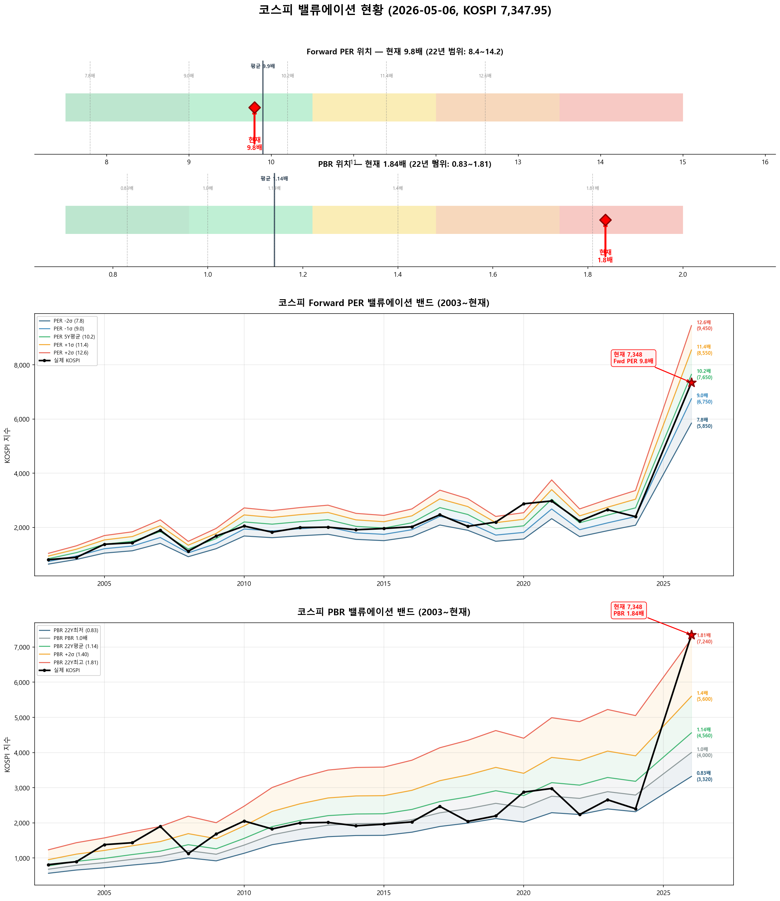

# 📋 MarketTop 일일 종합 (2026-05-06 11:29)

> A4 한 장 요약 — 상세는 각 시장 리포트 참조

---

### 🟢 코스피 7,347.95  —  📈 상승장 (신뢰도 60%)

| 과열 점수 | 95/100 🔴 과열 |
|:---:|:---|
| ⚠️ 과열 지표 | RSI 92, Stoch 99, MFI 88, CCI 189, BB 100% |

> ⚠️ **3/4단계 초과 — 초과분 매도 실행, 다음 목표 7,352(+0.1%) 대기**

**📈 상승 시**

| 🔴 즉시 매도 | 전략 | 승률 |
|:---:|:---|:---:|
| **6,853** (-6.7%) | 이격도115(MA35) + MFI88+ | 80% |
| **7,022** (-4.4%) | 이격도121(MA60) + RSI85+ | 83% |
| **7,268** (-1.1%) | 이격도123(MA40) + Stoch65+ | 88% |

**📉 하락 시**

| 1차 방어선 | **7,128** (-3%) → 30% 손절 |
|:---:|:---|
| 핵심 하락감지 | ADX20+ + MACD데드 + RSI68+ (승률 83%) |
| 강력 매도 | 하락반전 2개 중 2개+ 동시 발동 시 → 50% 청산 |

**📍 분할매도 단계**

| 단계 | 목표가 | 등락률 | 전략 | 승률 |
|:---:|---:|:---:|:---|:---:|
| ⚡ 1단계 | **7,352** | +0.1% | 이격도125(MA50) + Stoch88+ | 75% |

**🛑 손절 단계**

| 단계 | 손절가 | 비중 | 전략 | 승률 |
|:---:|---:|:---:|:---|:---:|
| 1단계 | **7,128** (-3%) | 30% | ADX20+ + MACD데드 + RSI68+ | 83% |
| 2단계 | **6,981** (-5%) | 30% | BB101%반전 + RSI60+ + Stoch85+ | 70% |

---

### 🟢 코스닥 1,202.93  —  📈 상승장 (신뢰도 80%)

| 과열 점수 | 66/100 🟡 주의 |
|:---:|:---|
| ⚠️ 과열 지표 | RSI 71 |

> ✅ **다음 매도 목표 1,326(+10.2%) 대기**

**📈 상승 시**

| 다음 매도 목표 | **1,326** (+10.2%) → 이격도123(MA95) + RSI88+ (승률 83%) |
|:---:|:---|

**📉 하락 시**

| 1차 방어선 | **1,167** (-3%) → 30% 손절 |
|:---:|:---|
| 핵심 하락감지 | MACD데드 + RSI68+ + MFI78+ (승률 100%) |
| 강력 매도 | 하락반전 4개 중 2개+ 동시 발동 시 → 50% 청산 |

**📍 분할매도 단계**

| 단계 | 목표가 | 등락률 | 전략 | 승률 |
|:---:|---:|:---:|:---|:---:|
| ⏳ 1단계 | **1,326** | +10.2% | 이격도123(MA95) + RSI88+ | 83% |
| ⏳ 2단계 | **1,358** | +12.9% | 이격도125(MA90) + RSI73+ | 71% |

**🛑 손절 단계**

| 단계 | 손절가 | 비중 | 전략 | 승률 |
|:---:|---:|:---:|:---|:---:|
| 1단계 | **1,167** (-3%) | 30% | MACD데드 + RSI68+ + MFI78+ | 100% |
| 2단계 | **1,143** (-5%) | 30% | MFI88반전 + RSI60+ + Stoch95+ | 80% |
| 3단계 | **1,107** (-8%) | 40% | MFI65반전 + CCI230+ | 80% |

---

### 📊 코스피 밸류에이션

| 지표 | 현재 | 22Y평균 | 판단 |
|:---:|:---:|:---:|:---|
| **Fwd PER** | **9.8배** | 9.9배 | 적정 ⚪ |
| **PBR** | **1.84배** | 1.14배 | 과열 🔴 |
| Fwd EPS | 750 | - | BPS 4000 |

| PER 밴드 | 적정지수 | 괴리 |
|:---:|---:|:---:|
| -2σ (7.8) | 5,850 | -20.4% |
| -1σ (9.0) | 6,750 | -8.1% |
| 5Y평균 (10.2) | 7,650 | +4.1% ◀ |
| +1σ (11.4) | 8,550 | +16.4% |
| +2σ (12.6) | 9,450 | +28.6% |

---

### 📎 상세 리포트

- 코스피: [코스피_고점판독리포트_20260506_112930.md](코스피_고점판독리포트_20260506_112930.md)
- 코스닥: [코스닥_고점판독리포트_20260506_112944.md](코스닥_고점판독리포트_20260506_112944.md)

---

*본 리포트는 백테스트 기반 참고용이며, 투자 판단의 최종 책임은 투자자 본인에게 있습니다.*