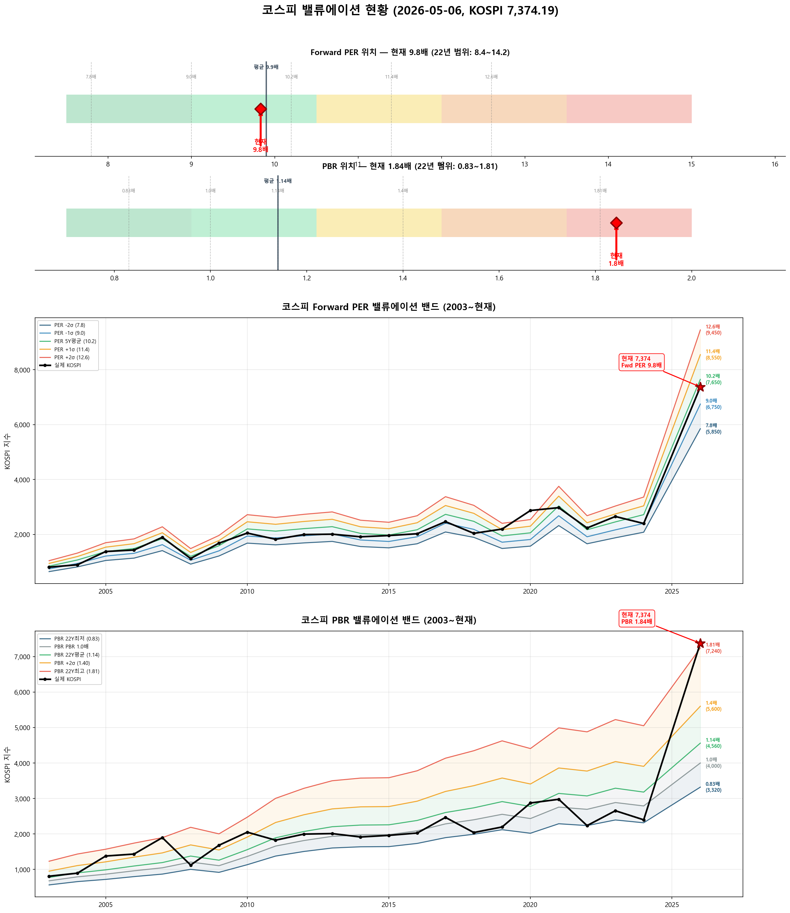

# 📋 MarketTop 일일 종합 (2026-05-06 11:57)

> A4 한 장 요약 — 상세는 각 시장 리포트 참조

---

### 🟢 코스피 7,374.19  —  📈 상승장 (신뢰도 60%)

| 과열 점수 | 95/100 🔴 과열 |
|:---:|:---|
| ⚠️ 과열 지표 | RSI 92, Stoch 100, MFI 88, CCI 192, BB 100% |

> 🚨 **매도 목표 전 3단계 초과 — 보유분 즉시 축소 권장**

**📈 상승 시**

| 🔴 즉시 매도 | 전략 | 승률 | 틀렸을 때 |
|:---:|:---|:---:|:---|
| **6,854** (-7.1%) | 이격도115(MA35) + MFI88+ | 80% | 평균 +3.5%, 최대 +3.5% |
| **7,022** (-4.8%) | 이격도121(MA60) + RSI85+ | 83% | 평균 +2.2%, 최대 +2.2% |
| **7,268** (-1.4%) | 이격도123(MA40) + Stoch65+ | 88% | 평균 +24.6%, 최대 +24.6% |

> 💡 승률 = 매도 후 20일 내 하락 확률. "틀렸을 때" = 매도 후 오히려 상승한 경우의 평균/최대 상승폭

**📉 하락 시**

| 1차 방어선 | **7,153** (-3%) → 30% 손절 |
|:---:|:---|
| 핵심 하락감지 | ADX20+ + MACD데드 + RSI68+ (승률 83%) |
| 강력 매도 | 하락반전 2개 중 2개+ 동시 발동 시 → 50% 청산 |

**📍 분할매도 단계**

> 🚨 **전 3단계 매도 목표 초과** — 보유분 즉시 축소 권장

**🛑 손절 단계**

| 단계 | 손절가 | 비중 | 전략 | 승률 |
|:---:|---:|:---:|:---|:---:|
| 1단계 | **7,153** (-3%) | 30% | ADX20+ + MACD데드 + RSI68+ | 83% |
| 2단계 | **7,005** (-5%) | 30% | BB101%반전 + RSI60+ + Stoch85+ | 70% |

---

### 🟢 코스닥 1,202.11  —  📈 상승장 (신뢰도 80%)

| 과열 점수 | 65/100 🟡 주의 |
|:---:|:---|
| ⚠️ 과열 지표 | RSI 71 |

> ✅ **다음 매도 목표 1,326(+10.3%) 대기**

**📈 상승 시**

| 다음 매도 목표 | **1,326** (+10.3%) → 이격도123(MA95) + RSI88+ (승률 83%) |
|:---:|:---|

**📉 하락 시**

| 1차 방어선 | **1,166** (-3%) → 30% 손절 |
|:---:|:---|
| 핵심 하락감지 | MACD데드 + RSI68+ + MFI78+ (승률 100%) |
| 강력 매도 | 하락반전 4개 중 2개+ 동시 발동 시 → 50% 청산 |

**📍 분할매도 단계**

| 단계 | 목표가 | 등락률 | 전략 | 승률 | 틀렸을 때 |
|:---:|---:|:---:|:---|:---:|:---|
| ⏳ 1단계 | **1,326** | +10.3% | 이격도123(MA95) + RSI88+ | 83% | 평균+5% |
| ⏳ 2단계 | **1,358** | +13.0% | 이격도125(MA90) + RSI73+ | 71% | 평균+12% |

**🛑 손절 단계**

| 단계 | 손절가 | 비중 | 전략 | 승률 |
|:---:|---:|:---:|:---|:---:|
| 1단계 | **1,166** (-3%) | 30% | MACD데드 + RSI68+ + MFI78+ | 100% |
| 2단계 | **1,142** (-5%) | 30% | MFI88반전 + RSI60+ + Stoch95+ | 80% |
| 3단계 | **1,106** (-8%) | 40% | MFI65반전 + CCI230+ | 80% |

---

### 📊 코스피 밸류에이션

| 지표 | 현재 | 22Y평균 | 판단 |
|:---:|:---:|:---:|:---|
| **Fwd PER** | **9.8배** | 9.9배 | 적정 ⚪ |
| **PBR** | **1.84배** | 1.14배 | 과열 🔴 |
| Fwd EPS | 750 | - | BPS 4000 |

| PER 밴드 | 적정지수 | 괴리 |
|:---:|---:|:---:|
| -2σ (7.8) | 5,850 | -20.7% |
| -1σ (9.0) | 6,750 | -8.5% |
| 5Y평균 (10.2) | 7,650 | +3.7% ◀ |
| +1σ (11.4) | 8,550 | +15.9% |
| +2σ (12.6) | 9,450 | +28.1% |

---

### 📉 코스피 향후 60일 하락 위험 분석

> 💡 과거 30년간 지금과 비슷했던 상황(이격도 127%, 2개월 상승률 +39%) **36번** 발생
> → 그때 이후 2개월간 실제로 얼마나 빠졌는지 통계

| 항목 | 결과 | 해석 |
|:---|:---:|:---|
| **지금부터 2개월 내 평균 최대낙폭** | **-10.3%** | 🟠 주의 |
| 절반은 이 정도로 빠짐 (중위값) | -7.5% | 운 좋으면 이 수준 |
| 역대 최악의 경우 | -45.5% | 극단 시나리오 |
| ⚠️ 평소보다 위험한 정도 | **1.8배** | 평소보다 1.8배 더 빠질 수 있음 |

**2개월 내 하락 확률과 예상 지수:**

| 하락폭 | 발생 확률 | 그때 지수 |
|:---|:---:|---:|
| -5% 이상 하락 | **61%** | 7,005 |
| -10% 이상 하락 | **39%** | 6,637 |
| -15% 이상 하락 | **25%** | 6,268 |
| -20% 이상 하락 | **17%** | 5,899 |

### 📉 코스닥 향후 60일 하락 위험 분석

> 💡 과거 30년간 지금과 비슷했던 상황(이격도 106%, 2개월 상승률 +5%) **634번** 발생
> → 그때 이후 2개월간 실제로 얼마나 빠졌는지 통계

| 항목 | 결과 | 해석 |
|:---|:---:|:---|
| **지금부터 2개월 내 평균 최대낙폭** | **-7.5%** | 🟡 보통 |
| 절반은 이 정도로 빠짐 (중위값) | -5.7% | 운 좋으면 이 수준 |
| 역대 최악의 경우 | -38.2% | 극단 시나리오 |
| 평소보다 위험한 정도 | 0.8배 | 평소와 비슷한 수준 |

**2개월 내 하락 확률과 예상 지수:**

| 하락폭 | 발생 확률 | 그때 지수 |
|:---|:---:|---:|
| -5% 이상 하락 | **55%** | 1,142 |
| -10% 이상 하락 | **25%** | 1,082 |
| -15% 이상 하락 | **17%** | 1,022 |
| -20% 이상 하락 | **10%** | 962 |

---

### 📎 상세 리포트

- 코스피: [코스피_고점판독리포트_20260506_115723.md](코스피_고점판독리포트_20260506_115723.md)
- 코스닥: [코스닥_고점판독리포트_20260506_115733.md](코스닥_고점판독리포트_20260506_115733.md)

---

*본 리포트는 백테스트 기반 참고용이며, 투자 판단의 최종 책임은 투자자 본인에게 있습니다.*