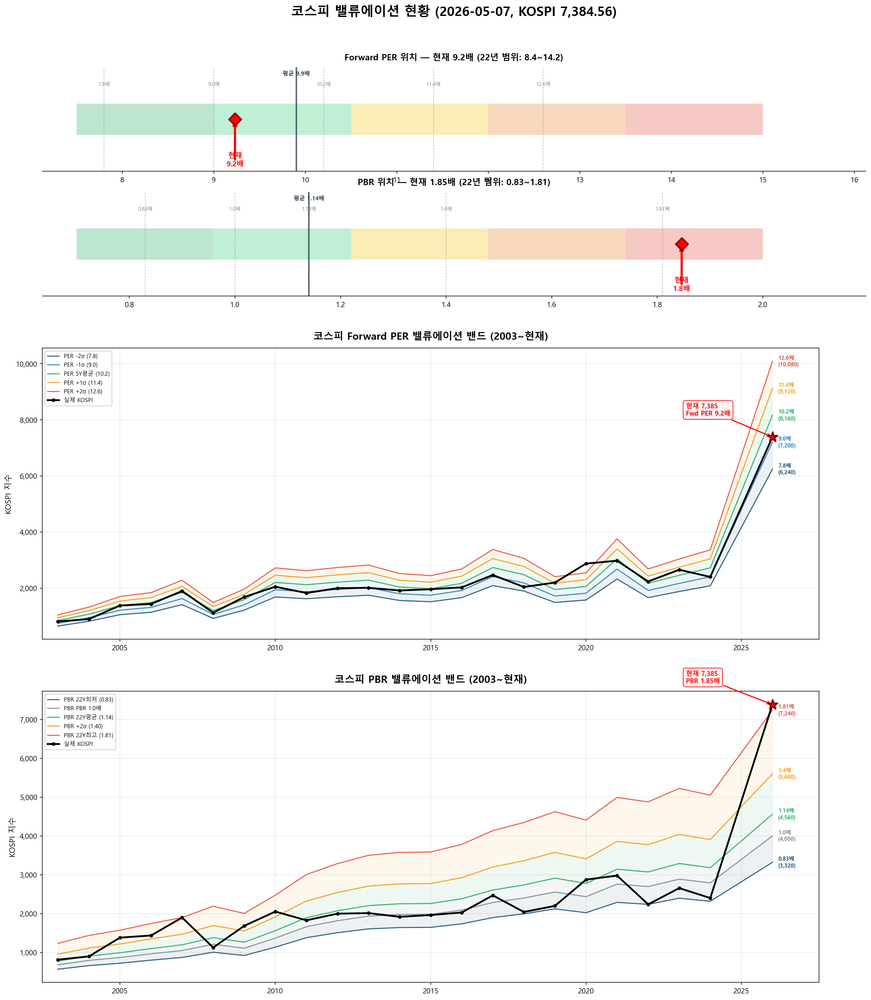

# 📋 MarketTop 일일 종합 (2026-05-07 07:16)

> A4 한 장 요약 — 상세는 각 시장 리포트 참조

---

### 🟢 코스피 7,384.56  —  📈 상승장 (신뢰도 60%)

| 과열 점수 | 95/100 🔴 과열 |
|:---:|:---|
| ⚠️ 과열 지표 | RSI 92, Stoch 97, MFI 89, CCI 195, BB 100% |

> 🚨 **매도 목표 전 3단계 초과 — 보유분 즉시 축소 권장**

**📈 상승 시**

| 단계 | 매도가 | 등락률 | 전략 | 승률 | 틀렸을 때 |
|:---:|---:|:---:|:---|:---:|:---|
| 🔴 1단계 | **6,855** | -7.2% | 이격도115(MA35) + MFI88+ | 80% | 평균+3.5% |
| 🔴 2단계 | **7,023** | -4.9% | 이격도121(MA60) + RSI85+ | 83% | 평균+2.2% |
| 🔴 3단계 | **7,269** | -1.6% | 이격도123(MA40) + Stoch65+ | 88% | 평균+24.6% |
| ▶ 4단계 | **7,641** | +3.5% | 10일내 중위 상승폭 (확률 50%) | - | 잔여분 익절 |
| ▶ 5단계 | **7,838** | +6.1% | 20일내 중위 상승폭 (확률 50%) | - | 잔여분 익절 |
| ▶ 6단계 | **8,987** | +21.7% | 60일내 보수적 상승폭 (확률 75%) | - | 잔여분 익절 |
| ▶ 7단계 | **9,811** | +32.9% | 60일내 중위 상승폭 (확률 50%) | - | 잔여분 익절 |

> 💡 🔴 = 이미 초과 (즉시 축소). ▶ = 과거 유사 상황의 실제 상승폭 기반 목표.

**📉 하락 시**

| 1차 방어선 | **7,163** (-3%) → 30% 손절 |
|:---:|:---|
| 핵심 하락감지 | ADX20+ + MACD데드 + RSI68+ (승률 83%) |
| 강력 매도 | 하락반전 3개 중 2개+ 동시 발동 시 → 50% 청산 |

**📍 분할매도 단계**

> 🚨 **전 3단계 매도 목표 초과** — 보유분 즉시 축소 권장

**🛑 손절 단계**

| 단계 | 손절가 | 비중 | 전략 | 승률 |
|:---:|---:|:---:|:---|:---:|
| 1단계 | **7,163** (-3%) | 30% | ADX20+ + MACD데드 + RSI68+ | 83% |
| 2단계 | **7,015** (-5%) | 30% | MFI85반전 + RSI85+ + Stoch95+ | 71% |
| 3단계 | **6,794** (-8%) | 40% | BB101%반전 + RSI60+ + Stoch85+ | 70% |

---

### 🟢 코스닥 1,210.17  —  📈 상승장 (신뢰도 80%)

| 과열 점수 | 66/100 🟡 주의 |
|:---:|:---|
| ⚠️ 과열 지표 | RSI 74 |

> ✅ **다음 매도 목표 1,326(+9.6%) 대기**

**📈 상승 시**

| 다음 매도 목표 | **1,326** (+9.6%) → 이격도123(MA95) + RSI88+ (승률 83%) |
|:---:|:---|

**📉 하락 시**

| 1차 방어선 | **1,174** (-3%) → 30% 손절 |
|:---:|:---|
| 핵심 하락감지 | MACD데드 + RSI68+ + MFI78+ (승률 100%) |
| 강력 매도 | 하락반전 4개 중 2개+ 동시 발동 시 → 50% 청산 |

**📍 분할매도 단계**

| 단계 | 목표가 | 등락률 | 전략 | 승률 | 틀렸을 때 |
|:---:|---:|:---:|:---|:---:|:---|
| ⏳ 1단계 | **1,326** | +9.6% | 이격도123(MA95) + RSI88+ | 83% | 평균+5% |
| ⏳ 2단계 | **1,358** | +12.3% | 이격도125(MA90) + RSI73+ | 71% | 평균+12% |

**🛑 손절 단계**

| 단계 | 손절가 | 비중 | 전략 | 승률 |
|:---:|---:|:---:|:---|:---:|
| 1단계 | **1,174** (-3%) | 30% | MACD데드 + RSI68+ + MFI78+ | 100% |
| 2단계 | **1,150** (-5%) | 30% | MFI88반전 + RSI60+ + Stoch95+ | 80% |
| 3단계 | **1,113** (-8%) | 40% | MFI65반전 + CCI230+ | 80% |

---

### 📊 코스피 밸류에이션

| 지표 | 현재 | 22Y평균 | 판단 |
|:---:|:---:|:---:|:---|
| **Fwd PER** | **9.2배** | 9.9배 | 저평가 🟢 |
| **PBR** | **1.85배** | 1.14배 | 과열 🔴 |
| Fwd EPS | 800 | - | BPS 4000 |

| PER 밴드 | 적정지수 | 괴리 |
|:---:|---:|:---:|
| -2σ (7.8) | 6,240 | -15.5% |
| -1σ (9.0) | 7,200 | -2.5% ◀ |
| 5Y평균 (10.2) | 8,160 | +10.5% |
| +1σ (11.4) | 9,120 | +23.5% |
| +2σ (12.6) | 10,080 | +36.5% |

---

### � 코스피 향후 60일 등락 위험 분석

> 💡 과거 30년간 지금과 비슷했던 상황(이격도 127%, 2개월 상승률 +40%) **36번** 발생
> → 그때 이후 2개월간 실제로 얼마나 올랐고 빠졌는지 통계

**📈 상승 가능성:**

| 항목 | 결과 | 해석 |
|:---|:---:|:---|
| **2개월 내 평균 최대상승폭** | **+29.6%** | 중위값 +32.9% |
| 역대 최고 사례 | +55.0% | 지수 11,447 |

| 상승폭 | 발생 확률 | 그때 지수 |
|:---|:---:|---:|
| +5% 이상 상승 | **78%** | 7,754 |
| +10% 이상 상승 | **78%** | 8,123 |
| +15% 이상 상승 | **78%** | 8,492 |
| +20% 이상 상승 | **78%** | 8,861 |

**📉 하락 위험:** 🟠 주의

| 항목 | 결과 | 해석 |
|:---|:---:|:---|
| **2개월 내 평균 최대낙폭** | **-9.3%** | 중위값 -7.5% |
| 역대 최악의 경우 | -45.4% | 지수 4,036 |
| ⚠️ 평소보다 위험한 정도 | **1.6배** | 평소보다 1.6배 더 빠질 수 있음 |

**2개월 내 하락 확률과 예상 지수:**

| 하락폭 | 발생 확률 | 그때 지수 |
|:---|:---:|---:|
| -5% 이상 하락 | **61%** | 7,015 |
| -10% 이상 하락 | **39%** | 6,646 |
| -15% 이상 하락 | **22%** | 6,277 |
| -20% 이상 하락 | **14%** | 5,908 |

**💡 확률 기반 판단:**

> 과거 유사 상황에서 **+20%까지 상승할 확률이 50% 이상**이었고,
> 동시에 **-5%까지 하락할 확률도 50% 이상**이었습니다.
>
> 📌 **상승 기대값(23.0)이 하락 기대값(5.7)보다 크므로 (4.0배)**,
> **8,861**(+20%)까지 보유 후 익절하되, **7,015**(-5%) 이탈 시 손절이 합리적

### � 코스닥 향후 60일 등락 위험 분석

> 💡 과거 30년간 지금과 비슷했던 상황(이격도 106%, 2개월 상승률 +6%) **679번** 발생
> → 그때 이후 2개월간 실제로 얼마나 올랐고 빠졌는지 통계

**📈 상승 가능성:**

| 항목 | 결과 | 해석 |
|:---|:---:|:---|
| **2개월 내 평균 최대상승폭** | **+9.9%** | 중위값 +6.5% |
| 역대 최고 사례 | +47.7% | 지수 1,788 |

| 상승폭 | 발생 확률 | 그때 지수 |
|:---|:---:|---:|
| +5% 이상 상승 | **57%** | 1,271 |
| +10% 이상 상승 | **36%** | 1,331 |
| +15% 이상 상승 | **27%** | 1,392 |
| +20% 이상 상승 | **20%** | 1,452 |

**📉 하락 위험:** 🟡 보통

| 항목 | 결과 | 해석 |
|:---|:---:|:---|
| **2개월 내 평균 최대낙폭** | **-7.7%** | 중위값 -5.7% |
| 역대 최악의 경우 | -38.2% | 지수 748 |
| 평소보다 위험한 정도 | 0.9배 | 평소와 비슷한 수준 |

**2개월 내 하락 확률과 예상 지수:**

| 하락폭 | 발생 확률 | 그때 지수 |
|:---|:---:|---:|
| -5% 이상 하락 | **54%** | 1,150 |
| -10% 이상 하락 | **26%** | 1,089 |
| -15% 이상 하락 | **18%** | 1,029 |
| -20% 이상 하락 | **11%** | 968 |

**💡 확률 기반 판단:**

> 과거 유사 상황에서 **+5%까지 상승할 확률이 50% 이상**이었고,
> 동시에 **-5%까지 하락할 확률도 50% 이상**이었습니다.
>
> 📌 상승·하락 기대값이 비슷합니다 (상승 5.6 vs 하락 4.2).
> 현재가 부근에서 **분할 익절** 추천. 목표 **1,271**(+5%), 손절 **1,150**(-5%)

---

### 🔮 코스피 과거 유사 패턴 분석

> 💡 현재와 가격 움직임 + 기술적 지표가 비슷했던 과거 **8개 시점** 발견 (평균 유사도 68%)
> → 그 시점 이후 40일간 실제로 어떻게 움직였는지 통계

**📊 유사 패턴 이후 40일간 등락 범위:**

| 구분 | 평균 | 중위값 | 지수 환산 |
|:---|:---:|:---:|---:|
| 📈 최대 상승폭 | **+15.9%** | +15.2% | 8,505 |
| 📉 최대 하락폭 | **-6.0%** | -5.6% | 6,973 |
| 🚀 최고 사례 | +22.0% | - | 9,008 |
| 💥 최악 사례 | -10.4% | - | 6,617 |

**🔄 반전 패턴:**

| 패턴 | 평균 크기 | 해석 |
|:---|:---:|:---|
| 고점 찍고 반락 | **-21.3%** | 상승 후 평균 이만큼 되돌림 |
| 저점 찍고 반등 | **+20.8%** | 하락 후 평균 이만큼 회복 |

**⏰ 시간대별 상승 확률:**

| 기간 | 상승 확률 | 평균 수익률 | 예상 지수 |
|:---|:---:|:---:|---:|
| 10일 후 | **75%** | +3.3% | 7,628 |
| 20일 후 | **62%** | +1.1% | 7,465 |
| 40일 후 | **62%** | +4.5% | 7,720 |

**📈 대표 경로 (중위값):**

| 시점 | 낙관(상위25%) | 중립(중위) | 비관(하위25%) | 중립 지수 |
|:---|:---:|:---:|:---:|---:|
| 5일 후 | +2.9% | -0.7% | -2.8% | 7,332 |
| 10일 후 | +5.9% | +3.9% | +0.3% | 7,672 |
| 20일 후 | +3.9% | +1.9% | -2.9% | 7,525 |
| 30일 후 | +9.3% | +5.7% | +2.4% | 7,804 |
| 40일 후 | +12.5% | +3.6% | -2.6% | 7,652 |

**📅 가장 유사했던 과거 시점 (최근 5개):**

- **2026-02-04** (유사도 66%) — 지수 5,371 → 40일간 최대+17.4%, 최대-5.9%, 최종+2.3%
- **2026-01-29** (유사도 69%) — 지수 5,221 → 40일간 최대+20.8%, 최대-5.2%, 최종+4.9%
- **2026-01-28** (유사도 70%) — 지수 5,171 → 40일간 최대+22.0%, 최대-4.3%, 최종-2.3%
- **2002-03-13** (유사도 70%) — 지수 849 → 40일간 최대+10.4%, 최대-3.7%, 최종-3.7%
- **2001-11-26** (유사도 67%) — 지수 675 → 40일간 최대+12.3%, 최대-6.8%, 최종+12.3%

### 🔮 코스닥 과거 유사 패턴 분석

> 💡 현재와 가격 움직임 + 기술적 지표가 비슷했던 과거 **20개 시점** 발견 (평균 유사도 72%)
> → 그 시점 이후 40일간 실제로 어떻게 움직였는지 통계

**📊 유사 패턴 이후 40일간 등락 범위:**

| 구분 | 평균 | 중위값 | 지수 환산 |
|:---|:---:|:---:|---:|
| 📈 최대 상승폭 | **+6.5%** | +3.5% | 1,252 |
| 📉 최대 하락폭 | **-6.0%** | -5.6% | 1,143 |
| 🚀 최고 사례 | +25.4% | - | 1,517 |
| 💥 최악 사례 | -23.8% | - | 922 |

**🔄 반전 패턴:**

| 패턴 | 평균 크기 | 해석 |
|:---|:---:|:---|
| 고점 찍고 반락 | **-10.7%** | 상승 후 평균 이만큼 되돌림 |
| 저점 찍고 반등 | **+10.7%** | 하락 후 평균 이만큼 회복 |

**⏰ 시간대별 상승 확률:**

| 기간 | 상승 확률 | 평균 수익률 | 예상 지수 |
|:---|:---:|:---:|---:|
| 10일 후 | **50%** | -0.1% | 1,209 |
| 20일 후 | **55%** | -0.1% | 1,209 |
| 40일 후 | **50%** | +1.9% | 1,233 |

**📈 대표 경로 (중위값):**

| 시점 | 낙관(상위25%) | 중립(중위) | 비관(하위25%) | 중립 지수 |
|:---|:---:|:---:|:---:|---:|
| 5일 후 | +2.4% | +1.0% | -2.2% | 1,222 |
| 10일 후 | +3.7% | -0.1% | -4.1% | 1,208 |
| 20일 후 | +4.2% | +1.4% | -5.0% | 1,227 |
| 30일 후 | +6.4% | +0.7% | -4.8% | 1,219 |
| 40일 후 | +5.0% | -0.0% | -3.1% | 1,210 |

**📅 가장 유사했던 과거 시점 (최근 5개):**

- **2025-12-22** (유사도 70%) — 지수 929 → 40일간 최대+25.4%, 최대-1.5%, 최종+25.4%
- **2024-01-08** (유사도 72%) — 지수 879 → 40일간 최대+0.6%, 최대-9.2%, 최종-1.8%
- **2023-04-17** (유사도 71%) — 지수 910 → 40일간 최대+0.0%, 최대-10.4%, 최종-2.4%
- **2023-04-10** (유사도 71%) — 지수 888 → 40일간 최대+2.4%, 최대-8.3%, 최종-0.5%
- **2021-04-27** (유사도 71%) — 지수 1,021 → 40일간 최대+0.0%, 최대-7.1%, 최종-0.8%

---

### 📎 상세 리포트

- 코스피: [코스피_고점판독리포트_20260507_071551.md](코스피_고점판독리포트_20260507_071551.md)
- 코스닥: [코스닥_고점판독리포트_20260507_071605.md](코스닥_고점판독리포트_20260507_071605.md)

---

*본 리포트는 백테스트 기반 참고용이며, 투자 판단의 최종 책임은 투자자 본인에게 있습니다.*