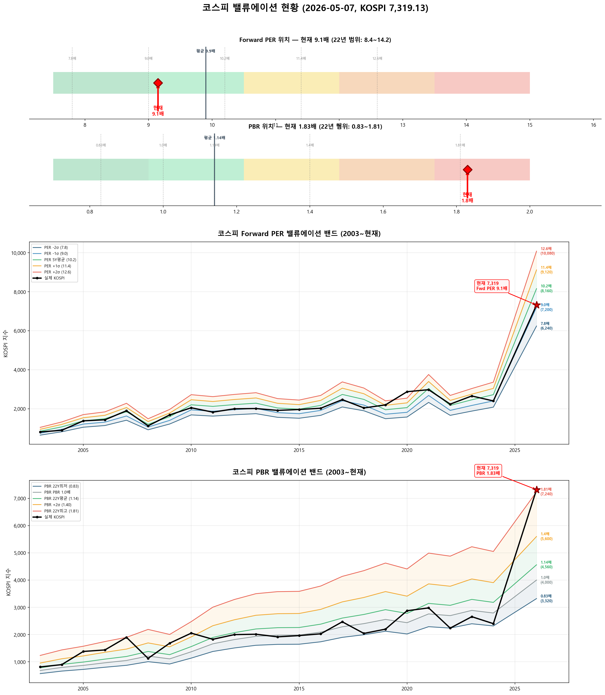

# 📋 MarketTop 일일 종합 (2026-05-07 10:41)

> A4 한 장 요약 — 상세는 각 시장 리포트 참조

---

### 🟢 코스피 7,319.13  —  📈 상승장 (신뢰도 60%)

| 과열 점수 | 91/100 🔴 과열 |
|:---:|:---|
| ⚠️ 과열 지표 | RSI 88, Stoch 85, MFI 88, CCI 186, BB 100% |

> ⚠️ **2/3단계 초과 — 초과분 매도 실행, 다음 목표 7,324(+0.1%) 대기**

**📈 상승 시**

| 단계 | 매도가 | 등락률 | 전략 | 승률 | 틀렸을 때 |
|:---:|---:|:---:|:---|:---:|:---|
| 🔴 1단계 | **6,910** | -5.6% | 이격도115(MA35) + MFI88+ | 80% | 평균+3.5% |
| 🔴 2단계 | **7,062** | -3.5% | 이격도121(MA60) + RSI85+ | 83% | 평균+2.2% |
| ▶ 3단계 | **7,324** | +0.1% | 이격도123(MA40) + Stoch65+ | 88% | 잔여분 매도 |

> 💡 🔴 = 이미 초과 (즉시 축소). ▶ = 과거 유사 상황의 실제 상승폭 기반 목표.

**📉 하락 시**

| 1차 방어선 | **7,100** (-3%) → 30% 손절 |
|:---:|:---|
| 핵심 하락감지 | ADX20+ + MACD데드 + RSI68+ (승률 83%) |
| 강력 매도 | 하락반전 3개 중 2개+ 동시 발동 시 → 50% 청산 |

**📍 분할매도 단계**

| 단계 | 목표가 | 등락률 | 전략 | 승률 | 틀렸을 때 |
|:---:|---:|:---:|:---|:---:|:---|
| ⚡ 1단계 | **7,324** | +0.1% | 이격도123(MA40) + Stoch65+ | 88% | 평균+25% |

**🛑 손절 단계**

| 단계 | 손절가 | 비중 | 전략 | 승률 |
|:---:|---:|:---:|:---|:---:|
| 1단계 | **7,100** (-3%) | 30% | ADX20+ + MACD데드 + RSI68+ | 83% |
| 2단계 | **6,953** (-5%) | 30% | MFI85반전 + RSI85+ + Stoch95+ | 71% |
| 3단계 | **6,734** (-8%) | 40% | BB101%반전 + RSI60+ + Stoch85+ | 70% |

---

### 🟢 코스닥 1,200.73  —  📈 상승장 (신뢰도 80%)

| 과열 점수 | 62/100 🟡 주의 |
|:---:|:---|

> ✅ **다음 매도 목표 1,329(+10.7%) 대기**

**📈 상승 시**

| 다음 매도 목표 | **1,329** (+10.7%) → 이격도123(MA95) + RSI88+ (승률 83%) |
|:---:|:---|

**📉 하락 시**

| 1차 방어선 | **1,165** (-3%) → 30% 손절 |
|:---:|:---|
| 핵심 하락감지 | MACD데드 + RSI68+ + MFI78+ (승률 100%) |
| 강력 매도 | 하락반전 4개 중 2개+ 동시 발동 시 → 50% 청산 |

**📍 분할매도 단계**

| 단계 | 목표가 | 등락률 | 전략 | 승률 | 틀렸을 때 |
|:---:|---:|:---:|:---|:---:|:---|
| ⏳ 1단계 | **1,329** | +10.7% | 이격도123(MA95) + RSI88+ | 83% | 평균+5% |
| ⏳ 2단계 | **1,362** | +13.5% | 이격도125(MA90) + RSI73+ | 71% | 평균+12% |

**🛑 손절 단계**

| 단계 | 손절가 | 비중 | 전략 | 승률 |
|:---:|---:|:---:|:---|:---:|
| 1단계 | **1,165** (-3%) | 30% | MACD데드 + RSI68+ + MFI78+ | 100% |
| 2단계 | **1,141** (-5%) | 30% | MFI88반전 + RSI60+ + Stoch95+ | 80% |
| 3단계 | **1,105** (-8%) | 40% | MFI65반전 + CCI230+ | 80% |

---

### 📊 코스피 밸류에이션

| 지표 | 현재 | 22Y평균 | 판단 |
|:---:|:---:|:---:|:---|
| **Fwd PER** | **9.1배** | 9.9배 | 저평가 🟢 |
| **PBR** | **1.83배** | 1.14배 | 과열 🔴 |
| Fwd EPS | 800 | - | BPS 4000 |

| PER 밴드 | 적정지수 | 괴리 |
|:---:|---:|:---:|
| -2σ (7.8) | 6,240 | -14.7% |
| -1σ (9.0) | 7,200 | -1.6% ◀ |
| 5Y평균 (10.2) | 8,160 | +11.5% |
| +1σ (11.4) | 9,120 | +24.6% |
| +2σ (12.6) | 10,080 | +37.7% |

---

### � 코스피 향후 60일 등락 위험 분석

> 💡 과거 30년간 지금과 비슷했던 상황(이격도 125%, 2개월 상승률 +36%) **46번** 발생
> → 그때 이후 2개월간 실제로 얼마나 올랐고 빠졌는지 통계

**📈 상승 가능성:**

| 항목 | 결과 | 해석 |
|:---|:---:|:---|
| **2개월 내 평균 최대상승폭** | **+28.0%** | 중위값 +34.6% |
| 역대 최고 사례 | +57.2% | 지수 11,508 |

| 상승폭 | 발생 확률 | 그때 지수 |
|:---|:---:|---:|
| +5% 이상 상승 | **72%** | 7,685 |
| +10% 이상 상승 | **70%** | 8,051 |
| +15% 이상 상승 | **70%** | 8,417 |
| +20% 이상 상승 | **70%** | 8,783 |

**📉 하락 위험:** 🟠 주의

| 항목 | 결과 | 해석 |
|:---|:---:|:---|
| **2개월 내 평균 최대낙폭** | **-9.9%** | 중위값 -6.1% |
| 역대 최악의 경우 | -45.7% | 지수 3,976 |
| ⚠️ 평소보다 위험한 정도 | **1.7배** | 평소보다 1.7배 더 빠질 수 있음 |

**2개월 내 하락 확률과 예상 지수:**

| 하락폭 | 발생 확률 | 그때 지수 |
|:---|:---:|---:|
| -5% 이상 하락 | **65%** | 6,953 |
| -10% 이상 하락 | **30%** | 6,587 |
| -15% 이상 하락 | **24%** | 6,221 |
| -20% 이상 하락 | **15%** | 5,855 |

**💡 확률 기반 판단:**

> 과거 유사 상황에서 **+20%까지 상승할 확률이 50% 이상**이었고,
> 동시에 **-5%까지 하락할 확률도 50% 이상**이었습니다.
>
> 📌 **상승 기대값(20.1)이 하락 기대값(6.4)보다 크므로 (3.1배)**,
> **8,783**(+20%)까지 보유 후 익절하되, **6,953**(-5%) 이탈 시 손절이 합리적

### � 코스닥 향후 60일 등락 위험 분석

> 💡 과거 30년간 지금과 비슷했던 상황(이격도 106%, 2개월 상승률 +4%) **615번** 발생
> → 그때 이후 2개월간 실제로 얼마나 올랐고 빠졌는지 통계

**📈 상승 가능성:**

| 항목 | 결과 | 해석 |
|:---|:---:|:---|
| **2개월 내 평균 최대상승폭** | **+9.6%** | 중위값 +6.0% |
| 역대 최고 사례 | +47.7% | 지수 1,774 |

| 상승폭 | 발생 확률 | 그때 지수 |
|:---|:---:|---:|
| +5% 이상 상승 | **56%** | 1,261 |
| +10% 이상 상승 | **35%** | 1,321 |
| +15% 이상 상승 | **27%** | 1,381 |
| +20% 이상 상승 | **20%** | 1,441 |

**📉 하락 위험:** 🟡 보통

| 항목 | 결과 | 해석 |
|:---|:---:|:---|
| **2개월 내 평균 최대낙폭** | **-7.4%** | 중위값 -5.7% |
| 역대 최악의 경우 | -38.2% | 지수 743 |
| 평소보다 위험한 정도 | 0.8배 | 평소와 비슷한 수준 |

**2개월 내 하락 확률과 예상 지수:**

| 하락폭 | 발생 확률 | 그때 지수 |
|:---|:---:|---:|
| -5% 이상 하락 | **55%** | 1,141 |
| -10% 이상 하락 | **25%** | 1,081 |
| -15% 이상 하락 | **16%** | 1,021 |
| -20% 이상 하락 | **10%** | 961 |

**💡 확률 기반 판단:**

> 과거 유사 상황에서 **+5%까지 상승할 확률이 50% 이상**이었고,
> 동시에 **-5%까지 하락할 확률도 50% 이상**이었습니다.
>
> 📌 상승·하락 기대값이 비슷합니다 (상승 5.4 vs 하락 4.1).
> 현재가 부근에서 **분할 익절** 추천. 목표 **1,261**(+5%), 손절 **1,141**(-5%)

---

### 🔮 코스피 과거 유사 패턴 분석

> 💡 현재와 가격 움직임 + 기술적 지표가 비슷했던 과거 **13개 시점** 발견 (평균 유사도 69%)
> → 그 시점 이후 40일간 실제로 어떻게 움직였는지 통계

**📊 유사 패턴 이후 40일간 등락 범위:**

| 구분 | 평균 | 중위값 | 지수 환산 |
|:---|:---:|:---:|---:|
| 📈 최대 상승폭 | **+11.8%** | +11.9% | 8,192 |
| 📉 최대 하락폭 | **-6.5%** | -5.3% | 6,934 |
| 🚀 최고 사례 | +25.7% | - | 9,201 |
| 💥 최악 사례 | -20.4% | - | 5,824 |

**🔄 반전 패턴:**

| 패턴 | 평균 크기 | 해석 |
|:---|:---:|:---|
| 고점 찍고 반락 | **-17.1%** | 상승 후 평균 이만큼 되돌림 |
| 저점 찍고 반등 | **+16.4%** | 하락 후 평균 이만큼 회복 |

**⏰ 시간대별 상승 확률:**

| 기간 | 상승 확률 | 평균 수익률 | 예상 지수 |
|:---|:---:|:---:|---:|
| 10일 후 | **62%** | +1.2% | 7,407 |
| 20일 후 | **46%** | +1.1% | 7,396 |
| 40일 후 | **62%** | +2.5% | 7,503 |

**📈 대표 경로 (중위값):**

| 시점 | 낙관(상위25%) | 중립(중위) | 비관(하위25%) | 중립 지수 |
|:---|:---:|:---:|:---:|---:|
| 5일 후 | +3.4% | -1.9% | -3.0% | 7,182 |
| 10일 후 | +5.4% | +1.3% | -1.5% | 7,415 |
| 20일 후 | +6.4% | -1.0% | -3.0% | 7,245 |
| 30일 후 | +6.3% | +2.4% | +1.2% | 7,497 |
| 40일 후 | +9.7% | +2.3% | -4.1% | 7,487 |

**📅 가장 유사했던 과거 시점 (최근 5개):**

- **2026-01-30** (유사도 70%) — 지수 5,224 → 40일간 최대+20.7%, 최대-5.3%, 최종+0.2%
- **2026-01-29** (유사도 70%) — 지수 5,221 → 40일간 최대+20.8%, 최대-5.2%, 최종+4.9%
- **2020-05-27** (유사도 67%) — 지수 2,031 → 40일간 최대+9.7%, 최대-0.1%, 최종+9.7%
- **2017-06-05** (유사도 66%) — 지수 2,369 → 40일간 최대+3.5%, 최대-0.5%, 최종+2.3%
- **2006-01-16** (유사도 69%) — 지수 1,422 → 40일간 최대+0.0%, 최대-8.7%, 최종-6.2%

### 🔮 코스닥 과거 유사 패턴 분석

> 💡 현재와 가격 움직임 + 기술적 지표가 비슷했던 과거 **20개 시점** 발견 (평균 유사도 72%)
> → 그 시점 이후 40일간 실제로 어떻게 움직였는지 통계

**📊 유사 패턴 이후 40일간 등락 범위:**

| 구분 | 평균 | 중위값 | 지수 환산 |
|:---|:---:|:---:|---:|
| 📈 최대 상승폭 | **+7.5%** | +4.5% | 1,255 |
| 📉 최대 하락폭 | **-4.5%** | -4.6% | 1,146 |
| 🚀 최고 사례 | +26.7% | - | 1,522 |
| 💥 최악 사례 | -18.8% | - | 975 |

**🔄 반전 패턴:**

| 패턴 | 평균 크기 | 해석 |
|:---|:---:|:---|
| 고점 찍고 반락 | **-9.8%** | 상승 후 평균 이만큼 되돌림 |
| 저점 찍고 반등 | **+9.4%** | 하락 후 평균 이만큼 회복 |

**⏰ 시간대별 상승 확률:**

| 기간 | 상승 확률 | 평균 수익률 | 예상 지수 |
|:---|:---:|:---:|---:|
| 10일 후 | **60%** | +1.9% | 1,224 |
| 20일 후 | **55%** | +1.6% | 1,220 |
| 40일 후 | **50%** | +2.4% | 1,230 |

**📈 대표 경로 (중위값):**

| 시점 | 낙관(상위25%) | 중립(중위) | 비관(하위25%) | 중립 지수 |
|:---|:---:|:---:|:---:|---:|
| 5일 후 | +2.8% | +1.0% | -0.7% | 1,213 |
| 10일 후 | +4.0% | +1.9% | -0.9% | 1,224 |
| 20일 후 | +6.2% | +0.5% | -3.1% | 1,207 |
| 30일 후 | +5.6% | -1.5% | -3.6% | 1,182 |
| 40일 후 | +6.9% | +0.3% | -2.7% | 1,205 |

**📅 가장 유사했던 과거 시점 (최근 5개):**

- **2025-12-23** (유사도 70%) — 지수 920 → 40일간 최대+26.7%, 최대-0.5%, 최종+26.7%
- **2025-05-12** (유사도 69%) — 지수 725 → 40일간 최대+10.4%, 최대-1.6%, 최종+9.0%
- **2021-11-04** (유사도 72%) — 지수 1,001 → 40일간 최대+4.0%, 최대-3.6%, 최종+3.3%
- **2020-07-13** (유사도 74%) — 지수 781 → 40일간 최대+12.5%, 최대-0.8%, 최종+12.4%
- **2020-04-28** (유사도 72%) — 지수 645 → 40일간 최대+17.8%, 최대-0.5%, 최종+16.4%

---

### 📎 상세 리포트

- 코스피: [코스피_고점판독리포트_20260507_104058.md](코스피_고점판독리포트_20260507_104058.md)
- 코스닥: [코스닥_고점판독리포트_20260507_104142.md](코스닥_고점판독리포트_20260507_104142.md)

---

*본 리포트는 백테스트 기반 참고용이며, 투자 판단의 최종 책임은 투자자 본인에게 있습니다.*