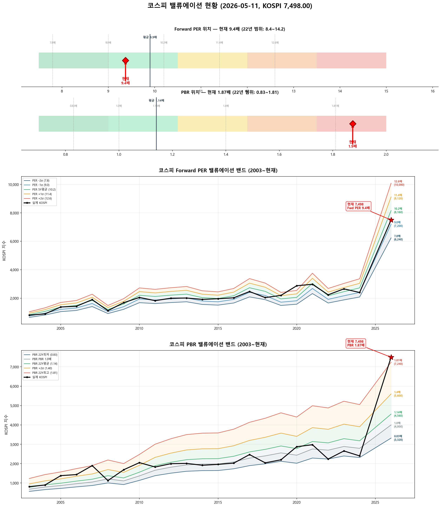

# 📋 MarketTop 일일 종합 (2026-05-11 07:25)

> A4 한 장 요약 — 상세는 각 시장 리포트 참조

---

### 🟢 코스피 7,498.00  —  📈 상승장 (신뢰도 60%)

| 과열 점수 | 93/100 🔴 과열 |
|:---:|:---|
| ⚠️ 과열 지표 | RSI 92, Stoch 98, MFI 89, CCI 169, BB 98% |

> 🚨 **매도 목표 전 3단계 초과 — 보유분 즉시 축소 권장**

**📈 상승 시**

| 단계 | 매도가 | 등락률 | 전략 | 승률 | 틀렸을 때 |
|:---:|---:|:---:|:---|:---:|:---|
| 🔴 1단계 | **6,967** | -7.1% | 이격도115(MA35) + MFI88+ | 80% | 평균+3.5% |
| 🔴 2단계 | **7,112** | -5.1% | 이격도121(MA60) + RSI85+ | 83% | 평균+2.2% |
| 🔴 3단계 | **7,387** | -1.5% | 이격도123(MA40) + Stoch65+ | 88% | 평균+24.6% |
| ▶ 4단계 | **7,779** | +3.7% | 10일내 중위 상승폭 (확률 50%) | - | 잔여분 익절 |
| ▶ 5단계 | **8,224** | +9.7% | 20일내 중위 상승폭 (확률 50%) | - | 잔여분 익절 |
| ▶ 6단계 | **9,011** | +20.2% | 60일내 보수적 상승폭 (확률 75%) | - | 잔여분 익절 |
| ▶ 7단계 | **9,515** | +26.9% | 60일내 중위 상승폭 (확률 50%) | - | 잔여분 익절 |

> 💡 🔴 = 이미 초과 (즉시 축소). ▶ = 과거 유사 상황의 실제 상승폭 기반 목표.

**📉 하락 시**

| 1차 방어선 | **7,273** (-3%) → 30% 손절 |
|:---:|:---|
| 핵심 하락감지 | ADX20+ + MACD데드 + RSI68+ (승률 83%) |
| 강력 매도 | 하락반전 3개 중 2개+ 동시 발동 시 → 50% 청산 |

**📍 분할매도 단계**

> 🚨 **전 3단계 매도 목표 초과** — 보유분 즉시 축소 권장

**🛑 손절 단계**

| 단계 | 손절가 | 비중 | 전략 | 승률 |
|:---:|---:|:---:|:---|:---:|
| 1단계 | **7,273** (-3%) | 30% | ADX20+ + MACD데드 + RSI68+ | 83% |
| 2단계 | **7,123** (-5%) | 30% | MFI85반전 + RSI85+ + Stoch95+ | 71% |
| 3단계 | **6,898** (-8%) | 40% | BB101%반전 + RSI60+ + Stoch85+ | 70% |

---

### 🟢 코스닥 1,207.72  —  📈 상승장 (신뢰도 80%)

| 과열 점수 | 71/100 🟡 주의 |
|:---:|:---|
| ⚠️ 과열 지표 | MFI 99 |

> ✅ **다음 매도 목표 1,333(+10.4%) 대기**

**📈 상승 시**

| 다음 매도 목표 | **1,333** (+10.4%) → 이격도123(MA95) + RSI88+ (승률 83%) |
|:---:|:---|

**📉 하락 시**

| 1차 방어선 | **1,171** (-3%) → 30% 손절 |
|:---:|:---|
| 핵심 하락감지 | MACD데드 + RSI68+ + MFI78+ (승률 100%) |
| 강력 매도 | 하락반전 4개 중 2개+ 동시 발동 시 → 50% 청산 |

**📍 분할매도 단계**

| 단계 | 목표가 | 등락률 | 전략 | 승률 | 틀렸을 때 |
|:---:|---:|:---:|:---|:---:|:---|
| ⏳ 1단계 | **1,333** | +10.4% | 이격도123(MA95) + RSI88+ | 83% | 평균+5% |
| ⏳ 2단계 | **1,366** | +13.1% | 이격도125(MA90) + RSI73+ | 71% | 평균+12% |

**🛑 손절 단계**

| 단계 | 손절가 | 비중 | 전략 | 승률 |
|:---:|---:|:---:|:---|:---:|
| 1단계 | **1,171** (-3%) | 30% | MACD데드 + RSI68+ + MFI78+ | 100% |
| 2단계 | **1,147** (-5%) | 30% | MFI88반전 + RSI60+ + Stoch95+ | 80% |
| 3단계 | **1,111** (-8%) | 40% | MFI65반전 + CCI230+ | 80% |

---

### 📊 코스피 밸류에이션

| 지표 | 현재 | 22Y평균 | 판단 |
|:---:|:---:|:---:|:---|
| **Fwd PER** | **9.4배** | 9.9배 | 저평가 🟢 |
| **PBR** | **1.87배** | 1.14배 | 과열 🔴 |
| Fwd EPS | 800 | - | BPS 4000 |

| PER 밴드 | 적정지수 | 괴리 |
|:---:|---:|:---:|
| -2σ (7.8) | 6,240 | -16.8% |
| -1σ (9.0) | 7,200 | -4.0% ◀ |
| 5Y평균 (10.2) | 8,160 | +8.8% |
| +1σ (11.4) | 9,120 | +21.6% |
| +2σ (12.6) | 10,080 | +34.4% |

---

### � 코스피 향후 60일 등락 위험 분석

> 💡 과거 30년간 지금과 비슷했던 상황(이격도 128%, 2개월 상승률 +45%) **74번** 발생
> → 그때 이후 2개월간 실제로 얼마나 올랐고 빠졌는지 통계

**📈 상승 가능성:**

| 항목 | 결과 | 해석 |
|:---|:---:|:---|
| **2개월 내 평균 최대상승폭** | **+28.3%** | 중위값 +26.9% |
| 역대 최고 사례 | +60.0% | 지수 11,994 |

| 상승폭 | 발생 확률 | 그때 지수 |
|:---|:---:|---:|
| +5% 이상 상승 | **81%** | 7,873 |
| +10% 이상 상승 | **80%** | 8,248 |
| +15% 이상 상승 | **77%** | 8,623 |
| +20% 이상 상승 | **77%** | 8,998 |

**📉 하락 위험:** 🟡 보통

| 항목 | 결과 | 해석 |
|:---|:---:|:---|
| **2개월 내 평균 최대낙폭** | **-7.0%** | 중위값 -5.6% |
| 역대 최악의 경우 | -45.5% | 지수 4,084 |
| 평소보다 위험한 정도 | 1.2배 | 평소와 비슷한 수준 |

**2개월 내 하락 확률과 예상 지수:**

| 하락폭 | 발생 확률 | 그때 지수 |
|:---|:---:|---:|
| -5% 이상 하락 | **55%** | 7,123 |
| -10% 이상 하락 | **24%** | 6,748 |
| -15% 이상 하락 | **14%** | 6,373 |
| -20% 이상 하락 | **7%** | 5,998 |

**💡 확률 기반 판단:**

> 과거 유사 상황에서 **+20%까지 상승할 확률이 50% 이상**이었고,
> 동시에 **-5%까지 하락할 확률도 50% 이상**이었습니다.
>
> 📌 **상승 기대값(23.0)이 하락 기대값(3.9)보다 크므로 (5.9배)**,
> **8,998**(+20%)까지 보유 후 익절하되, **7,123**(-5%) 이탈 시 손절이 합리적

### � 코스닥 향후 60일 등락 위험 분석

> 💡 과거 30년간 지금과 비슷했던 상황(이격도 106%, 2개월 상승률 +9%) **744번** 발생
> → 그때 이후 2개월간 실제로 얼마나 올랐고 빠졌는지 통계

**📈 상승 가능성:**

| 항목 | 결과 | 해석 |
|:---|:---:|:---|
| **2개월 내 평균 최대상승폭** | **+10.6%** | 중위값 +7.3% |
| 역대 최고 사례 | +48.9% | 지수 1,798 |

| 상승폭 | 발생 확률 | 그때 지수 |
|:---|:---:|---:|
| +5% 이상 상승 | **61%** | 1,268 |
| +10% 이상 상승 | **41%** | 1,328 |
| +15% 이상 상승 | **30%** | 1,389 |
| +20% 이상 상승 | **21%** | 1,449 |

**📉 하락 위험:** 🟡 보통

| 항목 | 결과 | 해석 |
|:---|:---:|:---|
| **2개월 내 평균 최대낙폭** | **-7.0%** | 중위값 -5.1% |
| 역대 최악의 경우 | -38.2% | 지수 747 |
| 평소보다 위험한 정도 | 0.8배 | 평소보다 오히려 안전 |

**2개월 내 하락 확률과 예상 지수:**

| 하락폭 | 발생 확률 | 그때 지수 |
|:---|:---:|---:|
| -5% 이상 하락 | **51%** | 1,147 |
| -10% 이상 하락 | **24%** | 1,087 |
| -15% 이상 하락 | **15%** | 1,027 |
| -20% 이상 하락 | **8%** | 966 |

**💡 확률 기반 판단:**

> 과거 유사 상황에서 **+5%까지 상승할 확률이 50% 이상**이었고,
> 동시에 **-5%까지 하락할 확률도 50% 이상**이었습니다.
>
> 📌 **상승 기대값(6.4)이 하락 기대값(3.6)보다 크므로 (1.8배)**,
> **1,268**(+5%)까지 보유 후 익절하되, **1,147**(-5%) 이탈 시 손절이 합리적

---

### 🔮 코스피 과거 유사 패턴 분석

> 💡 현재와 가격 움직임 + 기술적 지표가 비슷했던 과거 **15개 시점** 발견 (평균 유사도 68%)
> → 그 시점 이후 40일간 실제로 어떻게 움직였는지 통계

**📊 유사 패턴 이후 40일간 등락 범위:**

| 구분 | 평균 | 중위값 | 지수 환산 |
|:---|:---:|:---:|---:|
| 📈 최대 상승폭 | **+15.2%** | +15.6% | 8,668 |
| 📉 최대 하락폭 | **-7.0%** | -5.4% | 7,095 |
| 🚀 최고 사례 | +39.1% | - | 10,430 |
| 💥 최악 사례 | -19.6% | - | 6,029 |

**🔄 반전 패턴:**

| 패턴 | 평균 크기 | 해석 |
|:---|:---:|:---|
| 고점 찍고 반락 | **-19.4%** | 상승 후 평균 이만큼 되돌림 |
| 저점 찍고 반등 | **+24.0%** | 하락 후 평균 이만큼 회복 |

**⏰ 시간대별 상승 확률:**

| 기간 | 상승 확률 | 평균 수익률 | 예상 지수 |
|:---|:---:|:---:|---:|
| 10일 후 | **53%** | +0.4% | 7,525 |
| 20일 후 | **47%** | +4.0% | 7,796 |
| 40일 후 | **67%** | +5.7% | 7,926 |

**📈 대표 경로 (중위값):**

| 시점 | 낙관(상위25%) | 중립(중위) | 비관(하위25%) | 중립 지수 |
|:---|:---:|:---:|:---:|---:|
| 5일 후 | +2.8% | +0.0% | -3.1% | 7,498 |
| 10일 후 | +6.2% | +0.1% | -3.8% | 7,505 |
| 20일 후 | +17.0% | -1.3% | -4.9% | 7,399 |
| 30일 후 | +8.5% | +6.7% | -0.3% | 8,002 |
| 40일 후 | +13.2% | +7.7% | -1.3% | 8,073 |

**📅 가장 유사했던 과거 시점 (최근 5개):**

- **2026-01-30** (유사도 67%) — 지수 5,224 → 40일간 최대+20.7%, 최대-5.3%, 최종+0.2%
- **2026-01-26** (유사도 68%) — 지수 4,950 → 40일간 최대+27.4%, 최대0.0%, 최종+9.9%
- **2026-01-20** (유사도 68%) — 지수 4,886 → 40일간 최대+29.1%, 최대0.0%, 최종+10.6%
- **2026-01-15** (유사도 66%) — 지수 4,798 → 40일간 최대+31.5%, 최대0.0%, 최종+23.5%
- **2023-04-12** (유사도 66%) — 지수 2,551 → 40일간 최대+3.5%, 최대-2.9%, 최종+3.4%

### 🔮 코스닥 과거 유사 패턴 분석

> 💡 현재와 가격 움직임 + 기술적 지표가 비슷했던 과거 **20개 시점** 발견 (평균 유사도 74%)
> → 그 시점 이후 40일간 실제로 어떻게 움직였는지 통계

**📊 유사 패턴 이후 40일간 등락 범위:**

| 구분 | 평균 | 중위값 | 지수 환산 |
|:---|:---:|:---:|---:|
| 📈 최대 상승폭 | **+5.1%** | +2.8% | 1,242 |
| 📉 최대 하락폭 | **-5.7%** | -5.2% | 1,145 |
| 🚀 최고 사례 | +18.5% | - | 1,431 |
| 💥 최악 사례 | -17.8% | - | 992 |

**🔄 반전 패턴:**

| 패턴 | 평균 크기 | 해석 |
|:---|:---:|:---|
| 고점 찍고 반락 | **-8.2%** | 상승 후 평균 이만큼 되돌림 |
| 저점 찍고 반등 | **+9.5%** | 하락 후 평균 이만큼 회복 |

**⏰ 시간대별 상승 확률:**

| 기간 | 상승 확률 | 평균 수익률 | 예상 지수 |
|:---|:---:|:---:|---:|
| 10일 후 | **50%** | +0.0% | 1,208 |
| 20일 후 | **50%** | +0.0% | 1,208 |
| 40일 후 | **50%** | +0.4% | 1,212 |

**📈 대표 경로 (중위값):**

| 시점 | 낙관(상위25%) | 중립(중위) | 비관(하위25%) | 중립 지수 |
|:---|:---:|:---:|:---:|---:|
| 5일 후 | +1.6% | +0.4% | -1.6% | 1,213 |
| 10일 후 | +1.4% | -0.1% | -1.4% | 1,206 |
| 20일 후 | +4.9% | +0.1% | -3.9% | 1,209 |
| 30일 후 | +3.7% | +0.3% | -4.7% | 1,212 |
| 40일 후 | +5.3% | +0.4% | -3.8% | 1,212 |

**📅 가장 유사했던 과거 시점 (최근 5개):**

- **2024-10-11** (유사도 72%) — 지수 771 → 40일간 최대+0.4%, 최대-14.2%, 최종-14.2%
- **2023-02-23** (유사도 73%) — 지수 783 → 40일간 최대+16.1%, 최대-3.2%, 최종+10.9%
- **2020-12-14** (유사도 72%) — 지수 930 → 40일간 최대+7.5%, 최대-0.7%, 최종+5.6%
- **2019-04-24** (유사도 74%) — 지수 758 → 40일간 최대+0.5%, 최대-9.0%, 최종-5.3%
- **2017-12-04** (유사도 71%) — 지수 782 → 40일간 최대+18.5%, 최대-5.4%, 최종+15.0%

---

### 📎 상세 리포트

- 코스피: [코스피_고점판독리포트_20260511_072536.md](코스피_고점판독리포트_20260511_072536.md)
- 코스닥: [코스닥_고점판독리포트_20260511_072549.md](코스닥_고점판독리포트_20260511_072549.md)

---

*본 리포트는 백테스트 기반 참고용이며, 투자 판단의 최종 책임은 투자자 본인에게 있습니다.*