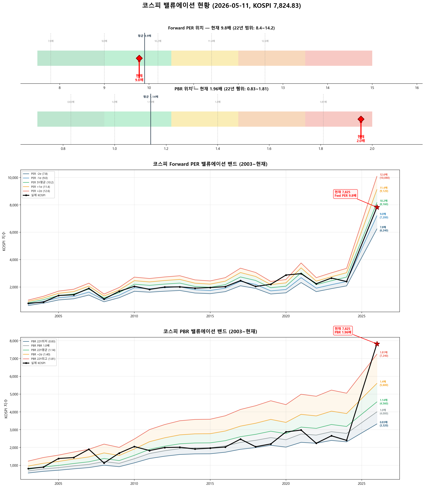

# 📋 MarketTop 일일 종합 (2026-05-11 11:40)

> A4 한 장 요약 — 상세는 각 시장 리포트 참조

---

### 🟢 코스피 7,824.83  —  📈 상승장 (신뢰도 60%)

| 과열 점수 | 96/100 🔴 과열 |
|:---:|:---|
| ⚠️ 과열 지표 | RSI 95, Stoch 97, MFI 94, CCI 193, BB 100% |

> 🚨 **매도 목표 전 3단계 초과 — 보유분 즉시 축소 권장**

**📈 상승 시**

| 단계 | 매도가 | 등락률 | 전략 | 승률 | 틀렸을 때 |
|:---:|---:|:---:|:---|:---:|:---|
| 🔴 1단계 | **7,035** | -10.1% | 이격도115(MA35) + MFI88+ | 80% | 평균+3.5% |
| 🔴 2단계 | **7,168** | -8.4% | 이격도121(MA60) + RSI85+ | 83% | 평균+2.2% |
| 🔴 3단계 | **7,456** | -4.7% | 이격도123(MA40) + Stoch65+ | 88% | 평균+24.6% |
| ▶ 4단계 | **8,062** | +3.0% | 10일내 중위 상승폭 (확률 50%) | - | 잔여분 익절 |
| ▶ 5단계 | **9,577** | +22.4% | 60일내 보수적 상승폭 (확률 75%) | - | 잔여분 익절 |

> 💡 🔴 = 이미 초과 (즉시 축소). ▶ = 과거 유사 상황의 실제 상승폭 기반 목표.

**📉 하락 시**

| 1차 방어선 | **7,590** (-3%) → 30% 손절 |
|:---:|:---|
| 핵심 하락감지 | ADX20+ + MACD데드 + RSI68+ (승률 83%) |
| 강력 매도 | 하락반전 3개 중 2개+ 동시 발동 시 → 50% 청산 |

**📍 분할매도 단계**

> 🚨 **전 3단계 매도 목표 초과** — 보유분 즉시 축소 권장

**🛑 손절 단계**

| 단계 | 손절가 | 비중 | 전략 | 승률 |
|:---:|---:|:---:|:---|:---:|
| 1단계 | **7,590** (-3%) | 30% | ADX20+ + MACD데드 + RSI68+ | 83% |
| 2단계 | **7,434** (-5%) | 30% | MFI85반전 + RSI85+ + Stoch95+ | 71% |
| 3단계 | **7,199** (-8%) | 40% | BB101%반전 + RSI60+ + Stoch85+ | 70% |

---

### 🟢 코스닥 1,204.61  —  📈 상승장 (신뢰도 80%)

| 과열 점수 | 60/100 🟡 주의 |
|:---:|:---|

> ✅ **다음 매도 목표 1,337(+11.0%) 대기**

**📈 상승 시**

| 다음 매도 목표 | **1,337** (+11.0%) → 이격도123(MA95) + RSI88+ (승률 83%) |
|:---:|:---|

**📉 하락 시**

| 1차 방어선 | **1,168** (-3%) → 30% 손절 |
|:---:|:---|
| 핵심 하락감지 | MACD데드 + RSI68+ + MFI78+ (승률 100%) |
| 강력 매도 | 하락반전 4개 중 2개+ 동시 발동 시 → 50% 청산 |

**📍 분할매도 단계**

| 단계 | 목표가 | 등락률 | 전략 | 승률 | 틀렸을 때 |
|:---:|---:|:---:|:---|:---:|:---|
| ⏳ 1단계 | **1,337** | +11.0% | 이격도123(MA95) + RSI88+ | 83% | 평균+5% |
| ⏳ 2단계 | **1,370** | +13.7% | 이격도125(MA90) + RSI73+ | 71% | 평균+12% |

**🛑 손절 단계**

| 단계 | 손절가 | 비중 | 전략 | 승률 |
|:---:|---:|:---:|:---|:---:|
| 1단계 | **1,168** (-3%) | 30% | MACD데드 + RSI68+ + MFI78+ | 100% |
| 2단계 | **1,144** (-5%) | 30% | MFI88반전 + RSI60+ + Stoch95+ | 80% |
| 3단계 | **1,108** (-8%) | 40% | MFI65반전 + CCI230+ | 80% |

---

### 📊 코스피 밸류에이션

| 지표 | 현재 | 22Y평균 | 판단 |
|:---:|:---:|:---:|:---|
| **Fwd PER** | **9.8배** | 9.9배 | 적정 ⚪ |
| **PBR** | **1.96배** | 1.14배 | 과열 🔴 |
| Fwd EPS | 800 | - | BPS 4000 |

| PER 밴드 | 적정지수 | 괴리 |
|:---:|---:|:---:|
| -2σ (7.8) | 6,240 | -20.3% |
| -1σ (9.0) | 7,200 | -8.0% |
| 5Y평균 (10.2) | 8,160 | +4.3% ◀ |
| +1σ (11.4) | 9,120 | +16.6% |
| +2σ (12.6) | 10,080 | +28.8% |

---

### � 코스피 향후 60일 등락 위험 분석

> 💡 과거 30년간 지금과 비슷했던 상황(이격도 132%, 2개월 상승률 +54%) **30번** 발생
> → 그때 이후 2개월간 실제로 얼마나 올랐고 빠졌는지 통계

**📈 상승 가능성:**

| 항목 | 결과 | 해석 |
|:---|:---:|:---|
| **2개월 내 평균 최대상승폭** | **+27.7%** | 중위값 +26.5% |
| 역대 최고 사례 | +51.0% | 지수 11,816 |

| 상승폭 | 발생 확률 | 그때 지수 |
|:---|:---:|---:|
| +5% 이상 상승 | **87%** | 8,216 |
| +10% 이상 상승 | **87%** | 8,607 |
| +15% 이상 상승 | **87%** | 8,999 |
| +20% 이상 상승 | **80%** | 9,390 |

**📉 하락 위험:** 🟠 주의

| 항목 | 결과 | 해석 |
|:---|:---:|:---|
| **2개월 내 평균 최대낙폭** | **-9.2%** | 중위값 -8.1% |
| 역대 최악의 경우 | -23.0% | 지수 6,025 |
| ⚠️ 평소보다 위험한 정도 | **1.6배** | 평소보다 1.6배 더 빠질 수 있음 |

**2개월 내 하락 확률과 예상 지수:**

| 하락폭 | 발생 확률 | 그때 지수 |
|:---|:---:|---:|
| -5% 이상 하락 | **63%** | 7,434 |
| -10% 이상 하락 | **50%** | 7,042 |
| -15% 이상 하락 | **30%** | 6,651 |
| -20% 이상 하락 | **3%** | 6,260 |

**💡 확률 기반 판단:**

> 과거 유사 상황에서 **+20%까지 상승할 확률이 50% 이상**이었고,
> 동시에 **-10%까지 하락할 확률도 50% 이상**이었습니다.
>
> 📌 **상승 기대값(24.0)이 하락 기대값(5.8)보다 크므로 (4.1배)**,
> **9,390**(+20%)까지 보유 후 익절하되, **7,042**(-10%) 이탈 시 손절이 합리적

### � 코스닥 향후 60일 등락 위험 분석

> 💡 과거 30년간 지금과 비슷했던 상황(이격도 106%, 2개월 상승률 +11%) **743번** 발생
> → 그때 이후 2개월간 실제로 얼마나 올랐고 빠졌는지 통계

**📈 상승 가능성:**

| 항목 | 결과 | 해석 |
|:---|:---:|:---|
| **2개월 내 평균 최대상승폭** | **+10.4%** | 중위값 +7.4% |
| 역대 최고 사례 | +48.9% | 지수 1,793 |

| 상승폭 | 발생 확률 | 그때 지수 |
|:---|:---:|---:|
| +5% 이상 상승 | **61%** | 1,265 |
| +10% 이상 상승 | **40%** | 1,325 |
| +15% 이상 상승 | **29%** | 1,385 |
| +20% 이상 상승 | **19%** | 1,446 |

**📉 하락 위험:** 🟡 보통

| 항목 | 결과 | 해석 |
|:---|:---:|:---|
| **2개월 내 평균 최대낙폭** | **-7.1%** | 중위값 -5.1% |
| 역대 최악의 경우 | -38.2% | 지수 745 |
| 평소보다 위험한 정도 | 0.8배 | 평소보다 오히려 안전 |

**2개월 내 하락 확률과 예상 지수:**

| 하락폭 | 발생 확률 | 그때 지수 |
|:---|:---:|---:|
| -5% 이상 하락 | **51%** | 1,144 |
| -10% 이상 하락 | **24%** | 1,084 |
| -15% 이상 하락 | **15%** | 1,024 |
| -20% 이상 하락 | **7%** | 964 |

**💡 확률 기반 판단:**

> 과거 유사 상황에서 **+5%까지 상승할 확률이 50% 이상**이었고,
> 동시에 **-5%까지 하락할 확률도 50% 이상**이었습니다.
>
> 📌 **상승 기대값(6.3)이 하락 기대값(3.6)보다 크므로 (1.8배)**,
> **1,265**(+5%)까지 보유 후 익절하되, **1,144**(-5%) 이탈 시 손절이 합리적

---

### 🔮 코스피 과거 유사 패턴 분석

> 💡 현재와 가격 움직임 + 기술적 지표가 비슷했던 과거 **5개 시점** 발견 (평균 유사도 70%)
> → 그 시점 이후 40일간 실제로 어떻게 움직였는지 통계

**📊 유사 패턴 이후 40일간 등락 범위:**

| 구분 | 평균 | 중위값 | 지수 환산 |
|:---|:---:|:---:|---:|
| 📈 최대 상승폭 | **+12.6%** | +12.9% | 8,836 |
| 📉 최대 하락폭 | **-6.6%** | -6.5% | 7,318 |
| 🚀 최고 사례 | +24.0% | - | 9,706 |
| 💥 최악 사례 | -9.9% | - | 7,046 |

**🔄 반전 패턴:**

| 패턴 | 평균 크기 | 해석 |
|:---|:---:|:---|
| 고점 찍고 반락 | **-16.1%** | 상승 후 평균 이만큼 되돌림 |
| 저점 찍고 반등 | **+23.3%** | 하락 후 평균 이만큼 회복 |

**⏰ 시간대별 상승 확률:**

| 기간 | 상승 확률 | 평균 수익률 | 예상 지수 |
|:---|:---:|:---:|---:|
| 10일 후 | **20%** | -1.0% | 7,743 |
| 20일 후 | **80%** | +8.7% | 8,506 |
| 40일 후 | **40%** | -2.2% | 7,652 |

**📈 대표 경로 (중위값):**

| 시점 | 낙관(상위25%) | 중립(중위) | 비관(하위25%) | 중립 지수 |
|:---|:---:|:---:|:---:|---:|
| 5일 후 | -1.0% | -1.1% | -5.5% | 7,741 |
| 10일 후 | -0.5% | -0.8% | -2.2% | 7,761 |
| 20일 후 | +9.2% | +6.6% | +6.5% | 8,341 |
| 30일 후 | +4.2% | +0.7% | -2.2% | 7,878 |
| 40일 후 | +3.8% | -3.3% | -7.7% | 7,570 |

**📅 가장 유사했던 과거 시점 (최근 5개):**

- **2026-01-27** (유사도 72%) — 지수 5,085 → 40일간 최대+24.0%, 최대-2.7%, 최종+3.8%
- **2021-01-13** (유사도 68%) — 지수 3,148 → 40일간 최대+1.9%, 최대-6.0%, 최종-3.3%
- **2001-12-05** (유사도 66%) — 지수 688 → 40일간 최대+13.4%, 최대-6.5%, 최종+6.1%
- **1998-12-15** (유사도 67%) — 지수 580 → 40일간 최대+10.5%, 최대-9.9%, 최종-9.9%
- **1998-12-10** (유사도 76%) — 지수 568 → 40일간 최대+12.9%, 최대-7.8%, 최종-7.7%

### 🔮 코스닥 과거 유사 패턴 분석

> 💡 현재와 가격 움직임 + 기술적 지표가 비슷했던 과거 **20개 시점** 발견 (평균 유사도 74%)
> → 그 시점 이후 40일간 실제로 어떻게 움직였는지 통계

**📊 유사 패턴 이후 40일간 등락 범위:**

| 구분 | 평균 | 중위값 | 지수 환산 |
|:---|:---:|:---:|---:|
| 📈 최대 상승폭 | **+7.8%** | +5.6% | 1,271 |
| 📉 최대 하락폭 | **-5.2%** | -3.8% | 1,159 |
| 🚀 최고 사례 | +23.2% | - | 1,484 |
| 💥 최악 사례 | -19.3% | - | 972 |

**🔄 반전 패턴:**

| 패턴 | 평균 크기 | 해석 |
|:---|:---:|:---|
| 고점 찍고 반락 | **-10.0%** | 상승 후 평균 이만큼 되돌림 |
| 저점 찍고 반등 | **+11.8%** | 하락 후 평균 이만큼 회복 |

**⏰ 시간대별 상승 확률:**

| 기간 | 상승 확률 | 평균 수익률 | 예상 지수 |
|:---|:---:|:---:|---:|
| 10일 후 | **65%** | +1.7% | 1,225 |
| 20일 후 | **60%** | +1.3% | 1,220 |
| 40일 후 | **60%** | +2.0% | 1,229 |

**📈 대표 경로 (중위값):**

| 시점 | 낙관(상위25%) | 중립(중위) | 비관(하위25%) | 중립 지수 |
|:---|:---:|:---:|:---:|---:|
| 5일 후 | +4.3% | +1.1% | -0.5% | 1,217 |
| 10일 후 | +4.3% | +1.9% | -2.2% | 1,227 |
| 20일 후 | +5.7% | +1.9% | -2.4% | 1,227 |
| 30일 후 | +6.4% | +1.2% | -2.5% | 1,220 |
| 40일 후 | +6.2% | +2.4% | -3.5% | 1,233 |

**📅 가장 유사했던 과거 시점 (최근 5개):**

- **2025-10-10** (유사도 73%) — 지수 859 → 40일간 최대+8.4%, 최대-1.3%, 최종+7.6%
- **2024-10-14** (유사도 72%) — 지수 770 → 40일간 최대+0.5%, 최대-18.6%, 최종-18.6%
- **2023-02-24** (유사도 73%) — 지수 779 → 40일간 최대+16.8%, 최대-2.7%, 최종+9.8%
- **2020-04-28** (유사도 72%) — 지수 645 → 40일간 최대+17.8%, 최대-0.5%, 최종+16.4%
- **2014-09-11** (유사도 77%) — 지수 574 → 40일간 최대+1.3%, 최대-7.3%, 최종-6.0%

---

### 📎 상세 리포트

- 코스피: [코스피_고점판독리포트_20260511_113946.md](코스피_고점판독리포트_20260511_113946.md)
- 코스닥: [코스닥_고점판독리포트_20260511_114002.md](코스닥_고점판독리포트_20260511_114002.md)

---

*본 리포트는 백테스트 기반 참고용이며, 투자 판단의 최종 책임은 투자자 본인에게 있습니다.*