# 📊 보통주 vs 우선주 괴리율 분석 리포트

**분석일시**: 2026년 05월 11일 15:33:35
**분석 기준**: 2010년 이후 데이터 (금융위기 등 이상치 제외)

---

## 🎯 오늘의 투자 결론

| 종목 | 보통주 | 우선주 | 현재 괴리율 | 역사적 위치 | 판정 | 추천 |
|:----:|-------:|-------:|:----------:|:----------:|:----:|:-----|
| **삼성전자** | 285,750원 | 195,500원 | -31.58% | 하위 24% | 🟦 | 🟦 우선주 매수 |
| **삼성전기** | 903,000원 | 377,000원 | -58.25% | 하위 50% | ⚪ | ⚪ 중립 |
| **현대차** | 642,500원 | 271,500원 | -57.74% | 하위 33% | ⚪ | ⚪ 중립 |
| **미래에셋증권** | 79,700원 | 23,950원 | -69.95% | 하위 9% | 🟦 | 🟦 우선주 강력 매수 |
| **CJ** | 218,500원 | 89,300원 | -59.13% | 하위 51% | ⚪ | ⚪ 중립 |
| **대상** | 20,100원 | 16,180원 | -19.50% | 하위 95% | 🟥 | 🟥 보통주 강력 매수 |
| **SK** | 574,000원 | 394,500원 | -31.27% | 하위 41% | ⚪ | ⚪ 중립 |
| **한화** | 139,200원 | 49,500원 | -64.44% | 하위 10% | 🟦 | 🟦 우선주 강력 매수 |
| **LG** | 104,900원 | 71,900원 | -31.46% | 하위 71% | ⚪ | ⚪ 중립 |
| **GS** | 77,400원 | 56,300원 | -27.26% | 하위 64% | ⚪ | ⚪ 중립 |
| **두산** | 1,721,000원 | 721,000원 | -58.11% | 하위 29% | ⚪ | ⚪ 중립 |
| **아모레퍼시픽** | 127,600원 | 45,400원 | -64.42% | 하위 53% | ⚪ | ⚪ 중립 |
| **LG화학** | 421,500원 | 193,400원 | -54.12% | 하위 38% | ⚪ | ⚪ 중립 |
| **삼성SDI** | 681,000원 | 337,000원 | -50.51% | 하위 54% | ⚪ | ⚪ 중립 |
| **LG전자** | 157,200원 | 66,900원 | -57.44% | 하위 55% | ⚪ | ⚪ 중립 |
| **삼성화재** | 506,000원 | 378,500원 | -25.20% | 하위 90% | 🟥 | 🟥 보통주 매수 |
| **S-Oil** | 110,900원 | 52,100원 | -53.02% | 하위 8% | 🟦 | 🟦 우선주 강력 매수 |
| **대한항공** | 25,650원 | 23,250원 | -9.36% | 하위 59% | ⚪ | ⚪ 중립 |
| **유한양행** | 84,700원 | 71,300원 | -15.82% | 하위 21% | 🟦 | 🟦 우선주 매수 |
| **LG생활건강** | 268,000원 | 113,400원 | -57.69% | 하위 46% | ⚪ | ⚪ 중립 |
| **CJ제일제당** | 225,000원 | 134,700원 | -40.13% | 하위 97% | 🟥 | 🟥 보통주 강력 매수 |
| **현대건설** | 166,000원 | 70,600원 | -57.47% | 하위 2% | 🟦 | 🟦 우선주 강력 매수 |
| **금호석유** | 148,400원 | 61,500원 | -58.56% | 하위 65% | ⚪ | ⚪ 중립 |
| **코오롱인더** | 88,500원 | 29,200원 | -67.01% | 하위 33% | ⚪ | ⚪ 중립 |
| **코오롱** | 81,150원 | 32,050원 | -60.51% | 하위 34% | ⚪ | ⚪ 중립 |
| **호텔신라** | 64,400원 | 38,300원 | -40.53% | 하위 40% | ⚪ | ⚪ 중립 |
| **DL** | 67,100원 | 29,000원 | -56.78% | 하위 17% | 🟦 | 🟦 우선주 매수 |
| **한국금융지주** | 265,500원 | 182,700원 | -31.19% | 하위 74% | ⚪ | ⚪ 중립 |
| **삼성물산** | 449,500원 | 263,500원 | -41.38% | 하위 12% | 🟦 | 🟦 우선주 강력 매수 |
| **아모레G** | 26,600원 | 11,700원 | -56.02% | 하위 92% | 🟥 | 🟥 보통주 강력 매수 |
| **NH투자증권** | 36,100원 | 27,650원 | -23.41% | 하위 67% | ⚪ | ⚪ 중립 |
| **SK하이닉스** | 1,899,000원 | 1,190,000원 | -37.34% | 하위 98% | 🟥 | 🟥 보통주 강력 매수 |

### 💡 핵심 요약

- **삼성전자**: 우선주가 역사적 평균(-24.3%)보다 7.3%p 더 저렴. 과거 76%의 경우보다 우선주가 싸므로 **삼성전자우 매수 유리** (승률 ~76%)
- **삼성전기**: 괴리율(-58.3%)이 평균(-59.4%) 부근. **선호도에 따라 선택** (배당→우선주, 의결권→보통주)
- **현대차**: 괴리율(-57.7%)이 평균(-54.2%) 부근. **선호도에 따라 선택** (배당→우선주, 의결권→보통주)
- **미래에셋증권**: 우선주가 역사적 평균(-54.2%)보다 15.7%p 더 저렴. 과거 91%의 경우보다 우선주가 싸므로 **미래에셋증권우 매수 유리** (승률 ~91%)
- **CJ**: 괴리율(-59.1%)이 평균(-59.6%) 부근. **선호도에 따라 선택** (배당→우선주, 의결권→보통주)
- **대상**: 우선주가 역사적 평균(-50.0%)보다 30.5%p 비쌈. 과거 95%의 경우보다 우선주가 비싸므로 **대상(보통주) 매수 유리** (승률 ~95%)
- **SK**: 괴리율(-31.3%)이 평균(-27.4%) 부근. **선호도에 따라 선택** (배당→우선주, 의결권→보통주)
- **한화**: 우선주가 역사적 평균(-56.1%)보다 8.3%p 더 저렴. 과거 90%의 경우보다 우선주가 싸므로 **한화3우B 매수 유리** (승률 ~90%)
- **LG**: 괴리율(-31.5%)이 평균(-46.9%) 부근. **선호도에 따라 선택** (배당→우선주, 의결권→보통주)
- **GS**: 괴리율(-27.3%)이 평균(-38.5%) 부근. **선호도에 따라 선택** (배당→우선주, 의결권→보통주)
- **두산**: 괴리율(-58.1%)이 평균(-50.0%) 부근. **선호도에 따라 선택** (배당→우선주, 의결권→보통주)
- **아모레퍼시픽**: 괴리율(-64.4%)이 평균(-63.5%) 부근. **선호도에 따라 선택** (배당→우선주, 의결권→보통주)
- **LG화학**: 괴리율(-54.1%)이 평균(-51.5%) 부근. **선호도에 따라 선택** (배당→우선주, 의결권→보통주)
- **삼성SDI**: 괴리율(-50.5%)이 평균(-52.7%) 부근. **선호도에 따라 선택** (배당→우선주, 의결권→보통주)
- **LG전자**: 괴리율(-57.4%)이 평균(-60.3%) 부근. **선호도에 따라 선택** (배당→우선주, 의결권→보통주)
- **삼성화재**: 우선주가 역사적 평균(-43.4%)보다 18.2%p 비쌈. 과거 90%의 경우보다 우선주가 비싸므로 **삼성화재(보통주) 매수 유리** (승률 ~90%)
- **S-Oil**: 우선주가 역사적 평균(-40.2%)보다 12.8%p 더 저렴. 과거 92%의 경우보다 우선주가 싸므로 **S-Oil우 매수 유리** (승률 ~92%)
- **대한항공**: 괴리율(-9.4%)이 평균(-17.1%) 부근. **선호도에 따라 선택** (배당→우선주, 의결권→보통주)
- **유한양행**: 우선주가 역사적 평균(1.3%)보다 17.1%p 더 저렴. 과거 79%의 경우보다 우선주가 싸므로 **유한양행우 매수 유리** (승률 ~79%)
- **LG생활건강**: 괴리율(-57.7%)이 평균(-58.1%) 부근. **선호도에 따라 선택** (배당→우선주, 의결권→보통주)
- **CJ제일제당**: 우선주가 역사적 평균(-62.5%)보다 22.3%p 비쌈. 과거 97%의 경우보다 우선주가 비싸므로 **CJ제일제당(보통주) 매수 유리** (승률 ~97%)
- **현대건설**: 우선주가 역사적 평균(68.1%)보다 125.6%p 더 저렴. 과거 98%의 경우보다 우선주가 싸므로 **현대건설우 매수 유리** (승률 ~98%)
- **금호석유**: 괴리율(-58.6%)이 평균(-64.7%) 부근. **선호도에 따라 선택** (배당→우선주, 의결권→보통주)
- **코오롱인더**: 괴리율(-67.0%)이 평균(-62.7%) 부근. **선호도에 따라 선택** (배당→우선주, 의결권→보통주)
- **코오롱**: 괴리율(-60.5%)이 평균(-50.5%) 부근. **선호도에 따라 선택** (배당→우선주, 의결권→보통주)
- **호텔신라**: 괴리율(-40.5%)이 평균(-36.5%) 부근. **선호도에 따라 선택** (배당→우선주, 의결권→보통주)
- **DL**: 우선주가 역사적 평균(-46.9%)보다 9.8%p 더 저렴. 과거 83%의 경우보다 우선주가 싸므로 **DL우 매수 유리** (승률 ~83%)
- **한국금융지주**: 괴리율(-31.2%)이 평균(-49.0%) 부근. **선호도에 따라 선택** (배당→우선주, 의결권→보통주)
- **삼성물산**: 우선주가 역사적 평균(-27.0%)보다 14.3%p 더 저렴. 과거 88%의 경우보다 우선주가 싸므로 **삼성물산우B 매수 유리** (승률 ~88%)
- **아모레G**: 우선주가 역사적 평균(-63.1%)보다 7.1%p 비쌈. 과거 92%의 경우보다 우선주가 비싸므로 **아모레G(보통주) 매수 유리** (승률 ~92%)
- **NH투자증권**: 괴리율(-23.4%)이 평균(-38.2%) 부근. **선호도에 따라 선택** (배당→우선주, 의결권→보통주)
- **SK하이닉스**: 우선주가 역사적 평균(-52.6%)보다 15.3%p 비쌈. 과거 98%의 경우보다 우선주가 비싸므로 **SK하이닉스(보통주) 매수 유리** (승률 ~98%)

### 📋 투자 시점 가이드

| 종목 | 우선주 매수 구간 | 중립 구간 | 보통주 매수 구간 |
|:----:|:---------------:|:---------:|:---------------:|
| 삼성전자 | 괴리율 < -30.5% | -30.5% ~ -17.7% | 괴리율 > -17.7% |
| 삼성전기 | 괴리율 < -64.6% | -64.6% ~ -53.5% | 괴리율 > -53.5% |
| 현대차 | 괴리율 < -60.8% | -60.8% ~ -46.2% | 괴리율 > -46.2% |
| 미래에셋증권 | 괴리율 < -65.5% | -65.5% ~ -46.8% | 괴리율 > -46.8% |
| CJ | 괴리율 < -69.4% | -69.4% ~ -49.2% | 괴리율 > -49.2% |
| 대상 | 괴리율 < -67.2% | -67.2% ~ -28.7% | 괴리율 > -28.7% |
| SK | 괴리율 < -43.7% | -43.7% ~ -14.1% | 괴리율 > -14.1% |
| 한화 | 괴리율 < -61.0% | -61.0% ~ -51.3% | 괴리율 > -51.3% |
| LG | 괴리율 < -56.8% | -56.8% ~ -29.5% | 괴리율 > -29.5% |
| GS | 괴리율 < -54.6% | -54.6% ~ -20.9% | 괴리율 > -20.9% |
| 두산 | 괴리율 < -64.6% | -64.6% ~ -37.1% | 괴리율 > -37.1% |
| 아모레퍼시픽 | 괴리율 < -72.0% | -72.0% ~ -54.3% | 괴리율 > -54.3% |
| LG화학 | 괴리율 < -57.7% | -57.7% ~ -40.6% | 괴리율 > -40.6% |
| 삼성SDI | 괴리율 < -62.3% | -62.3% ~ -44.1% | 괴리율 > -44.1% |
| LG전자 | 괴리율 < -64.9% | -64.9% ~ -54.5% | 괴리율 > -54.5% |
| 삼성화재 | 괴리율 < -53.0% | -53.0% ~ -28.7% | 괴리율 > -28.7% |
| S-Oil | 괴리율 < -46.5% | -46.5% ~ -33.5% | 괴리율 > -33.5% |
| 대한항공 | 괴리율 < -42.4% | -42.4% ~ 10.0% | 괴리율 > 10.0% |
| 유한양행 | 괴리율 < -13.3% | -13.3% ~ 14.9% | 괴리율 > 14.9% |
| LG생활건강 | 괴리율 < -62.4% | -62.4% ~ -48.5% | 괴리율 > -48.5% |
| CJ제일제당 | 괴리율 < -69.8% | -69.8% ~ -56.0% | 괴리율 > -56.0% |
| 현대건설 | 괴리율 < -34.6% | -34.6% ~ 72.1% | 괴리율 > 72.1% |
| 금호석유 | 괴리율 < -72.9% | -72.9% ~ -53.3% | 괴리율 > -53.3% |
| 코오롱인더 | 괴리율 < -72.0% | -72.0% ~ -53.4% | 괴리율 > -53.4% |
| 코오롱 | 괴리율 < -63.1% | -63.1% ~ -38.4% | 괴리율 > -38.4% |
| 호텔신라 | 괴리율 < -55.6% | -55.6% ~ -20.6% | 괴리율 > -20.6% |
| DL | 괴리율 < -53.4% | -53.4% ~ -40.5% | 괴리율 > -40.5% |
| 한국금융지주 | 괴리율 < -64.7% | -64.7% ~ -30.8% | 괴리율 > -30.8% |
| 삼성물산 | 괴리율 < -37.4% | -37.4% ~ -14.2% | 괴리율 > -14.2% |
| 아모레G | 괴리율 < -66.1% | -66.1% ~ -59.5% | 괴리율 > -59.5% |
| NH투자증권 | 괴리율 < -59.6% | -59.6% ~ -14.4% | 괴리율 > -14.4% |
| SK하이닉스 | 괴리율 < -57.1% | -57.1% ~ -49.5% | 괴리율 > -49.5% |

### 📈 시장 상황별 전략

| 종목 | 상승장 예상 | 하락장 예상 | 패턴 |
|:----:|:----------:|:----------:|:-----|
| 삼성전자 | 우선주(삼성전자우) | 보통주(삼성전자) | 상승장에서 우선주가 더 저렴 |
| 삼성전기 | 우선주(삼성전기우) | 보통주(삼성전기) | 상승장에서 우선주가 더 저렴 |
| 현대차 | 우선주(현대차우) | 보통주(현대차) | 상승장에서 우선주가 더 저렴 |
| 미래에셋증권 | 우선주(미래에셋증권우) | 보통주(미래에셋증권) | 상승장에서 우선주가 더 저렴 |
| CJ | 우선주(CJ우) | 보통주(CJ) | 상승장에서 우선주가 더 저렴 |
| 대상 | 우선주(대상우) | 보통주(대상) | 상승장에서 우선주가 더 저렴 |
| SK | 우선주(SK우) | 보통주(SK) | 상승장에서 우선주가 더 저렴 |
| 한화 | 우선주(한화3우B) | 보통주(한화) | 상승장에서 우선주가 더 저렴 |
| LG | 우선주(LG우) | 보통주(LG) | 상승장에서 우선주가 더 저렴 |
| GS | 우선주(GS우) | 보통주(GS) | 상승장에서 우선주가 더 저렴 |
| 두산 | 우선주(두산우) | 보통주(두산) | 상승장에서 우선주가 더 저렴 |
| 아모레퍼시픽 | 우선주(아모레퍼시픽우) | 보통주(아모레퍼시픽) | 상승장에서 우선주가 더 저렴 |
| LG화학 | 우선주(LG화학우) | 보통주(LG화학) | 상승장에서 우선주가 더 저렴 |
| 삼성SDI | 우선주(삼성SDI우) | 보통주(삼성SDI) | 상승장에서 우선주가 더 저렴 |
| LG전자 | 우선주(LG전자우) | 보통주(LG전자) | 상승장에서 우선주가 더 저렴 |
| 삼성화재 | 보통주(삼성화재) | 우선주(삼성화재우) | 하락장에서 우선주가 더 저렴 |
| S-Oil | 우선주(S-Oil우) | 보통주(S-Oil) | 상승장에서 우선주가 더 저렴 |
| 대한항공 | 보통주(대한항공) | 우선주(대한항공우) | 하락장에서 우선주가 더 저렴 |
| 유한양행 | 우선주(유한양행우) | 보통주(유한양행) | 상승장에서 우선주가 더 저렴 |
| LG생활건강 | 우선주(LG생활건강우) | 보통주(LG생활건강) | 상승장에서 우선주가 더 저렴 |
| CJ제일제당 | 우선주(CJ제일제당우) | 보통주(CJ제일제당) | 상승장에서 우선주가 더 저렴 |
| 현대건설 | 우선주(현대건설우) | 보통주(현대건설) | 상승장에서 우선주가 더 저렴 |
| 금호석유 | 우선주(금호석유우) | 보통주(금호석유) | 상승장에서 우선주가 더 저렴 |
| 코오롱인더 | 우선주(코오롱인더우) | 보통주(코오롱인더) | 상승장에서 우선주가 더 저렴 |
| 코오롱 | 우선주(코오롱우) | 보통주(코오롱) | 상승장에서 우선주가 더 저렴 |
| 호텔신라 | 우선주(호텔신라우) | 보통주(호텔신라) | 상승장에서 우선주가 더 저렴 |
| DL | 우선주(DL우) | 보통주(DL) | 상승장에서 우선주가 더 저렴 |
| 한국금융지주 | 우선주(한국금융지주우) | 보통주(한국금융지주) | 상승장에서 우선주가 더 저렴 |
| 삼성물산 | 우선주(삼성물산우B) | 보통주(삼성물산) | 상승장에서 우선주가 더 저렴 |
| 아모레G | 우선주(아모레G우) | 보통주(아모레G) | 상승장에서 우선주가 더 저렴 |
| NH투자증권 | 보통주(NH투자증권) | 우선주(NH투자증권우) | 하락장에서 우선주가 더 저렴 |
| SK하이닉스 | 보통주(SK하이닉스) | 우선주(SK스퀘어) | 하락장에서 우선주가 더 저렴 |

---

## 📌 삼성전자 (005930) vs 삼성전자우 (005935)

**분석 기간**: 2010-01-04 ~ 2026-05-11 (4,021일)
**전체 데이터**: 2005-09-29 ~ 2026-05-11 (5,091일) — 2010년 이전은 참고용

### 현재 상황

| 항목 | 값 |
|:----:|:---|
| 삼성전자 | 285,750원 |
| 삼성전자우 | 195,500원 |
| **현재 괴리율** | **-31.58%** |
| 우선주 할인율 | 31.58% |
| 역사적 위치 | 하위 24.2% |
| Z-Score | -0.71σ |
| 종합 점수 | 25점 (±100점 만점) |
| **판정** | **🟦 우선주 매수** |

**판정 근거:**

- ✅ 역사적 하위 25% (우선주 저평가)

### 괴리율 통계 (2010년~)

| 지표 | 값 |
|:----:|:---|
| 평균 | -24.33% |
| 중간값 | -22.03% |
| 표준편차 | 10.15% |
| 최소 (우선주 최저평가) | -48.45% |
| 최대 (우선주 최고평가) | -6.47% |

| 백분위 | 괴리율 | 의미 |
|:-----:|:------:|:-----|
| 10% | -40.75% | 우선주 매우 저평가 |
| 25% | -30.54% | 우선주 저평가 |
| 50% | -22.03% | 중간값 |
| 75% | -17.72% | 우선주 고평가 |
| 90% | -11.25% | 우선주 매우 고평가 |

**📎 참고: 전체 기간 (2005-09-29~) 통계 비교**

| 지표 | 2010년 이후 | 전체 기간 |
|:----:|:----------:|:---------:|
| 평균 | -24.33% | -26.51% |
| 중간값 | -22.03% | -24.99% |
| 표준편차 | 10.15% | 10.33% |
| 최소 | -48.45% | -49.81% |
| 최대 | -6.47% | -6.47% |

### 기간별 괴리율

| 기간 | 평균 | 최소 | 최대 | 현재 대비 |
|:----:|:----:|:----:|:----:|:---------:|
| 최근 1개월 | -31.08% | -33.68% | -27.05% | -0.51%p |
| 최근 3개월 | -29.18% | -33.78% | -22.89% | -2.41%p |
| 최근 6개월 | -25.42% | -33.78% | -17.94% | -6.17%p |
| 최근 1년 | -21.41% | -33.78% | -14.05% | -10.17%p |
| 최근 3년 | -17.17% | -33.78% | -7.14% | -14.41%p |
| 최근 5년 | -16.63% | -33.78% | -6.47% | -14.95%p |

### 시장 상황별 괴리율

| 구분 | 기간 | 평균 괴리율 | 중간값 |
|:----:|:----:|:----------:|:------:|
| 상승장 | 1374일 (34.2%) | -25.62% | -23.27% |
| 하락장 | 660일 (16.4%) | -23.13% | -21.91% |
| 중립장 | 1987일 (49.4%) | -23.84% | -21.18% |

### 역사적 극단값 (Top 5)

**🟦 우선주 최저평가 시점 (괴리율 최저)**

| 날짜 | 삼성전자 | 삼성전자우 | 괴리율 |
|:----:|--------:|----------:|:------:|
| 2013-01-02 | 23,644원 | 12,188원 | **-48.45%** |
| 2013-01-14 | 23,284원 | 12,117원 | **-47.96%** |
| 2013-01-04 | 22,879원 | 11,976원 | **-47.66%** |
| 2012-05-08 | 20,007원 | 10,514원 | **-47.45%** |
| 2013-01-03 | 23,149원 | 12,174원 | **-47.41%** |

**🟥 보통주 최저평가 시점 (괴리율 최고)**

| 날짜 | 삼성전자 | 삼성전자우 | 괴리율 |
|:----:|--------:|----------:|:------:|
| 2021-09-09 | 68,340원 | 63,916원 | **-6.47%** |
| 2021-09-29 | 67,570원 | 63,165원 | **-6.52%** |
| 2022-06-16 | 56,073원 | 52,069원 | **-7.14%** |
| 2021-11-05 | 64,014원 | 59,402원 | **-7.20%** |
| 2020-12-22 | 63,442원 | 58,870원 | **-7.21%** |

### 차트

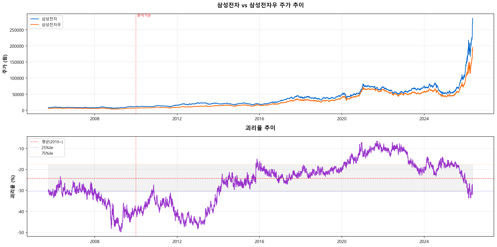

---

## 📌 삼성전기 (009150) vs 삼성전기우 (009155)

**분석 기간**: 2010-01-04 ~ 2026-05-11 (4,021일)
**전체 데이터**: 2005-09-29 ~ 2026-05-11 (5,091일) — 2010년 이전은 참고용

### 현재 상황

| 항목 | 값 |
|:----:|:---|
| 삼성전기 | 903,000원 |
| 삼성전기우 | 377,000원 |
| **현재 괴리율** | **-58.25%** |
| 우선주 할인율 | 58.25% |
| 역사적 위치 | 하위 49.6% |
| Z-Score | 0.13σ |
| 종합 점수 | -10점 (±100점 만점) |
| **판정** | **⚪ 중립** |

**판정 근거:**

- ❌ 최근 30일 평균보다 1%p 이상 높음

### 괴리율 통계 (2010년~)

| 지표 | 값 |
|:----:|:---|
| 평균 | -59.36% |
| 중간값 | -58.12% |
| 표준편차 | 8.68% |
| 최소 (우선주 최저평가) | -79.74% |
| 최대 (우선주 최고평가) | -32.54% |

| 백분위 | 괴리율 | 의미 |
|:-----:|:------:|:-----|
| 10% | -73.28% | 우선주 매우 저평가 |
| 25% | -64.55% | 우선주 저평가 |
| 50% | -58.12% | 중간값 |
| 75% | -53.53% | 우선주 고평가 |
| 90% | -49.00% | 우선주 매우 고평가 |

**📎 참고: 전체 기간 (2005-09-29~) 통계 비교**

| 지표 | 2010년 이후 | 전체 기간 |
|:----:|:----------:|:---------:|
| 평균 | -59.36% | -60.23% |
| 중간값 | -58.12% | -59.68% |
| 표준편차 | 8.68% | 8.31% |
| 최소 | -79.74% | -79.74% |
| 최대 | -32.54% | -32.54% |

### 기간별 괴리율

| 기간 | 평균 | 최소 | 최대 | 현재 대비 |
|:----:|:----:|:----:|:----:|:---------:|
| 최근 1개월 | -60.49% | -63.07% | -57.56% | +2.24%p |
| 최근 3개월 | -58.65% | -63.07% | -54.04% | +0.40%p |
| 최근 6개월 | -56.95% | -63.07% | -52.26% | -1.30%p |
| 최근 1년 | -55.95% | -63.07% | -51.35% | -2.30%p |
| 최근 3년 | -53.17% | -63.07% | -43.76% | -5.09%p |
| 최근 5년 | -54.27% | -64.55% | -32.54% | -3.98%p |

### 시장 상황별 괴리율

| 구분 | 기간 | 평균 괴리율 | 중간값 |
|:----:|:----:|:----------:|:------:|
| 상승장 | 1391일 (34.6%) | -59.98% | -58.98% |
| 하락장 | 1127일 (28.0%) | -58.09% | -56.07% |
| 중립장 | 1503일 (37.4%) | -59.75% | -57.36% |

### 역사적 극단값 (Top 5)

**🟦 우선주 최저평가 시점 (괴리율 최저)**

| 날짜 | 삼성전기 | 삼성전기우 | 괴리율 |
|:----:|--------:|----------:|:------:|
| 2012-06-21 | 93,451원 | 18,936원 | **-79.74%** |
| 2012-06-18 | 93,451원 | 19,043원 | **-79.62%** |
| 2012-06-19 | 92,154원 | 18,864원 | **-79.53%** |
| 2012-06-20 | 92,154원 | 18,864원 | **-79.53%** |
| 2012-06-15 | 93,019원 | 19,043원 | **-79.53%** |

**🟥 보통주 최저평가 시점 (괴리율 최고)**

| 날짜 | 삼성전기 | 삼성전기우 | 괴리율 |
|:----:|--------:|----------:|:------:|
| 2021-01-27 | 202,419원 | 136,554원 | **-32.54%** |
| 2021-01-26 | 204,778원 | 136,554원 | **-33.32%** |
| 2021-01-28 | 197,701원 | 130,367원 | **-34.06%** |
| 2021-01-29 | 192,510원 | 121,971원 | **-36.64%** |
| 2021-02-03 | 197,701원 | 122,855원 | **-37.86%** |

### 차트

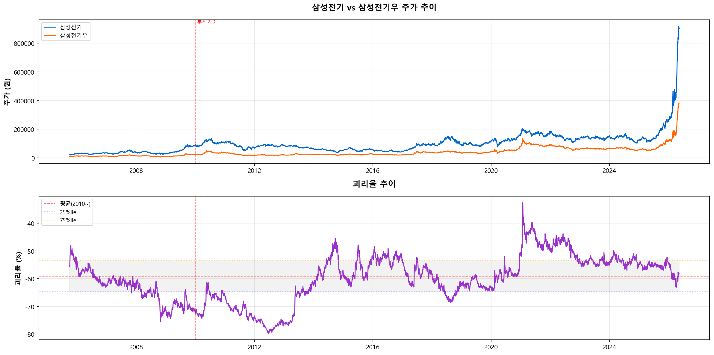

---

## 📌 현대차 (005380) vs 현대차우 (005385)

**분석 기간**: 2010-01-04 ~ 2026-05-11 (4,021일)
**전체 데이터**: 2005-09-29 ~ 2026-05-11 (5,091일) — 2010년 이전은 참고용

### 현재 상황

| 항목 | 값 |
|:----:|:---|
| 현대차 | 642,500원 |
| 현대차우 | 271,500원 |
| **현재 괴리율** | **-57.74%** |
| 우선주 할인율 | 57.74% |
| 역사적 위치 | 하위 33.1% |
| Z-Score | -0.25σ |
| 종합 점수 | 10점 (±100점 만점) |
| **판정** | **⚪ 중립** |

**판정 근거:**

- ✅ 최근 30일 평균보다 1%p 이상 낮음

### 괴리율 통계 (2010년~)

| 지표 | 값 |
|:----:|:---|
| 평균 | -54.20% |
| 중간값 | -51.47% |
| 표준편차 | 14.15% |
| 최소 (우선주 최저평가) | -79.50% |
| 최대 (우선주 최고평가) | -20.11% |

| 백분위 | 괴리율 | 의미 |
|:-----:|:------:|:-----|
| 10% | -76.14% | 우선주 매우 저평가 |
| 25% | -60.81% | 우선주 저평가 |
| 50% | -51.47% | 중간값 |
| 75% | -46.24% | 우선주 고평가 |
| 90% | -38.84% | 우선주 매우 고평가 |

**📎 참고: 전체 기간 (2005-09-29~) 통계 비교**

| 지표 | 2010년 이후 | 전체 기간 |
|:----:|:----------:|:---------:|
| 평균 | -54.20% | -57.05% |
| 중간값 | -51.47% | -56.24% |
| 표준편차 | 14.15% | 14.16% |
| 최소 | -79.50% | -82.21% |
| 최대 | -20.11% | -20.11% |

### 기간별 괴리율

| 기간 | 평균 | 최소 | 최대 | 현재 대비 |
|:----:|:----:|:----:|:----:|:---------:|
| 최근 1개월 | -51.81% | -57.74% | -48.08% | -5.93%p |
| 최근 3개월 | -46.84% | -57.74% | -29.83% | -10.91%p |
| 최근 6개월 | -36.56% | -57.74% | -23.49% | -21.19%p |
| 최근 1년 | -31.05% | -57.74% | -20.11% | -26.69%p |
| 최근 3년 | -43.01% | -60.05% | -20.11% | -14.73%p |
| 최근 5년 | -47.49% | -63.08% | -20.11% | -10.25%p |

### 시장 상황별 괴리율

| 구분 | 기간 | 평균 괴리율 | 중간값 |
|:----:|:----:|:----------:|:------:|
| 상승장 | 1147일 (28.5%) | -55.28% | -52.52% |
| 하락장 | 788일 (19.6%) | -51.74% | -49.30% |
| 중립장 | 2086일 (51.9%) | -54.55% | -51.51% |

### 역사적 극단값 (Top 5)

**🟦 우선주 최저평가 시점 (괴리율 최저)**

| 날짜 | 현대차 | 현대차우 | 괴리율 |
|:----:|--------:|----------:|:------:|
| 2012-04-20 | 169,084원 | 34,658원 | **-79.50%** |
| 2012-04-23 | 166,421원 | 34,406원 | **-79.33%** |
| 2012-06-20 | 168,751원 | 34,909원 | **-79.31%** |
| 2012-08-02 | 158,765원 | 32,897원 | **-79.28%** |
| 2012-04-19 | 172,745원 | 35,815원 | **-79.27%** |

**🟥 보통주 최저평가 시점 (괴리율 최고)**

| 날짜 | 현대차 | 현대차우 | 괴리율 |
|:----:|--------:|----------:|:------:|
| 2025-05-23 | 173,027원 | 138,223원 | **-20.11%** |
| 2025-06-04 | 181,332원 | 144,557원 | **-20.28%** |
| 2025-05-26 | 174,950원 | 139,076원 | **-20.51%** |
| 2025-05-27 | 174,950원 | 138,508원 | **-20.83%** |
| 2025-06-05 | 184,842원 | 146,100원 | **-20.96%** |

### 차트

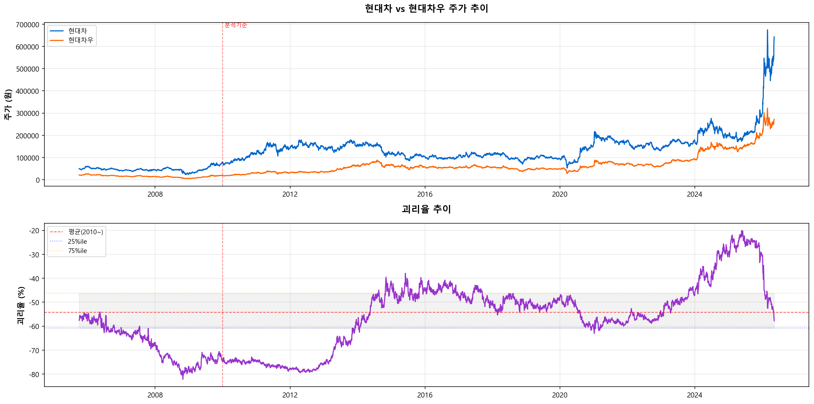

---

## 📌 미래에셋증권 (006800) vs 미래에셋증권우 (006805)

**분석 기간**: 2010-01-04 ~ 2026-05-11 (4,021일)
**전체 데이터**: 2005-09-29 ~ 2026-05-11 (5,091일) — 2010년 이전은 참고용

### 현재 상황

| 항목 | 값 |
|:----:|:---|
| 미래에셋증권 | 79,700원 |
| 미래에셋증권우 | 23,950원 |
| **현재 괴리율** | **-69.95%** |
| 우선주 할인율 | 69.95% |
| 역사적 위치 | 하위 9.3% |
| Z-Score | -1.50σ |
| 종합 점수 | 80점 (±100점 만점) |
| **판정** | **🟦 우선주 강력 매수** |

**판정 근거:**

- ✅ 역사적 하위 10% (우선주 매우 저평가)
- ✅ 평균 대비 1.5σ 이상 낮음
- ✅ 최근 30일 평균보다 1%p 이상 낮음

### 괴리율 통계 (2010년~)

| 지표 | 값 |
|:----:|:---|
| 평균 | -54.23% |
| 중간값 | -52.30% |
| 표준편차 | 10.47% |
| 최소 (우선주 최저평가) | -73.11% |
| 최대 (우선주 최고평가) | -30.41% |

| 백분위 | 괴리율 | 의미 |
|:-----:|:------:|:-----|
| 10% | -69.82% | 우선주 매우 저평가 |
| 25% | -65.53% | 우선주 저평가 |
| 50% | -52.30% | 중간값 |
| 75% | -46.82% | 우선주 고평가 |
| 90% | -40.92% | 우선주 매우 고평가 |

**📎 참고: 전체 기간 (2005-09-29~) 통계 비교**

| 지표 | 2010년 이후 | 전체 기간 |
|:----:|:----------:|:---------:|
| 평균 | -54.23% | -56.09% |
| 중간값 | -52.30% | -54.61% |
| 표준편차 | 10.47% | 10.60% |
| 최소 | -73.11% | -76.17% |
| 최대 | -30.41% | -30.41% |

### 기간별 괴리율

| 기간 | 평균 | 최소 | 최대 | 현재 대비 |
|:----:|:----:|:----:|:----:|:---------:|
| 최근 1개월 | -67.57% | -69.95% | -65.47% | -2.38%p |
| 최근 3개월 | -60.50% | -69.95% | -30.41% | -9.45%p |
| 최근 6개월 | -56.82% | -69.95% | -30.41% | -13.13%p |
| 최근 1년 | -54.68% | -69.95% | -30.41% | -15.27%p |
| 최근 3년 | -48.30% | -69.95% | -30.41% | -21.65%p |
| 최근 5년 | -48.00% | -69.95% | -30.41% | -21.95%p |

### 시장 상황별 괴리율

| 구분 | 기간 | 평균 괴리율 | 중간값 |
|:----:|:----:|:----------:|:------:|
| 상승장 | 1097일 (27.3%) | -56.25% | -53.79% |
| 하락장 | 1026일 (25.5%) | -54.93% | -53.40% |
| 중립장 | 1898일 (47.2%) | -52.68% | -49.76% |

### 역사적 극단값 (Top 5)

**🟦 우선주 최저평가 시점 (괴리율 최저)**

| 날짜 | 미래에셋증권 | 미래에셋증권우 | 괴리율 |
|:----:|--------:|----------:|:------:|
| 2012-09-27 | 9,530원 | 2,563원 | **-73.11%** |
| 2012-09-19 | 9,933원 | 2,674원 | **-73.08%** |
| 2012-09-21 | 9,750원 | 2,635원 | **-72.97%** |
| 2012-10-02 | 9,310원 | 2,518원 | **-72.95%** |
| 2012-09-24 | 9,566원 | 2,590원 | **-72.92%** |

**🟥 보통주 최저평가 시점 (괴리율 최고)**

| 날짜 | 미래에셋증권 | 미래에셋증권우 | 괴리율 |
|:----:|--------:|----------:|:------:|
| 2025-12-26 | 22,635원 | 15,752원 | **-30.41%** |
| 2022-08-16 | 6,153원 | 4,167원 | **-32.27%** |
| 2022-08-19 | 6,098원 | 4,079원 | **-33.10%** |
| 2022-08-04 | 5,960원 | 3,987원 | **-33.11%** |
| 2022-08-12 | 6,217원 | 4,155원 | **-33.17%** |

### 차트

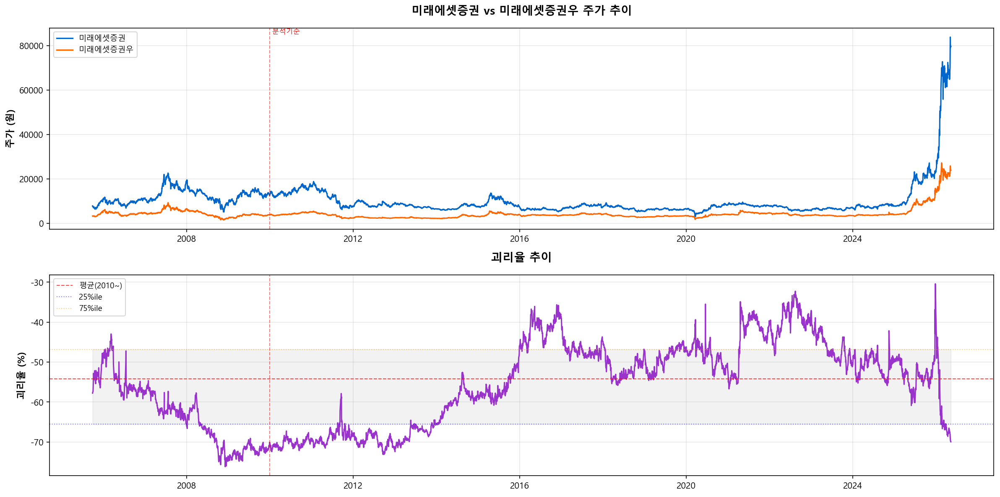

---

## 📌 CJ (001040) vs CJ우 (001045)

**분석 기간**: 2010-01-04 ~ 2026-05-11 (4,021일)
**전체 데이터**: 2000-01-04 ~ 2026-05-11 (6,588일) — 2010년 이전은 참고용

### 현재 상황

| 항목 | 값 |
|:----:|:---|
| CJ | 218,500원 |
| CJ우 | 89,300원 |
| **현재 괴리율** | **-59.13%** |
| 우선주 할인율 | 59.13% |
| 역사적 위치 | 하위 50.7% |
| Z-Score | 0.04σ |
| 종합 점수 | 10점 (±100점 만점) |
| **판정** | **⚪ 중립** |

**판정 근거:**

- ✅ 최근 30일 평균보다 1%p 이상 낮음

### 괴리율 통계 (2010년~)

| 지표 | 값 |
|:----:|:---|
| 평균 | -59.60% |
| 중간값 | -59.32% |
| 표준편차 | 12.25% |
| 최소 (우선주 최저평가) | -83.09% |
| 최대 (우선주 최고평가) | -34.59% |

| 백분위 | 괴리율 | 의미 |
|:-----:|:------:|:-----|
| 10% | -79.89% | 우선주 매우 저평가 |
| 25% | -69.41% | 우선주 저평가 |
| 50% | -59.32% | 중간값 |
| 75% | -49.18% | 우선주 고평가 |
| 90% | -44.19% | 우선주 매우 고평가 |

**📎 참고: 전체 기간 (2000-01-04~) 통계 비교**

| 지표 | 2010년 이후 | 전체 기간 |
|:----:|:----------:|:---------:|
| 평균 | -59.60% | 71.55% |
| 중간값 | -59.32% | -52.51% |
| 표준편차 | 12.25% | 214.60% |
| 최소 | -83.09% | -83.09% |
| 최대 | -34.59% | 845.98% |

### 기간별 괴리율

| 기간 | 평균 | 최소 | 최대 | 현재 대비 |
|:----:|:----:|:----:|:----:|:---------:|
| 최근 1개월 | -57.84% | -59.87% | -54.91% | -1.29%p |
| 최근 3개월 | -54.95% | -59.87% | -48.87% | -4.19%p |
| 최근 6개월 | -51.68% | -59.87% | -42.34% | -7.45%p |
| 최근 1년 | -48.49% | -59.87% | -39.60% | -10.64%p |
| 최근 3년 | -47.16% | -59.87% | -34.59% | -11.97%p |
| 최근 5년 | -49.18% | -63.67% | -34.59% | -9.95%p |

### 시장 상황별 괴리율

| 구분 | 기간 | 평균 괴리율 | 중간값 |
|:----:|:----:|:----------:|:------:|
| 상승장 | 1296일 (32.2%) | -60.81% | -59.18% |
| 하락장 | 1033일 (25.7%) | -57.75% | -59.03% |
| 중립장 | 1692일 (42.1%) | -59.79% | -59.84% |

### 역사적 극단값 (Top 5)

**🟦 우선주 최저평가 시점 (괴리율 최저)**

| 날짜 | CJ | CJ우 | 괴리율 |
|:----:|--------:|----------:|:------:|
| 2013-02-28 | 105,339원 | 17,815원 | **-83.09%** |
| 2012-10-29 | 76,722원 | 13,029원 | **-83.02%** |
| 2013-02-21 | 95,474원 | 16,273원 | **-82.96%** |
| 2013-02-05 | 95,122원 | 16,216원 | **-82.95%** |
| 2013-02-27 | 101,464원 | 17,329원 | **-82.92%** |

**🟥 보통주 최저평가 시점 (괴리율 최고)**

| 날짜 | CJ | CJ우 | 괴리율 |
|:----:|--------:|----------:|:------:|
| 2023-07-13 | 57,779원 | 37,792원 | **-34.59%** |
| 2023-07-26 | 57,873원 | 37,530원 | **-35.15%** |
| 2023-07-12 | 58,529원 | 37,749원 | **-35.51%** |
| 2023-07-10 | 57,591원 | 37,049원 | **-35.67%** |
| 2023-07-14 | 58,623원 | 37,661원 | **-35.76%** |

### 차트

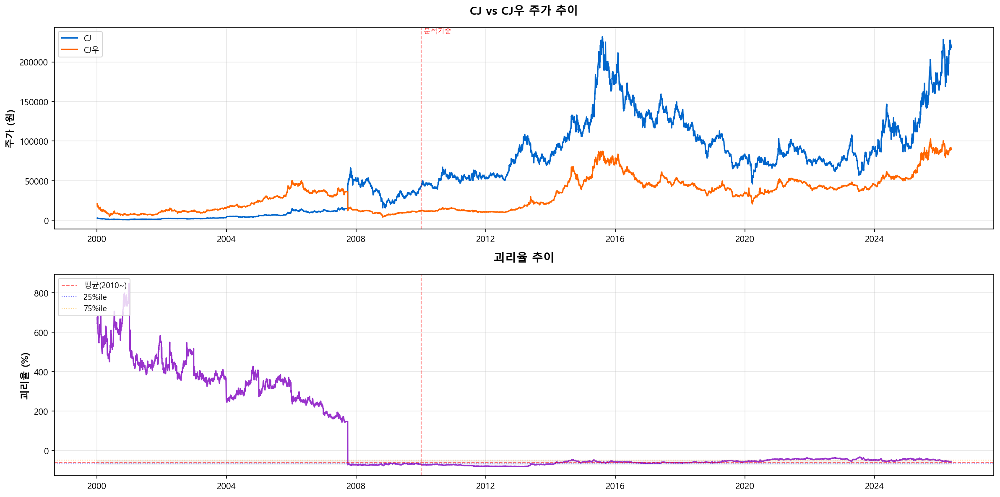

---

## 📌 대상 (001680) vs 대상우 (001685)

**분석 기간**: 2010-01-04 ~ 2026-05-11 (4,021일)
**전체 데이터**: 2005-09-29 ~ 2026-05-11 (5,091일) — 2010년 이전은 참고용

### 현재 상황

| 항목 | 값 |
|:----:|:---|
| 대상 | 20,100원 |
| 대상우 | 16,180원 |
| **현재 괴리율** | **-19.50%** |
| 우선주 할인율 | 19.50% |
| 역사적 위치 | 하위 95.0% |
| Z-Score | 1.41σ |
| 종합 점수 | -60점 (±100점 만점) |
| **판정** | **🟥 보통주 강력 매수** |

**판정 근거:**

- ❌ 역사적 상위 10% (우선주 매우 고평가)
- ❌ 평균 대비 1.0σ 이상 높음

### 괴리율 통계 (2010년~)

| 지표 | 값 |
|:----:|:---|
| 평균 | -50.05% |
| 중간값 | -55.10% |
| 표준편차 | 21.66% |
| 최소 (우선주 최저평가) | -85.54% |
| 최대 (우선주 최고평가) | 54.56% |

| 백분위 | 괴리율 | 의미 |
|:-----:|:------:|:-----|
| 10% | -77.69% | 우선주 매우 저평가 |
| 25% | -67.17% | 우선주 저평가 |
| 50% | -55.10% | 중간값 |
| 75% | -28.67% | 우선주 고평가 |
| 90% | -22.56% | 우선주 매우 고평가 |

**📎 참고: 전체 기간 (2005-09-29~) 통계 비교**

| 지표 | 2010년 이후 | 전체 기간 |
|:----:|:----------:|:---------:|
| 평균 | -50.05% | -53.48% |
| 중간값 | -55.10% | -59.38% |
| 표준편차 | 21.66% | 20.48% |
| 최소 | -85.54% | -85.54% |
| 최대 | 54.56% | 54.56% |

### 기간별 괴리율

| 기간 | 평균 | 최소 | 최대 | 현재 대비 |
|:----:|:----:|:----:|:----:|:---------:|
| 최근 1개월 | -19.24% | -22.14% | -16.76% | -0.27%p |
| 최근 3개월 | -20.75% | -26.25% | -16.68% | +1.24%p |
| 최근 6개월 | -21.87% | -28.85% | -16.68% | +2.37%p |
| 최근 1년 | -23.18% | -33.74% | -14.79% | +3.67%p |
| 최근 3년 | -22.44% | -33.74% | 54.56% | +2.93%p |
| 최근 5년 | -30.04% | -58.52% | 54.56% | +10.53%p |

### 시장 상황별 괴리율

| 구분 | 기간 | 평균 괴리율 | 중간값 |
|:----:|:----:|:----------:|:------:|
| 상승장 | 1214일 (30.2%) | -58.74% | -63.67% |
| 하락장 | 969일 (24.1%) | -49.36% | -54.17% |
| 중립장 | 1838일 (45.7%) | -44.67% | -46.97% |

### 역사적 극단값 (Top 5)

**🟦 우선주 최저평가 시점 (괴리율 최저)**

| 날짜 | 대상 | 대상우 | 괴리율 |
|:----:|--------:|----------:|:------:|
| 2013-03-26 | 25,069원 | 3,624원 | **-85.54%** |
| 2013-03-27 | 26,159원 | 3,806원 | **-85.45%** |
| 2013-03-22 | 24,742원 | 3,600원 | **-85.45%** |
| 2013-03-28 | 26,631원 | 3,878원 | **-85.44%** |
| 2013-03-15 | 24,197원 | 3,528원 | **-85.42%** |

**🟥 보통주 최저평가 시점 (괴리율 최고)**

| 날짜 | 대상 | 대상우 | 괴리율 |
|:----:|--------:|----------:|:------:|
| 2023-12-18 | 18,434원 | 28,493원 | **54.56%** |
| 2023-12-14 | 18,835원 | 28,667원 | **52.20%** |
| 2023-12-19 | 18,390원 | 26,965원 | **46.63%** |
| 2023-12-15 | 18,568원 | 27,053원 | **45.70%** |
| 2023-12-20 | 18,657원 | 26,005원 | **39.39%** |

### 차트

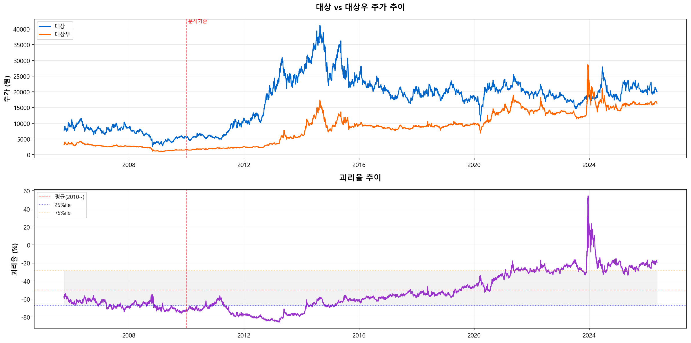

---

## 📌 SK (034730) vs SK우 (03473K)

**분석 기간**: 2015-08-17 ~ 2026-05-11 (2,627일)

### 현재 상황

| 항목 | 값 |
|:----:|:---|
| SK | 574,000원 |
| SK우 | 394,500원 |
| **현재 괴리율** | **-31.27%** |
| 우선주 할인율 | 31.27% |
| 역사적 위치 | 하위 40.8% |
| Z-Score | -0.24σ |
| 종합 점수 | 10점 (±100점 만점) |
| **판정** | **⚪ 중립** |

**판정 근거:**

- ✅ 최근 30일 평균보다 1%p 이상 낮음

### 괴리율 통계

| 지표 | 값 |
|:----:|:---|
| 평균 | -27.37% |
| 중간값 | -22.79% |
| 표준편차 | 16.11% |
| 최소 (우선주 최저평가) | -53.66% |
| 최대 (우선주 최고평가) | 50.62% |

| 백분위 | 괴리율 | 의미 |
|:-----:|:------:|:-----|
| 10% | -47.92% | 우선주 매우 저평가 |
| 25% | -43.68% | 우선주 저평가 |
| 50% | -22.79% | 중간값 |
| 75% | -14.06% | 우선주 고평가 |
| 90% | -10.27% | 우선주 매우 고평가 |

### 기간별 괴리율

| 기간 | 평균 | 최소 | 최대 | 현재 대비 |
|:----:|:----:|:----:|:----:|:---------:|
| 최근 1개월 | -27.60% | -32.69% | -22.40% | -3.67%p |
| 최근 3개월 | -27.74% | -32.69% | -22.40% | -3.53%p |
| 최근 6개월 | -25.92% | -32.69% | -15.24% | -5.36%p |
| 최근 1년 | -21.03% | -32.69% | -7.52% | -10.24%p |
| 최근 3년 | -17.54% | -32.69% | 15.96% | -13.73%p |
| 최근 5년 | -19.40% | -53.66% | 50.62% | -11.87%p |

### 시장 상황별 괴리율

| 구분 | 기간 | 평균 괴리율 | 중간값 |
|:----:|:----:|:----------:|:------:|
| 상승장 | 607일 (23.1%) | -26.33% | -25.21% |
| 하락장 | 630일 (24.0%) | -21.48% | -15.91% |
| 중립장 | 1390일 (52.9%) | -30.49% | -33.46% |

### 역사적 극단값 (Top 5)

**🟦 우선주 최저평가 시점 (괴리율 최저)**

| 날짜 | SK | SK우 | 괴리율 |
|:----:|--------:|----------:|:------:|
| 2018-12-21 | 212,815원 | 98,612원 | **-53.66%** |
| 2018-12-19 | 215,997원 | 100,117원 | **-53.65%** |
| 2018-05-18 | 240,125원 | 111,374원 | **-53.62%** |
| 2019-01-17 | 215,796원 | 100,229원 | **-53.55%** |
| 2018-12-17 | 218,782원 | 101,623원 | **-53.55%** |

**🟥 보통주 최저평가 시점 (괴리율 최고)**

| 날짜 | SK | SK우 | 괴리율 |
|:----:|--------:|----------:|:------:|
| 2020-06-30 | 240,677원 | 362,516원 | **50.62%** |
| 2020-06-18 | 254,277원 | 378,368원 | **48.80%** |
| 2020-07-01 | 245,640원 | 361,714원 | **47.25%** |
| 2020-06-17 | 262,107원 | 375,968원 | **43.44%** |
| 2020-06-16 | 253,041원 | 340,371원 | **34.51%** |

### 차트

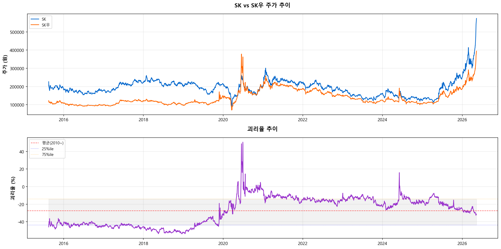

---

## 📌 한화 (000880) vs 한화3우B (00088K)

**분석 기간**: 2016-10-19 ~ 2026-05-11 (2,339일)

### 현재 상황

| 항목 | 값 |
|:----:|:---|
| 한화 | 139,200원 |
| 한화3우B | 49,500원 |
| **현재 괴리율** | **-64.44%** |
| 우선주 할인율 | 64.44% |
| 역사적 위치 | 하위 9.8% |
| Z-Score | -1.41σ |
| 종합 점수 | 70점 (±100점 만점) |
| **판정** | **🟦 우선주 강력 매수** |

**판정 근거:**

- ✅ 역사적 하위 10% (우선주 매우 저평가)
- ✅ 평균 대비 1.0σ 이상 낮음
- ✅ 최근 30일 평균보다 1%p 이상 낮음

### 괴리율 통계

| 지표 | 값 |
|:----:|:---|
| 평균 | -56.15% |
| 중간값 | -56.14% |
| 표준편차 | 5.89% |
| 최소 (우선주 최저평가) | -68.35% |
| 최대 (우선주 최고평가) | -37.82% |

| 백분위 | 괴리율 | 의미 |
|:-----:|:------:|:-----|
| 10% | -64.38% | 우선주 매우 저평가 |
| 25% | -61.00% | 우선주 저평가 |
| 50% | -56.14% | 중간값 |
| 75% | -51.31% | 우선주 고평가 |
| 90% | -48.19% | 우선주 매우 고평가 |

### 기간별 괴리율

| 기간 | 평균 | 최소 | 최대 | 현재 대비 |
|:----:|:----:|:----:|:----:|:---------:|
| 최근 1개월 | -61.74% | -64.44% | -59.61% | -2.70%p |
| 최근 3개월 | -60.32% | -64.44% | -54.92% | -4.11%p |
| 최근 6개월 | -58.65% | -64.44% | -53.61% | -5.79%p |
| 최근 1년 | -56.63% | -64.44% | -44.91% | -7.81%p |
| 최근 3년 | -52.54% | -64.44% | -43.97% | -11.90%p |
| 최근 5년 | -53.94% | -64.44% | -37.82% | -10.50%p |

### 시장 상황별 괴리율

| 구분 | 기간 | 평균 괴리율 | 중간값 |
|:----:|:----:|:----------:|:------:|
| 상승장 | 682일 (29.2%) | -58.09% | -58.29% |
| 하락장 | 520일 (22.2%) | -54.49% | -54.15% |
| 중립장 | 1137일 (48.6%) | -55.74% | -55.04% |

### 역사적 극단값 (Top 5)

**🟦 우선주 최저평가 시점 (괴리율 최저)**

| 날짜 | 한화 | 한화3우B | 괴리율 |
|:----:|--------:|----------:|:------:|
| 2017-08-11 | 41,507원 | 13,138원 | **-68.35%** |
| 2017-08-16 | 41,831원 | 13,301원 | **-68.20%** |
| 2017-08-18 | 41,912원 | 13,366원 | **-68.11%** |
| 2017-08-24 | 41,669원 | 13,301원 | **-68.08%** |
| 2017-08-14 | 41,102원 | 13,138원 | **-68.04%** |

**🟥 보통주 최저평가 시점 (괴리율 최고)**

| 날짜 | 한화 | 한화3우B | 괴리율 |
|:----:|--------:|----------:|:------:|
| 2020-03-19 | 10,816원 | 6,725원 | **-37.82%** |
| 2020-03-18 | 12,763원 | 7,431원 | **-41.78%** |
| 2020-03-23 | 10,426원 | 5,974원 | **-42.70%** |
| 2020-03-13 | 14,710원 | 8,285원 | **-43.67%** |
| 2020-03-20 | 11,897원 | 6,688원 | **-43.79%** |

### 차트

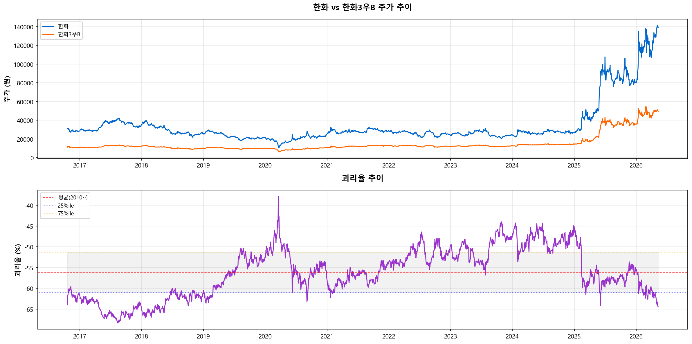

---

## 📌 LG (003550) vs LG우 (003555)

**분석 기간**: 2010-01-04 ~ 2026-05-11 (4,021일)
**전체 데이터**: 2005-09-29 ~ 2026-05-11 (5,091일) — 2010년 이전은 참고용

### 현재 상황

| 항목 | 값 |
|:----:|:---|
| LG | 104,900원 |
| LG우 | 71,900원 |
| **현재 괴리율** | **-31.46%** |
| 우선주 할인율 | 31.46% |
| 역사적 위치 | 하위 71.3% |
| Z-Score | 0.88σ |
| 종합 점수 | 10점 (±100점 만점) |
| **판정** | **⚪ 중립** |

**판정 근거:**

- ✅ 최근 30일 평균보다 1%p 이상 낮음

### 괴리율 통계 (2010년~)

| 지표 | 값 |
|:----:|:---|
| 평균 | -46.87% |
| 중간값 | -48.33% |
| 표준편차 | 17.48% |
| 최소 (우선주 최저평가) | -77.01% |
| 최대 (우선주 최고평가) | -12.16% |

| 백분위 | 괴리율 | 의미 |
|:-----:|:------:|:-----|
| 10% | -73.07% | 우선주 매우 저평가 |
| 25% | -56.83% | 우선주 저평가 |
| 50% | -48.33% | 중간값 |
| 75% | -29.49% | 우선주 고평가 |
| 90% | -23.71% | 우선주 매우 고평가 |

**📎 참고: 전체 기간 (2005-09-29~) 통계 비교**

| 지표 | 2010년 이후 | 전체 기간 |
|:----:|:----------:|:---------:|
| 평균 | -46.87% | -50.91% |
| 중간값 | -48.33% | -51.81% |
| 표준편차 | 17.48% | 17.59% |
| 최소 | -77.01% | -77.01% |
| 최대 | -12.16% | -12.16% |

### 기간별 괴리율

| 기간 | 평균 | 최소 | 최대 | 현재 대비 |
|:----:|:----:|:----:|:----:|:---------:|
| 최근 1개월 | -26.70% | -32.97% | -23.19% | -4.76%p |
| 최근 3개월 | -23.98% | -32.97% | -18.25% | -7.48%p |
| 최근 6개월 | -21.01% | -32.97% | -13.17% | -10.45%p |
| 최근 1년 | -20.63% | -32.97% | -12.16% | -10.83%p |
| 최근 3년 | -24.75% | -34.96% | -12.16% | -6.71%p |
| 최근 5년 | -31.42% | -53.92% | -12.16% | -0.04%p |

### 시장 상황별 괴리율

| 구분 | 기간 | 평균 괴리율 | 중간값 |
|:----:|:----:|:----------:|:------:|
| 상승장 | 932일 (23.2%) | -49.14% | -50.10% |
| 하락장 | 808일 (20.1%) | -47.65% | -47.76% |
| 중립장 | 2281일 (56.7%) | -45.67% | -47.92% |

### 역사적 극단값 (Top 5)

**🟦 우선주 최저평가 시점 (괴리율 최저)**

| 날짜 | LG | LG우 | 괴리율 |
|:----:|--------:|----------:|:------:|
| 2011-04-22 | 73,676원 | 16,936원 | **-77.01%** |
| 2011-04-21 | 73,158원 | 16,936원 | **-76.85%** |
| 2011-04-20 | 71,385원 | 16,775원 | **-76.50%** |
| 2011-04-25 | 73,380원 | 17,285원 | **-76.44%** |
| 2011-05-18 | 73,084원 | 17,258원 | **-76.39%** |

**🟥 보통주 최저평가 시점 (괴리율 최고)**

| 날짜 | LG | LG우 | 괴리율 |
|:----:|--------:|----------:|:------:|
| 2025-04-11 | 59,276원 | 52,067원 | **-12.16%** |
| 2025-04-10 | 58,698원 | 51,400원 | **-12.43%** |
| 2025-10-10 | 69,618원 | 60,447원 | **-13.17%** |
| 2025-04-09 | 56,385원 | 48,825원 | **-13.41%** |
| 2025-10-01 | 69,618원 | 59,963원 | **-13.87%** |

### 차트

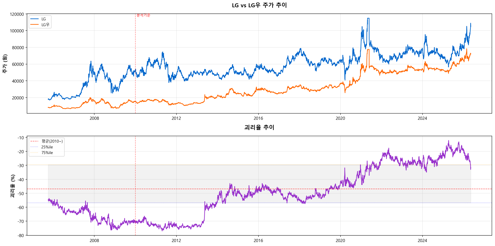

---

## 📌 GS (078930) vs GS우 (078935)

**분석 기간**: 2010-01-04 ~ 2026-05-11 (4,021일)
**전체 데이터**: 2005-09-29 ~ 2026-05-11 (5,091일) — 2010년 이전은 참고용

### 현재 상황

| 항목 | 값 |
|:----:|:---|
| GS | 77,400원 |
| GS우 | 56,300원 |
| **현재 괴리율** | **-27.26%** |
| 우선주 할인율 | 27.26% |
| 역사적 위치 | 하위 63.8% |
| Z-Score | 0.54σ |
| 종합 점수 | 10점 (±100점 만점) |
| **판정** | **⚪ 중립** |

**판정 근거:**

- ✅ 최근 30일 평균보다 1%p 이상 낮음

### 괴리율 통계 (2010년~)

| 지표 | 값 |
|:----:|:---|
| 평균 | -38.53% |
| 중간값 | -38.15% |
| 표준편차 | 20.82% |
| 최소 (우선주 최저평가) | -78.71% |
| 최대 (우선주 최고평가) | 1.02% |

| 백분위 | 괴리율 | 의미 |
|:-----:|:------:|:-----|
| 10% | -72.20% | 우선주 매우 저평가 |
| 25% | -54.60% | 우선주 저평가 |
| 50% | -38.15% | 중간값 |
| 75% | -20.90% | 우선주 고평가 |
| 90% | -13.65% | 우선주 매우 고평가 |

**📎 참고: 전체 기간 (2005-09-29~) 통계 비교**

| 지표 | 2010년 이후 | 전체 기간 |
|:----:|:----------:|:---------:|
| 평균 | -38.53% | -42.56% |
| 중간값 | -38.15% | -42.98% |
| 표준편차 | 20.82% | 20.20% |
| 최소 | -78.71% | -78.71% |
| 최대 | 1.02% | 1.02% |

### 기간별 괴리율

| 기간 | 평균 | 최소 | 최대 | 현재 대비 |
|:----:|:----:|:----:|:----:|:---------:|
| 최근 1개월 | -23.20% | -29.42% | -15.96% | -4.07%p |
| 최근 3개월 | -19.63% | -29.42% | -11.90% | -7.63%p |
| 최근 6개월 | -15.35% | -29.42% | -4.90% | -11.91%p |
| 최근 1년 | -10.85% | -29.42% | 0.36% | -16.41%p |
| 최근 3년 | -15.35% | -29.71% | 1.02% | -11.92%p |
| 최근 5년 | -19.86% | -38.59% | 1.02% | -7.40%p |

### 시장 상황별 괴리율

| 구분 | 기간 | 평균 괴리율 | 중간값 |
|:----:|:----:|:----------:|:------:|
| 상승장 | 1145일 (28.5%) | -43.47% | -43.36% |
| 하락장 | 858일 (21.3%) | -39.48% | -38.13% |
| 중립장 | 2018일 (50.2%) | -35.33% | -35.82% |

### 역사적 극단값 (Top 5)

**🟦 우선주 최저평가 시점 (괴리율 최저)**

| 날짜 | GS | GS우 | 괴리율 |
|:----:|--------:|----------:|:------:|
| 2011-04-21 | 57,127원 | 12,160원 | **-78.71%** |
| 2011-03-29 | 53,799원 | 11,500원 | **-78.62%** |
| 2011-04-25 | 56,018원 | 12,011원 | **-78.56%** |
| 2011-04-22 | 55,741원 | 12,011원 | **-78.45%** |
| 2011-04-07 | 52,524원 | 11,372원 | **-78.35%** |

**🟥 보통주 최저평가 시점 (괴리율 최고)**

| 날짜 | GS | GS우 | 괴리율 |
|:----:|--------:|----------:|:------:|
| 2024-07-26 | 42,470원 | 42,905원 | **1.02%** |
| 2025-02-28 | 34,575원 | 34,699원 | **0.36%** |
| 2025-03-04 | 34,239원 | 34,176원 | **-0.18%** |
| 2025-03-05 | 34,287원 | 34,176원 | **-0.32%** |
| 2025-04-09 | 33,472원 | 33,178원 | **-0.88%** |

### 차트

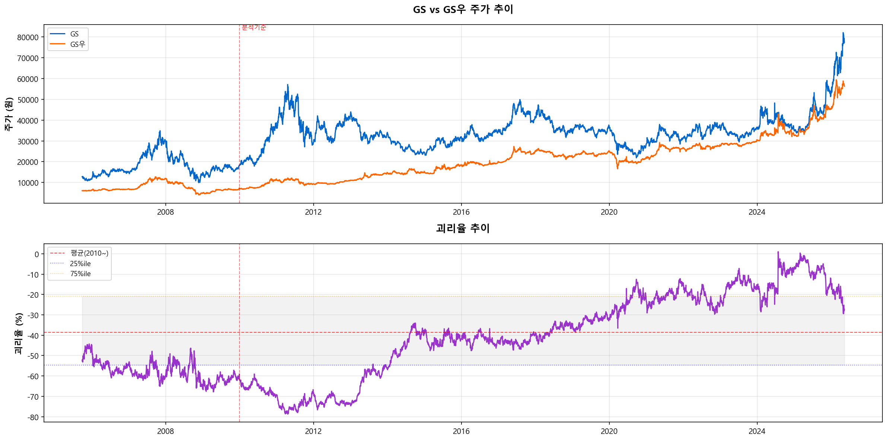

---

## 📌 두산 (000150) vs 두산우 (000155)

**분석 기간**: 2010-01-04 ~ 2026-05-11 (4,021일)
**전체 데이터**: 2000-01-04 ~ 2026-05-11 (6,588일) — 2010년 이전은 참고용

### 현재 상황

| 항목 | 값 |
|:----:|:---|
| 두산 | 1,721,000원 |
| 두산우 | 721,000원 |
| **현재 괴리율** | **-58.11%** |
| 우선주 할인율 | 58.11% |
| 역사적 위치 | 하위 28.7% |
| Z-Score | -0.43σ |
| 종합 점수 | 0점 (±100점 만점) |
| **판정** | **⚪ 중립** |

### 괴리율 통계 (2010년~)

| 지표 | 값 |
|:----:|:---|
| 평균 | -49.98% |
| 중간값 | -46.58% |
| 표준편차 | 18.87% |
| 최소 (우선주 최저평가) | -84.18% |
| 최대 (우선주 최고평가) | 2.80% |

| 백분위 | 괴리율 | 의미 |
|:-----:|:------:|:-----|
| 10% | -79.53% | 우선주 매우 저평가 |
| 25% | -64.60% | 우선주 저평가 |
| 50% | -46.58% | 중간값 |
| 75% | -37.14% | 우선주 고평가 |
| 90% | -27.01% | 우선주 매우 고평가 |

**📎 참고: 전체 기간 (2000-01-04~) 통계 비교**

| 지표 | 2010년 이후 | 전체 기간 |
|:----:|:----------:|:---------:|
| 평균 | -49.98% | -59.83% |
| 중간값 | -46.58% | -67.61% |
| 표준편차 | 18.87% | 19.50% |
| 최소 | -84.18% | -89.30% |
| 최대 | 2.80% | 2.80% |

### 기간별 괴리율

| 기간 | 평균 | 최소 | 최대 | 현재 대비 |
|:----:|:----:|:----:|:----:|:---------:|
| 최근 1개월 | -58.84% | -61.14% | -53.90% | +0.74%p |
| 최근 3개월 | -50.76% | -61.14% | -35.51% | -7.34%p |
| 최근 6개월 | -45.11% | -61.14% | -34.14% | -12.99%p |
| 최근 1년 | -46.27% | -61.14% | -22.69% | -11.84%p |
| 최근 3년 | -43.93% | -63.14% | -15.67% | -14.17%p |
| 최근 5년 | -36.85% | -63.14% | 2.80% | -21.25%p |

### 시장 상황별 괴리율

| 구분 | 기간 | 평균 괴리율 | 중간값 |
|:----:|:----:|:----------:|:------:|
| 상승장 | 1421일 (35.3%) | -52.09% | -49.35% |
| 하락장 | 1046일 (26.0%) | -43.74% | -40.96% |
| 중립장 | 1554일 (38.6%) | -52.24% | -47.67% |

### 역사적 극단값 (Top 5)

**🟦 우선주 최저평가 시점 (괴리율 최저)**

| 날짜 | 두산 | 두산우 | 괴리율 |
|:----:|--------:|----------:|:------:|
| 2012-02-09 | 119,456원 | 18,901원 | **-84.18%** |
| 2012-02-06 | 118,030원 | 18,901원 | **-83.99%** |
| 2012-02-10 | 117,317원 | 18,953원 | **-83.84%** |
| 2012-02-03 | 116,960원 | 18,901원 | **-83.84%** |
| 2012-02-15 | 119,100원 | 19,290원 | **-83.80%** |

**🟥 보통주 최저평가 시점 (괴리율 최고)**

| 날짜 | 두산 | 두산우 | 괴리율 |
|:----:|--------:|----------:|:------:|
| 2020-06-18 | 37,870원 | 38,929원 | **2.80%** |
| 2020-03-26 | 33,079원 | 32,229원 | **-2.57%** |
| 2020-03-18 | 29,283원 | 28,285원 | **-3.41%** |
| 2020-06-19 | 36,604원 | 35,324원 | **-3.50%** |
| 2020-06-17 | 38,457원 | 36,554원 | **-4.95%** |

### 차트

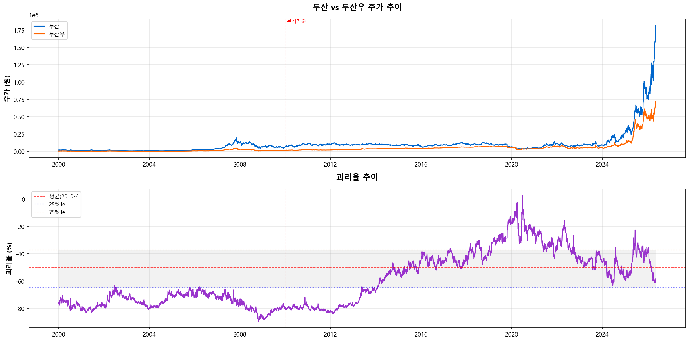

---

## 📌 아모레퍼시픽 (090430) vs 아모레퍼시픽우 (090435)

**분석 기간**: 2010-01-04 ~ 2026-05-11 (4,021일)
**전체 데이터**: 2006-06-29 ~ 2026-05-11 (4,902일) — 2010년 이전은 참고용

### 현재 상황

| 항목 | 값 |
|:----:|:---|
| 아모레퍼시픽 | 127,600원 |
| 아모레퍼시픽우 | 45,400원 |
| **현재 괴리율** | **-64.42%** |
| 우선주 할인율 | 64.42% |
| 역사적 위치 | 하위 53.2% |
| Z-Score | -0.09σ |
| 종합 점수 | 0점 (±100점 만점) |
| **판정** | **⚪ 중립** |

### 괴리율 통계 (2010년~)

| 지표 | 값 |
|:----:|:---|
| 평균 | -63.54% |
| 중간값 | -65.65% |
| 표준편차 | 10.26% |
| 최소 (우선주 최저평가) | -81.90% |
| 최대 (우선주 최고평가) | -39.31% |

| 백분위 | 괴리율 | 의미 |
|:-----:|:------:|:-----|
| 10% | -76.69% | 우선주 매우 저평가 |
| 25% | -72.04% | 우선주 저평가 |
| 50% | -65.65% | 중간값 |
| 75% | -54.32% | 우선주 고평가 |
| 90% | -48.95% | 우선주 매우 고평가 |

**📎 참고: 전체 기간 (2006-06-29~) 통계 비교**

| 지표 | 2010년 이후 | 전체 기간 |
|:----:|:----------:|:---------:|
| 평균 | -63.54% | -65.31% |
| 중간값 | -65.65% | -66.98% |
| 표준편차 | 10.26% | 10.49% |
| 최소 | -81.90% | -87.29% |
| 최대 | -39.31% | -39.31% |

### 기간별 괴리율

| 기간 | 평균 | 최소 | 최대 | 현재 대비 |
|:----:|:----:|:----:|:----:|:---------:|
| 최근 1개월 | -64.90% | -67.32% | -63.54% | +0.48%p |
| 최근 3개월 | -64.88% | -67.74% | -62.93% | +0.46%p |
| 최근 6개월 | -65.32% | -67.76% | -62.39% | +0.90%p |
| 최근 1년 | -67.50% | -72.57% | -62.39% | +3.08%p |
| 최근 3년 | -67.76% | -75.83% | -51.56% | +3.34%p |
| 최근 5년 | -65.11% | -75.83% | -46.91% | +0.69%p |

### 시장 상황별 괴리율

| 구분 | 기간 | 평균 괴리율 | 중간값 |
|:----:|:----:|:----------:|:------:|
| 상승장 | 1298일 (32.3%) | -64.10% | -64.87% |
| 하락장 | 1200일 (29.8%) | -61.73% | -64.35% |
| 중립장 | 1523일 (37.9%) | -64.48% | -66.40% |

### 역사적 극단값 (Top 5)

**🟦 우선주 최저평가 시점 (괴리율 최저)**

| 날짜 | 아모레퍼시픽 | 아모레퍼시픽우 | 괴리율 |
|:----:|--------:|----------:|:------:|
| 2011-10-27 | 118,892원 | 21,517원 | **-81.90%** |
| 2011-10-05 | 114,761원 | 21,201원 | **-81.53%** |
| 2011-10-25 | 111,364원 | 20,609원 | **-81.49%** |
| 2011-06-02 | 118,066원 | 21,912원 | **-81.44%** |
| 2011-10-06 | 117,331원 | 21,833원 | **-81.39%** |

**🟥 보통주 최저평가 시점 (괴리율 최고)**

| 날짜 | 아모레퍼시픽 | 아모레퍼시픽우 | 괴리율 |
|:----:|--------:|----------:|:------:|
| 2017-05-02 | 273,856원 | 166,209원 | **-39.31%** |
| 2017-05-04 | 296,086원 | 178,600원 | **-39.68%** |
| 2017-01-09 | 282,370원 | 168,345원 | **-40.38%** |
| 2017-04-28 | 276,221원 | 162,364원 | **-41.22%** |
| 2017-05-08 | 315,006원 | 185,009원 | **-41.27%** |

### 차트

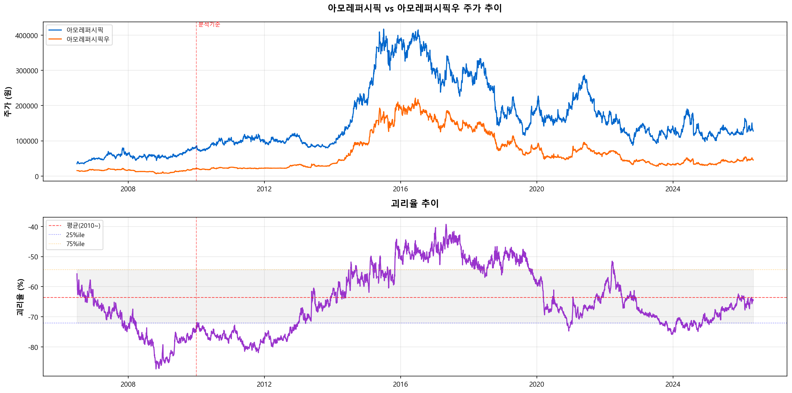

---

## 📌 LG화학 (051910) vs LG화학우 (051915)

**분석 기간**: 2010-01-04 ~ 2026-05-11 (4,021일)
**전체 데이터**: 2005-09-29 ~ 2026-05-11 (5,091일) — 2010년 이전은 참고용

### 현재 상황

| 항목 | 값 |
|:----:|:---|
| LG화학 | 421,500원 |
| LG화학우 | 193,400원 |
| **현재 괴리율** | **-54.12%** |
| 우선주 할인율 | 54.12% |
| 역사적 위치 | 하위 37.7% |
| Z-Score | -0.21σ |
| 종합 점수 | 10점 (±100점 만점) |
| **판정** | **⚪ 중립** |

**판정 근거:**

- ✅ 최근 30일 평균보다 1%p 이상 낮음

### 괴리율 통계 (2010년~)

| 지표 | 값 |
|:----:|:---|
| 평균 | -51.48% |
| 중간값 | -50.41% |
| 표준편차 | 12.57% |
| 최소 (우선주 최저평가) | -75.07% |
| 최대 (우선주 최고평가) | -24.75% |

| 백분위 | 괴리율 | 의미 |
|:-----:|:------:|:-----|
| 10% | -71.59% | 우선주 매우 저평가 |
| 25% | -57.71% | 우선주 저평가 |
| 50% | -50.41% | 중간값 |
| 75% | -40.63% | 우선주 고평가 |
| 90% | -35.46% | 우선주 매우 고평가 |

**📎 참고: 전체 기간 (2005-09-29~) 통계 비교**

| 지표 | 2010년 이후 | 전체 기간 |
|:----:|:----------:|:---------:|
| 평균 | -51.48% | -53.90% |
| 중간값 | -50.41% | -53.32% |
| 표준편차 | 12.57% | 12.63% |
| 최소 | -75.07% | -75.07% |
| 최대 | -24.75% | -24.75% |

### 기간별 괴리율

| 기간 | 평균 | 최소 | 최대 | 현재 대비 |
|:----:|:----:|:----:|:----:|:---------:|
| 최근 1개월 | -52.25% | -55.11% | -50.34% | -1.87%p |
| 최근 3개월 | -51.30% | -55.11% | -49.00% | -2.82%p |
| 최근 6개월 | -50.89% | -55.11% | -47.58% | -3.23%p |
| 최근 1년 | -48.22% | -55.11% | -29.67% | -5.90%p |
| 최근 3년 | -46.57% | -59.07% | -29.16% | -7.55%p |
| 최근 5년 | -48.99% | -60.34% | -29.16% | -5.12%p |

### 시장 상황별 괴리율

| 구분 | 기간 | 평균 괴리율 | 중간값 |
|:----:|:----:|:----------:|:------:|
| 상승장 | 1261일 (31.4%) | -53.31% | -52.64% |
| 하락장 | 1166일 (29.0%) | -48.48% | -47.72% |
| 중립장 | 1594일 (39.6%) | -52.22% | -50.03% |

### 역사적 극단값 (Top 5)

**🟦 우선주 최저평가 시점 (괴리율 최저)**

| 날짜 | LG화학 | LG화학우 | 괴리율 |
|:----:|--------:|----------:|:------:|
| 2012-04-16 | 301,157원 | 75,089원 | **-75.07%** |
| 2012-04-17 | 296,165원 | 74,381원 | **-74.89%** |
| 2012-04-13 | 307,396원 | 77,214원 | **-74.88%** |
| 2012-07-11 | 253,321원 | 63,897원 | **-74.78%** |
| 2012-10-02 | 279,527원 | 70,555원 | **-74.76%** |

**🟥 보통주 최저평가 시점 (괴리율 최고)**

| 날짜 | LG화학 | LG화학우 | 괴리율 |
|:----:|--------:|----------:|:------:|
| 2014-12-02 | 166,026원 | 124,938원 | **-24.75%** |
| 2014-11-05 | 148,527원 | 111,309원 | **-25.06%** |
| 2014-12-04 | 169,014원 | 123,803원 | **-26.75%** |
| 2014-12-03 | 167,307원 | 122,288원 | **-26.91%** |
| 2014-11-07 | 160,905원 | 116,988원 | **-27.29%** |

### 차트

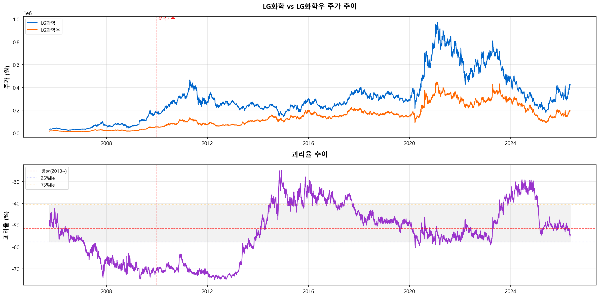

---

## 📌 삼성SDI (006400) vs 삼성SDI우 (006405)

**분석 기간**: 2010-01-04 ~ 2026-05-11 (4,021일)
**전체 데이터**: 2005-09-29 ~ 2026-05-11 (5,091일) — 2010년 이전은 참고용

### 현재 상황

| 항목 | 값 |
|:----:|:---|
| 삼성SDI | 681,000원 |
| 삼성SDI우 | 337,000원 |
| **현재 괴리율** | **-50.51%** |
| 우선주 할인율 | 50.51% |
| 역사적 위치 | 하위 53.9% |
| Z-Score | 0.21σ |
| 종합 점수 | 0점 (±100점 만점) |
| **판정** | **⚪ 중립** |

### 괴리율 통계 (2010년~)

| 지표 | 값 |
|:----:|:---|
| 평균 | -52.75% |
| 중간값 | -51.78% |
| 표준편차 | 10.77% |
| 최소 (우선주 최저평가) | -72.87% |
| 최대 (우선주 최고평가) | -23.65% |

| 백분위 | 괴리율 | 의미 |
|:-----:|:------:|:-----|
| 10% | -67.72% | 우선주 매우 저평가 |
| 25% | -62.32% | 우선주 저평가 |
| 50% | -51.78% | 중간값 |
| 75% | -44.07% | 우선주 고평가 |
| 90% | -38.69% | 우선주 매우 고평가 |

**📎 참고: 전체 기간 (2005-09-29~) 통계 비교**

| 지표 | 2010년 이후 | 전체 기간 |
|:----:|:----------:|:---------:|
| 평균 | -52.75% | -52.92% |
| 중간값 | -51.78% | -51.89% |
| 표준편차 | 10.77% | 10.41% |
| 최소 | -72.87% | -72.87% |
| 최대 | -23.65% | -23.65% |

### 기간별 괴리율

| 기간 | 평균 | 최소 | 최대 | 현재 대비 |
|:----:|:----:|:----:|:----:|:---------:|
| 최근 1개월 | -50.35% | -52.40% | -46.28% | -0.16%p |
| 최근 3개월 | -46.14% | -52.40% | -38.93% | -4.37%p |
| 최근 6개월 | -42.47% | -52.40% | -33.30% | -8.04%p |
| 최근 1년 | -40.75% | -52.40% | -32.82% | -9.77%p |
| 최근 3년 | -45.60% | -56.60% | -32.82% | -4.92%p |
| 최근 5년 | -47.19% | -63.81% | -23.65% | -3.33%p |

### 시장 상황별 괴리율

| 구분 | 기간 | 평균 괴리율 | 중간값 |
|:----:|:----:|:----------:|:------:|
| 상승장 | 1348일 (33.5%) | -52.88% | -53.19% |
| 하락장 | 1136일 (28.3%) | -49.43% | -47.48% |
| 중립장 | 1537일 (38.2%) | -55.07% | -55.86% |

### 역사적 극단값 (Top 5)

**🟦 우선주 최저평가 시점 (괴리율 최저)**

| 날짜 | 삼성SDI | 삼성SDI우 | 괴리율 |
|:----:|--------:|----------:|:------:|
| 2012-08-20 | 141,303원 | 38,343원 | **-72.87%** |
| 2012-05-15 | 155,760원 | 42,906원 | **-72.45%** |
| 2012-08-21 | 138,505원 | 38,343원 | **-72.32%** |
| 2012-08-22 | 137,572원 | 38,257원 | **-72.19%** |
| 2012-05-21 | 145,967원 | 40,816원 | **-72.04%** |

**🟥 보통주 최저평가 시점 (괴리율 최고)**

| 날짜 | 삼성SDI | 삼성SDI우 | 괴리율 |
|:----:|--------:|----------:|:------:|
| 2021-01-27 | 781,721원 | 596,871원 | **-23.65%** |
| 2021-01-28 | 759,924원 | 573,311원 | **-24.56%** |
| 2021-03-17 | 633,105원 | 465,324원 | **-26.50%** |
| 2021-03-18 | 655,893원 | 481,522원 | **-26.59%** |
| 2020-06-11 | 383,254원 | 279,723원 | **-27.01%** |

### 차트

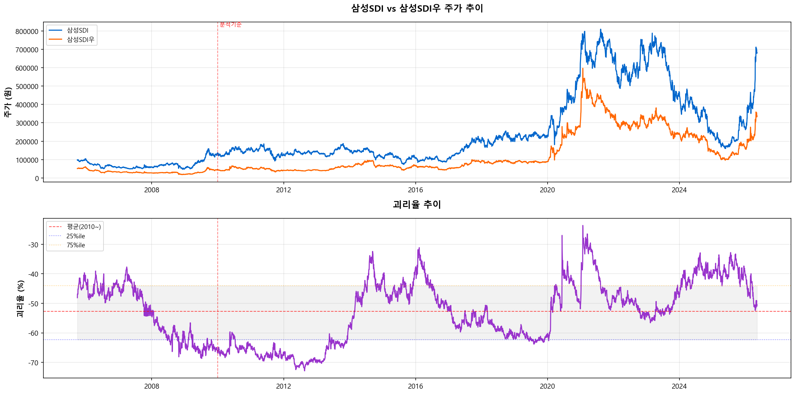

---

## 📌 LG전자 (066570) vs LG전자우 (066575)

**분석 기간**: 2010-01-04 ~ 2026-05-11 (4,021일)
**전체 데이터**: 2005-09-29 ~ 2026-05-11 (5,091일) — 2010년 이전은 참고용

### 현재 상황

| 항목 | 값 |
|:----:|:---|
| LG전자 | 157,200원 |
| LG전자우 | 66,900원 |
| **현재 괴리율** | **-57.44%** |
| 우선주 할인율 | 57.44% |
| 역사적 위치 | 하위 54.8% |
| Z-Score | 0.39σ |
| 종합 점수 | 10점 (±100점 만점) |
| **판정** | **⚪ 중립** |

**판정 근거:**

- ✅ 최근 30일 평균보다 1%p 이상 낮음

### 괴리율 통계 (2010년~)

| 지표 | 값 |
|:----:|:---|
| 평균 | -60.27% |
| 중간값 | -58.84% |
| 표준편차 | 7.23% |
| 최소 (우선주 최저평가) | -77.93% |
| 최대 (우선주 최고평가) | -40.47% |

| 백분위 | 괴리율 | 의미 |
|:-----:|:------:|:-----|
| 10% | -70.07% | 우선주 매우 저평가 |
| 25% | -64.95% | 우선주 저평가 |
| 50% | -58.84% | 중간값 |
| 75% | -54.55% | 우선주 고평가 |
| 90% | -51.93% | 우선주 매우 고평가 |

**📎 참고: 전체 기간 (2005-09-29~) 통계 비교**

| 지표 | 2010년 이후 | 전체 기간 |
|:----:|:----------:|:---------:|
| 평균 | -60.27% | -59.69% |
| 중간값 | -58.84% | -58.76% |
| 표준편차 | 7.23% | 7.22% |
| 최소 | -77.93% | -77.93% |
| 최대 | -40.47% | -40.47% |

### 기간별 괴리율

| 기간 | 평균 | 최소 | 최대 | 현재 대비 |
|:----:|:----:|:----:|:----:|:---------:|
| 최근 1개월 | -56.09% | -57.78% | -54.39% | -1.35%p |
| 최근 3개월 | -53.26% | -57.78% | -47.03% | -4.18%p |
| 최근 6개월 | -51.07% | -57.78% | -40.47% | -6.37%p |
| 최근 1년 | -51.49% | -57.78% | -40.47% | -5.96%p |
| 최근 3년 | -54.01% | -60.02% | -40.47% | -3.43%p |
| 최근 5년 | -56.68% | -67.74% | -40.47% | -0.76%p |

### 시장 상황별 괴리율

| 구분 | 기간 | 평균 괴리율 | 중간값 |
|:----:|:----:|:----------:|:------:|
| 상승장 | 1192일 (29.6%) | -60.94% | -59.96% |
| 하락장 | 1154일 (28.7%) | -59.97% | -58.76% |
| 중립장 | 1675일 (41.7%) | -60.00% | -57.99% |

### 역사적 극단값 (Top 5)

**🟦 우선주 최저평가 시점 (괴리율 최저)**

| 날짜 | LG전자 | LG전자우 | 괴리율 |
|:----:|--------:|----------:|:------:|
| 2012-10-25 | 66,108원 | 14,593원 | **-77.93%** |
| 2012-10-19 | 65,750원 | 14,555원 | **-77.86%** |
| 2012-10-29 | 67,092원 | 14,861원 | **-77.85%** |
| 2012-10-23 | 65,302원 | 14,478원 | **-77.83%** |
| 2012-10-26 | 65,302원 | 14,555원 | **-77.71%** |

**🟥 보통주 최저평가 시점 (괴리율 최고)**

| 날짜 | LG전자 | LG전자우 | 괴리율 |
|:----:|--------:|----------:|:------:|
| 2025-11-07 | 87,630원 | 52,167원 | **-40.47%** |
| 2025-11-06 | 91,004원 | 52,854원 | **-41.92%** |
| 2025-11-10 | 88,920원 | 51,282원 | **-42.33%** |
| 2025-11-13 | 91,798원 | 52,363원 | **-42.96%** |
| 2025-11-11 | 89,912원 | 51,184원 | **-43.07%** |

### 차트

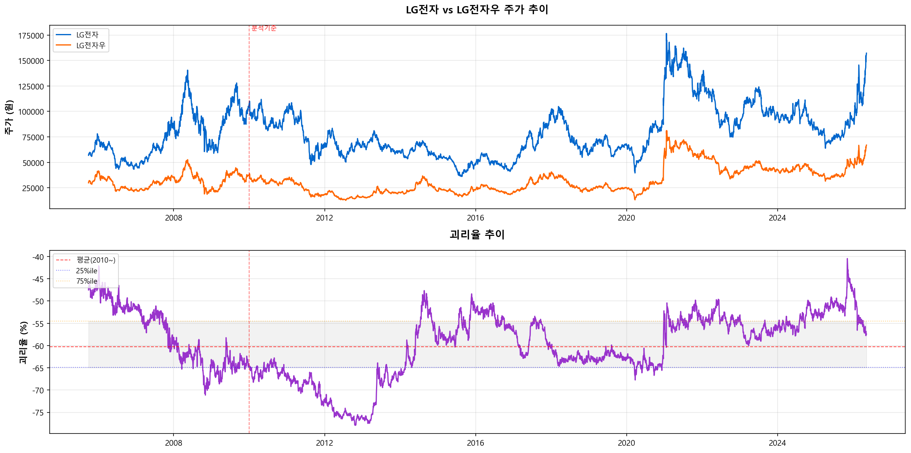

---

## 📌 삼성화재 (000810) vs 삼성화재우 (000815)

**분석 기간**: 2010-01-04 ~ 2026-05-11 (4,021일)
**전체 데이터**: 2005-09-29 ~ 2026-05-11 (5,091일) — 2010년 이전은 참고용

### 현재 상황

| 항목 | 값 |
|:----:|:---|
| 삼성화재 | 506,000원 |
| 삼성화재우 | 378,500원 |
| **현재 괴리율** | **-25.20%** |
| 우선주 할인율 | 25.20% |
| 역사적 위치 | 하위 89.9% |
| Z-Score | 1.12σ |
| 종합 점수 | -35점 (±100점 만점) |
| **판정** | **🟥 보통주 매수** |

**판정 근거:**

- ❌ 역사적 상위 25% (우선주 고평가)
- ❌ 평균 대비 1.0σ 이상 높음
- ✅ 최근 30일 평균보다 1%p 이상 낮음

### 괴리율 통계 (2010년~)

| 지표 | 값 |
|:----:|:---|
| 평균 | -43.43% |
| 중간값 | -41.21% |
| 표준편차 | 16.24% |
| 최소 (우선주 최저평가) | -75.65% |
| 최대 (우선주 최고평가) | -14.33% |

| 백분위 | 괴리율 | 의미 |
|:-----:|:------:|:-----|
| 10% | -70.46% | 우선주 매우 저평가 |
| 25% | -52.98% | 우선주 저평가 |
| 50% | -41.21% | 중간값 |
| 75% | -28.68% | 우선주 고평가 |
| 90% | -25.17% | 우선주 매우 고평가 |

**📎 참고: 전체 기간 (2005-09-29~) 통계 비교**

| 지표 | 2010년 이후 | 전체 기간 |
|:----:|:----------:|:---------:|
| 평균 | -43.43% | -48.41% |
| 중간값 | -41.21% | -44.84% |
| 표준편차 | 16.24% | 17.53% |
| 최소 | -75.65% | -80.28% |
| 최대 | -14.33% | -14.33% |

### 기간별 괴리율

| 기간 | 평균 | 최소 | 최대 | 현재 대비 |
|:----:|:----:|:----:|:----:|:---------:|
| 최근 1개월 | -20.31% | -25.20% | -14.33% | -4.89%p |
| 최근 3개월 | -22.36% | -27.52% | -14.33% | -2.84%p |
| 최근 6개월 | -23.91% | -40.46% | -14.33% | -1.29%p |
| 최근 1년 | -25.01% | -40.46% | -14.33% | -0.18%p |
| 최근 3년 | -26.08% | -40.46% | -14.33% | +0.88%p |
| 최근 5년 | -29.40% | -46.30% | -14.33% | +4.20%p |

### 시장 상황별 괴리율

| 구분 | 기간 | 평균 괴리율 | 중간값 |
|:----:|:----:|:----------:|:------:|
| 상승장 | 842일 (20.9%) | -41.32% | -35.98% |
| 하락장 | 527일 (13.1%) | -43.42% | -38.19% |
| 중립장 | 2652일 (66.0%) | -44.10% | -42.25% |

### 역사적 극단값 (Top 5)

**🟦 우선주 최저평가 시점 (괴리율 최저)**

| 날짜 | 삼성화재 | 삼성화재우 | 괴리율 |
|:----:|--------:|----------:|:------:|
| 2011-10-25 | 137,503원 | 33,479원 | **-75.65%** |
| 2011-10-31 | 141,059원 | 34,360원 | **-75.64%** |
| 2011-11-01 | 141,948원 | 34,592원 | **-75.63%** |
| 2012-06-01 | 130,266원 | 31,975원 | **-75.45%** |
| 2012-05-14 | 138,106원 | 33,922원 | **-75.44%** |

**🟥 보통주 최저평가 시점 (괴리율 최고)**

| 날짜 | 삼성화재 | 삼성화재우 | 괴리율 |
|:----:|--------:|----------:|:------:|
| 2026-03-27 | 443,000원 | 379,500원 | **-14.33%** |
| 2026-03-26 | 453,000원 | 377,500원 | **-16.67%** |
| 2026-03-23 | 437,373원 | 361,585원 | **-17.33%** |
| 2026-03-20 | 455,617원 | 375,858원 | **-17.51%** |
| 2026-03-30 | 445,500원 | 367,000원 | **-17.62%** |

### 차트

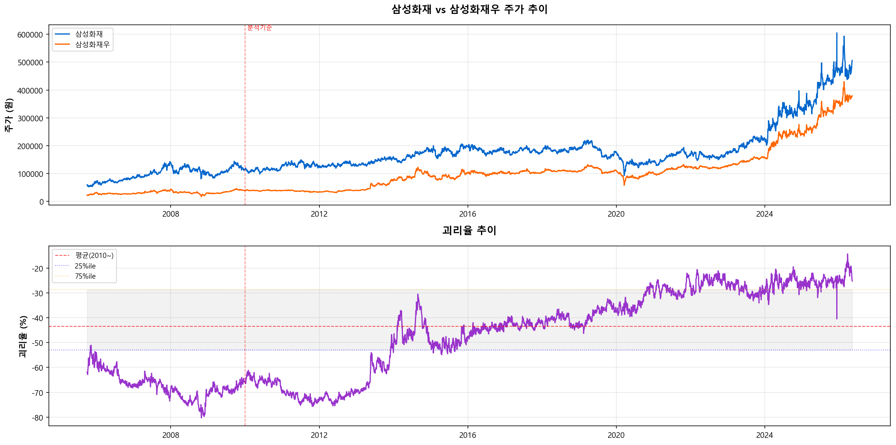

---

## 📌 S-Oil (010950) vs S-Oil우 (010955)

**분석 기간**: 2010-01-04 ~ 2026-05-11 (4,021일)
**전체 데이터**: 2000-01-04 ~ 2026-05-11 (6,588일) — 2010년 이전은 참고용

### 현재 상황

| 항목 | 값 |
|:----:|:---|
| S-Oil | 110,900원 |
| S-Oil우 | 52,100원 |
| **현재 괴리율** | **-53.02%** |
| 우선주 할인율 | 53.02% |
| 역사적 위치 | 하위 8.1% |
| Z-Score | -1.39σ |
| 종합 점수 | 60점 (±100점 만점) |
| **판정** | **🟦 우선주 강력 매수** |

**판정 근거:**

- ✅ 역사적 하위 10% (우선주 매우 저평가)
- ✅ 평균 대비 1.0σ 이상 낮음

### 괴리율 통계 (2010년~)

| 지표 | 값 |
|:----:|:---|
| 평균 | -40.18% |
| 중간값 | -40.32% |
| 표준편차 | 9.26% |
| 최소 (우선주 최저평가) | -64.19% |
| 최대 (우선주 최고평가) | -17.62% |

| 백분위 | 괴리율 | 의미 |
|:-----:|:------:|:-----|
| 10% | -51.05% | 우선주 매우 저평가 |
| 25% | -46.51% | 우선주 저평가 |
| 50% | -40.32% | 중간값 |
| 75% | -33.52% | 우선주 고평가 |
| 90% | -27.66% | 우선주 매우 고평가 |

**📎 참고: 전체 기간 (2000-01-04~) 통계 비교**

| 지표 | 2010년 이후 | 전체 기간 |
|:----:|:----------:|:---------:|
| 평균 | -40.18% | -41.23% |
| 중간값 | -40.32% | -41.21% |
| 표준편차 | 9.26% | 9.15% |
| 최소 | -64.19% | -67.72% |
| 최대 | -17.62% | 34.47% |

### 기간별 괴리율

| 기간 | 평균 | 최소 | 최대 | 현재 대비 |
|:----:|:----:|:----:|:----:|:---------:|
| 최근 1개월 | -52.15% | -54.35% | -50.66% | -0.87%p |
| 최근 3개월 | -48.89% | -56.50% | -40.54% | -4.13%p |
| 최근 6개월 | -43.75% | -56.50% | -33.69% | -9.27%p |
| 최근 1년 | -38.28% | -56.50% | -25.37% | -14.74%p |
| 최근 3년 | -36.19% | -56.50% | -24.34% | -16.83%p |
| 최근 5년 | -39.09% | -56.50% | -24.34% | -13.93%p |

### 시장 상황별 괴리율

| 구분 | 기간 | 평균 괴리율 | 중간값 |
|:----:|:----:|:----------:|:------:|
| 상승장 | 1340일 (33.3%) | -43.66% | -44.85% |
| 하락장 | 1109일 (27.6%) | -37.81% | -36.78% |
| 중립장 | 1572일 (39.1%) | -38.89% | -38.61% |

### 역사적 극단값 (Top 5)

**🟦 우선주 최저평가 시점 (괴리율 최저)**

| 날짜 | S-Oil | S-Oil우 | 괴리율 |
|:----:|--------:|----------:|:------:|
| 2011-07-27 | 110,438원 | 39,549원 | **-64.19%** |
| 2011-07-28 | 109,748원 | 39,436원 | **-64.07%** |
| 2011-07-26 | 109,748원 | 39,606원 | **-63.91%** |
| 2011-08-03 | 106,642원 | 38,811원 | **-63.61%** |
| 2011-08-01 | 108,022원 | 39,322원 | **-63.60%** |

**🟥 보통주 최저평가 시점 (괴리율 최고)**

| 날짜 | S-Oil | S-Oil우 | 괴리율 |
|:----:|--------:|----------:|:------:|
| 2018-07-03 | 89,651원 | 73,855원 | **-17.62%** |
| 2018-05-11 | 92,672원 | 76,083원 | **-17.90%** |
| 2018-05-14 | 92,672원 | 76,083원 | **-17.90%** |
| 2018-05-10 | 92,672원 | 76,002원 | **-17.99%** |
| 2018-05-30 | 92,672원 | 76,002원 | **-17.99%** |

### 차트

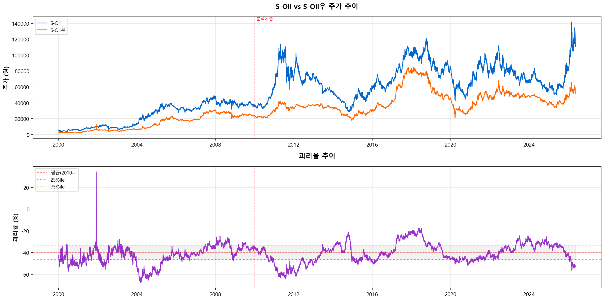

---

## 📌 대한항공 (003490) vs 대한항공우 (003495)

**분석 기간**: 2010-01-04 ~ 2026-05-11 (4,021일)
**전체 데이터**: 2005-09-29 ~ 2026-05-11 (5,091일) — 2010년 이전은 참고용

### 현재 상황

| 항목 | 값 |
|:----:|:---|
| 대한항공 | 25,650원 |
| 대한항공우 | 23,250원 |
| **현재 괴리율** | **-9.36%** |
| 우선주 할인율 | 9.36% |
| 역사적 위치 | 하위 59.4% |
| Z-Score | 0.22σ |
| 종합 점수 | 10점 (±100점 만점) |
| **판정** | **⚪ 중립** |

**판정 근거:**

- ✅ 최근 30일 평균보다 1%p 이상 낮음

### 괴리율 통계 (2010년~)

| 지표 | 값 |
|:----:|:---|
| 평균 | -17.07% |
| 중간값 | -31.50% |
| 표준편차 | 34.33% |
| 최소 (우선주 최저평가) | -65.08% |
| 최대 (우선주 최고평가) | 140.76% |

| 백분위 | 괴리율 | 의미 |
|:-----:|:------:|:-----|
| 10% | -57.11% | 우선주 매우 저평가 |
| 25% | -42.41% | 우선주 저평가 |
| 50% | -31.50% | 중간값 |
| 75% | 9.95% | 우선주 고평가 |
| 90% | 29.67% | 우선주 매우 고평가 |

**📎 참고: 전체 기간 (2005-09-29~) 통계 비교**

| 지표 | 2010년 이후 | 전체 기간 |
|:----:|:----------:|:---------:|
| 평균 | -17.07% | -21.95% |
| 중간값 | -31.50% | -33.29% |
| 표준편차 | 34.33% | 32.46% |
| 최소 | -65.08% | -65.08% |
| 최대 | 140.76% | 140.76% |

### 기간별 괴리율

| 기간 | 평균 | 최소 | 최대 | 현재 대비 |
|:----:|:----:|:----:|:----:|:---------:|
| 최근 1개월 | -4.72% | -11.83% | 0.22% | -4.63%p |
| 최근 3개월 | -2.79% | -12.38% | 10.94% | -6.57%p |
| 최근 6개월 | 0.65% | -12.38% | 12.48% | -10.00%p |
| 최근 1년 | -0.34% | -12.38% | 22.18% | -9.02%p |
| 최근 3년 | 11.39% | -12.38% | 36.29% | -20.75%p |
| 최근 5년 | 14.85% | -41.64% | 140.76% | -24.21%p |

### 시장 상황별 괴리율

| 구분 | 기간 | 평균 괴리율 | 중간값 |
|:----:|:----:|:----------:|:------:|
| 상승장 | 1086일 (27.0%) | -17.75% | -36.80% |
| 하락장 | 1102일 (27.4%) | -22.31% | -31.65% |
| 중립장 | 1833일 (45.6%) | -13.52% | -8.35% |

### 역사적 극단값 (Top 5)

**🟦 우선주 최저평가 시점 (괴리율 최저)**

| 날짜 | 대한항공 | 대한항공우 | 괴리율 |
|:----:|--------:|----------:|:------:|
| 2012-07-06 | 30,430원 | 10,627원 | **-65.08%** |
| 2012-07-10 | 30,253원 | 10,585원 | **-65.01%** |
| 2012-07-05 | 30,371원 | 10,627원 | **-65.01%** |
| 2012-07-11 | 29,900원 | 10,501원 | **-64.88%** |
| 2012-07-19 | 30,488원 | 10,754원 | **-64.73%** |

**🟥 보통주 최저평가 시점 (괴리율 최고)**

| 날짜 | 대한항공 | 대한항공우 | 괴리율 |
|:----:|--------:|----------:|:------:|
| 2020-12-02 | 18,233원 | 43,899원 | **140.76%** |
| 2020-12-03 | 18,374원 | 43,327원 | **135.80%** |
| 2020-12-01 | 18,586원 | 43,459원 | **133.83%** |
| 2020-12-04 | 18,445원 | 41,962원 | **127.50%** |
| 2020-12-08 | 18,833원 | 42,270원 | **124.45%** |

### 차트

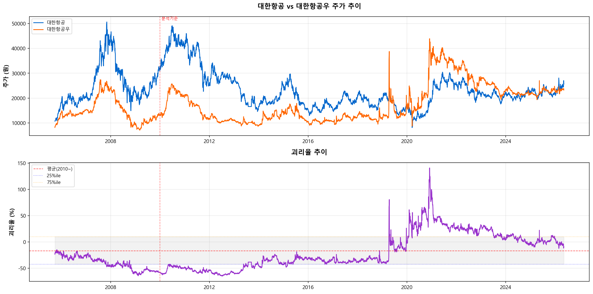

---

## 📌 유한양행 (000100) vs 유한양행우 (000105)

**분석 기간**: 2010-01-04 ~ 2026-05-11 (4,021일)
**전체 데이터**: 2005-09-29 ~ 2026-05-11 (5,091일) — 2010년 이전은 참고용

### 현재 상황

| 항목 | 값 |
|:----:|:---|
| 유한양행 | 84,700원 |
| 유한양행우 | 71,300원 |
| **현재 괴리율** | **-15.82%** |
| 우선주 할인율 | 15.82% |
| 역사적 위치 | 하위 21.4% |
| Z-Score | -0.94σ |
| 종합 점수 | 35점 (±100점 만점) |
| **판정** | **🟦 우선주 매수** |

**판정 근거:**

- ✅ 역사적 하위 25% (우선주 저평가)
- ✅ 최근 30일 평균보다 1%p 이상 낮음

### 괴리율 통계 (2010년~)

| 지표 | 값 |
|:----:|:---|
| 평균 | 1.28% |
| 중간값 | 4.88% |
| 표준편차 | 18.14% |
| 최소 (우선주 최저평가) | -35.71% |
| 최대 (우선주 최고평가) | 57.25% |

| 백분위 | 괴리율 | 의미 |
|:-----:|:------:|:-----|
| 10% | -24.19% | 우선주 매우 저평가 |
| 25% | -13.29% | 우선주 저평가 |
| 50% | 4.88% | 중간값 |
| 75% | 14.91% | 우선주 고평가 |
| 90% | 23.68% | 우선주 매우 고평가 |

**📎 참고: 전체 기간 (2005-09-29~) 통계 비교**

| 지표 | 2010년 이후 | 전체 기간 |
|:----:|:----------:|:---------:|
| 평균 | 1.28% | 7.80% |
| 중간값 | 4.88% | 8.57% |
| 표준편차 | 18.14% | 23.67% |
| 최소 | -35.71% | -35.71% |
| 최대 | 57.25% | 92.74% |

### 기간별 괴리율

| 기간 | 평균 | 최소 | 최대 | 현재 대비 |
|:----:|:----:|:----:|:----:|:---------:|
| 최근 1개월 | -12.74% | -16.80% | -8.06% | -3.08%p |
| 최근 3개월 | -11.96% | -16.80% | -8.06% | -3.86%p |
| 최근 6개월 | -11.33% | -16.80% | -7.21% | -4.49%p |
| 최근 1년 | -10.73% | -16.80% | -4.80% | -5.09%p |
| 최근 3년 | -3.96% | -23.18% | 45.03% | -11.86%p |
| 최근 5년 | 3.94% | -23.18% | 55.76% | -19.76%p |

### 시장 상황별 괴리율

| 구분 | 기간 | 평균 괴리율 | 중간값 |
|:----:|:----:|:----------:|:------:|
| 상승장 | 1075일 (26.7%) | -2.68% | -4.17% |
| 하락장 | 763일 (19.0%) | 6.39% | 7.40% |
| 중립장 | 2183일 (54.3%) | 1.44% | 6.52% |

### 역사적 극단값 (Top 5)

**🟦 우선주 최저평가 시점 (괴리율 최저)**

| 날짜 | 유한양행 | 유한양행우 | 괴리율 |
|:----:|--------:|----------:|:------:|
| 2013-04-29 | 26,360원 | 16,947원 | **-35.71%** |
| 2015-05-11 | 33,180원 | 21,368원 | **-35.60%** |
| 2015-05-08 | 32,741원 | 21,185원 | **-35.29%** |
| 2013-04-30 | 25,867원 | 16,823원 | **-34.96%** |
| 2015-05-07 | 30,984원 | 20,363원 | **-34.28%** |

**🟥 보통주 최저평가 시점 (괴리율 최고)**

| 날짜 | 유한양행 | 유한양행우 | 괴리율 |
|:----:|--------:|----------:|:------:|
| 2011-08-24 | 13,751원 | 21,624원 | **57.25%** |
| 2020-07-23 | 42,343원 | 65,955원 | **55.76%** |
| 2020-07-27 | 45,045원 | 69,517원 | **54.33%** |
| 2011-02-14 | 17,083원 | 26,000원 | **52.20%** |
| 2011-08-18 | 14,721원 | 22,139원 | **50.39%** |

### 차트

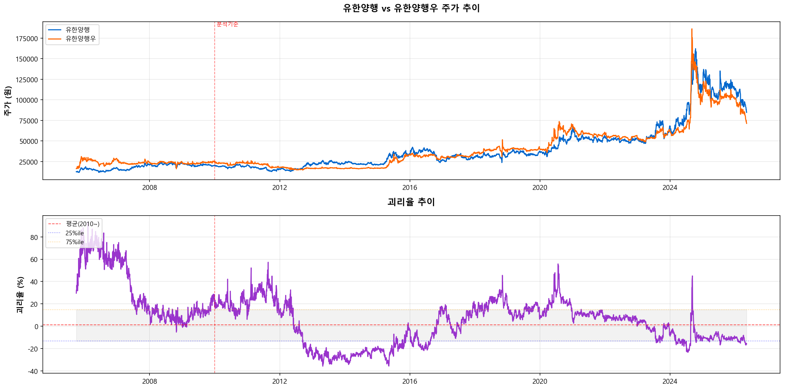

---

## 📌 LG생활건강 (051900) vs LG생활건강우 (051905)

**분석 기간**: 2010-01-04 ~ 2026-05-11 (4,021일)
**전체 데이터**: 2005-09-29 ~ 2026-05-11 (5,091일) — 2010년 이전은 참고용

### 현재 상황

| 항목 | 값 |
|:----:|:---|
| LG생활건강 | 268,000원 |
| LG생활건강우 | 113,400원 |
| **현재 괴리율** | **-57.69%** |
| 우선주 할인율 | 57.69% |
| 역사적 위치 | 하위 46.4% |
| Z-Score | 0.04σ |
| 종합 점수 | 10점 (±100점 만점) |
| **판정** | **⚪ 중립** |

**판정 근거:**

- ✅ 최근 30일 평균보다 1%p 이상 낮음

### 괴리율 통계 (2010년~)

| 지표 | 값 |
|:----:|:---|
| 평균 | -58.11% |
| 중간값 | -57.17% |
| 표준편차 | 11.78% |
| 최소 (우선주 최저평가) | -82.82% |
| 최대 (우선주 최고평가) | -35.07% |

| 백분위 | 괴리율 | 의미 |
|:-----:|:------:|:-----|
| 10% | -78.10% | 우선주 매우 저평가 |
| 25% | -62.36% | 우선주 저평가 |
| 50% | -57.17% | 중간값 |
| 75% | -48.54% | 우선주 고평가 |
| 90% | -43.99% | 우선주 매우 고평가 |

**📎 참고: 전체 기간 (2005-09-29~) 통계 비교**

| 지표 | 2010년 이후 | 전체 기간 |
|:----:|:----------:|:---------:|
| 평균 | -58.11% | -60.65% |
| 중간값 | -57.17% | -58.63% |
| 표준편차 | 11.78% | 12.16% |
| 최소 | -82.82% | -86.83% |
| 최대 | -35.07% | -35.07% |

### 기간별 괴리율

| 기간 | 평균 | 최소 | 최대 | 현재 대비 |
|:----:|:----:|:----:|:----:|:---------:|
| 최근 1개월 | -56.18% | -57.69% | -54.77% | -1.50%p |
| 최근 3개월 | -56.88% | -59.21% | -53.15% | -0.81%p |
| 최근 6개월 | -58.05% | -61.37% | -53.15% | +0.36%p |
| 최근 1년 | -59.14% | -63.90% | -53.15% | +1.46%p |
| 최근 3년 | -56.35% | -63.90% | -40.73% | -1.33%p |
| 최근 5년 | -53.86% | -63.90% | -39.62% | -3.83%p |

### 시장 상황별 괴리율

| 구분 | 기간 | 평균 괴리율 | 중간값 |
|:----:|:----:|:----------:|:------:|
| 상승장 | 1084일 (27.0%) | -59.47% | -57.39% |
| 하락장 | 1055일 (26.2%) | -54.72% | -55.88% |
| 중립장 | 1882일 (46.8%) | -59.24% | -57.88% |

### 역사적 극단값 (Top 5)

**🟦 우선주 최저평가 시점 (괴리율 최저)**

| 날짜 | LG생활건강 | LG생활건강우 | 괴리율 |
|:----:|--------:|----------:|:------:|
| 2011-03-31 | 366,198원 | 62,906원 | **-82.82%** |
| 2011-03-30 | 361,303원 | 62,216원 | **-82.78%** |
| 2011-07-12 | 424,932원 | 73,493원 | **-82.70%** |
| 2011-07-11 | 431,606원 | 74,874원 | **-82.65%** |
| 2011-08-18 | 444,955원 | 77,866원 | **-82.50%** |

**🟥 보통주 최저평가 시점 (괴리율 최고)**

| 날짜 | LG생활건강 | LG생활건강우 | 괴리율 |
|:----:|--------:|----------:|:------:|
| 2018-10-31 | 974,804원 | 632,947원 | **-35.07%** |
| 2017-09-25 | 788,546원 | 489,741원 | **-37.89%** |
| 2017-09-26 | 788,546원 | 489,741원 | **-37.89%** |
| 2017-08-08 | 897,886원 | 553,732원 | **-38.33%** |
| 2017-09-13 | 821,904원 | 505,952원 | **-38.44%** |

### 차트

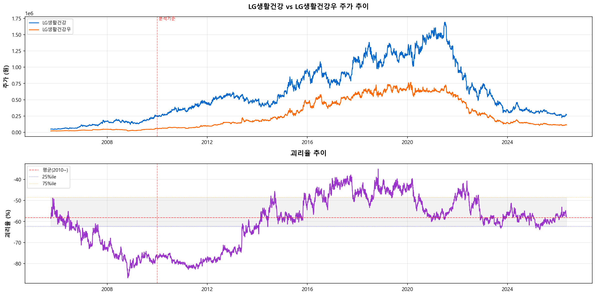

---

## 📌 CJ제일제당 (097950) vs CJ제일제당우 (097955)

**분석 기간**: 2010-01-04 ~ 2026-05-11 (4,021일)
**전체 데이터**: 2007-09-28 ~ 2026-05-11 (4,594일) — 2010년 이전은 참고용

### 현재 상황

| 항목 | 값 |
|:----:|:---|
| CJ제일제당 | 225,000원 |
| CJ제일제당우 | 134,700원 |
| **현재 괴리율** | **-40.13%** |
| 우선주 할인율 | 40.13% |
| 역사적 위치 | 하위 97.2% |
| Z-Score | 1.95σ |
| 종합 점수 | -80점 (±100점 만점) |
| **판정** | **🟥 보통주 강력 매수** |

**판정 근거:**

- ❌ 역사적 상위 10% (우선주 매우 고평가)
- ❌ 평균 대비 1.5σ 이상 높음
- ❌ 최근 30일 평균보다 1%p 이상 높음

### 괴리율 통계 (2010년~)

| 지표 | 값 |
|:----:|:---|
| 평균 | -62.46% |
| 중간값 | -60.91% |
| 표준편차 | 11.42% |
| 최소 (우선주 최저평가) | -85.09% |
| 최대 (우선주 최고평가) | -32.37% |

| 백분위 | 괴리율 | 의미 |
|:-----:|:------:|:-----|
| 10% | -81.20% | 우선주 매우 저평가 |
| 25% | -69.78% | 우선주 저평가 |
| 50% | -60.91% | 중간값 |
| 75% | -56.03% | 우선주 고평가 |
| 90% | -49.32% | 우선주 매우 고평가 |

**📎 참고: 전체 기간 (2007-09-28~) 통계 비교**

| 지표 | 2010년 이후 | 전체 기간 |
|:----:|:----------:|:---------:|
| 평균 | -62.46% | -64.30% |
| 중간값 | -60.91% | -62.18% |
| 표준편차 | 11.42% | 11.77% |
| 최소 | -85.09% | -85.09% |
| 최대 | -32.37% | -32.37% |

### 기간별 괴리율

| 기간 | 평균 | 최소 | 최대 | 현재 대비 |
|:----:|:----:|:----:|:----:|:---------:|
| 최근 1개월 | -41.57% | -43.77% | -39.35% | +1.44%p |
| 최근 3개월 | -37.48% | -43.77% | -32.37% | -2.65%p |
| 최근 6개월 | -38.27% | -43.91% | -32.37% | -1.86%p |
| 최근 1년 | -42.52% | -53.68% | -32.37% | +2.39%p |
| 최근 3년 | -52.70% | -62.92% | -32.37% | +12.57%p |
| 최근 5년 | -56.10% | -68.37% | -32.37% | +15.97%p |

### 시장 상황별 괴리율

| 구분 | 기간 | 평균 괴리율 | 중간값 |
|:----:|:----:|:----------:|:------:|
| 상승장 | 947일 (23.6%) | -64.82% | -61.94% |
| 하락장 | 831일 (20.7%) | -59.62% | -57.67% |
| 중립장 | 2243일 (55.8%) | -62.51% | -61.42% |

### 역사적 극단값 (Top 5)

**🟦 우선주 최저평가 시점 (괴리율 최저)**

| 날짜 | CJ제일제당 | CJ제일제당우 | 괴리율 |
|:----:|--------:|----------:|:------:|
| 2012-05-09 | 315,982원 | 47,119원 | **-85.09%** |
| 2012-04-30 | 315,560원 | 47,187원 | **-85.05%** |
| 2012-05-10 | 313,029원 | 47,051원 | **-84.97%** |
| 2012-05-11 | 310,919원 | 46,778원 | **-84.95%** |
| 2012-05-04 | 312,185원 | 46,983원 | **-84.95%** |

**🟥 보통주 최저평가 시점 (괴리율 최고)**

| 날짜 | CJ제일제당 | CJ제일제당우 | 괴리율 |
|:----:|--------:|----------:|:------:|
| 2026-03-04 | 190,300원 | 128,700원 | **-32.37%** |
| 2026-01-07 | 201,613원 | 135,802원 | **-32.64%** |
| 2026-03-06 | 195,900원 | 131,300원 | **-32.98%** |
| 2025-12-11 | 204,096원 | 136,693원 | **-33.03%** |
| 2026-01-06 | 204,096원 | 136,594원 | **-33.07%** |

### 차트

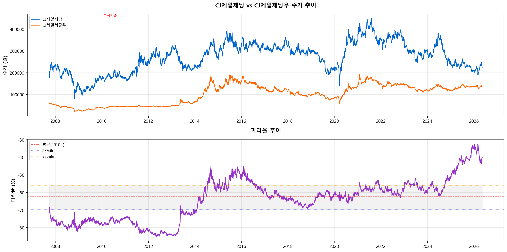

---

## 📌 현대건설 (000720) vs 현대건설우 (000725)

**분석 기간**: 2010-01-04 ~ 2026-05-11 (4,021일)
**전체 데이터**: 2005-09-29 ~ 2026-05-11 (5,091일) — 2010년 이전은 참고용

### 현재 상황

| 항목 | 값 |
|:----:|:---|
| 현대건설 | 166,000원 |
| 현대건설우 | 70,600원 |
| **현재 괴리율** | **-57.47%** |
| 우선주 할인율 | 57.47% |
| 역사적 위치 | 하위 1.9% |
| Z-Score | -0.89σ |
| 종합 점수 | 50점 (±100점 만점) |
| **판정** | **🟦 우선주 강력 매수** |

**판정 근거:**

- ✅ 역사적 하위 10% (우선주 매우 저평가)
- ✅ 최근 30일 평균보다 1%p 이상 낮음

### 괴리율 통계 (2010년~)

| 지표 | 값 |
|:----:|:---|
| 평균 | 68.09% |
| 중간값 | 30.66% |
| 표준편차 | 141.57% |
| 최소 (우선주 최저평가) | -61.19% |
| 최대 (우선주 최고평가) | 1296.81% |

| 백분위 | 괴리율 | 의미 |
|:-----:|:------:|:-----|
| 10% | -49.02% | 우선주 매우 저평가 |
| 25% | -34.64% | 우선주 저평가 |
| 50% | 30.66% | 중간값 |
| 75% | 72.11% | 우선주 고평가 |
| 90% | 271.85% | 우선주 매우 고평가 |

**📎 참고: 전체 기간 (2005-09-29~) 통계 비교**

| 지표 | 2010년 이후 | 전체 기간 |
|:----:|:----------:|:---------:|
| 평균 | 68.09% | 43.97% |
| 중간값 | 30.66% | -15.10% |
| 표준편차 | 141.57% | 134.29% |
| 최소 | -61.19% | -61.19% |
| 최대 | 1296.81% | 1296.81% |

### 기간별 괴리율

| 기간 | 평균 | 최소 | 최대 | 현재 대비 |
|:----:|:----:|:----:|:----:|:---------:|
| 최근 1개월 | -55.61% | -57.47% | -52.78% | -1.86%p |
| 최근 3개월 | -46.96% | -57.47% | -20.04% | -10.51%p |
| 최근 6개월 | -30.91% | -57.47% | -7.46% | -26.56%p |
| 최근 1년 | 0.64% | -57.47% | 78.37% | -58.11%p |
| 최근 3년 | 36.80% | -57.47% | 104.03% | -94.27%p |
| 최근 5년 | 146.36% | -57.47% | 1296.81% | -203.83%p |

### 시장 상황별 괴리율

| 구분 | 기간 | 평균 괴리율 | 중간값 |
|:----:|:----:|:----------:|:------:|
| 상승장 | 1193일 (29.7%) | 62.09% | 14.75% |
| 하락장 | 1171일 (29.1%) | 73.03% | 46.17% |
| 중립장 | 1657일 (41.2%) | 68.93% | 38.60% |

### 역사적 극단값 (Top 5)

**🟦 우선주 최저평가 시점 (괴리율 최저)**

| 날짜 | 현대건설 | 현대건설우 | 괴리율 |
|:----:|--------:|----------:|:------:|
| 2012-12-20 | 60,505원 | 23,481원 | **-61.19%** |
| 2013-01-29 | 60,943원 | 23,946원 | **-60.71%** |
| 2013-01-30 | 60,859원 | 23,946원 | **-60.65%** |
| 2013-03-08 | 56,578원 | 22,393원 | **-60.42%** |
| 2012-12-17 | 59,005원 | 23,354원 | **-60.42%** |

**🟥 보통주 최저평가 시점 (괴리율 최고)**

| 날짜 | 현대건설 | 현대건설우 | 괴리율 |
|:----:|--------:|----------:|:------:|
| 2020-06-25 | 30,599원 | 427,413원 | **1296.81%** |
| 2020-06-24 | 31,699원 | 427,413원 | **1248.36%** |
| 2020-06-23 | 31,470원 | 328,959원 | **945.32%** |
| 2020-06-26 | 30,737원 | 299,562원 | **874.61%** |
| 2020-07-08 | 31,561원 | 288,364원 | **813.66%** |

### 차트

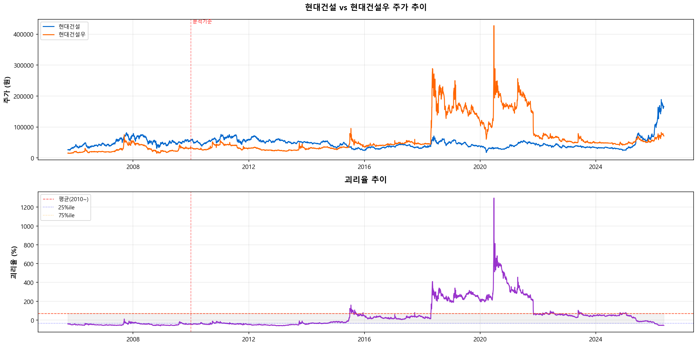

---

## 📌 금호석유 (011780) vs 금호석유우 (011785)

**분석 기간**: 2010-01-04 ~ 2026-05-11 (4,021일)
**전체 데이터**: 2005-09-29 ~ 2026-05-11 (5,091일) — 2010년 이전은 참고용

### 현재 상황

| 항목 | 값 |
|:----:|:---|
| 금호석유 | 148,400원 |
| 금호석유우 | 61,500원 |
| **현재 괴리율** | **-58.56%** |
| 우선주 할인율 | 58.56% |
| 역사적 위치 | 하위 65.5% |
| Z-Score | 0.47σ |
| 종합 점수 | 10점 (±100점 만점) |
| **판정** | **⚪ 중립** |

**판정 근거:**

- ✅ 최근 30일 평균보다 1%p 이상 낮음

### 괴리율 통계 (2010년~)

| 지표 | 값 |
|:----:|:---|
| 평균 | -64.72% |
| 중간값 | -66.33% |
| 표준편차 | 13.04% |
| 최소 (우선주 최저평가) | -87.43% |
| 최대 (우선주 최고평가) | -32.47% |

| 백분위 | 괴리율 | 의미 |
|:-----:|:------:|:-----|
| 10% | -82.84% | 우선주 매우 저평가 |
| 25% | -72.87% | 우선주 저평가 |
| 50% | -66.33% | 중간값 |
| 75% | -53.33% | 우선주 고평가 |
| 90% | -48.27% | 우선주 매우 고평가 |

**📎 참고: 전체 기간 (2005-09-29~) 통계 비교**

| 지표 | 2010년 이후 | 전체 기간 |
|:----:|:----------:|:---------:|
| 평균 | -64.72% | -66.99% |
| 중간값 | -66.33% | -69.41% |
| 표준편차 | 13.04% | 12.59% |
| 최소 | -87.43% | -87.43% |
| 최대 | -32.47% | -32.47% |

### 기간별 괴리율

| 기간 | 평균 | 최소 | 최대 | 현재 대비 |
|:----:|:----:|:----:|:----:|:---------:|
| 최근 1개월 | -55.56% | -58.56% | -52.29% | -2.99%p |
| 최근 3개월 | -53.01% | -58.56% | -48.81% | -5.55%p |
| 최근 6개월 | -50.65% | -58.56% | -45.74% | -7.90%p |
| 최근 1년 | -51.18% | -58.56% | -45.62% | -7.38%p |
| 최근 3년 | -49.43% | -59.15% | -32.47% | -9.13%p |
| 최근 5년 | -54.91% | -71.71% | -32.47% | -3.65%p |

### 시장 상황별 괴리율

| 구분 | 기간 | 평균 괴리율 | 중간값 |
|:----:|:----:|:----------:|:------:|
| 상승장 | 1329일 (33.1%) | -68.32% | -68.08% |
| 하락장 | 1163일 (28.9%) | -62.46% | -61.30% |
| 중립장 | 1529일 (38.0%) | -63.32% | -65.79% |

### 역사적 극단값 (Top 5)

**🟦 우선주 최저평가 시점 (괴리율 최저)**

| 날짜 | 금호석유 | 금호석유우 | 괴리율 |
|:----:|--------:|----------:|:------:|
| 2011-08-23 | 127,643원 | 16,041원 | **-87.43%** |
| 2011-08-24 | 122,552원 | 15,631원 | **-87.25%** |
| 2011-10-17 | 160,009원 | 20,631원 | **-87.11%** |
| 2011-10-18 | 157,099원 | 20,438원 | **-86.99%** |
| 2011-08-25 | 122,552원 | 15,945원 | **-86.99%** |

**🟥 보통주 최저평가 시점 (괴리율 최고)**

| 날짜 | 금호석유 | 금호석유우 | 괴리율 |
|:----:|--------:|----------:|:------:|
| 2022-09-02 | 113,287원 | 76,504원 | **-32.47%** |
| 2022-09-07 | 112,380원 | 75,836원 | **-32.52%** |
| 2022-09-05 | 114,193원 | 76,671원 | **-32.86%** |
| 2022-09-27 | 104,224원 | 69,913원 | **-32.92%** |
| 2022-09-06 | 114,646원 | 76,837원 | **-32.98%** |

### 차트

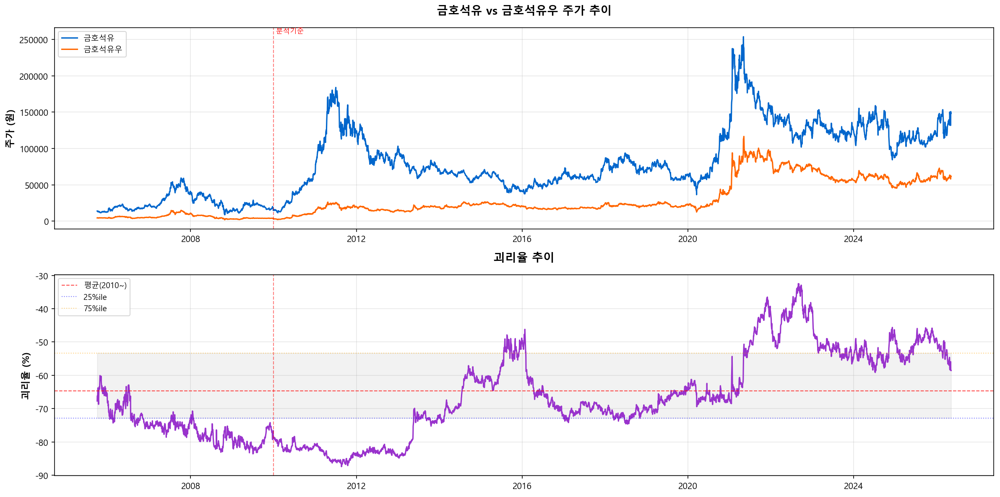

---

## 📌 코오롱인더 (120110) vs 코오롱인더우 (120115)

**분석 기간**: 2010-02-01 ~ 2026-05-11 (4,001일)

### 현재 상황

| 항목 | 값 |
|:----:|:---|
| 코오롱인더 | 88,500원 |
| 코오롱인더우 | 29,200원 |
| **현재 괴리율** | **-67.01%** |
| 우선주 할인율 | 67.01% |
| 역사적 위치 | 하위 32.7% |
| Z-Score | -0.35σ |
| 종합 점수 | 0점 (±100점 만점) |
| **판정** | **⚪ 중립** |

### 괴리율 통계

| 지표 | 값 |
|:----:|:---|
| 평균 | -62.69% |
| 중간값 | -64.16% |
| 표준편차 | 12.36% |
| 최소 (우선주 최저평가) | -84.10% |
| 최대 (우선주 최고평가) | -30.95% |

| 백분위 | 괴리율 | 의미 |
|:-----:|:------:|:-----|
| 10% | -79.76% | 우선주 매우 저평가 |
| 25% | -71.96% | 우선주 저평가 |
| 50% | -64.16% | 중간값 |
| 75% | -53.43% | 우선주 고평가 |
| 90% | -45.57% | 우선주 매우 고평가 |

### 기간별 괴리율

| 기간 | 평균 | 최소 | 최대 | 현재 대비 |
|:----:|:----:|:----:|:----:|:---------:|
| 최근 1개월 | -66.36% | -67.85% | -63.49% | -0.65%p |
| 최근 3개월 | -57.02% | -67.85% | -41.98% | -9.99%p |
| 최근 6개월 | -48.36% | -67.85% | -34.04% | -18.64%p |
| 최근 1년 | -43.22% | -67.85% | -30.95% | -23.79%p |
| 최근 3년 | -47.82% | -67.85% | -30.95% | -19.18%p |
| 최근 5년 | -51.93% | -67.85% | -30.95% | -15.08%p |

### 시장 상황별 괴리율

| 구분 | 기간 | 평균 괴리율 | 중간값 |
|:----:|:----:|:----------:|:------:|
| 상승장 | 1283일 (32.1%) | -64.96% | -65.94% |
| 하락장 | 1201일 (30.0%) | -61.04% | -61.83% |
| 중립장 | 1517일 (37.9%) | -62.09% | -64.23% |

### 역사적 극단값 (Top 5)

**🟦 우선주 최저평가 시점 (괴리율 최저)**

| 날짜 | 코오롱인더 | 코오롱인더우 | 괴리율 |
|:----:|--------:|----------:|:------:|
| 2011-08-18 | 87,610원 | 13,929원 | **-84.10%** |
| 2011-08-17 | 83,543원 | 13,584원 | **-83.74%** |
| 2011-08-16 | 78,738원 | 13,107원 | **-83.35%** |
| 2011-08-11 | 77,259원 | 12,921원 | **-83.28%** |
| 2011-08-09 | 73,858원 | 12,364원 | **-83.26%** |

**🟥 보통주 최저평가 시점 (괴리율 최고)**

| 날짜 | 코오롱인더 | 코오롱인더우 | 괴리율 |
|:----:|--------:|----------:|:------:|
| 2024-12-09 | 24,006원 | 16,576원 | **-30.95%** |
| 2024-12-05 | 24,797원 | 17,018원 | **-31.37%** |
| 2024-12-06 | 24,936원 | 16,912원 | **-32.18%** |
| 2025-02-04 | 25,798원 | 17,471원 | **-32.28%** |
| 2024-12-02 | 25,495원 | 17,239원 | **-32.38%** |

### 차트

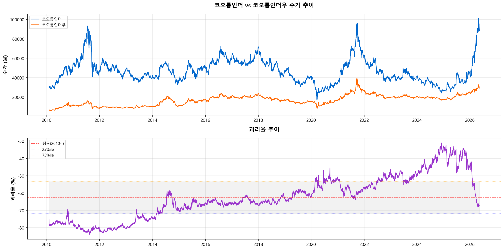

---

## 📌 코오롱 (002020) vs 코오롱우 (002025)

**분석 기간**: 2010-01-04 ~ 2026-05-11 (4,021일)
**전체 데이터**: 2005-09-29 ~ 2026-05-11 (5,091일) — 2010년 이전은 참고용

### 현재 상황

| 항목 | 값 |
|:----:|:---|
| 코오롱 | 81,150원 |
| 코오롱우 | 32,050원 |
| **현재 괴리율** | **-60.51%** |
| 우선주 할인율 | 60.51% |
| 역사적 위치 | 하위 33.6% |
| Z-Score | -0.61σ |
| 종합 점수 | 10점 (±100점 만점) |
| **판정** | **⚪ 중립** |

**판정 근거:**

- ✅ 최근 30일 평균보다 1%p 이상 낮음

### 괴리율 통계 (2010년~)

| 지표 | 값 |
|:----:|:---|
| 평균 | -50.49% |
| 중간값 | -54.09% |
| 표준편차 | 16.31% |
| 최소 (우선주 최저평가) | -78.13% |
| 최대 (우선주 최고평가) | -6.52% |

| 백분위 | 괴리율 | 의미 |
|:-----:|:------:|:-----|
| 10% | -69.23% | 우선주 매우 저평가 |
| 25% | -63.08% | 우선주 저평가 |
| 50% | -54.09% | 중간값 |
| 75% | -38.37% | 우선주 고평가 |
| 90% | -25.80% | 우선주 매우 고평가 |

**📎 참고: 전체 기간 (2005-09-29~) 통계 비교**

| 지표 | 2010년 이후 | 전체 기간 |
|:----:|:----------:|:---------:|
| 평균 | -50.49% | -52.54% |
| 중간값 | -54.09% | -55.64% |
| 표준편차 | 16.31% | 15.85% |
| 최소 | -78.13% | -80.65% |
| 최대 | -6.52% | -6.52% |

### 기간별 괴리율

| 기간 | 평균 | 최소 | 최대 | 현재 대비 |
|:----:|:----:|:----:|:----:|:---------:|
| 최근 1개월 | -54.62% | -60.51% | -51.42% | -5.89%p |
| 최근 3개월 | -52.78% | -60.51% | -46.03% | -7.72%p |
| 최근 6개월 | -51.22% | -60.51% | -45.14% | -9.28%p |
| 최근 1년 | -41.22% | -60.51% | -6.52% | -19.28%p |
| 최근 3년 | -31.87% | -60.51% | -6.52% | -28.64%p |
| 최근 5년 | -35.71% | -60.51% | -6.52% | -24.80%p |

### 시장 상황별 괴리율

| 구분 | 기간 | 평균 괴리율 | 중간값 |
|:----:|:----:|:----------:|:------:|
| 상승장 | 1162일 (28.9%) | -55.11% | -57.25% |
| 하락장 | 1323일 (32.9%) | -51.76% | -55.49% |
| 중립장 | 1536일 (38.2%) | -45.90% | -48.61% |

### 역사적 극단값 (Top 5)

**🟦 우선주 최저평가 시점 (괴리율 최저)**

| 날짜 | 코오롱 | 코오롱우 | 괴리율 |
|:----:|--------:|----------:|:------:|
| 2010-02-05 | 24,272원 | 5,309원 | **-78.13%** |
| 2010-02-04 | 24,272원 | 5,389원 | **-77.80%** |
| 2010-02-08 | 22,844원 | 5,150원 | **-77.46%** |
| 2010-07-27 | 25,700원 | 5,813원 | **-77.38%** |
| 2010-07-13 | 24,665원 | 5,601원 | **-77.29%** |

**🟥 보통주 최저평가 시점 (괴리율 최고)**

| 날짜 | 코오롱 | 코오롱우 | 괴리율 |
|:----:|--------:|----------:|:------:|
| 2024-12-19 | 13,939원 | 13,031원 | **-6.52%** |
| 2024-12-20 | 13,634원 | 12,573원 | **-7.78%** |
| 2024-11-14 | 12,585원 | 11,575원 | **-8.03%** |
| 2024-11-15 | 12,576원 | 11,565원 | **-8.04%** |
| 2024-11-13 | 12,595원 | 11,491원 | **-8.77%** |

### 차트

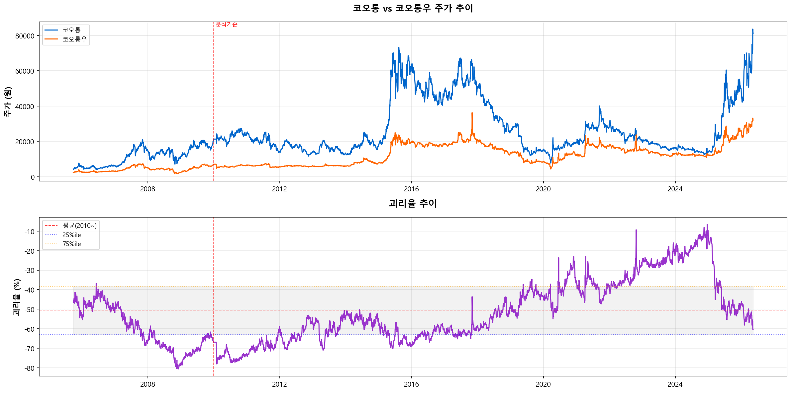

---

## 📌 호텔신라 (008770) vs 호텔신라우 (008775)

**분석 기간**: 2010-01-04 ~ 2026-05-11 (4,021일)
**전체 데이터**: 2005-09-29 ~ 2026-05-11 (5,091일) — 2010년 이전은 참고용

### 현재 상황

| 항목 | 값 |
|:----:|:---|
| 호텔신라 | 64,400원 |
| 호텔신라우 | 38,300원 |
| **현재 괴리율** | **-40.53%** |
| 우선주 할인율 | 40.53% |
| 역사적 위치 | 하위 39.9% |
| Z-Score | -0.18σ |
| 종합 점수 | 10점 (±100점 만점) |
| **판정** | **⚪ 중립** |

**판정 근거:**

- ✅ 최근 30일 평균보다 1%p 이상 낮음

### 괴리율 통계 (2010년~)

| 지표 | 값 |
|:----:|:---|
| 평균 | -36.48% |
| 중간값 | -36.84% |
| 표준편차 | 22.22% |
| 최소 (우선주 최저평가) | -77.64% |
| 최대 (우선주 최고평가) | 42.97% |

| 백분위 | 괴리율 | 의미 |
|:-----:|:------:|:-----|
| 10% | -67.73% | 우선주 매우 저평가 |
| 25% | -55.61% | 우선주 저평가 |
| 50% | -36.84% | 중간값 |
| 75% | -20.64% | 우선주 고평가 |
| 90% | -6.45% | 우선주 매우 고평가 |

**📎 참고: 전체 기간 (2005-09-29~) 통계 비교**

| 지표 | 2010년 이후 | 전체 기간 |
|:----:|:----------:|:---------:|
| 평균 | -36.48% | -40.12% |
| 중간값 | -36.84% | -41.45% |
| 표준편차 | 22.22% | 21.14% |
| 최소 | -77.64% | -77.64% |
| 최대 | 42.97% | 42.97% |

### 기간별 괴리율

| 기간 | 평균 | 최소 | 최대 | 현재 대비 |
|:----:|:----:|:----:|:----:|:---------:|
| 최근 1개월 | -30.51% | -40.53% | -20.77% | -10.02%p |
| 최근 3개월 | -24.93% | -40.53% | -15.85% | -15.60%p |
| 최근 6개월 | -20.79% | -40.53% | -11.18% | -19.73%p |
| 최근 1년 | -18.63% | -40.53% | 0.32% | -21.89%p |
| 최근 3년 | -20.13% | -41.14% | 2.36% | -20.40%p |
| 최근 5년 | -20.95% | -49.09% | 42.97% | -19.57%p |

### 시장 상황별 괴리율

| 구분 | 기간 | 평균 괴리율 | 중간값 |
|:----:|:----:|:----------:|:------:|
| 상승장 | 1267일 (31.5%) | -44.51% | -43.90% |
| 하락장 | 1070일 (26.6%) | -31.85% | -33.21% |
| 중립장 | 1684일 (41.9%) | -33.39% | -32.21% |

### 역사적 극단값 (Top 5)

**🟦 우선주 최저평가 시점 (괴리율 최저)**

| 날짜 | 호텔신라 | 호텔신라우 | 괴리율 |
|:----:|--------:|----------:|:------:|
| 2013-03-21 | 52,651원 | 11,773원 | **-77.64%** |
| 2013-03-22 | 51,787원 | 11,866원 | **-77.09%** |
| 2013-03-29 | 52,746원 | 12,098원 | **-77.06%** |
| 2013-03-20 | 51,691원 | 11,866원 | **-77.04%** |
| 2013-03-28 | 52,746원 | 12,144원 | **-76.98%** |

**🟥 보통주 최저평가 시점 (괴리율 최고)**

| 날짜 | 호텔신라 | 호텔신라우 | 괴리율 |
|:----:|--------:|----------:|:------:|
| 2021-04-26 | 83,920원 | 119,985원 | **42.97%** |
| 2021-04-27 | 83,424원 | 113,072원 | **35.54%** |
| 2017-02-17 | 46,277원 | 62,405원 | **34.85%** |
| 2017-02-22 | 47,449원 | 61,253원 | **29.09%** |
| 2017-03-10 | 43,934원 | 56,164원 | **27.84%** |

### 차트

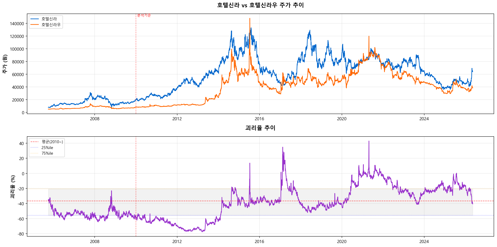

---

## 📌 DL (000210) vs DL우 (000215)

**분석 기간**: 2010-01-04 ~ 2026-05-11 (4,021일)
**전체 데이터**: 2005-09-29 ~ 2026-05-11 (5,091일) — 2010년 이전은 참고용

### 현재 상황

| 항목 | 값 |
|:----:|:---|
| DL | 67,100원 |
| DL우 | 29,000원 |
| **현재 괴리율** | **-56.78%** |
| 우선주 할인율 | 56.78% |
| 역사적 위치 | 하위 17.1% |
| Z-Score | -0.87σ |
| 종합 점수 | 35점 (±100점 만점) |
| **판정** | **🟦 우선주 매수** |

**판정 근거:**

- ✅ 역사적 하위 25% (우선주 저평가)
- ✅ 최근 30일 평균보다 1%p 이상 낮음

### 괴리율 통계 (2010년~)

| 지표 | 값 |
|:----:|:---|
| 평균 | -46.95% |
| 중간값 | -46.12% |
| 표준편차 | 11.27% |
| 최소 (우선주 최저평가) | -70.56% |
| 최대 (우선주 최고평가) | -2.22% |

| 백분위 | 괴리율 | 의미 |
|:-----:|:------:|:-----|
| 10% | -64.76% | 우선주 매우 저평가 |
| 25% | -53.40% | 우선주 저평가 |
| 50% | -46.12% | 중간값 |
| 75% | -40.46% | 우선주 고평가 |
| 90% | -35.54% | 우선주 매우 고평가 |

**📎 참고: 전체 기간 (2005-09-29~) 통계 비교**

| 지표 | 2010년 이후 | 전체 기간 |
|:----:|:----------:|:---------:|
| 평균 | -46.95% | -44.79% |
| 중간값 | -46.12% | -45.05% |
| 표준편차 | 11.27% | 12.73% |
| 최소 | -70.56% | -70.56% |
| 최대 | -2.22% | 3.03% |

### 기간별 괴리율

| 기간 | 평균 | 최소 | 최대 | 현재 대비 |
|:----:|:----:|:----:|:----:|:---------:|
| 최근 1개월 | -55.69% | -58.33% | -53.99% | -1.09%p |
| 최근 3개월 | -48.06% | -58.33% | -36.25% | -8.72%p |
| 최근 6개월 | -42.57% | -58.33% | -32.10% | -14.21%p |
| 최근 1년 | -42.80% | -58.33% | -32.10% | -13.98%p |
| 최근 3년 | -45.43% | -58.33% | -32.10% | -11.35%p |
| 최근 5년 | -41.58% | -58.33% | -2.22% | -15.20%p |

### 시장 상황별 괴리율

| 구분 | 기간 | 평균 괴리율 | 중간값 |
|:----:|:----:|:----------:|:------:|
| 상승장 | 1148일 (28.6%) | -50.34% | -49.88% |
| 하락장 | 1294일 (32.2%) | -46.58% | -44.81% |
| 중립장 | 1579일 (39.3%) | -44.79% | -44.98% |

### 역사적 극단값 (Top 5)

**🟦 우선주 최저평가 시점 (괴리율 최저)**

| 날짜 | DL | DL우 | 괴리율 |
|:----:|--------:|----------:|:------:|
| 2012-02-02 | 130,776원 | 38,506원 | **-70.56%** |
| 2012-02-03 | 131,866원 | 39,200원 | **-70.27%** |
| 2011-09-07 | 121,289원 | 36,564원 | **-69.85%** |
| 2012-02-06 | 130,232원 | 39,663원 | **-69.54%** |
| 2012-02-09 | 138,950원 | 42,364원 | **-69.51%** |

**🟥 보통주 최저평가 시점 (괴리율 최고)**

| 날짜 | DL | DL우 | 괴리율 |
|:----:|--------:|----------:|:------:|
| 2020-12-28 | 100,004원 | 97,788원 | **-2.22%** |
| 2020-12-29 | 102,664원 | 100,334원 | **-2.27%** |
| 2020-12-30 | 102,664원 | 100,334원 | **-2.27%** |
| 2021-01-04 | 102,664원 | 100,334원 | **-2.27%** |
| 2021-01-05 | 102,664원 | 100,334원 | **-2.27%** |

### 차트

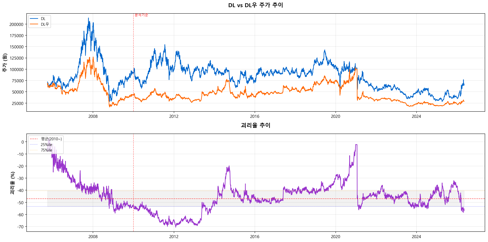

---

## 📌 한국금융지주 (071050) vs 한국금융지주우 (071055)

**분석 기간**: 2010-01-04 ~ 2026-05-11 (4,021일)
**전체 데이터**: 2005-09-29 ~ 2026-05-11 (5,091일) — 2010년 이전은 참고용

### 현재 상황

| 항목 | 값 |
|:----:|:---|
| 한국금융지주 | 265,500원 |
| 한국금융지주우 | 182,700원 |
| **현재 괴리율** | **-31.19%** |
| 우선주 할인율 | 31.19% |
| 역사적 위치 | 하위 73.9% |
| Z-Score | 0.92σ |
| 종합 점수 | 0점 (±100점 만점) |
| **판정** | **⚪ 중립** |

### 괴리율 통계 (2010년~)

| 지표 | 값 |
|:----:|:---|
| 평균 | -49.02% |
| 중간값 | -51.25% |
| 표준편차 | 19.46% |
| 최소 (우선주 최저평가) | -81.32% |
| 최대 (우선주 최고평가) | -9.56% |

| 백분위 | 괴리율 | 의미 |
|:-----:|:------:|:-----|
| 10% | -77.82% | 우선주 매우 저평가 |
| 25% | -64.69% | 우선주 저평가 |
| 50% | -51.25% | 중간값 |
| 75% | -30.79% | 우선주 고평가 |
| 90% | -24.48% | 우선주 매우 고평가 |

**📎 참고: 전체 기간 (2005-09-29~) 통계 비교**

| 지표 | 2010년 이후 | 전체 기간 |
|:----:|:----------:|:---------:|
| 평균 | -49.02% | -53.61% |
| 중간값 | -51.25% | -55.53% |
| 표준편차 | 19.46% | 19.63% |
| 최소 | -81.32% | -82.35% |
| 최대 | -9.56% | -9.56% |

### 기간별 괴리율

| 기간 | 평균 | 최소 | 최대 | 현재 대비 |
|:----:|:----:|:----:|:----:|:---------:|
| 최근 1개월 | -30.45% | -33.72% | -25.73% | -0.73%p |
| 최근 3개월 | -28.97% | -38.27% | -22.60% | -2.21%p |
| 최근 6개월 | -28.38% | -38.27% | -20.03% | -2.81%p |
| 최근 1년 | -29.21% | -38.33% | -20.03% | -1.97%p |
| 최근 3년 | -26.74% | -38.33% | -9.56% | -4.45%p |
| 최근 5년 | -31.08% | -51.79% | -9.56% | -0.11%p |

### 시장 상황별 괴리율

| 구분 | 기간 | 평균 괴리율 | 중간값 |
|:----:|:----:|:----------:|:------:|
| 상승장 | 1291일 (32.1%) | -48.96% | -52.05% |
| 하락장 | 849일 (21.1%) | -47.50% | -48.44% |
| 중립장 | 1881일 (46.8%) | -49.75% | -52.22% |

### 역사적 극단값 (Top 5)

**🟦 우선주 최저평가 시점 (괴리율 최저)**

| 날짜 | 한국금융지주 | 한국금융지주우 | 괴리율 |
|:----:|--------:|----------:|:------:|
| 2011-12-05 | 24,703원 | 4,614원 | **-81.32%** |
| 2011-12-01 | 24,608원 | 4,605원 | **-81.29%** |
| 2011-12-07 | 24,482원 | 4,642원 | **-81.04%** |
| 2011-12-06 | 23,914원 | 4,549원 | **-80.98%** |
| 2012-03-05 | 29,246원 | 5,589원 | **-80.89%** |

**🟥 보통주 최저평가 시점 (괴리율 최고)**

| 날짜 | 한국금융지주 | 한국금융지주우 | 괴리율 |
|:----:|--------:|----------:|:------:|
| 2022-09-07 | 45,590원 | 41,234원 | **-9.56%** |
| 2022-08-29 | 47,878원 | 43,220원 | **-9.73%** |
| 2022-08-31 | 48,132원 | 43,379원 | **-9.88%** |
| 2022-07-15 | 47,963원 | 43,220원 | **-9.89%** |
| 2022-09-01 | 47,115원 | 42,346원 | **-10.12%** |

### 차트

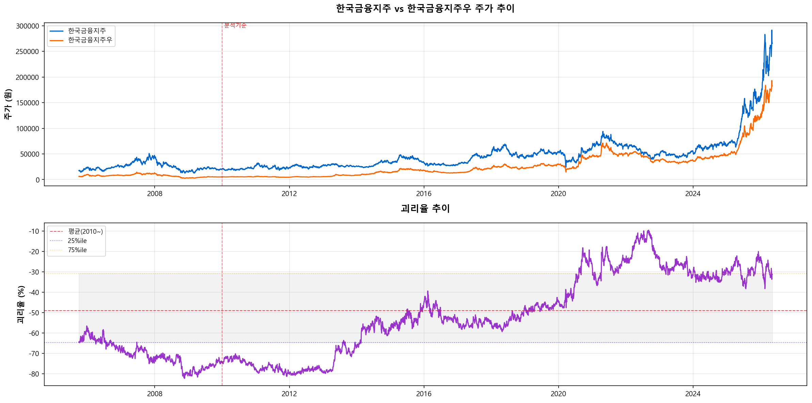

---

## 📌 삼성물산 (028260) vs 삼성물산우B (02826K)

**분석 기간**: 2014-12-18 ~ 2026-05-11 (2,790일)

### 현재 상황

| 항목 | 값 |
|:----:|:---|
| 삼성물산 | 449,500원 |
| 삼성물산우B | 263,500원 |
| **현재 괴리율** | **-41.38%** |
| 우선주 할인율 | 41.38% |
| 역사적 위치 | 하위 12.2% |
| Z-Score | -1.18σ |
| 종합 점수 | 55점 (±100점 만점) |
| **판정** | **🟦 우선주 강력 매수** |

**판정 근거:**

- ✅ 역사적 하위 25% (우선주 저평가)
- ✅ 평균 대비 1.0σ 이상 낮음
- ✅ 최근 30일 평균보다 1%p 이상 낮음

### 괴리율 통계

| 지표 | 값 |
|:----:|:---|
| 평균 | -27.04% |
| 중간값 | -28.63% |
| 표준편차 | 12.10% |
| 최소 (우선주 최저평가) | -48.49% |
| 최대 (우선주 최고평가) | 10.12% |

| 백분위 | 괴리율 | 의미 |
|:-----:|:------:|:-----|
| 10% | -41.92% | 우선주 매우 저평가 |
| 25% | -37.36% | 우선주 저평가 |
| 50% | -28.63% | 중간값 |
| 75% | -14.18% | 우선주 고평가 |
| 90% | -8.82% | 우선주 매우 고평가 |

### 기간별 괴리율

| 기간 | 평균 | 최소 | 최대 | 현재 대비 |
|:----:|:----:|:----:|:----:|:---------:|
| 최근 1개월 | -37.09% | -44.69% | -32.79% | -4.29%p |
| 최근 3개월 | -38.18% | -44.69% | -32.79% | -3.20%p |
| 최근 6개월 | -36.69% | -44.69% | -28.64% | -4.69%p |
| 최근 1년 | -31.43% | -44.69% | -22.76% | -9.95%p |
| 최근 3년 | -21.70% | -44.69% | -3.33% | -19.68%p |
| 최근 5년 | -21.47% | -44.69% | 10.12% | -19.91%p |

### 시장 상황별 괴리율

| 구분 | 기간 | 평균 괴리율 | 중간값 |
|:----:|:----:|:----------:|:------:|
| 상승장 | 742일 (26.6%) | -29.05% | -31.21% |
| 하락장 | 583일 (20.9%) | -27.10% | -28.70% |
| 중립장 | 1465일 (52.5%) | -25.99% | -27.47% |

### 역사적 극단값 (Top 5)

**🟦 우선주 최저평가 시점 (괴리율 최저)**

| 날짜 | 삼성물산 | 삼성물산우B | 괴리율 |
|:----:|--------:|----------:|:------:|
| 2015-03-10 | 138,610원 | 71,402원 | **-48.49%** |
| 2015-01-02 | 143,650원 | 74,622원 | **-48.05%** |
| 2015-02-24 | 130,209원 | 68,404원 | **-47.47%** |
| 2015-03-11 | 135,249원 | 71,180원 | **-47.37%** |
| 2015-03-09 | 138,190원 | 73,068원 | **-47.13%** |

**🟥 보통주 최저평가 시점 (괴리율 최고)**

| 날짜 | 삼성물산 | 삼성물산우B | 괴리율 |
|:----:|--------:|----------:|:------:|
| 2020-10-27 | 101,791원 | 112,092원 | **10.12%** |
| 2020-10-29 | 97,825원 | 106,958원 | **9.34%** |
| 2020-10-30 | 97,384원 | 103,963원 | **6.76%** |
| 2021-04-26 | 124,099원 | 128,525원 | **3.57%** |
| 2020-10-26 | 103,994원 | 105,675원 | **1.62%** |

### 차트

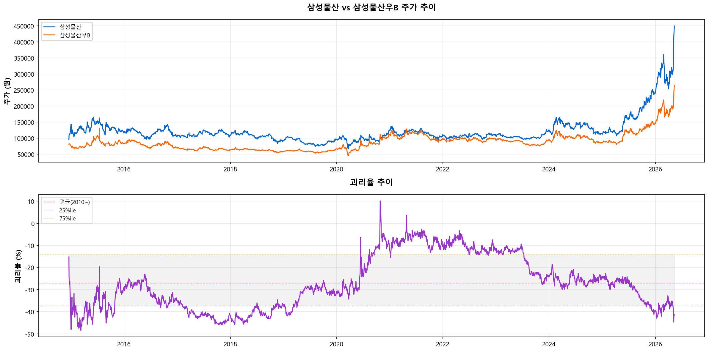

---

## 📌 아모레G (002790) vs 아모레G우 (002795)

**분석 기간**: 2010-01-04 ~ 2026-05-11 (4,021일)
**전체 데이터**: 2000-01-04 ~ 2026-05-11 (6,588일) — 2010년 이전은 참고용

### 현재 상황

| 항목 | 값 |
|:----:|:---|
| 아모레G | 26,600원 |
| 아모레G우 | 11,700원 |
| **현재 괴리율** | **-56.02%** |
| 우선주 할인율 | 56.02% |
| 역사적 위치 | 하위 92.3% |
| Z-Score | 1.18σ |
| 종합 점수 | -70점 (±100점 만점) |
| **판정** | **🟥 보통주 강력 매수** |

**판정 근거:**

- ❌ 역사적 상위 10% (우선주 매우 고평가)
- ❌ 평균 대비 1.0σ 이상 높음
- ❌ 최근 30일 평균보다 1%p 이상 높음

### 괴리율 통계 (2010년~)

| 지표 | 값 |
|:----:|:---|
| 평균 | -63.14% |
| 중간값 | -62.62% |
| 표준편차 | 6.02% |
| 최소 (우선주 최저평가) | -83.40% |
| 최대 (우선주 최고평가) | -45.20% |

| 백분위 | 괴리율 | 의미 |
|:-----:|:------:|:-----|
| 10% | -71.36% | 우선주 매우 저평가 |
| 25% | -66.09% | 우선주 저평가 |
| 50% | -62.62% | 중간값 |
| 75% | -59.51% | 우선주 고평가 |
| 90% | -56.62% | 우선주 매우 고평가 |

**📎 참고: 전체 기간 (2000-01-04~) 통계 비교**

| 지표 | 2010년 이후 | 전체 기간 |
|:----:|:----------:|:---------:|
| 평균 | -63.14% | -65.85% |
| 중간값 | -62.62% | -64.61% |
| 표준편차 | 6.02% | 7.51% |
| 최소 | -83.40% | -84.09% |
| 최대 | -45.20% | -45.20% |

### 기간별 괴리율

| 기간 | 평균 | 최소 | 최대 | 현재 대비 |
|:----:|:----:|:----:|:----:|:---------:|
| 최근 1개월 | -57.62% | -59.61% | -55.72% | +1.61%p |
| 최근 3개월 | -57.59% | -64.16% | -54.42% | +1.57%p |
| 최근 6개월 | -58.00% | -64.16% | -54.42% | +1.98%p |
| 최근 1년 | -59.05% | -64.16% | -54.42% | +3.03%p |
| 최근 3년 | -62.93% | -69.81% | -54.42% | +6.91%p |
| 최근 5년 | -63.27% | -69.85% | -54.36% | +7.26%p |

### 시장 상황별 괴리율

| 구분 | 기간 | 평균 괴리율 | 중간값 |
|:----:|:----:|:----------:|:------:|
| 상승장 | 1395일 (34.7%) | -64.33% | -63.21% |
| 하락장 | 1312일 (32.6%) | -61.91% | -62.07% |
| 중립장 | 1314일 (32.7%) | -63.12% | -62.81% |

### 역사적 극단값 (Top 5)

**🟦 우선주 최저평가 시점 (괴리율 최저)**

| 날짜 | 아모레G | 아모레G우 | 괴리율 |
|:----:|--------:|----------:|:------:|
| 2012-07-27 | 34,379원 | 5,708원 | **-83.40%** |
| 2012-08-02 | 34,012원 | 5,653원 | **-83.38%** |
| 2012-07-30 | 34,150원 | 5,708원 | **-83.28%** |
| 2012-08-13 | 35,248원 | 5,931원 | **-83.17%** |
| 2012-08-08 | 33,555원 | 5,668원 | **-83.11%** |

**🟥 보통주 최저평가 시점 (괴리율 최고)**

| 날짜 | 아모레G | 아모레G우 | 괴리율 |
|:----:|--------:|----------:|:------:|
| 2015-11-20 | 135,931원 | 74,495원 | **-45.20%** |
| 2015-11-18 | 134,539원 | 73,668원 | **-45.24%** |
| 2018-10-04 | 73,947원 | 39,925원 | **-46.01%** |
| 2015-12-11 | 135,931원 | 72,840원 | **-46.41%** |
| 2016-01-21 | 126,986원 | 67,767원 | **-46.63%** |

### 차트

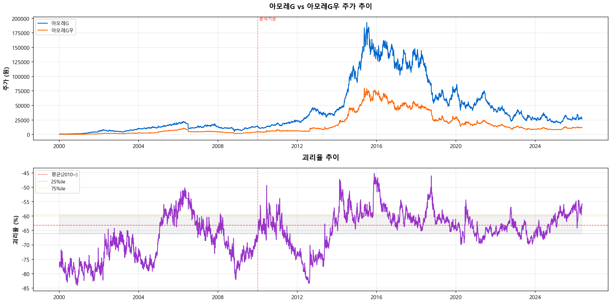

---

## 📌 NH투자증권 (005940) vs NH투자증권우 (005945)

**분석 기간**: 2010-01-04 ~ 2026-05-11 (4,021일)
**전체 데이터**: 2005-09-29 ~ 2026-05-11 (5,091일) — 2010년 이전은 참고용

### 현재 상황

| 항목 | 값 |
|:----:|:---|
| NH투자증권 | 36,100원 |
| NH투자증권우 | 27,650원 |
| **현재 괴리율** | **-23.41%** |
| 우선주 할인율 | 23.41% |
| 역사적 위치 | 하위 66.8% |
| Z-Score | 0.66σ |
| 종합 점수 | 10점 (±100점 만점) |
| **판정** | **⚪ 중립** |

**판정 근거:**

- ✅ 최근 30일 평균보다 1%p 이상 낮음

### 괴리율 통계 (2010년~)

| 지표 | 값 |
|:----:|:---|
| 평균 | -38.22% |
| 중간값 | -41.60% |
| 표준편차 | 22.31% |
| 최소 (우선주 최저평가) | -71.54% |
| 최대 (우선주 최고평가) | 0.75% |

| 백분위 | 괴리율 | 의미 |
|:-----:|:------:|:-----|
| 10% | -68.23% | 우선주 매우 저평가 |
| 25% | -59.58% | 우선주 저평가 |
| 50% | -41.60% | 중간값 |
| 75% | -14.36% | 우선주 고평가 |
| 90% | -8.04% | 우선주 매우 고평가 |

**📎 참고: 전체 기간 (2005-09-29~) 통계 비교**

| 지표 | 2010년 이후 | 전체 기간 |
|:----:|:----------:|:---------:|
| 평균 | -38.22% | -43.17% |
| 중간값 | -41.60% | -47.26% |
| 표준편차 | 22.31% | 22.15% |
| 최소 | -71.54% | -75.64% |
| 최대 | 0.75% | 0.75% |

### 기간별 괴리율

| 기간 | 평균 | 최소 | 최대 | 현재 대비 |
|:----:|:----:|:----:|:----:|:---------:|
| 최근 1개월 | -22.16% | -25.85% | -18.24% | -1.25%p |
| 최근 3개월 | -18.60% | -29.04% | -7.48% | -4.81%p |
| 최근 6개월 | -14.90% | -29.04% | -7.28% | -8.51%p |
| 최근 1년 | -13.67% | -29.04% | -3.90% | -9.74%p |
| 최근 3년 | -9.87% | -29.04% | 0.75% | -13.53%p |
| 최근 5년 | -17.07% | -44.09% | 0.75% | -6.34%p |

### 시장 상황별 괴리율

| 구분 | 기간 | 평균 괴리율 | 중간값 |
|:----:|:----:|:----------:|:------:|
| 상승장 | 1055일 (26.2%) | -38.92% | -43.59% |
| 하락장 | 805일 (20.0%) | -45.48% | -47.22% |
| 중립장 | 2161일 (53.7%) | -35.17% | -40.21% |

### 역사적 극단값 (Top 5)

**🟦 우선주 최저평가 시점 (괴리율 최저)**

| 날짜 | NH투자증권 | NH투자증권우 | 괴리율 |
|:----:|--------:|----------:|:------:|
| 2012-09-19 | 7,098원 | 2,020원 | **-71.54%** |
| 2013-01-29 | 6,880원 | 1,967원 | **-71.41%** |
| 2013-01-28 | 6,880원 | 1,971원 | **-71.35%** |
| 2013-02-22 | 7,016원 | 2,016원 | **-71.27%** |
| 2013-01-30 | 6,853원 | 1,971원 | **-71.23%** |

**🟥 보통주 최저평가 시점 (괴리율 최고)**

| 날짜 | NH투자증권 | NH투자증권우 | 괴리율 |
|:----:|--------:|----------:|:------:|
| 2022-06-10 | 7,928원 | 7,988원 | **0.75%** |
| 2022-09-23 | 7,342원 | 7,343원 | **0.01%** |
| 2022-09-22 | 7,421원 | 7,418원 | **-0.04%** |
| 2022-04-27 | 8,124원 | 8,100원 | **-0.28%** |
| 2022-04-25 | 8,202원 | 8,175원 | **-0.32%** |

### 차트

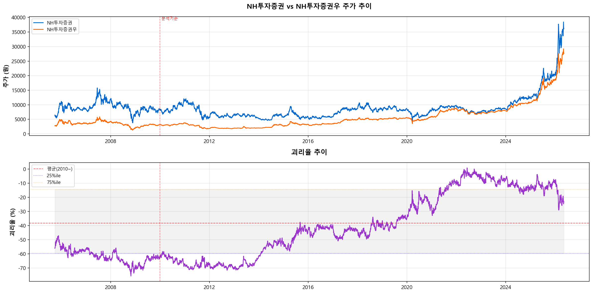

---

## 📌 SK하이닉스 (000660) vs SK스퀘어 (402340)

**분석 기간**: 2021-11-29 ~ 2026-05-11 (1,084일)

### 현재 상황

| 항목 | 값 |
|:----:|:---|
| SK하이닉스 | 1,899,000원 |
| SK스퀘어 | 1,190,000원 |
| **현재 괴리율** | **-37.34%** |
| 우선주 할인율 | 37.34% |
| 역사적 위치 | 하위 97.7% |
| Z-Score | 2.23σ |
| 종합 점수 | -80점 (±100점 만점) |
| **판정** | **🟥 보통주 강력 매수** |

**판정 근거:**

- ❌ 역사적 상위 10% (우선주 매우 고평가)
- ❌ 평균 대비 1.5σ 이상 높음
- ❌ 최근 30일 평균보다 1%p 이상 높음

### 괴리율 통계

| 지표 | 값 |
|:----:|:---|
| 평균 | -52.63% |
| 중간값 | -53.80% |
| 표준편차 | 6.86% |
| 최소 (우선주 최저평가) | -65.72% |
| 최대 (우선주 최고평가) | -30.91% |

| 백분위 | 괴리율 | 의미 |
|:-----:|:------:|:-----|
| 10% | -61.18% | 우선주 매우 저평가 |
| 25% | -57.07% | 우선주 저평가 |
| 50% | -53.80% | 중간값 |
| 75% | -49.51% | 우선주 고평가 |
| 90% | -41.78% | 우선주 매우 고평가 |

### 기간별 괴리율

| 기간 | 평균 | 최소 | 최대 | 현재 대비 |
|:----:|:----:|:----:|:----:|:---------:|
| 최근 1개월 | -40.28% | -45.52% | -31.51% | +2.94%p |
| 최근 3개월 | -40.17% | -45.84% | -31.51% | +2.83%p |
| 최근 6개월 | -42.81% | -54.98% | -31.51% | +5.47%p |
| 최근 1년 | -46.05% | -55.92% | -31.51% | +8.72%p |

### 시장 상황별 괴리율

| 구분 | 기간 | 평균 괴리율 | 중간값 |
|:----:|:----:|:----------:|:------:|
| 상승장 | 494일 (45.6%) | -51.07% | -53.14% |
| 하락장 | 198일 (18.3%) | -53.26% | -53.77% |
| 중립장 | 392일 (36.2%) | -54.27% | -54.32% |

### 역사적 극단값 (Top 5)

**🟦 우선주 최저평가 시점 (괴리율 최저)**

| 날짜 | SK하이닉스 | SK스퀘어 | 괴리율 |
|:----:|--------:|----------:|:------:|
| 2023-10-24 | 124,418원 | 42,650원 | **-65.72%** |
| 2023-10-20 | 123,829원 | 42,700원 | **-65.52%** |
| 2023-09-14 | 119,597원 | 41,400원 | **-65.38%** |
| 2023-10-23 | 121,670원 | 42,350원 | **-65.19%** |
| 2023-10-18 | 127,558원 | 44,500원 | **-65.11%** |

**🟥 보통주 최저평가 시점 (괴리율 최고)**

| 날짜 | SK하이닉스 | SK스퀘어 | 괴리율 |
|:----:|--------:|----------:|:------:|
| 2021-11-29 | 110,008원 | 76,000원 | **-30.91%** |
| 2026-05-04 | 1,447,000원 | 991,000원 | **-31.51%** |
| 2026-05-06 | 1,601,000원 | 1,089,000원 | **-31.98%** |
| 2025-06-25 | 284,858원 | 192,200원 | **-32.53%** |
| 2026-05-07 | 1,654,000원 | 1,099,000원 | **-33.56%** |

### 차트

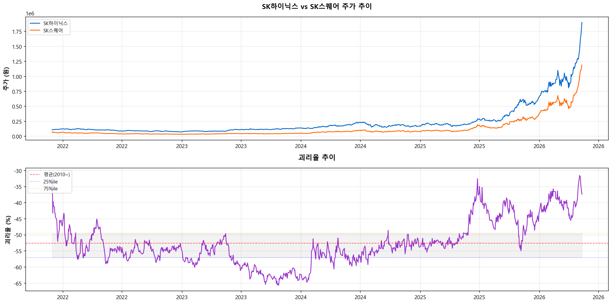

---

## ⚠️ 주의사항

1. **괴리율은 평균 회귀 경향**이 있지만, 장기간 지속될 수도 있습니다.
2. **우선주는 유동성이 낮아** 대량 매매 시 슬리피지가 발생할 수 있습니다.
3. **배당 기준일 전후**로 괴리율이 일시적으로 변동할 수 있습니다.
4. 이 분석은 **참고용**이며, 투자 판단은 본인의 책임입니다.

---

**데이터 출처**: market_data.db (SQLite) / Yahoo Finance (fallback)  
**분석 도구**: Python + pandas
