# 📊 보통주 vs 우선주 괴리율 분석 리포트

**분석일시**: 2026년 06월 26일 13:52:23
**분석 기준**: 2010년 이후 데이터 (금융위기 등 이상치 제외)

---

## 🎯 오늘의 투자 결론

| 종목 | 보통주 | 우선주 | 현재 괴리율 | 역사적 위치 | 판정 | 추천 |
|:----:|-------:|-------:|:----------:|:----------:|:----:|:-----|
| **삼성전자** | 329,500원 | 220,000원 | -33.23% | 하위 23% | ⚪ | ⚪ 중립 |
| **삼성전기** | 1,976,000원 | 763,000원 | -61.39% | 하위 37% | ⚪ | ⚪ 중립 |
| **현대차** | 469,500원 | 209,000원 | -55.48% | 하위 41% | ⚪ | ⚪ 중립 |
| **미래에셋증권** | 39,650원 | 15,160원 | -61.77% | 하위 28% | ⚪ | ⚪ 중립 |
| **CJ** | 151,200원 | 66,700원 | -55.89% | 하위 59% | ⚪ | ⚪ 중립 |
| **대상** | 15,980원 | 14,160원 | -11.39% | 하위 98% | 🟥 | 🟥 보통주 강력 매수 |
| **SK** | 824,000원 | 456,500원 | -44.60% | 하위 20% | 🟦 | 🟦 우선주 강력 매수 |
| **한화** | 99,700원 | 35,750원 | -64.14% | 하위 11% | 🟦 | 🟦 우선주 강력 매수 |
| **LG** | 96,100원 | 63,900원 | -33.51% | 하위 69% | ⚪ | ⚪ 중립 |
| **GS** | 62,300원 | 50,100원 | -19.58% | 하위 78% | 🟥 | 🟥 보통주 매수 |
| **두산** | 1,419,000원 | 486,000원 | -65.75% | 하위 24% | 🟦 | 🟦 우선주 매수 |
| **아모레퍼시픽** | 95,300원 | 33,950원 | -64.38% | 하위 54% | ⚪ | ⚪ 중립 |
| **LG화학** | 269,000원 | 136,800원 | -49.14% | 하위 56% | ⚪ | ⚪ 중립 |
| **삼성SDI** | 453,500원 | 204,500원 | -54.91% | 하위 43% | ⚪ | ⚪ 중립 |
| **LG전자** | 187,800원 | 68,600원 | -63.47% | 하위 33% | ⚪ | ⚪ 중립 |
| **삼성화재** | 627,000원 | 408,000원 | -34.93% | 하위 63% | ⚪ | ⚪ 중립 |
| **S-Oil** | 92,700원 | 50,900원 | -45.09% | 하위 33% | ⚪ | ⚪ 중립 |
| **대한항공** | 27,750원 | 21,750원 | -21.62% | 하위 56% | ⚪ | ⚪ 중립 |
| **유한양행** | 66,000원 | 59,900원 | -9.24% | 하위 36% | ⚪ | ⚪ 중립 |
| **LG생활건강** | 213,000원 | 89,800원 | -57.84% | 하위 45% | ⚪ | ⚪ 중립 |
| **CJ제일제당** | 175,000원 | 116,600원 | -33.37% | 하위 100% | 🟥 | 🟥 보통주 강력 매수 |
| **현대건설** | 101,200원 | 47,700원 | -52.87% | 하위 7% | 🟦 | 🟦 우선주 매수 |
| **금호석유** | 112,700원 | 50,900원 | -54.84% | 하위 71% | ⚪ | ⚪ 중립 |
| **코오롱인더** | 56,400원 | 22,700원 | -59.75% | 하위 63% | ⚪ | ⚪ 중립 |
| **코오롱** | 44,650원 | 21,650원 | -51.51% | 하위 57% | ⚪ | ⚪ 중립 |
| **호텔신라** | 45,600원 | 28,700원 | -37.06% | 하위 50% | ⚪ | ⚪ 중립 |
| **DL** | 40,750원 | 20,000원 | -50.92% | 하위 32% | ⚪ | ⚪ 중립 |
| **한국금융지주** | 197,500원 | 141,800원 | -28.20% | 하위 82% | 🟥 | 🟥 보통주 강력 매수 |
| **삼성물산** | 487,500원 | 281,000원 | -42.36% | 하위 9% | 🟦 | 🟦 우선주 강력 매수 |
| **아모레G** | 20,500원 | 9,830원 | -52.05% | 하위 97% | 🟥 | 🟥 보통주 강력 매수 |
| **NH투자증권** | 27,250원 | 23,150원 | -15.05% | 하위 74% | 🟥 | 🟥 보통주 매수 |
| **SK하이닉스** | 2,634,000원 | 1,691,000원 | -35.80% | 하위 98% | 🟥 | 🟥 보통주 강력 매수 |

### 💡 핵심 요약

- **삼성전자**: 괴리율(-33.2%)이 평균(-24.4%) 부근. **선호도에 따라 선택** (배당→우선주, 의결권→보통주)
- **삼성전기**: 괴리율(-61.4%)이 평균(-59.4%) 부근. **선호도에 따라 선택** (배당→우선주, 의결권→보통주)
- **현대차**: 괴리율(-55.5%)이 평균(-54.2%) 부근. **선호도에 따라 선택** (배당→우선주, 의결권→보통주)
- **미래에셋증권**: 괴리율(-61.8%)이 평균(-54.3%) 부근. **선호도에 따라 선택** (배당→우선주, 의결권→보통주)
- **CJ**: 괴리율(-55.9%)이 평균(-59.6%) 부근. **선호도에 따라 선택** (배당→우선주, 의결권→보통주)
- **대상**: 우선주가 역사적 평균(-49.8%)보다 38.4%p 비쌈. 과거 98%의 경우보다 우선주가 비싸므로 **대상(보통주) 매수 유리** (승률 ~98%)
- **SK**: 우선주가 역사적 평균(-27.5%)보다 17.1%p 더 저렴. 과거 80%의 경우보다 우선주가 싸므로 **SK우 매수 유리** (승률 ~80%)
- **한화**: 우선주가 역사적 평균(-56.3%)보다 7.9%p 더 저렴. 과거 89%의 경우보다 우선주가 싸므로 **한화3우B 매수 유리** (승률 ~89%)
- **LG**: 괴리율(-33.5%)이 평균(-46.8%) 부근. **선호도에 따라 선택** (배당→우선주, 의결권→보통주)
- **GS**: 우선주가 역사적 평균(-38.4%)보다 18.8%p 비쌈. 과거 78%의 경우보다 우선주가 비싸므로 **GS(보통주) 매수 유리** (승률 ~78%)
- **두산**: 우선주가 역사적 평균(-50.1%)보다 15.7%p 더 저렴. 과거 76%의 경우보다 우선주가 싸므로 **두산우 매수 유리** (승률 ~76%)
- **아모레퍼시픽**: 괴리율(-64.4%)이 평균(-63.6%) 부근. **선호도에 따라 선택** (배당→우선주, 의결권→보통주)
- **LG화학**: 괴리율(-49.1%)이 평균(-51.5%) 부근. **선호도에 따라 선택** (배당→우선주, 의결권→보통주)
- **삼성SDI**: 괴리율(-54.9%)이 평균(-52.8%) 부근. **선호도에 따라 선택** (배당→우선주, 의결권→보통주)
- **LG전자**: 괴리율(-63.5%)이 평균(-60.3%) 부근. **선호도에 따라 선택** (배당→우선주, 의결권→보통주)
- **삼성화재**: 괴리율(-34.9%)이 평균(-43.4%) 부근. **선호도에 따라 선택** (배당→우선주, 의결권→보통주)
- **S-Oil**: 괴리율(-45.1%)이 평균(-40.3%) 부근. **선호도에 따라 선택** (배당→우선주, 의결권→보통주)
- **대한항공**: 괴리율(-21.6%)이 평균(-17.1%) 부근. **선호도에 따라 선택** (배당→우선주, 의결권→보통주)
- **유한양행**: 괴리율(-9.2%)이 평균(1.1%) 부근. **선호도에 따라 선택** (배당→우선주, 의결권→보통주)
- **LG생활건강**: 괴리율(-57.8%)이 평균(-58.1%) 부근. **선호도에 따라 선택** (배당→우선주, 의결권→보통주)
- **CJ제일제당**: 우선주가 역사적 평균(-62.3%)보다 28.9%p 비쌈. 과거 100%의 경우보다 우선주가 비싸므로 **CJ제일제당(보통주) 매수 유리** (승률 ~100%)
- **현대건설**: 우선주가 역사적 평균(67.1%)보다 120.0%p 더 저렴. 과거 93%의 경우보다 우선주가 싸므로 **현대건설우 매수 유리** (승률 ~93%)
- **금호석유**: 괴리율(-54.8%)이 평균(-64.7%) 부근. **선호도에 따라 선택** (배당→우선주, 의결권→보통주)
- **코오롱인더**: 괴리율(-59.8%)이 평균(-62.7%) 부근. **선호도에 따라 선택** (배당→우선주, 의결권→보통주)
- **코오롱**: 괴리율(-51.5%)이 평균(-50.5%) 부근. **선호도에 따라 선택** (배당→우선주, 의결권→보통주)
- **호텔신라**: 괴리율(-37.1%)이 평균(-36.5%) 부근. **선호도에 따라 선택** (배당→우선주, 의결권→보통주)
- **DL**: 괴리율(-50.9%)이 평균(-47.0%) 부근. **선호도에 따라 선택** (배당→우선주, 의결권→보통주)
- **한국금융지주**: 우선주가 역사적 평균(-48.9%)보다 20.7%p 비쌈. 과거 82%의 경우보다 우선주가 비싸므로 **한국금융지주(보통주) 매수 유리** (승률 ~82%)
- **삼성물산**: 우선주가 역사적 평균(-27.2%)보다 15.1%p 더 저렴. 과거 91%의 경우보다 우선주가 싸므로 **삼성물산우B 매수 유리** (승률 ~91%)
- **아모레G**: 우선주가 역사적 평균(-63.1%)보다 11.0%p 비쌈. 과거 97%의 경우보다 우선주가 비싸므로 **아모레G(보통주) 매수 유리** (승률 ~97%)
- **NH투자증권**: 우선주가 역사적 평균(-38.1%)보다 23.0%p 비쌈. 과거 74%의 경우보다 우선주가 비싸므로 **NH투자증권(보통주) 매수 유리** (승률 ~74%)
- **SK하이닉스**: 우선주가 역사적 평균(-52.3%)보다 16.5%p 비쌈. 과거 98%의 경우보다 우선주가 비싸므로 **SK하이닉스(보통주) 매수 유리** (승률 ~98%)

### 📋 투자 시점 가이드

| 종목 | 우선주 매수 구간 | 중립 구간 | 보통주 매수 구간 |
|:----:|:---------------:|:---------:|:---------------:|
| 삼성전자 | 괴리율 < -31.3% | -31.3% ~ -17.8% | 괴리율 > -17.8% |
| 삼성전기 | 괴리율 < -64.6% | -64.6% ~ -53.5% | 괴리율 > -53.5% |
| 현대차 | 괴리율 < -60.8% | -60.8% ~ -46.3% | 괴리율 > -46.3% |
| 미래에셋증권 | 괴리율 < -65.8% | -65.8% ~ -46.8% | 괴리율 > -46.8% |
| CJ | 괴리율 < -69.1% | -69.1% ~ -49.2% | 괴리율 > -49.2% |
| 대상 | 괴리율 < -67.1% | -67.1% ~ -28.5% | 괴리율 > -28.5% |
| SK | 괴리율 < -43.6% | -43.6% ~ -14.1% | 괴리율 > -14.1% |
| 한화 | 괴리율 < -61.3% | -61.3% ~ -51.4% | 괴리율 > -51.4% |
| LG | 괴리율 < -56.6% | -56.6% ~ -29.5% | 괴리율 > -29.5% |
| GS | 괴리율 < -53.5% | -53.5% ~ -20.9% | 괴리율 > -20.9% |
| 두산 | 괴리율 < -65.2% | -65.2% ~ -37.3% | 괴리율 > -37.3% |
| 아모레퍼시픽 | 괴리율 < -72.0% | -72.0% ~ -54.4% | 괴리율 > -54.4% |
| LG화학 | 괴리율 < -57.6% | -57.6% ~ -40.7% | 괴리율 > -40.7% |
| 삼성SDI | 괴리율 < -62.2% | -62.2% ~ -44.1% | 괴리율 > -44.1% |
| LG전자 | 괴리율 < -65.0% | -65.0% ~ -54.6% | 괴리율 > -54.6% |
| 삼성화재 | 괴리율 < -52.5% | -52.5% ~ -28.7% | 괴리율 > -28.7% |
| S-Oil | 괴리율 < -46.6% | -46.6% ~ -33.6% | 괴리율 > -33.6% |
| 대한항공 | 괴리율 < -42.2% | -42.2% ~ 9.9% | 괴리율 > 9.9% |
| 유한양행 | 괴리율 < -13.7% | -13.7% ~ 14.8% | 괴리율 > 14.8% |
| LG생활건강 | 괴리율 < -62.3% | -62.3% ~ -48.6% | 괴리율 > -48.6% |
| CJ제일제당 | 괴리율 < -69.2% | -69.2% ~ -55.8% | 괴리율 > -55.8% |
| 현대건설 | 괴리율 < -35.0% | -35.0% ~ 71.5% | 괴리율 > 71.5% |
| 금호석유 | 괴리율 < -72.8% | -72.8% ~ -53.4% | 괴리율 > -53.4% |
| 코오롱인더 | 괴리율 < -71.8% | -71.8% ~ -53.6% | 괴리율 > -53.6% |
| 코오롱 | 괴리율 < -63.0% | -63.0% ~ -38.5% | 괴리율 > -38.5% |
| 호텔신라 | 괴리율 < -55.1% | -55.1% ~ -20.7% | 괴리율 > -20.7% |
| DL | 괴리율 < -53.5% | -53.5% ~ -40.5% | 괴리율 > -40.5% |
| 한국금융지주 | 괴리율 < -64.5% | -64.5% ~ -30.7% | 괴리율 > -30.7% |
| 삼성물산 | 괴리율 < -37.5% | -37.5% ~ -14.4% | 괴리율 > -14.4% |
| 아모레G | 괴리율 < -66.0% | -66.0% ~ -59.4% | 괴리율 > -59.4% |
| NH투자증권 | 괴리율 < -59.1% | -59.1% ~ -14.5% | 괴리율 > -14.5% |
| SK하이닉스 | 괴리율 < -56.9% | -56.9% ~ -48.0% | 괴리율 > -48.0% |

### 📈 시장 상황별 전략

| 종목 | 상승장 예상 | 하락장 예상 | 패턴 |
|:----:|:----------:|:----------:|:-----|
| 삼성전자 | 우선주(삼성전자우) | 보통주(삼성전자) | 상승장에서 우선주가 더 저렴 |
| 삼성전기 | 우선주(삼성전기우) | 보통주(삼성전기) | 상승장에서 우선주가 더 저렴 |
| 현대차 | 우선주(현대차우) | 보통주(현대차) | 상승장에서 우선주가 더 저렴 |
| 미래에셋증권 | 우선주(미래에셋증권우) | 보통주(미래에셋증권) | 상승장에서 우선주가 더 저렴 |
| CJ | 우선주(CJ우) | 보통주(CJ) | 상승장에서 우선주가 더 저렴 |
| 대상 | 우선주(대상우) | 보통주(대상) | 상승장에서 우선주가 더 저렴 |
| SK | 우선주(SK우) | 보통주(SK) | 상승장에서 우선주가 더 저렴 |
| 한화 | 우선주(한화3우B) | 보통주(한화) | 상승장에서 우선주가 더 저렴 |
| LG | 우선주(LG우) | 보통주(LG) | 상승장에서 우선주가 더 저렴 |
| GS | 우선주(GS우) | 보통주(GS) | 상승장에서 우선주가 더 저렴 |
| 두산 | 우선주(두산우) | 보통주(두산) | 상승장에서 우선주가 더 저렴 |
| 아모레퍼시픽 | 우선주(아모레퍼시픽우) | 보통주(아모레퍼시픽) | 상승장에서 우선주가 더 저렴 |
| LG화학 | 우선주(LG화학우) | 보통주(LG화학) | 상승장에서 우선주가 더 저렴 |
| 삼성SDI | 우선주(삼성SDI우) | 보통주(삼성SDI) | 상승장에서 우선주가 더 저렴 |
| LG전자 | 우선주(LG전자우) | 보통주(LG전자) | 상승장에서 우선주가 더 저렴 |
| 삼성화재 | 보통주(삼성화재) | 우선주(삼성화재우) | 하락장에서 우선주가 더 저렴 |
| S-Oil | 우선주(S-Oil우) | 보통주(S-Oil) | 상승장에서 우선주가 더 저렴 |
| 대한항공 | 보통주(대한항공) | 우선주(대한항공우) | 하락장에서 우선주가 더 저렴 |
| 유한양행 | 우선주(유한양행우) | 보통주(유한양행) | 상승장에서 우선주가 더 저렴 |
| LG생활건강 | 우선주(LG생활건강우) | 보통주(LG생활건강) | 상승장에서 우선주가 더 저렴 |
| CJ제일제당 | 우선주(CJ제일제당우) | 보통주(CJ제일제당) | 상승장에서 우선주가 더 저렴 |
| 현대건설 | 우선주(현대건설우) | 보통주(현대건설) | 상승장에서 우선주가 더 저렴 |
| 금호석유 | 우선주(금호석유우) | 보통주(금호석유) | 상승장에서 우선주가 더 저렴 |
| 코오롱인더 | 우선주(코오롱인더우) | 보통주(코오롱인더) | 상승장에서 우선주가 더 저렴 |
| 코오롱 | 우선주(코오롱우) | 보통주(코오롱) | 상승장에서 우선주가 더 저렴 |
| 호텔신라 | 우선주(호텔신라우) | 보통주(호텔신라) | 상승장에서 우선주가 더 저렴 |
| DL | 우선주(DL우) | 보통주(DL) | 상승장에서 우선주가 더 저렴 |
| 한국금융지주 | 우선주(한국금융지주우) | 보통주(한국금융지주) | 상승장에서 우선주가 더 저렴 |
| 삼성물산 | 우선주(삼성물산우B) | 보통주(삼성물산) | 상승장에서 우선주가 더 저렴 |
| 아모레G | 우선주(아모레G우) | 보통주(아모레G) | 상승장에서 우선주가 더 저렴 |
| NH투자증권 | 보통주(NH투자증권) | 우선주(NH투자증권우) | 하락장에서 우선주가 더 저렴 |
| SK하이닉스 | 보통주(SK하이닉스) | 우선주(SK스퀘어) | 하락장에서 우선주가 더 저렴 |

---

## 📌 삼성전자 (005930) vs 삼성전자우 (005935)

**분석 기간**: 2010-01-04 ~ 2026-06-26 (4,053일)
**전체 데이터**: 2005-09-29 ~ 2026-06-26 (5,123일) — 2010년 이전은 참고용

### 현재 상황

| 항목 | 값 |
|:----:|:---|
| 삼성전자 | 329,500원 |
| 삼성전자우 | 220,000원 |
| **현재 괴리율** | **-33.23%** |
| 우선주 할인율 | 33.23% |
| 역사적 위치 | 하위 23.4% |
| Z-Score | -0.87σ |
| 종합 점수 | 15점 (±100점 만점) |
| **판정** | **⚪ 중립** |

**판정 근거:**

- ✅ 역사적 하위 25% (우선주 저평가)
- ❌ 최근 30일 평균보다 1%p 이상 높음

### 괴리율 통계 (2010년~)

| 지표 | 값 |
|:----:|:---|
| 평균 | -24.42% |
| 중간값 | -22.08% |
| 표준편차 | 10.15% |
| 최소 (우선주 최저평가) | -48.45% |
| 최대 (우선주 최고평가) | -6.47% |

| 백분위 | 괴리율 | 의미 |
|:-----:|:------:|:-----|
| 10% | -40.71% | 우선주 매우 저평가 |
| 25% | -31.32% | 우선주 저평가 |
| 50% | -22.08% | 중간값 |
| 75% | -17.77% | 우선주 고평가 |
| 90% | -11.28% | 우선주 매우 고평가 |

**📎 참고: 전체 기간 (2005-09-29~) 통계 비교**

| 지표 | 2010년 이후 | 전체 기간 |
|:----:|:----------:|:---------:|
| 평균 | -24.42% | -26.56% |
| 중간값 | -22.08% | -25.15% |
| 표준편차 | 10.15% | 10.32% |
| 최소 | -48.45% | -49.81% |
| 최대 | -6.47% | -6.47% |

### 기간별 괴리율

| 기간 | 평균 | 최소 | 최대 | 현재 대비 |
|:----:|:----:|:----:|:----:|:---------:|
| 최근 1개월 | -35.71% | -37.46% | -33.23% | +2.48%p |
| 최근 3개월 | -32.30% | -37.46% | -26.71% | -0.93%p |
| 최근 6개월 | -28.36% | -37.46% | -20.43% | -4.88%p |
| 최근 1년 | -23.11% | -37.46% | -15.60% | -10.12%p |
| 최근 3년 | -17.91% | -37.46% | -7.14% | -15.32%p |
| 최근 5년 | -16.89% | -37.46% | -6.47% | -16.34%p |

### 시장 상황별 괴리율

| 구분 | 기간 | 평균 괴리율 | 중간값 |
|:----:|:----:|:----------:|:------:|
| 상승장 | 1406일 (34.7%) | -25.85% | -23.47% |
| 하락장 | 660일 (16.3%) | -23.13% | -21.91% |
| 중립장 | 1987일 (49.0%) | -23.84% | -21.18% |

### 역사적 극단값 (Top 5)

**🟦 우선주 최저평가 시점 (괴리율 최저)**

| 날짜 | 삼성전자 | 삼성전자우 | 괴리율 |
|:----:|--------:|----------:|:------:|
| 2013-01-02 | 23,644원 | 12,188원 | **-48.45%** |
| 2013-01-14 | 23,284원 | 12,117원 | **-47.96%** |
| 2013-01-04 | 22,879원 | 11,976원 | **-47.66%** |
| 2012-05-08 | 20,007원 | 10,514원 | **-47.45%** |
| 2013-01-03 | 23,149원 | 12,174원 | **-47.41%** |

**🟥 보통주 최저평가 시점 (괴리율 최고)**

| 날짜 | 삼성전자 | 삼성전자우 | 괴리율 |
|:----:|--------:|----------:|:------:|
| 2021-09-09 | 68,340원 | 63,916원 | **-6.47%** |
| 2021-09-29 | 67,570원 | 63,165원 | **-6.52%** |
| 2022-06-16 | 56,073원 | 52,069원 | **-7.14%** |
| 2021-11-05 | 64,014원 | 59,402원 | **-7.20%** |
| 2020-12-22 | 63,442원 | 58,870원 | **-7.21%** |

### 차트

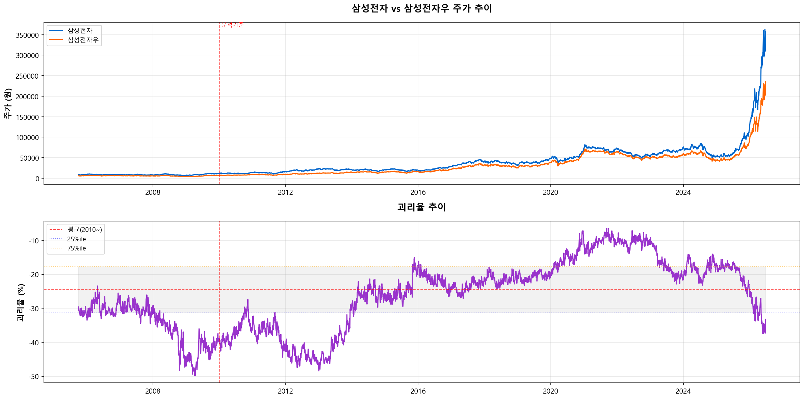

---

## 📌 삼성전기 (009150) vs 삼성전기우 (009155)

**분석 기간**: 2010-01-04 ~ 2026-06-26 (4,053일)
**전체 데이터**: 2005-09-29 ~ 2026-06-26 (5,123일) — 2010년 이전은 참고용

### 현재 상황

| 항목 | 값 |
|:----:|:---|
| 삼성전기 | 1,976,000원 |
| 삼성전기우 | 763,000원 |
| **현재 괴리율** | **-61.39%** |
| 우선주 할인율 | 61.39% |
| 역사적 위치 | 하위 37.0% |
| Z-Score | -0.23σ |
| 종합 점수 | -10점 (±100점 만점) |
| **판정** | **⚪ 중립** |

**판정 근거:**

- ❌ 최근 30일 평균보다 1%p 이상 높음

### 괴리율 통계 (2010년~)

| 지표 | 값 |
|:----:|:---|
| 평균 | -59.40% |
| 중간값 | -58.22% |
| 표준편차 | 8.66% |
| 최소 (우선주 최저평가) | -79.74% |
| 최대 (우선주 최고평가) | -32.54% |

| 백분위 | 괴리율 | 의미 |
|:-----:|:------:|:-----|
| 10% | -73.24% | 우선주 매우 저평가 |
| 25% | -64.62% | 우선주 저평가 |
| 50% | -58.22% | 중간값 |
| 75% | -53.55% | 우선주 고평가 |
| 90% | -49.02% | 우선주 매우 고평가 |

**📎 참고: 전체 기간 (2005-09-29~) 통계 비교**

| 지표 | 2010년 이후 | 전체 기간 |
|:----:|:----------:|:---------:|
| 평균 | -59.40% | -60.25% |
| 중간값 | -58.22% | -59.73% |
| 표준편차 | 8.66% | 8.30% |
| 최소 | -79.74% | -79.74% |
| 최대 | -32.54% | -32.54% |

### 기간별 괴리율

| 기간 | 평균 | 최소 | 최대 | 현재 대비 |
|:----:|:----:|:----:|:----:|:---------:|
| 최근 1개월 | -64.56% | -69.64% | -57.18% | +3.18%p |
| 최근 3개월 | -61.58% | -69.64% | -57.18% | +0.19%p |
| 최근 6개월 | -58.52% | -69.64% | -52.26% | -2.87%p |
| 최근 1년 | -56.91% | -69.64% | -52.26% | -4.48%p |
| 최근 3년 | -53.64% | -69.64% | -43.76% | -7.75%p |
| 최근 5년 | -54.31% | -69.64% | -32.54% | -7.08%p |

### 시장 상황별 괴리율

| 구분 | 기간 | 평균 괴리율 | 중간값 |
|:----:|:----:|:----------:|:------:|
| 상승장 | 1423일 (35.1%) | -60.07% | -59.12% |
| 하락장 | 1127일 (27.8%) | -58.09% | -56.07% |
| 중립장 | 1503일 (37.1%) | -59.75% | -57.36% |

### 역사적 극단값 (Top 5)

**🟦 우선주 최저평가 시점 (괴리율 최저)**

| 날짜 | 삼성전기 | 삼성전기우 | 괴리율 |
|:----:|--------:|----------:|:------:|
| 2012-06-21 | 93,451원 | 18,936원 | **-79.74%** |
| 2012-06-18 | 93,451원 | 19,043원 | **-79.62%** |
| 2012-06-19 | 92,154원 | 18,864원 | **-79.53%** |
| 2012-06-20 | 92,154원 | 18,864원 | **-79.53%** |
| 2012-06-15 | 93,019원 | 19,043원 | **-79.53%** |

**🟥 보통주 최저평가 시점 (괴리율 최고)**

| 날짜 | 삼성전기 | 삼성전기우 | 괴리율 |
|:----:|--------:|----------:|:------:|
| 2021-01-27 | 202,419원 | 136,554원 | **-32.54%** |
| 2021-01-26 | 204,778원 | 136,554원 | **-33.32%** |
| 2021-01-28 | 197,701원 | 130,367원 | **-34.06%** |
| 2021-01-29 | 192,510원 | 121,971원 | **-36.64%** |
| 2021-02-03 | 197,701원 | 122,855원 | **-37.86%** |

### 차트

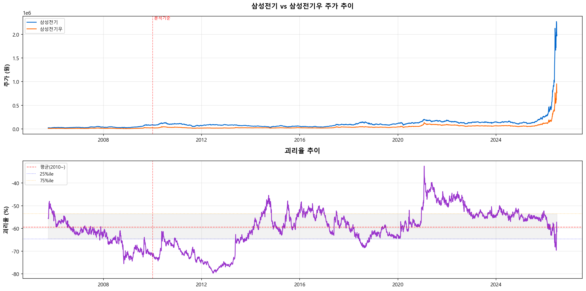

---

## 📌 현대차 (005380) vs 현대차우 (005385)

**분석 기간**: 2010-01-04 ~ 2026-06-26 (4,053일)
**전체 데이터**: 2005-09-29 ~ 2026-06-26 (5,123일) — 2010년 이전은 참고용

### 현재 상황

| 항목 | 값 |
|:----:|:---|
| 현대차 | 469,500원 |
| 현대차우 | 209,000원 |
| **현재 괴리율** | **-55.48%** |
| 우선주 할인율 | 55.48% |
| 역사적 위치 | 하위 40.7% |
| Z-Score | -0.09σ |
| 종합 점수 | -10점 (±100점 만점) |
| **판정** | **⚪ 중립** |

**판정 근거:**

- ❌ 최근 30일 평균보다 1%p 이상 높음

### 괴리율 통계 (2010년~)

| 지표 | 값 |
|:----:|:---|
| 평균 | -54.25% |
| 중간값 | -51.55% |
| 표준편차 | 14.11% |
| 최소 (우선주 최저평가) | -79.50% |
| 최대 (우선주 최고평가) | -20.11% |

| 백분위 | 괴리율 | 의미 |
|:-----:|:------:|:-----|
| 10% | -76.11% | 우선주 매우 저평가 |
| 25% | -60.80% | 우선주 저평가 |
| 50% | -51.55% | 중간값 |
| 75% | -46.31% | 우선주 고평가 |
| 90% | -39.00% | 우선주 매우 고평가 |

**📎 참고: 전체 기간 (2005-09-29~) 통계 비교**

| 지표 | 2010년 이후 | 전체 기간 |
|:----:|:----------:|:---------:|
| 평균 | -54.25% | -57.07% |
| 중간값 | -51.55% | -56.40% |
| 표준편차 | 14.11% | 14.12% |
| 최소 | -79.50% | -82.21% |
| 최대 | -20.11% | -20.11% |

### 기간별 괴리율

| 기간 | 평균 | 최소 | 최대 | 현재 대비 |
|:----:|:----:|:----:|:----:|:---------:|
| 최근 1개월 | -59.97% | -63.00% | -55.48% | +4.48%p |
| 최근 3개월 | -53.79% | -63.00% | -45.41% | -1.70%p |
| 최근 6개월 | -42.84% | -63.00% | -24.24% | -12.64%p |
| 최근 1년 | -33.84% | -63.00% | -20.11% | -21.65%p |
| 최근 3년 | -43.04% | -63.00% | -20.11% | -12.45%p |
| 최근 5년 | -47.64% | -63.08% | -20.11% | -7.84%p |

### 시장 상황별 괴리율

| 구분 | 기간 | 평균 괴리율 | 중간값 |
|:----:|:----:|:----------:|:------:|
| 상승장 | 1172일 (28.9%) | -55.39% | -52.65% |
| 하락장 | 792일 (19.5%) | -51.77% | -49.36% |
| 중립장 | 2089일 (51.5%) | -54.55% | -51.52% |

### 역사적 극단값 (Top 5)

**🟦 우선주 최저평가 시점 (괴리율 최저)**

| 날짜 | 현대차 | 현대차우 | 괴리율 |
|:----:|--------:|----------:|:------:|
| 2012-04-20 | 169,084원 | 34,658원 | **-79.50%** |
| 2012-04-23 | 166,421원 | 34,406원 | **-79.33%** |
| 2012-06-20 | 168,751원 | 34,909원 | **-79.31%** |
| 2012-08-02 | 158,765원 | 32,897원 | **-79.28%** |
| 2012-04-19 | 172,745원 | 35,815원 | **-79.27%** |

**🟥 보통주 최저평가 시점 (괴리율 최고)**

| 날짜 | 현대차 | 현대차우 | 괴리율 |
|:----:|--------:|----------:|:------:|
| 2025-05-23 | 173,027원 | 138,223원 | **-20.11%** |
| 2025-06-04 | 181,332원 | 144,557원 | **-20.28%** |
| 2025-05-26 | 174,950원 | 139,076원 | **-20.51%** |
| 2025-05-27 | 174,950원 | 138,508원 | **-20.83%** |
| 2025-06-05 | 184,842원 | 146,100원 | **-20.96%** |

### 차트

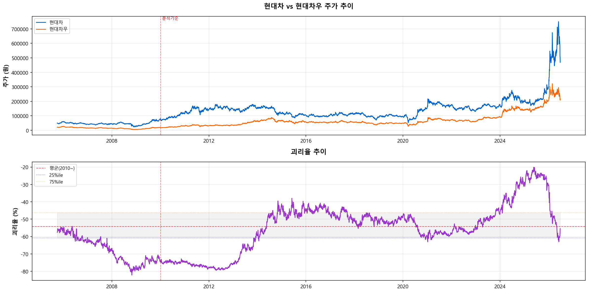

---

## 📌 미래에셋증권 (006800) vs 미래에셋증권우 (006805)

**분석 기간**: 2010-01-04 ~ 2026-06-26 (4,053일)
**전체 데이터**: 2005-09-29 ~ 2026-06-26 (5,123일) — 2010년 이전은 참고용

### 현재 상황

| 항목 | 값 |
|:----:|:---|
| 미래에셋증권 | 39,650원 |
| 미래에셋증권우 | 15,160원 |
| **현재 괴리율** | **-61.77%** |
| 우선주 할인율 | 61.77% |
| 역사적 위치 | 하위 27.9% |
| Z-Score | -0.71σ |
| 종합 점수 | -10점 (±100점 만점) |
| **판정** | **⚪ 중립** |

**판정 근거:**

- ❌ 최근 30일 평균보다 1%p 이상 높음

### 괴리율 통계 (2010년~)

| 지표 | 값 |
|:----:|:---|
| 평균 | -54.35% |
| 중간값 | -52.40% |
| 표준편차 | 10.52% |
| 최소 (우선주 최저평가) | -73.11% |
| 최대 (우선주 최고평가) | -30.41% |

| 백분위 | 괴리율 | 의미 |
|:-----:|:------:|:-----|
| 10% | -69.93% | 우선주 매우 저평가 |
| 25% | -65.76% | 우선주 저평가 |
| 50% | -52.40% | 중간값 |
| 75% | -46.84% | 우선주 고평가 |
| 90% | -40.93% | 우선주 매우 고평가 |

**📎 참고: 전체 기간 (2005-09-29~) 통계 비교**

| 지표 | 2010년 이후 | 전체 기간 |
|:----:|:----------:|:---------:|
| 평균 | -54.35% | -56.17% |
| 중간값 | -52.40% | -54.74% |
| 표준편차 | 10.52% | 10.63% |
| 최소 | -73.11% | -76.17% |
| 최대 | -30.41% | -30.41% |

### 기간별 괴리율

| 기간 | 평균 | 최소 | 최대 | 현재 대비 |
|:----:|:----:|:----:|:----:|:---------:|
| 최근 1개월 | -69.63% | -72.46% | -61.77% | +7.86%p |
| 최근 3개월 | -67.60% | -72.46% | -60.97% | +5.83%p |
| 최근 6개월 | -59.58% | -72.46% | -30.41% | -2.19%p |
| 최근 1년 | -56.42% | -72.46% | -30.41% | -5.35%p |
| 최근 3년 | -49.06% | -72.46% | -30.41% | -12.70%p |
| 최근 5년 | -48.35% | -72.46% | -30.41% | -13.42%p |

### 시장 상황별 괴리율

| 구분 | 기간 | 평균 괴리율 | 중간값 |
|:----:|:----:|:----------:|:------:|
| 상승장 | 1100일 (27.1%) | -56.29% | -53.83% |
| 하락장 | 1048일 (25.9%) | -55.22% | -53.60% |
| 중립장 | 1905일 (47.0%) | -52.75% | -49.76% |

### 역사적 극단값 (Top 5)

**🟦 우선주 최저평가 시점 (괴리율 최저)**

| 날짜 | 미래에셋증권 | 미래에셋증권우 | 괴리율 |
|:----:|--------:|----------:|:------:|
| 2012-09-27 | 9,530원 | 2,563원 | **-73.11%** |
| 2012-09-19 | 9,933원 | 2,674원 | **-73.08%** |
| 2012-09-21 | 9,750원 | 2,635원 | **-72.97%** |
| 2012-10-02 | 9,310원 | 2,518원 | **-72.95%** |
| 2012-09-24 | 9,566원 | 2,590원 | **-72.92%** |

**🟥 보통주 최저평가 시점 (괴리율 최고)**

| 날짜 | 미래에셋증권 | 미래에셋증권우 | 괴리율 |
|:----:|--------:|----------:|:------:|
| 2025-12-26 | 22,635원 | 15,752원 | **-30.41%** |
| 2022-08-16 | 6,153원 | 4,167원 | **-32.27%** |
| 2022-08-19 | 6,098원 | 4,079원 | **-33.10%** |
| 2022-08-04 | 5,960원 | 3,987원 | **-33.11%** |
| 2022-08-12 | 6,217원 | 4,155원 | **-33.17%** |

### 차트

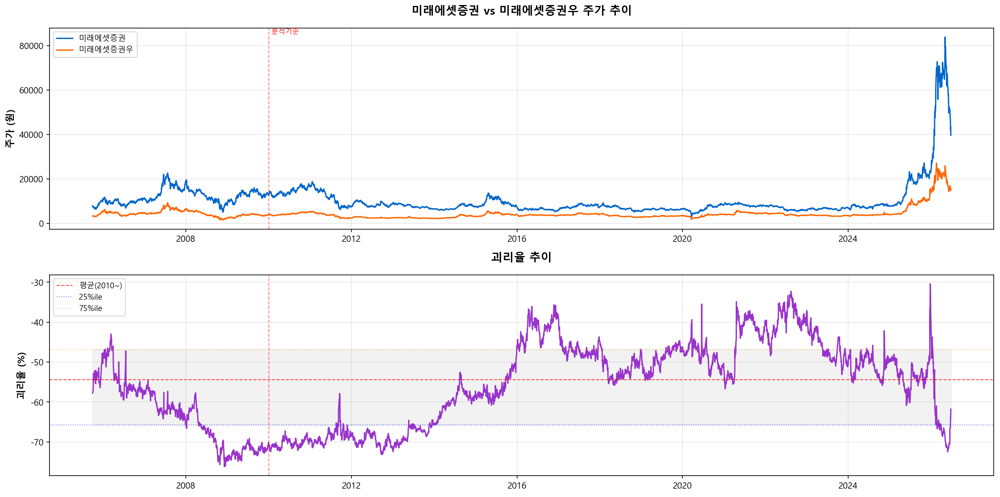

---

## 📌 CJ (001040) vs CJ우 (001045)

**분석 기간**: 2010-01-04 ~ 2026-06-26 (4,053일)
**전체 데이터**: 2000-01-04 ~ 2026-06-26 (6,620일) — 2010년 이전은 참고용

### 현재 상황

| 항목 | 값 |
|:----:|:---|
| CJ | 151,200원 |
| CJ우 | 66,700원 |
| **현재 괴리율** | **-55.89%** |
| 우선주 할인율 | 55.89% |
| 역사적 위치 | 하위 58.7% |
| Z-Score | 0.30σ |
| 종합 점수 | 0점 (±100점 만점) |
| **판정** | **⚪ 중립** |

### 괴리율 통계 (2010년~)

| 지표 | 값 |
|:----:|:---|
| 평균 | -59.57% |
| 중간값 | -59.20% |
| 표준편차 | 12.21% |
| 최소 (우선주 최저평가) | -83.09% |
| 최대 (우선주 최고평가) | -34.59% |

| 백분위 | 괴리율 | 의미 |
|:-----:|:------:|:-----|
| 10% | -79.85% | 우선주 매우 저평가 |
| 25% | -69.14% | 우선주 저평가 |
| 50% | -59.20% | 중간값 |
| 75% | -49.22% | 우선주 고평가 |
| 90% | -44.19% | 우선주 매우 고평가 |

**📎 참고: 전체 기간 (2000-01-04~) 통계 비교**

| 지표 | 2010년 이후 | 전체 기간 |
|:----:|:----------:|:---------:|
| 평균 | -59.57% | 70.94% |
| 중간값 | -59.20% | -52.58% |
| 표준편차 | 12.21% | 214.26% |
| 최소 | -83.09% | -83.09% |
| 최대 | -34.59% | 845.98% |

### 기간별 괴리율

| 기간 | 평균 | 최소 | 최대 | 현재 대비 |
|:----:|:----:|:----:|:----:|:---------:|
| 최근 1개월 | -55.63% | -59.49% | -51.03% | -0.25%p |
| 최근 3개월 | -56.26% | -59.87% | -51.03% | +0.37%p |
| 최근 6개월 | -53.17% | -59.87% | -45.43% | -2.72%p |
| 최근 1년 | -49.45% | -59.87% | -39.60% | -6.43%p |
| 최근 3년 | -47.59% | -59.87% | -34.59% | -8.30%p |
| 최근 5년 | -49.07% | -63.00% | -34.59% | -6.82%p |

### 시장 상황별 괴리율

| 구분 | 기간 | 평균 괴리율 | 중간값 |
|:----:|:----:|:----------:|:------:|
| 상승장 | 1297일 (32.0%) | -60.81% | -59.21% |
| 하락장 | 1060일 (26.2%) | -57.69% | -58.77% |
| 중립장 | 1696일 (41.8%) | -59.79% | -59.80% |

### 역사적 극단값 (Top 5)

**🟦 우선주 최저평가 시점 (괴리율 최저)**

| 날짜 | CJ | CJ우 | 괴리율 |
|:----:|--------:|----------:|:------:|
| 2013-02-28 | 105,339원 | 17,815원 | **-83.09%** |
| 2012-10-29 | 76,722원 | 13,029원 | **-83.02%** |
| 2013-02-21 | 95,474원 | 16,273원 | **-82.96%** |
| 2013-02-05 | 95,122원 | 16,216원 | **-82.95%** |
| 2013-02-27 | 101,464원 | 17,329원 | **-82.92%** |

**🟥 보통주 최저평가 시점 (괴리율 최고)**

| 날짜 | CJ | CJ우 | 괴리율 |
|:----:|--------:|----------:|:------:|
| 2023-07-13 | 57,779원 | 37,792원 | **-34.59%** |
| 2023-07-26 | 57,873원 | 37,530원 | **-35.15%** |
| 2023-07-12 | 58,529원 | 37,749원 | **-35.51%** |
| 2023-07-10 | 57,591원 | 37,049원 | **-35.67%** |
| 2023-07-14 | 58,623원 | 37,661원 | **-35.76%** |

### 차트

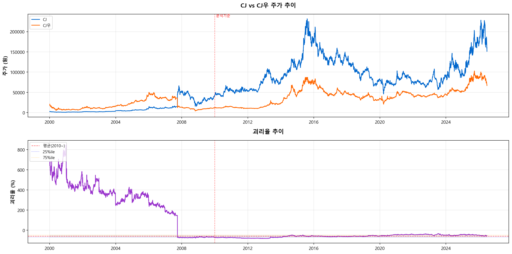

---

## 📌 대상 (001680) vs 대상우 (001685)

**분석 기간**: 2010-01-04 ~ 2026-06-26 (4,053일)
**전체 데이터**: 2005-09-29 ~ 2026-06-26 (5,123일) — 2010년 이전은 참고용

### 현재 상황

| 항목 | 값 |
|:----:|:---|
| 대상 | 15,980원 |
| 대상우 | 14,160원 |
| **현재 괴리율** | **-11.39%** |
| 우선주 할인율 | 11.39% |
| 역사적 위치 | 하위 98.1% |
| Z-Score | 1.77σ |
| 종합 점수 | -80점 (±100점 만점) |
| **판정** | **🟥 보통주 강력 매수** |

**판정 근거:**

- ❌ 역사적 상위 10% (우선주 매우 고평가)
- ❌ 평균 대비 1.5σ 이상 높음
- ❌ 최근 30일 평균보다 1%p 이상 높음

### 괴리율 통계 (2010년~)

| 지표 | 값 |
|:----:|:---|
| 평균 | -49.80% |
| 중간값 | -54.97% |
| 표준편차 | 21.75% |
| 최소 (우선주 최저평가) | -85.54% |
| 최대 (우선주 최고평가) | 54.56% |

| 백분위 | 괴리율 | 의미 |
|:-----:|:------:|:-----|
| 10% | -77.64% | 우선주 매우 저평가 |
| 25% | -67.07% | 우선주 저평가 |
| 50% | -54.97% | 중간값 |
| 75% | -28.50% | 우선주 고평가 |
| 90% | -22.24% | 우선주 매우 고평가 |

**📎 참고: 전체 기간 (2005-09-29~) 통계 비교**

| 지표 | 2010년 이후 | 전체 기간 |
|:----:|:----------:|:---------:|
| 평균 | -49.80% | -53.26% |
| 중간값 | -54.97% | -59.21% |
| 표준편차 | 21.75% | 20.60% |
| 최소 | -85.54% | -85.54% |
| 최대 | 54.56% | 54.56% |

### 기간별 괴리율

| 기간 | 평균 | 최소 | 최대 | 현재 대비 |
|:----:|:----:|:----:|:----:|:---------:|
| 최근 1개월 | -18.80% | -23.65% | -11.39% | +7.41%p |
| 최근 3개월 | -19.70% | -26.25% | -11.39% | +8.31%p |
| 최근 6개월 | -20.58% | -26.25% | -11.39% | +9.19%p |
| 최근 1년 | -23.15% | -33.74% | -11.39% | +11.76%p |
| 최근 3년 | -22.13% | -33.74% | 54.56% | +10.74%p |
| 최근 5년 | -29.41% | -58.52% | 54.56% | +18.02%p |

### 시장 상황별 괴리율

| 구분 | 기간 | 평균 괴리율 | 중간값 |
|:----:|:----:|:----------:|:------:|
| 상승장 | 1214일 (30.0%) | -58.74% | -63.67% |
| 하락장 | 991일 (24.5%) | -48.67% | -53.84% |
| 중립장 | 1848일 (45.6%) | -44.54% | -46.83% |

### 역사적 극단값 (Top 5)

**🟦 우선주 최저평가 시점 (괴리율 최저)**

| 날짜 | 대상 | 대상우 | 괴리율 |
|:----:|--------:|----------:|:------:|
| 2013-03-26 | 25,069원 | 3,624원 | **-85.54%** |
| 2013-03-27 | 26,159원 | 3,806원 | **-85.45%** |
| 2013-03-22 | 24,742원 | 3,600원 | **-85.45%** |
| 2013-03-28 | 26,631원 | 3,878원 | **-85.44%** |
| 2013-03-15 | 24,197원 | 3,528원 | **-85.42%** |

**🟥 보통주 최저평가 시점 (괴리율 최고)**

| 날짜 | 대상 | 대상우 | 괴리율 |
|:----:|--------:|----------:|:------:|
| 2023-12-18 | 18,434원 | 28,493원 | **54.56%** |
| 2023-12-14 | 18,835원 | 28,667원 | **52.20%** |
| 2023-12-19 | 18,390원 | 26,965원 | **46.63%** |
| 2023-12-15 | 18,568원 | 27,053원 | **45.70%** |
| 2023-12-20 | 18,657원 | 26,005원 | **39.39%** |

### 차트

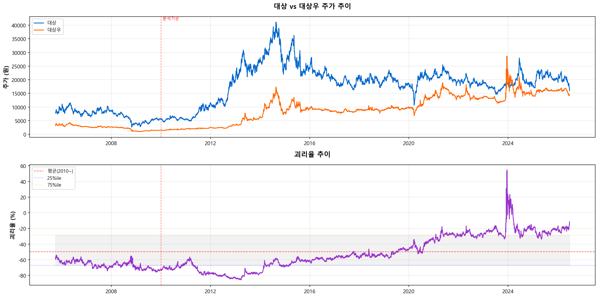

---

## 📌 SK (034730) vs SK우 (03473K)

**분석 기간**: 2015-08-17 ~ 2026-06-26 (2,659일)

### 현재 상황

| 항목 | 값 |
|:----:|:---|
| SK | 824,000원 |
| SK우 | 456,500원 |
| **현재 괴리율** | **-44.60%** |
| 우선주 할인율 | 44.60% |
| 역사적 위치 | 하위 20.3% |
| Z-Score | -1.07σ |
| 종합 점수 | 55점 (±100점 만점) |
| **판정** | **🟦 우선주 강력 매수** |

**판정 근거:**

- ✅ 역사적 하위 25% (우선주 저평가)
- ✅ 평균 대비 1.0σ 이상 낮음
- ✅ 최근 30일 평균보다 1%p 이상 낮음

### 괴리율 통계

| 지표 | 값 |
|:----:|:---|
| 평균 | -27.47% |
| 중간값 | -23.41% |
| 표준편차 | 16.04% |
| 최소 (우선주 최저평가) | -53.66% |
| 최대 (우선주 최고평가) | 50.62% |

| 백분위 | 괴리율 | 의미 |
|:-----:|:------:|:-----|
| 10% | -47.89% | 우선주 매우 저평가 |
| 25% | -43.63% | 우선주 저평가 |
| 50% | -23.41% | 중간값 |
| 75% | -14.13% | 우선주 고평가 |
| 90% | -10.33% | 우선주 매우 고평가 |

### 기간별 괴리율

| 기간 | 평균 | 최소 | 최대 | 현재 대비 |
|:----:|:----:|:----:|:----:|:---------:|
| 최근 1개월 | -36.43% | -44.60% | -26.78% | -8.17%p |
| 최근 3개월 | -30.80% | -44.60% | -22.40% | -13.79%p |
| 최근 6개월 | -28.22% | -44.60% | -15.24% | -16.38%p |
| 최근 1년 | -22.64% | -44.60% | -7.52% | -21.95%p |
| 최근 3년 | -18.11% | -44.60% | 15.96% | -26.49%p |
| 최근 5년 | -19.11% | -53.55% | 50.62% | -25.49%p |

### 시장 상황별 괴리율

| 구분 | 기간 | 평균 괴리율 | 중간값 |
|:----:|:----:|:----------:|:------:|
| 상승장 | 639일 (24.0%) | -26.82% | -25.71% |
| 하락장 | 630일 (23.7%) | -21.48% | -15.91% |
| 중립장 | 1390일 (52.3%) | -30.49% | -33.46% |

### 역사적 극단값 (Top 5)

**🟦 우선주 최저평가 시점 (괴리율 최저)**

| 날짜 | SK | SK우 | 괴리율 |
|:----:|--------:|----------:|:------:|
| 2018-12-21 | 212,815원 | 98,612원 | **-53.66%** |
| 2018-12-19 | 215,997원 | 100,117원 | **-53.65%** |
| 2018-05-18 | 240,125원 | 111,374원 | **-53.62%** |
| 2019-01-17 | 215,796원 | 100,229원 | **-53.55%** |
| 2018-12-17 | 218,782원 | 101,623원 | **-53.55%** |

**🟥 보통주 최저평가 시점 (괴리율 최고)**

| 날짜 | SK | SK우 | 괴리율 |
|:----:|--------:|----------:|:------:|
| 2020-06-30 | 240,677원 | 362,516원 | **50.62%** |
| 2020-06-18 | 254,277원 | 378,368원 | **48.80%** |
| 2020-07-01 | 245,640원 | 361,714원 | **47.25%** |
| 2020-06-17 | 262,107원 | 375,968원 | **43.44%** |
| 2020-06-16 | 253,041원 | 340,371원 | **34.51%** |

### 차트

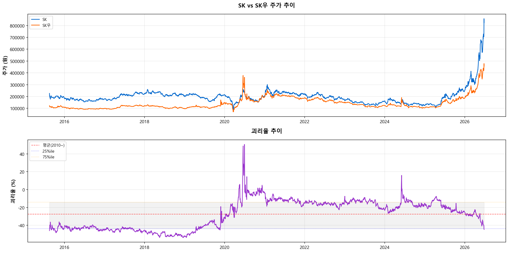

---

## 📌 한화 (000880) vs 한화3우B (00088K)

**분석 기간**: 2016-10-19 ~ 2026-06-26 (2,371일)

### 현재 상황

| 항목 | 값 |
|:----:|:---|
| 한화 | 99,700원 |
| 한화3우B | 35,750원 |
| **현재 괴리율** | **-64.14%** |
| 우선주 할인율 | 64.14% |
| 역사적 위치 | 하위 11.3% |
| Z-Score | -1.33σ |
| 종합 점수 | 45점 (±100점 만점) |
| **판정** | **🟦 우선주 강력 매수** |

**판정 근거:**

- ✅ 역사적 하위 25% (우선주 저평가)
- ✅ 평균 대비 1.0σ 이상 낮음

### 괴리율 통계

| 지표 | 값 |
|:----:|:---|
| 평균 | -56.26% |
| 중간값 | -56.26% |
| 표준편차 | 5.94% |
| 최소 (우선주 최저평가) | -68.35% |
| 최대 (우선주 최고평가) | -37.82% |

| 백분위 | 괴리율 | 의미 |
|:-----:|:------:|:-----|
| 10% | -64.67% | 우선주 매우 저평가 |
| 25% | -61.25% | 우선주 저평가 |
| 50% | -56.26% | 중간값 |
| 75% | -51.41% | 우선주 고평가 |
| 90% | -48.20% | 우선주 매우 고평가 |

### 기간별 괴리율

| 기간 | 평균 | 최소 | 최대 | 현재 대비 |
|:----:|:----:|:----:|:----:|:---------:|
| 최근 1개월 | -65.02% | -67.00% | -61.38% | +0.88%p |
| 최근 3개월 | -62.69% | -67.00% | -59.20% | -1.45%p |
| 최근 6개월 | -59.88% | -67.00% | -53.61% | -4.26%p |
| 최근 1년 | -58.10% | -67.00% | -44.91% | -6.04%p |
| 최근 3년 | -52.85% | -67.00% | -43.97% | -11.29%p |
| 최근 5년 | -54.00% | -67.00% | -37.82% | -10.15%p |

### 시장 상황별 괴리율

| 구분 | 기간 | 평균 괴리율 | 중간값 |
|:----:|:----:|:----------:|:------:|
| 상승장 | 692일 (29.2%) | -58.19% | -58.36% |
| 하락장 | 532일 (22.4%) | -54.75% | -54.36% |
| 중립장 | 1147일 (48.4%) | -55.81% | -55.10% |

### 역사적 극단값 (Top 5)

**🟦 우선주 최저평가 시점 (괴리율 최저)**

| 날짜 | 한화 | 한화3우B | 괴리율 |
|:----:|--------:|----------:|:------:|
| 2017-08-11 | 41,507원 | 13,138원 | **-68.35%** |
| 2017-08-16 | 41,831원 | 13,301원 | **-68.20%** |
| 2017-08-18 | 41,912원 | 13,366원 | **-68.11%** |
| 2017-08-24 | 41,669원 | 13,301원 | **-68.08%** |
| 2017-08-14 | 41,102원 | 13,138원 | **-68.04%** |

**🟥 보통주 최저평가 시점 (괴리율 최고)**

| 날짜 | 한화 | 한화3우B | 괴리율 |
|:----:|--------:|----------:|:------:|
| 2020-03-19 | 10,816원 | 6,725원 | **-37.82%** |
| 2020-03-18 | 12,763원 | 7,431원 | **-41.78%** |
| 2020-03-23 | 10,426원 | 5,974원 | **-42.70%** |
| 2020-03-13 | 14,710원 | 8,285원 | **-43.67%** |
| 2020-03-20 | 11,897원 | 6,688원 | **-43.79%** |

### 차트

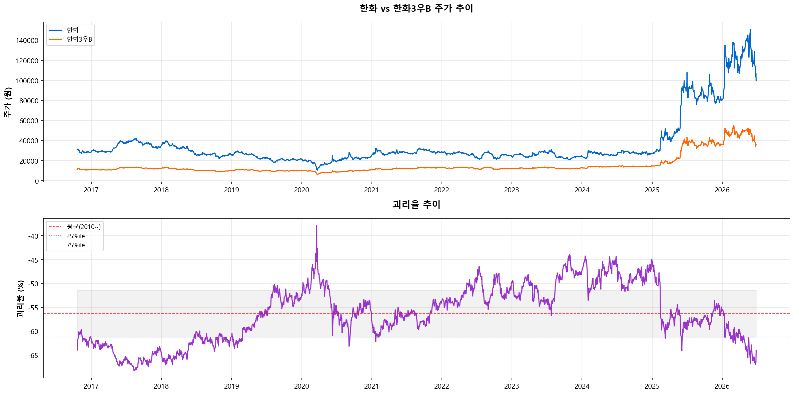

---

## 📌 LG (003550) vs LG우 (003555)

**분석 기간**: 2010-01-04 ~ 2026-06-26 (4,053일)
**전체 데이터**: 2005-09-29 ~ 2026-06-26 (5,123일) — 2010년 이전은 참고용

### 현재 상황

| 항목 | 값 |
|:----:|:---|
| LG | 96,100원 |
| LG우 | 63,900원 |
| **현재 괴리율** | **-33.51%** |
| 우선주 할인율 | 33.51% |
| 역사적 위치 | 하위 69.3% |
| Z-Score | 0.76σ |
| 종합 점수 | -10점 (±100점 만점) |
| **판정** | **⚪ 중립** |

**판정 근거:**

- ❌ 최근 30일 평균보다 1%p 이상 높음

### 괴리율 통계 (2010년~)

| 지표 | 값 |
|:----:|:---|
| 평균 | -46.79% |
| 중간값 | -48.21% |
| 표준편차 | 17.44% |
| 최소 (우선주 최저평가) | -77.01% |
| 최대 (우선주 최고평가) | -12.16% |

| 백분위 | 괴리율 | 의미 |
|:-----:|:------:|:-----|
| 10% | -73.06% | 우선주 매우 저평가 |
| 25% | -56.64% | 우선주 저평가 |
| 50% | -48.21% | 중간값 |
| 75% | -29.53% | 우선주 고평가 |
| 90% | -23.75% | 우선주 매우 고평가 |

**📎 참고: 전체 기간 (2005-09-29~) 통계 비교**

| 지표 | 2010년 이후 | 전체 기간 |
|:----:|:----------:|:---------:|
| 평균 | -46.79% | -50.82% |
| 중간값 | -48.21% | -51.74% |
| 표준편차 | 17.44% | 17.57% |
| 최소 | -77.01% | -77.01% |
| 최대 | -12.16% | -12.16% |

### 기간별 괴리율

| 기간 | 평균 | 최소 | 최대 | 현재 대비 |
|:----:|:----:|:----:|:----:|:---------:|
| 최근 1개월 | -37.29% | -44.99% | -30.01% | +3.78%p |
| 최근 3개월 | -29.52% | -44.99% | -21.36% | -3.99%p |
| 최근 6개월 | -24.33% | -44.99% | -13.17% | -9.18%p |
| 최근 1년 | -21.78% | -44.99% | -12.16% | -11.73%p |
| 최근 3년 | -25.00% | -44.99% | -12.16% | -8.51%p |
| 최근 5년 | -31.17% | -53.92% | -12.16% | -2.34%p |

### 시장 상황별 괴리율

| 구분 | 기간 | 평균 괴리율 | 중간값 |
|:----:|:----:|:----------:|:------:|
| 상승장 | 956일 (23.6%) | -48.85% | -49.82% |
| 하락장 | 812일 (20.0%) | -47.58% | -47.68% |
| 중립장 | 2285일 (56.4%) | -45.66% | -47.91% |

### 역사적 극단값 (Top 5)

**🟦 우선주 최저평가 시점 (괴리율 최저)**

| 날짜 | LG | LG우 | 괴리율 |
|:----:|--------:|----------:|:------:|
| 2011-04-22 | 73,676원 | 16,936원 | **-77.01%** |
| 2011-04-21 | 73,158원 | 16,936원 | **-76.85%** |
| 2011-04-20 | 71,385원 | 16,775원 | **-76.50%** |
| 2011-04-25 | 73,380원 | 17,285원 | **-76.44%** |
| 2011-05-18 | 73,084원 | 17,258원 | **-76.39%** |

**🟥 보통주 최저평가 시점 (괴리율 최고)**

| 날짜 | LG | LG우 | 괴리율 |
|:----:|--------:|----------:|:------:|
| 2025-04-11 | 59,276원 | 52,067원 | **-12.16%** |
| 2025-04-10 | 58,698원 | 51,400원 | **-12.43%** |
| 2025-10-10 | 69,618원 | 60,447원 | **-13.17%** |
| 2025-04-09 | 56,385원 | 48,825원 | **-13.41%** |
| 2025-10-01 | 69,618원 | 59,963원 | **-13.87%** |

### 차트

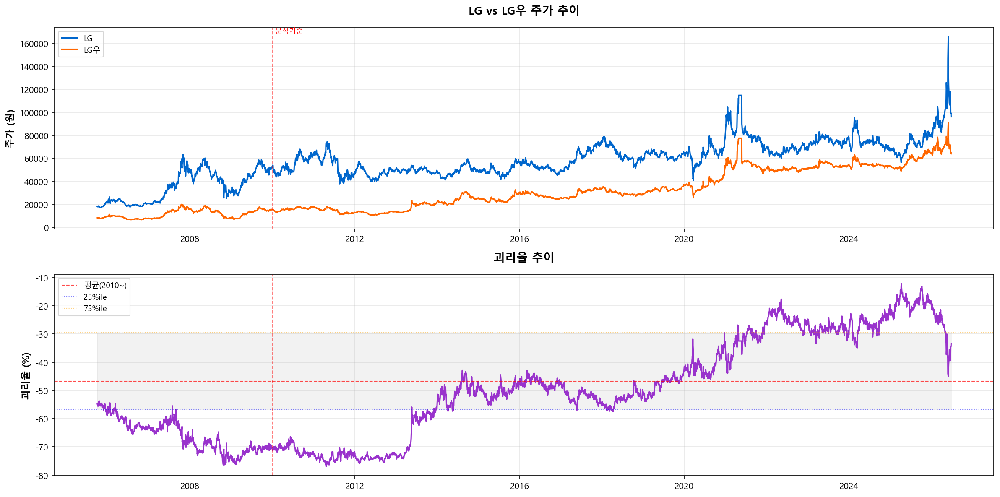

---

## 📌 GS (078930) vs GS우 (078935)

**분석 기간**: 2010-01-04 ~ 2026-06-26 (4,053일)
**전체 데이터**: 2005-09-29 ~ 2026-06-26 (5,123일) — 2010년 이전은 참고용

### 현재 상황

| 항목 | 값 |
|:----:|:---|
| GS | 62,300원 |
| GS우 | 50,100원 |
| **현재 괴리율** | **-19.58%** |
| 우선주 할인율 | 19.58% |
| 역사적 위치 | 하위 77.8% |
| Z-Score | 0.91σ |
| 종합 점수 | -35점 (±100점 만점) |
| **판정** | **🟥 보통주 매수** |

**판정 근거:**

- ❌ 역사적 상위 25% (우선주 고평가)
- ❌ 최근 30일 평균보다 1%p 이상 높음

### 괴리율 통계 (2010년~)

| 지표 | 값 |
|:----:|:---|
| 평균 | -38.43% |
| 중간값 | -37.90% |
| 표준편차 | 20.77% |
| 최소 (우선주 최저평가) | -78.71% |
| 최대 (우선주 최고평가) | 1.02% |

| 백분위 | 괴리율 | 의미 |
|:-----:|:------:|:-----|
| 10% | -72.12% | 우선주 매우 저평가 |
| 25% | -53.46% | 우선주 저평가 |
| 50% | -37.90% | 중간값 |
| 75% | -20.94% | 우선주 고평가 |
| 90% | -13.71% | 우선주 매우 고평가 |

**📎 참고: 전체 기간 (2005-09-29~) 통계 비교**

| 지표 | 2010년 이후 | 전체 기간 |
|:----:|:----------:|:---------:|
| 평균 | -38.43% | -42.45% |
| 중간값 | -37.90% | -42.89% |
| 표준편차 | 20.77% | 20.18% |
| 최소 | -78.71% | -78.71% |
| 최대 | 1.02% | 1.02% |

### 기간별 괴리율

| 기간 | 평균 | 최소 | 최대 | 현재 대비 |
|:----:|:----:|:----:|:----:|:---------:|
| 최근 1개월 | -25.43% | -29.55% | -19.58% | +5.85%p |
| 최근 3개월 | -22.32% | -29.55% | -14.93% | +2.74%p |
| 최근 6개월 | -18.56% | -29.55% | -4.90% | -1.02%p |
| 최근 1년 | -12.37% | -29.55% | 0.36% | -7.21%p |
| 최근 3년 | -15.67% | -29.71% | 1.02% | -3.91%p |
| 최근 5년 | -19.68% | -38.59% | 1.02% | +0.10%p |

### 시장 상황별 괴리율

| 구분 | 기간 | 평균 괴리율 | 중간값 |
|:----:|:----:|:----------:|:------:|
| 상승장 | 1156일 (28.5%) | -43.30% | -43.28% |
| 하락장 | 863일 (21.3%) | -39.38% | -38.02% |
| 중립장 | 2034일 (50.2%) | -35.26% | -35.53% |

### 역사적 극단값 (Top 5)

**🟦 우선주 최저평가 시점 (괴리율 최저)**

| 날짜 | GS | GS우 | 괴리율 |
|:----:|--------:|----------:|:------:|
| 2011-04-21 | 57,127원 | 12,160원 | **-78.71%** |
| 2011-03-29 | 53,799원 | 11,500원 | **-78.62%** |
| 2011-04-25 | 56,018원 | 12,011원 | **-78.56%** |
| 2011-04-22 | 55,741원 | 12,011원 | **-78.45%** |
| 2011-04-07 | 52,524원 | 11,372원 | **-78.35%** |

**🟥 보통주 최저평가 시점 (괴리율 최고)**

| 날짜 | GS | GS우 | 괴리율 |
|:----:|--------:|----------:|:------:|
| 2024-07-26 | 42,470원 | 42,905원 | **1.02%** |
| 2025-02-28 | 34,575원 | 34,699원 | **0.36%** |
| 2025-03-04 | 34,239원 | 34,176원 | **-0.18%** |
| 2025-03-05 | 34,287원 | 34,176원 | **-0.32%** |
| 2025-04-09 | 33,472원 | 33,178원 | **-0.88%** |

### 차트

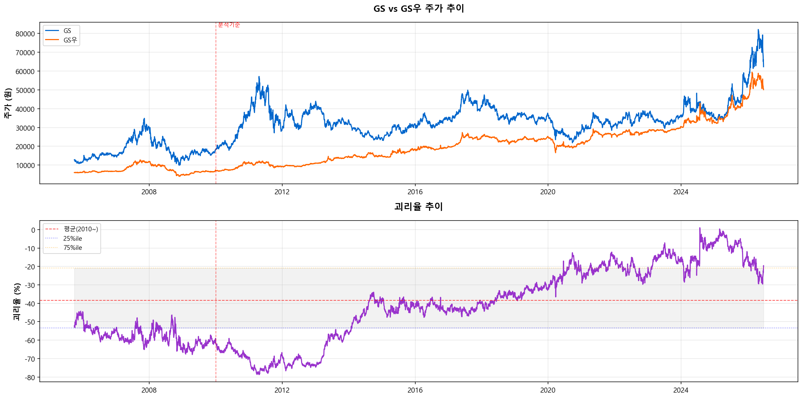

---

## 📌 두산 (000150) vs 두산우 (000155)

**분석 기간**: 2010-01-04 ~ 2026-06-26 (4,053일)
**전체 데이터**: 2000-01-04 ~ 2026-06-26 (6,620일) — 2010년 이전은 참고용

### 현재 상황

| 항목 | 값 |
|:----:|:---|
| 두산 | 1,419,000원 |
| 두산우 | 486,000원 |
| **현재 괴리율** | **-65.75%** |
| 우선주 할인율 | 65.75% |
| 역사적 위치 | 하위 24.3% |
| Z-Score | -0.83σ |
| 종합 점수 | 25점 (±100점 만점) |
| **판정** | **🟦 우선주 매수** |

**판정 근거:**

- ✅ 역사적 하위 25% (우선주 저평가)

### 괴리율 통계 (2010년~)

| 지표 | 값 |
|:----:|:---|
| 평균 | -50.09% |
| 중간값 | -46.75% |
| 표준편차 | 18.84% |
| 최소 (우선주 최저평가) | -84.18% |
| 최대 (우선주 최고평가) | 2.80% |

| 백분위 | 괴리율 | 의미 |
|:-----:|:------:|:-----|
| 10% | -79.50% | 우선주 매우 저평가 |
| 25% | -65.20% | 우선주 저평가 |
| 50% | -46.75% | 중간값 |
| 75% | -37.32% | 우선주 고평가 |
| 90% | -27.05% | 우선주 매우 고평가 |

**📎 참고: 전체 기간 (2000-01-04~) 통계 비교**

| 지표 | 2010년 이후 | 전체 기간 |
|:----:|:----------:|:---------:|
| 평균 | -50.09% | -59.85% |
| 중간값 | -46.75% | -67.52% |
| 표준편차 | 18.84% | 19.46% |
| 최소 | -84.18% | -89.30% |
| 최대 | 2.80% | 2.80% |

### 기간별 괴리율

| 기간 | 평균 | 최소 | 최대 | 현재 대비 |
|:----:|:----:|:----:|:----:|:---------:|
| 최근 1개월 | -64.77% | -70.41% | -59.11% | -0.98%p |
| 최근 3개월 | -58.92% | -70.41% | -45.91% | -6.83%p |
| 최근 6개월 | -49.55% | -70.41% | -34.14% | -16.20%p |
| 최근 1년 | -47.16% | -70.41% | -22.69% | -18.60%p |
| 최근 3년 | -44.70% | -70.41% | -15.67% | -21.05%p |
| 최근 5년 | -37.30% | -70.41% | 2.80% | -28.45%p |

### 시장 상황별 괴리율

| 구분 | 기간 | 평균 괴리율 | 중간값 |
|:----:|:----:|:----------:|:------:|
| 상승장 | 1449일 (35.8%) | -52.32% | -49.51% |
| 하락장 | 1047일 (25.8%) | -43.76% | -40.97% |
| 중립장 | 1557일 (38.4%) | -52.26% | -47.68% |

### 역사적 극단값 (Top 5)

**🟦 우선주 최저평가 시점 (괴리율 최저)**

| 날짜 | 두산 | 두산우 | 괴리율 |
|:----:|--------:|----------:|:------:|
| 2012-02-09 | 119,456원 | 18,901원 | **-84.18%** |
| 2012-02-06 | 118,030원 | 18,901원 | **-83.99%** |
| 2012-02-10 | 117,317원 | 18,953원 | **-83.84%** |
| 2012-02-03 | 116,960원 | 18,901원 | **-83.84%** |
| 2012-02-15 | 119,100원 | 19,290원 | **-83.80%** |

**🟥 보통주 최저평가 시점 (괴리율 최고)**

| 날짜 | 두산 | 두산우 | 괴리율 |
|:----:|--------:|----------:|:------:|
| 2020-06-18 | 37,870원 | 38,929원 | **2.80%** |
| 2020-03-26 | 33,079원 | 32,229원 | **-2.57%** |
| 2020-03-18 | 29,283원 | 28,285원 | **-3.41%** |
| 2020-06-19 | 36,604원 | 35,324원 | **-3.50%** |
| 2020-06-17 | 38,457원 | 36,554원 | **-4.95%** |

### 차트

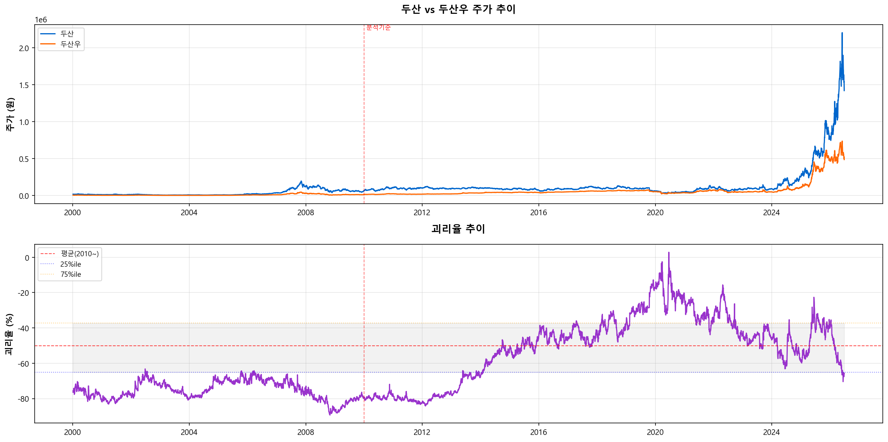

---

## 📌 아모레퍼시픽 (090430) vs 아모레퍼시픽우 (090435)

**분석 기간**: 2010-01-04 ~ 2026-06-26 (4,053일)
**전체 데이터**: 2006-06-29 ~ 2026-06-26 (4,934일) — 2010년 이전은 참고용

### 현재 상황

| 항목 | 값 |
|:----:|:---|
| 아모레퍼시픽 | 95,300원 |
| 아모레퍼시픽우 | 33,950원 |
| **현재 괴리율** | **-64.38%** |
| 우선주 할인율 | 64.38% |
| 역사적 위치 | 하위 53.7% |
| Z-Score | -0.08σ |
| 종합 점수 | -10점 (±100점 만점) |
| **판정** | **⚪ 중립** |

**판정 근거:**

- ❌ 최근 30일 평균보다 1%p 이상 높음

### 괴리율 통계 (2010년~)

| 지표 | 값 |
|:----:|:---|
| 평균 | -63.56% |
| 중간값 | -65.68% |
| 표준편차 | 10.22% |
| 최소 (우선주 최저평가) | -81.90% |
| 최대 (우선주 최고평가) | -39.31% |

| 백분위 | 괴리율 | 의미 |
|:-----:|:------:|:-----|
| 10% | -76.66% | 우선주 매우 저평가 |
| 25% | -72.00% | 우선주 저평가 |
| 50% | -65.68% | 중간값 |
| 75% | -54.44% | 우선주 고평가 |
| 90% | -48.99% | 우선주 매우 고평가 |

**📎 참고: 전체 기간 (2006-06-29~) 통계 비교**

| 지표 | 2010년 이후 | 전체 기간 |
|:----:|:----------:|:---------:|
| 평균 | -63.56% | -65.31% |
| 중간값 | -65.68% | -66.96% |
| 표준편차 | 10.22% | 10.46% |
| 최소 | -81.90% | -87.29% |
| 최대 | -39.31% | -39.31% |

### 기간별 괴리율

| 기간 | 평균 | 최소 | 최대 | 현재 대비 |
|:----:|:----:|:----:|:----:|:---------:|
| 최근 1개월 | -66.41% | -68.92% | -63.91% | +2.03%p |
| 최근 3개월 | -65.64% | -68.92% | -63.23% | +1.26%p |
| 최근 6개월 | -65.26% | -68.92% | -62.39% | +0.89%p |
| 최근 1년 | -67.10% | -72.57% | -62.39% | +2.73%p |
| 최근 3년 | -67.85% | -75.83% | -51.56% | +3.48%p |
| 최근 5년 | -65.35% | -75.83% | -46.91% | +0.97%p |

### 시장 상황별 괴리율

| 구분 | 기간 | 평균 괴리율 | 중간값 |
|:----:|:----:|:----------:|:------:|
| 상승장 | 1298일 (32.0%) | -64.10% | -64.87% |
| 하락장 | 1231일 (30.4%) | -61.84% | -64.44% |
| 중립장 | 1524일 (37.6%) | -64.48% | -66.39% |

### 역사적 극단값 (Top 5)

**🟦 우선주 최저평가 시점 (괴리율 최저)**

| 날짜 | 아모레퍼시픽 | 아모레퍼시픽우 | 괴리율 |
|:----:|--------:|----------:|:------:|
| 2011-10-27 | 118,892원 | 21,517원 | **-81.90%** |
| 2011-10-05 | 114,761원 | 21,201원 | **-81.53%** |
| 2011-10-25 | 111,364원 | 20,609원 | **-81.49%** |
| 2011-06-02 | 118,066원 | 21,912원 | **-81.44%** |
| 2011-10-06 | 117,331원 | 21,833원 | **-81.39%** |

**🟥 보통주 최저평가 시점 (괴리율 최고)**

| 날짜 | 아모레퍼시픽 | 아모레퍼시픽우 | 괴리율 |
|:----:|--------:|----------:|:------:|
| 2017-05-02 | 273,856원 | 166,209원 | **-39.31%** |
| 2017-05-04 | 296,086원 | 178,600원 | **-39.68%** |
| 2017-01-09 | 282,370원 | 168,345원 | **-40.38%** |
| 2017-04-28 | 276,221원 | 162,364원 | **-41.22%** |
| 2017-05-08 | 315,006원 | 185,009원 | **-41.27%** |

### 차트

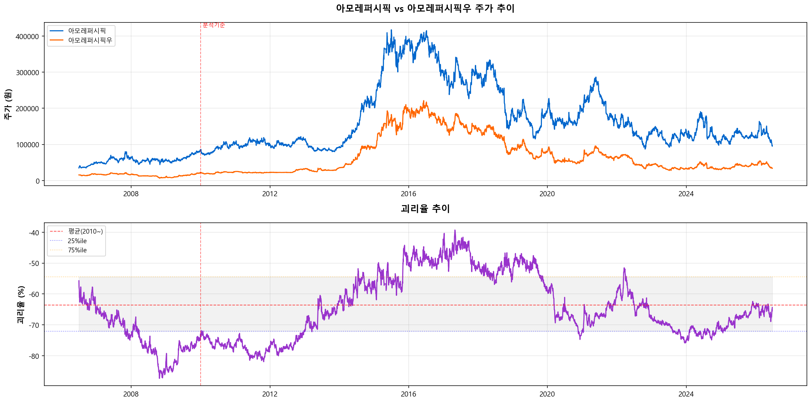

---

## 📌 LG화학 (051910) vs LG화학우 (051915)

**분석 기간**: 2010-01-04 ~ 2026-06-26 (4,053일)
**전체 데이터**: 2005-09-29 ~ 2026-06-26 (5,123일) — 2010년 이전은 참고용

### 현재 상황

| 항목 | 값 |
|:----:|:---|
| LG화학 | 269,000원 |
| LG화학우 | 136,800원 |
| **현재 괴리율** | **-49.14%** |
| 우선주 할인율 | 49.14% |
| 역사적 위치 | 하위 55.9% |
| Z-Score | 0.19σ |
| 종합 점수 | -10점 (±100점 만점) |
| **판정** | **⚪ 중립** |

**판정 근거:**

- ❌ 최근 30일 평균보다 1%p 이상 높음

### 괴리율 통계 (2010년~)

| 지표 | 값 |
|:----:|:---|
| 평균 | -51.49% |
| 중간값 | -50.49% |
| 표준편차 | 12.52% |
| 최소 (우선주 최저평가) | -75.07% |
| 최대 (우선주 최고평가) | -24.75% |

| 백분위 | 괴리율 | 의미 |
|:-----:|:------:|:-----|
| 10% | -71.58% | 우선주 매우 저평가 |
| 25% | -57.59% | 우선주 저평가 |
| 50% | -50.49% | 중간값 |
| 75% | -40.68% | 우선주 고평가 |
| 90% | -35.50% | 우선주 매우 고평가 |

**📎 참고: 전체 기간 (2005-09-29~) 통계 비교**

| 지표 | 2010년 이후 | 전체 기간 |
|:----:|:----------:|:---------:|
| 평균 | -51.49% | -53.89% |
| 중간값 | -50.49% | -53.31% |
| 표준편차 | 12.52% | 12.59% |
| 최소 | -75.07% | -75.07% |
| 최대 | -24.75% | -24.75% |

### 기간별 괴리율

| 기간 | 평균 | 최소 | 최대 | 현재 대비 |
|:----:|:----:|:----:|:----:|:---------:|
| 최근 1개월 | -53.24% | -55.29% | -49.14% | +4.10%p |
| 최근 3개월 | -52.28% | -55.29% | -49.00% | +3.13%p |
| 최근 6개월 | -51.27% | -55.29% | -47.58% | +2.13%p |
| 최근 1년 | -49.96% | -55.29% | -36.03% | +0.81%p |
| 최근 3년 | -46.50% | -59.07% | -29.16% | -2.64%p |
| 최근 5년 | -49.08% | -60.34% | -29.16% | -0.06%p |

### 시장 상황별 괴리율

| 구분 | 기간 | 평균 괴리율 | 중간값 |
|:----:|:----:|:----------:|:------:|
| 상승장 | 1267일 (31.3%) | -53.31% | -52.66% |
| 하락장 | 1178일 (29.1%) | -48.52% | -47.84% |
| 중립장 | 1608일 (39.7%) | -52.23% | -50.16% |

### 역사적 극단값 (Top 5)

**🟦 우선주 최저평가 시점 (괴리율 최저)**

| 날짜 | LG화학 | LG화학우 | 괴리율 |
|:----:|--------:|----------:|:------:|
| 2012-04-16 | 301,157원 | 75,089원 | **-75.07%** |
| 2012-04-17 | 296,165원 | 74,381원 | **-74.89%** |
| 2012-04-13 | 307,396원 | 77,214원 | **-74.88%** |
| 2012-07-11 | 253,321원 | 63,897원 | **-74.78%** |
| 2012-10-02 | 279,527원 | 70,555원 | **-74.76%** |

**🟥 보통주 최저평가 시점 (괴리율 최고)**

| 날짜 | LG화학 | LG화학우 | 괴리율 |
|:----:|--------:|----------:|:------:|
| 2014-12-02 | 166,026원 | 124,938원 | **-24.75%** |
| 2014-11-05 | 148,527원 | 111,309원 | **-25.06%** |
| 2014-12-04 | 169,014원 | 123,803원 | **-26.75%** |
| 2014-12-03 | 167,307원 | 122,288원 | **-26.91%** |
| 2014-11-07 | 160,905원 | 116,988원 | **-27.29%** |

### 차트

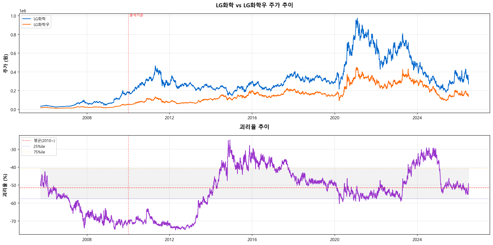

---

## 📌 삼성SDI (006400) vs 삼성SDI우 (006405)

**분석 기간**: 2010-01-04 ~ 2026-06-26 (4,053일)
**전체 데이터**: 2005-09-29 ~ 2026-06-26 (5,123일) — 2010년 이전은 참고용

### 현재 상황

| 항목 | 값 |
|:----:|:---|
| 삼성SDI | 453,500원 |
| 삼성SDI우 | 204,500원 |
| **현재 괴리율** | **-54.91%** |
| 우선주 할인율 | 54.91% |
| 역사적 위치 | 하위 42.6% |
| Z-Score | -0.20σ |
| 종합 점수 | 10점 (±100점 만점) |
| **판정** | **⚪ 중립** |

**판정 근거:**

- ✅ 최근 30일 평균보다 1%p 이상 낮음

### 괴리율 통계 (2010년~)

| 지표 | 값 |
|:----:|:---|
| 평균 | -52.75% |
| 중간값 | -51.83% |
| 표준편차 | 10.73% |
| 최소 (우선주 최저평가) | -72.87% |
| 최대 (우선주 최고평가) | -23.65% |

| 백분위 | 괴리율 | 의미 |
|:-----:|:------:|:-----|
| 10% | -67.70% | 우선주 매우 저평가 |
| 25% | -62.21% | 우선주 저평가 |
| 50% | -51.83% | 중간값 |
| 75% | -44.14% | 우선주 고평가 |
| 90% | -38.70% | 우선주 매우 고평가 |

**📎 참고: 전체 기간 (2005-09-29~) 통계 비교**

| 지표 | 2010년 이후 | 전체 기간 |
|:----:|:----------:|:---------:|
| 평균 | -52.75% | -52.93% |
| 중간값 | -51.83% | -51.97% |
| 표준편차 | 10.73% | 10.38% |
| 최소 | -72.87% | -72.87% |
| 최대 | -23.65% | -23.65% |

### 기간별 괴리율

| 기간 | 평균 | 최소 | 최대 | 현재 대비 |
|:----:|:----:|:----:|:----:|:---------:|
| 최근 1개월 | -53.90% | -56.98% | -49.47% | -1.01%p |
| 최근 3개월 | -49.70% | -56.98% | -40.00% | -5.20%p |
| 최근 6개월 | -45.52% | -56.98% | -36.47% | -9.39%p |
| 최근 1년 | -41.94% | -56.98% | -32.82% | -12.96%p |
| 최근 3년 | -45.69% | -56.98% | -32.82% | -9.21%p |
| 최근 5년 | -47.06% | -63.81% | -23.65% | -7.84%p |

### 시장 상황별 괴리율

| 구분 | 기간 | 평균 괴리율 | 중간값 |
|:----:|:----:|:----------:|:------:|
| 상승장 | 1365일 (33.7%) | -52.88% | -53.07% |
| 하락장 | 1146일 (28.3%) | -49.48% | -47.57% |
| 중립장 | 1542일 (38.0%) | -55.07% | -55.79% |

### 역사적 극단값 (Top 5)

**🟦 우선주 최저평가 시점 (괴리율 최저)**

| 날짜 | 삼성SDI | 삼성SDI우 | 괴리율 |
|:----:|--------:|----------:|:------:|
| 2012-08-20 | 141,303원 | 38,343원 | **-72.87%** |
| 2012-05-15 | 155,760원 | 42,906원 | **-72.45%** |
| 2012-08-21 | 138,505원 | 38,343원 | **-72.32%** |
| 2012-08-22 | 137,572원 | 38,257원 | **-72.19%** |
| 2012-05-21 | 145,967원 | 40,816원 | **-72.04%** |

**🟥 보통주 최저평가 시점 (괴리율 최고)**

| 날짜 | 삼성SDI | 삼성SDI우 | 괴리율 |
|:----:|--------:|----------:|:------:|
| 2021-01-27 | 781,721원 | 596,871원 | **-23.65%** |
| 2021-01-28 | 759,924원 | 573,311원 | **-24.56%** |
| 2021-03-17 | 633,105원 | 465,324원 | **-26.50%** |
| 2021-03-18 | 655,893원 | 481,522원 | **-26.59%** |
| 2020-06-11 | 383,254원 | 279,723원 | **-27.01%** |

### 차트

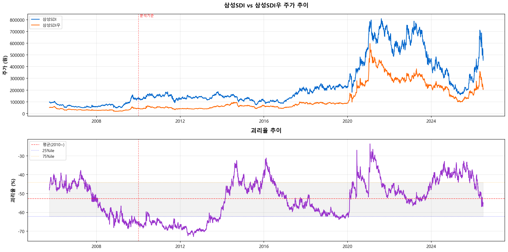

---

## 📌 LG전자 (066570) vs LG전자우 (066575)

**분석 기간**: 2010-01-04 ~ 2026-06-26 (4,053일)
**전체 데이터**: 2005-09-29 ~ 2026-06-26 (5,123일) — 2010년 이전은 참고용

### 현재 상황

| 항목 | 값 |
|:----:|:---|
| LG전자 | 187,800원 |
| LG전자우 | 68,600원 |
| **현재 괴리율** | **-63.47%** |
| 우선주 할인율 | 63.47% |
| 역사적 위치 | 하위 32.7% |
| Z-Score | -0.44σ |
| 종합 점수 | -10점 (±100점 만점) |
| **판정** | **⚪ 중립** |

**판정 근거:**

- ❌ 최근 30일 평균보다 1%p 이상 높음

### 괴리율 통계 (2010년~)

| 지표 | 값 |
|:----:|:---|
| 평균 | -60.31% |
| 중간값 | -58.98% |
| 표준편차 | 7.21% |
| 최소 (우선주 최저평가) | -77.93% |
| 최대 (우선주 최고평가) | -40.47% |

| 백분위 | 괴리율 | 의미 |
|:-----:|:------:|:-----|
| 10% | -69.98% | 우선주 매우 저평가 |
| 25% | -65.02% | 우선주 저평가 |
| 50% | -58.98% | 중간값 |
| 75% | -54.57% | 우선주 고평가 |
| 90% | -51.94% | 우선주 매우 고평가 |

**📎 참고: 전체 기간 (2005-09-29~) 통계 비교**

| 지표 | 2010년 이후 | 전체 기간 |
|:----:|:----------:|:---------:|
| 평균 | -60.31% | -59.72% |
| 중간값 | -58.98% | -58.86% |
| 표준편차 | 7.21% | 7.22% |
| 최소 | -77.93% | -77.93% |
| 최대 | -40.47% | -40.47% |

### 기간별 괴리율

| 기간 | 평균 | 최소 | 최대 | 현재 대비 |
|:----:|:----:|:----:|:----:|:---------:|
| 최근 1개월 | -65.36% | -70.11% | -61.61% | +1.89%p |
| 최근 3개월 | -58.81% | -70.11% | -53.19% | -4.66%p |
| 최근 6개월 | -53.50% | -70.11% | -40.47% | -9.97%p |
| 최근 1년 | -52.58% | -70.11% | -40.47% | -10.89%p |
| 최근 3년 | -54.35% | -70.11% | -40.47% | -9.12%p |
| 최근 5년 | -56.72% | -70.11% | -40.47% | -6.75%p |

### 시장 상황별 괴리율

| 구분 | 기간 | 평균 괴리율 | 중간값 |
|:----:|:----:|:----------:|:------:|
| 상승장 | 1223일 (30.2%) | -61.04% | -60.19% |
| 하락장 | 1154일 (28.5%) | -59.97% | -58.76% |
| 중립장 | 1676일 (41.4%) | -60.01% | -57.99% |

### 역사적 극단값 (Top 5)

**🟦 우선주 최저평가 시점 (괴리율 최저)**

| 날짜 | LG전자 | LG전자우 | 괴리율 |
|:----:|--------:|----------:|:------:|
| 2012-10-25 | 66,108원 | 14,593원 | **-77.93%** |
| 2012-10-19 | 65,750원 | 14,555원 | **-77.86%** |
| 2012-10-29 | 67,092원 | 14,861원 | **-77.85%** |
| 2012-10-23 | 65,302원 | 14,478원 | **-77.83%** |
| 2012-10-26 | 65,302원 | 14,555원 | **-77.71%** |

**🟥 보통주 최저평가 시점 (괴리율 최고)**

| 날짜 | LG전자 | LG전자우 | 괴리율 |
|:----:|--------:|----------:|:------:|
| 2025-11-07 | 87,630원 | 52,167원 | **-40.47%** |
| 2025-11-06 | 91,004원 | 52,854원 | **-41.92%** |
| 2025-11-10 | 88,920원 | 51,282원 | **-42.33%** |
| 2025-11-13 | 91,798원 | 52,363원 | **-42.96%** |
| 2025-11-11 | 89,912원 | 51,184원 | **-43.07%** |

### 차트

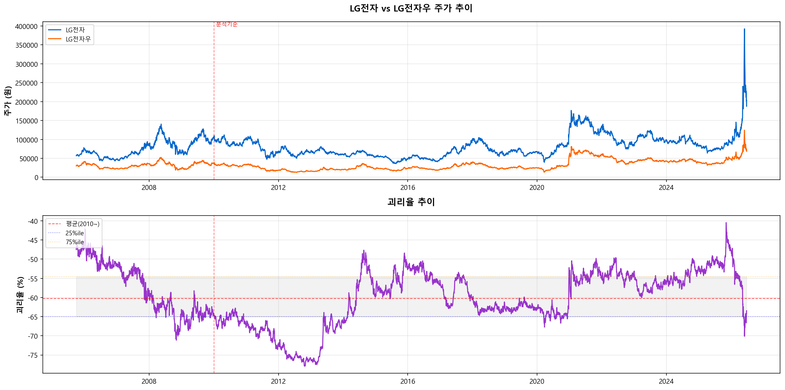

---

## 📌 삼성화재 (000810) vs 삼성화재우 (000815)

**분석 기간**: 2010-01-04 ~ 2026-06-26 (4,053일)
**전체 데이터**: 2005-09-29 ~ 2026-06-26 (5,123일) — 2010년 이전은 참고용

### 현재 상황

| 항목 | 값 |
|:----:|:---|
| 삼성화재 | 627,000원 |
| 삼성화재우 | 408,000원 |
| **현재 괴리율** | **-34.93%** |
| 우선주 할인율 | 34.93% |
| 역사적 위치 | 하위 63.3% |
| Z-Score | 0.52σ |
| 종합 점수 | 0점 (±100점 만점) |
| **판정** | **⚪ 중립** |

### 괴리율 통계 (2010년~)

| 지표 | 값 |
|:----:|:---|
| 평균 | -43.36% |
| 중간값 | -41.05% |
| 표준편차 | 16.20% |
| 최소 (우선주 최저평가) | -75.65% |
| 최대 (우선주 최고평가) | -14.33% |

| 백분위 | 괴리율 | 의미 |
|:-----:|:------:|:-----|
| 10% | -70.42% | 우선주 매우 저평가 |
| 25% | -52.51% | 우선주 저평가 |
| 50% | -41.05% | 중간값 |
| 75% | -28.70% | 우선주 고평가 |
| 90% | -25.17% | 우선주 매우 고평가 |

**📎 참고: 전체 기간 (2005-09-29~) 통계 비교**

| 지표 | 2010년 이후 | 전체 기간 |
|:----:|:----------:|:---------:|
| 평균 | -43.36% | -48.33% |
| 중간값 | -41.05% | -44.71% |
| 표준편차 | 16.20% | 17.51% |
| 최소 | -75.65% | -80.28% |
| 최대 | -14.33% | -14.33% |

### 기간별 괴리율

| 기간 | 평균 | 최소 | 최대 | 현재 대비 |
|:----:|:----:|:----:|:----:|:---------:|
| 최근 1개월 | -35.54% | -43.63% | -29.00% | +0.61%p |
| 최근 3개월 | -25.84% | -43.63% | -14.33% | -9.09%p |
| 최근 6개월 | -25.59% | -43.63% | -14.33% | -9.34%p |
| 최근 1년 | -25.76% | -43.63% | -14.33% | -9.17%p |
| 최근 3년 | -26.38% | -43.63% | -14.33% | -8.54%p |
| 최근 5년 | -29.26% | -46.30% | -14.33% | -5.67%p |

### 시장 상황별 괴리율

| 구분 | 기간 | 평균 괴리율 | 중간값 |
|:----:|:----:|:----------:|:------:|
| 상승장 | 873일 (21.5%) | -41.10% | -35.93% |
| 하락장 | 527일 (13.0%) | -43.42% | -38.19% |
| 중립장 | 2653일 (65.5%) | -44.10% | -42.25% |

### 역사적 극단값 (Top 5)

**🟦 우선주 최저평가 시점 (괴리율 최저)**

| 날짜 | 삼성화재 | 삼성화재우 | 괴리율 |
|:----:|--------:|----------:|:------:|
| 2011-10-25 | 137,503원 | 33,479원 | **-75.65%** |
| 2011-10-31 | 141,059원 | 34,360원 | **-75.64%** |
| 2011-11-01 | 141,948원 | 34,592원 | **-75.63%** |
| 2012-06-01 | 130,266원 | 31,975원 | **-75.45%** |
| 2012-05-14 | 138,106원 | 33,922원 | **-75.44%** |

**🟥 보통주 최저평가 시점 (괴리율 최고)**

| 날짜 | 삼성화재 | 삼성화재우 | 괴리율 |
|:----:|--------:|----------:|:------:|
| 2026-03-27 | 443,000원 | 379,500원 | **-14.33%** |
| 2026-03-26 | 453,000원 | 377,500원 | **-16.67%** |
| 2026-03-23 | 437,373원 | 361,585원 | **-17.33%** |
| 2026-03-20 | 455,617원 | 375,858원 | **-17.51%** |
| 2026-03-30 | 445,500원 | 367,000원 | **-17.62%** |

### 차트

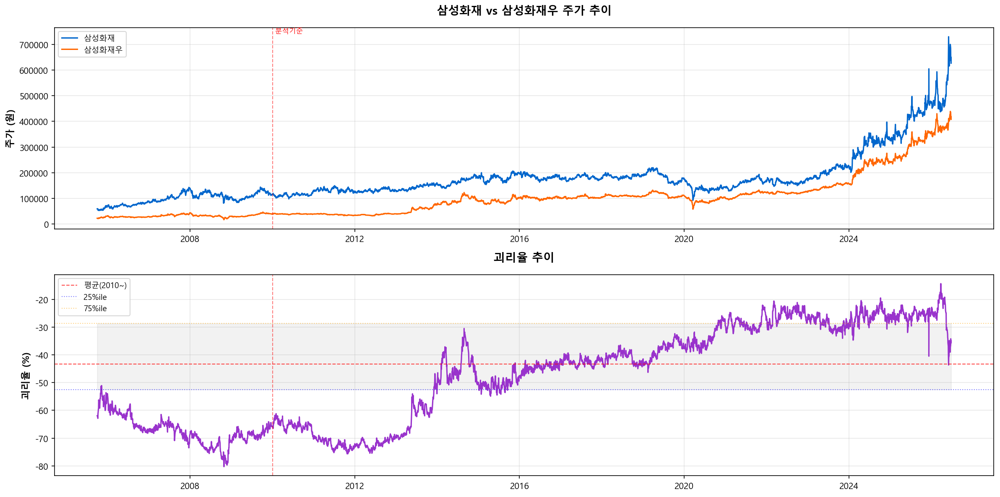

---

## 📌 S-Oil (010950) vs S-Oil우 (010955)

**분석 기간**: 2010-01-04 ~ 2026-06-26 (4,053일)
**전체 데이터**: 2000-01-04 ~ 2026-06-26 (6,620일) — 2010년 이전은 참고용

### 현재 상황

| 항목 | 값 |
|:----:|:---|
| S-Oil | 92,700원 |
| S-Oil우 | 50,900원 |
| **현재 괴리율** | **-45.09%** |
| 우선주 할인율 | 45.09% |
| 역사적 위치 | 하위 32.6% |
| Z-Score | -0.52σ |
| 종합 점수 | -10점 (±100점 만점) |
| **판정** | **⚪ 중립** |

**판정 근거:**

- ❌ 최근 30일 평균보다 1%p 이상 높음

### 괴리율 통계 (2010년~)

| 지표 | 값 |
|:----:|:---|
| 평균 | -40.26% |
| 중간값 | -40.48% |
| 표준편차 | 9.27% |
| 최소 (우선주 최저평가) | -64.19% |
| 최대 (우선주 최고평가) | -17.62% |

| 백분위 | 괴리율 | 의미 |
|:-----:|:------:|:-----|
| 10% | -51.10% | 우선주 매우 저평가 |
| 25% | -46.60% | 우선주 저평가 |
| 50% | -40.48% | 중간값 |
| 75% | -33.61% | 우선주 고평가 |
| 90% | -27.69% | 우선주 매우 고평가 |

**📎 참고: 전체 기간 (2000-01-04~) 통계 비교**

| 지표 | 2010년 이후 | 전체 기간 |
|:----:|:----------:|:---------:|
| 평균 | -40.26% | -41.28% |
| 중간값 | -40.48% | -41.28% |
| 표준편차 | 9.27% | 9.15% |
| 최소 | -64.19% | -67.72% |
| 최대 | -17.62% | 34.47% |

### 기간별 괴리율

| 기간 | 평균 | 최소 | 최대 | 현재 대비 |
|:----:|:----:|:----:|:----:|:---------:|
| 최근 1개월 | -50.08% | -52.87% | -45.09% | +4.99%p |
| 최근 3개월 | -50.88% | -56.50% | -45.09% | +5.79%p |
| 최근 6개월 | -46.47% | -56.50% | -35.96% | +1.38%p |
| 최근 1년 | -40.00% | -56.50% | -29.69% | -5.10%p |
| 최근 3년 | -36.49% | -56.50% | -24.34% | -8.61%p |
| 최근 5년 | -39.39% | -56.50% | -24.34% | -5.70%p |

### 시장 상황별 괴리율

| 구분 | 기간 | 평균 괴리율 | 중간값 |
|:----:|:----:|:----------:|:------:|
| 상승장 | 1340일 (33.1%) | -43.66% | -44.85% |
| 하락장 | 1125일 (27.8%) | -37.97% | -37.03% |
| 중립장 | 1588일 (39.2%) | -39.01% | -38.77% |

### 역사적 극단값 (Top 5)

**🟦 우선주 최저평가 시점 (괴리율 최저)**

| 날짜 | S-Oil | S-Oil우 | 괴리율 |
|:----:|--------:|----------:|:------:|
| 2011-07-27 | 110,438원 | 39,549원 | **-64.19%** |
| 2011-07-28 | 109,748원 | 39,436원 | **-64.07%** |
| 2011-07-26 | 109,748원 | 39,606원 | **-63.91%** |
| 2011-08-03 | 106,642원 | 38,811원 | **-63.61%** |
| 2011-08-01 | 108,022원 | 39,322원 | **-63.60%** |

**🟥 보통주 최저평가 시점 (괴리율 최고)**

| 날짜 | S-Oil | S-Oil우 | 괴리율 |
|:----:|--------:|----------:|:------:|
| 2018-07-03 | 89,651원 | 73,855원 | **-17.62%** |
| 2018-05-11 | 92,672원 | 76,083원 | **-17.90%** |
| 2018-05-14 | 92,672원 | 76,083원 | **-17.90%** |
| 2018-05-10 | 92,672원 | 76,002원 | **-17.99%** |
| 2018-05-30 | 92,672원 | 76,002원 | **-17.99%** |

### 차트

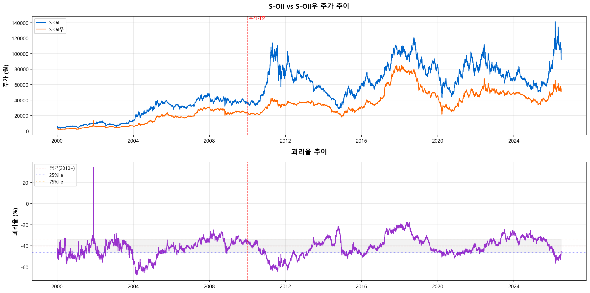

---

## 📌 대한항공 (003490) vs 대한항공우 (003495)

**분석 기간**: 2010-01-04 ~ 2026-06-26 (4,053일)
**전체 데이터**: 2005-09-29 ~ 2026-06-26 (5,123일) — 2010년 이전은 참고용

### 현재 상황

| 항목 | 값 |
|:----:|:---|
| 대한항공 | 27,750원 |
| 대한항공우 | 21,750원 |
| **현재 괴리율** | **-21.62%** |
| 우선주 할인율 | 21.62% |
| 역사적 위치 | 하위 56.4% |
| Z-Score | -0.13σ |
| 종합 점수 | 10점 (±100점 만점) |
| **판정** | **⚪ 중립** |

**판정 근거:**

- ✅ 최근 30일 평균보다 1%p 이상 낮음

### 괴리율 통계 (2010년~)

| 지표 | 값 |
|:----:|:---|
| 평균 | -17.06% |
| 중간값 | -31.25% |
| 표준편차 | 34.20% |
| 최소 (우선주 최저평가) | -65.08% |
| 최대 (우선주 최고평가) | 140.76% |

| 백분위 | 괴리율 | 의미 |
|:-----:|:------:|:-----|
| 10% | -57.04% | 우선주 매우 저평가 |
| 25% | -42.15% | 우선주 저평가 |
| 50% | -31.25% | 중간값 |
| 75% | 9.86% | 우선주 고평가 |
| 90% | 29.46% | 우선주 매우 고평가 |

**📎 참고: 전체 기간 (2005-09-29~) 통계 비교**

| 지표 | 2010년 이후 | 전체 기간 |
|:----:|:----------:|:---------:|
| 평균 | -17.06% | -21.90% |
| 중간값 | -31.25% | -33.14% |
| 표준편차 | 34.20% | 32.37% |
| 최소 | -65.08% | -65.08% |
| 최대 | 140.76% | 140.76% |

### 기간별 괴리율

| 기간 | 평균 | 최소 | 최대 | 현재 대비 |
|:----:|:----:|:----:|:----:|:---------:|
| 최근 1개월 | -15.63% | -23.37% | -7.86% | -5.99%p |
| 최근 3개월 | -8.62% | -23.37% | 0.22% | -13.00%p |
| 최근 6개월 | -1.96% | -23.37% | 12.48% | -19.66%p |
| 최근 1년 | -1.36% | -23.37% | 22.18% | -20.26%p |
| 최근 3년 | 10.10% | -23.37% | 34.63% | -31.72%p |
| 최근 5년 | 15.24% | -41.64% | 140.76% | -36.86%p |

### 시장 상황별 괴리율

| 구분 | 기간 | 평균 괴리율 | 중간값 |
|:----:|:----:|:----------:|:------:|
| 상승장 | 1104일 (27.2%) | -17.75% | -36.56% |
| 하락장 | 1102일 (27.2%) | -22.31% | -31.65% |
| 중립장 | 1847일 (45.6%) | -13.51% | -9.17% |

### 역사적 극단값 (Top 5)

**🟦 우선주 최저평가 시점 (괴리율 최저)**

| 날짜 | 대한항공 | 대한항공우 | 괴리율 |
|:----:|--------:|----------:|:------:|
| 2012-07-06 | 30,430원 | 10,627원 | **-65.08%** |
| 2012-07-10 | 30,253원 | 10,585원 | **-65.01%** |
| 2012-07-05 | 30,371원 | 10,627원 | **-65.01%** |
| 2012-07-11 | 29,900원 | 10,501원 | **-64.88%** |
| 2012-07-19 | 30,488원 | 10,754원 | **-64.73%** |

**🟥 보통주 최저평가 시점 (괴리율 최고)**

| 날짜 | 대한항공 | 대한항공우 | 괴리율 |
|:----:|--------:|----------:|:------:|
| 2020-12-02 | 18,233원 | 43,899원 | **140.76%** |
| 2020-12-03 | 18,374원 | 43,327원 | **135.80%** |
| 2020-12-01 | 18,586원 | 43,459원 | **133.83%** |
| 2020-12-04 | 18,445원 | 41,962원 | **127.50%** |
| 2020-12-08 | 18,833원 | 42,270원 | **124.45%** |

### 차트

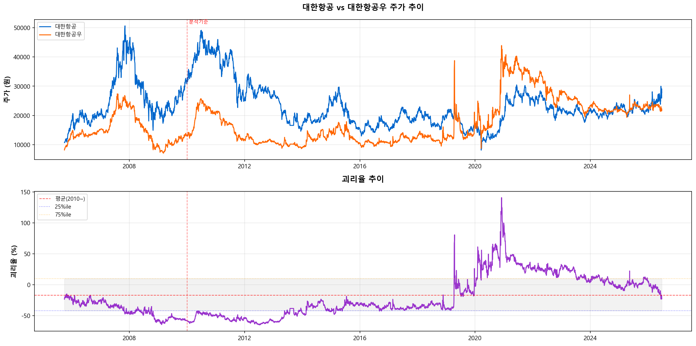

---

## 📌 유한양행 (000100) vs 유한양행우 (000105)

**분석 기간**: 2010-01-04 ~ 2026-06-26 (4,053일)
**전체 데이터**: 2005-09-29 ~ 2026-06-26 (5,123일) — 2010년 이전은 참고용

### 현재 상황

| 항목 | 값 |
|:----:|:---|
| 유한양행 | 66,000원 |
| 유한양행우 | 59,900원 |
| **현재 괴리율** | **-9.24%** |
| 우선주 할인율 | 9.24% |
| 역사적 위치 | 하위 35.6% |
| Z-Score | -0.57σ |
| 종합 점수 | -10점 (±100점 만점) |
| **판정** | **⚪ 중립** |

**판정 근거:**

- ❌ 최근 30일 평균보다 1%p 이상 높음

### 괴리율 통계 (2010년~)

| 지표 | 값 |
|:----:|:---|
| 평균 | 1.15% |
| 중간값 | 4.58% |
| 표준편차 | 18.12% |
| 최소 (우선주 최저평가) | -35.71% |
| 최대 (우선주 최고평가) | 57.25% |

| 백분위 | 괴리율 | 의미 |
|:-----:|:------:|:-----|
| 10% | -24.11% | 우선주 매우 저평가 |
| 25% | -13.66% | 우선주 저평가 |
| 50% | 4.58% | 중간값 |
| 75% | 14.80% | 우선주 고평가 |
| 90% | 23.64% | 우선주 매우 고평가 |

**📎 참고: 전체 기간 (2005-09-29~) 통계 비교**

| 지표 | 2010년 이후 | 전체 기간 |
|:----:|:----------:|:---------:|
| 평균 | 1.15% | 7.65% |
| 중간값 | 4.58% | 8.44% |
| 표준편차 | 18.12% | 23.67% |
| 최소 | -35.71% | -35.71% |
| 최대 | 57.25% | 92.74% |

### 기간별 괴리율

| 기간 | 평균 | 최소 | 최대 | 현재 대비 |
|:----:|:----:|:----:|:----:|:---------:|
| 최근 1개월 | -15.02% | -17.17% | -9.24% | +5.78%p |
| 최근 3개월 | -13.38% | -17.17% | -8.06% | +4.14%p |
| 최근 6개월 | -12.14% | -17.17% | -8.06% | +2.90%p |
| 최근 1년 | -11.18% | -17.17% | -4.80% | +1.94%p |
| 최근 3년 | -4.72% | -23.18% | 45.03% | -4.52%p |
| 최근 5년 | 3.29% | -23.18% | 55.76% | -12.53%p |

### 시장 상황별 괴리율

| 구분 | 기간 | 평균 괴리율 | 중간값 |
|:----:|:----:|:----------:|:------:|
| 상승장 | 1075일 (26.5%) | -2.68% | -4.17% |
| 하락장 | 795일 (19.6%) | 5.54% | 5.79% |
| 중립장 | 2183일 (53.9%) | 1.44% | 6.52% |

### 역사적 극단값 (Top 5)

**🟦 우선주 최저평가 시점 (괴리율 최저)**

| 날짜 | 유한양행 | 유한양행우 | 괴리율 |
|:----:|--------:|----------:|:------:|
| 2013-04-29 | 26,360원 | 16,947원 | **-35.71%** |
| 2015-05-11 | 33,180원 | 21,368원 | **-35.60%** |
| 2015-05-08 | 32,741원 | 21,185원 | **-35.29%** |
| 2013-04-30 | 25,867원 | 16,823원 | **-34.96%** |
| 2015-05-07 | 30,984원 | 20,363원 | **-34.28%** |

**🟥 보통주 최저평가 시점 (괴리율 최고)**

| 날짜 | 유한양행 | 유한양행우 | 괴리율 |
|:----:|--------:|----------:|:------:|
| 2011-08-24 | 13,751원 | 21,624원 | **57.25%** |
| 2020-07-23 | 42,343원 | 65,955원 | **55.76%** |
| 2020-07-27 | 45,045원 | 69,517원 | **54.33%** |
| 2011-02-14 | 17,083원 | 26,000원 | **52.20%** |
| 2011-08-18 | 14,721원 | 22,139원 | **50.39%** |

### 차트

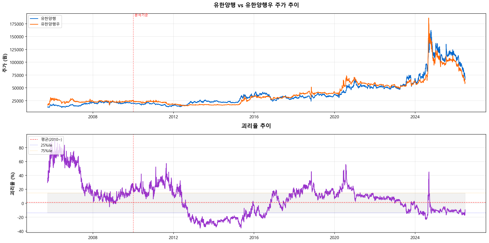

---

## 📌 LG생활건강 (051900) vs LG생활건강우 (051905)

**분석 기간**: 2010-01-04 ~ 2026-06-26 (4,053일)
**전체 데이터**: 2005-09-29 ~ 2026-06-26 (5,123일) — 2010년 이전은 참고용

### 현재 상황

| 항목 | 값 |
|:----:|:---|
| LG생활건강 | 213,000원 |
| LG생활건강우 | 89,800원 |
| **현재 괴리율** | **-57.84%** |
| 우선주 할인율 | 57.84% |
| 역사적 위치 | 하위 45.3% |
| Z-Score | 0.02σ |
| 종합 점수 | 0점 (±100점 만점) |
| **판정** | **⚪ 중립** |

### 괴리율 통계 (2010년~)

| 지표 | 값 |
|:----:|:---|
| 평균 | -58.11% |
| 중간값 | -57.22% |
| 표준편차 | 11.73% |
| 최소 (우선주 최저평가) | -82.82% |
| 최대 (우선주 최고평가) | -35.07% |

| 백분위 | 괴리율 | 의미 |
|:-----:|:------:|:-----|
| 10% | -78.07% | 우선주 매우 저평가 |
| 25% | -62.29% | 우선주 저평가 |
| 50% | -57.22% | 중간값 |
| 75% | -48.58% | 우선주 고평가 |
| 90% | -44.03% | 우선주 매우 고평가 |

**📎 참고: 전체 기간 (2005-09-29~) 통계 비교**

| 지표 | 2010년 이후 | 전체 기간 |
|:----:|:----------:|:---------:|
| 평균 | -58.11% | -60.64% |
| 중간값 | -57.22% | -58.61% |
| 표준편차 | 11.73% | 12.12% |
| 최소 | -82.82% | -86.83% |
| 최대 | -35.07% | -35.07% |

### 기간별 괴리율

| 기간 | 평균 | 최소 | 최대 | 현재 대비 |
|:----:|:----:|:----:|:----:|:---------:|
| 최근 1개월 | -58.32% | -59.69% | -56.45% | +0.48%p |
| 최근 3개월 | -57.07% | -59.69% | -53.15% | -0.77%p |
| 최근 6개월 | -57.73% | -60.84% | -53.15% | -0.11%p |
| 최근 1년 | -59.13% | -63.90% | -53.15% | +1.29%p |
| 최근 3년 | -56.63% | -63.90% | -40.73% | -1.21%p |
| 최근 5년 | -54.10% | -63.90% | -39.62% | -3.74%p |

### 시장 상황별 괴리율

| 구분 | 기간 | 평균 괴리율 | 중간값 |
|:----:|:----:|:----------:|:------:|
| 상승장 | 1086일 (26.8%) | -59.47% | -57.40% |
| 하락장 | 1065일 (26.3%) | -54.75% | -55.99% |
| 중립장 | 1902일 (46.9%) | -59.23% | -57.90% |

### 역사적 극단값 (Top 5)

**🟦 우선주 최저평가 시점 (괴리율 최저)**

| 날짜 | LG생활건강 | LG생활건강우 | 괴리율 |
|:----:|--------:|----------:|:------:|
| 2011-03-31 | 366,198원 | 62,906원 | **-82.82%** |
| 2011-03-30 | 361,303원 | 62,216원 | **-82.78%** |
| 2011-07-12 | 424,932원 | 73,493원 | **-82.70%** |
| 2011-07-11 | 431,606원 | 74,874원 | **-82.65%** |
| 2011-08-18 | 444,955원 | 77,866원 | **-82.50%** |

**🟥 보통주 최저평가 시점 (괴리율 최고)**

| 날짜 | LG생활건강 | LG생활건강우 | 괴리율 |
|:----:|--------:|----------:|:------:|
| 2018-10-31 | 974,804원 | 632,947원 | **-35.07%** |
| 2017-09-25 | 788,546원 | 489,741원 | **-37.89%** |
| 2017-09-26 | 788,546원 | 489,741원 | **-37.89%** |
| 2017-08-08 | 897,886원 | 553,732원 | **-38.33%** |
| 2017-09-13 | 821,904원 | 505,952원 | **-38.44%** |

### 차트

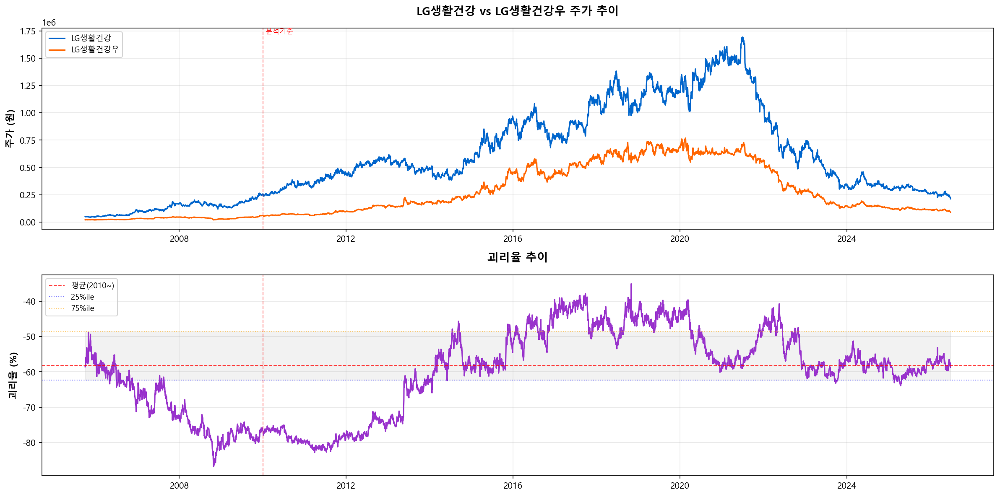

---

## 📌 CJ제일제당 (097950) vs CJ제일제당우 (097955)

**분석 기간**: 2010-01-04 ~ 2026-06-26 (4,053일)
**전체 데이터**: 2007-09-28 ~ 2026-06-26 (4,626일) — 2010년 이전은 참고용

### 현재 상황

| 항목 | 값 |
|:----:|:---|
| CJ제일제당 | 175,000원 |
| CJ제일제당우 | 116,600원 |
| **현재 괴리율** | **-33.37%** |
| 우선주 할인율 | 33.37% |
| 역사적 위치 | 하위 99.8% |
| Z-Score | 2.49σ |
| 종합 점수 | -80점 (±100점 만점) |
| **판정** | **🟥 보통주 강력 매수** |

**판정 근거:**

- ❌ 역사적 상위 10% (우선주 매우 고평가)
- ❌ 평균 대비 1.5σ 이상 높음
- ❌ 최근 30일 평균보다 1%p 이상 높음

### 괴리율 통계 (2010년~)

| 지표 | 값 |
|:----:|:---|
| 평균 | -62.26% |
| 중간값 | -60.83% |
| 표준편차 | 11.58% |
| 최소 (우선주 최저평가) | -85.09% |
| 최대 (우선주 최고평가) | -32.37% |

| 백분위 | 괴리율 | 의미 |
|:-----:|:------:|:-----|
| 10% | -81.15% | 우선주 매우 저평가 |
| 25% | -69.24% | 우선주 저평가 |
| 50% | -60.83% | 중간값 |
| 75% | -55.83% | 우선주 고평가 |
| 90% | -48.86% | 우선주 매우 고평가 |

**📎 참고: 전체 기간 (2007-09-28~) 통계 비교**

| 지표 | 2010년 이후 | 전체 기간 |
|:----:|:----------:|:---------:|
| 평균 | -62.26% | -64.12% |
| 중간값 | -60.83% | -62.09% |
| 표준편차 | 11.58% | 11.94% |
| 최소 | -85.09% | -85.09% |
| 최대 | -32.37% | -32.37% |

### 기간별 괴리율

| 기간 | 평균 | 최소 | 최대 | 현재 대비 |
|:----:|:----:|:----:|:----:|:---------:|
| 최근 1개월 | -37.88% | -41.36% | -33.37% | +4.51%p |
| 최근 3개월 | -38.54% | -43.77% | -32.37% | +5.17%p |
| 최근 6개월 | -37.76% | -43.77% | -32.37% | +4.39%p |
| 최근 1년 | -41.25% | -52.42% | -32.37% | +7.88%p |
| 최근 3년 | -52.17% | -62.92% | -32.37% | +18.80%p |
| 최근 5년 | -55.59% | -67.19% | -32.37% | +22.21%p |

### 시장 상황별 괴리율

| 구분 | 기간 | 평균 괴리율 | 중간값 |
|:----:|:----:|:----------:|:------:|
| 상승장 | 947일 (23.4%) | -64.82% | -61.94% |
| 하락장 | 854일 (21.1%) | -59.01% | -57.52% |
| 중립장 | 2252일 (55.6%) | -62.42% | -61.37% |

### 역사적 극단값 (Top 5)

**🟦 우선주 최저평가 시점 (괴리율 최저)**

| 날짜 | CJ제일제당 | CJ제일제당우 | 괴리율 |
|:----:|--------:|----------:|:------:|
| 2012-05-09 | 315,982원 | 47,119원 | **-85.09%** |
| 2012-04-30 | 315,560원 | 47,187원 | **-85.05%** |
| 2012-05-10 | 313,029원 | 47,051원 | **-84.97%** |
| 2012-05-11 | 310,919원 | 46,778원 | **-84.95%** |
| 2012-05-04 | 312,185원 | 46,983원 | **-84.95%** |

**🟥 보통주 최저평가 시점 (괴리율 최고)**

| 날짜 | CJ제일제당 | CJ제일제당우 | 괴리율 |
|:----:|--------:|----------:|:------:|
| 2026-03-04 | 190,300원 | 128,700원 | **-32.37%** |
| 2026-01-07 | 201,613원 | 135,802원 | **-32.64%** |
| 2026-03-06 | 195,900원 | 131,300원 | **-32.98%** |
| 2025-12-11 | 204,096원 | 136,693원 | **-33.03%** |
| 2026-01-06 | 204,096원 | 136,594원 | **-33.07%** |

### 차트

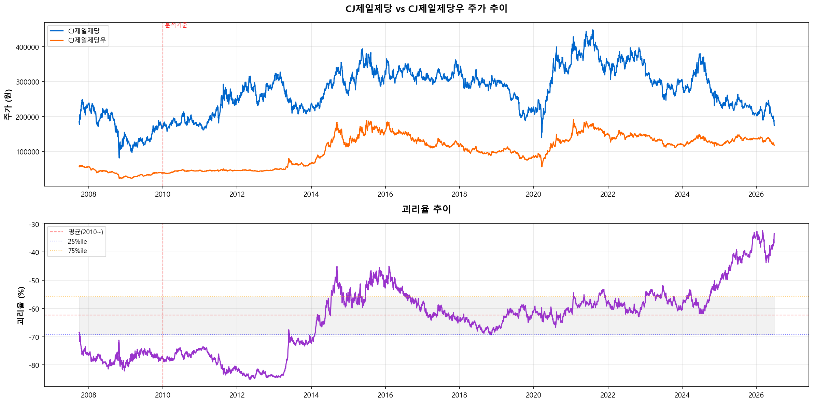

---

## 📌 현대건설 (000720) vs 현대건설우 (000725)

**분석 기간**: 2010-01-04 ~ 2026-06-26 (4,053일)
**전체 데이터**: 2005-09-29 ~ 2026-06-26 (5,123일) — 2010년 이전은 참고용

### 현재 상황

| 항목 | 값 |
|:----:|:---|
| 현대건설 | 101,200원 |
| 현대건설우 | 47,700원 |
| **현재 괴리율** | **-52.87%** |
| 우선주 할인율 | 52.87% |
| 역사적 위치 | 하위 6.7% |
| Z-Score | -0.85σ |
| 종합 점수 | 30점 (±100점 만점) |
| **판정** | **🟦 우선주 매수** |

**판정 근거:**

- ✅ 역사적 하위 10% (우선주 매우 저평가)
- ❌ 최근 30일 평균보다 1%p 이상 높음

### 괴리율 통계 (2010년~)

| 지표 | 값 |
|:----:|:---|
| 평균 | 67.10% |
| 중간값 | 29.96% |
| 표준편차 | 141.45% |
| 최소 (우선주 최저평가) | -64.95% |
| 최대 (우선주 최고평가) | 1296.81% |

| 백분위 | 괴리율 | 의미 |
|:-----:|:------:|:-----|
| 10% | -49.82% | 우선주 매우 저평가 |
| 25% | -35.02% | 우선주 저평가 |
| 50% | 29.96% | 중간값 |
| 75% | 71.54% | 우선주 고평가 |
| 90% | 271.80% | 우선주 매우 고평가 |

**📎 참고: 전체 기간 (2005-09-29~) 통계 비교**

| 지표 | 2010년 이후 | 전체 기간 |
|:----:|:----------:|:---------:|
| 평균 | 67.10% | 43.34% |
| 중간값 | 29.96% | -15.58% |
| 표준편차 | 141.45% | 134.11% |
| 최소 | -64.95% | -64.95% |
| 최대 | 1296.81% | 1296.81% |

### 기간별 괴리율

| 기간 | 평균 | 최소 | 최대 | 현재 대비 |
|:----:|:----:|:----:|:----:|:---------:|
| 최근 1개월 | -57.63% | -64.95% | -52.87% | +4.77%p |
| 최근 3개월 | -55.30% | -64.95% | -42.52% | +2.44%p |
| 최근 6개월 | -39.10% | -64.95% | -7.82% | -13.77%p |
| 최근 1년 | -10.34% | -64.95% | 78.37% | -42.52%p |
| 최근 3년 | 33.26% | -64.95% | 104.03% | -86.13%p |
| 최근 5년 | 141.67% | -64.95% | 1296.81% | -194.53%p |

### 시장 상황별 괴리율

| 구분 | 기간 | 평균 괴리율 | 중간값 |
|:----:|:----:|:----------:|:------:|
| 상승장 | 1194일 (29.5%) | 61.99% | 14.69% |
| 하락장 | 1198일 (29.6%) | 70.09% | 44.25% |
| 중립장 | 1661일 (41.0%) | 68.62% | 38.47% |

### 역사적 극단값 (Top 5)

**🟦 우선주 최저평가 시점 (괴리율 최저)**

| 날짜 | 현대건설 | 현대건설우 | 괴리율 |
|:----:|--------:|----------:|:------:|
| 2026-06-12 | 157,500원 | 55,200원 | **-64.95%** |
| 2012-12-20 | 60,505원 | 23,481원 | **-61.19%** |
| 2013-01-29 | 60,943원 | 23,946원 | **-60.71%** |
| 2013-01-30 | 60,859원 | 23,946원 | **-60.65%** |
| 2013-03-08 | 56,578원 | 22,393원 | **-60.42%** |

**🟥 보통주 최저평가 시점 (괴리율 최고)**

| 날짜 | 현대건설 | 현대건설우 | 괴리율 |
|:----:|--------:|----------:|:------:|
| 2020-06-25 | 30,599원 | 427,413원 | **1296.81%** |
| 2020-06-24 | 31,699원 | 427,413원 | **1248.36%** |
| 2020-06-23 | 31,470원 | 328,959원 | **945.32%** |
| 2020-06-26 | 30,737원 | 299,562원 | **874.61%** |
| 2020-07-08 | 31,561원 | 288,364원 | **813.66%** |

### 차트

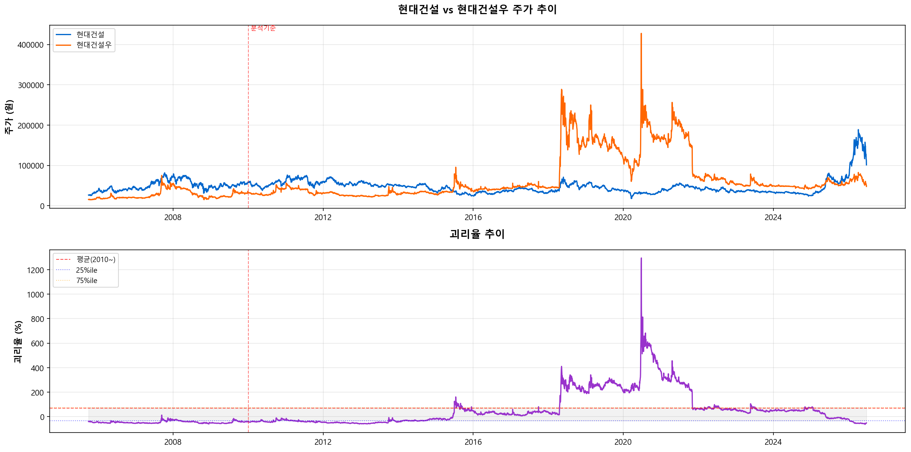

---

## 📌 금호석유 (011780) vs 금호석유우 (011785)

**분석 기간**: 2010-01-04 ~ 2026-06-26 (4,053일)
**전체 데이터**: 2005-09-29 ~ 2026-06-26 (5,123일) — 2010년 이전은 참고용

### 현재 상황

| 항목 | 값 |
|:----:|:---|
| 금호석유 | 112,700원 |
| 금호석유우 | 50,900원 |
| **현재 괴리율** | **-54.84%** |
| 우선주 할인율 | 54.84% |
| 역사적 위치 | 하위 70.6% |
| Z-Score | 0.76σ |
| 종합 점수 | -10점 (±100점 만점) |
| **판정** | **⚪ 중립** |

**판정 근거:**

- ❌ 최근 30일 평균보다 1%p 이상 높음

### 괴리율 통계 (2010년~)

| 지표 | 값 |
|:----:|:---|
| 평균 | -64.67% |
| 중간값 | -66.20% |
| 표준편차 | 13.00% |
| 최소 (우선주 최저평가) | -87.43% |
| 최대 (우선주 최고평가) | -32.47% |

| 백분위 | 괴리율 | 의미 |
|:-----:|:------:|:-----|
| 10% | -82.83% | 우선주 매우 저평가 |
| 25% | -72.82% | 우선주 저평가 |
| 50% | -66.20% | 중간값 |
| 75% | -53.39% | 우선주 고평가 |
| 90% | -48.30% | 우선주 매우 고평가 |

**📎 참고: 전체 기간 (2005-09-29~) 통계 비교**

| 지표 | 2010년 이후 | 전체 기간 |
|:----:|:----------:|:---------:|
| 평균 | -64.67% | -66.93% |
| 중간값 | -66.20% | -69.31% |
| 표준편차 | 13.00% | 12.57% |
| 최소 | -87.43% | -87.43% |
| 최대 | -32.47% | -32.47% |

### 기간별 괴리율

| 기간 | 평균 | 최소 | 최대 | 현재 대비 |
|:----:|:----:|:----:|:----:|:---------:|
| 최근 1개월 | -57.78% | -59.85% | -54.84% | +2.94%p |
| 최근 3개월 | -55.44% | -59.85% | -49.61% | +0.61%p |
| 최근 6개월 | -52.25% | -59.85% | -45.74% | -2.58%p |
| 최근 1년 | -51.96% | -59.85% | -45.74% | -2.88%p |
| 최근 3년 | -49.98% | -59.85% | -32.47% | -4.86%p |
| 최근 5년 | -54.69% | -71.71% | -32.47% | -0.15%p |

### 시장 상황별 괴리율

| 구분 | 기간 | 평균 괴리율 | 중간값 |
|:----:|:----:|:----------:|:------:|
| 상승장 | 1338일 (33.0%) | -68.26% | -67.98% |
| 하락장 | 1174일 (29.0%) | -62.41% | -60.96% |
| 중립장 | 1541일 (38.0%) | -63.28% | -65.69% |

### 역사적 극단값 (Top 5)

**🟦 우선주 최저평가 시점 (괴리율 최저)**

| 날짜 | 금호석유 | 금호석유우 | 괴리율 |
|:----:|--------:|----------:|:------:|
| 2011-08-23 | 127,643원 | 16,041원 | **-87.43%** |
| 2011-08-24 | 122,552원 | 15,631원 | **-87.25%** |
| 2011-10-17 | 160,009원 | 20,631원 | **-87.11%** |
| 2011-10-18 | 157,099원 | 20,438원 | **-86.99%** |
| 2011-08-25 | 122,552원 | 15,945원 | **-86.99%** |

**🟥 보통주 최저평가 시점 (괴리율 최고)**

| 날짜 | 금호석유 | 금호석유우 | 괴리율 |
|:----:|--------:|----------:|:------:|
| 2022-09-02 | 113,287원 | 76,504원 | **-32.47%** |
| 2022-09-07 | 112,380원 | 75,836원 | **-32.52%** |
| 2022-09-05 | 114,193원 | 76,671원 | **-32.86%** |
| 2022-09-27 | 104,224원 | 69,913원 | **-32.92%** |
| 2022-09-06 | 114,646원 | 76,837원 | **-32.98%** |

### 차트

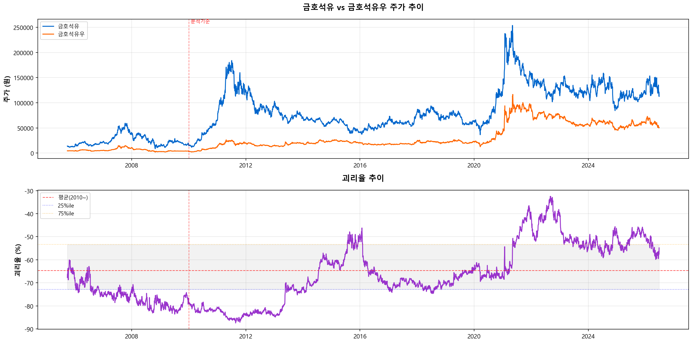

---

## 📌 코오롱인더 (120110) vs 코오롱인더우 (120115)

**분석 기간**: 2010-02-01 ~ 2026-06-26 (4,033일)

### 현재 상황

| 항목 | 값 |
|:----:|:---|
| 코오롱인더 | 56,400원 |
| 코오롱인더우 | 22,700원 |
| **현재 괴리율** | **-59.75%** |
| 우선주 할인율 | 59.75% |
| 역사적 위치 | 하위 62.6% |
| Z-Score | 0.24σ |
| 종합 점수 | -10점 (±100점 만점) |
| **판정** | **⚪ 중립** |

**판정 근거:**

- ❌ 최근 30일 평균보다 1%p 이상 높음

### 괴리율 통계

| 지표 | 값 |
|:----:|:---|
| 평균 | -62.70% |
| 중간값 | -64.16% |
| 표준편차 | 12.31% |
| 최소 (우선주 최저평가) | -84.10% |
| 최대 (우선주 최고평가) | -30.95% |

| 백분위 | 괴리율 | 의미 |
|:-----:|:------:|:-----|
| 10% | -79.75% | 우선주 매우 저평가 |
| 25% | -71.83% | 우선주 저평가 |
| 50% | -64.16% | 중간값 |
| 75% | -53.56% | 우선주 고평가 |
| 90% | -45.67% | 우선주 매우 고평가 |

### 기간별 괴리율

| 기간 | 평균 | 최소 | 최대 | 현재 대비 |
|:----:|:----:|:----:|:----:|:---------:|
| 최근 1개월 | -63.75% | -67.64% | -59.75% | +4.00%p |
| 최근 3개월 | -63.01% | -67.85% | -54.52% | +3.26%p |
| 최근 6개월 | -52.90% | -67.85% | -34.04% | -6.86%p |
| 최근 1년 | -45.82% | -67.85% | -32.28% | -13.93%p |
| 최근 3년 | -47.99% | -67.85% | -30.95% | -11.76%p |
| 최근 5년 | -51.96% | -67.85% | -30.95% | -7.79%p |

### 시장 상황별 괴리율

| 구분 | 기간 | 평균 괴리율 | 중간값 |
|:----:|:----:|:----------:|:------:|
| 상승장 | 1286일 (31.9%) | -64.96% | -65.95% |
| 하락장 | 1225일 (30.4%) | -61.08% | -62.06% |
| 중립장 | 1522일 (37.7%) | -62.10% | -64.30% |

### 역사적 극단값 (Top 5)

**🟦 우선주 최저평가 시점 (괴리율 최저)**

| 날짜 | 코오롱인더 | 코오롱인더우 | 괴리율 |
|:----:|--------:|----------:|:------:|
| 2011-08-18 | 87,610원 | 13,929원 | **-84.10%** |
| 2011-08-17 | 83,543원 | 13,584원 | **-83.74%** |
| 2011-08-16 | 78,738원 | 13,107원 | **-83.35%** |
| 2011-08-11 | 77,259원 | 12,921원 | **-83.28%** |
| 2011-08-09 | 73,858원 | 12,364원 | **-83.26%** |

**🟥 보통주 최저평가 시점 (괴리율 최고)**

| 날짜 | 코오롱인더 | 코오롱인더우 | 괴리율 |
|:----:|--------:|----------:|:------:|
| 2024-12-09 | 24,006원 | 16,576원 | **-30.95%** |
| 2024-12-05 | 24,797원 | 17,018원 | **-31.37%** |
| 2024-12-06 | 24,936원 | 16,912원 | **-32.18%** |
| 2025-02-04 | 25,798원 | 17,471원 | **-32.28%** |
| 2024-12-02 | 25,495원 | 17,239원 | **-32.38%** |

### 차트

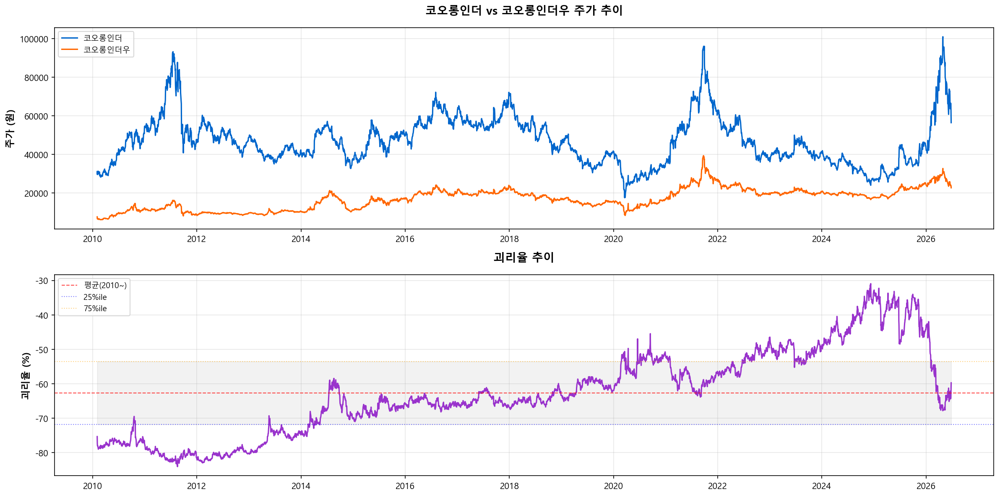

---

## 📌 코오롱 (002020) vs 코오롱우 (002025)

**분석 기간**: 2010-01-04 ~ 2026-06-26 (4,053일)
**전체 데이터**: 2005-09-29 ~ 2026-06-26 (5,123일) — 2010년 이전은 참고용

### 현재 상황

| 항목 | 값 |
|:----:|:---|
| 코오롱 | 44,650원 |
| 코오롱우 | 21,650원 |
| **현재 괴리율** | **-51.51%** |
| 우선주 할인율 | 51.51% |
| 역사적 위치 | 하위 56.7% |
| Z-Score | -0.06σ |
| 종합 점수 | -10점 (±100점 만점) |
| **판정** | **⚪ 중립** |

**판정 근거:**

- ❌ 최근 30일 평균보다 1%p 이상 높음

### 괴리율 통계 (2010년~)

| 지표 | 값 |
|:----:|:---|
| 평균 | -50.51% |
| 중간값 | -54.04% |
| 표준편차 | 16.25% |
| 최소 (우선주 최저평가) | -78.13% |
| 최대 (우선주 최고평가) | -6.52% |

| 백분위 | 괴리율 | 의미 |
|:-----:|:------:|:-----|
| 10% | -69.21% | 우선주 매우 저평가 |
| 25% | -63.02% | 우선주 저평가 |
| 50% | -54.04% | 중간값 |
| 75% | -38.45% | 우선주 고평가 |
| 90% | -25.81% | 우선주 매우 고평가 |

**📎 참고: 전체 기간 (2005-09-29~) 통계 비교**

| 지표 | 2010년 이후 | 전체 기간 |
|:----:|:----------:|:---------:|
| 평균 | -50.51% | -52.54% |
| 중간값 | -54.04% | -55.52% |
| 표준편차 | 16.25% | 15.80% |
| 최소 | -78.13% | -80.65% |
| 최대 | -6.52% | -6.52% |

### 기간별 괴리율

| 기간 | 평균 | 최소 | 최대 | 현재 대비 |
|:----:|:----:|:----:|:----:|:---------:|
| 최근 1개월 | -52.67% | -55.36% | -48.13% | +1.16%p |
| 최근 3개월 | -53.68% | -60.35% | -48.13% | +2.17%p |
| 최근 6개월 | -51.88% | -60.35% | -45.14% | +0.36%p |
| 최근 1년 | -44.85% | -60.35% | -7.78% | -6.67%p |
| 최근 3년 | -32.26% | -60.35% | -6.52% | -19.25%p |
| 최근 5년 | -35.74% | -60.35% | -6.52% | -15.77%p |

### 시장 상황별 괴리율

| 구분 | 기간 | 평균 괴리율 | 중간값 |
|:----:|:----:|:----------:|:------:|
| 상승장 | 1167일 (28.8%) | -55.11% | -57.23% |
| 하락장 | 1343일 (33.1%) | -51.77% | -54.82% |
| 중립장 | 1543일 (38.1%) | -45.93% | -48.82% |

### 역사적 극단값 (Top 5)

**🟦 우선주 최저평가 시점 (괴리율 최저)**

| 날짜 | 코오롱 | 코오롱우 | 괴리율 |
|:----:|--------:|----------:|:------:|
| 2010-02-05 | 24,272원 | 5,309원 | **-78.13%** |
| 2010-02-04 | 24,272원 | 5,389원 | **-77.80%** |
| 2010-02-08 | 22,844원 | 5,150원 | **-77.46%** |
| 2010-07-27 | 25,700원 | 5,813원 | **-77.38%** |
| 2010-07-13 | 24,665원 | 5,601원 | **-77.29%** |

**🟥 보통주 최저평가 시점 (괴리율 최고)**

| 날짜 | 코오롱 | 코오롱우 | 괴리율 |
|:----:|--------:|----------:|:------:|
| 2024-12-19 | 13,939원 | 13,031원 | **-6.52%** |
| 2024-12-20 | 13,634원 | 12,573원 | **-7.78%** |
| 2024-11-14 | 12,585원 | 11,575원 | **-8.03%** |
| 2024-11-15 | 12,576원 | 11,565원 | **-8.04%** |
| 2024-11-13 | 12,595원 | 11,491원 | **-8.77%** |

### 차트

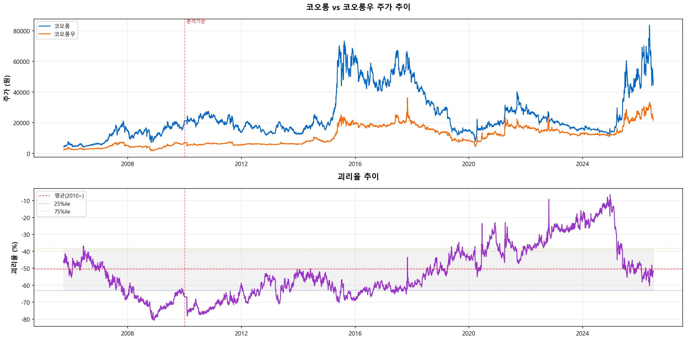

---

## 📌 호텔신라 (008770) vs 호텔신라우 (008775)

**분석 기간**: 2010-01-04 ~ 2026-06-26 (4,053일)
**전체 데이터**: 2005-09-29 ~ 2026-06-26 (5,123일) — 2010년 이전은 참고용

### 현재 상황

| 항목 | 값 |
|:----:|:---|
| 호텔신라 | 45,600원 |
| 호텔신라우 | 28,700원 |
| **현재 괴리율** | **-37.06%** |
| 우선주 할인율 | 37.06% |
| 역사적 위치 | 하위 49.9% |
| Z-Score | -0.02σ |
| 종합 점수 | -10점 (±100점 만점) |
| **판정** | **⚪ 중립** |

**판정 근거:**

- ❌ 최근 30일 평균보다 1%p 이상 높음

### 괴리율 통계 (2010년~)

| 지표 | 값 |
|:----:|:---|
| 평균 | -36.51% |
| 중간값 | -37.03% |
| 표준편차 | 22.14% |
| 최소 (우선주 최저평가) | -77.64% |
| 최대 (우선주 최고평가) | 42.97% |

| 백분위 | 괴리율 | 의미 |
|:-----:|:------:|:-----|
| 10% | -67.64% | 우선주 매우 저평가 |
| 25% | -55.14% | 우선주 저평가 |
| 50% | -37.03% | 중간값 |
| 75% | -20.73% | 우선주 고평가 |
| 90% | -6.50% | 우선주 매우 고평가 |

**📎 참고: 전체 기간 (2005-09-29~) 통계 비교**

| 지표 | 2010년 이후 | 전체 기간 |
|:----:|:----------:|:---------:|
| 평균 | -36.51% | -40.12% |
| 중간값 | -37.03% | -41.35% |
| 표준편차 | 22.14% | 21.08% |
| 최소 | -77.64% | -77.64% |
| 최대 | 42.97% | 42.97% |

### 기간별 괴리율

| 기간 | 평균 | 최소 | 최대 | 현재 대비 |
|:----:|:----:|:----:|:----:|:---------:|
| 최근 1개월 | -39.75% | -45.15% | -36.67% | +2.69%p |
| 최근 3개월 | -31.22% | -45.15% | -18.91% | -5.84%p |
| 최근 6개월 | -25.20% | -45.15% | -11.64% | -11.86%p |
| 최근 1년 | -20.76% | -45.15% | 0.32% | -16.30%p |
| 최근 3년 | -21.27% | -45.15% | 0.32% | -15.79%p |
| 최근 5년 | -20.94% | -49.09% | 42.97% | -16.12%p |

### 시장 상황별 괴리율

| 구분 | 기간 | 평균 괴리율 | 중간값 |
|:----:|:----:|:----------:|:------:|
| 상승장 | 1284일 (31.7%) | -44.45% | -43.70% |
| 하락장 | 1074일 (26.5%) | -31.87% | -33.24% |
| 중립장 | 1695일 (41.8%) | -33.43% | -32.48% |

### 역사적 극단값 (Top 5)

**🟦 우선주 최저평가 시점 (괴리율 최저)**

| 날짜 | 호텔신라 | 호텔신라우 | 괴리율 |
|:----:|--------:|----------:|:------:|
| 2013-03-21 | 52,651원 | 11,773원 | **-77.64%** |
| 2013-03-22 | 51,787원 | 11,866원 | **-77.09%** |
| 2013-03-29 | 52,746원 | 12,098원 | **-77.06%** |
| 2013-03-20 | 51,691원 | 11,866원 | **-77.04%** |
| 2013-03-28 | 52,746원 | 12,144원 | **-76.98%** |

**🟥 보통주 최저평가 시점 (괴리율 최고)**

| 날짜 | 호텔신라 | 호텔신라우 | 괴리율 |
|:----:|--------:|----------:|:------:|
| 2021-04-26 | 83,920원 | 119,985원 | **42.97%** |
| 2021-04-27 | 83,424원 | 113,072원 | **35.54%** |
| 2017-02-17 | 46,277원 | 62,405원 | **34.85%** |
| 2017-02-22 | 47,449원 | 61,253원 | **29.09%** |
| 2017-03-10 | 43,934원 | 56,164원 | **27.84%** |

### 차트

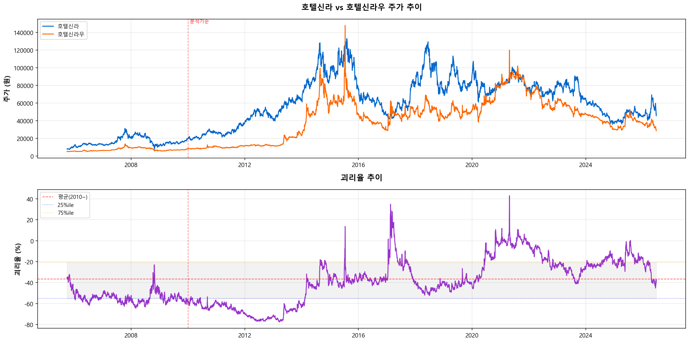

---

## 📌 DL (000210) vs DL우 (000215)

**분석 기간**: 2010-01-04 ~ 2026-06-26 (4,053일)
**전체 데이터**: 2005-09-29 ~ 2026-06-26 (5,123일) — 2010년 이전은 참고용

### 현재 상황

| 항목 | 값 |
|:----:|:---|
| DL | 40,750원 |
| DL우 | 20,000원 |
| **현재 괴리율** | **-50.92%** |
| 우선주 할인율 | 50.92% |
| 역사적 위치 | 하위 31.5% |
| Z-Score | -0.35σ |
| 종합 점수 | -10점 (±100점 만점) |
| **판정** | **⚪ 중립** |

**판정 근거:**

- ❌ 최근 30일 평균보다 1%p 이상 높음

### 괴리율 통계 (2010년~)

| 지표 | 값 |
|:----:|:---|
| 평균 | -47.02% |
| 중간값 | -46.19% |
| 표준편차 | 11.25% |
| 최소 (우선주 최저평가) | -70.56% |
| 최대 (우선주 최고평가) | -2.22% |

| 백분위 | 괴리율 | 의미 |
|:-----:|:------:|:-----|
| 10% | -64.70% | 우선주 매우 저평가 |
| 25% | -53.54% | 우선주 저평가 |
| 50% | -46.19% | 중간값 |
| 75% | -40.50% | 우선주 고평가 |
| 90% | -35.58% | 우선주 매우 고평가 |

**📎 참고: 전체 기간 (2005-09-29~) 통계 비교**

| 지표 | 2010년 이후 | 전체 기간 |
|:----:|:----------:|:---------:|
| 평균 | -47.02% | -44.85% |
| 중간값 | -46.19% | -45.11% |
| 표준편차 | 11.25% | 12.72% |
| 최소 | -70.56% | -70.56% |
| 최대 | -2.22% | 3.03% |

### 기간별 괴리율

| 기간 | 평균 | 최소 | 최대 | 현재 대비 |
|:----:|:----:|:----:|:----:|:---------:|
| 최근 1개월 | -55.23% | -57.83% | -50.92% | +4.31%p |
| 최근 3개월 | -53.31% | -58.33% | -42.20% | +2.39%p |
| 최근 6개월 | -45.23% | -58.33% | -32.10% | -5.69%p |
| 최근 1년 | -44.06% | -58.33% | -32.10% | -6.86%p |
| 최근 3년 | -45.76% | -58.33% | -32.10% | -5.16%p |
| 최근 5년 | -41.83% | -58.33% | -2.22% | -9.09%p |

### 시장 상황별 괴리율

| 구분 | 기간 | 평균 괴리율 | 중간값 |
|:----:|:----:|:----------:|:------:|
| 상승장 | 1151일 (28.4%) | -50.36% | -49.90% |
| 하락장 | 1317일 (32.5%) | -46.72% | -44.93% |
| 중립장 | 1585일 (39.1%) | -44.83% | -45.00% |

### 역사적 극단값 (Top 5)

**🟦 우선주 최저평가 시점 (괴리율 최저)**

| 날짜 | DL | DL우 | 괴리율 |
|:----:|--------:|----------:|:------:|
| 2012-02-02 | 130,776원 | 38,506원 | **-70.56%** |
| 2012-02-03 | 131,866원 | 39,200원 | **-70.27%** |
| 2011-09-07 | 121,289원 | 36,564원 | **-69.85%** |
| 2012-02-06 | 130,232원 | 39,663원 | **-69.54%** |
| 2012-02-09 | 138,950원 | 42,364원 | **-69.51%** |

**🟥 보통주 최저평가 시점 (괴리율 최고)**

| 날짜 | DL | DL우 | 괴리율 |
|:----:|--------:|----------:|:------:|
| 2020-12-28 | 100,004원 | 97,788원 | **-2.22%** |
| 2020-12-29 | 102,664원 | 100,334원 | **-2.27%** |
| 2020-12-30 | 102,664원 | 100,334원 | **-2.27%** |
| 2021-01-04 | 102,664원 | 100,334원 | **-2.27%** |
| 2021-01-05 | 102,664원 | 100,334원 | **-2.27%** |

### 차트

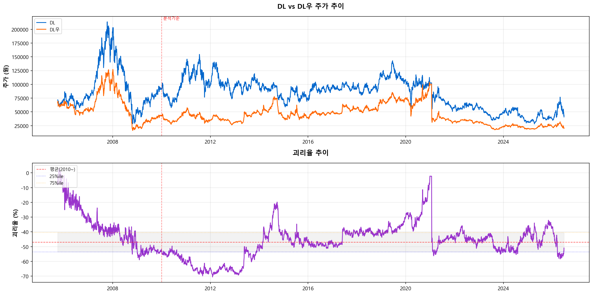

---

## 📌 한국금융지주 (071050) vs 한국금융지주우 (071055)

**분석 기간**: 2010-01-04 ~ 2026-06-26 (4,053일)
**전체 데이터**: 2005-09-29 ~ 2026-06-26 (5,123일) — 2010년 이전은 참고용

### 현재 상황

| 항목 | 값 |
|:----:|:---|
| 한국금융지주 | 197,500원 |
| 한국금융지주우 | 141,800원 |
| **현재 괴리율** | **-28.20%** |
| 우선주 할인율 | 28.20% |
| 역사적 위치 | 하위 81.9% |
| Z-Score | 1.06σ |
| 종합 점수 | -55점 (±100점 만점) |
| **판정** | **🟥 보통주 강력 매수** |

**판정 근거:**

- ❌ 역사적 상위 25% (우선주 고평가)
- ❌ 평균 대비 1.0σ 이상 높음
- ❌ 최근 30일 평균보다 1%p 이상 높음

### 괴리율 통계 (2010년~)

| 지표 | 값 |
|:----:|:---|
| 평균 | -48.88% |
| 중간값 | -50.98% |
| 표준편차 | 19.45% |
| 최소 (우선주 최저평가) | -81.32% |
| 최대 (우선주 최고평가) | -9.56% |

| 백분위 | 괴리율 | 의미 |
|:-----:|:------:|:-----|
| 10% | -77.81% | 우선주 매우 저평가 |
| 25% | -64.52% | 우선주 저평가 |
| 50% | -50.98% | 중간값 |
| 75% | -30.71% | 우선주 고평가 |
| 90% | -24.52% | 우선주 매우 고평가 |

**📎 참고: 전체 기간 (2005-09-29~) 통계 비교**

| 지표 | 2010년 이후 | 전체 기간 |
|:----:|:----------:|:---------:|
| 평균 | -48.88% | -53.46% |
| 중간값 | -50.98% | -55.41% |
| 표준편차 | 19.45% | 19.65% |
| 최소 | -81.32% | -82.35% |
| 최대 | -9.56% | -9.56% |

### 기간별 괴리율

| 기간 | 평균 | 최소 | 최대 | 현재 대비 |
|:----:|:----:|:----:|:----:|:---------:|
| 최근 1개월 | -30.72% | -33.07% | -27.78% | +2.51%p |
| 최근 3개월 | -30.21% | -38.27% | -24.26% | +2.01%p |
| 최근 6개월 | -28.49% | -38.27% | -20.03% | +0.29%p |
| 최근 1년 | -29.19% | -38.33% | -20.03% | +0.99%p |
| 최근 3년 | -26.92% | -38.33% | -9.56% | -1.28%p |
| 최근 5년 | -30.75% | -51.35% | -9.56% | +2.55%p |

### 시장 상황별 괴리율

| 구분 | 기간 | 평균 괴리율 | 중간값 |
|:----:|:----:|:----------:|:------:|
| 상승장 | 1295일 (32.0%) | -48.91% | -51.78% |
| 하락장 | 856일 (21.1%) | -47.34% | -48.25% |
| 중립장 | 1902일 (46.9%) | -49.55% | -51.96% |

### 역사적 극단값 (Top 5)

**🟦 우선주 최저평가 시점 (괴리율 최저)**

| 날짜 | 한국금융지주 | 한국금융지주우 | 괴리율 |
|:----:|--------:|----------:|:------:|
| 2011-12-05 | 24,703원 | 4,614원 | **-81.32%** |
| 2011-12-01 | 24,608원 | 4,605원 | **-81.29%** |
| 2011-12-07 | 24,482원 | 4,642원 | **-81.04%** |
| 2011-12-06 | 23,914원 | 4,549원 | **-80.98%** |
| 2012-03-05 | 29,246원 | 5,589원 | **-80.89%** |

**🟥 보통주 최저평가 시점 (괴리율 최고)**

| 날짜 | 한국금융지주 | 한국금융지주우 | 괴리율 |
|:----:|--------:|----------:|:------:|
| 2022-09-07 | 45,590원 | 41,234원 | **-9.56%** |
| 2022-08-29 | 47,878원 | 43,220원 | **-9.73%** |
| 2022-08-31 | 48,132원 | 43,379원 | **-9.88%** |
| 2022-07-15 | 47,963원 | 43,220원 | **-9.89%** |
| 2022-09-01 | 47,115원 | 42,346원 | **-10.12%** |

### 차트

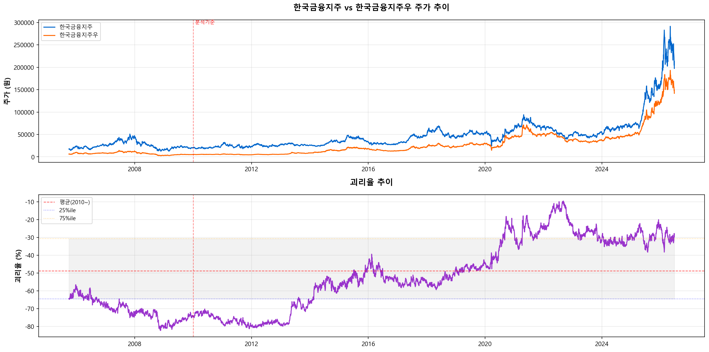

---

## 📌 삼성물산 (028260) vs 삼성물산우B (02826K)

**분석 기간**: 2014-12-18 ~ 2026-06-26 (2,822일)

### 현재 상황

| 항목 | 값 |
|:----:|:---|
| 삼성물산 | 487,500원 |
| 삼성물산우B | 281,000원 |
| **현재 괴리율** | **-42.36%** |
| 우선주 할인율 | 42.36% |
| 역사적 위치 | 하위 9.0% |
| Z-Score | -1.24σ |
| 종합 점수 | 50점 (±100점 만점) |
| **판정** | **🟦 우선주 강력 매수** |

**판정 근거:**

- ✅ 역사적 하위 10% (우선주 매우 저평가)
- ✅ 평균 대비 1.0σ 이상 낮음
- ❌ 최근 30일 평균보다 1%p 이상 높음

### 괴리율 통계

| 지표 | 값 |
|:----:|:---|
| 평균 | -27.25% |
| 중간값 | -28.74% |
| 표준편차 | 12.20% |
| 최소 (우선주 최저평가) | -50.47% |
| 최대 (우선주 최고평가) | 10.12% |

| 백분위 | 괴리율 | 의미 |
|:-----:|:------:|:-----|
| 10% | -42.11% | 우선주 매우 저평가 |
| 25% | -37.52% | 우선주 저평가 |
| 50% | -28.74% | 중간값 |
| 75% | -14.42% | 우선주 고평가 |
| 90% | -8.89% | 우선주 매우 고평가 |

### 기간별 괴리율

| 기간 | 평균 | 최소 | 최대 | 현재 대비 |
|:----:|:----:|:----:|:----:|:---------:|
| 최근 1개월 | -45.81% | -50.47% | -40.99% | +3.45%p |
| 최근 3개월 | -40.16% | -50.47% | -32.79% | -2.19%p |
| 최근 6개월 | -39.15% | -50.47% | -32.79% | -3.21%p |
| 최근 1년 | -33.23% | -50.47% | -22.76% | -9.13%p |
| 최근 3년 | -22.77% | -50.47% | -3.33% | -19.59%p |
| 최근 5년 | -21.61% | -50.47% | 10.12% | -20.75%p |

### 시장 상황별 괴리율

| 구분 | 기간 | 평균 괴리율 | 중간값 |
|:----:|:----:|:----------:|:------:|
| 상승장 | 774일 (27.4%) | -29.73% | -31.63% |
| 하락장 | 583일 (20.7%) | -27.10% | -28.70% |
| 중립장 | 1465일 (51.9%) | -25.99% | -27.47% |

### 역사적 극단값 (Top 5)

**🟦 우선주 최저평가 시점 (괴리율 최저)**

| 날짜 | 삼성물산 | 삼성물산우B | 괴리율 |
|:----:|--------:|----------:|:------:|
| 2026-06-04 | 535,000원 | 265,000원 | **-50.47%** |
| 2026-06-05 | 460,500원 | 231,500원 | **-49.73%** |
| 2026-06-17 | 490,000원 | 248,500원 | **-49.29%** |
| 2026-06-15 | 495,000원 | 252,000원 | **-49.09%** |
| 2026-06-16 | 497,000원 | 254,000원 | **-48.89%** |

**🟥 보통주 최저평가 시점 (괴리율 최고)**

| 날짜 | 삼성물산 | 삼성물산우B | 괴리율 |
|:----:|--------:|----------:|:------:|
| 2020-10-27 | 101,791원 | 112,092원 | **10.12%** |
| 2020-10-29 | 97,825원 | 106,958원 | **9.34%** |
| 2020-10-30 | 97,384원 | 103,963원 | **6.76%** |
| 2021-04-26 | 124,099원 | 128,525원 | **3.57%** |
| 2020-10-26 | 103,994원 | 105,675원 | **1.62%** |

### 차트

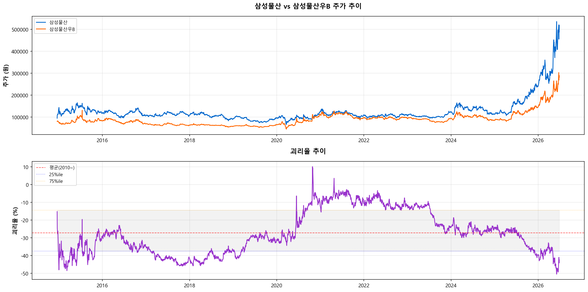

---

## 📌 아모레G (002790) vs 아모레G우 (002795)

**분석 기간**: 2010-01-04 ~ 2026-06-26 (4,053일)
**전체 데이터**: 2000-01-04 ~ 2026-06-26 (6,620일) — 2010년 이전은 참고용

### 현재 상황

| 항목 | 값 |
|:----:|:---|
| 아모레G | 20,500원 |
| 아모레G우 | 9,830원 |
| **현재 괴리율** | **-52.05%** |
| 우선주 할인율 | 52.05% |
| 역사적 위치 | 하위 96.9% |
| Z-Score | 1.83σ |
| 종합 점수 | -80점 (±100점 만점) |
| **판정** | **🟥 보통주 강력 매수** |

**판정 근거:**

- ❌ 역사적 상위 10% (우선주 매우 고평가)
- ❌ 평균 대비 1.5σ 이상 높음
- ❌ 최근 30일 평균보다 1%p 이상 높음

### 괴리율 통계 (2010년~)

| 지표 | 값 |
|:----:|:---|
| 평균 | -63.08% |
| 중간값 | -62.56% |
| 표준편차 | 6.04% |
| 최소 (우선주 최저평가) | -83.40% |
| 최대 (우선주 최고평가) | -45.20% |

| 백분위 | 괴리율 | 의미 |
|:-----:|:------:|:-----|
| 10% | -71.25% | 우선주 매우 저평가 |
| 25% | -66.05% | 우선주 저평가 |
| 50% | -62.56% | 중간값 |
| 75% | -59.43% | 우선주 고평가 |
| 90% | -56.50% | 우선주 매우 고평가 |

**📎 참고: 전체 기간 (2000-01-04~) 통계 비교**

| 지표 | 2010년 이후 | 전체 기간 |
|:----:|:----------:|:---------:|
| 평균 | -63.08% | -65.80% |
| 중간값 | -62.56% | -64.55% |
| 표준편차 | 6.04% | 7.53% |
| 최소 | -83.40% | -84.09% |
| 최대 | -45.20% | -45.20% |

### 기간별 괴리율

| 기간 | 평균 | 최소 | 최대 | 현재 대비 |
|:----:|:----:|:----:|:----:|:---------:|
| 최근 1개월 | -54.55% | -56.88% | -51.70% | +2.50%p |
| 최근 3개월 | -56.51% | -63.60% | -51.70% | +4.46%p |
| 최근 6개월 | -57.08% | -64.16% | -51.70% | +5.03%p |
| 최근 1년 | -58.45% | -64.16% | -51.70% | +6.40%p |
| 최근 3년 | -62.60% | -69.81% | -51.70% | +10.55%p |
| 최근 5년 | -63.16% | -69.85% | -51.70% | +11.11%p |

### 시장 상황별 괴리율

| 구분 | 기간 | 평균 괴리율 | 중간값 |
|:----:|:----:|:----------:|:------:|
| 상승장 | 1395일 (34.4%) | -64.33% | -63.21% |
| 하락장 | 1344일 (33.2%) | -61.73% | -61.95% |
| 중립장 | 1314일 (32.4%) | -63.12% | -62.81% |

### 역사적 극단값 (Top 5)

**🟦 우선주 최저평가 시점 (괴리율 최저)**

| 날짜 | 아모레G | 아모레G우 | 괴리율 |
|:----:|--------:|----------:|:------:|
| 2012-07-27 | 34,379원 | 5,708원 | **-83.40%** |
| 2012-08-02 | 34,012원 | 5,653원 | **-83.38%** |
| 2012-07-30 | 34,150원 | 5,708원 | **-83.28%** |
| 2012-08-13 | 35,248원 | 5,931원 | **-83.17%** |
| 2012-08-08 | 33,555원 | 5,668원 | **-83.11%** |

**🟥 보통주 최저평가 시점 (괴리율 최고)**

| 날짜 | 아모레G | 아모레G우 | 괴리율 |
|:----:|--------:|----------:|:------:|
| 2015-11-20 | 135,931원 | 74,495원 | **-45.20%** |
| 2015-11-18 | 134,539원 | 73,668원 | **-45.24%** |
| 2018-10-04 | 73,947원 | 39,925원 | **-46.01%** |
| 2015-12-11 | 135,931원 | 72,840원 | **-46.41%** |
| 2016-01-21 | 126,986원 | 67,767원 | **-46.63%** |

### 차트

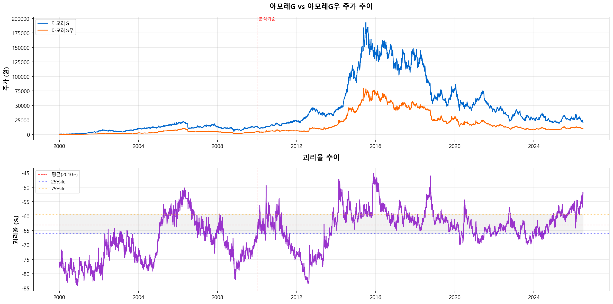

---

## 📌 NH투자증권 (005940) vs NH투자증권우 (005945)

**분석 기간**: 2010-01-04 ~ 2026-06-26 (4,053일)
**전체 데이터**: 2005-09-29 ~ 2026-06-26 (5,123일) — 2010년 이전은 참고용

### 현재 상황

| 항목 | 값 |
|:----:|:---|
| NH투자증권 | 27,250원 |
| NH투자증권우 | 23,150원 |
| **현재 괴리율** | **-15.05%** |
| 우선주 할인율 | 15.05% |
| 역사적 위치 | 하위 73.9% |
| Z-Score | 1.03σ |
| 종합 점수 | -30점 (±100점 만점) |
| **판정** | **🟥 보통주 매수** |

**판정 근거:**

- ❌ 평균 대비 1.0σ 이상 높음
- ❌ 최근 30일 평균보다 1%p 이상 높음

### 괴리율 통계 (2010년~)

| 지표 | 값 |
|:----:|:---|
| 평균 | -38.08% |
| 중간값 | -41.50% |
| 표준편차 | 22.28% |
| 최소 (우선주 최저평가) | -71.54% |
| 최대 (우선주 최고평가) | 0.75% |

| 백분위 | 괴리율 | 의미 |
|:-----:|:------:|:-----|
| 10% | -68.18% | 우선주 매우 저평가 |
| 25% | -59.10% | 우선주 저평가 |
| 50% | -41.50% | 중간값 |
| 75% | -14.50% | 우선주 고평가 |
| 90% | -8.09% | 우선주 매우 고평가 |

**📎 참고: 전체 기간 (2005-09-29~) 통계 비교**

| 지표 | 2010년 이후 | 전체 기간 |
|:----:|:----------:|:---------:|
| 평균 | -38.08% | -43.03% |
| 중간값 | -41.50% | -46.93% |
| 표준편차 | 22.28% | 22.15% |
| 최소 | -71.54% | -75.64% |
| 최대 | 0.75% | 0.75% |

### 기간별 괴리율

| 기간 | 평균 | 최소 | 최대 | 현재 대비 |
|:----:|:----:|:----:|:----:|:---------:|
| 최근 1개월 | -20.53% | -23.59% | -15.05% | +5.49%p |
| 최근 3개월 | -21.74% | -29.04% | -14.95% | +6.70%p |
| 최근 6개월 | -16.27% | -29.04% | -7.28% | +1.23%p |
| 최근 1년 | -14.28% | -29.04% | -3.90% | -0.77%p |
| 최근 3년 | -10.21% | -29.04% | 0.75% | -4.84%p |
| 최근 5년 | -16.74% | -44.09% | 0.75% | +1.69%p |

### 시장 상황별 괴리율

| 구분 | 기간 | 평균 괴리율 | 중간값 |
|:----:|:----:|:----------:|:------:|
| 상승장 | 1056일 (26.1%) | -38.91% | -43.56% |
| 하락장 | 821일 (20.3%) | -44.98% | -46.25% |
| 중립장 | 2176일 (53.7%) | -35.08% | -40.16% |

### 역사적 극단값 (Top 5)

**🟦 우선주 최저평가 시점 (괴리율 최저)**

| 날짜 | NH투자증권 | NH투자증권우 | 괴리율 |
|:----:|--------:|----------:|:------:|
| 2012-09-19 | 7,098원 | 2,020원 | **-71.54%** |
| 2013-01-29 | 6,880원 | 1,967원 | **-71.41%** |
| 2013-01-28 | 6,880원 | 1,971원 | **-71.35%** |
| 2013-02-22 | 7,016원 | 2,016원 | **-71.27%** |
| 2013-01-30 | 6,853원 | 1,971원 | **-71.23%** |

**🟥 보통주 최저평가 시점 (괴리율 최고)**

| 날짜 | NH투자증권 | NH투자증권우 | 괴리율 |
|:----:|--------:|----------:|:------:|
| 2022-06-10 | 7,928원 | 7,988원 | **0.75%** |
| 2022-09-23 | 7,342원 | 7,343원 | **0.01%** |
| 2022-09-22 | 7,421원 | 7,418원 | **-0.04%** |
| 2022-04-27 | 8,124원 | 8,100원 | **-0.28%** |
| 2022-04-25 | 8,202원 | 8,175원 | **-0.32%** |

### 차트

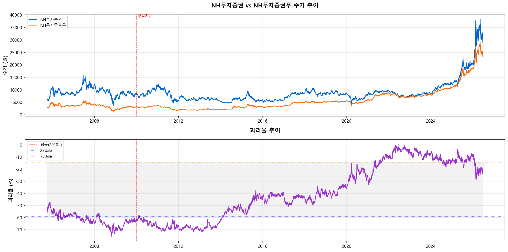

---

## 📌 SK하이닉스 (000660) vs SK스퀘어 (402340)

**분석 기간**: 2021-11-29 ~ 2026-06-26 (1,116일)

### 현재 상황

| 항목 | 값 |
|:----:|:---|
| SK하이닉스 | 2,634,000원 |
| SK스퀘어 | 1,691,000원 |
| **현재 괴리율** | **-35.80%** |
| 우선주 할인율 | 35.80% |
| 역사적 위치 | 하위 98.5% |
| Z-Score | 2.31σ |
| 종합 점수 | -80점 (±100점 만점) |
| **판정** | **🟥 보통주 강력 매수** |

**판정 근거:**

- ❌ 역사적 상위 10% (우선주 매우 고평가)
- ❌ 평균 대비 1.5σ 이상 높음
- ❌ 최근 30일 평균보다 1%p 이상 높음

### 괴리율 통계

| 지표 | 값 |
|:----:|:---|
| 평균 | -52.30% |
| 중간값 | -53.63% |
| 표준편차 | 7.15% |
| 최소 (우선주 최저평가) | -65.76% |
| 최대 (우선주 최고평가) | -28.30% |

| 백분위 | 괴리율 | 의미 |
|:-----:|:------:|:-----|
| 10% | -61.12% | 우선주 매우 저평가 |
| 25% | -56.88% | 우선주 저평가 |
| 50% | -53.63% | 중간값 |
| 75% | -47.97% | 우선주 고평가 |
| 90% | -40.88% | 우선주 매우 고평가 |

### 기간별 괴리율

| 기간 | 평균 | 최소 | 최대 | 현재 대비 |
|:----:|:----:|:----:|:----:|:---------:|
| 최근 1개월 | -39.39% | -47.15% | -28.30% | +3.59%p |
| 최근 3개월 | -39.68% | -47.15% | -28.30% | +3.87%p |
| 최근 6개월 | -42.12% | -55.03% | -28.30% | +6.31%p |
| 최근 1년 | -44.95% | -55.47% | -28.30% | +9.15%p |
| 최근 3년 | -52.45% | -65.76% | -28.30% | +16.65%p |

### 시장 상황별 괴리율

| 구분 | 기간 | 평균 괴리율 | 중간값 |
|:----:|:----:|:----------:|:------:|
| 상승장 | 526일 (47.1%) | -50.41% | -52.51% |
| 하락장 | 198일 (17.7%) | -53.31% | -53.83% |
| 중립장 | 392일 (35.1%) | -54.32% | -54.37% |

### 역사적 극단값 (Top 5)

**🟦 우선주 최저평가 시점 (괴리율 최저)**

| 날짜 | SK하이닉스 | SK스퀘어 | 괴리율 |
|:----:|--------:|----------:|:------:|
| 2023-10-24 | 124,397원 | 42,594원 | **-65.76%** |
| 2023-10-20 | 123,808원 | 42,644원 | **-65.56%** |
| 2023-09-14 | 119,577원 | 41,346원 | **-65.42%** |
| 2023-10-23 | 121,650원 | 42,295원 | **-65.23%** |
| 2023-10-18 | 127,536원 | 44,442원 | **-65.15%** |

**🟥 보통주 최저평가 시점 (괴리율 최고)**

| 날짜 | SK하이닉스 | SK스퀘어 | 괴리율 |
|:----:|--------:|----------:|:------:|
| 2026-06-23 | 2,555,000원 | 1,832,000원 | **-28.30%** |
| 2021-11-29 | 109,990원 | 75,901원 | **-30.99%** |
| 2026-06-24 | 2,621,000원 | 1,799,000원 | **-31.36%** |
| 2026-05-04 | 1,446,758원 | 989,709원 | **-31.59%** |
| 2026-05-06 | 1,600,732원 | 1,087,582원 | **-32.06%** |

### 차트

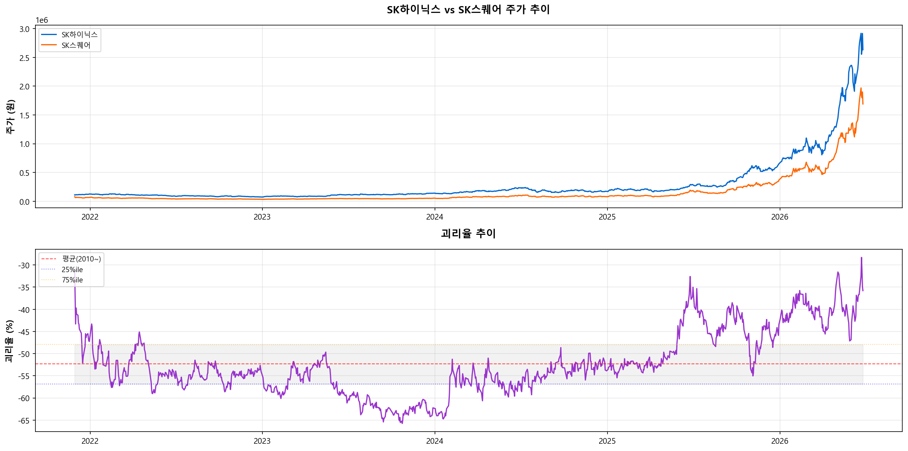

---

## ⚠️ 주의사항

1. **괴리율은 평균 회귀 경향**이 있지만, 장기간 지속될 수도 있습니다.
2. **우선주는 유동성이 낮아** 대량 매매 시 슬리피지가 발생할 수 있습니다.
3. **배당 기준일 전후**로 괴리율이 일시적으로 변동할 수 있습니다.
4. 이 분석은 **참고용**이며, 투자 판단은 본인의 책임입니다.

---

**데이터 출처**: market_data.db (SQLite) / Yahoo Finance (fallback)  
**분석 도구**: Python + pandas
