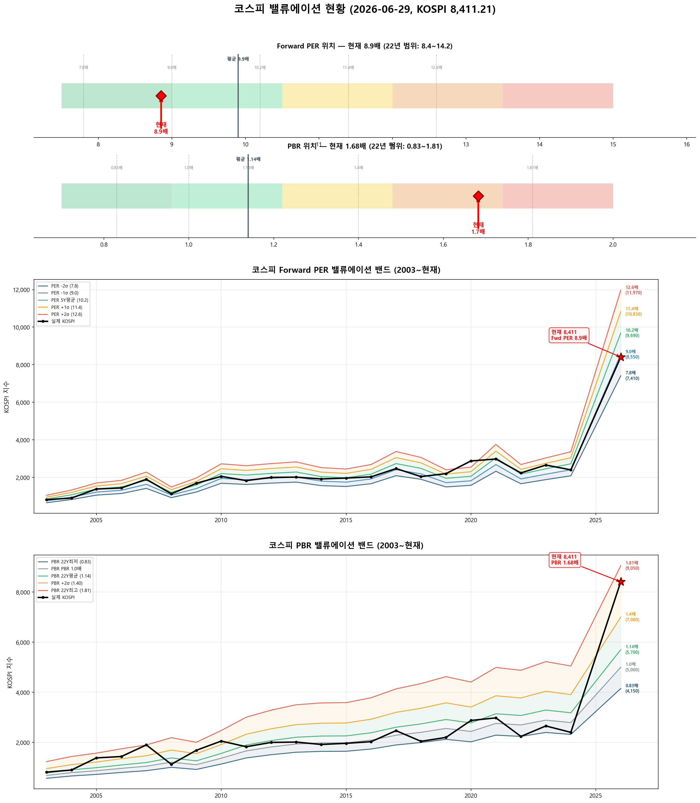

# 📋 MarketTop 일일 종합 (2026-06-29 08:32)

> A4 한 장 요약 — 상세는 각 시장 리포트 참조

---

### 🟢 코스피 8,411.21  —  📈 상승장 (신뢰도 90%)

| 과열 점수 | 50/100 🟢 정상 |
|:---:|:---|

> ✅ **다음 매도 목표 8,834(+5.0%) 대기**

**📈 상승 시**

| 다음 매도 목표 | **8,834** (+5.0%) → 이격도121(MA60) + RSI85+ + MFI70+ (승률 71%) |
|:---:|:---|

**📉 하락 시**

| 1차 방어선 | **8,159** (-3%) → 30% 손절 |
|:---:|:---|
| 핵심 하락감지 | ADX20+ + MACD데드 + RSI68+ (승률 83%) |
| 강력 매도 | 전체 4개+ 전략 동시 발동 시 → 50% 청산 (검증승률 72%) |

**📍 분할매도 단계**

| 단계 | 목표가 | 등락률 | 전략 | 승률 | 틀렸을 때 |
|:---:|---:|:---:|:---|:---:|:---|
| ⏳ 1단계 | **8,834** | +5.0% | 이격도121(MA60) + RSI85+ + MFI70+ | 71% | 평균+6% |
| ⏳ 2단계 | **9,376** | +11.5% | 이격도115(MA35) + MFI90+ | 100% | - |
| ⏳ 3단계 | **9,987** | +18.7% | 이격도125(MA40) + RSI65+ + Stoch90+ | 80% | 평균+6% |

**🛑 손절 단계**

| 단계 | 손절가 | 비중 | 전략 | 승률 |
|:---:|---:|:---:|:---|:---:|
| 1단계 | **8,159** (-3%) | 30% | ADX20+ + MACD데드 + RSI68+ | 83% |
| 2단계 | **7,991** (-5%) | 30% | BB101%반전 + 이격도118(MA35) | 86% |
| 3단계 | **7,738** (-8%) | 40% | MFI80반전 + 이격도120(MA70) | 71% |

**🎯 방향성 종합**: 🟠 **약한 하락 압력**

| 방향 | 전략 | 평균 승률 | 예상 변동 |
|:----:|:---:|:--------:|:--------:|
| 🔴 하락(매도) | 7개 | 81.0% | -2.75% |
| 🟢 상승(매수) | 5개 | 80.2% | +4.80% |

**📐 매도 Top1 [이격도115(MA35) + MFI90+] 20일 수익률 분포**

  • 중앙값: **-2.1%** | 5%분위 -12.0% ~ 95%분위 -0.6%

**📐 매수 Top1 [RSI35저점반전 + 하향이격도90(MA10)] 20일 수익률 분포**

  • 중앙값: **+6.9%** | 5%분위 +2.3% ~ 95%분위 +19.4%

**💰 Kelly 권장 매도비중**

| 지표 | 값 | 의미 |
|:---|---:|:---|
| 평균 Half-Kelly (Top5) | **24%** | 매수 후 매도 신호 시 권장 청산비율 |
| 최대 Half-Kelly | 41% | 가장 강한 전략의 권장 비중 |
| 평균 Sharpe (Top5) | 2.52 | 우수 |
| 2% 이내 임박 전략 수 | 0개 | 신호 발동 임박도 |

---

### 🔴 코스닥 851.37  —  📉 하락장 (신뢰도 100%)

| 과열 점수 | 13/100 🔵 저평가 |
|:---:|:---|

> ✅ **다음 매도 목표 975(+14.5%) 대기**

**📈 상승 시**

| 다음 매도 목표 | **975** (+14.5%) → 이격도102(MA10) + 거래량2.5배+ (승률 88%) |
|:---:|:---|

**📉 하락 시**

| 1차 방어선 | **826** (-3%) → 30% 손절 |
|:---:|:---|
| 핵심 하락감지 | MACD데드 + RSI68+ + MFI78+ (승률 100%) |
| 강력 매도 | 전체 6개+ 전략 동시 발동 시 → 50% 청산 (검증승률 74%) |

**📍 분할매도 단계**

| 단계 | 목표가 | 등락률 | 전략 | 승률 | 틀렸을 때 |
|:---:|---:|:---:|:---|:---:|:---|
| ⏳ 1단계 | **975** | +14.5% | 이격도102(MA10) + 거래량2.5배+ | 88% | 평균+3% |
| ⏳ 2단계 | **1,095** | +28.6% | 이격도104(MA35) + CCI200+ + ADX35+ | 71% | 평균+8% |
| ⏳ 3단계 | **1,268** | +48.9% | 이격도116(MA65) + CCI160+ + ADX15+ | 89% | 평균+10% |

**🛑 손절 단계**

| 단계 | 손절가 | 비중 | 전략 | 승률 |
|:---:|---:|:---:|:---|:---:|
| 1단계 | **826** (-3%) | 30% | MACD데드 + RSI68+ + MFI78+ | 100% |
| 2단계 | **809** (-5%) | 30% | MFI88반전 + RSI60+ + Stoch95+ | 80% |
| 3단계 | **783** (-8%) | 40% | RSI80반전 + 이격도123(MA90) | 86% |

**🎯 방향성 종합**: ⚪ **방향 혼조**

| 방향 | 전략 | 평균 승률 | 예상 변동 |
|:----:|:---:|:--------:|:--------:|
| 🔴 하락(매도) | 12개 | 81.3% | -3.39% |
| 🟢 상승(매수) | 12개 | 86.1% | +9.91% |

**📐 매도 Top1 [MACD데드 + RSI68+ + MFI78+] 20일 수익률 분포**

  • 중앙값: **-3.4%** | 5%분위 -13.6% ~ 95%분위 -0.9%

**📐 매수 Top1 [하향이격도86(MA90) + CCI-250- + ADX45+] 20일 수익률 분포**

  • 중앙값: **+12.7%** | 5%분위 +2.6% ~ 95%분위 +19.4%

**💰 Kelly 권장 매도비중**

| 지표 | 값 | 의미 |
|:---|---:|:---|
| 평균 Half-Kelly (Top5) | **30%** | 매수 후 매도 신호 시 권장 청산비율 |
| 최대 Half-Kelly | 41% | 가장 강한 전략의 권장 비중 |
| 평균 Sharpe (Top5) | 2.83 | 우수 |
| 2% 이내 임박 전략 수 | 0개 | 신호 발동 임박도 |

---

### 📊 코스피 밸류에이션

| 지표 | 현재 | 22Y평균 | 판단 |
|:---:|:---:|:---:|:---|
| **Fwd PER** | **8.9배** | 9.9배 | 저평가 🟢 |
| **PBR** | **1.68배** | 1.14배 | 과열 🔴 |
| Fwd EPS | 950 | - | BPS 5000 |

| PER 밴드 | 적정지수 | 괴리 |
|:---:|---:|:---:|
| -2σ (7.8) | 7,410 | -11.9% |
| -1σ (9.0) | 8,550 | +1.7% ◀ |
| 5Y평균 (10.2) | 9,690 | +15.2% |
| +1σ (11.4) | 10,830 | +28.8% |
| +2σ (12.6) | 11,970 | +42.3% |

---

### � 코스피 향후 60일 등락 위험 분석

> 💡 과거 30년간 지금과 비슷했던 상황(이격도 115%, 2개월 상승률 +59%) **25번** 발생
> → 그때 이후 2개월간 실제로 얼마나 올랐고 빠졌는지 통계

**📈 상승 가능성:**

| 항목 | 결과 | 해석 |
|:---|:---:|:---|
| **2개월 내 평균 최대상승폭** | **+27.0%** | 중위값 +24.9% |
| 역대 최고 사례 | +48.5% | 지수 12,495 |

| 상승폭 | 발생 확률 | 그때 지수 |
|:---|:---:|---:|
| +5% 이상 상승 | **92%** | 8,832 |
| +10% 이상 상승 | **92%** | 9,252 |
| +15% 이상 상승 | **84%** | 9,673 |
| +20% 이상 상승 | **80%** | 10,093 |

**📉 하락 위험:** 🟠 주의

| 항목 | 결과 | 해석 |
|:---|:---:|:---|
| **2개월 내 평균 최대낙폭** | **-10.1%** | 중위값 -7.7% |
| 역대 최악의 경우 | -46.8% | 지수 4,478 |
| ⚠️ 평소보다 위험한 정도 | **1.7배** | 평소보다 1.7배 더 빠질 수 있음 |

**2개월 내 하락 확률과 예상 지수:**

| 하락폭 | 발생 확률 | 그때 지수 |
|:---|:---:|---:|
| -5% 이상 하락 | **76%** | 7,991 |
| -10% 이상 하락 | **44%** | 7,570 |
| -15% 이상 하락 | **12%** | 7,150 |
| -20% 이상 하락 | **4%** | 6,729 |

**💡 확률 기반 판단:**

> 과거 유사 상황에서 **+20%까지 상승할 확률이 50% 이상**이었고,
> 동시에 **-5%까지 하락할 확률도 50% 이상**이었습니다.
>
> 📌 **상승 기대값(24.8)이 하락 기대값(7.7)보다 크므로 (3.2배)**,
> **10,093**(+20%)까지 보유 후 익절하되, **7,991**(-5%) 이탈 시 손절이 합리적

---

### 🔮 코스피 과거 유사 패턴 분석

> 💡 현재와 가격 움직임 + 기술적 지표가 비슷했던 과거 **20개 시점** 발견 (평균 유사도 68%)
> → 그 시점 이후 40일간 실제로 어떻게 움직였는지 통계

**📊 유사 패턴 이후 40일간 등락 범위:**

| 구분 | 평균 | 중위값 | 지수 환산 |
|:---|:---:|:---:|---:|
| 📈 최대 상승폭 | **+7.7%** | +5.0% | 8,833 |
| 📉 최대 하락폭 | **-5.9%** | -3.1% | 8,149 |
| 🚀 최고 사례 | +43.7% | - | 12,088 |
| 💥 최악 사례 | -33.0% | - | 5,633 |

**🔄 반전 패턴:**

| 패턴 | 평균 크기 | 해석 |
|:---|:---:|:---|
| 고점 찍고 반락 | **-10.5%** | 상승 후 평균 이만큼 되돌림 |
| 저점 찍고 반등 | **+11.0%** | 하락 후 평균 이만큼 회복 |

**⏰ 시간대별 상승 확률:**

| 기간 | 상승 확률 | 평균 수익률 | 예상 지수 |
|:---|:---:|:---:|---:|
| 10일 후 | **40%** | -0.4% | 8,377 |
| 20일 후 | **70%** | +1.2% | 8,513 |
| 40일 후 | **70%** | +3.7% | 8,723 |

**📈 대표 경로 (중위값):**

| 시점 | 낙관(상위25%) | 중립(중위) | 비관(하위25%) | 중립 지수 |
|:---|:---:|:---:|:---:|---:|
| 5일 후 | +0.9% | -0.5% | -1.4% | 8,372 |
| 10일 후 | +1.5% | -0.5% | -1.9% | 8,371 |
| 20일 후 | +2.5% | +0.8% | -0.7% | 8,475 |
| 30일 후 | +4.0% | +1.9% | -0.3% | 8,571 |
| 40일 후 | +6.6% | +4.0% | -1.3% | 8,747 |

**📅 가장 유사했던 과거 시점 (최근 5개):**

- **2026-03-24** (유사도 66%) — 지수 5,554 → 40일간 최대+43.7%, 최대-9.0%, 최종+40.7%
- **2026-02-05** (유사도 66%) — 지수 5,164 → 40일간 최대+22.1%, 최대-2.2%, 최종+13.7%
- **2025-08-06** (유사도 68%) — 지수 3,198 → 40일간 최대+11.0%, 최대-2.1%, 최종+11.0%
- **2024-05-09** (유사도 67%) — 지수 2,712 → 40일간 최대+5.5%, 최대-2.8%, 최종+5.4%
- **2023-06-19** (유사도 77%) — 지수 2,610 → 40일간 최대+2.2%, 최대-3.4%, 최종-1.5%

### 🔮 코스닥 과거 유사 패턴 분석

> 💡 현재와 가격 움직임 + 기술적 지표가 비슷했던 과거 **14개 시점** 발견 (평균 유사도 70%)
> → 그 시점 이후 40일간 실제로 어떻게 움직였는지 통계

**📊 유사 패턴 이후 40일간 등락 범위:**

| 구분 | 평균 | 중위값 | 지수 환산 |
|:---|:---:|:---:|---:|
| 📈 최대 상승폭 | **+12.1%** | +6.6% | 907 |
| 📉 최대 하락폭 | **-10.6%** | -7.0% | 792 |
| 🚀 최고 사례 | +65.5% | - | 1,409 |
| 💥 최악 사례 | -35.2% | - | 551 |

**🔄 반전 패턴:**

| 패턴 | 평균 크기 | 해석 |
|:---|:---:|:---|
| 고점 찍고 반락 | **-17.9%** | 상승 후 평균 이만큼 되돌림 |
| 저점 찍고 반등 | **+18.5%** | 하락 후 평균 이만큼 회복 |

**⏰ 시간대별 상승 확률:**

| 기간 | 상승 확률 | 평균 수익률 | 예상 지수 |
|:---|:---:|:---:|---:|
| 10일 후 | **64%** | +3.6% | 882 |
| 20일 후 | **57%** | +5.0% | 894 |
| 40일 후 | **57%** | +0.4% | 855 |

**📈 대표 경로 (중위값):**

| 시점 | 낙관(상위25%) | 중립(중위) | 비관(하위25%) | 중립 지수 |
|:---|:---:|:---:|:---:|---:|
| 5일 후 | +3.9% | +1.9% | +0.0% | 868 |
| 10일 후 | +4.8% | +3.4% | -1.1% | 880 |
| 20일 후 | +8.6% | +2.9% | -1.4% | 876 |
| 30일 후 | +8.3% | +1.9% | -6.4% | 867 |
| 40일 후 | +5.5% | +1.7% | -15.1% | 865 |

**📅 가장 유사했던 과거 시점 (최근 5개):**

- **2023-10-26** (유사도 76%) — 지수 744 → 40일간 최대+16.0%, 최대-1.0%, 최종+15.5%
- **2023-10-10** (유사도 68%) — 지수 795 → 40일간 최대+5.6%, 최대-7.4%, 최종+2.3%
- **2020-03-19** (유사도 68%) — 지수 428 → 40일간 최대+65.5%, 최대0.0%, 최종+65.5%
- **2018-10-31** (유사도 74%) — 지수 649 → 40일간 최대+9.4%, 최대0.0%, 최종+3.0%
- **2015-08-20** (유사도 71%) — 지수 657 → 40일간 최대+5.6%, 최대-6.6%, 최종+5.3%

---

### 📎 상세 리포트

- 코스피: [코스피_고점판독리포트_20260629_083023.md](코스피_고점판독리포트_20260629_083023.md)
- 코스닥: [코스닥_고점판독리포트_20260629_083234.md](코스닥_고점판독리포트_20260629_083234.md)

---

*본 리포트는 백테스트 기반 참고용이며, 투자 판단의 최종 책임은 투자자 본인에게 있습니다.*