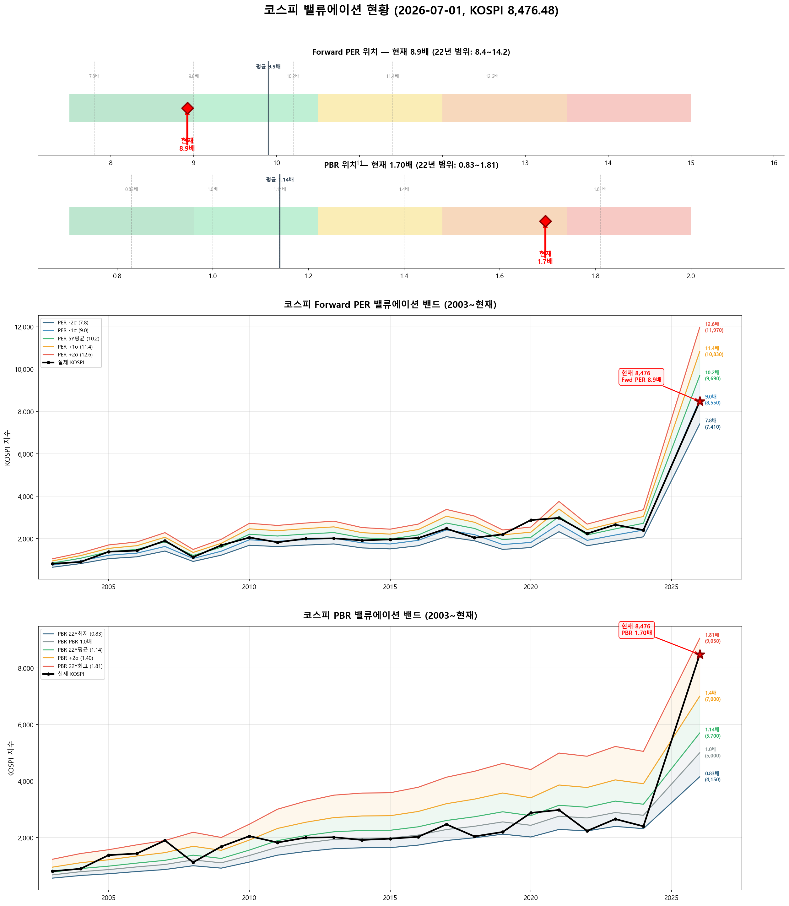

# 📋 MarketTop 일일 종합 (2026-07-01 08:27)

> A4 한 장 요약 — 상세는 각 시장 리포트 참조

---

### 🟢 코스피 8,476.48  —  📈 상승장 (신뢰도 90%)

| 과열 점수 | 53/100 🟢 정상 |
|:---:|:---|

> ✅ **다음 매도 목표 8,962(+5.7%) 대기**

**📈 상승 시**

| 다음 매도 목표 | **8,962** (+5.7%) → 이격도121(MA60) + RSI85+ + MFI70+ (승률 71%) |
|:---:|:---|

**📉 하락 시**

| 1차 방어선 | **8,222** (-3%) → 30% 손절 |
|:---:|:---|
| 핵심 하락감지 | ADX20+ + MACD데드 + RSI68+ (승률 83%) |
| 강력 매도 | 전체 4개+ 전략 동시 발동 시 → 50% 청산 (검증승률 74%) |

**📍 분할매도 단계**

| 단계 | 목표가 | 등락률 | 전략 | 승률 | 틀렸을 때 |
|:---:|---:|:---:|:---|:---:|:---|
| ⏳ 1단계 | **8,962** | +5.7% | 이격도121(MA60) + RSI85+ + MFI70+ | 71% | 평균+6% |
| ⏳ 2단계 | **9,437** | +11.3% | 이격도115(MA35) + MFI90+ | 100% | - |
| ⏳ 3단계 | **10,098** | +19.1% | 이격도125(MA40) + RSI65+ + Stoch90+ | 83% | 평균+6% |

**🛑 손절 단계**

| 단계 | 손절가 | 비중 | 전략 | 승률 |
|:---:|---:|:---:|:---|:---:|
| 1단계 | **8,222** (-3%) | 30% | ADX20+ + MACD데드 + RSI68+ | 83% |
| 2단계 | **8,053** (-5%) | 30% | BB101%반전 + 이격도118(MA35) | 86% |
| 3단계 | **7,798** (-8%) | 40% | MFI80반전 + 이격도120(MA70) | 71% |

**🎯 방향성 종합**: 🟠 **약한 하락 압력**

| 방향 | 전략 | 평균 승률 | 예상 변동 |
|:----:|:---:|:--------:|:--------:|
| 🔴 하락(매도) | 7개 | 81.5% | -2.76% |
| 🟢 상승(매수) | 5개 | 80.2% | +4.80% |

**📐 매도 Top1 [이격도115(MA35) + MFI90+] 20일 수익률 분포**

  • 중앙값: **-2.1%** | 5%분위 -12.0% ~ 95%분위 -0.6%

**📐 매수 Top1 [RSI35저점반전 + 하향이격도90(MA10)] 20일 수익률 분포**

  • 중앙값: **+6.9%** | 5%분위 +2.3% ~ 95%분위 +19.4%

**💰 Kelly 권장 매도비중**

| 지표 | 값 | 의미 |
|:---|---:|:---|
| 평균 Half-Kelly (Top5) | **25%** | 매수 후 매도 신호 시 권장 청산비율 |
| 최대 Half-Kelly | 41% | 가장 강한 전략의 권장 비중 |
| 평균 Sharpe (Top5) | 2.57 | 우수 |
| 2% 이내 임박 전략 수 | 0개 | 신호 발동 임박도 |

---

### 🔴 코스닥 916.18  —  📉 하락장 (신뢰도 100%)

| 과열 점수 | 31/100 🔵 저평가 |
|:---:|:---|

> ✅ **다음 매도 목표 953(+4.0%) 대기**

**📈 상승 시**

| 다음 매도 목표 | **953** (+4.0%) → 이격도102(MA10) + 거래량2.5배+ (승률 88%) |
|:---:|:---|

**📉 하락 시**

| 1차 방어선 | **889** (-3%) → 30% 손절 |
|:---:|:---|
| 핵심 하락감지 | MACD데드 + RSI68+ + MFI78+ (승률 100%) |
| 강력 매도 | 전체 6개+ 전략 동시 발동 시 → 50% 청산 (검증승률 74%) |

**📍 분할매도 단계**

| 단계 | 목표가 | 등락률 | 전략 | 승률 | 틀렸을 때 |
|:---:|---:|:---:|:---|:---:|:---|
| 🎯 1단계 | **953** | +4.0% | 이격도102(MA10) + 거래량2.5배+ | 88% | 평균+3% |
| ⏳ 2단계 | **1,078** | +17.6% | 이격도104(MA35) + CCI200+ + ADX35+ | 71% | 평균+8% |
| ⏳ 3단계 | **1,260** | +37.5% | 이격도116(MA65) + CCI160+ + ADX15+ | 89% | 평균+10% |

**🛑 손절 단계**

| 단계 | 손절가 | 비중 | 전략 | 승률 |
|:---:|---:|:---:|:---|:---:|
| 1단계 | **889** (-3%) | 30% | MACD데드 + RSI68+ + MFI78+ | 100% |
| 2단계 | **870** (-5%) | 30% | MFI88반전 + RSI60+ + Stoch95+ | 80% |
| 3단계 | **843** (-8%) | 40% | RSI80반전 + 이격도123(MA90) | 86% |

**🎯 방향성 종합**: 🟠 **약한 하락 압력**

| 방향 | 전략 | 평균 승률 | 예상 변동 |
|:----:|:---:|:--------:|:--------:|
| 🔴 하락(매도) | 12개 | 81.3% | -3.39% |
| 🟢 상승(매수) | 12개 | 86.1% | +9.91% |

**📐 매도 Top1 [MACD데드 + RSI68+ + MFI78+] 20일 수익률 분포**

  • 중앙값: **-3.4%** | 5%분위 -13.6% ~ 95%분위 -0.9%

**📐 매수 Top1 [하향이격도86(MA90) + CCI-250- + ADX45+] 20일 수익률 분포**

  • 중앙값: **+12.7%** | 5%분위 +2.6% ~ 95%분위 +19.4%

**💰 Kelly 권장 매도비중**

| 지표 | 값 | 의미 |
|:---|---:|:---|
| 평균 Half-Kelly (Top5) | **30%** | 매수 후 매도 신호 시 권장 청산비율 |
| 최대 Half-Kelly | 41% | 가장 강한 전략의 권장 비중 |
| 평균 Sharpe (Top5) | 2.83 | 우수 |
| 2% 이내 임박 전략 수 | 0개 | 신호 발동 임박도 |

---

### 📊 코스피 밸류에이션

| 지표 | 현재 | 22Y평균 | 판단 |
|:---:|:---:|:---:|:---|
| **Fwd PER** | **8.9배** | 9.9배 | 저평가 🟢 |
| **PBR** | **1.70배** | 1.14배 | 과열 🔴 |
| Fwd EPS | 950 | - | BPS 5000 |

| PER 밴드 | 적정지수 | 괴리 |
|:---:|---:|:---:|
| -2σ (7.8) | 7,410 | -12.6% |
| -1σ (9.0) | 8,550 | +0.9% ◀ |
| 5Y평균 (10.2) | 9,690 | +14.3% |
| +1σ (11.4) | 10,830 | +27.8% |
| +2σ (12.6) | 11,970 | +41.2% |

---

### � 코스피 향후 60일 등락 위험 분석

> 💡 과거 30년간 지금과 비슷했던 상황(이격도 114%, 2개월 상승률 +55%) **58번** 발생
> → 그때 이후 2개월간 실제로 얼마나 올랐고 빠졌는지 통계

**📈 상승 가능성:**

| 항목 | 결과 | 해석 |
|:---|:---:|:---|
| **2개월 내 평균 최대상승폭** | **+29.2%** | 중위값 +26.2% |
| 역대 최고 사례 | +57.6% | 지수 13,361 |

| 상승폭 | 발생 확률 | 그때 지수 |
|:---|:---:|---:|
| +5% 이상 상승 | **95%** | 8,900 |
| +10% 이상 상승 | **93%** | 9,324 |
| +15% 이상 상승 | **88%** | 9,748 |
| +20% 이상 상승 | **79%** | 10,172 |

**📉 하락 위험:** 🟡 보통

| 항목 | 결과 | 해석 |
|:---|:---:|:---|
| **2개월 내 평균 최대낙폭** | **-7.3%** | 중위값 -5.6% |
| 역대 최악의 경우 | -46.8% | 지수 4,513 |
| 평소보다 위험한 정도 | 1.2배 | 평소와 비슷한 수준 |

**2개월 내 하락 확률과 예상 지수:**

| 하락폭 | 발생 확률 | 그때 지수 |
|:---|:---:|---:|
| -5% 이상 하락 | **57%** | 8,053 |
| -10% 이상 하락 | **26%** | 7,629 |
| -15% 이상 하락 | **7%** | 7,205 |
| -20% 이상 하락 | **3%** | 6,781 |

**💡 확률 기반 판단:**

> 과거 유사 상황에서 **+20%까지 상승할 확률이 50% 이상**이었고,
> 동시에 **-5%까지 하락할 확률도 50% 이상**이었습니다.
>
> 📌 **상승 기대값(27.7)이 하락 기대값(4.1)보다 크므로 (6.7배)**,
> **10,172**(+20%)까지 보유 후 익절하되, **8,053**(-5%) 이탈 시 손절이 합리적

---

### 🔮 코스피 과거 유사 패턴 분석

> 💡 현재와 가격 움직임 + 기술적 지표가 비슷했던 과거 **20개 시점** 발견 (평균 유사도 69%)
> → 그 시점 이후 40일간 실제로 어떻게 움직였는지 통계

**📊 유사 패턴 이후 40일간 등락 범위:**

| 구분 | 평균 | 중위값 | 지수 환산 |
|:---|:---:|:---:|---:|
| 📈 최대 상승폭 | **+6.7%** | +4.4% | 8,847 |
| 📉 최대 하락폭 | **-5.1%** | -3.8% | 8,153 |
| 🚀 최고 사례 | +32.9% | - | 11,264 |
| 💥 최악 사례 | -16.6% | - | 7,068 |

**🔄 반전 패턴:**

| 패턴 | 평균 크기 | 해석 |
|:---|:---:|:---|
| 고점 찍고 반락 | **-9.1%** | 상승 후 평균 이만큼 되돌림 |
| 저점 찍고 반등 | **+9.7%** | 하락 후 평균 이만큼 회복 |

**⏰ 시간대별 상승 확률:**

| 기간 | 상승 확률 | 평균 수익률 | 예상 지수 |
|:---|:---:|:---:|---:|
| 10일 후 | **60%** | +1.4% | 8,592 |
| 20일 후 | **60%** | +1.5% | 8,602 |
| 40일 후 | **60%** | +2.5% | 8,691 |

**📈 대표 경로 (중위값):**

| 시점 | 낙관(상위25%) | 중립(중위) | 비관(하위25%) | 중립 지수 |
|:---|:---:|:---:|:---:|---:|
| 5일 후 | +1.7% | +0.1% | -0.6% | 8,487 |
| 10일 후 | +3.6% | +1.1% | -0.2% | 8,566 |
| 20일 후 | +3.0% | +0.2% | -2.0% | 8,491 |
| 30일 후 | +3.0% | +0.1% | -4.5% | 8,484 |
| 40일 후 | +5.2% | +1.5% | -5.1% | 8,607 |

**📅 가장 유사했던 과거 시점 (최근 5개):**

- **2024-05-13** (유사도 68%) — 지수 2,727 → 40일간 최대+5.2%, 최대-3.4%, 최종+5.2%
- **2022-05-04** (유사도 68%) — 지수 2,678 → 40일간 최대+0.3%, 최대-14.1%, 최종-12.5%
- **2022-02-21** (유사도 67%) — 지수 2,744 → 40일간 최대+0.6%, 최대-4.5%, 최종-0.9%
- **2021-12-22** (유사도 68%) — 지수 2,984 → 40일간 최대+1.2%, 최대-12.4%, 최종-8.9%
- **2021-10-29** (유사도 73%) — 지수 2,971 → 40일간 최대+2.0%, 최대-4.4%, 최종+1.4%

### 🔮 코스닥 과거 유사 패턴 분석

> 💡 현재와 가격 움직임 + 기술적 지표가 비슷했던 과거 **20개 시점** 발견 (평균 유사도 71%)
> → 그 시점 이후 40일간 실제로 어떻게 움직였는지 통계

**📊 유사 패턴 이후 40일간 등락 범위:**

| 구분 | 평균 | 중위값 | 지수 환산 |
|:---|:---:|:---:|---:|
| 📈 최대 상승폭 | **+5.9%** | +3.8% | 951 |
| 📉 최대 하락폭 | **-9.5%** | -7.7% | 846 |
| 🚀 최고 사례 | +22.1% | - | 1,119 |
| 💥 최악 사례 | -26.0% | - | 678 |

**🔄 반전 패턴:**

| 패턴 | 평균 크기 | 해석 |
|:---|:---:|:---|
| 고점 찍고 반락 | **-14.1%** | 상승 후 평균 이만큼 되돌림 |
| 저점 찍고 반등 | **+10.4%** | 하락 후 평균 이만큼 회복 |

**⏰ 시간대별 상승 확률:**

| 기간 | 상승 확률 | 평균 수익률 | 예상 지수 |
|:---|:---:|:---:|---:|
| 10일 후 | **65%** | +0.2% | 918 |
| 20일 후 | **60%** | -0.3% | 914 |
| 40일 후 | **35%** | -2.4% | 894 |

**📈 대표 경로 (중위값):**

| 시점 | 낙관(상위25%) | 중립(중위) | 비관(하위25%) | 중립 지수 |
|:---|:---:|:---:|:---:|---:|
| 5일 후 | +2.6% | +0.7% | -1.1% | 923 |
| 10일 후 | +3.4% | +1.7% | -0.9% | 932 |
| 20일 후 | +2.8% | +0.5% | -3.8% | 921 |
| 30일 후 | +2.5% | -1.5% | -7.5% | 903 |
| 40일 후 | +2.2% | -2.5% | -7.5% | 893 |

**📅 가장 유사했던 과거 시점 (최근 5개):**

- **2024-09-13** (유사도 70%) — 지수 733 → 40일간 최대+6.5%, 최대-7.0%, 최종-6.0%
- **2024-08-28** (유사도 70%) — 지수 762 → 40일간 최대+2.4%, 최대-7.4%, 최종-2.5%
- **2023-10-30** (유사도 75%) — 지수 757 → 40일간 최대+14.0%, 최대-2.8%, 최종+12.0%
- **2023-10-12** (유사도 71%) — 지수 835 → 40일간 최대+0.5%, 최대-11.9%, 최종-2.7%
- **2022-06-27** (유사도 70%) — 지수 771 → 40일간 최대+8.3%, 최대-6.2%, 최종+1.7%

---

### 📎 상세 리포트

- 코스피: [코스피_고점판독리포트_20260701_082549.md](코스피_고점판독리포트_20260701_082549.md)
- 코스닥: [코스닥_고점판독리포트_20260701_082722.md](코스닥_고점판독리포트_20260701_082722.md)

---

*본 리포트는 백테스트 기반 참고용이며, 투자 판단의 최종 책임은 투자자 본인에게 있습니다.*