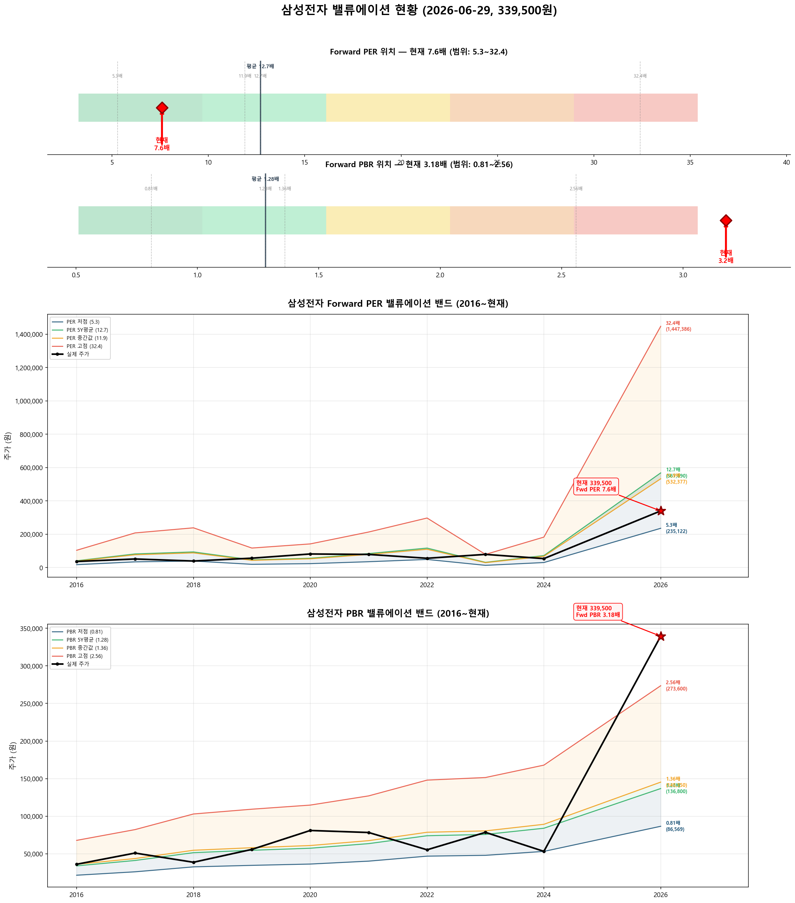
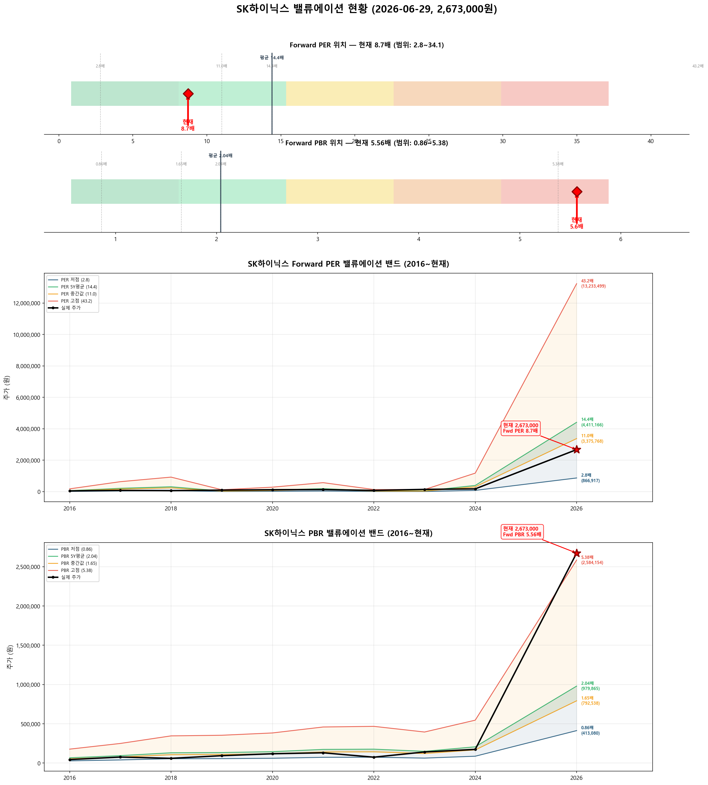

# 📊 삼성전자 · SK하이닉스 밸류에이션 분석 리포트

**분석일시**: 2026년 06월 29일 08:33  
**데이터 출처**: 네이버금융, wisereport 컨센서스  
**분석 방법론**: Forward PER 중심 (싸이클 산업 특성 반영)  

---

## ⚙️ 싸이클 산업과 Forward PER

> **반도체는 대표적인 싸이클 산업**입니다. Trailing PER(과거 실적 기준)은 오해를 유발합니다:  
> - **사이클 저점**: 실적 악화 → Trailing PER 급등 → 수치만 보면 "비싸 보이지만" 실제로는 매수 적기  
> - **사이클 고점**: 실적 폭증 → Trailing PER 급락 → 수치만 보면 "싸 보이지만" 실제로는 고점 부근  
> 
> 따라서 **Forward PER (향후 12개월 예상 실적 기준)**을 핵심 지표로 사용합니다.  
> Forward PER = 현재 주가 ÷ 26년(E) EPS

---

## 🎯 종합 밸류에이션 요약

| 항목 | 삼성전자 | SK하이닉스 |
|:---:|:---:|:---:|
| 현재 주가 | 339,500원 | 2,673,000원 |
| 시가총액 | 19,848,115억 | 19,050,534억 |
| 52주 고/저 | 374,500 / 59,800 | 2,987,000 / 245,000 |
|  |  |  |
| **━━ Forward 지표 (핵심) ━━** |  |  |
| **Forward PER (26E)** | **7.6배** | **8.7배** |
| **Forward PBR (26E)** | **3.18배** | **5.56배** |
| 26년(E) EPS | 44,700원 | 306,331원 |
| 26년(E) BPS | 106,875원 | 480,326원 |
| 26년(E) ROE | 41.8% | 63.8% |
| **Forward PER 판단** | **✅ Forward PER 낮음 — 저평가** | **🟡 Forward PER 적정 수준** |
|  |  |  |
| ━━ Trailing 지표 (참고) ━━ |  |  |
| Trailing PER | 51.7배 | 45.3배 |
| 12M Forward PER | 7.4배 | 4.9배 |
| 현재 PBR | 5.30배 | 15.31배 |
| 현재 ROE | 10.3% | 33.8% |
| 배당수익률 | 0.49% | 0.11% |
|  |  |  |
| ━━ 적정주가 ━━ |  |  |
| 컨센서스 목표주가 | 467,708원 | 3,091,667원 |
| **적정주가 (Fwd PER)** | **567,690원** | **4,411,166원** |
| **적정주가 (Fwd PBR)** | **136,800원** | **979,865원** |
| **적정주가 (평균)** | **352,245원** | **2,695,516원** |
| **현재 대비 괴리율** | **-3.6%** | **-0.8%** |
| **종합 판단** | **🟡 적정 수준** | **🟡 적정 수준** |

---

## 📈 삼성전자 (A005930) 상세 분석

### 📊 밸류에이션 밴드 차트



### 현재 위치

- **주가**: 339,500원
- **52주 고점 대비**: -9.3%
- **52주 저점 대비**: +467.7%
- **외국인 지분율**: 49.6%
- **컨센서스 목표주가**: 467,708원 (현재 대비 ↑27.4%)

### ⭐ Forward PER 분석 (핵심)

| 항목 | 값 |
|:----:|:---:|
| 26년(E) EPS | 44,700원 |
| **Forward PER** | **7.6배** |
| 5년 평균 PER | 12.7배 |
| Forward vs 5년평균 | -40.2% |
| **판단** | **✅ Forward PER 낮음 — 저평가** |

**Forward PER Band (26년E EPS = 44,700원 기준)**

| PER 배수 | 주가 수준 | 현재 주가 대비 |
|:--------:|:--------:|:------------:|
| 3배 | 134,100원 | +153.2% |
| 5배 | 223,500원 | +51.9% |
| 7배 | 312,900원 | +8.5% ◀◀ |
| 10배 | 447,000원 | -24.0% |
| 13배 | 581,100원 | -41.6% |
| 15배 | 670,500원 | -49.4% |
| 20배 | 894,000원 | -62.0% |
| 25배 | 1,117,500원 | -69.6% |

**Forward PER Band 시각화**

```
       134,100원 │ ██████ PER 3x
       223,500원 │ ██████████ PER 5x
       312,900원 │ ██████████████ PER 7x
       339,500원 ★ ▓▓▓▓▓▓▓▓▓▓▓▓▓▓▓ ★ 현재 주가
       447,000원 │ ████████████████████ PER 10x
       581,100원 │ ██████████████████████████ PER 13x
       670,500원 │ ██████████████████████████████ PER 15x
       894,000원 │ ████████████████████████████████████████ PER 20x
     1,117,500원 │ ██████████████████████████████████████████████████ PER 25x
```

### PER Band (히스토리컬 레벨)

**현재 EPS**: 7,477원 / **26년(E) EPS**: 44,700원

| PER 수준 | PER 배수 | 현재EPS 기준 | 26년E 기준 | 현재 주가 위치 |
|:--------:|:-------:|:----------:|:---------:|:------------:|
| 저점 | 5.3배 | 39,329원 | 235,122원 | 위 (+44%) |
| 5년평균 | 12.7배 | 94,958원 | 567,690원 | 아래 (-40%) |
| 중간값 | 11.9배 | 89,051원 | 532,377원 | 아래 (-36%) |
| 고점 | 32.4배 | 242,105원 | 1,447,386원 | 아래 (-77%) |

**PER 밴드 시각화 (26년E EPS 기준)**

```
       235,122원 │ ███████ 저점 PER 5.3x
       339,500원 ★ ▓▓▓▓▓▓▓▓▓▓ ★ 현재 주가
       532,377원 │ ████████████████ 중간값 PER 11.9x
       567,690원 │ █████████████████ 5년평균 PER 12.7x
     1,447,386원 │ █████████████████████████████████████████████ 고점 PER 32.4x
```

### PBR Band 분석

**현재 BPS**: 71,679원 / **26년(E) BPS**: 106,875원  
**Forward PBR**: 3.18배 (5년 평균 1.28배)

**Forward PBR Band (26년E BPS = 106,875원 기준)**

| PBR 배수 | 주가 수준 | 현재 주가 대비 |
|:--------:|:--------:|:------------:|
| 0.5배 | 53,438원 | +535.3% |
| 0.8배 | 85,500원 | +297.1% |
| 1.0배 | 106,875원 | +217.7% |
| 1.3배 | 138,938원 | +144.4% |
| 1.5배 | 160,312원 | +111.8% |
| 2.0배 | 213,750원 | +58.8% |
| 2.5배 | 267,188원 | +27.1% |
| 3.0배 | 320,625원 | +5.9% ◀◀ |
| 4.0배 | 427,500원 | -20.6% |
| 5.0배 | 534,375원 | -36.5% |

| PBR 수준 | PBR 배수 | 현재BPS 기준 | 26년E 기준 | 현재 주가 위치 |
|:--------:|:-------:|:----------:|:---------:|:------------:|
| 저점 | 0.81배 | 58,060원 | 86,569원 | 위 (+292%) |
| 5년평균 | 1.28배 | 91,749원 | 136,800원 | 위 (+148%) |
| 중간값 | 1.36배 | 97,483원 | 145,350원 | 위 (+134%) |
| 고점 | 2.56배 | 183,498원 | 273,600원 | 위 (+24%) |

**PBR 밴드 시각화 (26년E BPS 기준)**

```
        86,569원 │ ███████████ 저점 PBR 0.81x
       136,800원 │ ██████████████████ 5년평균 PBR 1.28x
       145,350원 │ ███████████████████ 중간값 PBR 1.36x
       273,600원 │ ████████████████████████████████████ 고점 PBR 2.56x
       339,500원 ★ ▓▓▓▓▓▓▓▓▓▓▓▓▓▓▓▓▓▓▓▓▓▓▓▓▓▓▓▓▓▓▓▓▓▓▓▓▓▓▓▓▓▓▓▓▓ ★ 현재 주가
```

### 히스토리컬 PER·PBR 추이

| 연도 | 주가 | EPS | PER | BPS | PBR | ROE |
|:----:|:----:|:---:|:---:|:---:|:---:|:---:|
| 16년 | 36,040 | 3,187 | 11.3 | 26,503 | 1.36 | 12.0% |
| 17년 | 50,960 | 6,405 | 8.0 | 32,102 | 1.59 | 19.9% |
| 18년 | 38,700 | 7,352 | 5.3 | 40,214 | 0.96 | 18.3% |
| 19년 | 55,800 | 3,602 | 15.5 | 42,701 | 1.31 | 8.4% |
| 20년 | 81,000 | 4,370 | 18.5 | 44,838 | 1.81 | 9.8% |
| 21년 | 78,300 | 6,574 | 11.9 | 49,623 | 1.58 | 13.2% |
| 22년 | 55,300 | 9,168 | 6.0 | 57,822 | 0.96 | 15.9% |
| 23년 | 78,500 | 2,424 | 32.4 | 59,170 | 1.33 | 4.1% |
| 24년 | 53,200 | 5,632 | 9.4 | 65,612 | 0.81 | 8.6% |
| 25년4Q(E) | 183,500 | 7,477 | 24.5 | 71,679 | 2.56 | 10.4% |

### 실적 현황

| 항목 | 25년4Q 연환산 | 26년(E) 컨센서스 | YoY |
|:----:|:----------:|:-------------:|:---:|
| 매출액 | 3,336,059억 | 5,159,507억 | +55% |
| 영업이익 | 436,012억 | 1,925,789억 | +342% |
| 지배순이익 | 442,610억 | 1,602,675억 | +262% |
| OPM | 13.1% | 37.3% | |
| EPS | 7,477원 | 44,700원 | +498% |
| BPS | 71,679원 | 106,875원 | +49% |
| ROE | 10.3% | 41.8% | |

### 적정주가 산출

**방법 1: Forward PER 기반** (5년 평균 PER × 26년E EPS)
- 12.7배 × 44,700원 = **567,690원** (현재 대비 -40.2%)

**방법 2: Forward PBR 기반** (5년 평균 PBR × 26년E BPS)
- 1.28배 × 106,875원 = **136,800원** (현재 대비 +148.2%)

**방법 3: 컨센서스 기반** (애널리스트 목표주가)
- **467,708원** (현재 대비 -27.4%)

**종합 적정주가**: **352,245원** → 현재 대비 **-3.6%**

> **판단: 🟡 적정 수준**  
> **Forward PER 관점: ✅ Forward PER 낮음 — 저평가**

---

## 📈 SK하이닉스 (A000660) 상세 분석

### 📊 밸류에이션 밴드 차트



### 현재 위치

- **주가**: 2,673,000원
- **52주 고점 대비**: -10.5%
- **52주 저점 대비**: +991.0%
- **외국인 지분율**: 53.5%
- **컨센서스 목표주가**: 3,091,667원 (현재 대비 ↑13.5%)

### ⭐ Forward PER 분석 (핵심)

| 항목 | 값 |
|:----:|:---:|
| 26년(E) EPS | 306,331원 |
| **Forward PER** | **8.7배** |
| 5년 평균 PER | 14.4배 |
| Forward vs 5년평균 | -39.4% |
| **판단** | **🟡 Forward PER 적정 수준** |

**Forward PER Band (26년E EPS = 306,331원 기준)**

| PER 배수 | 주가 수준 | 현재 주가 대비 |
|:--------:|:--------:|:------------:|
| 3배 | 918,993원 | +190.9% |
| 5배 | 1,531,655원 | +74.5% |
| 7배 | 2,144,317원 | +24.7% |
| 10배 | 3,063,310원 | -12.7% ◀◀ |
| 13배 | 3,982,303원 | -32.9% |
| 15배 | 4,594,965원 | -41.8% |
| 20배 | 6,126,620원 | -56.4% |
| 25배 | 7,658,275원 | -65.1% |

**Forward PER Band 시각화**

```
       918,993원 │ ██████ PER 3x
     1,531,655원 │ ██████████ PER 5x
     2,144,317원 │ ██████████████ PER 7x
     2,673,000원 ★ ▓▓▓▓▓▓▓▓▓▓▓▓▓▓▓▓▓ ★ 현재 주가
     3,063,310원 │ ████████████████████ PER 10x
     3,982,303원 │ ██████████████████████████ PER 13x
     4,594,965원 │ ██████████████████████████████ PER 15x
     6,126,620원 │ ████████████████████████████████████████ PER 20x
     7,658,275원 │ ██████████████████████████████████████████████████ PER 25x
```

### PER Band (히스토리컬 레벨)

**현재 EPS**: 60,221원 / **26년(E) EPS**: 306,331원

| PER 수준 | PER 배수 | 현재EPS 기준 | 26년E 기준 | 현재 주가 위치 |
|:--------:|:-------:|:----------:|:---------:|:------------:|
| 저점 | 2.8배 | 170,425원 | 866,917원 | 위 (+208%) |
| 5년평균 | 14.4배 | 867,182원 | 4,411,166원 | 아래 (-39%) |
| 중간값 | 11.0배 | 663,635원 | 3,375,768원 | 아래 (-21%) |
| 고점 | 68.9배 | 4,149,829원 | 21,109,269원 | 아래 (-87%) |

**PER 밴드 시각화 (26년E EPS 기준)**

```
       866,917원 │ █ 저점 PER 2.8x
     2,673,000원 ★ ▓▓▓▓▓ ★ 현재 주가
     3,375,768원 │ ███████ 중간값 PER 11.0x
     4,411,166원 │ █████████ 5년평균 PER 14.4x
    21,109,269원 │ █████████████████████████████████████████████ 고점 PER 68.9x
```

### PBR Band 분석

**현재 BPS**: 169,098원 / **26년(E) BPS**: 480,326원  
**Forward PBR**: 5.56배 (5년 평균 2.04배)

**Forward PBR Band (26년E BPS = 480,326원 기준)**

| PBR 배수 | 주가 수준 | 현재 주가 대비 |
|:--------:|:--------:|:------------:|
| 0.8배 | 384,261원 | +595.6% |
| 1.0배 | 480,326원 | +456.5% |
| 1.3배 | 624,424원 | +328.1% |
| 1.5배 | 720,489원 | +271.0% |
| 2.0배 | 960,652원 | +178.2% |
| 2.5배 | 1,200,815원 | +122.6% |
| 3.0배 | 1,440,978원 | +85.5% |
| 4.0배 | 1,921,304원 | +39.1% |
| 5.0배 | 2,401,630원 | +11.3% ◀◀ |

| PBR 수준 | PBR 배수 | 현재BPS 기준 | 26년E 기준 | 현재 주가 위치 |
|:--------:|:-------:|:----------:|:---------:|:------------:|
| 저점 | 0.86배 | 145,424원 | 413,080원 | 위 (+547%) |
| 5년평균 | 2.04배 | 344,960원 | 979,865원 | 위 (+173%) |
| 중간값 | 1.65배 | 279,012원 | 792,538원 | 위 (+237%) |
| 고점 | 5.38배 | 909,747원 | 2,584,154원 | 위 (+3%) |

**PBR 밴드 시각화 (26년E BPS 기준)**

```
       413,080원 │ ██████ 저점 PBR 0.86x
       792,538원 │ █████████████ 중간값 PBR 1.65x
       979,865원 │ ████████████████ 5년평균 PBR 2.04x
     2,584,154원 │ ███████████████████████████████████████████ 고점 PBR 5.38x
     2,673,000원 ★ ▓▓▓▓▓▓▓▓▓▓▓▓▓▓▓▓▓▓▓▓▓▓▓▓▓▓▓▓▓▓▓▓▓▓▓▓▓▓▓▓▓▓▓▓▓ ★ 현재 주가
```

### 히스토리컬 PER·PBR 추이

| 연도 | 주가 | EPS | PER | BPS | PBR | ROE |
|:----:|:----:|:---:|:---:|:---:|:---:|:---:|
| 16년 | 44,700 | 4,057 | 11.0 | 32,990 | 1.35 | 12.3% |
| 17년 | 76,500 | 14,617 | 5.2 | 46,449 | 1.65 | 31.5% |
| 18년 | 60,500 | 21,346 | 2.8 | 64,348 | 0.94 | 33.2% |
| 19년 | 94,100 | 2,755 | 34.1 | 65,825 | 1.43 | 4.2% |
| 20년 | 118,500 | 6,532 | 18.1 | 71,275 | 1.66 | 9.2% |
| 21년 | 131,000 | 13,190 | 9.9 | 85,380 | 1.53 | 15.4% |
| 22년 | 75,000 | 3,063 | 24.5 | 86,904 | 0.86 | 3.5% |
| 23년 | 141,500 | -12,517 | 적자 | 73,495 | 1.93 | -17.0% |
| 24년 | 173,900 | 27,182 | 6.4 | 101,515 | 1.71 | 26.8% |
| 25년4Q(E) | 910,000 | 60,221 | 15.1 | 169,098 | 5.38 | 35.6% |

### 실적 현황

| 항목 | 25년4Q 연환산 | 26년(E) 컨센서스 | YoY |
|:----:|:----------:|:-------------:|:---:|
| 매출액 | 971,467억 | 2,299,806억 | +137% |
| 영업이익 | 472,064억 | 1,606,938억 | +240% |
| 지배순이익 | 429,193억 | 1,299,259억 | +203% |
| OPM | 48.6% | 69.9% | |
| EPS | 60,221원 | 306,331원 | +409% |
| BPS | 169,098원 | 480,326원 | +184% |
| ROE | 33.8% | 63.8% | |

### 적정주가 산출

**방법 1: Forward PER 기반** (5년 평균 PER × 26년E EPS)
- 14.4배 × 306,331원 = **4,411,166원** (현재 대비 -39.4%)

**방법 2: Forward PBR 기반** (5년 평균 PBR × 26년E BPS)
- 2.04배 × 480,326원 = **979,865원** (현재 대비 +172.8%)

**방법 3: 컨센서스 기반** (애널리스트 목표주가)
- **3,091,667원** (현재 대비 -13.5%)

**종합 적정주가**: **2,695,516원** → 현재 대비 **-0.8%**

> **판단: 🟡 적정 수준**  
> **Forward PER 관점: 🟡 Forward PER 적정 수준**

---

## 🔍 삼성전자 vs SK하이닉스 비교

| 구분 | 삼성전자 | SK하이닉스 | 비고 |
|:----:|:-------:|:--------:|:----:|
| **Forward PER** | **7.6배** | **8.7배** | 핵심 지표 |
| **Forward PBR** | **3.18배** | **5.56배** | |
| Trailing PER | 51.7배 | 45.3배 | 참고 (싸이클 왜곡) |
| 12M Fwd PER | 7.4배 | 4.9배 | |
| 현재 PBR | 5.30배 | 15.31배 | |
| 현재 ROE | 10.3% | 33.8% | |
| 26년E ROE | 41.8% | 63.8% | |
| OPM | 13.1% | 48.6% | |
| 26년E EPS 성장률 | +498% | +409% | |
| 적정주가 괴리율 | -3.6% | -0.8% | |
| **Forward PER 판단** | **✅ Forward PER 낮음 — 저평가** | **🟡 Forward PER 적정 수준** | |
| **밸류 판단** | **🟡 적정 수준** | **🟡 적정 수준** | |

---

## 💡 투자 시사점

### 삼성전자

- **Forward PER 7.6배** → ✅ Forward PER 낮음 — 저평가
- Trailing PER(51.7배)과의 괴리가 큼 → 26년 실적 대폭 개선 전망 반영
- 현재 주가(339,500원)는 적정주가(352,245원) 부근으로 **적정 밸류에이션**
- 52주 고점(374,500원) 대비 -9.3%
- 애널리스트 목표주가 467,708원 (현재 대비 +37.8%)

### SK하이닉스

- **Forward PER 8.7배** → 🟡 Forward PER 적정 수준
- Trailing PER(45.3배)과의 괴리가 큼 → 26년 실적 대폭 개선 전망 반영
- 현재 주가(2,673,000원)는 적정주가(2,695,516원) 부근으로 **적정 밸류에이션**
- 52주 고점(2,987,000원) 대비 -10.5%
- 애널리스트 목표주가 3,091,667원 (현재 대비 +15.7%)

---

## ⚠️ 리스크 요인

- **반도체 사이클**: 메모리 업황 사이클에 따른 실적 변동성 존재. Forward PER가 낮아도 사이클 피크 리스크 점검 필요
- **컨센서스 리스크**: 26년 실적이 컨센서스에 못 미칠 경우 Forward PER 재산출 시 밸류에이션 급등
- **AI 기대감 과반영**: 현재 주가에 AI 수혜 기대가 상당히 반영된 상태
- **환율·지정학**: 원/달러 환율, 미중 갈등, 수출 규제 리스크
- **PBR 고점 리스크**: 역사적 PBR 고점 부근에 위치 → 순자산 대비 프리미엄 과도 여부 점검
- **싸이클 고점 시나리오**: Trailing PER이 낮을 때가 오히려 사이클 고점일 수 있음 (역설적 위험)

---

> **면책 조항**: 본 리포트는 공개된 데이터를 기반으로 한 기계적 분석이며, 투자 권유가 아닙니다. 투자 판단은 본인의 책임하에 이루어져야 합니다.

**분석 도구**: Python  
**데이터 출처**: 네이버금융, wisereport (navercomp.wisereport.co.kr)
