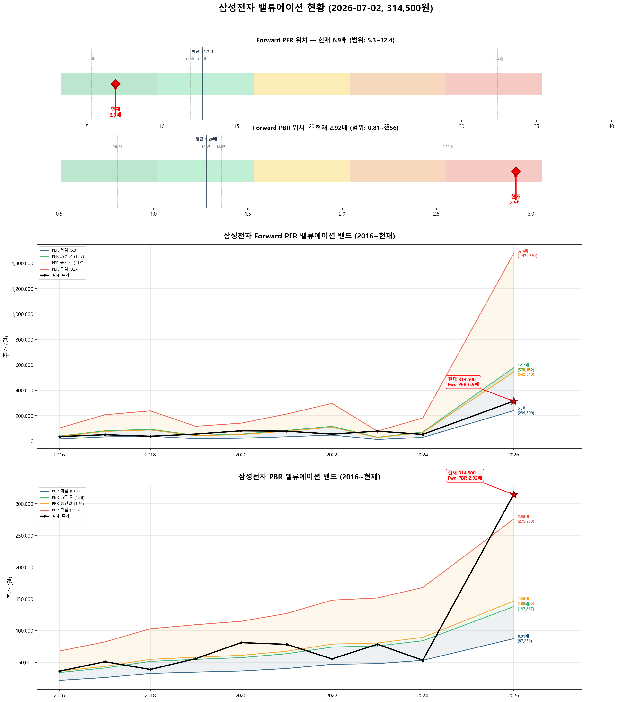
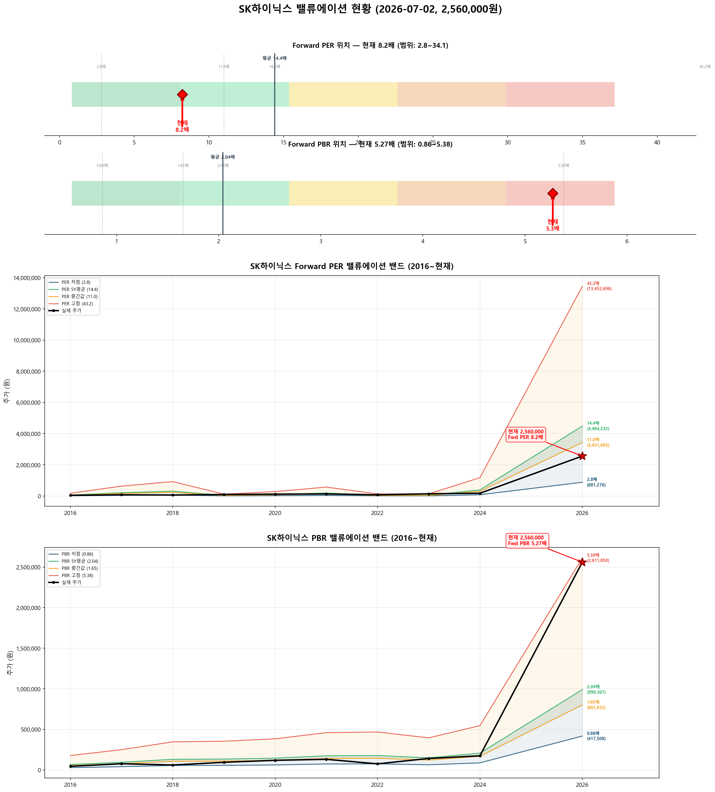

# 📊 삼성전자 · SK하이닉스 밸류에이션 분석 리포트

**분석일시**: 2026년 07월 02일 07:37  
**데이터 출처**: 네이버금융, wisereport 컨센서스  
**분석 방법론**: Forward PER 중심 (싸이클 산업 특성 반영)  

---

## ⚙️ 싸이클 산업과 Forward PER

> **반도체는 대표적인 싸이클 산업**입니다. Trailing PER(과거 실적 기준)은 오해를 유발합니다:  
> - **사이클 저점**: 실적 악화 → Trailing PER 급등 → 수치만 보면 "비싸 보이지만" 실제로는 매수 적기  
> - **사이클 고점**: 실적 폭증 → Trailing PER 급락 → 수치만 보면 "싸 보이지만" 실제로는 고점 부근  
> 
> 따라서 **Forward PER (향후 12개월 예상 실적 기준)**을 핵심 지표로 사용합니다.  
> Forward PER = 현재 주가 ÷ 26년(E) EPS

---

## 🎯 종합 밸류에이션 요약

| 항목 | 삼성전자 | SK하이닉스 |
|:---:|:---:|:---:|
| 현재 주가 | 314,500원 | 2,560,000원 |
| 시가총액 | 18,386,546억 | 18,245,180억 |
| 52주 고/저 | 374,500 / 59,800 | 2,987,000 / 245,000 |
|  |  |  |
| **━━ Forward 지표 (핵심) ━━** |  |  |
| **Forward PER (26E)** | **6.9배** | **8.2배** |
| **Forward PBR (26E)** | **2.92배** | **5.27배** |
| 26년(E) EPS | 45,534원 | 311,405원 |
| 26년(E) BPS | 107,724원 | 485,474원 |
| 26년(E) ROE | 42.3% | 64.1% |
| **Forward PER 판단** | **✅ Forward PER 낮음 — 저평가** | **🟡 Forward PER 적정 수준** |
|  |  |  |
| ━━ Trailing 지표 (참고) ━━ |  |  |
| Trailing PER | 47.9배 | 43.4배 |
| 12M Forward PER | 7.4배 | 4.9배 |
| 현재 PBR | 4.91배 | 14.67배 |
| 현재 ROE | 10.3% | 33.8% |
| 배당수익률 | 0.53% | 0.12% |
|  |  |  |
| ━━ 적정주가 ━━ |  |  |
| 컨센서스 목표주가 | 480,625원 | 3,193,750원 |
| **적정주가 (Fwd PER)** | **578,282원** | **4,484,232원** |
| **적정주가 (Fwd PBR)** | **137,887원** | **990,367원** |
| **적정주가 (평균)** | **358,084원** | **2,737,299원** |
| **현재 대비 괴리율** | **-12.2%** | **-6.5%** |
| **종합 판단** | **✅ 저평가** | **🟡 적정 수준** |

---

## 📈 삼성전자 (A005930) 상세 분석

### 📊 밸류에이션 밴드 차트



### 현재 위치

- **주가**: 314,500원
- **52주 고점 대비**: -16.0%
- **52주 저점 대비**: +425.9%
- **외국인 지분율**: 49.6%
- **컨센서스 목표주가**: 480,625원 (현재 대비 ↑34.6%)

### ⭐ Forward PER 분석 (핵심)

| 항목 | 값 |
|:----:|:---:|
| 26년(E) EPS | 45,534원 |
| **Forward PER** | **6.9배** |
| 5년 평균 PER | 12.7배 |
| Forward vs 5년평균 | -45.6% |
| **판단** | **✅ Forward PER 낮음 — 저평가** |

**Forward PER Band (26년E EPS = 45,534원 기준)**

| PER 배수 | 주가 수준 | 현재 주가 대비 |
|:--------:|:--------:|:------------:|
| 3배 | 136,602원 | +130.2% |
| 5배 | 227,670원 | +38.1% |
| 7배 | 318,738원 | -1.3% ◀◀ |
| 10배 | 455,340원 | -30.9% |
| 13배 | 591,942원 | -46.9% |
| 15배 | 683,010원 | -54.0% |
| 20배 | 910,680원 | -65.5% |
| 25배 | 1,138,350원 | -72.4% |

**Forward PER Band 시각화**

```
       136,602원 │ ██████ PER 3x
       227,670원 │ ██████████ PER 5x
       314,500원 ★ ▓▓▓▓▓▓▓▓▓▓▓▓▓ ★ 현재 주가
       318,738원 │ ██████████████ PER 7x
       455,340원 │ ████████████████████ PER 10x
       591,942원 │ ██████████████████████████ PER 13x
       683,010원 │ ██████████████████████████████ PER 15x
       910,680원 │ ████████████████████████████████████████ PER 20x
     1,138,350원 │ ██████████████████████████████████████████████████ PER 25x
```

### PER Band (히스토리컬 레벨)

**현재 EPS**: 7,477원 / **26년(E) EPS**: 45,534원

| PER 수준 | PER 배수 | 현재EPS 기준 | 26년E 기준 | 현재 주가 위치 |
|:--------:|:-------:|:----------:|:---------:|:------------:|
| 저점 | 5.3배 | 39,329원 | 239,509원 | 위 (+31%) |
| 5년평균 | 12.7배 | 94,958원 | 578,282원 | 아래 (-46%) |
| 중간값 | 11.9배 | 89,051원 | 542,310원 | 아래 (-42%) |
| 고점 | 32.4배 | 242,105원 | 1,474,391원 | 아래 (-79%) |

**PER 밴드 시각화 (26년E EPS 기준)**

```
       239,509원 │ ███████ 저점 PER 5.3x
       314,500원 ★ ▓▓▓▓▓▓▓▓▓ ★ 현재 주가
       542,310원 │ ████████████████ 중간값 PER 11.9x
       578,282원 │ █████████████████ 5년평균 PER 12.7x
     1,474,391원 │ █████████████████████████████████████████████ 고점 PER 32.4x
```

### PBR Band 분석

**현재 BPS**: 71,679원 / **26년(E) BPS**: 107,724원  
**Forward PBR**: 2.92배 (5년 평균 1.28배)

**Forward PBR Band (26년E BPS = 107,724원 기준)**

| PBR 배수 | 주가 수준 | 현재 주가 대비 |
|:--------:|:--------:|:------------:|
| 0.5배 | 53,862원 | +483.9% |
| 0.8배 | 86,179원 | +264.9% |
| 1.0배 | 107,724원 | +191.9% |
| 1.3배 | 140,041원 | +124.6% |
| 1.5배 | 161,586원 | +94.6% |
| 2.0배 | 215,448원 | +46.0% |
| 2.5배 | 269,310원 | +16.8% |
| 3.0배 | 323,172원 | -2.7% ◀◀ |
| 4.0배 | 430,896원 | -27.0% |
| 5.0배 | 538,620원 | -41.6% |

| PBR 수준 | PBR 배수 | 현재BPS 기준 | 26년E 기준 | 현재 주가 위치 |
|:--------:|:-------:|:----------:|:---------:|:------------:|
| 저점 | 0.81배 | 58,060원 | 87,256원 | 위 (+260%) |
| 5년평균 | 1.28배 | 91,749원 | 137,887원 | 위 (+128%) |
| 중간값 | 1.36배 | 97,483원 | 146,505원 | 위 (+115%) |
| 고점 | 2.56배 | 183,498원 | 275,773원 | 위 (+14%) |

**PBR 밴드 시각화 (26년E BPS 기준)**

```
        87,256원 │ ████████████ 저점 PBR 0.81x
       137,887원 │ ███████████████████ 5년평균 PBR 1.28x
       146,505원 │ ████████████████████ 중간값 PBR 1.36x
       275,773원 │ ███████████████████████████████████████ 고점 PBR 2.56x
       314,500원 ★ ▓▓▓▓▓▓▓▓▓▓▓▓▓▓▓▓▓▓▓▓▓▓▓▓▓▓▓▓▓▓▓▓▓▓▓▓▓▓▓▓▓▓▓▓▓ ★ 현재 주가
```

### 히스토리컬 PER·PBR 추이

| 연도 | 주가 | EPS | PER | BPS | PBR | ROE |
|:----:|:----:|:---:|:---:|:---:|:---:|:---:|
| 16년 | 36,040 | 3,187 | 11.3 | 26,503 | 1.36 | 12.0% |
| 17년 | 50,960 | 6,405 | 8.0 | 32,102 | 1.59 | 19.9% |
| 18년 | 38,700 | 7,352 | 5.3 | 40,214 | 0.96 | 18.3% |
| 19년 | 55,800 | 3,602 | 15.5 | 42,701 | 1.31 | 8.4% |
| 20년 | 81,000 | 4,370 | 18.5 | 44,838 | 1.81 | 9.8% |
| 21년 | 78,300 | 6,574 | 11.9 | 49,623 | 1.58 | 13.2% |
| 22년 | 55,300 | 9,168 | 6.0 | 57,822 | 0.96 | 15.9% |
| 23년 | 78,500 | 2,424 | 32.4 | 59,170 | 1.33 | 4.1% |
| 24년 | 53,200 | 5,632 | 9.4 | 65,612 | 0.81 | 8.6% |
| 25년4Q(E) | 183,500 | 7,477 | 24.5 | 71,679 | 2.56 | 10.4% |

### 실적 현황

| 항목 | 25년4Q 연환산 | 26년(E) 컨센서스 | YoY |
|:----:|:----------:|:-------------:|:---:|
| 매출액 | 3,336,059억 | 5,159,507억 | +55% |
| 영업이익 | 436,012억 | 1,925,789억 | +342% |
| 지배순이익 | 442,610억 | 1,602,675억 | +262% |
| OPM | 13.1% | 37.3% | |
| EPS | 7,477원 | 45,534원 | +509% |
| BPS | 71,679원 | 107,724원 | +50% |
| ROE | 10.3% | 42.3% | |

### 적정주가 산출

**방법 1: Forward PER 기반** (5년 평균 PER × 26년E EPS)
- 12.7배 × 45,534원 = **578,282원** (현재 대비 -45.6%)

**방법 2: Forward PBR 기반** (5년 평균 PBR × 26년E BPS)
- 1.28배 × 107,724원 = **137,887원** (현재 대비 +128.1%)

**방법 3: 컨센서스 기반** (애널리스트 목표주가)
- **480,625원** (현재 대비 -34.6%)

**종합 적정주가**: **358,084원** → 현재 대비 **-12.2%**

> **판단: ✅ 저평가**  
> **Forward PER 관점: ✅ Forward PER 낮음 — 저평가**

---

## 📈 SK하이닉스 (A000660) 상세 분석

### 📊 밸류에이션 밴드 차트



### 현재 위치

- **주가**: 2,560,000원
- **52주 고점 대비**: -14.3%
- **52주 저점 대비**: +944.9%
- **외국인 지분율**: 53.5%
- **컨센서스 목표주가**: 3,193,750원 (현재 대비 ↑19.8%)

### ⭐ Forward PER 분석 (핵심)

| 항목 | 값 |
|:----:|:---:|
| 26년(E) EPS | 311,405원 |
| **Forward PER** | **8.2배** |
| 5년 평균 PER | 14.4배 |
| Forward vs 5년평균 | -42.9% |
| **판단** | **🟡 Forward PER 적정 수준** |

**Forward PER Band (26년E EPS = 311,405원 기준)**

| PER 배수 | 주가 수준 | 현재 주가 대비 |
|:--------:|:--------:|:------------:|
| 3배 | 934,215원 | +174.0% |
| 5배 | 1,557,025원 | +64.4% |
| 7배 | 2,179,835원 | +17.4% |
| 10배 | 3,114,050원 | -17.8% |
| 13배 | 4,048,265원 | -36.8% |
| 15배 | 4,671,075원 | -45.2% |
| 20배 | 6,228,100원 | -58.9% |
| 25배 | 7,785,125원 | -67.1% |

**Forward PER Band 시각화**

```
       934,215원 │ ██████ PER 3x
     1,557,025원 │ ██████████ PER 5x
     2,179,835원 │ ██████████████ PER 7x
     2,560,000원 ★ ▓▓▓▓▓▓▓▓▓▓▓▓▓▓▓▓ ★ 현재 주가
     3,114,050원 │ ████████████████████ PER 10x
     4,048,265원 │ ██████████████████████████ PER 13x
     4,671,075원 │ ██████████████████████████████ PER 15x
     6,228,100원 │ ████████████████████████████████████████ PER 20x
     7,785,125원 │ ██████████████████████████████████████████████████ PER 25x
```

### PER Band (히스토리컬 레벨)

**현재 EPS**: 60,221원 / **26년(E) EPS**: 311,405원

| PER 수준 | PER 배수 | 현재EPS 기준 | 26년E 기준 | 현재 주가 위치 |
|:--------:|:-------:|:----------:|:---------:|:------------:|
| 저점 | 2.8배 | 170,425원 | 881,276원 | 위 (+190%) |
| 5년평균 | 14.4배 | 867,182원 | 4,484,232원 | 아래 (-43%) |
| 중간값 | 11.0배 | 663,635원 | 3,431,683원 | 아래 (-25%) |
| 고점 | 68.9배 | 4,149,829원 | 21,458,919원 | 아래 (-88%) |

**PER 밴드 시각화 (26년E EPS 기준)**

```
       881,276원 │ █ 저점 PER 2.8x
     2,560,000원 ★ ▓▓▓▓▓ ★ 현재 주가
     3,431,683원 │ ███████ 중간값 PER 11.0x
     4,484,232원 │ █████████ 5년평균 PER 14.4x
    21,458,919원 │ █████████████████████████████████████████████ 고점 PER 68.9x
```

### PBR Band 분석

**현재 BPS**: 169,098원 / **26년(E) BPS**: 485,474원  
**Forward PBR**: 5.27배 (5년 평균 2.04배)

**Forward PBR Band (26년E BPS = 485,474원 기준)**

| PBR 배수 | 주가 수준 | 현재 주가 대비 |
|:--------:|:--------:|:------------:|
| 0.8배 | 388,379원 | +559.1% |
| 1.0배 | 485,474원 | +427.3% |
| 1.3배 | 631,116원 | +305.6% |
| 1.5배 | 728,211원 | +251.5% |
| 2.0배 | 970,948원 | +163.7% |
| 2.5배 | 1,213,685원 | +110.9% |
| 3.0배 | 1,456,422원 | +75.8% |
| 4.0배 | 1,941,896원 | +31.8% |
| 5.0배 | 2,427,370원 | +5.5% ◀◀ |

| PBR 수준 | PBR 배수 | 현재BPS 기준 | 26년E 기준 | 현재 주가 위치 |
|:--------:|:-------:|:----------:|:---------:|:------------:|
| 저점 | 0.86배 | 145,424원 | 417,508원 | 위 (+513%) |
| 5년평균 | 2.04배 | 344,960원 | 990,367원 | 위 (+158%) |
| 중간값 | 1.65배 | 279,012원 | 801,032원 | 위 (+220%) |
| 고점 | 5.38배 | 909,747원 | 2,611,850원 | 아래 (-2%) |

**PBR 밴드 시각화 (26년E BPS 기준)**

```
       417,508원 │ ███████ 저점 PBR 0.86x
       801,032원 │ █████████████ 중간값 PBR 1.65x
       990,367원 │ █████████████████ 5년평균 PBR 2.04x
     2,560,000원 ★ ▓▓▓▓▓▓▓▓▓▓▓▓▓▓▓▓▓▓▓▓▓▓▓▓▓▓▓▓▓▓▓▓▓▓▓▓▓▓▓▓▓▓▓▓ ★ 현재 주가
     2,611,850원 │ █████████████████████████████████████████████ 고점 PBR 5.38x
```

### 히스토리컬 PER·PBR 추이

| 연도 | 주가 | EPS | PER | BPS | PBR | ROE |
|:----:|:----:|:---:|:---:|:---:|:---:|:---:|
| 16년 | 44,700 | 4,057 | 11.0 | 32,990 | 1.35 | 12.3% |
| 17년 | 76,500 | 14,617 | 5.2 | 46,449 | 1.65 | 31.5% |
| 18년 | 60,500 | 21,346 | 2.8 | 64,348 | 0.94 | 33.2% |
| 19년 | 94,100 | 2,755 | 34.1 | 65,825 | 1.43 | 4.2% |
| 20년 | 118,500 | 6,532 | 18.1 | 71,275 | 1.66 | 9.2% |
| 21년 | 131,000 | 13,190 | 9.9 | 85,380 | 1.53 | 15.4% |
| 22년 | 75,000 | 3,063 | 24.5 | 86,904 | 0.86 | 3.5% |
| 23년 | 141,500 | -12,517 | 적자 | 73,495 | 1.93 | -17.0% |
| 24년 | 173,900 | 27,182 | 6.4 | 101,515 | 1.71 | 26.8% |
| 25년4Q(E) | 910,000 | 60,221 | 15.1 | 169,098 | 5.38 | 35.6% |

### 실적 현황

| 항목 | 25년4Q 연환산 | 26년(E) 컨센서스 | YoY |
|:----:|:----------:|:-------------:|:---:|
| 매출액 | 971,467억 | 2,299,806억 | +137% |
| 영업이익 | 472,064억 | 1,606,938억 | +240% |
| 지배순이익 | 429,193억 | 1,299,259억 | +203% |
| OPM | 48.6% | 69.9% | |
| EPS | 60,221원 | 311,405원 | +417% |
| BPS | 169,098원 | 485,474원 | +187% |
| ROE | 33.8% | 64.1% | |

### 적정주가 산출

**방법 1: Forward PER 기반** (5년 평균 PER × 26년E EPS)
- 14.4배 × 311,405원 = **4,484,232원** (현재 대비 -42.9%)

**방법 2: Forward PBR 기반** (5년 평균 PBR × 26년E BPS)
- 2.04배 × 485,474원 = **990,367원** (현재 대비 +158.5%)

**방법 3: 컨센서스 기반** (애널리스트 목표주가)
- **3,193,750원** (현재 대비 -19.8%)

**종합 적정주가**: **2,737,299원** → 현재 대비 **-6.5%**

> **판단: 🟡 적정 수준**  
> **Forward PER 관점: 🟡 Forward PER 적정 수준**

---

## 🔍 삼성전자 vs SK하이닉스 비교

| 구분 | 삼성전자 | SK하이닉스 | 비고 |
|:----:|:-------:|:--------:|:----:|
| **Forward PER** | **6.9배** | **8.2배** | 핵심 지표 |
| **Forward PBR** | **2.92배** | **5.27배** | |
| Trailing PER | 47.9배 | 43.4배 | 참고 (싸이클 왜곡) |
| 12M Fwd PER | 7.4배 | 4.9배 | |
| 현재 PBR | 4.91배 | 14.67배 | |
| 현재 ROE | 10.3% | 33.8% | |
| 26년E ROE | 42.3% | 64.1% | |
| OPM | 13.1% | 48.6% | |
| 26년E EPS 성장률 | +509% | +417% | |
| 적정주가 괴리율 | -12.2% | -6.5% | |
| **Forward PER 판단** | **✅ Forward PER 낮음 — 저평가** | **🟡 Forward PER 적정 수준** | |
| **밸류 판단** | **✅ 저평가** | **🟡 적정 수준** | |

---

## 💡 투자 시사점

### 삼성전자

- **Forward PER 6.9배** → ✅ Forward PER 낮음 — 저평가
- Trailing PER(47.9배)과의 괴리가 큼 → 26년 실적 대폭 개선 전망 반영
- 현재 주가(314,500원)는 적정주가(358,084원) 대비 **12.2% 저평가** 상태
- 26년 실적 성장이 예상대로 실현되면 상당한 업사이드 잠재력
- 52주 고점(374,500원) 대비 -16.0%
- 애널리스트 목표주가 480,625원 (현재 대비 +52.8%)

### SK하이닉스

- **Forward PER 8.2배** → 🟡 Forward PER 적정 수준
- Trailing PER(43.4배)과의 괴리가 큼 → 26년 실적 대폭 개선 전망 반영
- 현재 주가(2,560,000원)는 적정주가(2,737,299원) 부근으로 **적정 밸류에이션**
- 52주 고점(2,987,000원) 대비 -14.3%
- 애널리스트 목표주가 3,193,750원 (현재 대비 +24.8%)

---

## ⚠️ 리스크 요인

- **반도체 사이클**: 메모리 업황 사이클에 따른 실적 변동성 존재. Forward PER가 낮아도 사이클 피크 리스크 점검 필요
- **컨센서스 리스크**: 26년 실적이 컨센서스에 못 미칠 경우 Forward PER 재산출 시 밸류에이션 급등
- **AI 기대감 과반영**: 현재 주가에 AI 수혜 기대가 상당히 반영된 상태
- **환율·지정학**: 원/달러 환율, 미중 갈등, 수출 규제 리스크
- **PBR 고점 리스크**: 역사적 PBR 고점 부근에 위치 → 순자산 대비 프리미엄 과도 여부 점검
- **싸이클 고점 시나리오**: Trailing PER이 낮을 때가 오히려 사이클 고점일 수 있음 (역설적 위험)

---

> **면책 조항**: 본 리포트는 공개된 데이터를 기반으로 한 기계적 분석이며, 투자 권유가 아닙니다. 투자 판단은 본인의 책임하에 이루어져야 합니다.

**분석 도구**: Python  
**데이터 출처**: 네이버금융, wisereport (navercomp.wisereport.co.kr)
