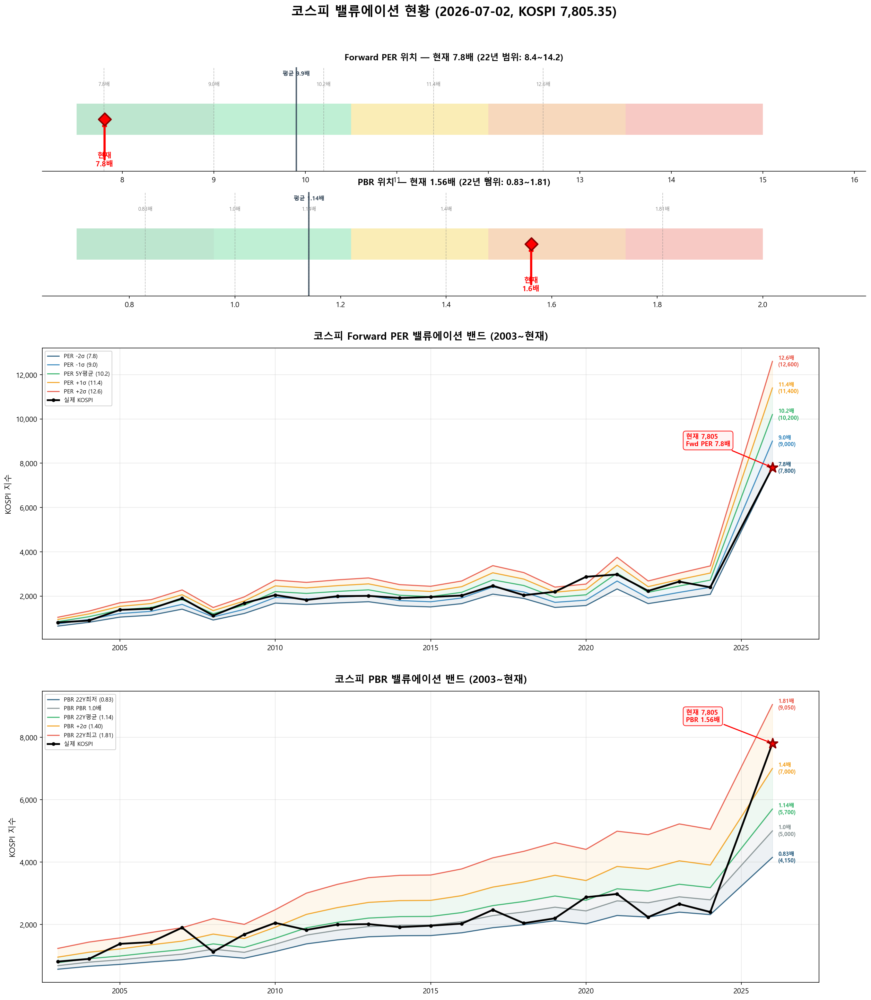

# 📋 MarketTop 일일 종합 (2026-07-02 09:58)

> A4 한 장 요약 — 상세는 각 시장 리포트 참조

---

### 🔵 코스피 7,805.35  —  ↔️ 횡보장 (신뢰도 50%)

| 과열 점수 | 29/100 🔵 저평가 |
|:---:|:---|

> ✅ **다음 매도 목표 9,108(+16.7%) 대기**

**📈 상승 시**

| 다음 매도 목표 | **9,108** (+16.7%) → 이격도106(MA10) + MFI90+ (승률 100%) |
|:---:|:---|

**📉 하락 시**

| 1차 방어선 | **7,571** (-3%) → 30% 손절 |
|:---:|:---|
| 핵심 하락감지 | ADX20+ + MACD데드 + RSI68+ (승률 83%) |
| 강력 매도 | 전체 6개+ 전략 동시 발동 시 → 50% 청산 (검증승률 70%) |

**📍 분할매도 단계**

| 단계 | 목표가 | 등락률 | 전략 | 승률 | 틀렸을 때 |
|:---:|---:|:---:|:---|:---:|:---|
| ⏳ 1단계 | **9,108** | +16.7% | 이격도106(MA10) + MFI90+ | 100% | - |
| ⏳ 2단계 | **9,892** | +26.7% | 이격도122(MA40) + RSI70+ | 70% | 평균+14% |

**🛑 손절 단계**

| 단계 | 손절가 | 비중 | 전략 | 승률 |
|:---:|---:|:---:|:---|:---:|
| 1단계 | **7,571** (-3%) | 30% | ADX20+ + MACD데드 + RSI68+ | 83% |
| 2단계 | **7,415** (-5%) | 30% | BB101%반전 + 이격도118(MA35) | 86% |
| 3단계 | **7,181** (-8%) | 40% | CCI170반전 + 이격도123(MA45) | 83% |

**🎯 방향성 종합**: 🟠 **약한 하락 압력**

| 방향 | 전략 | 평균 승률 | 예상 변동 |
|:----:|:---:|:--------:|:--------:|
| 🔴 하락(매도) | 6개 | 82.3% | -3.13% |
| 🟢 상승(매수) | 5개 | 75.6% | +4.00% |

**📐 매도 Top1 [이격도106(MA10) + MFI90+] 20일 수익률 분포**

  • 중앙값: **-2.1%** | 5%분위 -12.0% ~ 95%분위 -0.6%

**📐 매수 Top1 [RSI35저점반전 + 하향이격도85(MA20)] 20일 수익률 분포**

  • 중앙값: **+9.1%** | 5%분위 -5.7% ~ 95%분위 +18.9%

**💰 Kelly 권장 매도비중**

| 지표 | 값 | 의미 |
|:---|---:|:---|
| 평균 Half-Kelly (Top5) | **22%** | 매수 후 매도 신호 시 권장 청산비율 |
| 최대 Half-Kelly | 41% | 가장 강한 전략의 권장 비중 |
| 평균 Sharpe (Top5) | 2.42 | 우수 |
| 2% 이내 임박 전략 수 | 0개 | 신호 발동 임박도 |

---

### 🔴 코스닥 888.58  —  📉 하락장 (신뢰도 100%)

| 과열 점수 | 22/100 🔵 저평가 |
|:---:|:---|

> ✅ **다음 매도 목표 939(+5.6%) 대기**

**📈 상승 시**

| 다음 매도 목표 | **939** (+5.6%) → 이격도102(MA10) + 거래량2.5배+ (승률 88%) |
|:---:|:---|

**📉 하락 시**

| 1차 방어선 | **862** (-3%) → 30% 손절 |
|:---:|:---|
| 핵심 하락감지 | MACD데드 + RSI68+ + MFI78+ (승률 100%) |
| 강력 매도 | 전체 6개+ 전략 동시 발동 시 → 50% 청산 (검증승률 74%) |

**📍 분할매도 단계**

| 단계 | 목표가 | 등락률 | 전략 | 승률 | 틀렸을 때 |
|:---:|---:|:---:|:---|:---:|:---|
| ⏳ 1단계 | **939** | +5.6% | 이격도102(MA10) + 거래량2.5배+ | 88% | 평균+3% |
| ⏳ 2단계 | **1,068** | +20.2% | 이격도104(MA35) + CCI200+ + ADX35+ | 71% | 평균+8% |
| ⏳ 3단계 | **1,255** | +41.3% | 이격도116(MA65) + CCI160+ + ADX15+ | 89% | 평균+10% |

**🛑 손절 단계**

| 단계 | 손절가 | 비중 | 전략 | 승률 |
|:---:|---:|:---:|:---|:---:|
| 1단계 | **862** (-3%) | 30% | MACD데드 + RSI68+ + MFI78+ | 100% |
| 2단계 | **844** (-5%) | 30% | MFI88반전 + RSI60+ + Stoch95+ | 80% |
| 3단계 | **817** (-8%) | 40% | RSI80반전 + 이격도123(MA90) | 86% |

**🎯 방향성 종합**: ⚪ **방향 혼조**

| 방향 | 전략 | 평균 승률 | 예상 변동 |
|:----:|:---:|:--------:|:--------:|
| 🔴 하락(매도) | 12개 | 81.3% | -3.39% |
| 🟢 상승(매수) | 12개 | 86.1% | +9.91% |

**📐 매도 Top1 [MACD데드 + RSI68+ + MFI78+] 20일 수익률 분포**

  • 중앙값: **-3.4%** | 5%분위 -13.6% ~ 95%분위 -0.9%

**📐 매수 Top1 [하향이격도86(MA90) + CCI-250- + ADX45+] 20일 수익률 분포**

  • 중앙값: **+12.7%** | 5%분위 +2.6% ~ 95%분위 +19.4%

**💰 Kelly 권장 매도비중**

| 지표 | 값 | 의미 |
|:---|---:|:---|
| 평균 Half-Kelly (Top5) | **30%** | 매수 후 매도 신호 시 권장 청산비율 |
| 최대 Half-Kelly | 41% | 가장 강한 전략의 권장 비중 |
| 평균 Sharpe (Top5) | 2.83 | 우수 |
| 2% 이내 임박 전략 수 | 0개 | 신호 발동 임박도 |

---

### 📊 코스피 밸류에이션

| 지표 | 현재 | 22Y평균 | 판단 |
|:---:|:---:|:---:|:---|
| **Fwd PER** | **7.8배** | 9.9배 | 극저평가 🟢🟢 |
| **PBR** | **1.56배** | 1.14배 | 과열 🔴 |
| Fwd EPS | 1000 | - | BPS 5000 |

| PER 밴드 | 적정지수 | 괴리 |
|:---:|---:|:---:|
| -2σ (7.8) | 7,800 | -0.1% ◀ |
| -1σ (9.0) | 9,000 | +15.3% |
| 5Y평균 (10.2) | 10,200 | +30.7% |
| +1σ (11.4) | 11,400 | +46.1% |
| +2σ (12.6) | 12,600 | +61.4% |

---

### � 코스피 향후 60일 등락 위험 분석

> 💡 과거 30년간 지금과 비슷했던 상황(이격도 105%, 2개월 상승률 +49%) **65번** 발생
> → 그때 이후 2개월간 실제로 얼마나 올랐고 빠졌는지 통계

**📈 상승 가능성:**

| 항목 | 결과 | 해석 |
|:---|:---:|:---|
| **2개월 내 평균 최대상승폭** | **+33.8%** | 중위값 +38.5% |
| 역대 최고 사례 | +67.7% | 지수 13,087 |

| 상승폭 | 발생 확률 | 그때 지수 |
|:---|:---:|---:|
| +5% 이상 상승 | **91%** | 8,196 |
| +10% 이상 상승 | **88%** | 8,586 |
| +15% 이상 상승 | **78%** | 8,976 |
| +20% 이상 상승 | **78%** | 9,366 |

**📉 하락 위험:** 🟡 보통

| 항목 | 결과 | 해석 |
|:---|:---:|:---|
| **2개월 내 평균 최대낙폭** | **-6.8%** | 중위값 -2.9% |
| 역대 최악의 경우 | -46.8% | 지수 4,155 |
| 평소보다 위험한 정도 | 1.2배 | 평소와 비슷한 수준 |

**2개월 내 하락 확률과 예상 지수:**

| 하락폭 | 발생 확률 | 그때 지수 |
|:---|:---:|---:|
| -5% 이상 하락 | **46%** | 7,415 |
| -10% 이상 하락 | **23%** | 7,025 |
| -15% 이상 하락 | **8%** | 6,635 |
| -20% 이상 하락 | **8%** | 6,244 |

**💡 확률 기반 판단:**

> 📌 +20% 상승 확률이 높고 큰 하락 확률은 낮습니다.
> **9,366**(+20%)까지 보유 후 익절 추천

---

### 🔮 코스피 과거 유사 패턴 분석

> 💡 현재와 가격 움직임 + 기술적 지표가 비슷했던 과거 **20개 시점** 발견 (평균 유사도 70%)
> → 그 시점 이후 40일간 실제로 어떻게 움직였는지 통계

**📊 유사 패턴 이후 40일간 등락 범위:**

| 구분 | 평균 | 중위값 | 지수 환산 |
|:---|:---:|:---:|---:|
| 📈 최대 상승폭 | **+6.4%** | +5.9% | 8,266 |
| 📉 최대 하락폭 | **-6.0%** | -3.6% | 7,523 |
| 🚀 최고 사례 | +23.1% | - | 9,609 |
| 💥 최악 사례 | -31.2% | - | 5,369 |

**🔄 반전 패턴:**

| 패턴 | 평균 크기 | 해석 |
|:---|:---:|:---|
| 고점 찍고 반락 | **-10.3%** | 상승 후 평균 이만큼 되돌림 |
| 저점 찍고 반등 | **+9.7%** | 하락 후 평균 이만큼 회복 |

**⏰ 시간대별 상승 확률:**

| 기간 | 상승 확률 | 평균 수익률 | 예상 지수 |
|:---|:---:|:---:|---:|
| 10일 후 | **80%** | +3.1% | 8,050 |
| 20일 후 | **55%** | +1.5% | 7,926 |
| 40일 후 | **65%** | +0.5% | 7,843 |

**📈 대표 경로 (중위값):**

| 시점 | 낙관(상위25%) | 중립(중위) | 비관(하위25%) | 중립 지수 |
|:---|:---:|:---:|:---:|---:|
| 5일 후 | +3.0% | +0.1% | -1.9% | 7,817 |
| 10일 후 | +4.6% | +3.6% | +0.1% | 8,090 |
| 20일 후 | +4.6% | +0.5% | -1.5% | 7,846 |
| 30일 후 | +5.0% | -0.3% | -2.1% | 7,785 |
| 40일 후 | +5.7% | +2.5% | -3.4% | 8,001 |

**📅 가장 유사했던 과거 시점 (최근 5개):**

- **2022-05-06** (유사도 72%) — 지수 2,645 → 40일간 최대+1.6%, 최대-13.3%, 최종-13.3%
- **2022-02-22** (유사도 69%) — 지수 2,707 → 40일간 최대+1.9%, 최대-3.1%, 최종+0.8%
- **2020-01-31** (유사도 70%) — 지수 2,119 → 40일간 최대+5.9%, 최대-31.2%, 최종-18.9%
- **2018-03-28** (유사도 71%) — 지수 2,419 → 40일간 최대+4.0%, 최대-0.5%, 최종+2.5%
- **2016-12-02** (유사도 69%) — 지수 1,971 → 40일간 최대+5.9%, 최대-0.4%, 최종+5.6%

### 🔮 코스닥 과거 유사 패턴 분석

> 💡 현재와 가격 움직임 + 기술적 지표가 비슷했던 과거 **20개 시점** 발견 (평균 유사도 70%)
> → 그 시점 이후 40일간 실제로 어떻게 움직였는지 통계

**📊 유사 패턴 이후 40일간 등락 범위:**

| 구분 | 평균 | 중위값 | 지수 환산 |
|:---|:---:|:---:|---:|
| 📈 최대 상승폭 | **+10.4%** | +7.9% | 959 |
| 📉 최대 하락폭 | **-8.7%** | -6.0% | 835 |
| 🚀 최고 사례 | +49.9% | - | 1,332 |
| 💥 최악 사례 | -33.3% | - | 592 |

**🔄 반전 패턴:**

| 패턴 | 평균 크기 | 해석 |
|:---|:---:|:---|
| 고점 찍고 반락 | **-15.2%** | 상승 후 평균 이만큼 되돌림 |
| 저점 찍고 반등 | **+16.3%** | 하락 후 평균 이만큼 회복 |

**⏰ 시간대별 상승 확률:**

| 기간 | 상승 확률 | 평균 수익률 | 예상 지수 |
|:---|:---:|:---:|---:|
| 10일 후 | **65%** | +1.3% | 901 |
| 20일 후 | **55%** | +2.6% | 912 |
| 40일 후 | **70%** | +4.6% | 930 |

**📈 대표 경로 (중위값):**

| 시점 | 낙관(상위25%) | 중립(중위) | 비관(하위25%) | 중립 지수 |
|:---|:---:|:---:|:---:|---:|
| 5일 후 | +3.7% | +0.7% | -3.3% | 895 |
| 10일 후 | +6.1% | +2.3% | -3.6% | 909 |
| 20일 후 | +7.8% | +1.0% | -3.0% | 898 |
| 30일 후 | +8.6% | +3.3% | -1.8% | 918 |
| 40일 후 | +9.9% | +4.0% | -3.9% | 924 |

**📅 가장 유사했던 과거 시점 (최근 5개):**

- **2024-08-29** (유사도 69%) — 지수 756 → 40일간 최대+3.3%, 최대-6.6%, 최종-3.6%
- **2023-10-31** (유사도 75%) — 지수 736 → 40일간 최대+17.2%, 최대0.0%, 최종+16.8%
- **2023-10-26** (유사도 67%) — 지수 744 → 40일간 최대+16.0%, 최대-1.0%, 최종+15.5%
- **2023-10-13** (유사도 74%) — 지수 823 → 40일간 최대+2.0%, 최대-10.5%, 최종+0.9%
- **2022-06-28** (유사도 69%) — 지수 770 → 40일간 최대+8.5%, 최대-6.1%, 최종+3.1%

---

### 📎 상세 리포트

- 코스피: [코스피_고점판독리포트_20260702_095638.md](코스피_고점판독리포트_20260702_095638.md)
- 코스닥: [코스닥_고점판독리포트_20260702_095822.md](코스닥_고점판독리포트_20260702_095822.md)

---

*본 리포트는 백테스트 기반 참고용이며, 투자 판단의 최종 책임은 투자자 본인에게 있습니다.*