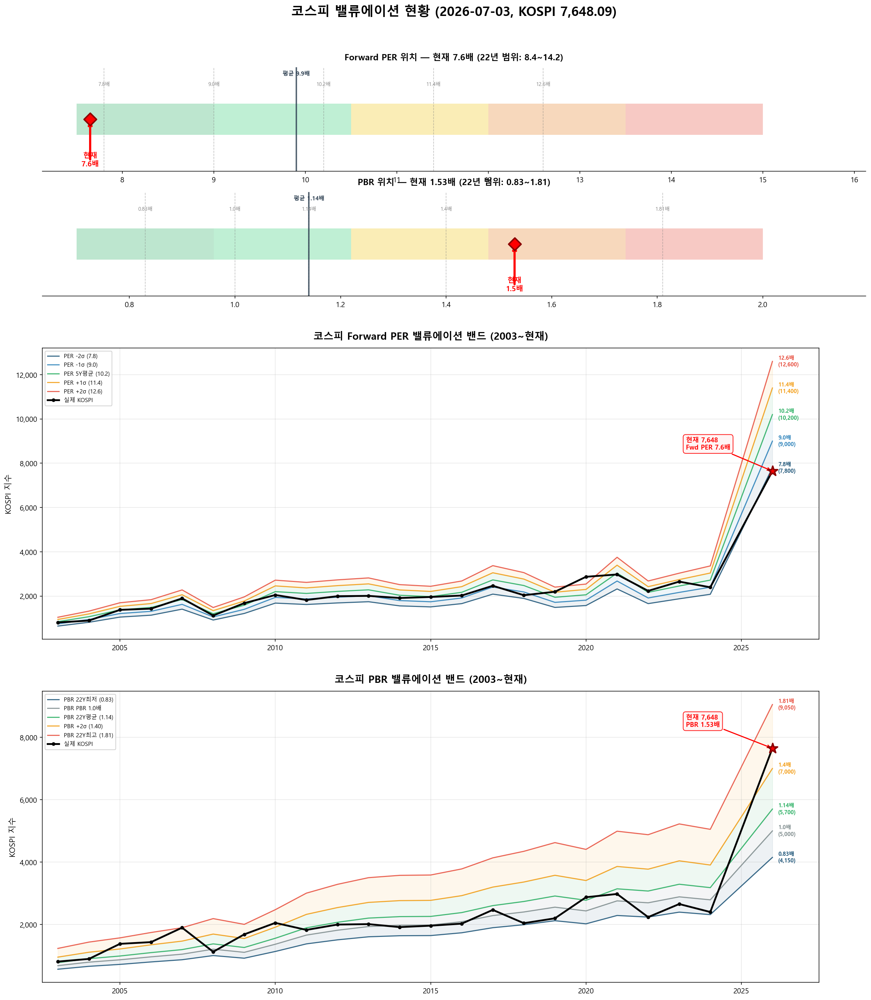

# 📋 MarketTop 일일 종합 (2026-07-03 08:02)

> A4 한 장 요약 — 상세는 각 시장 리포트 참조

---

### 🔵 코스피 7,648.09  —  ↔️ 횡보장 (신뢰도 85%)

| 과열 점수 | 23/100 🔵 저평가 |
|:---:|:---|

> ✅ **다음 매도 목표 9,011(+17.8%) 대기**

**📈 상승 시**

| 다음 매도 목표 | **9,011** (+17.8%) → 이격도106(MA10) + MFI90+ (승률 100%) |
|:---:|:---|

**📉 하락 시**

| 1차 방어선 | **7,419** (-3%) → 30% 손절 |
|:---:|:---|
| 핵심 하락감지 | ADX20+ + MACD데드 + RSI68+ (승률 83%) |
| 강력 매도 | 전체 4개+ 전략 동시 발동 시 → 50% 청산 (검증승률 71%) |

**📍 분할매도 단계**

| 단계 | 목표가 | 등락률 | 전략 | 승률 | 틀렸을 때 |
|:---:|---:|:---:|:---|:---:|:---|
| ⏳ 1단계 | **9,011** | +17.8% | 이격도106(MA10) + MFI90+ | 100% | - |
| ⏳ 2단계 | **9,536** | +24.7% | 이격도116(MA35) + CCI80+ + ADX25+ | 80% | 평균+9% |

**🛑 손절 단계**

| 단계 | 손절가 | 비중 | 전략 | 승률 |
|:---:|---:|:---:|:---|:---:|
| 1단계 | **7,419** (-3%) | 30% | ADX20+ + MACD데드 + RSI68+ | 83% |
| 2단계 | **7,266** (-5%) | 30% | BB101%반전 + 이격도118(MA35) | 86% |
| 3단계 | **7,036** (-8%) | 40% | MFI80반전 + 이격도120(MA70) | 71% |

**🎯 방향성 종합**: 🟠 **약한 하락 압력**

| 방향 | 전략 | 평균 승률 | 예상 변동 |
|:----:|:---:|:--------:|:--------:|
| 🔴 하락(매도) | 6개 | 83.0% | -3.22% |
| 🟢 상승(매수) | 5개 | 75.6% | +4.00% |

**📐 매도 Top1 [이격도106(MA10) + MFI90+] 20일 수익률 분포**

  • 중앙값: **-2.1%** | 5%분위 -12.0% ~ 95%분위 -0.6%

**📐 매수 Top1 [RSI35저점반전 + 하향이격도85(MA20)] 20일 수익률 분포**

  • 중앙값: **+9.1%** | 5%분위 -5.7% ~ 95%분위 +18.9%

**💰 Kelly 권장 매도비중**

| 지표 | 값 | 의미 |
|:---|---:|:---|
| 평균 Half-Kelly (Top5) | **24%** | 매수 후 매도 신호 시 권장 청산비율 |
| 최대 Half-Kelly | 41% | 가장 강한 전략의 권장 비중 |
| 평균 Sharpe (Top5) | 2.54 | 우수 |
| 2% 이내 임박 전략 수 | 0개 | 신호 발동 임박도 |

---

### 🔴 코스닥 866.72  —  📉 하락장 (신뢰도 100%)

| 과열 점수 | 15/100 🔵 저평가 |
|:---:|:---|

> ✅ **다음 매도 목표 929(+7.2%) 대기**

**📈 상승 시**

| 다음 매도 목표 | **929** (+7.2%) → 이격도102(MA10) + 거래량2.5배+ (승률 88%) |
|:---:|:---|

**📉 하락 시**

| 1차 방어선 | **841** (-3%) → 30% 손절 |
|:---:|:---|
| 핵심 하락감지 | MACD데드 + RSI68+ + MFI78+ (승률 100%) |
| 강력 매도 | 전체 6개+ 전략 동시 발동 시 → 50% 청산 (검증승률 74%) |

**📍 분할매도 단계**

| 단계 | 목표가 | 등락률 | 전략 | 승률 | 틀렸을 때 |
|:---:|---:|:---:|:---|:---:|:---|
| ⏳ 1단계 | **929** | +7.2% | 이격도102(MA10) + 거래량2.5배+ | 88% | 평균+3% |
| ⏳ 2단계 | **1,060** | +22.3% | 이격도104(MA35) + CCI200+ + ADX35+ | 71% | 평균+8% |
| ⏳ 3단계 | **1,251** | +44.4% | 이격도116(MA65) + CCI160+ + ADX15+ | 89% | 평균+10% |

**🛑 손절 단계**

| 단계 | 손절가 | 비중 | 전략 | 승률 |
|:---:|---:|:---:|:---|:---:|
| 1단계 | **841** (-3%) | 30% | MACD데드 + RSI68+ + MFI78+ | 100% |
| 2단계 | **823** (-5%) | 30% | MFI88반전 + RSI60+ + Stoch95+ | 80% |
| 3단계 | **797** (-8%) | 40% | RSI80반전 + 이격도123(MA90) | 86% |

**🎯 방향성 종합**: ⚪ **방향 혼조**

| 방향 | 전략 | 평균 승률 | 예상 변동 |
|:----:|:---:|:--------:|:--------:|
| 🔴 하락(매도) | 12개 | 81.3% | -3.39% |
| 🟢 상승(매수) | 12개 | 86.1% | +9.91% |

**📐 매도 Top1 [MACD데드 + RSI68+ + MFI78+] 20일 수익률 분포**

  • 중앙값: **-3.4%** | 5%분위 -13.6% ~ 95%분위 -0.9%

**📐 매수 Top1 [하향이격도86(MA90) + CCI-250- + ADX45+] 20일 수익률 분포**

  • 중앙값: **+12.7%** | 5%분위 +2.6% ~ 95%분위 +19.4%

**💰 Kelly 권장 매도비중**

| 지표 | 값 | 의미 |
|:---|---:|:---|
| 평균 Half-Kelly (Top5) | **30%** | 매수 후 매도 신호 시 권장 청산비율 |
| 최대 Half-Kelly | 41% | 가장 강한 전략의 권장 비중 |
| 평균 Sharpe (Top5) | 2.83 | 우수 |
| 2% 이내 임박 전략 수 | 0개 | 신호 발동 임박도 |

---

### 📊 코스피 밸류에이션

| 지표 | 현재 | 22Y평균 | 판단 |
|:---:|:---:|:---:|:---|
| **Fwd PER** | **7.6배** | 9.9배 | 극저평가 🟢🟢 |
| **PBR** | **1.53배** | 1.14배 | 과열 🔴 |
| Fwd EPS | 1000 | - | BPS 5000 |

| PER 밴드 | 적정지수 | 괴리 |
|:---:|---:|:---:|
| -2σ (7.8) | 7,800 | +2.0% ◀ |
| -1σ (9.0) | 9,000 | +17.7% |
| 5Y평균 (10.2) | 10,200 | +33.4% |
| +1σ (11.4) | 11,400 | +49.1% |
| +2σ (12.6) | 12,600 | +64.7% |

---

### � 코스피 향후 60일 등락 위험 분석

> 💡 과거 30년간 지금과 비슷했던 상황(이격도 102%, 2개월 상승률 +42%) **103번** 발생
> → 그때 이후 2개월간 실제로 얼마나 올랐고 빠졌는지 통계

**📈 상승 가능성:**

| 항목 | 결과 | 해석 |
|:---|:---:|:---|
| **2개월 내 평균 최대상승폭** | **+29.1%** | 중위값 +30.7% |
| 역대 최고 사례 | +72.7% | 지수 13,209 |

| 상승폭 | 발생 확률 | 그때 지수 |
|:---|:---:|---:|
| +5% 이상 상승 | **81%** | 8,030 |
| +10% 이상 상승 | **77%** | 8,413 |
| +15% 이상 상승 | **64%** | 8,795 |
| +20% 이상 상승 | **60%** | 9,178 |

**📉 하락 위험:** 🟠 주의

| 항목 | 결과 | 해석 |
|:---|:---:|:---|
| **2개월 내 평균 최대낙폭** | **-8.5%** | 중위값 -3.7% |
| 역대 최악의 경우 | -46.8% | 지수 4,072 |
| ⚠️ 평소보다 위험한 정도 | **1.5배** | 평소보다 1.5배 더 빠질 수 있음 |

**2개월 내 하락 확률과 예상 지수:**

| 하락폭 | 발생 확률 | 그때 지수 |
|:---|:---:|---:|
| -5% 이상 하락 | **40%** | 7,266 |
| -10% 이상 하락 | **24%** | 6,883 |
| -15% 이상 하락 | **17%** | 6,501 |
| -20% 이상 하락 | **14%** | 6,118 |

**💡 확률 기반 판단:**

> 📌 +20% 상승 확률이 높고 큰 하락 확률은 낮습니다.
> **9,178**(+20%)까지 보유 후 익절 추천

---

### 🔮 코스피 과거 유사 패턴 분석

> 💡 현재와 가격 움직임 + 기술적 지표가 비슷했던 과거 **20개 시점** 발견 (평균 유사도 71%)
> → 그 시점 이후 40일간 실제로 어떻게 움직였는지 통계

**📊 유사 패턴 이후 40일간 등락 범위:**

| 구분 | 평균 | 중위값 | 지수 환산 |
|:---|:---:|:---:|---:|
| 📈 최대 상승폭 | **+5.4%** | +5.5% | 8,072 |
| 📉 최대 하락폭 | **-5.4%** | -2.7% | 7,443 |
| 🚀 최고 사례 | +11.6% | - | 8,533 |
| 💥 최악 사례 | -33.6% | - | 5,076 |

**🔄 반전 패턴:**

| 패턴 | 평균 크기 | 해석 |
|:---|:---:|:---|
| 고점 찍고 반락 | **-10.5%** | 상승 후 평균 이만큼 되돌림 |
| 저점 찍고 반등 | **+7.7%** | 하락 후 평균 이만큼 회복 |

**⏰ 시간대별 상승 확률:**

| 기간 | 상승 확률 | 평균 수익률 | 예상 지수 |
|:---|:---:|:---:|---:|
| 10일 후 | **60%** | +1.2% | 7,743 |
| 20일 후 | **65%** | +1.6% | 7,774 |
| 40일 후 | **55%** | -0.5% | 7,613 |

**📈 대표 경로 (중위값):**

| 시점 | 낙관(상위25%) | 중립(중위) | 비관(하위25%) | 중립 지수 |
|:---|:---:|:---:|:---:|---:|
| 5일 후 | +1.2% | +0.0% | -0.8% | 7,650 |
| 10일 후 | +3.8% | +2.0% | -1.7% | 7,800 |
| 20일 후 | +4.2% | +0.8% | -0.7% | 7,709 |
| 30일 후 | +2.6% | +1.0% | -2.2% | 7,726 |
| 40일 후 | +5.5% | +1.5% | -3.2% | 7,762 |

**📅 가장 유사했던 과거 시점 (최근 5개):**

- **2024-10-31** (유사도 70%) — 지수 2,556 → 40일간 최대+1.3%, 최대-7.7%, 최종-5.9%
- **2023-06-23** (유사도 74%) — 지수 2,570 → 40일간 최대+3.8%, 최대-2.6%, 최종-2.4%
- **2023-02-15** (유사도 70%) — 지수 2,428 → 40일간 최대+5.5%, 최대-3.3%, 최종+5.5%
- **2022-05-10** (유사도 74%) — 지수 2,597 → 40일간 최대+3.4%, 최대-11.7%, 최종-10.1%
- **2020-09-22** (유사도 71%) — 지수 2,333 → 40일간 최대+11.6%, 최대-2.8%, 최종+11.6%

### 🔮 코스닥 과거 유사 패턴 분석

> 💡 현재와 가격 움직임 + 기술적 지표가 비슷했던 과거 **19개 시점** 발견 (평균 유사도 69%)
> → 그 시점 이후 40일간 실제로 어떻게 움직였는지 통계

**📊 유사 패턴 이후 40일간 등락 범위:**

| 구분 | 평균 | 중위값 | 지수 환산 |
|:---|:---:|:---:|---:|
| 📈 최대 상승폭 | **+11.9%** | +9.5% | 949 |
| 📉 최대 하락폭 | **-9.9%** | -6.4% | 812 |
| 🚀 최고 사례 | +44.2% | - | 1,250 |
| 💥 최악 사례 | -40.5% | - | 515 |

**🔄 반전 패턴:**

| 패턴 | 평균 크기 | 해석 |
|:---|:---:|:---|
| 고점 찍고 반락 | **-18.0%** | 상승 후 평균 이만큼 되돌림 |
| 저점 찍고 반등 | **+17.3%** | 하락 후 평균 이만큼 회복 |

**⏰ 시간대별 상승 확률:**

| 기간 | 상승 확률 | 평균 수익률 | 예상 지수 |
|:---|:---:|:---:|---:|
| 10일 후 | **58%** | +1.5% | 880 |
| 20일 후 | **68%** | +4.4% | 905 |
| 40일 후 | **63%** | +3.0% | 893 |

**📈 대표 경로 (중위값):**

| 시점 | 낙관(상위25%) | 중립(중위) | 비관(하위25%) | 중립 지수 |
|:---|:---:|:---:|:---:|---:|
| 5일 후 | +4.7% | +0.8% | -4.3% | 873 |
| 10일 후 | +8.2% | +2.0% | -2.8% | 884 |
| 20일 후 | +10.5% | +2.9% | -3.0% | 892 |
| 30일 후 | +8.0% | +3.7% | -1.1% | 899 |
| 40일 후 | +8.1% | +3.2% | -3.1% | 895 |

**📅 가장 유사했던 과거 시점 (최근 5개):**

- **2026-03-30** (유사도 65%) — 지수 1,107 → 40일간 최대+10.8%, 최대-6.4%, 최종-0.2%
- **2023-11-01** (유사도 68%) — 지수 739 → 40일간 최대+17.2%, 최대0.0%, 최종+17.2%
- **2023-10-16** (유사도 72%) — 지수 811 → 40일간 최대+3.6%, 최대-9.2%, 최종+3.0%
- **2022-06-29** (유사도 67%) — 지수 762 → 40일간 최대+9.5%, 최대-5.2%, 최종+5.9%
- **2022-01-17** (유사도 68%) — 지수 958 → 40일간 최대+0.1%, 최대-12.3%, 최종-4.1%

---

### 📎 상세 리포트

- 코스피: [코스피_고점판독리포트_20260703_075939.md](코스피_고점판독리포트_20260703_075939.md)
- 코스닥: [코스닥_고점판독리포트_20260703_080221.md](코스닥_고점판독리포트_20260703_080221.md)

---

*본 리포트는 백테스트 기반 참고용이며, 투자 판단의 최종 책임은 투자자 본인에게 있습니다.*