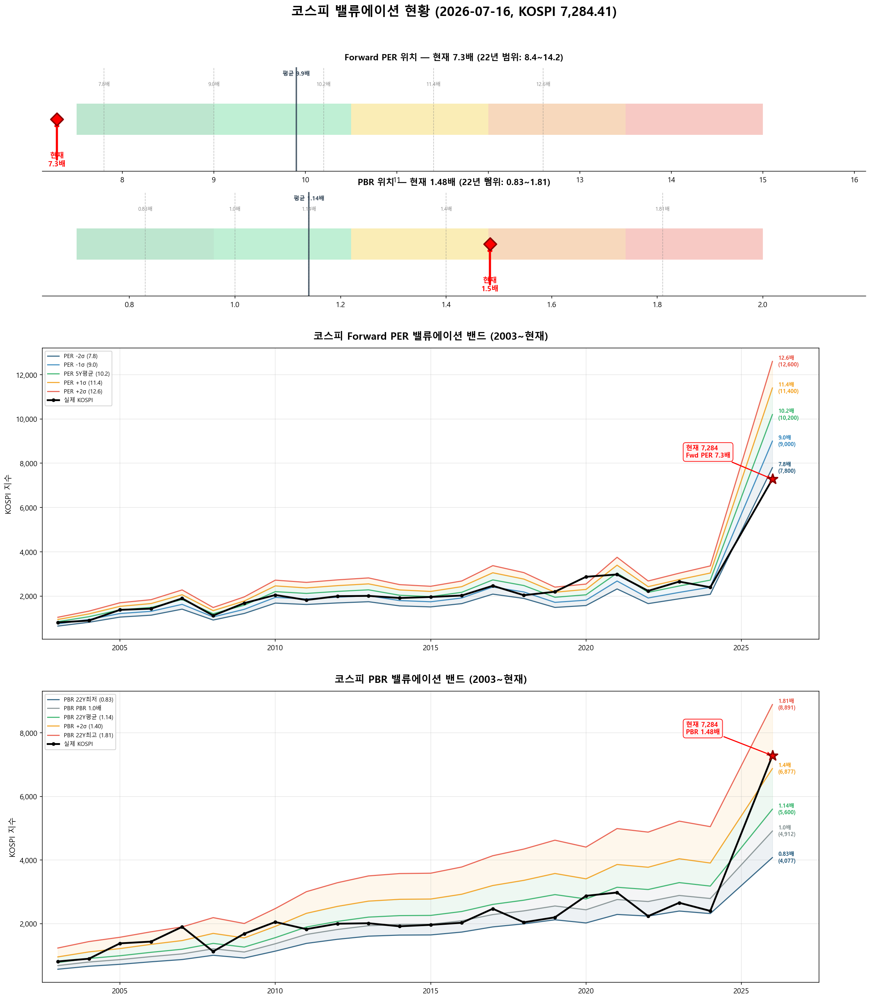

# 📋 MarketTop 일일 종합 (2026-07-16 08:03)

> A4 한 장 요약 — 상세는 각 시장 리포트 참조

---

### 🔵 코스피 7,284.41  —  ↔️ 횡보장 (신뢰도 75%)

| 과열 점수 | 24/100 🔵 저평가 |
|:---:|:---|

> ✅ **다음 매도 목표 7,887(+8.3%) 대기**

**📈 상승 시**

| 다음 매도 목표 | **7,887** (+8.3%) → 이격도106(MA10) + MFI90+ (승률 100%) |
|:---:|:---|

**📉 하락 시**

| 1차 방어선 | **7,066** (-3%) → 30% 손절 |
|:---:|:---|
| 핵심 하락감지 | ADX20+ + MACD데드 + RSI68+ (승률 83%) |
| 강력 매도 | 전체 4개+ 전략 동시 발동 시 → 50% 청산 (검증승률 71%) |

**📍 분할매도 단계**

| 단계 | 목표가 | 등락률 | 전략 | 승률 | 틀렸을 때 |
|:---:|---:|:---:|:---|:---:|:---|
| ⏳ 1단계 | **7,887** | +8.3% | 이격도106(MA10) + MFI90+ | 100% | - |
| ⏳ 2단계 | **9,460** | +29.9% | 이격도116(MA35) + CCI80+ + ADX25+ | 80% | 평균+9% |

**🛑 손절 단계**

| 단계 | 손절가 | 비중 | 전략 | 승률 |
|:---:|---:|:---:|:---|:---:|
| 1단계 | **7,066** (-3%) | 30% | ADX20+ + MACD데드 + RSI68+ | 83% |
| 2단계 | **6,920** (-5%) | 30% | BB101%반전 + 이격도118(MA35) | 86% |
| 3단계 | **6,702** (-8%) | 40% | MFI80반전 + 이격도120(MA70) | 71% |

**🎯 방향성 종합**: 🟠 **약한 하락 압력**

| 방향 | 전략 | 평균 승률 | 예상 변동 |
|:----:|:---:|:--------:|:--------:|
| 🔴 하락(매도) | 6개 | 83.0% | -3.22% |
| 🟢 상승(매수) | 5개 | 75.6% | +4.00% |

**📐 매도 Top1 [이격도106(MA10) + MFI90+] 20일 수익률 분포**

  • 중앙값: **-2.1%** | 5%분위 -12.0% ~ 95%분위 -0.6%

**📐 매수 Top1 [RSI35저점반전 + 하향이격도85(MA20)] 20일 수익률 분포**

  • 중앙값: **+9.1%** | 5%분위 -5.7% ~ 95%분위 +18.9%

**💰 Kelly 권장 매도비중**

| 지표 | 값 | 의미 |
|:---|---:|:---|
| 평균 Half-Kelly (Top5) | **24%** | 매수 후 매도 신호 시 권장 청산비율 |
| 최대 Half-Kelly | 41% | 가장 강한 전략의 권장 비중 |
| 평균 Sharpe (Top5) | 2.54 | 우수 |
| 2% 이내 임박 전략 수 | 0개 | 신호 발동 임박도 |

---

### 🔴 코스닥 829.43  —  📉 하락장 (신뢰도 100%)

| 과열 점수 | 32/100 🔵 저평가 |
|:---:|:---|

> ✅ **다음 매도 목표 841(+1.4%) 대기**

**📈 상승 시**

| 다음 매도 목표 | **841** (+1.4%) → 이격도102(MA10) + 거래량2.5배+ (승률 88%) |
|:---:|:---|

**📉 하락 시**

| 1차 방어선 | **805** (-3%) → 30% 손절 |
|:---:|:---|
| 핵심 하락감지 | MACD데드 + RSI68+ + MFI78+ (승률 100%) |
| 강력 매도 | 전체 6개+ 전략 동시 발동 시 → 50% 청산 (검증승률 74%) |

**📍 분할매도 단계**

| 단계 | 목표가 | 등락률 | 전략 | 승률 | 틀렸을 때 |
|:---:|---:|:---:|:---|:---:|:---|
| ⚡ 1단계 | **841** | +1.4% | 이격도102(MA10) + 거래량2.5배+ | 88% | 평균+3% |
| ⏳ 2단계 | **977** | +17.7% | 이격도104(MA35) + CCI200+ + ADX35+ | 71% | 평균+8% |
| ⏳ 3단계 | **1,211** | +46.0% | 이격도116(MA65) + CCI160+ + ADX15+ | 89% | 평균+10% |

**🛑 손절 단계**

| 단계 | 손절가 | 비중 | 전략 | 승률 |
|:---:|---:|:---:|:---|:---:|
| 1단계 | **805** (-3%) | 30% | MACD데드 + RSI68+ + MFI78+ | 100% |
| 2단계 | **788** (-5%) | 30% | MFI88반전 + RSI60+ + Stoch95+ | 80% |
| 3단계 | **763** (-8%) | 40% | RSI80반전 + 이격도123(MA90) | 86% |

**🎯 방향성 종합**: 🟠 **약한 하락 압력**

| 방향 | 전략 | 평균 승률 | 예상 변동 |
|:----:|:---:|:--------:|:--------:|
| 🔴 하락(매도) | 12개 | 81.3% | -3.39% |
| 🟢 상승(매수) | 12개 | 86.5% | +10.52% |

**📐 매도 Top1 [MACD데드 + RSI68+ + MFI78+] 20일 수익률 분포**

  • 중앙값: **-3.4%** | 5%분위 -13.6% ~ 95%분위 -0.9%

**📐 매수 Top1 [하향이격도86(MA90) + CCI-250- + ADX45+] 20일 수익률 분포**

  • 중앙값: **+12.7%** | 5%분위 +2.6% ~ 95%분위 +19.4%

**💰 Kelly 권장 매도비중**

| 지표 | 값 | 의미 |
|:---|---:|:---|
| 평균 Half-Kelly (Top5) | **30%** | 매수 후 매도 신호 시 권장 청산비율 |
| 최대 Half-Kelly | 41% | 가장 강한 전략의 권장 비중 |
| 평균 Sharpe (Top5) | 2.83 | 우수 |
| 2% 이내 임박 전략 수 | 1개 | 신호 발동 임박도 |

---

### 📊 코스피 밸류에이션

| 지표 | 현재 | 22Y평균 | 판단 |
|:---:|:---:|:---:|:---|
| **Fwd PER** | **7.3배** | 9.9배 | 극저평가 🟢🟢 |
| **PBR** | **1.48배** | 1.14배 | 고평가 🟡 |
| Fwd EPS | 1000 | - | BPS 4912 |

| PER 밴드 | 적정지수 | 괴리 |
|:---:|---:|:---:|
| -2σ (7.8) | 7,800 | +7.1% |
| -1σ (9.0) | 9,000 | +23.6% |
| 5Y평균 (10.2) | 10,200 | +40.0% |
| +1σ (11.4) | 11,400 | +56.5% |
| +2σ (12.6) | 12,600 | +73.0% |

---

### � 코스피 향후 60일 등락 위험 분석

> 💡 과거 30년간 지금과 비슷했던 상황(이격도 94%, 2개월 상승률 +17%) **1333번** 발생
> → 그때 이후 2개월간 실제로 얼마나 올랐고 빠졌는지 통계

**📈 상승 가능성:**

| 항목 | 결과 | 해석 |
|:---|:---:|:---|
| **2개월 내 평균 최대상승폭** | **+7.2%** | 중위값 +4.6% |
| 역대 최고 사례 | +94.4% | 지수 14,162 |

| 상승폭 | 발생 확률 | 그때 지수 |
|:---|:---:|---:|
| +5% 이상 상승 | **48%** | 7,649 |
| +10% 이상 상승 | **24%** | 8,013 |
| +15% 이상 상승 | **11%** | 8,377 |
| +20% 이상 상승 | **7%** | 8,741 |

**📉 하락 위험:** 🟡 보통

| 항목 | 결과 | 해석 |
|:---|:---:|:---|
| **2개월 내 평균 최대낙폭** | **-6.2%** | 중위값 -4.1% |
| 역대 최악의 경우 | -45.1% | 지수 3,998 |
| 평소보다 위험한 정도 | 1.1배 | 평소와 비슷한 수준 |

**2개월 내 하락 확률과 예상 지수:**

| 하락폭 | 발생 확률 | 그때 지수 |
|:---|:---:|---:|
| -5% 이상 하락 | **42%** | 6,920 |
| -10% 이상 하락 | **20%** | 6,556 |
| -15% 이상 하락 | **10%** | 6,192 |
| -20% 이상 하락 | **5%** | 5,828 |

**💡 확률 기반 판단:**

> 📌 뚜렷한 방향성 없음. 현재 비중 유지하며 추이 관망

---

### 🔮 코스피 과거 유사 패턴 분석

> 💡 현재와 가격 움직임 + 기술적 지표가 비슷했던 과거 **20개 시점** 발견 (평균 유사도 69%)
> → 그 시점 이후 40일간 실제로 어떻게 움직였는지 통계

**📊 유사 패턴 이후 40일간 등락 범위:**

| 구분 | 평균 | 중위값 | 지수 환산 |
|:---|:---:|:---:|---:|
| 📈 최대 상승폭 | **+8.3%** | +7.6% | 7,838 |
| 📉 최대 하락폭 | **-6.3%** | -4.3% | 6,974 |
| 🚀 최고 사례 | +19.9% | - | 8,735 |
| 💥 최악 사례 | -31.5% | - | 4,993 |

**🔄 반전 패턴:**

| 패턴 | 평균 크기 | 해석 |
|:---|:---:|:---|
| 고점 찍고 반락 | **-12.5%** | 상승 후 평균 이만큼 되돌림 |
| 저점 찍고 반등 | **+11.8%** | 하락 후 평균 이만큼 회복 |

**⏰ 시간대별 상승 확률:**

| 기간 | 상승 확률 | 평균 수익률 | 예상 지수 |
|:---|:---:|:---:|---:|
| 10일 후 | **65%** | +0.8% | 7,346 |
| 20일 후 | **65%** | +0.3% | 7,304 |
| 40일 후 | **70%** | +2.2% | 7,444 |

**📈 대표 경로 (중위값):**

| 시점 | 낙관(상위25%) | 중립(중위) | 비관(하위25%) | 중립 지수 |
|:---|:---:|:---:|:---:|---:|
| 5일 후 | +2.9% | +1.8% | -0.1% | 7,414 |
| 10일 후 | +3.5% | +1.0% | -1.2% | 7,354 |
| 20일 후 | +5.7% | +2.0% | -2.9% | 7,430 |
| 30일 후 | +9.2% | +5.5% | -5.3% | 7,687 |
| 40일 후 | +11.3% | +4.5% | -5.9% | 7,610 |

**📅 가장 유사했던 과거 시점 (최근 5개):**

- **2023-10-27** (유사도 66%) — 지수 2,303 → 40일간 최대+13.5%, 최대-1.1%, 최종+12.9%
- **2023-02-28** (유사도 67%) — 지수 2,413 → 40일간 최대+6.8%, 최대-2.6%, 최종+3.0%
- **2021-10-14** (유사도 70%) — 지수 2,989 → 40일간 최대+2.0%, 최대-5.0%, 최종+1.4%
- **2019-04-01** (유사도 66%) — 지수 2,168 → 40일간 최대+3.7%, 최대-6.7%, 최종-6.7%
- **2015-08-26** (유사도 73%) — 지수 1,894 → 40일간 최대+8.1%, 최대-0.8%, 최종+8.1%

### 🔮 코스닥 과거 유사 패턴 분석

> 💡 현재와 가격 움직임 + 기술적 지표가 비슷했던 과거 **10개 시점** 발견 (평균 유사도 69%)
> → 그 시점 이후 40일간 실제로 어떻게 움직였는지 통계

**📊 유사 패턴 이후 40일간 등락 범위:**

| 구분 | 평균 | 중위값 | 지수 환산 |
|:---|:---:|:---:|---:|
| 📈 최대 상승폭 | **+7.9%** | +4.5% | 867 |
| 📉 최대 하락폭 | **-5.3%** | -6.1% | 779 |
| 🚀 최고 사례 | +29.0% | - | 1,070 |
| 💥 최악 사례 | -11.2% | - | 737 |

**🔄 반전 패턴:**

| 패턴 | 평균 크기 | 해석 |
|:---|:---:|:---|
| 고점 찍고 반락 | **-9.5%** | 상승 후 평균 이만큼 되돌림 |
| 저점 찍고 반등 | **+11.5%** | 하락 후 평균 이만큼 회복 |

**⏰ 시간대별 상승 확률:**

| 기간 | 상승 확률 | 평균 수익률 | 예상 지수 |
|:---|:---:|:---:|---:|
| 10일 후 | **80%** | +2.6% | 851 |
| 20일 후 | **50%** | +3.0% | 855 |
| 40일 후 | **60%** | +2.6% | 851 |

**📈 대표 경로 (중위값):**

| 시점 | 낙관(상위25%) | 중립(중위) | 비관(하위25%) | 중립 지수 |
|:---|:---:|:---:|:---:|---:|
| 5일 후 | +4.2% | +3.0% | -0.1% | 855 |
| 10일 후 | +4.1% | +3.4% | +0.8% | 858 |
| 20일 후 | +8.2% | +1.4% | -0.7% | 841 |
| 30일 후 | +3.7% | +0.1% | -2.5% | 831 |
| 40일 후 | +6.4% | +2.2% | -5.2% | 847 |

**📅 가장 유사했던 과거 시점 (최근 5개):**

- **2024-09-20** (유사도 68%) — 지수 748 → 40일간 최대+4.4%, 최대-8.9%, 최종-8.7%
- **2023-10-27** (유사도 75%) — 지수 748 → 40일간 최대+15.3%, 최대-1.7%, 최종+14.2%
- **2023-10-06** (유사도 66%) — 지수 816 → 40일간 최대+2.8%, 최대-9.8%, 최종+1.5%
- **2023-05-17** (유사도 66%) — 지수 834 → 40일간 최대+7.5%, 최대0.0%, 최종+7.4%
- **2019-05-31** (유사도 79%) — 지수 696 → 40일간 최대+4.6%, 최대-11.2%, 최종-11.2%

---

### 📎 상세 리포트

- 코스피: [코스피_고점판독리포트_20260716_080156.md](코스피_고점판독리포트_20260716_080156.md)
- 코스닥: [코스닥_고점판독리포트_20260716_080330.md](코스닥_고점판독리포트_20260716_080330.md)

---

*본 리포트는 백테스트 기반 참고용이며, 투자 판단의 최종 책임은 투자자 본인에게 있습니다.*