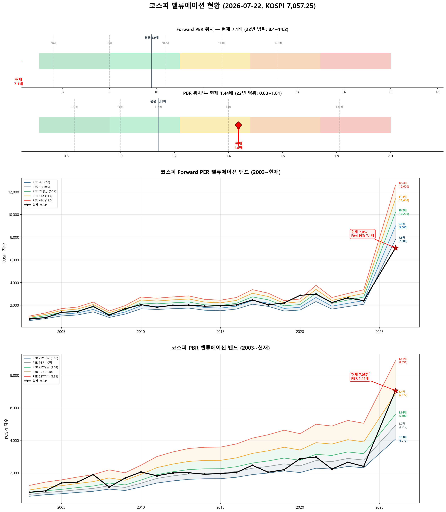

# 📋 MarketTop 일일 종합 (2026-07-22 14:01)

> A4 한 장 요약 — 상세는 각 시장 리포트 참조

---

### 🔵 코스피 7,057.25  —  ↔️ 횡보장 (신뢰도 45%)

| 과열 점수 | 29/100 🔵 저평가 |
|:---:|:---|

> ✅ **다음 매도 목표 7,431(+5.3%) 대기**

**📈 상승 시**

| 다음 매도 목표 | **7,431** (+5.3%) → 이격도106(MA10) + MFI90+ (승률 100%) |
|:---:|:---|

**📉 하락 시**

| 1차 방어선 | **6,846** (-3%) → 30% 손절 |
|:---:|:---|
| 핵심 하락감지 | ADX20+ + MACD데드 + RSI68+ (승률 83%) |
| 강력 매도 | 전체 4개+ 전략 동시 발동 시 → 50% 청산 (검증승률 71%) |

**📍 분할매도 단계**

| 단계 | 목표가 | 등락률 | 전략 | 승률 | 틀렸을 때 |
|:---:|---:|:---:|:---|:---:|:---|
| ⏳ 1단계 | **7,431** | +5.3% | 이격도106(MA10) + MFI90+ | 100% | - |
| ⏳ 2단계 | **9,244** | +31.0% | 이격도116(MA35) + CCI80+ + ADX25+ | 80% | 평균+9% |

**🛑 손절 단계**

| 단계 | 손절가 | 비중 | 전략 | 승률 |
|:---:|---:|:---:|:---|:---:|
| 1단계 | **6,846** (-3%) | 30% | ADX20+ + MACD데드 + RSI68+ | 83% |
| 2단계 | **6,704** (-5%) | 30% | BB101%반전 + 이격도118(MA35) | 86% |
| 3단계 | **6,493** (-8%) | 40% | MFI80반전 + 이격도120(MA70) | 71% |

**🎯 방향성 종합**: 🟠 **약한 하락 압력**

| 방향 | 전략 | 평균 승률 | 예상 변동 |
|:----:|:---:|:--------:|:--------:|
| 🔴 하락(매도) | 6개 | 83.0% | -3.22% |
| 🟢 상승(매수) | 5개 | 75.6% | +4.00% |

**📐 매도 Top1 [이격도106(MA10) + MFI90+] 20일 수익률 분포**

  • 중앙값: **-2.1%** | 5%분위 -12.0% ~ 95%분위 -0.6%

**📐 매수 Top1 [RSI35저점반전 + 하향이격도85(MA20)] 20일 수익률 분포**

  • 중앙값: **+9.1%** | 5%분위 -5.7% ~ 95%분위 +18.9%

**💰 Kelly 권장 매도비중**

| 지표 | 값 | 의미 |
|:---|---:|:---|
| 평균 Half-Kelly (Top5) | **24%** | 매수 후 매도 신호 시 권장 청산비율 |
| 최대 Half-Kelly | 41% | 가장 강한 전략의 권장 비중 |
| 평균 Sharpe (Top5) | 2.54 | 우수 |
| 2% 이내 임박 전략 수 | 0개 | 신호 발동 임박도 |

---

### 🔴 코스닥 774.76  —  📉 하락장 (신뢰도 100%)

| 과열 점수 | 20/100 🔵 저평가 |
|:---:|:---|

> ✅ **다음 매도 목표 806(+4.0%) 대기**

**📈 상승 시**

| 다음 매도 목표 | **806** (+4.0%) → 이격도102(MA10) + 거래량2.5배+ (승률 88%) |
|:---:|:---|

**📉 하락 시**

| 1차 방어선 | **752** (-3%) → 30% 손절 |
|:---:|:---|
| 핵심 하락감지 | MACD데드 + RSI68+ + MFI78+ (승률 100%) |
| 강력 매도 | 전체 6개+ 전략 동시 발동 시 → 50% 청산 (검증승률 74%) |

**📍 분할매도 단계**

| 단계 | 목표가 | 등락률 | 전략 | 승률 | 틀렸을 때 |
|:---:|---:|:---:|:---|:---:|:---|
| 🎯 1단계 | **806** | +4.0% | 이격도102(MA10) + 거래량2.5배+ | 88% | 평균+3% |
| ⏳ 2단계 | **938** | +21.1% | 이격도104(MA35) + CCI200+ + ADX35+ | 71% | 평균+8% |
| ⏳ 3단계 | **1,186** | +53.0% | 이격도116(MA65) + CCI160+ + ADX15+ | 89% | 평균+10% |

**🛑 손절 단계**

| 단계 | 손절가 | 비중 | 전략 | 승률 |
|:---:|---:|:---:|:---|:---:|
| 1단계 | **752** (-3%) | 30% | MACD데드 + RSI68+ + MFI78+ | 100% |
| 2단계 | **736** (-5%) | 30% | MFI88반전 + RSI60+ + Stoch95+ | 80% |
| 3단계 | **713** (-8%) | 40% | RSI80반전 + 이격도123(MA90) | 86% |

**🎯 방향성 종합**: 🟠 **약한 하락 압력**

| 방향 | 전략 | 평균 승률 | 예상 변동 |
|:----:|:---:|:--------:|:--------:|
| 🔴 하락(매도) | 12개 | 81.3% | -3.39% |
| 🟢 상승(매수) | 12개 | 86.9% | +9.85% |

**📐 매도 Top1 [MACD데드 + RSI68+ + MFI78+] 20일 수익률 분포**

  • 중앙값: **-3.4%** | 5%분위 -13.6% ~ 95%분위 -0.9%

**📐 매수 Top1 [하향이격도86(MA90) + CCI-250- + ADX45+] 20일 수익률 분포**

  • 중앙값: **+12.7%** | 5%분위 +2.6% ~ 95%분위 +19.4%

**💰 Kelly 권장 매도비중**

| 지표 | 값 | 의미 |
|:---|---:|:---|
| 평균 Half-Kelly (Top5) | **30%** | 매수 후 매도 신호 시 권장 청산비율 |
| 최대 Half-Kelly | 41% | 가장 강한 전략의 권장 비중 |
| 평균 Sharpe (Top5) | 2.83 | 우수 |
| 2% 이내 임박 전략 수 | 0개 | 신호 발동 임박도 |

---

### 📊 코스피 밸류에이션

| 지표 | 현재 | 22Y평균 | 판단 |
|:---:|:---:|:---:|:---|
| **Fwd PER** | **7.1배** | 9.9배 | 극저평가 🟢🟢 |
| **PBR** | **1.44배** | 1.14배 | 고평가 🟡 |
| Fwd EPS | 1000 | - | BPS 4912 |

| PER 밴드 | 적정지수 | 괴리 |
|:---:|---:|:---:|
| -2σ (7.8) | 7,800 | +10.5% |
| -1σ (9.0) | 9,000 | +27.5% |
| 5Y평균 (10.2) | 10,200 | +44.5% |
| +1σ (11.4) | 11,400 | +61.5% |
| +2σ (12.6) | 12,600 | +78.5% |

---

### � 코스피 향후 60일 등락 위험 분석

> 💡 과거 30년간 지금과 비슷했던 상황(이격도 91%, 2개월 상승률 +10%) **417번** 발생
> → 그때 이후 2개월간 실제로 얼마나 올랐고 빠졌는지 통계

**📈 상승 가능성:**

| 항목 | 결과 | 해석 |
|:---|:---:|:---|
| **2개월 내 평균 최대상승폭** | **+5.7%** | 중위값 +4.0% |
| 역대 최고 사례 | +60.5% | 지수 11,326 |

| 상승폭 | 발생 확률 | 그때 지수 |
|:---|:---:|---:|
| +5% 이상 상승 | **42%** | 7,410 |
| +10% 이상 상승 | **14%** | 7,763 |
| +15% 이상 상승 | **7%** | 8,116 |
| +20% 이상 상승 | **4%** | 8,469 |

**📉 하락 위험:** 🟡 보통

| 항목 | 결과 | 해석 |
|:---|:---:|:---|
| **2개월 내 평균 최대낙폭** | **-6.2%** | 중위값 -4.2% |
| 역대 최악의 경우 | -37.7% | 지수 4,396 |
| 평소보다 위험한 정도 | 1.1배 | 평소와 비슷한 수준 |

**2개월 내 하락 확률과 예상 지수:**

| 하락폭 | 발생 확률 | 그때 지수 |
|:---|:---:|---:|
| -5% 이상 하락 | **45%** | 6,704 |
| -10% 이상 하락 | **23%** | 6,352 |
| -15% 이상 하락 | **8%** | 5,999 |
| -20% 이상 하락 | **4%** | 5,646 |

**💡 확률 기반 판단:**

> 📌 뚜렷한 방향성 없음. 현재 비중 유지하며 추이 관망

---

### 🔮 코스피 과거 유사 패턴 분석

> 💡 현재와 가격 움직임 + 기술적 지표가 비슷했던 과거 **20개 시점** 발견 (평균 유사도 70%)
> → 그 시점 이후 40일간 실제로 어떻게 움직였는지 통계

**📊 유사 패턴 이후 40일간 등락 범위:**

| 구분 | 평균 | 중위값 | 지수 환산 |
|:---|:---:|:---:|---:|
| 📈 최대 상승폭 | **+7.4%** | +4.9% | 7,406 |
| 📉 최대 하락폭 | **-9.2%** | -7.1% | 6,553 |
| 🚀 최고 사례 | +20.8% | - | 8,525 |
| 💥 최악 사례 | -27.6% | - | 5,107 |

**🔄 반전 패턴:**

| 패턴 | 평균 크기 | 해석 |
|:---|:---:|:---|
| 고점 찍고 반락 | **-12.6%** | 상승 후 평균 이만큼 되돌림 |
| 저점 찍고 반등 | **+13.4%** | 하락 후 평균 이만큼 회복 |

**⏰ 시간대별 상승 확률:**

| 기간 | 상승 확률 | 평균 수익률 | 예상 지수 |
|:---|:---:|:---:|---:|
| 10일 후 | **45%** | -0.6% | 7,017 |
| 20일 후 | **50%** | +0.1% | 7,062 |
| 40일 후 | **50%** | -0.3% | 7,036 |

**📈 대표 경로 (중위값):**

| 시점 | 낙관(상위25%) | 중립(중위) | 비관(하위25%) | 중립 지수 |
|:---|:---:|:---:|:---:|---:|
| 5일 후 | +1.6% | -1.6% | -4.4% | 6,945 |
| 10일 후 | +3.6% | -0.9% | -3.1% | 6,992 |
| 20일 후 | +4.4% | -0.5% | -4.9% | 7,020 |
| 30일 후 | +5.8% | -1.0% | -6.2% | 6,986 |
| 40일 후 | +7.3% | +0.1% | -6.2% | 7,065 |

**📅 가장 유사했던 과거 시점 (최근 5개):**

- **2024-11-08** (유사도 67%) — 지수 2,561 → 40일간 최대+0.0%, 최대-7.8%, 최종-1.6%
- **2022-06-27** (유사도 68%) — 지수 2,402 → 40일간 최대+5.5%, 최대-4.6%, 최종+1.4%
- **2020-03-03** (유사도 68%) — 지수 2,014 → 40일간 최대+3.5%, 최대-27.6%, 최종-3.3%
- **2019-01-07** (유사도 68%) — 지수 2,037 → 40일간 최대+9.7%, 최대-0.6%, 최종+4.9%
- **2012-05-29** (유사도 68%) — 지수 1,850 → 40일간 최대+2.9%, 최대-4.4%, 최종-4.4%

### 🔮 코스닥 과거 유사 패턴 분석

> 💡 현재와 가격 움직임 + 기술적 지표가 비슷했던 과거 **6개 시점** 발견 (평균 유사도 66%)
> → 그 시점 이후 40일간 실제로 어떻게 움직였는지 통계

**📊 유사 패턴 이후 40일간 등락 범위:**

| 구분 | 평균 | 중위값 | 지수 환산 |
|:---|:---:|:---:|---:|
| 📈 최대 상승폭 | **+5.4%** | +2.7% | 795 |
| 📉 최대 하락폭 | **-10.6%** | -10.5% | 693 |
| 🚀 최고 사례 | +13.7% | - | 881 |
| 💥 최악 사례 | -20.5% | - | 616 |

**🔄 반전 패턴:**

| 패턴 | 평균 크기 | 해석 |
|:---|:---:|:---|
| 고점 찍고 반락 | **-14.9%** | 상승 후 평균 이만큼 되돌림 |
| 저점 찍고 반등 | **+11.0%** | 하락 후 평균 이만큼 회복 |

**⏰ 시간대별 상승 확률:**

| 기간 | 상승 확률 | 평균 수익률 | 예상 지수 |
|:---|:---:|:---:|---:|
| 10일 후 | **17%** | -3.5% | 748 |
| 20일 후 | **33%** | -5.0% | 736 |
| 40일 후 | **50%** | -0.4% | 772 |

**📈 대표 경로 (중위값):**

| 시점 | 낙관(상위25%) | 중립(중위) | 비관(하위25%) | 중립 지수 |
|:---|:---:|:---:|:---:|---:|
| 5일 후 | +0.8% | -1.7% | -2.2% | 762 |
| 10일 후 | -1.6% | -2.0% | -7.3% | 759 |
| 20일 후 | -0.6% | -4.6% | -7.7% | 739 |
| 30일 후 | +4.4% | -5.0% | -11.7% | 736 |
| 40일 후 | +8.9% | -2.9% | -9.2% | 752 |

**📅 가장 유사했던 과거 시점 (최근 5개):**

- **2023-11-02** (유사도 67%) — 지수 773 → 40일간 최대+13.7%, 최대0.0%, 최종+13.7%
- **2023-10-13** (유사도 66%) — 지수 823 → 40일간 최대+2.0%, 최대-10.5%, 최종+0.9%
- **2022-09-05** (유사도 66%) — 지수 771 → 40일간 최대+3.3%, 최대-15.5%, 최종-10.1%
- **2011-04-29** (유사도 66%) — 지수 511 → 40일간 최대+1.1%, 최대-10.5%, 최종-6.7%
- **2009-11-10** (유사도 65%) — 지수 483 → 40일간 최대+11.6%, 최대-6.5%, 최종+11.6%

---

### 📎 상세 리포트

- 코스피: [코스피_고점판독리포트_20260722_140044.md](코스피_고점판독리포트_20260722_140044.md)
- 코스닥: [코스닥_고점판독리포트_20260722_140155.md](코스닥_고점판독리포트_20260722_140155.md)

---

*본 리포트는 백테스트 기반 참고용이며, 투자 판단의 최종 책임은 투자자 본인에게 있습니다.*