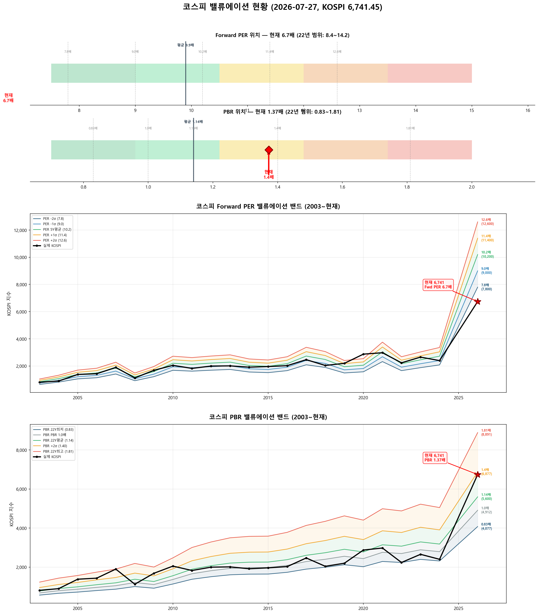

# 📋 MarketTop 일일 종합 (2026-07-27 15:01)

> A4 한 장 요약 — 상세는 각 시장 리포트 참조

---

### 🔵 코스피 6,741.45  —  ↔️ 횡보장 (신뢰도 25%)

| 과열 점수 | 23/100 🔵 저평가 |
|:---:|:---|

> ✅ **다음 매도 목표 7,246(+7.5%) 대기**

**📈 상승 시**

| 다음 매도 목표 | **7,246** (+7.5%) → 이격도106(MA10) + MFI90+ (승률 100%) |
|:---:|:---|

**📉 하락 시**

| 1차 방어선 | **6,539** (-3%) → 30% 손절 |
|:---:|:---|
| 핵심 하락감지 | ADX20+ + MACD데드 + RSI68+ (승률 83%) |
| 강력 매도 | 전체 4개+ 전략 동시 발동 시 → 50% 청산 (검증승률 71%) |

**📍 분할매도 단계**

| 단계 | 목표가 | 등락률 | 전략 | 승률 | 틀렸을 때 |
|:---:|---:|:---:|:---|:---:|:---|
| ⏳ 1단계 | **7,246** | +7.5% | 이격도106(MA10) + MFI90+ | 100% | - |
| ⏳ 2단계 | **9,067** | +34.5% | 이격도116(MA35) + CCI80+ + ADX25+ | 80% | 평균+9% |

**🛑 손절 단계**

| 단계 | 손절가 | 비중 | 전략 | 승률 |
|:---:|---:|:---:|:---|:---:|
| 1단계 | **6,539** (-3%) | 30% | ADX20+ + MACD데드 + RSI68+ | 83% |
| 2단계 | **6,404** (-5%) | 30% | BB101%반전 + 이격도118(MA35) | 86% |
| 3단계 | **6,202** (-8%) | 40% | MFI80반전 + 이격도120(MA70) | 71% |

**🎯 방향성 종합**: 🟠 **약한 하락 압력**

| 방향 | 전략 | 평균 승률 | 예상 변동 |
|:----:|:---:|:--------:|:--------:|
| 🔴 하락(매도) | 6개 | 83.0% | -3.22% |
| 🟢 상승(매수) | 5개 | 75.6% | +4.00% |

**📐 매도 Top1 [이격도106(MA10) + MFI90+] 20일 수익률 분포**

  • 중앙값: **-2.1%** | 5%분위 -12.0% ~ 95%분위 -0.6%

**📐 매수 Top1 [RSI35저점반전 + 하향이격도85(MA20)] 20일 수익률 분포**

  • 중앙값: **+9.1%** | 5%분위 -5.7% ~ 95%분위 +18.9%

**💰 Kelly 권장 매도비중**

| 지표 | 값 | 의미 |
|:---|---:|:---|
| 평균 Half-Kelly (Top5) | **24%** | 매수 후 매도 신호 시 권장 청산비율 |
| 최대 Half-Kelly | 41% | 가장 강한 전략의 권장 비중 |
| 평균 Sharpe (Top5) | 2.54 | 우수 |
| 2% 이내 임박 전략 수 | 0개 | 신호 발동 임박도 |

---

### 🔴 코스닥 764.03  —  📉 하락장 (신뢰도 100%)

| 과열 점수 | 27/100 🔵 저평가 |
|:---:|:---|

> ✅ **다음 매도 목표 792(+3.6%) 대기**

**📈 상승 시**

| 다음 매도 목표 | **792** (+3.6%) → 이격도102(MA10) + 거래량2.5배+ (승률 88%) |
|:---:|:---|

**📉 하락 시**

| 1차 방어선 | **741** (-3%) → 30% 손절 |
|:---:|:---|
| 핵심 하락감지 | MACD데드 + RSI68+ + MFI78+ (승률 100%) |
| 강력 매도 | 전체 6개+ 전략 동시 발동 시 → 50% 청산 (검증승률 74%) |

**📍 분할매도 단계**

| 단계 | 목표가 | 등락률 | 전략 | 승률 | 틀렸을 때 |
|:---:|---:|:---:|:---|:---:|:---|
| 🎯 1단계 | **792** | +3.6% | 이격도102(MA10) + 거래량2.5배+ | 88% | 평균+3% |
| ⏳ 2단계 | **914** | +19.7% | 이격도104(MA35) + CCI200+ + ADX35+ | 71% | 평균+8% |
| ⏳ 3단계 | **1,164** | +52.3% | 이격도116(MA65) + CCI160+ + ADX15+ | 89% | 평균+10% |

**🛑 손절 단계**

| 단계 | 손절가 | 비중 | 전략 | 승률 |
|:---:|---:|:---:|:---|:---:|
| 1단계 | **741** (-3%) | 30% | MACD데드 + RSI68+ + MFI78+ | 100% |
| 2단계 | **726** (-5%) | 30% | MFI88반전 + RSI60+ + Stoch95+ | 80% |
| 3단계 | **703** (-8%) | 40% | RSI80반전 + 이격도123(MA90) | 86% |

**🎯 방향성 종합**: 🟠 **약한 하락 압력**

| 방향 | 전략 | 평균 승률 | 예상 변동 |
|:----:|:---:|:--------:|:--------:|
| 🔴 하락(매도) | 12개 | 81.3% | -3.39% |
| 🟢 상승(매수) | 12개 | 85.7% | +9.47% |

**📐 매도 Top1 [MACD데드 + RSI68+ + MFI78+] 20일 수익률 분포**

  • 중앙값: **-3.4%** | 5%분위 -13.6% ~ 95%분위 -0.9%

**📐 매수 Top1 [하향이격도86(MA90) + CCI-250- + ADX45+] 20일 수익률 분포**

  • 중앙값: **+12.7%** | 5%분위 +2.6% ~ 95%분위 +19.4%

**💰 Kelly 권장 매도비중**

| 지표 | 값 | 의미 |
|:---|---:|:---|
| 평균 Half-Kelly (Top5) | **30%** | 매수 후 매도 신호 시 권장 청산비율 |
| 최대 Half-Kelly | 41% | 가장 강한 전략의 권장 비중 |
| 평균 Sharpe (Top5) | 2.83 | 우수 |
| 2% 이내 임박 전략 수 | 0개 | 신호 발동 임박도 |

---

### 📊 코스피 밸류에이션

| 지표 | 현재 | 22Y평균 | 판단 |
|:---:|:---:|:---:|:---|
| **Fwd PER** | **6.7배** | 9.9배 | 극저평가 🟢🟢 |
| **PBR** | **1.37배** | 1.14배 | 고평가 🟡 |
| Fwd EPS | 1000 | - | BPS 4912 |

| PER 밴드 | 적정지수 | 괴리 |
|:---:|---:|:---:|
| -2σ (7.8) | 7,800 | +15.7% |
| -1σ (9.0) | 9,000 | +33.5% |
| 5Y평균 (10.2) | 10,200 | +51.3% |
| +1σ (11.4) | 11,400 | +69.1% |
| +2σ (12.6) | 12,600 | +86.9% |

---

### 🔮 코스피 과거 유사 패턴 분석

> 💡 현재와 가격 움직임 + 기술적 지표가 비슷했던 과거 **17개 시점** 발견 (평균 유사도 70%)
> → 그 시점 이후 40일간 실제로 어떻게 움직였는지 통계

**📊 유사 패턴 이후 40일간 등락 범위:**

| 구분 | 평균 | 중위값 | 지수 환산 |
|:---|:---:|:---:|---:|
| 📈 최대 상승폭 | **+6.5%** | +5.8% | 7,132 |
| 📉 최대 하락폭 | **-7.8%** | -3.9% | 6,480 |
| 🚀 최고 사례 | +28.0% | - | 8,631 |
| 💥 최악 사례 | -22.1% | - | 5,253 |

**🔄 반전 패턴:**

| 패턴 | 평균 크기 | 해석 |
|:---|:---:|:---|
| 고점 찍고 반락 | **-11.3%** | 상승 후 평균 이만큼 되돌림 |
| 저점 찍고 반등 | **+11.3%** | 하락 후 평균 이만큼 회복 |

**⏰ 시간대별 상승 확률:**

| 기간 | 상승 확률 | 평균 수익률 | 예상 지수 |
|:---|:---:|:---:|---:|
| 10일 후 | **41%** | -0.8% | 6,691 |
| 20일 후 | **53%** | -1.2% | 6,662 |
| 40일 후 | **71%** | +1.3% | 6,828 |

**📈 대표 경로 (중위값):**

| 시점 | 낙관(상위25%) | 중립(중위) | 비관(하위25%) | 중립 지수 |
|:---|:---:|:---:|:---:|---:|
| 5일 후 | +2.1% | +0.1% | -2.7% | 6,746 |
| 10일 후 | +1.8% | -0.4% | -3.1% | 6,712 |
| 20일 후 | +4.4% | +0.0% | -6.1% | 6,742 |
| 30일 후 | +5.7% | +0.9% | -6.5% | 6,801 |
| 40일 후 | +6.3% | +3.7% | -8.0% | 6,993 |

**📅 가장 유사했던 과거 시점 (최근 5개):**

- **2022-09-22** (유사도 75%) — 지수 2,332 → 40일간 최대+6.5%, 최대-7.6%, 최종+3.7%
- **2022-06-30** (유사도 67%) — 지수 2,333 → 40일간 최대+8.6%, 최대-1.7%, 최종+6.4%
- **2019-07-25** (유사도 69%) — 지수 2,074 → 40일간 최대+1.3%, 최대-7.9%, 최종+1.3%
- **2017-08-10** (유사도 67%) — 지수 2,359 → 40일간 최대+5.3%, 최대-1.7%, 최종+5.3%
- **2014-06-16** (유사도 70%) — 지수 1,994 → 40일간 최대+4.5%, 최대-1.3%, 최종+2.3%

### 🔮 코스닥 과거 유사 패턴 분석

> 💡 현재와 가격 움직임 + 기술적 지표가 비슷했던 과거 **9개 시점** 발견 (평균 유사도 68%)
> → 그 시점 이후 40일간 실제로 어떻게 움직였는지 통계

**📊 유사 패턴 이후 40일간 등락 범위:**

| 구분 | 평균 | 중위값 | 지수 환산 |
|:---|:---:|:---:|---:|
| 📈 최대 상승폭 | **+5.7%** | +4.4% | 797 |
| 📉 최대 하락폭 | **-8.7%** | -7.1% | 710 |
| 🚀 최고 사례 | +18.2% | - | 903 |
| 💥 최악 사례 | -18.3% | - | 624 |

**🔄 반전 패턴:**

| 패턴 | 평균 크기 | 해석 |
|:---|:---:|:---|
| 고점 찍고 반락 | **-12.6%** | 상승 후 평균 이만큼 되돌림 |
| 저점 찍고 반등 | **+9.8%** | 하락 후 평균 이만큼 회복 |

**⏰ 시간대별 상승 확률:**

| 기간 | 상승 확률 | 평균 수익률 | 예상 지수 |
|:---|:---:|:---:|---:|
| 10일 후 | **67%** | -1.4% | 754 |
| 20일 후 | **44%** | -1.5% | 752 |
| 40일 후 | **33%** | -1.1% | 755 |

**📈 대표 경로 (중위값):**

| 시점 | 낙관(상위25%) | 중립(중위) | 비관(하위25%) | 중립 지수 |
|:---|:---:|:---:|:---:|---:|
| 5일 후 | +0.8% | -0.2% | -0.6% | 762 |
| 10일 후 | +3.0% | +1.1% | -4.8% | 772 |
| 20일 후 | +3.7% | -2.3% | -6.7% | 746 |
| 30일 후 | -2.4% | -6.6% | -10.4% | 714 |
| 40일 후 | +0.6% | -4.2% | -6.6% | 732 |

**📅 가장 유사했던 과거 시점 (최근 5개):**

- **2022-09-08** (유사도 73%) — 지수 778 → 40일간 최대+2.4%, 최대-16.2%, 최종-8.1%
- **2013-10-15** (유사도 69%) — 지수 533 → 40일간 최대+0.9%, 최대-6.6%, 최종-6.6%
- **2011-05-04** (유사도 71%) — 지수 511 → 40일간 최대+0.0%, 최대-10.4%, 최종-4.2%
- **2008-01-29** (유사도 69%) — 지수 633 → 40일간 최대+4.4%, 최대-5.1%, 최종+0.6%
- **2005-05-04** (유사도 65%) — 지수 429 → 40일간 최대+18.2%, 최대-0.9%, 최종+18.2%

---

### 📎 상세 리포트

- 코스피: [코스피_고점판독리포트_20260727_145821.md](코스피_고점판독리포트_20260727_145821.md)
- 코스닥: [코스닥_고점판독리포트_20260727_150103.md](코스닥_고점판독리포트_20260727_150103.md)

---

*본 리포트는 백테스트 기반 참고용이며, 투자 판단의 최종 책임은 투자자 본인에게 있습니다.*