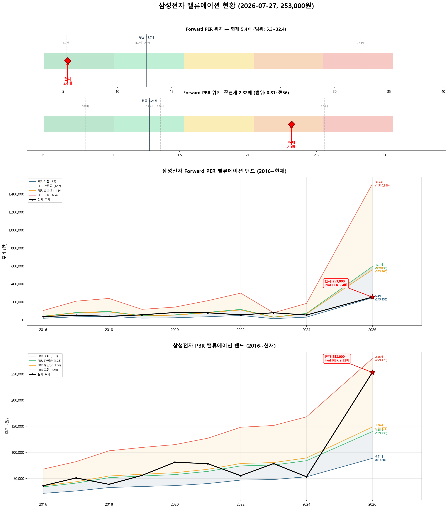
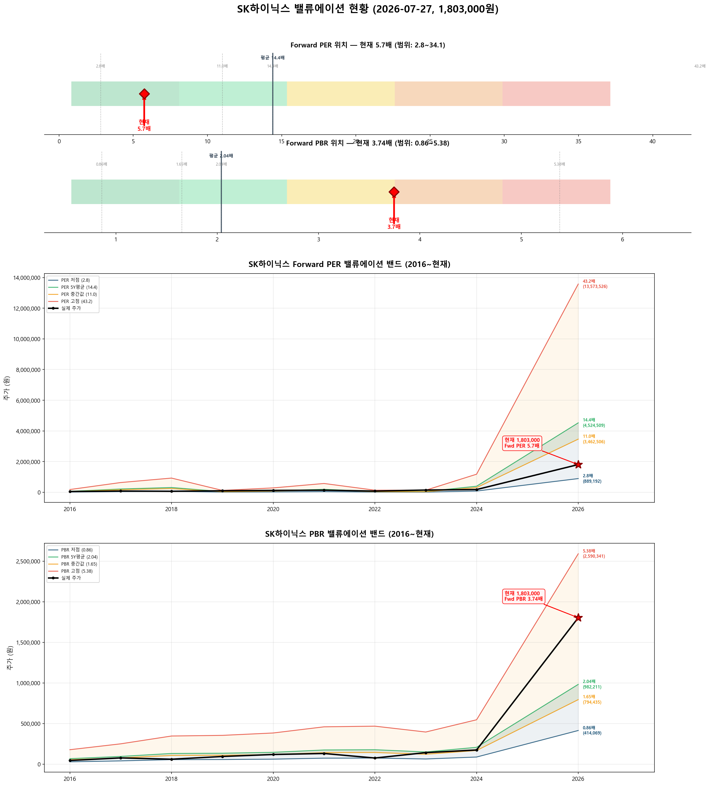

# 📊 삼성전자 · SK하이닉스 밸류에이션 분석 리포트

**분석일시**: 2026년 07월 27일 15:03  
**데이터 출처**: 네이버금융, wisereport 컨센서스  
**분석 방법론**: Forward PER 중심 (싸이클 산업 특성 반영)  

---

## ⚙️ 싸이클 산업과 Forward PER

> **반도체는 대표적인 싸이클 산업**입니다. Trailing PER(과거 실적 기준)은 오해를 유발합니다:  
> - **사이클 저점**: 실적 악화 → Trailing PER 급등 → 수치만 보면 "비싸 보이지만" 실제로는 매수 적기  
> - **사이클 고점**: 실적 폭증 → Trailing PER 급락 → 수치만 보면 "싸 보이지만" 실제로는 고점 부근  
> 
> 따라서 **Forward PER (향후 12개월 예상 실적 기준)**을 핵심 지표로 사용합니다.  
> Forward PER = 현재 주가 ÷ 26년(E) EPS

---

## 🎯 종합 밸류에이션 요약

| 항목 | 삼성전자 | SK하이닉스 |
|:---:|:---:|:---:|
| 현재 주가 | 253,000원 | 1,803,000원 |
| 시가총액 | 14,791,084억 | 12,850,023억 |
| 52주 고/저 | 374,500 / 67,200 | 2,987,000 / 245,000 |
|  |  |  |
| **━━ Forward 지표 (핵심) ━━** |  |  |
| **Forward PER (26E)** | **5.4배** | **5.7배** |
| **Forward PBR (26E)** | **2.32배** | **3.74배** |
| 26년(E) EPS | 46,664원 | 314,202원 |
| 26년(E) BPS | 109,170원 | 481,476원 |
| 26년(E) ROE | 42.7% | 65.3% |
| **Forward PER 판단** | **✅ Forward PER 낮음 — 저평가** | **✅ Forward PER 낮음 — 저평가** |
|  |  |  |
| ━━ Trailing 지표 (참고) ━━ |  |  |
| Trailing PER | 38.0배 | 29.8배 |
| 12M Forward PER | 7.4배 | 4.9배 |
| 현재 PBR | 3.90배 | 10.24배 |
| 현재 ROE | 10.3% | 34.3% |
| 배당수익률 | 0.67% | 0.17% |
|  |  |  |
| ━━ 적정주가 ━━ |  |  |
| 컨센서스 목표주가 | 513,958원 | 3,626,087원 |
| **적정주가 (Fwd PER)** | **592,633원** | **4,524,509원** |
| **적정주가 (Fwd PBR)** | **139,738원** | **982,211원** |
| **적정주가 (평균)** | **366,185원** | **2,753,360원** |
| **현재 대비 괴리율** | **-30.9%** | **-34.5%** |
| **종합 판단** | **✅ 상당히 저평가** | **✅ 상당히 저평가** |

---

## 📈 삼성전자 (A005930) 상세 분석

### 📊 밸류에이션 밴드 차트



### 현재 위치

- **주가**: 253,000원
- **52주 고점 대비**: -32.4%
- **52주 저점 대비**: +276.5%
- **외국인 지분율**: 49.6%
- **컨센서스 목표주가**: 513,958원 (현재 대비 ↑50.8%)

### ⭐ Forward PER 분석 (핵심)

| 항목 | 값 |
|:----:|:---:|
| 26년(E) EPS | 46,664원 |
| **Forward PER** | **5.4배** |
| 5년 평균 PER | 12.7배 |
| Forward vs 5년평균 | -57.3% |
| **판단** | **✅ Forward PER 낮음 — 저평가** |

**Forward PER Band (26년E EPS = 46,664원 기준)**

| PER 배수 | 주가 수준 | 현재 주가 대비 |
|:--------:|:--------:|:------------:|
| 3배 | 139,992원 | +80.7% |
| 5배 | 233,320원 | +8.4% ◀◀ |
| 7배 | 326,648원 | -22.5% |
| 10배 | 466,640원 | -45.8% |
| 13배 | 606,632원 | -58.3% |
| 15배 | 699,960원 | -63.9% |
| 20배 | 933,280원 | -72.9% |
| 25배 | 1,166,600원 | -78.3% |

**Forward PER Band 시각화**

```
       139,992원 │ ██████ PER 3x
       233,320원 │ ██████████ PER 5x
       253,000원 ★ ▓▓▓▓▓▓▓▓▓▓ ★ 현재 주가
       326,648원 │ ██████████████ PER 7x
       466,640원 │ ████████████████████ PER 10x
       606,632원 │ ██████████████████████████ PER 13x
       699,960원 │ ██████████████████████████████ PER 15x
       933,280원 │ ████████████████████████████████████████ PER 20x
     1,166,600원 │ ██████████████████████████████████████████████████ PER 25x
```

### PER Band (히스토리컬 레벨)

**현재 EPS**: 7,477원 / **26년(E) EPS**: 46,664원

| PER 수준 | PER 배수 | 현재EPS 기준 | 26년E 기준 | 현재 주가 위치 |
|:--------:|:-------:|:----------:|:---------:|:------------:|
| 저점 | 5.3배 | 39,329원 | 245,453원 ◀ | 위 (+3%) |
| 5년평균 | 12.7배 | 94,958원 | 592,633원 | 아래 (-57%) |
| 중간값 | 11.9배 | 89,051원 | 555,768원 | 아래 (-54%) |
| 고점 | 32.4배 | 242,105원 | 1,510,980원 | 아래 (-83%) |

**PER 밴드 시각화 (26년E EPS 기준)**

```
       245,453원 │ ███████ 저점 PER 5.3x
       253,000원 ★ ▓▓▓▓▓▓▓ ★ 현재 주가
       555,768원 │ ████████████████ 중간값 PER 11.9x
       592,633원 │ █████████████████ 5년평균 PER 12.7x
     1,510,980원 │ █████████████████████████████████████████████ 고점 PER 32.4x
```

### PBR Band 분석

**현재 BPS**: 71,679원 / **26년(E) BPS**: 109,170원  
**Forward PBR**: 2.32배 (5년 평균 1.28배)

**Forward PBR Band (26년E BPS = 109,170원 기준)**

| PBR 배수 | 주가 수준 | 현재 주가 대비 |
|:--------:|:--------:|:------------:|
| 0.5배 | 54,585원 | +363.5% |
| 0.8배 | 87,336원 | +189.7% |
| 1.0배 | 109,170원 | +131.7% |
| 1.3배 | 141,921원 | +78.3% |
| 1.5배 | 163,755원 | +54.5% |
| 2.0배 | 218,340원 | +15.9% |
| 2.5배 | 272,925원 | -7.3% ◀◀ |
| 3.0배 | 327,510원 | -22.8% |
| 4.0배 | 436,680원 | -42.1% |
| 5.0배 | 545,850원 | -53.7% |

| PBR 수준 | PBR 배수 | 현재BPS 기준 | 26년E 기준 | 현재 주가 위치 |
|:--------:|:-------:|:----------:|:---------:|:------------:|
| 저점 | 0.81배 | 58,060원 | 88,428원 | 위 (+186%) |
| 5년평균 | 1.28배 | 91,749원 | 139,738원 | 위 (+81%) |
| 중간값 | 1.36배 | 97,483원 | 148,471원 | 위 (+70%) |
| 고점 | 2.56배 | 183,498원 | 279,475원 | 아래 (-9%) |

**PBR 밴드 시각화 (26년E BPS 기준)**

```
        88,428원 │ ██████████████ 저점 PBR 0.81x
       139,738원 │ ██████████████████████ 5년평균 PBR 1.28x
       148,471원 │ ███████████████████████ 중간값 PBR 1.36x
       253,000원 ★ ▓▓▓▓▓▓▓▓▓▓▓▓▓▓▓▓▓▓▓▓▓▓▓▓▓▓▓▓▓▓▓▓▓▓▓▓▓▓▓▓ ★ 현재 주가
       279,475원 │ █████████████████████████████████████████████ 고점 PBR 2.56x
```

### 히스토리컬 PER·PBR 추이

| 연도 | 주가 | EPS | PER | BPS | PBR | ROE |
|:----:|:----:|:---:|:---:|:---:|:---:|:---:|
| 16년 | 36,040 | 3,187 | 11.3 | 26,503 | 1.36 | 12.0% |
| 17년 | 50,960 | 6,405 | 8.0 | 32,102 | 1.59 | 19.9% |
| 18년 | 38,700 | 7,352 | 5.3 | 40,214 | 0.96 | 18.3% |
| 19년 | 55,800 | 3,602 | 15.5 | 42,701 | 1.31 | 8.4% |
| 20년 | 81,000 | 4,370 | 18.5 | 44,838 | 1.81 | 9.8% |
| 21년 | 78,300 | 6,574 | 11.9 | 49,623 | 1.58 | 13.2% |
| 22년 | 55,300 | 9,168 | 6.0 | 57,822 | 0.96 | 15.9% |
| 23년 | 78,500 | 2,424 | 32.4 | 59,170 | 1.33 | 4.1% |
| 24년 | 53,200 | 5,632 | 9.4 | 65,612 | 0.81 | 8.6% |
| 25년4Q(E) | 183,500 | 7,477 | 24.5 | 71,679 | 2.56 | 10.4% |

### 실적 현황

| 항목 | 25년4Q 연환산 | 26년(E) 컨센서스 | YoY |
|:----:|:----------:|:-------------:|:---:|
| 매출액 | 3,336,059억 | 5,159,507억 | +55% |
| 영업이익 | 436,012억 | 1,925,789억 | +342% |
| 지배순이익 | 442,610억 | 1,602,675억 | +262% |
| OPM | 13.1% | 37.3% | |
| EPS | 7,477원 | 46,664원 | +524% |
| BPS | 71,679원 | 109,170원 | +52% |
| ROE | 10.3% | 42.7% | |

### 적정주가 산출

**방법 1: Forward PER 기반** (5년 평균 PER × 26년E EPS)
- 12.7배 × 46,664원 = **592,633원** (현재 대비 -57.3%)

**방법 2: Forward PBR 기반** (5년 평균 PBR × 26년E BPS)
- 1.28배 × 109,170원 = **139,738원** (현재 대비 +81.1%)

**방법 3: 컨센서스 기반** (애널리스트 목표주가)
- **513,958원** (현재 대비 -50.8%)

**종합 적정주가**: **366,185원** → 현재 대비 **-30.9%**

> **판단: ✅ 상당히 저평가**  
> **Forward PER 관점: ✅ Forward PER 낮음 — 저평가**

---

## 📈 SK하이닉스 (A000660) 상세 분석

### 📊 밸류에이션 밴드 차트



### 현재 위치

- **주가**: 1,803,000원
- **52주 고점 대비**: -39.6%
- **52주 저점 대비**: +635.9%
- **외국인 지분율**: 53.5%
- **컨센서스 목표주가**: 3,626,087원 (현재 대비 ↑50.3%)

### ⭐ Forward PER 분석 (핵심)

| 항목 | 값 |
|:----:|:---:|
| 26년(E) EPS | 314,202원 |
| **Forward PER** | **5.7배** |
| 5년 평균 PER | 14.4배 |
| Forward vs 5년평균 | -60.2% |
| **판단** | **✅ Forward PER 낮음 — 저평가** |

**Forward PER Band (26년E EPS = 314,202원 기준)**

| PER 배수 | 주가 수준 | 현재 주가 대비 |
|:--------:|:--------:|:------------:|
| 3배 | 942,606원 | +91.3% |
| 5배 | 1,571,010원 | +14.8% ◀◀ |
| 7배 | 2,199,414원 | -18.0% |
| 10배 | 3,142,020원 | -42.6% |
| 13배 | 4,084,626원 | -55.9% |
| 15배 | 4,713,030원 | -61.7% |
| 20배 | 6,284,040원 | -71.3% |
| 25배 | 7,855,050원 | -77.0% |

**Forward PER Band 시각화**

```
       942,606원 │ ██████ PER 3x
     1,571,010원 │ ██████████ PER 5x
     1,803,000원 ★ ▓▓▓▓▓▓▓▓▓▓▓ ★ 현재 주가
     2,199,414원 │ ██████████████ PER 7x
     3,142,020원 │ ████████████████████ PER 10x
     4,084,626원 │ ██████████████████████████ PER 13x
     4,713,030원 │ ██████████████████████████████ PER 15x
     6,284,040원 │ ████████████████████████████████████████ PER 20x
     7,855,050원 │ ██████████████████████████████████████████████████ PER 25x
```

### PER Band (히스토리컬 레벨)

**현재 EPS**: 60,221원 / **26년(E) EPS**: 314,202원

| PER 수준 | PER 배수 | 현재EPS 기준 | 26년E 기준 | 현재 주가 위치 |
|:--------:|:-------:|:----------:|:---------:|:------------:|
| 저점 | 2.8배 | 170,425원 | 889,192원 | 위 (+103%) |
| 5년평균 | 14.4배 | 867,182원 | 4,524,509원 | 아래 (-60%) |
| 중간값 | 11.0배 | 663,635원 | 3,462,506원 | 아래 (-48%) |
| 고점 | 68.9배 | 4,149,829원 | 21,651,660원 | 아래 (-92%) |

**PER 밴드 시각화 (26년E EPS 기준)**

```
       889,192원 │ █ 저점 PER 2.8x
     1,803,000원 ★ ▓▓▓ ★ 현재 주가
     3,462,506원 │ ███████ 중간값 PER 11.0x
     4,524,509원 │ █████████ 5년평균 PER 14.4x
    21,651,660원 │ █████████████████████████████████████████████ 고점 PER 68.9x
```

### PBR Band 분석

**현재 BPS**: 169,098원 / **26년(E) BPS**: 481,476원  
**Forward PBR**: 3.74배 (5년 평균 2.04배)

**Forward PBR Band (26년E BPS = 481,476원 기준)**

| PBR 배수 | 주가 수준 | 현재 주가 대비 |
|:--------:|:--------:|:------------:|
| 0.5배 | 240,738원 | +648.9% |
| 0.8배 | 385,181원 | +368.1% |
| 1.0배 | 481,476원 | +274.5% |
| 1.3배 | 625,919원 | +188.1% |
| 1.5배 | 722,214원 | +149.6% |
| 2.0배 | 962,952원 | +87.2% |
| 2.5배 | 1,203,690원 | +49.8% |
| 3.0배 | 1,444,428원 | +24.8% |
| 4.0배 | 1,925,904원 | -6.4% ◀◀ |
| 5.0배 | 2,407,380원 | -25.1% |

| PBR 수준 | PBR 배수 | 현재BPS 기준 | 26년E 기준 | 현재 주가 위치 |
|:--------:|:-------:|:----------:|:---------:|:------------:|
| 저점 | 0.86배 | 145,424원 | 414,069원 | 위 (+335%) |
| 5년평균 | 2.04배 | 344,960원 | 982,211원 | 위 (+84%) |
| 중간값 | 1.65배 | 279,012원 | 794,435원 | 위 (+127%) |
| 고점 | 5.38배 | 909,747원 | 2,590,341원 | 아래 (-30%) |

**PBR 밴드 시각화 (26년E BPS 기준)**

```
       414,069원 │ ███████ 저점 PBR 0.86x
       794,435원 │ █████████████ 중간값 PBR 1.65x
       982,211원 │ █████████████████ 5년평균 PBR 2.04x
     1,803,000원 ★ ▓▓▓▓▓▓▓▓▓▓▓▓▓▓▓▓▓▓▓▓▓▓▓▓▓▓▓▓▓▓▓ ★ 현재 주가
     2,590,341원 │ █████████████████████████████████████████████ 고점 PBR 5.38x
```

### 히스토리컬 PER·PBR 추이

| 연도 | 주가 | EPS | PER | BPS | PBR | ROE |
|:----:|:----:|:---:|:---:|:---:|:---:|:---:|
| 16년 | 44,700 | 4,057 | 11.0 | 32,990 | 1.35 | 12.3% |
| 17년 | 76,500 | 14,617 | 5.2 | 46,449 | 1.65 | 31.5% |
| 18년 | 60,500 | 21,346 | 2.8 | 64,348 | 0.94 | 33.2% |
| 19년 | 94,100 | 2,755 | 34.1 | 65,825 | 1.43 | 4.2% |
| 20년 | 118,500 | 6,532 | 18.1 | 71,275 | 1.66 | 9.2% |
| 21년 | 131,000 | 13,190 | 9.9 | 85,380 | 1.53 | 15.4% |
| 22년 | 75,000 | 3,063 | 24.5 | 86,904 | 0.86 | 3.5% |
| 23년 | 141,500 | -12,517 | 적자 | 73,495 | 1.93 | -17.0% |
| 24년 | 173,900 | 27,182 | 6.4 | 101,515 | 1.71 | 26.8% |
| 25년4Q(E) | 910,000 | 60,221 | 15.1 | 169,098 | 5.38 | 35.6% |

### 실적 현황

| 항목 | 25년4Q 연환산 | 26년(E) 컨센서스 | YoY |
|:----:|:----------:|:-------------:|:---:|
| 매출액 | 971,467억 | 2,299,806억 | +137% |
| 영업이익 | 472,064억 | 1,606,938억 | +240% |
| 지배순이익 | 429,193억 | 1,299,259억 | +203% |
| OPM | 48.6% | 69.9% | |
| EPS | 60,221원 | 314,202원 | +422% |
| BPS | 169,098원 | 481,476원 | +185% |
| ROE | 34.3% | 65.3% | |

### 적정주가 산출

**방법 1: Forward PER 기반** (5년 평균 PER × 26년E EPS)
- 14.4배 × 314,202원 = **4,524,509원** (현재 대비 -60.2%)

**방법 2: Forward PBR 기반** (5년 평균 PBR × 26년E BPS)
- 2.04배 × 481,476원 = **982,211원** (현재 대비 +83.6%)

**방법 3: 컨센서스 기반** (애널리스트 목표주가)
- **3,626,087원** (현재 대비 -50.3%)

**종합 적정주가**: **2,753,360원** → 현재 대비 **-34.5%**

> **판단: ✅ 상당히 저평가**  
> **Forward PER 관점: ✅ Forward PER 낮음 — 저평가**

---

## 🔍 삼성전자 vs SK하이닉스 비교

| 구분 | 삼성전자 | SK하이닉스 | 비고 |
|:----:|:-------:|:--------:|:----:|
| **Forward PER** | **5.4배** | **5.7배** | 핵심 지표 |
| **Forward PBR** | **2.32배** | **3.74배** | |
| Trailing PER | 38.0배 | 29.8배 | 참고 (싸이클 왜곡) |
| 12M Fwd PER | 7.4배 | 4.9배 | |
| 현재 PBR | 3.90배 | 10.24배 | |
| 현재 ROE | 10.3% | 34.3% | |
| 26년E ROE | 42.7% | 65.3% | |
| OPM | 13.1% | 48.6% | |
| 26년E EPS 성장률 | +524% | +422% | |
| 적정주가 괴리율 | -30.9% | -34.5% | |
| **Forward PER 판단** | **✅ Forward PER 낮음 — 저평가** | **✅ Forward PER 낮음 — 저평가** | |
| **밸류 판단** | **✅ 상당히 저평가** | **✅ 상당히 저평가** | |

---

## 💡 투자 시사점

### 삼성전자

- **Forward PER 5.4배** → ✅ Forward PER 낮음 — 저평가
- Trailing PER(38.0배)과의 괴리가 큼 → 26년 실적 대폭 개선 전망 반영
- 현재 주가(253,000원)는 적정주가(366,185원) 대비 **30.9% 저평가** 상태
- 26년 실적 성장이 예상대로 실현되면 상당한 업사이드 잠재력
- 52주 고점(374,500원) 대비 -32.4%
- 애널리스트 목표주가 513,958원 (현재 대비 +103.1%)

### SK하이닉스

- **Forward PER 5.7배** → ✅ Forward PER 낮음 — 저평가
- Trailing PER(29.8배)과의 괴리가 큼 → 26년 실적 대폭 개선 전망 반영
- 현재 주가(1,803,000원)는 적정주가(2,753,360원) 대비 **34.5% 저평가** 상태
- 26년 실적 성장이 예상대로 실현되면 상당한 업사이드 잠재력
- 52주 고점(2,987,000원) 대비 -39.6%
- 애널리스트 목표주가 3,626,087원 (현재 대비 +101.1%)

---

## ⚠️ 리스크 요인

- **반도체 사이클**: 메모리 업황 사이클에 따른 실적 변동성 존재. Forward PER가 낮아도 사이클 피크 리스크 점검 필요
- **컨센서스 리스크**: 26년 실적이 컨센서스에 못 미칠 경우 Forward PER 재산출 시 밸류에이션 급등
- **AI 기대감 과반영**: 현재 주가에 AI 수혜 기대가 상당히 반영된 상태
- **환율·지정학**: 원/달러 환율, 미중 갈등, 수출 규제 리스크
- **PBR 고점 리스크**: 역사적 PBR 고점 부근에 위치 → 순자산 대비 프리미엄 과도 여부 점검
- **싸이클 고점 시나리오**: Trailing PER이 낮을 때가 오히려 사이클 고점일 수 있음 (역설적 위험)

---

> **면책 조항**: 본 리포트는 공개된 데이터를 기반으로 한 기계적 분석이며, 투자 권유가 아닙니다. 투자 판단은 본인의 책임하에 이루어져야 합니다.

**분석 도구**: Python  
**데이터 출처**: 네이버금융, wisereport (navercomp.wisereport.co.kr)
