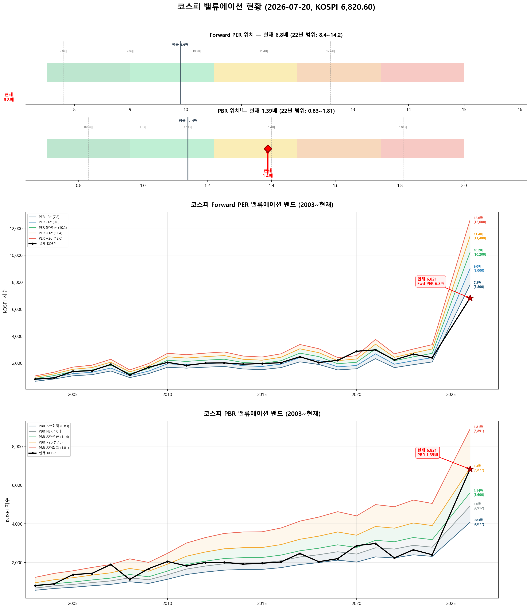

# 📋 MarketTop 일일 종합 (2026-07-20 10:11)

> A4 한 장 요약 — 상세는 각 시장 리포트 참조

---

### 🔵 코스피 6,820.60  —  ↔️ 횡보장 (신뢰도 75%)

| 과열 점수 | 17/100 🔵 저평가 |
|:---:|:---|

> ✅ **다음 매도 목표 7,799(+14.4%) 대기**

**📈 상승 시**

| 다음 매도 목표 | **7,799** (+14.4%) → 이격도106(MA10) + MFI90+ (승률 100%) |
|:---:|:---|

**📉 하락 시**

| 1차 방어선 | **6,616** (-3%) → 30% 손절 |
|:---:|:---|
| 핵심 하락감지 | ADX20+ + MACD데드 + RSI68+ (승률 83%) |
| 강력 매도 | 전체 4개+ 전략 동시 발동 시 → 50% 청산 (검증승률 71%) |

**📍 분할매도 단계**

| 단계 | 목표가 | 등락률 | 전략 | 승률 | 틀렸을 때 |
|:---:|---:|:---:|:---|:---:|:---|
| ⏳ 1단계 | **7,799** | +14.4% | 이격도106(MA10) + MFI90+ | 100% | - |
| ⏳ 2단계 | **9,414** | +38.0% | 이격도116(MA35) + CCI80+ + ADX25+ | 80% | 평균+9% |

**🛑 손절 단계**

| 단계 | 손절가 | 비중 | 전략 | 승률 |
|:---:|---:|:---:|:---|:---:|
| 1단계 | **6,616** (-3%) | 30% | ADX20+ + MACD데드 + RSI68+ | 83% |
| 2단계 | **6,480** (-5%) | 30% | BB101%반전 + 이격도118(MA35) | 86% |
| 3단계 | **6,275** (-8%) | 40% | MFI80반전 + 이격도120(MA70) | 71% |

**🎯 방향성 종합**: 🟠 **약한 하락 압력**

| 방향 | 전략 | 평균 승률 | 예상 변동 |
|:----:|:---:|:--------:|:--------:|
| 🔴 하락(매도) | 6개 | 83.0% | -3.22% |
| 🟢 상승(매수) | 5개 | 75.6% | +4.00% |

**📐 매도 Top1 [이격도106(MA10) + MFI90+] 20일 수익률 분포**

  • 중앙값: **-2.1%** | 5%분위 -12.0% ~ 95%분위 -0.6%

**📐 매수 Top1 [RSI35저점반전 + 하향이격도85(MA20)] 20일 수익률 분포**

  • 중앙값: **+9.1%** | 5%분위 -5.7% ~ 95%분위 +18.9%

**💰 Kelly 권장 매도비중**

| 지표 | 값 | 의미 |
|:---|---:|:---|
| 평균 Half-Kelly (Top5) | **24%** | 매수 후 매도 신호 시 권장 청산비율 |
| 최대 Half-Kelly | 41% | 가장 강한 전략의 권장 비중 |
| 평균 Sharpe (Top5) | 2.54 | 우수 |
| 2% 이내 임박 전략 수 | 0개 | 신호 발동 임박도 |

---

### 🔴 코스닥 791.84  —  📉 하락장 (신뢰도 100%)

| 과열 점수 | 25/100 🔵 저평가 |
|:---:|:---|

> ✅ **다음 매도 목표 833(+5.2%) 대기**

**📈 상승 시**

| 다음 매도 목표 | **833** (+5.2%) → 이격도102(MA10) + 거래량2.5배+ (승률 88%) |
|:---:|:---|

**📉 하락 시**

| 1차 방어선 | **768** (-3%) → 30% 손절 |
|:---:|:---|
| 핵심 하락감지 | MACD데드 + RSI68+ + MFI78+ (승률 100%) |
| 강력 매도 | 전체 6개+ 전략 동시 발동 시 → 50% 청산 (검증승률 74%) |

**📍 분할매도 단계**

| 단계 | 목표가 | 등락률 | 전략 | 승률 | 틀렸을 때 |
|:---:|---:|:---:|:---|:---:|:---|
| ⏳ 1단계 | **833** | +5.2% | 이격도102(MA10) + 거래량2.5배+ | 88% | 평균+3% |
| ⏳ 2단계 | **966** | +22.1% | 이격도104(MA35) + CCI200+ + ADX35+ | 71% | 평균+8% |
| ⏳ 3단계 | **1,205** | +52.2% | 이격도116(MA65) + CCI160+ + ADX15+ | 89% | 평균+10% |

**🛑 손절 단계**

| 단계 | 손절가 | 비중 | 전략 | 승률 |
|:---:|---:|:---:|:---|:---:|
| 1단계 | **768** (-3%) | 30% | MACD데드 + RSI68+ + MFI78+ | 100% |
| 2단계 | **752** (-5%) | 30% | MFI88반전 + RSI60+ + Stoch95+ | 80% |
| 3단계 | **728** (-8%) | 40% | RSI80반전 + 이격도123(MA90) | 86% |

**🎯 방향성 종합**: ⚪ **방향 혼조**

| 방향 | 전략 | 평균 승률 | 예상 변동 |
|:----:|:---:|:--------:|:--------:|
| 🔴 하락(매도) | 12개 | 81.3% | -3.39% |
| 🟢 상승(매수) | 12개 | 86.5% | +10.52% |

**📐 매도 Top1 [MACD데드 + RSI68+ + MFI78+] 20일 수익률 분포**

  • 중앙값: **-3.4%** | 5%분위 -13.6% ~ 95%분위 -0.9%

**📐 매수 Top1 [하향이격도86(MA90) + CCI-250- + ADX45+] 20일 수익률 분포**

  • 중앙값: **+12.7%** | 5%분위 +2.6% ~ 95%분위 +19.4%

**💰 Kelly 권장 매도비중**

| 지표 | 값 | 의미 |
|:---|---:|:---|
| 평균 Half-Kelly (Top5) | **30%** | 매수 후 매도 신호 시 권장 청산비율 |
| 최대 Half-Kelly | 41% | 가장 강한 전략의 권장 비중 |
| 평균 Sharpe (Top5) | 2.83 | 우수 |
| 2% 이내 임박 전략 수 | 0개 | 신호 발동 임박도 |

---

### 📊 코스피 밸류에이션

| 지표 | 현재 | 22Y평균 | 판단 |
|:---:|:---:|:---:|:---|
| **Fwd PER** | **6.8배** | 9.9배 | 극저평가 🟢🟢 |
| **PBR** | **1.39배** | 1.14배 | 고평가 🟡 |
| Fwd EPS | 1000 | - | BPS 4912 |

| PER 밴드 | 적정지수 | 괴리 |
|:---:|---:|:---:|
| -2σ (7.8) | 7,800 | +14.4% |
| -1σ (9.0) | 9,000 | +32.0% |
| 5Y평균 (10.2) | 10,200 | +49.5% |
| +1σ (11.4) | 11,400 | +67.1% |
| +2σ (12.6) | 12,600 | +84.7% |

---

### 🔮 코스피 과거 유사 패턴 분석

> 💡 현재와 가격 움직임 + 기술적 지표가 비슷했던 과거 **9개 시점** 발견 (평균 유사도 68%)
> → 그 시점 이후 40일간 실제로 어떻게 움직였는지 통계

**📊 유사 패턴 이후 40일간 등락 범위:**

| 구분 | 평균 | 중위값 | 지수 환산 |
|:---|:---:|:---:|---:|
| 📈 최대 상승폭 | **+9.2%** | +9.3% | 7,452 |
| 📉 최대 하락폭 | **-8.1%** | -6.7% | 6,366 |
| 🚀 최고 사례 | +26.1% | - | 8,602 |
| 💥 최악 사례 | -22.2% | - | 5,306 |

**🔄 반전 패턴:**

| 패턴 | 평균 크기 | 해석 |
|:---|:---:|:---|
| 고점 찍고 반락 | **-17.2%** | 상승 후 평균 이만큼 되돌림 |
| 저점 찍고 반등 | **+14.0%** | 하락 후 평균 이만큼 회복 |

**⏰ 시간대별 상승 확률:**

| 기간 | 상승 확률 | 평균 수익률 | 예상 지수 |
|:---|:---:|:---:|---:|
| 10일 후 | **44%** | +1.7% | 6,938 |
| 20일 후 | **67%** | +2.2% | 6,972 |
| 40일 후 | **56%** | +2.0% | 6,958 |

**📈 대표 경로 (중위값):**

| 시점 | 낙관(상위25%) | 중립(중위) | 비관(하위25%) | 중립 지수 |
|:---|:---:|:---:|:---:|---:|
| 5일 후 | +2.9% | +1.3% | -1.8% | 6,911 |
| 10일 후 | +6.7% | -0.1% | -3.5% | 6,817 |
| 20일 후 | +6.3% | +4.0% | -4.5% | 7,096 |
| 30일 후 | +7.6% | -0.9% | -10.7% | 6,758 |
| 40일 후 | +8.9% | +2.2% | -6.5% | 6,968 |

**📅 가장 유사했던 과거 시점 (최근 5개):**

- **2009-11-05** (유사도 71%) — 지수 1,552 → 40일간 최대+9.3%, 최대-1.8%, 최종+8.9%
- **2008-01-30** (유사도 65%) — 지수 1,589 → 40일간 최대+9.3%, 최대-0.9%, 최종+7.2%
- **2004-06-28** (유사도 66%) — 지수 771 → 40일간 최대+2.3%, 최대-6.7%, 최종+2.2%
- **2003-02-04** (유사도 67%) — 지수 604 → 40일간 최대+2.1%, 최대-14.7%, 최종-10.8%
- **2003-01-24** (유사도 65%) — 지수 609 → 40일간 최대+1.1%, 최대-15.5%, 최종-6.5%

### 🔮 코스닥 과거 유사 패턴 분석

> 💡 현재와 가격 움직임 + 기술적 지표가 비슷했던 과거 **6개 시점** 발견 (평균 유사도 69%)
> → 그 시점 이후 40일간 실제로 어떻게 움직였는지 통계

**📊 유사 패턴 이후 40일간 등락 범위:**

| 구분 | 평균 | 중위값 | 지수 환산 |
|:---|:---:|:---:|---:|
| 📈 최대 상승폭 | **+17.6%** | +9.9% | 871 |
| 📉 최대 하락폭 | **-2.5%** | -3.1% | 768 |
| 🚀 최고 사례 | +61.4% | - | 1,278 |
| 💥 최악 사례 | -11.3% | - | 702 |

**🔄 반전 패턴:**

| 패턴 | 평균 크기 | 해석 |
|:---|:---:|:---|
| 고점 찍고 반락 | **-9.0%** | 상승 후 평균 이만큼 되돌림 |
| 저점 찍고 반등 | **+20.9%** | 하락 후 평균 이만큼 회복 |

**⏰ 시간대별 상승 확률:**

| 기간 | 상승 확률 | 평균 수익률 | 예상 지수 |
|:---|:---:|:---:|---:|
| 10일 후 | **67%** | +6.8% | 845 |
| 20일 후 | **67%** | +9.7% | 869 |
| 40일 후 | **83%** | +12.3% | 890 |

**📈 대표 경로 (중위값):**

| 시점 | 낙관(상위25%) | 중립(중위) | 비관(하위25%) | 중립 지수 |
|:---|:---:|:---:|:---:|---:|
| 5일 후 | +9.5% | +4.8% | +3.5% | 830 |
| 10일 후 | +3.3% | +2.4% | -0.2% | 811 |
| 20일 후 | +7.7% | +5.4% | +0.8% | 834 |
| 30일 후 | +9.9% | +6.6% | +3.1% | 844 |
| 40일 후 | +10.9% | +5.2% | +2.5% | 833 |

**📅 가장 유사했던 과거 시점 (최근 5개):**

- **2023-10-30** (유사도 71%) — 지수 757 → 40일간 최대+14.0%, 최대-2.8%, 최종+12.0%
- **2023-10-10** (유사도 69%) — 지수 795 → 40일간 최대+5.6%, 최대-7.4%, 최종+2.3%
- **2020-03-23** (유사도 65%) — 지수 444 → 40일간 최대+61.4%, 최대0.0%, 최종+59.7%
- **2019-06-03** (유사도 77%) — 지수 698 → 40일간 최대+4.5%, 최대-11.3%, 최종-10.3%
- **2018-10-31** (유사도 67%) — 지수 649 → 40일간 최대+9.4%, 최대0.0%, 최종+3.0%

---

### 📎 상세 리포트

- 코스피: [코스피_고점판독리포트_20260720_100940.md](코스피_고점판독리포트_20260720_100940.md)
- 코스닥: [코스닥_고점판독리포트_20260720_101141.md](코스닥_고점판독리포트_20260720_101141.md)

---

*본 리포트는 백테스트 기반 참고용이며, 투자 판단의 최종 책임은 투자자 본인에게 있습니다.*