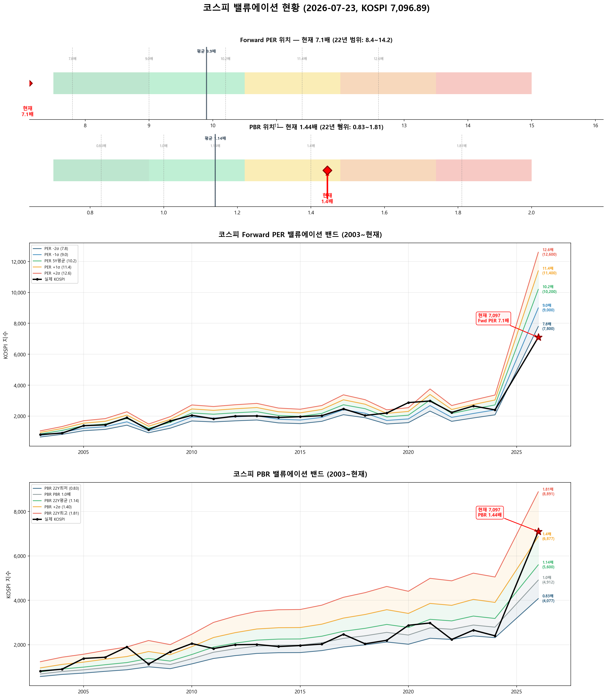

# 📋 MarketTop 일일 종합 (2026-07-23 15:56)

> A4 한 장 요약 — 상세는 각 시장 리포트 참조

---

### 🔵 코스피 7,096.89  —  ↔️ 횡보장 (신뢰도 25%)

| 과열 점수 | 34/100 🔵 저평가 |
|:---:|:---|

**📈 상승 시**

> 상향돌파 목표가 미산출 — 상세 리포트 참고

**📉 하락 시**

| 1차 방어선 | **6,884** (-3%) → 30% 손절 |
|:---:|:---|
| 핵심 하락감지 | ADX20+ + MACD데드 + RSI65+ (승률 70%) |
| 강력 매도 | 전체 4개+ 전략 동시 발동 시 → 50% 청산 (검증승률 74%) |

**🛑 손절 단계**

| 단계 | 손절가 | 비중 | 전략 | 승률 |
|:---:|---:|:---:|:---|:---:|
| 1단계 | **6,884** (-3%) | 30% | ADX20+ + MACD데드 + RSI65+ | 70% |
| 2단계 | **6,742** (-5%) | 30% | RSI85반전 + 이격도120(MA70) | 86% |
| 3단계 | **6,529** (-8%) | 40% | CCI170반전 + 이격도115(MA25) | 78% |

**🎯 방향성 종합**: 🟢 **상승 우세**

| 방향 | 전략 | 평균 승률 | 예상 변동 |
|:----:|:---:|:--------:|:--------:|
| 🔴 하락(매도) | 4개 | 76.2% | -3.08% |
| 🟢 상승(매수) | 7개 | 75.9% | +2.80% |

**📐 매도 Top1 [ADX20+ + MACD데드 + RSI65+] 20일 수익률 분포**

  • 중앙값: **-2.5%** | 5%분위 -20.7% ~ 95%분위 +2.7%

**📐 매수 Top1 [외국인상위5%매수 + MFI35-] 20일 수익률 분포**

  • 중앙값: **+2.0%** | 5%분위 -3.2% ~ 95%분위 +5.3%

**💰 Kelly 권장 매도비중**

| 지표 | 값 | 의미 |
|:---|---:|:---|
| 평균 Half-Kelly (Top5) | **24%** | 매수 후 매도 신호 시 권장 청산비율 |
| 최대 Half-Kelly | 31% | 가장 강한 전략의 권장 비중 |
| 평균 Sharpe (Top5) | 1.22 | 우수 |
| 2% 이내 임박 전략 수 | 0개 | 신호 발동 임박도 |

---

### 🔴 코스닥 790.28  —  📉 하락장 (신뢰도 100%)

| 과열 점수 | 30/100 🔵 저평가 |
|:---:|:---|

> ✅ **다음 매도 목표 804(+1.7%) 대기**

**📈 상승 시**

| 다음 매도 목표 | **804** (+1.7%) → 이격도102(MA10) + 거래량2.5배+ (승률 88%) |
|:---:|:---|

**📉 하락 시**

| 1차 방어선 | **767** (-3%) → 30% 손절 |
|:---:|:---|
| 핵심 하락감지 | ADX15+ + MACD데드 + RSI68+ (승률 88%) |
| 강력 매도 | 전체 4개+ 전략 동시 발동 시 → 50% 청산 (검증승률 78%) |

**📍 분할매도 단계**

| 단계 | 목표가 | 등락률 | 전략 | 승률 | 틀렸을 때 |
|:---:|---:|:---:|:---|:---:|:---|
| ⚡ 1단계 | **804** | +1.7% | 이격도102(MA10) + 거래량2.5배+ | 88% | 평균+3% |
| ⏳ 2단계 | **930** | +17.7% | 이격도104(MA35) + CCI200+ + ADX35+ | 71% | 평균+8% |
| ⏳ 3단계 | **1,179** | +49.1% | 이격도116(MA65) + CCI160+ + ADX15+ | 89% | 평균+10% |

**🛑 손절 단계**

| 단계 | 손절가 | 비중 | 전략 | 승률 |
|:---:|---:|:---:|:---|:---:|
| 1단계 | **767** (-3%) | 30% | ADX15+ + MACD데드 + RSI68+ | 88% |
| 2단계 | **751** (-5%) | 30% | RSI73반전 + 이격도125(MA120) | 75% |
| 3단계 | **727** (-8%) | 40% | CCI90반전 + 이격도118(MA45) | 71% |

**🎯 방향성 종합**: 🔴 **하락 우세** (1개 임박)

| 방향 | 전략 | 평균 승률 | 예상 변동 |
|:----:|:---:|:--------:|:--------:|
| 🔴 하락(매도) | 10개 | 76.9% | -3.24% |
| 🟢 상승(매수) | 7개 | 89.0% | +8.89% |

**📐 매도 Top1 [이격도102(MA10) + 거래량2.5배+] 20일 수익률 분포**

  • 중앙값: **-3.4%** | 5%분위 -17.3% ~ 95%분위 +1.9%

**📐 매수 Top1 [하향이격도83(MA30) + RSI25- + Stoch5-] 20일 수익률 분포**

  • 중앙값: **+9.0%** | 5%분위 +3.6% ~ 95%분위 +50.7%

**💰 Kelly 권장 매도비중**

| 지표 | 값 | 의미 |
|:---|---:|:---|
| 평균 Half-Kelly (Top5) | **35%** | 매수 후 매도 신호 시 권장 청산비율 |
| 최대 Half-Kelly | 41% | 가장 강한 전략의 권장 비중 |
| 평균 Sharpe (Top5) | 2.36 | 우수 |
| 2% 이내 임박 전략 수 | 1개 | 신호 발동 임박도 |

---

### 📊 코스피 밸류에이션

| 지표 | 현재 | 22Y평균 | 판단 |
|:---:|:---:|:---:|:---|
| **Fwd PER** | **7.1배** | 9.9배 | 극저평가 🟢🟢 |
| **PBR** | **1.44배** | 1.14배 | 고평가 🟡 |
| Fwd EPS | 1000 | - | BPS 4912 |

| PER 밴드 | 적정지수 | 괴리 |
|:---:|---:|:---:|
| -2σ (7.8) | 7,800 | +9.9% |
| -1σ (9.0) | 9,000 | +26.8% |
| 5Y평균 (10.2) | 10,200 | +43.7% |
| +1σ (11.4) | 11,400 | +60.6% |
| +2σ (12.6) | 12,600 | +77.5% |

---

### � 코스피 향후 60일 등락 위험 분석

> 💡 과거 30년간 지금과 비슷했던 상황(이격도 91%, 2개월 상승률 +10%) **662번** 발생
> → 그때 이후 2개월간 실제로 얼마나 올랐고 빠졌는지 통계

**📈 상승 가능성:**

| 항목 | 결과 | 해석 |
|:---|:---:|:---|
| **2개월 내 평균 최대상승폭** | **+6.2%** | 중위값 +4.6% |
| 역대 최고 사례 | +69.5% | 지수 12,029 |

| 상승폭 | 발생 확률 | 그때 지수 |
|:---|:---:|---:|
| +5% 이상 상승 | **47%** | 7,452 |
| +10% 이상 상승 | **17%** | 7,807 |
| +15% 이상 상승 | **9%** | 8,161 |
| +20% 이상 상승 | **5%** | 8,516 |

**📉 하락 위험:** 🟡 보통

| 항목 | 결과 | 해석 |
|:---|:---:|:---|
| **2개월 내 평균 최대낙폭** | **-6.1%** | 중위값 -4.2% |
| 역대 최악의 경우 | -38.3% | 지수 4,381 |
| 평소보다 위험한 정도 | 1.1배 | 평소와 비슷한 수준 |

**2개월 내 하락 확률과 예상 지수:**

| 하락폭 | 발생 확률 | 그때 지수 |
|:---|:---:|---:|
| -5% 이상 하락 | **45%** | 6,742 |
| -10% 이상 하락 | **21%** | 6,387 |
| -15% 이상 하락 | **9%** | 6,032 |
| -20% 이상 하락 | **5%** | 5,678 |

**💡 확률 기반 판단:**

> 📌 뚜렷한 방향성 없음. 현재 비중 유지하며 추이 관망

---

### 🔮 코스피 과거 유사 패턴 분석

> 💡 현재와 가격 움직임 + 기술적 지표가 비슷했던 과거 **20개 시점** 발견 (평균 유사도 69%)
> → 그 시점 이후 40일간 실제로 어떻게 움직였는지 통계

**📊 유사 패턴 이후 40일간 등락 범위:**

| 구분 | 평균 | 중위값 | 지수 환산 |
|:---|:---:|:---:|---:|
| 📈 최대 상승폭 | **+6.0%** | +3.9% | 7,370 |
| 📉 최대 하락폭 | **-8.2%** | -5.2% | 6,729 |
| 🚀 최고 사례 | +22.7% | - | 8,707 |
| 💥 최악 사례 | -29.2% | - | 5,023 |

**🔄 반전 패턴:**

| 패턴 | 평균 크기 | 해석 |
|:---|:---:|:---|
| 고점 찍고 반락 | **-12.6%** | 상승 후 평균 이만큼 되돌림 |
| 저점 찍고 반등 | **+11.2%** | 하락 후 평균 이만큼 회복 |

**⏰ 시간대별 상승 확률:**

| 기간 | 상승 확률 | 평균 수익률 | 예상 지수 |
|:---|:---:|:---:|---:|
| 10일 후 | **45%** | -1.2% | 7,011 |
| 20일 후 | **50%** | -1.4% | 7,001 |
| 40일 후 | **45%** | -0.6% | 7,056 |

**📈 대표 경로 (중위값):**

| 시점 | 낙관(상위25%) | 중립(중위) | 비관(하위25%) | 중립 지수 |
|:---|:---:|:---:|:---:|---:|
| 5일 후 | +1.8% | -0.5% | -2.8% | 7,065 |
| 10일 후 | +2.8% | -0.4% | -1.5% | 7,069 |
| 20일 후 | +2.5% | +0.2% | -5.7% | 7,109 |
| 30일 후 | +3.7% | -1.8% | -5.2% | 6,969 |
| 40일 후 | +5.0% | -0.4% | -7.2% | 7,069 |

**📅 가장 유사했던 과거 시점 (최근 5개):**

- **2022-09-20** (유사도 71%) — 지수 2,368 → 40일간 최대+4.9%, 최대-9.0%, 최종+3.2%
- **2021-10-21** (유사도 67%) — 지수 3,007 → 40일간 최대+1.4%, 최대-5.6%, 최종-0.0%
- **2020-03-04** (유사도 69%) — 지수 2,059 → 40일간 최대+1.3%, 최대-29.2%, 최종-8.0%
- **2019-01-08** (유사도 69%) — 지수 2,025 → 40일간 최대+10.3%, 최대0.0%, 최종+5.6%
- **2017-12-15** (유사도 66%) — 지수 2,482 → 40일간 최대+4.7%, 최대-4.8%, 최종-1.6%

### 🔮 코스닥 과거 유사 패턴 분석

> 💡 현재와 가격 움직임 + 기술적 지표가 비슷했던 과거 **8개 시점** 발견 (평균 유사도 67%)
> → 그 시점 이후 40일간 실제로 어떻게 움직였는지 통계

**📊 유사 패턴 이후 40일간 등락 범위:**

| 구분 | 평균 | 중위값 | 지수 환산 |
|:---|:---:|:---:|---:|
| 📈 최대 상승폭 | **+5.7%** | +4.1% | 823 |
| 📉 최대 하락폭 | **-7.2%** | -6.5% | 739 |
| 🚀 최고 사례 | +12.4% | - | 888 |
| 💥 최악 사례 | -16.4% | - | 661 |

**🔄 반전 패턴:**

| 패턴 | 평균 크기 | 해석 |
|:---|:---:|:---|
| 고점 찍고 반락 | **-11.7%** | 상승 후 평균 이만큼 되돌림 |
| 저점 찍고 반등 | **+8.9%** | 하락 후 평균 이만큼 회복 |

**⏰ 시간대별 상승 확률:**

| 기간 | 상승 확률 | 평균 수익률 | 예상 지수 |
|:---|:---:|:---:|---:|
| 10일 후 | **50%** | -1.2% | 781 |
| 20일 후 | **62%** | -1.6% | 778 |
| 40일 후 | **50%** | +0.2% | 792 |

**📈 대표 경로 (중위값):**

| 시점 | 낙관(상위25%) | 중립(중위) | 비관(하위25%) | 중립 지수 |
|:---|:---:|:---:|:---:|---:|
| 5일 후 | -0.3% | -0.6% | -1.5% | 785 |
| 10일 후 | +0.4% | -0.9% | -3.0% | 783 |
| 20일 후 | +1.5% | +0.2% | -4.0% | 792 |
| 30일 후 | +5.6% | -1.0% | -6.7% | 782 |
| 40일 후 | +5.2% | -0.8% | -5.5% | 784 |

**📅 가장 유사했던 과거 시점 (최근 5개):**

- **2022-09-06** (유사도 70%) — 지수 779 → 40일간 최대+2.2%, 최대-16.4%, 최종-10.1%
- **2018-12-19** (유사도 66%) — 지수 672 → 40일간 최대+11.7%, 최대-2.2%, 최종+11.2%
- **2013-10-11** (유사도 67%) — 지수 533 → 40일간 최대+1.0%, 최대-5.9%, 최종-4.9%
- **2011-05-02** (유사도 70%) — 지수 517 → 40일간 최대+0.0%, 최대-11.5%, 최종-7.2%
- **2009-11-11** (유사도 66%) — 지수 486 → 40일간 최대+11.3%, 최대-7.0%, 최종+11.3%

---

### 📎 상세 리포트

- 코스피: [코스피_고점판독리포트_20260723_155458.md](코스피_고점판독리포트_20260723_155458.md)
- 코스닥: [코스닥_고점판독리포트_20260723_155632.md](코스닥_고점판독리포트_20260723_155632.md)

---

*본 리포트는 백테스트 기반 참고용이며, 투자 판단의 최종 책임은 투자자 본인에게 있습니다.*