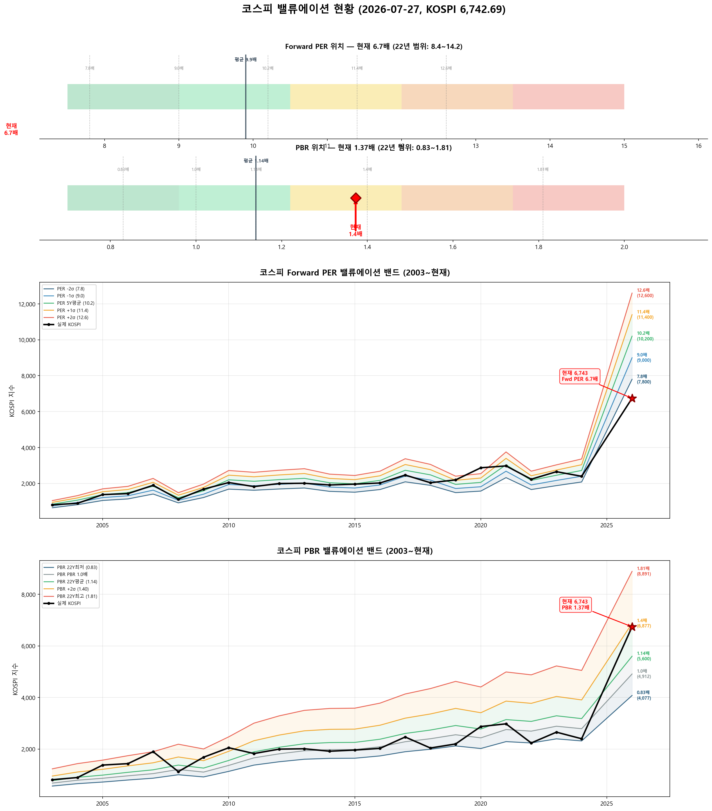

# 📋 MarketTop 일일 종합 (2026-07-27 14:51)

> A4 한 장 요약 — 상세는 각 시장 리포트 참조

---

### 🔵 코스피 6,742.69  —  ↔️ 횡보장 (신뢰도 25%)

| 과열 점수 | 23/100 🔵 저평가 |
|:---:|:---|

**📈 상승 시**

> 상향돌파 목표가 미산출 — 상세 리포트 참고

**📉 하락 시**

| 1차 방어선 | **6,540** (-3%) → 30% 손절 |
|:---:|:---|
| 핵심 하락감지 | ADX20+ + MACD데드 + RSI65+ (승률 70%) |
| 강력 매도 | 전체 4개+ 전략 동시 발동 시 → 50% 청산 (검증승률 74%) |

**🛑 손절 단계**

| 단계 | 손절가 | 비중 | 전략 | 승률 |
|:---:|---:|:---:|:---|:---:|
| 1단계 | **6,540** (-3%) | 30% | ADX20+ + MACD데드 + RSI65+ | 70% |
| 2단계 | **6,406** (-5%) | 30% | RSI85반전 + 이격도120(MA70) | 86% |
| 3단계 | **6,203** (-8%) | 40% | CCI170반전 + 이격도115(MA25) | 78% |

**🎯 방향성 종합**: 🟢 **상승 우세**

| 방향 | 전략 | 평균 승률 | 예상 변동 |
|:----:|:---:|:--------:|:--------:|
| 🔴 하락(매도) | 4개 | 76.2% | -3.08% |
| 🟢 상승(매수) | 7개 | 75.9% | +2.80% |

**📐 매도 Top1 [ADX20+ + MACD데드 + RSI65+] 20일 수익률 분포**

  • 중앙값: **-2.5%** | 5%분위 -20.7% ~ 95%분위 +2.7%

**📐 매수 Top1 [외국인상위5%매수 + MFI35-] 20일 수익률 분포**

  • 중앙값: **+2.0%** | 5%분위 -3.2% ~ 95%분위 +5.3%

**💰 Kelly 권장 매도비중**

| 지표 | 값 | 의미 |
|:---|---:|:---|
| 평균 Half-Kelly (Top5) | **24%** | 매수 후 매도 신호 시 권장 청산비율 |
| 최대 Half-Kelly | 31% | 가장 강한 전략의 권장 비중 |
| 평균 Sharpe (Top5) | 1.22 | 우수 |
| 2% 이내 임박 전략 수 | 0개 | 신호 발동 임박도 |

---

### 🔴 코스닥 765.67  —  📉 하락장 (신뢰도 100%)

| 과열 점수 | 27/100 🔵 저평가 |
|:---:|:---|

> ✅ **다음 매도 목표 792(+3.4%) 대기**

**📈 상승 시**

| 다음 매도 목표 | **792** (+3.4%) → 이격도102(MA10) + 거래량2.5배+ (승률 88%) |
|:---:|:---|

**📉 하락 시**

| 1차 방어선 | **743** (-3%) → 30% 손절 |
|:---:|:---|
| 핵심 하락감지 | ADX15+ + MACD데드 + RSI68+ (승률 88%) |
| 강력 매도 | 전체 4개+ 전략 동시 발동 시 → 50% 청산 (검증승률 78%) |

**📍 분할매도 단계**

| 단계 | 목표가 | 등락률 | 전략 | 승률 | 틀렸을 때 |
|:---:|---:|:---:|:---|:---:|:---|
| 🎯 1단계 | **792** | +3.4% | 이격도102(MA10) + 거래량2.5배+ | 88% | 평균+3% |
| ⏳ 2단계 | **914** | +19.4% | 이격도104(MA35) + CCI200+ + ADX35+ | 71% | 평균+8% |
| ⏳ 3단계 | **1,164** | +52.0% | 이격도116(MA65) + CCI160+ + ADX15+ | 89% | 평균+10% |

**🛑 손절 단계**

| 단계 | 손절가 | 비중 | 전략 | 승률 |
|:---:|---:|:---:|:---|:---:|
| 1단계 | **743** (-3%) | 30% | ADX15+ + MACD데드 + RSI68+ | 88% |
| 2단계 | **727** (-5%) | 30% | RSI73반전 + 이격도125(MA120) | 75% |
| 3단계 | **704** (-8%) | 40% | CCI90반전 + 이격도118(MA45) | 71% |

**🎯 방향성 종합**: 🔴 **하락 우세** (1개 임박)

| 방향 | 전략 | 평균 승률 | 예상 변동 |
|:----:|:---:|:--------:|:--------:|
| 🔴 하락(매도) | 10개 | 76.9% | -3.24% |
| 🟢 상승(매수) | 7개 | 89.0% | +8.89% |

**📐 매도 Top1 [이격도102(MA10) + 거래량2.5배+] 20일 수익률 분포**

  • 중앙값: **-3.4%** | 5%분위 -17.3% ~ 95%분위 +1.9%

**📐 매수 Top1 [하향이격도83(MA30) + RSI25- + Stoch5-] 20일 수익률 분포**

  • 중앙값: **+9.0%** | 5%분위 +3.6% ~ 95%분위 +50.7%

**💰 Kelly 권장 매도비중**

| 지표 | 값 | 의미 |
|:---|---:|:---|
| 평균 Half-Kelly (Top5) | **35%** | 매수 후 매도 신호 시 권장 청산비율 |
| 최대 Half-Kelly | 41% | 가장 강한 전략의 권장 비중 |
| 평균 Sharpe (Top5) | 2.36 | 우수 |
| 2% 이내 임박 전략 수 | 0개 | 신호 발동 임박도 |

---

### 📊 코스피 밸류에이션

| 지표 | 현재 | 22Y평균 | 판단 |
|:---:|:---:|:---:|:---|
| **Fwd PER** | **6.7배** | 9.9배 | 극저평가 🟢🟢 |
| **PBR** | **1.37배** | 1.14배 | 고평가 🟡 |
| Fwd EPS | 1000 | - | BPS 4912 |

| PER 밴드 | 적정지수 | 괴리 |
|:---:|---:|:---:|
| -2σ (7.8) | 7,800 | +15.7% |
| -1σ (9.0) | 9,000 | +33.5% |
| 5Y평균 (10.2) | 10,200 | +51.3% |
| +1σ (11.4) | 11,400 | +69.1% |
| +2σ (12.6) | 12,600 | +86.9% |

---

### 🔮 코스피 과거 유사 패턴 분석

> 💡 현재와 가격 움직임 + 기술적 지표가 비슷했던 과거 **17개 시점** 발견 (평균 유사도 70%)
> → 그 시점 이후 40일간 실제로 어떻게 움직였는지 통계

**📊 유사 패턴 이후 40일간 등락 범위:**

| 구분 | 평균 | 중위값 | 지수 환산 |
|:---|:---:|:---:|---:|
| 📈 최대 상승폭 | **+6.5%** | +5.8% | 7,133 |
| 📉 최대 하락폭 | **-7.8%** | -3.9% | 6,481 |
| 🚀 최고 사례 | +28.0% | - | 8,632 |
| 💥 최악 사례 | -22.1% | - | 5,254 |

**🔄 반전 패턴:**

| 패턴 | 평균 크기 | 해석 |
|:---|:---:|:---|
| 고점 찍고 반락 | **-11.3%** | 상승 후 평균 이만큼 되돌림 |
| 저점 찍고 반등 | **+11.3%** | 하락 후 평균 이만큼 회복 |

**⏰ 시간대별 상승 확률:**

| 기간 | 상승 확률 | 평균 수익률 | 예상 지수 |
|:---|:---:|:---:|---:|
| 10일 후 | **41%** | -0.8% | 6,692 |
| 20일 후 | **53%** | -1.2% | 6,663 |
| 40일 후 | **71%** | +1.3% | 6,829 |

**📈 대표 경로 (중위값):**

| 시점 | 낙관(상위25%) | 중립(중위) | 비관(하위25%) | 중립 지수 |
|:---|:---:|:---:|:---:|---:|
| 5일 후 | +2.1% | +0.1% | -2.7% | 6,747 |
| 10일 후 | +1.8% | -0.4% | -3.1% | 6,713 |
| 20일 후 | +4.4% | +0.0% | -6.1% | 6,744 |
| 30일 후 | +5.7% | +0.9% | -6.5% | 6,803 |
| 40일 후 | +6.3% | +3.7% | -8.0% | 6,995 |

**📅 가장 유사했던 과거 시점 (최근 5개):**

- **2022-09-22** (유사도 75%) — 지수 2,332 → 40일간 최대+6.5%, 최대-7.6%, 최종+3.7%
- **2022-06-30** (유사도 67%) — 지수 2,333 → 40일간 최대+8.6%, 최대-1.7%, 최종+6.4%
- **2019-07-25** (유사도 69%) — 지수 2,074 → 40일간 최대+1.3%, 최대-7.9%, 최종+1.3%
- **2017-08-10** (유사도 67%) — 지수 2,359 → 40일간 최대+5.3%, 최대-1.7%, 최종+5.3%
- **2014-06-16** (유사도 70%) — 지수 1,994 → 40일간 최대+4.5%, 최대-1.3%, 최종+2.3%

### 🔮 코스닥 과거 유사 패턴 분석

> 💡 현재와 가격 움직임 + 기술적 지표가 비슷했던 과거 **8개 시점** 발견 (평균 유사도 68%)
> → 그 시점 이후 40일간 실제로 어떻게 움직였는지 통계

**📊 유사 패턴 이후 40일간 등락 범위:**

| 구분 | 평균 | 중위값 | 지수 환산 |
|:---|:---:|:---:|---:|
| 📈 최대 상승폭 | **+4.8%** | +3.8% | 795 |
| 📉 최대 하락폭 | **-9.6%** | -8.8% | 699 |
| 🚀 최고 사례 | +18.2% | - | 905 |
| 💥 최악 사례 | -18.3% | - | 626 |

**🔄 반전 패턴:**

| 패턴 | 평균 크기 | 해석 |
|:---|:---:|:---|
| 고점 찍고 반락 | **-13.7%** | 상승 후 평균 이만큼 되돌림 |
| 저점 찍고 반등 | **+9.0%** | 하락 후 평균 이만큼 회복 |

**⏰ 시간대별 상승 확률:**

| 기간 | 상승 확률 | 평균 수익률 | 예상 지수 |
|:---|:---:|:---:|---:|
| 10일 후 | **62%** | -2.1% | 750 |
| 20일 후 | **38%** | -2.7% | 745 |
| 40일 후 | **25%** | -2.5% | 747 |

**📈 대표 경로 (중위값):**

| 시점 | 낙관(상위25%) | 중립(중위) | 비관(하위25%) | 중립 지수 |
|:---|:---:|:---:|:---:|---:|
| 5일 후 | +1.0% | -0.2% | -1.3% | 764 |
| 10일 후 | +2.2% | +0.6% | -6.3% | 770 |
| 20일 후 | +2.3% | -3.3% | -7.9% | 741 |
| 30일 후 | -3.8% | -8.1% | -10.8% | 703 |
| 40일 후 | -0.9% | -5.2% | -7.0% | 726 |

**📅 가장 유사했던 과거 시점 (최근 5개):**

- **2022-09-08** (유사도 74%) — 지수 778 → 40일간 최대+2.4%, 최대-16.2%, 최종-8.1%
- **2013-10-15** (유사도 69%) — 지수 533 → 40일간 최대+0.9%, 최대-6.6%, 최종-6.6%
- **2011-05-04** (유사도 71%) — 지수 511 → 40일간 최대+0.0%, 최대-10.4%, 최종-4.2%
- **2008-01-29** (유사도 69%) — 지수 633 → 40일간 최대+4.4%, 최대-5.1%, 최종+0.6%
- **2005-05-04** (유사도 65%) — 지수 429 → 40일간 최대+18.2%, 최대-0.9%, 최종+18.2%

---

### 📎 상세 리포트

- 코스피: [코스피_고점판독리포트_20260727_144831.md](코스피_고점판독리포트_20260727_144831.md)
- 코스닥: [코스닥_고점판독리포트_20260727_145142.md](코스닥_고점판독리포트_20260727_145142.md)

---

*본 리포트는 백테스트 기반 참고용이며, 투자 판단의 최종 책임은 투자자 본인에게 있습니다.*