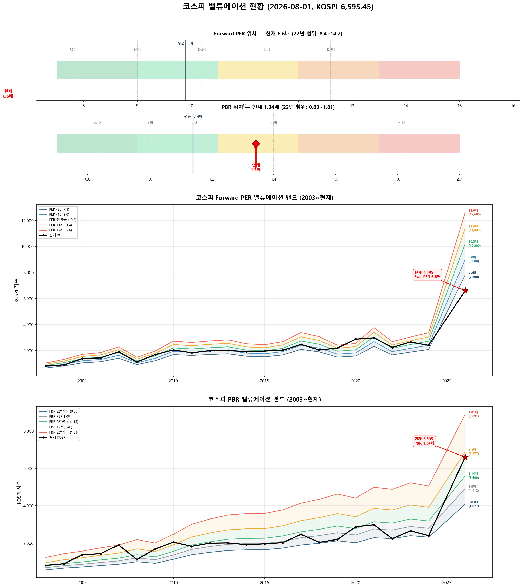

# 📋 MarketTop 일일 종합 (2026-08-01 12:29)

> A4 한 장 요약 — 상세는 각 시장 리포트 참조

---

### 🔴 코스피 6,595.45  —  📉 하락장 (신뢰도 100%)

| 과열 점수 | 36/100 🔵 저평가 |
|:---:|:---|

**📈 상승 시**

> 상향돌파 목표가 미산출 — 상세 리포트 참고

**📉 하락 시**

| 1차 방어선 | **6,398** (-3%) → 30% 손절 |
|:---:|:---|
| 핵심 하락감지 | ADX20+ + MACD데드 + RSI65+ (승률 70%) |
| 강력 매도 | 전체 4개+ 전략 동시 발동 시 → 50% 청산 (검증승률 74%) |

**🛑 손절 단계**

| 단계 | 손절가 | 비중 | 전략 | 승률 |
|:---:|---:|:---:|:---|:---:|
| 1단계 | **6,398** (-3%) | 30% | ADX20+ + MACD데드 + RSI65+ | 70% |
| 2단계 | **6,266** (-5%) | 30% | RSI85반전 + 이격도120(MA70) | 86% |
| 3단계 | **6,068** (-8%) | 40% | CCI170반전 + 이격도115(MA25) | 78% |

**🎯 방향성 종합**: 🟢 **상승 우세**

| 방향 | 전략 | 평균 승률 | 예상 변동 |
|:----:|:---:|:--------:|:--------:|
| 🔴 하락(매도) | 4개 | 76.2% | -3.08% |
| 🟢 상승(매수) | 7개 | 79.8% | +4.84% |

**📐 매도 Top1 [ADX20+ + MACD데드 + RSI65+] 20일 수익률 분포**

  • 중앙값: **-2.5%** | 5%분위 -20.7% ~ 95%분위 +2.7%

**📐 매수 Top1 [하향이격도89(MA95) + RSI15- + Stoch5-] 20일 수익률 분포**

  • 중앙값: **+3.7%** | 5%분위 +2.1% ~ 95%분위 +23.9%

**💰 Kelly 권장 매도비중**

| 지표 | 값 | 의미 |
|:---|---:|:---|
| 평균 Half-Kelly (Top5) | **24%** | 매수 후 매도 신호 시 권장 청산비율 |
| 최대 Half-Kelly | 31% | 가장 강한 전략의 권장 비중 |
| 평균 Sharpe (Top5) | 1.22 | 우수 |
| 2% 이내 임박 전략 수 | 0개 | 신호 발동 임박도 |

---

### 🔴 코스닥 719.76  —  📉 하락장 (신뢰도 100%)

| 과열 점수 | 26/100 🔵 저평가 |
|:---:|:---|

> ✅ **다음 매도 목표 744(+3.3%) 대기**

**📈 상승 시**

| 다음 매도 목표 | **744** (+3.3%) → 이격도102(MA10) + 거래량2.5배+ (승률 88%) |
|:---:|:---|

**📉 하락 시**

| 1차 방어선 | **698** (-3%) → 30% 손절 |
|:---:|:---|
| 핵심 하락감지 | ADX15+ + MACD데드 + RSI68+ (승률 88%) |
| 강력 매도 | 전체 4개+ 전략 동시 발동 시 → 50% 청산 (검증승률 78%) |

**📍 분할매도 단계**

| 단계 | 목표가 | 등락률 | 전략 | 승률 | 틀렸을 때 |
|:---:|---:|:---:|:---|:---:|:---|
| 🎯 1단계 | **744** | +3.3% | 이격도102(MA10) + 거래량2.5배+ | 88% | 평균+3% |
| ⏳ 2단계 | **882** | +22.5% | 이격도104(MA35) + CCI200+ + ADX35+ | 71% | 평균+8% |
| ⏳ 3단계 | **1,128** | +56.7% | 이격도116(MA65) + CCI160+ + ADX15+ | 89% | 평균+10% |

**🛑 손절 단계**

| 단계 | 손절가 | 비중 | 전략 | 승률 |
|:---:|---:|:---:|:---|:---:|
| 1단계 | **698** (-3%) | 30% | ADX15+ + MACD데드 + RSI68+ | 88% |
| 2단계 | **684** (-5%) | 30% | RSI73반전 + 이격도125(MA120) | 75% |
| 3단계 | **662** (-8%) | 40% | CCI90반전 + 이격도118(MA45) | 71% |

**🎯 방향성 종합**: 🔴 **하락 우세** (1개 임박)

| 방향 | 전략 | 평균 승률 | 예상 변동 |
|:----:|:---:|:--------:|:--------:|
| 🔴 하락(매도) | 10개 | 76.9% | -3.24% |
| 🟢 상승(매수) | 7개 | 89.0% | +8.89% |

**📐 매도 Top1 [이격도102(MA10) + 거래량2.5배+] 20일 수익률 분포**

  • 중앙값: **-3.4%** | 5%분위 -17.3% ~ 95%분위 +1.9%

**📐 매수 Top1 [하향이격도83(MA30) + RSI25- + Stoch5-] 20일 수익률 분포**

  • 중앙값: **+9.0%** | 5%분위 +3.6% ~ 95%분위 +50.7%

**💰 Kelly 권장 매도비중**

| 지표 | 값 | 의미 |
|:---|---:|:---|
| 평균 Half-Kelly (Top5) | **35%** | 매수 후 매도 신호 시 권장 청산비율 |
| 최대 Half-Kelly | 41% | 가장 강한 전략의 권장 비중 |
| 평균 Sharpe (Top5) | 2.36 | 우수 |
| 2% 이내 임박 전략 수 | 0개 | 신호 발동 임박도 |

---

### 📊 코스피 밸류에이션

| 지표 | 현재 | 22Y평균 | 판단 |
|:---:|:---:|:---:|:---|
| **Fwd PER** | **6.6배** | 9.9배 | 극저평가 🟢🟢 |
| **PBR** | **1.34배** | 1.14배 | 고평가 🟡 |
| Fwd EPS | 1000 | - | BPS 4912 |

| PER 밴드 | 적정지수 | 괴리 |
|:---:|---:|:---:|
| -2σ (7.8) | 7,800 | +18.3% |
| -1σ (9.0) | 9,000 | +36.5% |
| 5Y평균 (10.2) | 10,200 | +54.7% |
| +1σ (11.4) | 11,400 | +72.8% |
| +2σ (12.6) | 12,600 | +91.0% |

---

### 📊 코스피 향후 60일 등락 위험 분석

> 💡 과거 30년간 지금과 비슷했던 상황(이격도 85%, 2개월 상승률 -5%) **111번** 발생
> → 그때 이후 2개월간 실제로 얼마나 올랐고 빠졌는지 통계

**📈 상승 가능성:**

| 항목 | 결과 | 해석 |
|:---|:---:|:---|
| **2개월 내 평균 최대상승폭** | **+9.5%** | 중위값 +8.1% |
| 역대 최고 사례 | +40.9% | 지수 9,294 |

| 상승폭 | 발생 확률 | 그때 지수 |
|:---|:---:|---:|
| +5% 이상 상승 | **74%** | 6,925 |
| +10% 이상 상승 | **34%** | 7,255 |
| +15% 이상 상승 | **13%** | 7,585 |
| +20% 이상 상승 | **10%** | 7,915 |

**📉 하락 위험:** 🟠 주의

| 항목 | 결과 | 해석 |
|:---|:---:|:---|
| **2개월 내 평균 최대낙폭** | **-11.7%** | 중위값 -9.5% |
| 역대 최악의 경우 | -46.5% | 지수 3,527 |
| ⚠️ 평소보다 위험한 정도 | **2.0배** | 평소보다 2.0배 더 빠질 수 있음 |

**2개월 내 하락 확률과 예상 지수:**

| 하락폭 | 발생 확률 | 그때 지수 |
|:---|:---:|---:|
| -5% 이상 하락 | **65%** | 6,266 |
| -10% 이상 하락 | **48%** | 5,936 |
| -15% 이상 하락 | **25%** | 5,606 |
| -20% 이상 하락 | **20%** | 5,276 |

**💡 확률 기반 판단:**

> 과거 유사 상황에서 **+5%까지 상승할 확률이 50% 이상**이었고,
> 동시에 **-5%까지 하락할 확률도 50% 이상**이었습니다.
>
> 📌 **하락 기대값(7.6)이 상승 기대값(7.0)보다 큽니다 (1.1배)**.
> **비중 축소 우선**. 보유 시 **6,266**(-5%) 반드시 손절, 목표 **6,925**(+5%)

### 📊 코스닥 향후 60일 등락 위험 분석

> 💡 과거 30년간 지금과 비슷했던 상황(이격도 76%, 2개월 상승률 -41%) **44번** 발생
> → 그때 이후 2개월간 실제로 얼마나 올랐고 빠졌는지 통계

**📈 상승 가능성:**

| 항목 | 결과 | 해석 |
|:---|:---:|:---|
| **2개월 내 평균 최대상승폭** | **+27.7%** | 중위값 +26.9% |
| 역대 최고 사례 | +54.9% | 지수 1,115 |

| 상승폭 | 발생 확률 | 그때 지수 |
|:---|:---:|---:|
| +5% 이상 상승 | **91%** | 756 |
| +10% 이상 상승 | **77%** | 792 |
| +15% 이상 상승 | **68%** | 828 |
| +20% 이상 상승 | **59%** | 864 |

**📉 하락 위험:** 🟠 주의

| 항목 | 결과 | 해석 |
|:---|:---:|:---|
| **2개월 내 평균 최대낙폭** | **-11.7%** | 중위값 -10.8% |
| 역대 최악의 경우 | -40.5% | 지수 428 |
| ⚠️ 평소보다 위험한 정도 | **1.3배** | 평소보다 1.3배 더 빠질 수 있음 |

**2개월 내 하락 확률과 예상 지수:**

| 하락폭 | 발생 확률 | 그때 지수 |
|:---|:---:|---:|
| -5% 이상 하락 | **59%** | 684 |
| -10% 이상 하락 | **52%** | 648 |
| -15% 이상 하락 | **39%** | 612 |
| -20% 이상 하락 | **25%** | 576 |

**💡 확률 기반 판단:**

> 과거 유사 상황에서 **+20%까지 상승할 확률이 50% 이상**이었고,
> 동시에 **-10%까지 하락할 확률도 50% 이상**이었습니다.
>
> 📌 **상승 기대값(25.2)이 하락 기대값(6.9)보다 크므로 (3.6배)**,
> **864**(+20%)까지 보유 후 익절하되, **648**(-10%) 이탈 시 손절이 합리적

---

### 🔮 코스피 과거 유사 패턴 분석

> 💡 현재와 가격 움직임 + 기술적 지표가 비슷했던 과거 **20개 시점** 발견 (평균 유사도 70%)
> → 그 시점 이후 40일간 실제로 어떻게 움직였는지 통계

**📊 유사 패턴 이후 40일간 등락 범위:**

| 구분 | 평균 | 중위값 | 지수 환산 |
|:---|:---:|:---:|---:|
| 📈 최대 상승폭 | **+9.5%** | +5.4% | 6,949 |
| 📉 최대 하락폭 | **-9.9%** | -5.3% | 6,243 |
| 🚀 최고 사례 | +44.9% | - | 9,554 |
| 💥 최악 사례 | -41.7% | - | 3,846 |

**🔄 반전 패턴:**

| 패턴 | 평균 크기 | 해석 |
|:---|:---:|:---|
| 고점 찍고 반락 | **-20.4%** | 상승 후 평균 이만큼 되돌림 |
| 저점 찍고 반등 | **+15.9%** | 하락 후 평균 이만큼 회복 |

**⏰ 시간대별 상승 확률:**

| 기간 | 상승 확률 | 평균 수익률 | 예상 지수 |
|:---|:---:|:---:|---:|
| 10일 후 | **70%** | +1.5% | 6,694 |
| 20일 후 | **70%** | +1.0% | 6,660 |
| 40일 후 | **55%** | -0.3% | 6,578 |

**📈 대표 경로 (중위값):**

| 시점 | 낙관(상위25%) | 중립(중위) | 비관(하위25%) | 중립 지수 |
|:---|:---:|:---:|:---:|---:|
| 5일 후 | +1.9% | +1.0% | -0.3% | 6,661 |
| 10일 후 | +3.2% | +1.7% | -1.4% | 6,710 |
| 20일 후 | +4.0% | +1.5% | -1.9% | 6,693 |
| 30일 후 | +7.9% | +0.0% | -4.2% | 6,599 |
| 40일 후 | +7.5% | +1.4% | -6.0% | 6,688 |

**📅 가장 유사했던 과거 시점 (최근 5개):**

- **2025-04-10** (유사도 71%) — 지수 2,445 → 40일간 최대+19.4%, 최대-0.5%, 최종+19.4%
- **2019-04-01** (유사도 67%) — 지수 2,168 → 40일간 최대+3.7%, 최대-6.7%, 최종-6.7%
- **2017-08-17** (유사도 66%) — 지수 2,362 → 40일간 최대+5.4%, 최대-1.8%, 최종+5.4%
- **2017-04-13** (유사도 70%) — 지수 2,149 → 40일간 최대+10.8%, 최대-0.6%, 최종+9.9%
- **2015-08-26** (유사도 73%) — 지수 1,894 → 40일간 최대+8.1%, 최대-0.8%, 최종+8.1%

### 🔮 코스닥 과거 유사 패턴 분석

> 💡 현재와 가격 움직임 + 기술적 지표가 비슷했던 과거 **17개 시점** 발견 (평균 유사도 68%)
> → 그 시점 이후 40일간 실제로 어떻게 움직였는지 통계

**📊 유사 패턴 이후 40일간 등락 범위:**

| 구분 | 평균 | 중위값 | 지수 환산 |
|:---|:---:|:---:|---:|
| 📈 최대 상승폭 | **+7.7%** | +7.6% | 775 |
| 📉 최대 하락폭 | **-9.6%** | -6.7% | 671 |
| 🚀 최고 사례 | +17.3% | - | 844 |
| 💥 최악 사례 | -40.4% | - | 429 |

**🔄 반전 패턴:**

| 패턴 | 평균 크기 | 해석 |
|:---|:---:|:---|
| 고점 찍고 반락 | **-15.2%** | 상승 후 평균 이만큼 되돌림 |
| 저점 찍고 반등 | **+13.0%** | 하락 후 평균 이만큼 회복 |

**⏰ 시간대별 상승 확률:**

| 기간 | 상승 확률 | 평균 수익률 | 예상 지수 |
|:---|:---:|:---:|---:|
| 10일 후 | **76%** | +0.6% | 724 |
| 20일 후 | **59%** | +1.5% | 730 |
| 40일 후 | **53%** | -0.4% | 717 |

**📈 대표 경로 (중위값):**

| 시점 | 낙관(상위25%) | 중립(중위) | 비관(하위25%) | 중립 지수 |
|:---|:---:|:---:|:---:|---:|
| 5일 후 | +3.7% | +1.4% | -0.4% | 730 |
| 10일 후 | +5.0% | +2.5% | +0.6% | 737 |
| 20일 후 | +5.1% | +3.5% | -3.7% | 745 |
| 30일 후 | +7.2% | -3.0% | -4.6% | 698 |
| 40일 후 | +9.1% | +1.7% | -8.1% | 732 |

**📅 가장 유사했던 과거 시점 (최근 5개):**

- **2025-04-01** (유사도 70%) — 지수 691 → 40일간 최대+6.9%, 최대-7.0%, 최종+6.2%
- **2023-10-24** (유사도 65%) — 지수 785 → 40일간 최대+9.4%, 최대-6.2%, 최종+9.4%
- **2022-01-28** (유사도 66%) — 지수 873 → 40일간 최대+8.2%, 최대-3.8%, 최종+7.8%
- **2019-08-08** (유사도 70%) — 지수 585 → 40일간 최대+10.9%, 최대-0.4%, 최종+8.4%
- **2013-10-21** (유사도 66%) — 지수 529 → 40일간 최대+1.6%, 최대-7.8%, 최종-7.8%

---

### 📎 상세 리포트

- 코스피: [코스피_고점판독리포트_20260801_122734.md](코스피_고점판독리포트_20260801_122734.md)
- 코스닥: [코스닥_고점판독리포트_20260801_122901.md](코스닥_고점판독리포트_20260801_122901.md)

---

*본 리포트는 백테스트 기반 참고용이며, 투자 판단의 최종 책임은 투자자 본인에게 있습니다.*