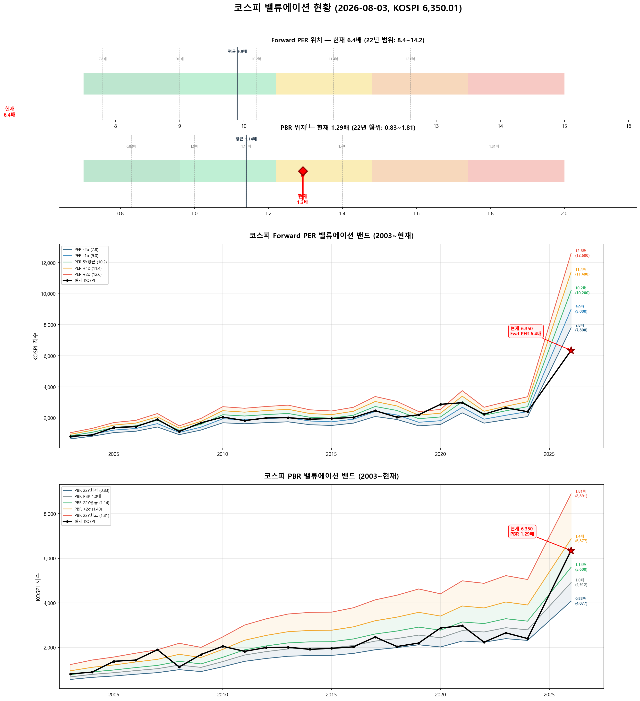

# 📋 MarketTop 일일 종합 (2026-08-03 09:30)

> A4 한 장 요약 — 상세는 각 시장 리포트 참조

---

### 🔴 코스피 6,350.01  —  📉 하락장 (신뢰도 100%)

| 과열 점수 | 35/100 🔵 저평가 |
|:---:|:---|

**📈 상승 시**

| 단계 | 목표가 | 등락률 | 근거 | 확률 |
|:---:|---:|:---:|:---|:---:|
| ▶ 1단계 | **6,718** | +5.8% | 10일내 중위 상승폭 (확률 50%) | 50% |
| ▶ 2단계 | **7,087** | +11.6% | 60일내 중위 상승폭 (확률 50%) | 50% |

> 💡 상향돌파 전략 미선정(하락장 특성상 반전·손절 전략이 우선 선정됨) → 과거 유사 국면의 실제 상승폭 기반 참고 목표

**📉 하락 시**

| 1차 방어선 | **6,160** (-3%) → 30% 손절 |
|:---:|:---|
| 핵심 하락감지 | ADX20+ + MACD데드 + RSI65+ (승률 70%) |
| 강력 매도 | 전체 4개+ 전략 동시 발동 시 → 50% 청산 (검증승률 74%) |

**🛑 손절 단계**

| 단계 | 손절가 | 비중 | 전략 | 승률 |
|:---:|---:|:---:|:---|:---:|
| 1단계 | **6,160** (-3%) | 30% | ADX20+ + MACD데드 + RSI65+ | 70% |
| 2단계 | **6,033** (-5%) | 30% | RSI85반전 + 이격도120(MA70) | 86% |
| 3단계 | **5,842** (-8%) | 40% | CCI170반전 + 이격도115(MA25) | 78% |

**🎯 방향성 종합**: 🟢 **상승 우세**

| 방향 | 전략 | 평균 승률 | 예상 변동 |
|:----:|:---:|:--------:|:--------:|
| 🔴 하락(매도) | 4개 | 76.2% | -3.08% |
| 🟢 상승(매수) | 7개 | 79.8% | +4.84% |

**📐 매도 Top1 [ADX20+ + MACD데드 + RSI65+] 20일 수익률 분포**

  • 중앙값: **-2.5%** | 5%분위 -20.7% ~ 95%분위 +2.7%

**📐 매수 Top1 [하향이격도89(MA95) + RSI15- + Stoch5-] 20일 수익률 분포**

  • 중앙값: **+3.7%** | 5%분위 +2.1% ~ 95%분위 +23.9%

**💰 Kelly 권장 매도비중**

| 지표 | 값 | 의미 |
|:---|---:|:---|
| 평균 Half-Kelly (Top5) | **24%** | 매수 후 매도 신호 시 권장 청산비율 |
| 최대 Half-Kelly | 31% | 가장 강한 전략의 권장 비중 |
| 평균 Sharpe (Top5) | 1.22 | 우수 |
| 2% 이내 임박 전략 수 | 0개 | 신호 발동 임박도 |

---

### 🔴 코스닥 712.01  —  📉 하락장 (신뢰도 100%)

| 과열 점수 | 29/100 🔵 저평가 |
|:---:|:---|

> ✅ **다음 매도 목표 740(+3.9%) 대기**

**📈 상승 시**

| 다음 매도 목표 | **740** (+3.9%) → 이격도102(MA10) + 거래량2.5배+ (승률 88%) |
|:---:|:---|

**📉 하락 시**

| 1차 방어선 | **691** (-3%) → 30% 손절 |
|:---:|:---|
| 핵심 하락감지 | ADX15+ + MACD데드 + RSI68+ (승률 88%) |
| 강력 매도 | 전체 4개+ 전략 동시 발동 시 → 50% 청산 (검증승률 78%) |

**📍 분할매도 단계**

| 단계 | 목표가 | 등락률 | 전략 | 승률 | 틀렸을 때 |
|:---:|---:|:---:|:---|:---:|:---|
| 🎯 1단계 | **740** | +3.9% | 이격도102(MA10) + 거래량2.5배+ | 88% | 평균+3% |
| ⏳ 2단계 | **873** | +22.5% | 이격도104(MA35) + CCI200+ + ADX35+ | 71% | 평균+8% |
| ⏳ 3단계 | **1,119** | +57.1% | 이격도116(MA65) + CCI160+ + ADX15+ | 89% | 평균+10% |

**🛑 손절 단계**

| 단계 | 손절가 | 비중 | 전략 | 승률 |
|:---:|---:|:---:|:---|:---:|
| 1단계 | **691** (-3%) | 30% | ADX15+ + MACD데드 + RSI68+ | 88% |
| 2단계 | **676** (-5%) | 30% | RSI73반전 + 이격도125(MA120) | 75% |
| 3단계 | **655** (-8%) | 40% | CCI90반전 + 이격도118(MA45) | 71% |

**🎯 방향성 종합**: 🔴 **하락 우세** (1개 임박)

| 방향 | 전략 | 평균 승률 | 예상 변동 |
|:----:|:---:|:--------:|:--------:|
| 🔴 하락(매도) | 10개 | 76.9% | -3.24% |
| 🟢 상승(매수) | 7개 | 89.0% | +8.89% |

**📐 매도 Top1 [이격도102(MA10) + 거래량2.5배+] 20일 수익률 분포**

  • 중앙값: **-3.4%** | 5%분위 -17.3% ~ 95%분위 +1.9%

**📐 매수 Top1 [하향이격도83(MA30) + RSI25- + Stoch5-] 20일 수익률 분포**

  • 중앙값: **+9.0%** | 5%분위 +3.6% ~ 95%분위 +50.7%

**💰 Kelly 권장 매도비중**

| 지표 | 값 | 의미 |
|:---|---:|:---|
| 평균 Half-Kelly (Top5) | **35%** | 매수 후 매도 신호 시 권장 청산비율 |
| 최대 Half-Kelly | 41% | 가장 강한 전략의 권장 비중 |
| 평균 Sharpe (Top5) | 2.36 | 우수 |
| 2% 이내 임박 전략 수 | 0개 | 신호 발동 임박도 |

---

### 📊 코스피 밸류에이션

| 지표 | 현재 | 22Y평균 | 판단 |
|:---:|:---:|:---:|:---|
| **Fwd PER** | **6.4배** | 9.9배 | 극저평가 🟢🟢 |
| **PBR** | **1.29배** | 1.14배 | 적정 ⚪ |
| Fwd EPS | 1000 | - | BPS 4912 |

| PER 밴드 | 적정지수 | 괴리 |
|:---:|---:|:---:|
| -2σ (7.8) | 7,800 | +22.8% |
| -1σ (9.0) | 9,000 | +41.7% |
| 5Y평균 (10.2) | 10,200 | +60.6% |
| +1σ (11.4) | 11,400 | +79.5% |
| +2σ (12.6) | 12,600 | +98.4% |

---

### 📊 코스피 향후 60일 등락 위험 분석

> 💡 과거 30년간 지금과 비슷했던 상황(이격도 82%, 2개월 상승률 -14%) **107번** 발생
> → 그때 이후 2개월간 실제로 얼마나 올랐고 빠졌는지 통계

**📈 상승 가능성:**

| 항목 | 결과 | 해석 |
|:---|:---:|:---|
| **2개월 내 평균 최대상승폭** | **+15.0%** | 중위값 +11.6% |
| 역대 최고 사례 | +50.3% | 지수 9,543 |

| 상승폭 | 발생 확률 | 그때 지수 |
|:---|:---:|---:|
| +5% 이상 상승 | **79%** | 6,668 |
| +10% 이상 상승 | **57%** | 6,985 |
| +15% 이상 상승 | **36%** | 7,303 |
| +20% 이상 상승 | **28%** | 7,620 |

**📉 하락 위험:** 🔴 고위험

| 항목 | 결과 | 해석 |
|:---|:---:|:---|
| **2개월 내 평균 최대낙폭** | **-13.5%** | 중위값 -9.6% |
| 역대 최악의 경우 | -43.9% | 지수 3,563 |
| ⚠️ 평소보다 위험한 정도 | **2.3배** | 평소보다 2.3배 더 빠질 수 있음 |

**2개월 내 하락 확률과 예상 지수:**

| 하락폭 | 발생 확률 | 그때 지수 |
|:---|:---:|---:|
| -5% 이상 하락 | **65%** | 6,033 |
| -10% 이상 하락 | **50%** | 5,715 |
| -15% 이상 하락 | **35%** | 5,398 |
| -20% 이상 하락 | **26%** | 5,080 |

**💡 확률 기반 판단:**

> 과거 유사 상황에서 **+10%까지 상승할 확률이 50% 이상**이었고,
> 동시에 **-5%까지 하락할 확률도 50% 이상**이었습니다.
>
> 📌 상승·하락 기대값이 비슷합니다 (상승 11.9 vs 하락 8.8).
> 현재가 부근에서 **분할 익절** 추천. 목표 **6,985**(+10%), 손절 **6,033**(-5%)

### 📊 코스닥 향후 60일 등락 위험 분석

> 💡 과거 30년간 지금과 비슷했던 상황(이격도 75%, 2개월 상승률 -41%) **42번** 발생
> → 그때 이후 2개월간 실제로 얼마나 올랐고 빠졌는지 통계

**📈 상승 가능성:**

| 항목 | 결과 | 해석 |
|:---|:---:|:---|
| **2개월 내 평균 최대상승폭** | **+28.2%** | 중위값 +27.8% |
| 역대 최고 사례 | +54.9% | 지수 1,103 |

| 상승폭 | 발생 확률 | 그때 지수 |
|:---|:---:|---:|
| +5% 이상 상승 | **90%** | 748 |
| +10% 이상 상승 | **79%** | 783 |
| +15% 이상 상승 | **69%** | 819 |
| +20% 이상 상승 | **60%** | 854 |

**📉 하락 위험:** 🟠 주의

| 항목 | 결과 | 해석 |
|:---|:---:|:---|
| **2개월 내 평균 최대낙폭** | **-11.2%** | 중위값 -10.8% |
| 역대 최악의 경우 | -38.7% | 지수 436 |
| 평소보다 위험한 정도 | 1.3배 | 평소와 비슷한 수준 |

**2개월 내 하락 확률과 예상 지수:**

| 하락폭 | 발생 확률 | 그때 지수 |
|:---|:---:|---:|
| -5% 이상 하락 | **57%** | 676 |
| -10% 이상 하락 | **52%** | 641 |
| -15% 이상 하락 | **38%** | 605 |
| -20% 이상 하락 | **24%** | 570 |

**💡 확률 기반 판단:**

> 과거 유사 상황에서 **+20%까지 상승할 확률이 50% 이상**이었고,
> 동시에 **-10%까지 하락할 확률도 50% 이상**이었습니다.
>
> 📌 **상승 기대값(25.5)이 하락 기대값(6.4)보다 크므로 (4.0배)**,
> **854**(+20%)까지 보유 후 익절하되, **641**(-10%) 이탈 시 손절이 합리적

---

### 🔮 코스피 과거 유사 패턴 분석

> 💡 현재와 가격 움직임 + 기술적 지표가 비슷했던 과거 **14개 시점** 발견 (평균 유사도 68%)
> → 그 시점 이후 40일간 실제로 어떻게 움직였는지 통계

**📊 유사 패턴 이후 40일간 등락 범위:**

| 구분 | 평균 | 중위값 | 지수 환산 |
|:---|:---:|:---:|---:|
| 📈 최대 상승폭 | **+9.2%** | +6.2% | 6,743 |
| 📉 최대 하락폭 | **-13.3%** | -11.0% | 5,653 |
| 🚀 최고 사례 | +41.3% | - | 8,976 |
| 💥 최악 사례 | -41.9% | - | 3,686 |

**🔄 반전 패턴:**

| 패턴 | 평균 크기 | 해석 |
|:---|:---:|:---|
| 고점 찍고 반락 | **-18.8%** | 상승 후 평균 이만큼 되돌림 |
| 저점 찍고 반등 | **+19.2%** | 하락 후 평균 이만큼 회복 |

**⏰ 시간대별 상승 확률:**

| 기간 | 상승 확률 | 평균 수익률 | 예상 지수 |
|:---|:---:|:---:|---:|
| 10일 후 | **43%** | -0.9% | 6,291 |
| 20일 후 | **43%** | -1.9% | 6,226 |
| 40일 후 | **50%** | -3.6% | 6,125 |

**📈 대표 경로 (중위값):**

| 시점 | 낙관(상위25%) | 중립(중위) | 비관(하위25%) | 중립 지수 |
|:---|:---:|:---:|:---:|---:|
| 5일 후 | +1.9% | +0.5% | -0.2% | 6,383 |
| 10일 후 | +3.3% | -1.5% | -7.8% | 6,253 |
| 20일 후 | +2.5% | -1.7% | -11.0% | 6,244 |
| 30일 후 | +5.7% | -4.0% | -10.1% | 6,094 |
| 40일 후 | +6.4% | +1.0% | -14.3% | 6,410 |

**📅 가장 유사했던 과거 시점 (최근 5개):**

- **2025-04-11** (유사도 69%) — 지수 2,433 → 40일간 최대+20.0%, 최대0.0%, 최종+19.0%
- **2015-08-27** (유사도 70%) — 지수 1,908 → 40일간 최대+7.3%, 최대-1.5%, 최종+7.2%
- **2011-05-27** (유사도 69%) — 지수 2,100 → 40일간 최대+3.8%, 최대-3.8%, 최종+2.4%
- **2008-09-22** (유사도 66%) — 지수 1,460 → 40일간 최대+2.8%, 최대-35.7%, 최종-29.0%
- **2008-02-05** (유사도 71%) — 지수 1,697 → 40일간 최대+4.1%, 최대-7.2%, 최종+4.1%

### 🔮 코스닥 과거 유사 패턴 분석

> 💡 현재와 가격 움직임 + 기술적 지표가 비슷했던 과거 **10개 시점** 발견 (평균 유사도 68%)
> → 그 시점 이후 40일간 실제로 어떻게 움직였는지 통계

**📊 유사 패턴 이후 40일간 등락 범위:**

| 구분 | 평균 | 중위값 | 지수 환산 |
|:---|:---:|:---:|---:|
| 📈 최대 상승폭 | **+6.8%** | +6.0% | 754 |
| 📉 최대 하락폭 | **-10.8%** | -7.3% | 660 |
| 🚀 최고 사례 | +13.5% | - | 808 |
| 💥 최악 사례 | -40.9% | - | 421 |

**🔄 반전 패턴:**

| 패턴 | 평균 크기 | 해석 |
|:---|:---:|:---|
| 고점 찍고 반락 | **-15.3%** | 상승 후 평균 이만큼 되돌림 |
| 저점 찍고 반등 | **+10.8%** | 하락 후 평균 이만큼 회복 |

**⏰ 시간대별 상승 확률:**

| 기간 | 상승 확률 | 평균 수익률 | 예상 지수 |
|:---|:---:|:---:|---:|
| 10일 후 | **60%** | +1.6% | 724 |
| 20일 후 | **50%** | +0.1% | 713 |
| 40일 후 | **50%** | -2.6% | 694 |

**📈 대표 경로 (중위값):**

| 시점 | 낙관(상위25%) | 중립(중위) | 비관(하위25%) | 중립 지수 |
|:---|:---:|:---:|:---:|---:|
| 5일 후 | +3.1% | +1.3% | +0.6% | 721 |
| 10일 후 | +3.4% | +1.4% | -0.7% | 722 |
| 20일 후 | +3.6% | -0.1% | -2.8% | 711 |
| 30일 후 | +4.2% | -2.0% | -7.4% | 698 |
| 40일 후 | +7.9% | -2.2% | -11.0% | 696 |

**📅 가장 유사했던 과거 시점 (최근 5개):**

- **2025-04-02** (유사도 69%) — 지수 685 → 40일간 최대+8.1%, 최대-6.1%, 최종+8.1%
- **2019-08-09** (유사도 68%) — 지수 590 → 40일간 최대+10.0%, 최대-1.2%, 최종+7.3%
- **2008-09-05** (유사도 72%) — 지수 442 → 40일간 최대+5.6%, 최대-40.9%, 최종-24.1%
- **2008-02-05** (유사도 69%) — 지수 642 → 40일간 최대+2.9%, 최대-6.6%, 최종+1.0%
- **2008-01-21** (유사도 65%) — 지수 652 → 40일간 최대+1.4%, 최대-7.9%, 최종-6.5%

---

### 📎 상세 리포트

- 코스피: [코스피_고점판독리포트_20260803_092709.md](코스피_고점판독리포트_20260803_092709.md)
- 코스닥: [코스닥_고점판독리포트_20260803_093009.md](코스닥_고점판독리포트_20260803_093009.md)

---

*본 리포트는 백테스트 기반 참고용이며, 투자 판단의 최종 책임은 투자자 본인에게 있습니다.*