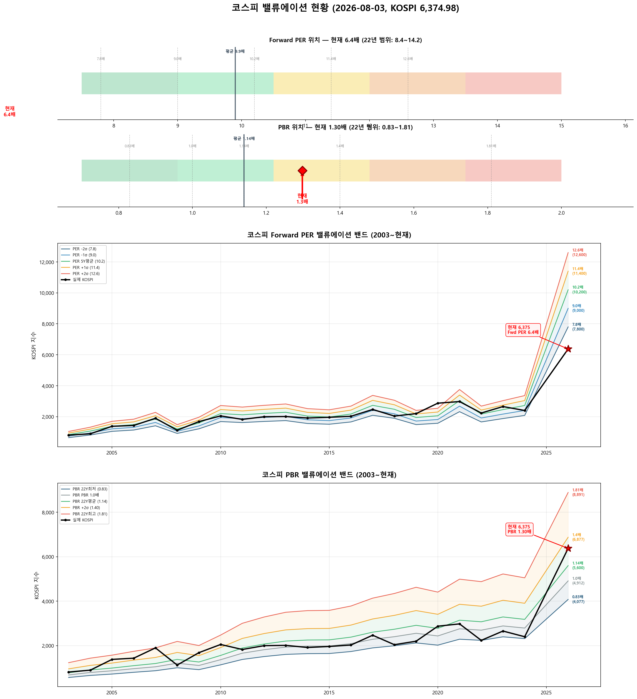

# 📋 MarketTop 일일 종합 (2026-08-03 10:25)

> A4 한 장 요약 — 상세는 각 시장 리포트 참조

---

### 🔴 코스피 6,374.98  —  📉 하락장 (신뢰도 100%)

| 과열 점수 | 36/100 🔵 저평가 |
|:---:|:---|

> ✅ **다음 매도 목표 6,820(+7.0%) 대기**

**📈 상승 시**

| 다음 매도 목표 | **6,820** (+7.0%) → 이격도106(MA10) + RSI80+ + MFI85+ (승률 71%) |
|:---:|:---|

**📉 하락 시**

| 1차 방어선 | **6,184** (-3%) → 30% 손절 |
|:---:|:---|
| 핵심 하락감지 | BB100%반전 + 이격도122(MA60) (승률 75%) |
| 강력 매도 | 전체 2개+ 전략 동시 발동 시 → 50% 청산 (검증승률 71%) |

**📍 분할매도 단계**

| 단계 | 목표가 | 등락률 | 전략 | 승률 | 틀렸을 때 |
|:---:|---:|:---:|:---|:---:|:---|
| ⏳ 1단계 | **6,820** | +7.0% | 이격도106(MA10) + RSI80+ + MFI85+ | 71% | 평균+7% |

**🛑 손절 단계**

| 단계 | 손절가 | 비중 | 전략 | 승률 |
|:---:|---:|:---:|:---|:---:|
| 1단계 | **6,184** (-3%) | 30% | BB100%반전 + 이격도122(MA60) | 75% |
| 2단계 | **6,056** (-5%) | 30% | CCI100반전 + 이격도128(MA60) | 71% |

**🎯 방향성 종합**: 🟢 **상승 우세**

| 방향 | 전략 | 평균 승률 | 예상 변동 |
|:----:|:---:|:--------:|:--------:|
| 🔴 하락(매도) | 3개 | 72.6% | -2.33% |
| 🟢 상승(매수) | 6개 | 81.8% | +4.88% |

**📐 매도 Top1 [BB100%반전 + 이격도122(MA60)] 20일 수익률 분포**

  • 중앙값: **-5.1%** | 5%분위 -14.3% ~ 95%분위 +10.1%

**📐 매수 Top1 [하향이격도89(MA120) + RSI15- + Stoch5-] 20일 수익률 분포**

  • 중앙값: **+3.7%** | 5%분위 +2.1% ~ 95%분위 +23.9%

**💰 Kelly 권장 매도비중**

| 지표 | 값 | 의미 |
|:---|---:|:---|
| 평균 Half-Kelly (Top5) | **17%** | 매수 후 매도 신호 시 권장 청산비율 |
| 최대 Half-Kelly | 22% | 가장 강한 전략의 권장 비중 |
| 평균 Sharpe (Top5) | 0.85 | 보통 |
| 2% 이내 임박 전략 수 | 0개 | 신호 발동 임박도 |

---

### 🔴 코스닥 740.37  —  📉 하락장 (신뢰도 100%)

| 과열 점수 | 37/100 🔵 저평가 |
|:---:|:---|

> ✅ **다음 매도 목표 743(+0.3%) 대기**

**📈 상승 시**

| 다음 매도 목표 | **743** (+0.3%) → 이격도102(MA10) + 거래량2.5배+ (승률 88%) |
|:---:|:---|

**📉 하락 시**

| 1차 방어선 | **718** (-3%) → 30% 손절 |
|:---:|:---|
| 핵심 하락감지 | ADX15+ + MACD데드 + RSI70+ (승률 86%) |
| 강력 매도 | 전체 2개+ 전략 동시 발동 시 → 50% 청산 (검증승률 86%) |

**📍 분할매도 단계**

| 단계 | 목표가 | 등락률 | 전략 | 승률 | 틀렸을 때 |
|:---:|---:|:---:|:---|:---:|:---|
| ⚡ 1단계 | **743** | +0.3% | 이격도102(MA10) + 거래량2.5배+ | 88% | 평균+3% |
| ⏳ 2단계 | **1,096** | +48.0% | 이격도116(MA60) + CCI160+ + ADX15+ | 86% | 평균+10% |

**🛑 손절 단계**

| 단계 | 손절가 | 비중 | 전략 | 승률 |
|:---:|---:|:---:|:---|:---:|
| 1단계 | **718** (-3%) | 30% | ADX15+ + MACD데드 + RSI70+ | 86% |
| 2단계 | **703** (-5%) | 30% | MFI65반전 + CCI200+ | 71% |
| 3단계 | **681** (-8%) | 40% | MFI85반전 + RSI60+ + Stoch95+ | 70% |

**🎯 방향성 종합**: 🟡 **약한 상승**

| 방향 | 전략 | 평균 승률 | 예상 변동 |
|:----:|:---:|:--------:|:--------:|
| 🔴 하락(매도) | 5개 | 80.1% | -3.40% |
| 🟢 상승(매수) | 8개 | 84.6% | +8.96% |

**📐 매도 Top1 [이격도102(MA10) + 거래량2.5배+] 20일 수익률 분포**

  • 중앙값: **-3.4%** | 5%분위 -17.3% ~ 95%분위 +1.9%

**📐 매수 Top1 [하향이격도89(MA5) + CCI-150- + ADX15+] 20일 수익률 분포**

  • 중앙값: **+12.4%** | 5%분위 +6.6% ~ 95%분위 +56.0%

**💰 Kelly 권장 매도비중**

| 지표 | 값 | 의미 |
|:---|---:|:---|
| 평균 Half-Kelly (Top5) | **29%** | 매수 후 매도 신호 시 권장 청산비율 |
| 최대 Half-Kelly | 41% | 가장 강한 전략의 권장 비중 |
| 평균 Sharpe (Top5) | 1.71 | 우수 |
| 2% 이내 임박 전략 수 | 1개 | 신호 발동 임박도 |

---

### 📊 코스피 밸류에이션

| 지표 | 현재 | 22Y평균 | 판단 |
|:---:|:---:|:---:|:---|
| **Fwd PER** | **6.4배** | 9.9배 | 극저평가 🟢🟢 |
| **PBR** | **1.30배** | 1.14배 | 적정 ⚪ |
| Fwd EPS | 1000 | - | BPS 4912 |

| PER 밴드 | 적정지수 | 괴리 |
|:---:|---:|:---:|
| -2σ (7.8) | 7,800 | +22.4% |
| -1σ (9.0) | 9,000 | +41.2% |
| 5Y평균 (10.2) | 10,200 | +60.0% |
| +1σ (11.4) | 11,400 | +78.8% |
| +2σ (12.6) | 12,600 | +97.6% |

---

### 📊 코스피 향후 60일 등락 위험 분석

> 💡 과거 30년간 지금과 비슷했던 상황(이격도 83%, 2개월 상승률 -14%) **111번** 발생
> → 그때 이후 2개월간 실제로 얼마나 올랐고 빠졌는지 통계

**📈 상승 가능성:**

| 항목 | 결과 | 해석 |
|:---|:---:|:---|
| **2개월 내 평균 최대상승폭** | **+14.6%** | 중위값 +10.7% |
| 역대 최고 사례 | +50.3% | 지수 9,581 |

| 상승폭 | 발생 확률 | 그때 지수 |
|:---|:---:|---:|
| +5% 이상 상승 | **80%** | 6,694 |
| +10% 이상 상승 | **55%** | 7,012 |
| +15% 이상 상승 | **34%** | 7,331 |
| +20% 이상 상승 | **26%** | 7,650 |

**📉 하락 위험:** 🔴 고위험

| 항목 | 결과 | 해석 |
|:---|:---:|:---|
| **2개월 내 평균 최대낙폭** | **-13.7%** | 중위값 -9.6% |
| 역대 최악의 경우 | -45.1% | 지수 3,503 |
| ⚠️ 평소보다 위험한 정도 | **2.4배** | 평소보다 2.4배 더 빠질 수 있음 |

**2개월 내 하락 확률과 예상 지수:**

| 하락폭 | 발생 확률 | 그때 지수 |
|:---|:---:|---:|
| -5% 이상 하락 | **67%** | 6,056 |
| -10% 이상 하락 | **50%** | 5,737 |
| -15% 이상 하락 | **34%** | 5,419 |
| -20% 이상 하락 | **27%** | 5,100 |

**💡 확률 기반 판단:**

> 과거 유사 상황에서 **+10%까지 상승할 확률이 50% 이상**이었고,
> 동시에 **-5%까지 하락할 확률도 50% 이상**이었습니다.
>
> 📌 상승·하락 기대값이 비슷합니다 (상승 11.7 vs 하락 9.1).
> 현재가 부근에서 **분할 익절** 추천. 목표 **7,012**(+10%), 손절 **6,056**(-5%)

### 📊 코스닥 향후 60일 등락 위험 분석

> 💡 과거 30년간 지금과 비슷했던 상황(이격도 78%, 2개월 상승률 -39%) **64번** 발생
> → 그때 이후 2개월간 실제로 얼마나 올랐고 빠졌는지 통계

**📈 상승 가능성:**

| 항목 | 결과 | 해석 |
|:---|:---:|:---|
| **2개월 내 평균 최대상승폭** | **+23.3%** | 중위값 +18.9% |
| 역대 최고 사례 | +54.9% | 지수 1,147 |

| 상승폭 | 발생 확률 | 그때 지수 |
|:---|:---:|---:|
| +5% 이상 상승 | **94%** | 777 |
| +10% 이상 상승 | **73%** | 814 |
| +15% 이상 상승 | **58%** | 851 |
| +20% 이상 상승 | **48%** | 888 |

**📉 하락 위험:** 🔴 고위험

| 항목 | 결과 | 해석 |
|:---|:---:|:---|
| **2개월 내 평균 최대낙폭** | **-13.6%** | 중위값 -13.6% |
| 역대 최악의 경우 | -40.9% | 지수 438 |
| ⚠️ 평소보다 위험한 정도 | **1.5배** | 평소보다 1.5배 더 빠질 수 있음 |

**2개월 내 하락 확률과 예상 지수:**

| 하락폭 | 발생 확률 | 그때 지수 |
|:---|:---:|---:|
| -5% 이상 하락 | **67%** | 703 |
| -10% 이상 하락 | **58%** | 666 |
| -15% 이상 하락 | **47%** | 629 |
| -20% 이상 하락 | **28%** | 592 |

**💡 확률 기반 판단:**

> 과거 유사 상황에서 **+15%까지 상승할 확률이 50% 이상**이었고,
> 동시에 **-10%까지 하락할 확률도 50% 이상**이었습니다.
>
> 📌 **상승 기대값(21.9)이 하락 기대값(9.2)보다 크므로 (2.4배)**,
> **851**(+15%)까지 보유 후 익절하되, **666**(-10%) 이탈 시 손절이 합리적

---

### 🔮 코스피 과거 유사 패턴 분석

> 💡 현재와 가격 움직임 + 기술적 지표가 비슷했던 과거 **15개 시점** 발견 (평균 유사도 69%)
> → 그 시점 이후 40일간 실제로 어떻게 움직였는지 통계

**📊 유사 패턴 이후 40일간 등락 범위:**

| 구분 | 평균 | 중위값 | 지수 환산 |
|:---|:---:|:---:|---:|
| 📈 최대 상승폭 | **+8.8%** | +5.0% | 6,695 |
| 📉 최대 하락폭 | **-12.8%** | -8.5% | 5,834 |
| 🚀 최고 사례 | +41.3% | - | 9,011 |
| 💥 최악 사례 | -41.9% | - | 3,701 |

**🔄 반전 패턴:**

| 패턴 | 평균 크기 | 해석 |
|:---|:---:|:---|
| 고점 찍고 반락 | **-18.0%** | 상승 후 평균 이만큼 되돌림 |
| 저점 찍고 반등 | **+18.0%** | 하락 후 평균 이만큼 회복 |

**⏰ 시간대별 상승 확률:**

| 기간 | 상승 확률 | 평균 수익률 | 예상 지수 |
|:---|:---:|:---:|---:|
| 10일 후 | **40%** | -1.1% | 6,305 |
| 20일 후 | **47%** | -1.7% | 6,266 |
| 40일 후 | **47%** | -3.4% | 6,161 |

**📈 대표 경로 (중위값):**

| 시점 | 낙관(상위25%) | 중립(중위) | 비관(하위25%) | 중립 지수 |
|:---|:---:|:---:|:---:|---:|
| 5일 후 | +1.8% | +0.4% | -1.8% | 6,400 |
| 10일 후 | +3.2% | -2.5% | -7.4% | 6,219 |
| 20일 후 | +2.3% | -1.4% | -10.6% | 6,284 |
| 30일 후 | +5.7% | -3.0% | -9.7% | 6,184 |
| 40일 후 | +5.6% | -0.4% | -13.7% | 6,350 |

**📅 가장 유사했던 과거 시점 (최근 5개):**

- **2025-04-11** (유사도 69%) — 지수 2,433 → 40일간 최대+20.0%, 최대0.0%, 최종+19.0%
- **2015-08-27** (유사도 70%) — 지수 1,908 → 40일간 최대+7.3%, 최대-1.5%, 최종+7.2%
- **2011-05-27** (유사도 70%) — 지수 2,100 → 40일간 최대+3.8%, 최대-3.8%, 최종+2.4%
- **2008-09-22** (유사도 66%) — 지수 1,460 → 40일간 최대+2.8%, 최대-35.7%, 최종-29.0%
- **2008-02-05** (유사도 71%) — 지수 1,697 → 40일간 최대+4.1%, 최대-7.2%, 최종+4.1%

### 🔮 코스닥 과거 유사 패턴 분석

> 💡 현재와 가격 움직임 + 기술적 지표가 비슷했던 과거 **17개 시점** 발견 (평균 유사도 68%)
> → 그 시점 이후 40일간 실제로 어떻게 움직였는지 통계

**📊 유사 패턴 이후 40일간 등락 범위:**

| 구분 | 평균 | 중위값 | 지수 환산 |
|:---|:---:|:---:|---:|
| 📈 최대 상승폭 | **+6.6%** | +6.2% | 787 |
| 📉 최대 하락폭 | **-9.9%** | -6.6% | 692 |
| 🚀 최고 사례 | +15.4% | - | 854 |
| 💥 최악 사례 | -40.9% | - | 438 |

**🔄 반전 패턴:**

| 패턴 | 평균 크기 | 해석 |
|:---|:---:|:---|
| 고점 찍고 반락 | **-15.2%** | 상승 후 평균 이만큼 되돌림 |
| 저점 찍고 반등 | **+10.9%** | 하락 후 평균 이만큼 회복 |

**⏰ 시간대별 상승 확률:**

| 기간 | 상승 확률 | 평균 수익률 | 예상 지수 |
|:---|:---:|:---:|---:|
| 10일 후 | **59%** | -0.5% | 737 |
| 20일 후 | **53%** | -0.1% | 740 |
| 40일 후 | **53%** | -1.6% | 729 |

**📈 대표 경로 (중위값):**

| 시점 | 낙관(상위25%) | 중립(중위) | 비관(하위25%) | 중립 지수 |
|:---|:---:|:---:|:---:|---:|
| 5일 후 | +3.0% | +0.8% | +0.1% | 746 |
| 10일 후 | +2.9% | +1.2% | -0.9% | 749 |
| 20일 후 | +4.7% | +0.2% | -3.6% | 742 |
| 30일 후 | +4.2% | -2.8% | -5.7% | 720 |
| 40일 후 | +7.3% | +1.0% | -8.6% | 747 |

**📅 가장 유사했던 과거 시점 (최근 5개):**

- **2025-04-02** (유사도 68%) — 지수 685 → 40일간 최대+8.1%, 최대-6.1%, 최종+8.1%
- **2022-02-03** (유사도 67%) — 지수 892 → 40일간 최대+6.2%, 최대-5.8%, 최종+6.2%
- **2019-08-09** (유사도 69%) — 지수 590 → 40일간 최대+10.0%, 최대-1.2%, 최종+7.3%
- **2018-05-10** (유사도 65%) — 지수 855 → 40일간 최대+3.9%, 최대-7.6%, 최종-4.9%
- **2017-08-18** (유사도 66%) — 지수 644 → 40일간 최대+6.8%, 최대-0.4%, 최종+6.8%

---

### 📎 상세 리포트

- 코스피: [코스피_고점판독리포트_20260803_102529.md](코스피_고점판독리포트_20260803_102529.md)
- 코스닥: [코스닥_고점판독리포트_20260803_102538.md](코스닥_고점판독리포트_20260803_102538.md)

---

*본 리포트는 백테스트 기반 참고용이며, 투자 판단의 최종 책임은 투자자 본인에게 있습니다.*