# 📊 보통주 vs 우선주 괴리율 분석 리포트

**분석일시**: 2026년 08월 10일 09:06:39
**분석 기준**: 2010년 이후 데이터 (금융위기 등 이상치 제외)

---

## 🎯 오늘의 투자 결론

| 종목 | 보통주 | 우선주 | 현재 괴리율 | 역사적 위치 | 판정 | 추천 |
|:----:|-------:|-------:|:----------:|:----------:|:----:|:-----|
| **삼성전자** | 231,000원 | 170,100원 | -26.36% | 하위 33% | ⚪ | ⚪ 중립 |
| **삼성전기** | 1,278,000원 | 446,000원 | -65.10% | 하위 24% | 🟦 | 🟦 우선주 매수 |
| **현대차** | 395,500원 | 197,500원 | -50.06% | 하위 57% | ⚪ | ⚪ 중립 |
| **미래에셋증권** | 33,900원 | 12,210원 | -63.98% | 하위 27% | ⚪ | ⚪ 중립 |
| **CJ** | 145,700원 | 76,000원 | -47.84% | 하위 78% | 🟥 | 🟥 보통주 매수 |
| **대상** | 18,550원 | 14,380원 | -22.48% | 하위 89% | 🟥 | 🟥 보통주 매수 |
| **SK** | 508,000원 | 340,000원 | -33.07% | 하위 41% | ⚪ | ⚪ 중립 |
| **한화** | 83,800원 | 29,250원 | -65.10% | 하위 9% | 🟦 | 🟦 우선주 강력 매수 |
| **LG** | 108,100원 | 67,200원 | -37.84% | 하위 66% | ⚪ | ⚪ 중립 |
| **GS** | 98,900원 | 58,900원 | -40.44% | 하위 44% | ⚪ | ⚪ 중립 |
| **두산** | 1,191,000원 | 436,000원 | -63.39% | 하위 26% | ⚪ | ⚪ 중립 |
| **아모레퍼시픽** | 141,800원 | 46,500원 | -67.21% | 하위 43% | ⚪ | ⚪ 중립 |
| **LG화학** | 276,000원 | 128,500원 | -53.44% | 하위 40% | ⚪ | ⚪ 중립 |
| **삼성SDI** | 459,000원 | 207,500원 | -54.79% | 하위 43% | ⚪ | ⚪ 중립 |
| **LG전자** | 185,000원 | 65,600원 | -64.54% | 하위 27% | ⚪ | ⚪ 중립 |
| **삼성화재** | 645,000원 | 403,500원 | -37.44% | 하위 58% | ⚪ | ⚪ 중립 |
| **S-Oil** | 137,600원 | 65,800원 | -52.18% | 하위 9% | 🟦 | 🟦 우선주 강력 매수 |
| **대한항공** | 27,150원 | 21,400원 | -21.18% | 하위 56% | ⚪ | ⚪ 중립 |
| **유한양행** | 80,600원 | 66,300원 | -17.74% | 하위 19% | 🟦 | 🟦 우선주 강력 매수 |
| **LG생활건강** | 333,500원 | 118,000원 | -64.62% | 하위 22% | 🟦 | 🟦 우선주 매수 |
| **CJ제일제당** | 204,500원 | 127,000원 | -37.90% | 하위 97% | 🟥 | 🟥 보통주 강력 매수 |
| **현대건설** | 109,900원 | 51,600원 | -53.05% | 하위 7% | 🟦 | 🟦 우선주 강력 매수 |
| **금호석유** | 129,600원 | 52,500원 | -59.49% | 하위 64% | ⚪ | ⚪ 중립 |
| **코오롱인더** | 58,600원 | 25,400원 | -56.66% | 하위 70% | ⚪ | ⚪ 중립 |
| **코오롱** | 25,750원 | 13,890원 | -46.06% | 하위 64% | ⚪ | ⚪ 중립 |
| **호텔신라** | 42,700원 | 29,350원 | -31.26% | 하위 59% | ⚪ | ⚪ 중립 |
| **DL** | 50,900원 | 23,000원 | -54.81% | 하위 22% | 🟦 | 🟦 우선주 매수 |
| **한국금융지주** | 188,000원 | 147,600원 | -21.49% | 하위 95% | 🟥 | 🟥 보통주 강력 매수 |
| **삼성물산** | 336,500원 | 208,500원 | -38.04% | 하위 23% | ⚪ | ⚪ 중립 |
| **아모레G** | 27,250원 | 11,320원 | -58.46% | 하위 81% | ⚪ | ⚪ 중립 |
| **NH투자증권** | 27,800원 | 24,900원 | -10.43% | 하위 85% | 🟥 | 🟥 보통주 강력 매수 |
| **SK하이닉스** | 1,422,000원 | 939,000원 | -33.97% | 하위 99% | 🟥 | 🟥 보통주 강력 매수 |

### 💡 핵심 요약

- **삼성전자**: 괴리율(-26.4%)이 평균(-24.5%) 부근. **선호도에 따라 선택** (배당→우선주, 의결권→보통주)
- **삼성전기**: 우선주가 역사적 평균(-59.4%)보다 5.7%p 더 저렴. 과거 76%의 경우보다 우선주가 싸므로 **삼성전기우 매수 유리** (승률 ~76%)
- **현대차**: 괴리율(-50.1%)이 평균(-54.2%) 부근. **선호도에 따라 선택** (배당→우선주, 의결권→보통주)
- **미래에셋증권**: 괴리율(-64.0%)이 평균(-54.4%) 부근. **선호도에 따라 선택** (배당→우선주, 의결권→보통주)
- **CJ**: 우선주가 역사적 평균(-59.5%)보다 11.7%p 비쌈. 과거 78%의 경우보다 우선주가 비싸므로 **CJ(보통주) 매수 유리** (승률 ~78%)
- **대상**: 우선주가 역사적 평균(-49.6%)보다 27.1%p 비쌈. 과거 89%의 경우보다 우선주가 비싸므로 **대상(보통주) 매수 유리** (승률 ~89%)
- **SK**: 괴리율(-33.1%)이 평균(-27.6%) 부근. **선호도에 따라 선택** (배당→우선주, 의결권→보통주)
- **한화**: 우선주가 역사적 평균(-56.4%)보다 8.7%p 더 저렴. 과거 91%의 경우보다 우선주가 싸므로 **한화3우B 매수 유리** (승률 ~91%)
- **LG**: 괴리율(-37.8%)이 평균(-46.7%) 부근. **선호도에 따라 선택** (배당→우선주, 의결권→보통주)
- **GS**: 괴리율(-40.4%)이 평균(-38.4%) 부근. **선호도에 따라 선택** (배당→우선주, 의결권→보통주)
- **두산**: 괴리율(-63.4%)이 평균(-50.2%) 부근. **선호도에 따라 선택** (배당→우선주, 의결권→보통주)
- **아모레퍼시픽**: 괴리율(-67.2%)이 평균(-63.6%) 부근. **선호도에 따라 선택** (배당→우선주, 의결권→보통주)
- **LG화학**: 괴리율(-53.4%)이 평균(-51.5%) 부근. **선호도에 따라 선택** (배당→우선주, 의결권→보통주)
- **삼성SDI**: 괴리율(-54.8%)이 평균(-52.8%) 부근. **선호도에 따라 선택** (배당→우선주, 의결권→보통주)
- **LG전자**: 괴리율(-64.5%)이 평균(-60.3%) 부근. **선호도에 따라 선택** (배당→우선주, 의결권→보통주)
- **삼성화재**: 괴리율(-37.4%)이 평균(-43.3%) 부근. **선호도에 따라 선택** (배당→우선주, 의결권→보통주)
- **S-Oil**: 우선주가 역사적 평균(-40.3%)보다 11.8%p 더 저렴. 과거 91%의 경우보다 우선주가 싸므로 **S-Oil우 매수 유리** (승률 ~91%)
- **대한항공**: 괴리율(-21.2%)이 평균(-17.1%) 부근. **선호도에 따라 선택** (배당→우선주, 의결권→보통주)
- **유한양행**: 우선주가 역사적 평균(1.0%)보다 18.8%p 더 저렴. 과거 81%의 경우보다 우선주가 싸므로 **유한양행우 매수 유리** (승률 ~81%)
- **LG생활건강**: 우선주가 역사적 평균(-58.1%)보다 6.5%p 더 저렴. 과거 78%의 경우보다 우선주가 싸므로 **LG생활건강우 매수 유리** (승률 ~78%)
- **CJ제일제당**: 우선주가 역사적 평균(-62.1%)보다 24.2%p 비쌈. 과거 97%의 경우보다 우선주가 비싸므로 **CJ제일제당(보통주) 매수 유리** (승률 ~97%)
- **현대건설**: 우선주가 역사적 평균(66.3%)보다 119.3%p 더 저렴. 과거 93%의 경우보다 우선주가 싸므로 **현대건설우 매수 유리** (승률 ~93%)
- **금호석유**: 괴리율(-59.5%)이 평균(-64.6%) 부근. **선호도에 따라 선택** (배당→우선주, 의결권→보통주)
- **코오롱인더**: 괴리율(-56.7%)이 평균(-62.7%) 부근. **선호도에 따라 선택** (배당→우선주, 의결권→보통주)
- **코오롱**: 괴리율(-46.1%)이 평균(-50.5%) 부근. **선호도에 따라 선택** (배당→우선주, 의결권→보통주)
- **호텔신라**: 괴리율(-31.3%)이 평균(-36.5%) 부근. **선호도에 따라 선택** (배당→우선주, 의결권→보통주)
- **DL**: 우선주가 역사적 평균(-47.1%)보다 7.7%p 더 저렴. 과거 78%의 경우보다 우선주가 싸므로 **DL우 매수 유리** (승률 ~78%)
- **한국금융지주**: 우선주가 역사적 평균(-48.7%)보다 27.3%p 비쌈. 과거 95%의 경우보다 우선주가 비싸므로 **한국금융지주(보통주) 매수 유리** (승률 ~95%)
- **삼성물산**: 괴리율(-38.0%)이 평균(-27.4%) 부근. **선호도에 따라 선택** (배당→우선주, 의결권→보통주)
- **아모레G**: 괴리율(-58.5%)이 평균(-63.0%) 부근. **선호도에 따라 선택** (배당→우선주, 의결권→보통주)
- **NH투자증권**: 우선주가 역사적 평균(-37.9%)보다 27.5%p 비쌈. 과거 85%의 경우보다 우선주가 비싸므로 **NH투자증권(보통주) 매수 유리** (승률 ~85%)
- **SK하이닉스**: 우선주가 역사적 평균(-51.9%)보다 17.9%p 비쌈. 과거 99%의 경우보다 우선주가 비싸므로 **SK하이닉스(보통주) 매수 유리** (승률 ~99%)

### 📋 투자 시점 가이드

| 종목 | 우선주 매수 구간 | 중립 구간 | 보통주 매수 구간 |
|:----:|:---------------:|:---------:|:---------------:|
| 삼성전자 | 괴리율 < -31.5% | -31.5% ~ -17.8% | 괴리율 > -17.8% |
| 삼성전기 | 괴리율 < -64.6% | -64.6% ~ -53.6% | 괴리율 > -53.6% |
| 현대차 | 괴리율 < -60.7% | -60.7% ~ -46.4% | 괴리율 > -46.4% |
| 미래에셋증권 | 괴리율 < -65.7% | -65.7% ~ -46.9% | 괴리율 > -46.9% |
| CJ | 괴리율 < -68.0% | -68.0% ~ -49.2% | 괴리율 > -49.2% |
| 대상 | 괴리율 < -67.0% | -67.0% ~ -28.3% | 괴리율 > -28.3% |
| SK | 괴리율 < -43.6% | -43.6% ~ -14.2% | 괴리율 > -14.2% |
| 한화 | 괴리율 < -61.4% | -61.4% ~ -51.5% | 괴리율 > -51.5% |
| LG | 괴리율 < -56.5% | -56.5% ~ -29.6% | 괴리율 > -29.6% |
| GS | 괴리율 < -51.1% | -51.1% ~ -21.0% | 괴리율 > -21.0% |
| 두산 | 괴리율 < -65.4% | -65.4% ~ -37.4% | 괴리율 > -37.4% |
| 아모레퍼시픽 | 괴리율 < -72.0% | -72.0% ~ -54.5% | 괴리율 > -54.5% |
| LG화학 | 괴리율 < -57.5% | -57.5% ~ -40.8% | 괴리율 > -40.8% |
| 삼성SDI | 괴리율 < -62.1% | -62.1% ~ -44.2% | 괴리율 > -44.2% |
| LG전자 | 괴리율 < -65.0% | -65.0% ~ -54.6% | 괴리율 > -54.6% |
| 삼성화재 | 괴리율 < -52.3% | -52.3% ~ -28.7% | 괴리율 > -28.7% |
| S-Oil | 괴리율 < -46.7% | -46.7% ~ -33.7% | 괴리율 > -33.7% |
| 대한항공 | 괴리율 < -41.8% | -41.8% ~ 9.7% | 괴리율 > 9.7% |
| 유한양행 | 괴리율 < -14.0% | -14.0% ~ 14.7% | 괴리율 > 14.7% |
| LG생활건강 | 괴리율 < -62.3% | -62.3% ~ -48.6% | 괴리율 > -48.6% |
| CJ제일제당 | 괴리율 < -69.0% | -69.0% ~ -55.7% | 괴리율 > -55.7% |
| 현대건설 | 괴리율 < -35.6% | -35.6% ~ 71.0% | 괴리율 > 71.0% |
| 금호석유 | 괴리율 < -72.8% | -72.8% ~ -53.5% | 괴리율 > -53.5% |
| 코오롱인더 | 괴리율 < -71.6% | -71.6% ~ -53.6% | 괴리율 > -53.6% |
| 코오롱 | 괴리율 < -63.0% | -63.0% ~ -38.6% | 괴리율 > -38.6% |
| 호텔신라 | 괴리율 < -54.1% | -54.1% ~ -20.8% | 괴리율 > -20.8% |
| DL | 괴리율 < -53.6% | -53.6% ~ -40.5% | 괴리율 > -40.5% |
| 한국금융지주 | 괴리율 < -64.1% | -64.1% ~ -30.6% | 괴리율 > -30.6% |
| 삼성물산 | 괴리율 < -37.7% | -37.7% ~ -14.9% | 괴리율 > -14.9% |
| 아모레G | 괴리율 < -66.0% | -66.0% ~ -59.4% | 괴리율 > -59.4% |
| NH투자증권 | 괴리율 < -58.6% | -58.6% ~ -14.4% | 괴리율 > -14.4% |
| SK하이닉스 | 괴리율 < -56.7% | -56.7% ~ -47.1% | 괴리율 > -47.1% |

### 📈 시장 상황별 전략

| 종목 | 상승장 예상 | 하락장 예상 | 패턴 |
|:----:|:----------:|:----------:|:-----|
| 삼성전자 | 우선주(삼성전자우) | 보통주(삼성전자) | 상승장에서 우선주가 더 저렴 |
| 삼성전기 | 우선주(삼성전기우) | 보통주(삼성전기) | 상승장에서 우선주가 더 저렴 |
| 현대차 | 우선주(현대차우) | 보통주(현대차) | 상승장에서 우선주가 더 저렴 |
| 미래에셋증권 | 우선주(미래에셋증권우) | 보통주(미래에셋증권) | 상승장에서 우선주가 더 저렴 |
| CJ | 우선주(CJ우) | 보통주(CJ) | 상승장에서 우선주가 더 저렴 |
| 대상 | 우선주(대상우) | 보통주(대상) | 상승장에서 우선주가 더 저렴 |
| SK | 우선주(SK우) | 보통주(SK) | 상승장에서 우선주가 더 저렴 |
| 한화 | 우선주(한화3우B) | 보통주(한화) | 상승장에서 우선주가 더 저렴 |
| LG | 우선주(LG우) | 보통주(LG) | 상승장에서 우선주가 더 저렴 |
| GS | 우선주(GS우) | 보통주(GS) | 상승장에서 우선주가 더 저렴 |
| 두산 | 우선주(두산우) | 보통주(두산) | 상승장에서 우선주가 더 저렴 |
| 아모레퍼시픽 | 우선주(아모레퍼시픽우) | 보통주(아모레퍼시픽) | 상승장에서 우선주가 더 저렴 |
| LG화학 | 우선주(LG화학우) | 보통주(LG화학) | 상승장에서 우선주가 더 저렴 |
| 삼성SDI | 우선주(삼성SDI우) | 보통주(삼성SDI) | 상승장에서 우선주가 더 저렴 |
| LG전자 | 우선주(LG전자우) | 보통주(LG전자) | 상승장에서 우선주가 더 저렴 |
| 삼성화재 | 보통주(삼성화재) | 우선주(삼성화재우) | 하락장에서 우선주가 더 저렴 |
| S-Oil | 우선주(S-Oil우) | 보통주(S-Oil) | 상승장에서 우선주가 더 저렴 |
| 대한항공 | 보통주(대한항공) | 우선주(대한항공우) | 하락장에서 우선주가 더 저렴 |
| 유한양행 | 우선주(유한양행우) | 보통주(유한양행) | 상승장에서 우선주가 더 저렴 |
| LG생활건강 | 우선주(LG생활건강우) | 보통주(LG생활건강) | 상승장에서 우선주가 더 저렴 |
| CJ제일제당 | 우선주(CJ제일제당우) | 보통주(CJ제일제당) | 상승장에서 우선주가 더 저렴 |
| 현대건설 | 우선주(현대건설우) | 보통주(현대건설) | 상승장에서 우선주가 더 저렴 |
| 금호석유 | 우선주(금호석유우) | 보통주(금호석유) | 상승장에서 우선주가 더 저렴 |
| 코오롱인더 | 우선주(코오롱인더우) | 보통주(코오롱인더) | 상승장에서 우선주가 더 저렴 |
| 코오롱 | 우선주(코오롱우) | 보통주(코오롱) | 상승장에서 우선주가 더 저렴 |
| 호텔신라 | 우선주(호텔신라우) | 보통주(호텔신라) | 상승장에서 우선주가 더 저렴 |
| DL | 우선주(DL우) | 보통주(DL) | 상승장에서 우선주가 더 저렴 |
| 한국금융지주 | 우선주(한국금융지주우) | 보통주(한국금융지주) | 상승장에서 우선주가 더 저렴 |
| 삼성물산 | 우선주(삼성물산우B) | 보통주(삼성물산) | 상승장에서 우선주가 더 저렴 |
| 아모레G | 우선주(아모레G우) | 보통주(아모레G) | 상승장에서 우선주가 더 저렴 |
| NH투자증권 | 보통주(NH투자증권) | 우선주(NH투자증권우) | 하락장에서 우선주가 더 저렴 |
| SK하이닉스 | 보통주(SK하이닉스) | 우선주(SK스퀘어) | 하락장에서 우선주가 더 저렴 |

---

## 📌 삼성전자 (005930) vs 삼성전자우 (005935)

**분석 기간**: 2010-01-04 ~ 2026-08-07 (4,082일)
**전체 데이터**: 2005-09-29 ~ 2026-08-07 (5,152일) — 2010년 이전은 참고용

### 현재 상황

| 항목 | 값 |
|:----:|:---|
| 삼성전자 | 231,000원 |
| 삼성전자우 | 170,100원 |
| **현재 괴리율** | **-26.36%** |
| 우선주 할인율 | 26.36% |
| 역사적 위치 | 하위 32.7% |
| Z-Score | -0.19σ |
| 종합 점수 | -10점 (±100점 만점) |
| **판정** | **⚪ 중립** |

**판정 근거:**

- ❌ 최근 30일 평균보다 1%p 이상 높음

### 괴리율 통계 (2010년~)

| 지표 | 값 |
|:----:|:---|
| 평균 | -24.46% |
| 중간값 | -22.14% |
| 표준편차 | 10.13% |
| 최소 (우선주 최저평가) | -48.45% |
| 최대 (우선주 최고평가) | -6.47% |

| 백분위 | 괴리율 | 의미 |
|:-----:|:------:|:-----|
| 10% | -40.63% | 우선주 매우 저평가 |
| 25% | -31.47% | 우선주 저평가 |
| 50% | -22.14% | 중간값 |
| 75% | -17.82% | 우선주 고평가 |
| 90% | -11.29% | 우선주 매우 고평가 |

**📎 참고: 전체 기간 (2005-09-29~) 통계 비교**

| 지표 | 2010년 이후 | 전체 기간 |
|:----:|:----------:|:---------:|
| 평균 | -24.46% | -26.59% |
| 중간값 | -22.14% | -25.23% |
| 표준편차 | 10.13% | 10.30% |
| 최소 | -48.45% | -49.81% |
| 최대 | -6.47% | -6.47% |

### 기간별 괴리율

| 기간 | 평균 | 최소 | 최대 | 현재 대비 |
|:----:|:----:|:----:|:----:|:---------:|
| 최근 1개월 | -30.40% | -36.53% | -25.24% | +4.03%p |
| 최근 3개월 | -32.43% | -37.46% | -25.24% | +6.07%p |
| 최근 6개월 | -29.70% | -37.46% | -21.76% | +3.33%p |
| 최근 1년 | -24.08% | -37.46% | -15.60% | -2.28%p |
| 최근 3년 | -18.46% | -37.46% | -7.14% | -7.91%p |
| 최근 5년 | -17.04% | -37.46% | -6.47% | -9.33%p |

### 시장 상황별 괴리율

| 구분 | 기간 | 평균 괴리율 | 중간값 |
|:----:|:----:|:----------:|:------:|
| 상승장 | 1411일 (34.6%) | -25.88% | -23.50% |
| 하락장 | 678일 (16.6%) | -23.27% | -22.03% |
| 중립장 | 1993일 (48.8%) | -23.86% | -21.21% |

### 역사적 극단값 (Top 5)

**🟦 우선주 최저평가 시점 (괴리율 최저)**

| 날짜 | 삼성전자 | 삼성전자우 | 괴리율 |
|:----:|--------:|----------:|:------:|
| 2013-01-02 | 23,644원 | 12,188원 | **-48.45%** |
| 2013-01-14 | 23,284원 | 12,117원 | **-47.96%** |
| 2013-01-04 | 22,879원 | 11,976원 | **-47.66%** |
| 2012-05-08 | 20,007원 | 10,514원 | **-47.45%** |
| 2013-01-03 | 23,149원 | 12,174원 | **-47.41%** |

**🟥 보통주 최저평가 시점 (괴리율 최고)**

| 날짜 | 삼성전자 | 삼성전자우 | 괴리율 |
|:----:|--------:|----------:|:------:|
| 2021-09-09 | 68,340원 | 63,916원 | **-6.47%** |
| 2021-09-29 | 67,570원 | 63,165원 | **-6.52%** |
| 2022-06-16 | 56,073원 | 52,069원 | **-7.14%** |
| 2021-11-05 | 64,014원 | 59,402원 | **-7.20%** |
| 2020-12-22 | 63,442원 | 58,870원 | **-7.21%** |

### 차트

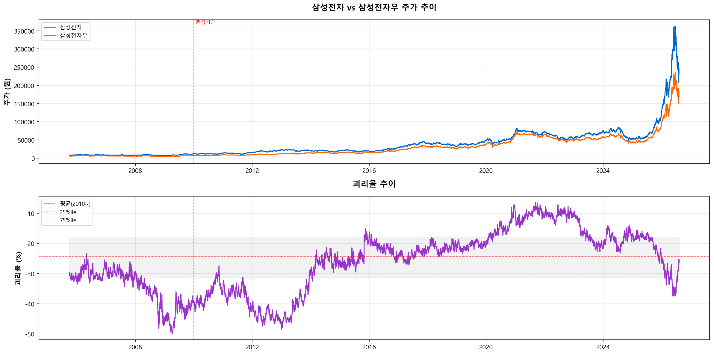

---

## 📌 삼성전기 (009150) vs 삼성전기우 (009155)

**분석 기간**: 2010-01-04 ~ 2026-08-07 (4,082일)
**전체 데이터**: 2005-09-29 ~ 2026-08-07 (5,152일) — 2010년 이전은 참고용

### 현재 상황

| 항목 | 값 |
|:----:|:---|
| 삼성전기 | 1,278,000원 |
| 삼성전기우 | 446,000원 |
| **현재 괴리율** | **-65.10%** |
| 우선주 할인율 | 65.10% |
| 역사적 위치 | 하위 23.7% |
| Z-Score | -0.66σ |
| 종합 점수 | 25점 (±100점 만점) |
| **판정** | **🟦 우선주 매수** |

**판정 근거:**

- ✅ 역사적 하위 25% (우선주 저평가)

### 괴리율 통계 (2010년~)

| 지표 | 값 |
|:----:|:---|
| 평균 | -59.44% |
| 중간값 | -58.30% |
| 표준편차 | 8.64% |
| 최소 (우선주 최저평가) | -79.74% |
| 최대 (우선주 최고평가) | -32.54% |

| 백분위 | 괴리율 | 의미 |
|:-----:|:------:|:-----|
| 10% | -73.22% | 우선주 매우 저평가 |
| 25% | -64.62% | 우선주 저평가 |
| 50% | -58.30% | 중간값 |
| 75% | -53.59% | 우선주 고평가 |
| 90% | -49.04% | 우선주 매우 고평가 |

**📎 참고: 전체 기간 (2005-09-29~) 통계 비교**

| 지표 | 2010년 이후 | 전체 기간 |
|:----:|:----------:|:---------:|
| 평균 | -59.44% | -60.28% |
| 중간값 | -58.30% | -59.77% |
| 표준편차 | 8.64% | 8.28% |
| 최소 | -79.74% | -79.74% |
| 최대 | -32.54% | -32.54% |

### 기간별 괴리율

| 기간 | 평균 | 최소 | 최대 | 현재 대비 |
|:----:|:----:|:----:|:----:|:---------:|
| 최근 1개월 | -64.14% | -65.74% | -61.01% | -0.96%p |
| 최근 3개월 | -63.03% | -69.64% | -57.18% | -2.07%p |
| 최근 6개월 | -59.84% | -69.64% | -52.26% | -5.26%p |
| 최근 1년 | -57.66% | -69.64% | -52.26% | -7.44%p |
| 최근 3년 | -54.05% | -69.64% | -43.76% | -11.06%p |
| 최근 5년 | -54.34% | -69.64% | -32.54% | -10.76%p |

### 시장 상황별 괴리율

| 구분 | 기간 | 평균 괴리율 | 중간값 |
|:----:|:----:|:----------:|:------:|
| 상승장 | 1432일 (35.1%) | -60.10% | -59.16% |
| 하락장 | 1144일 (28.0%) | -58.18% | -56.67% |
| 중립장 | 1506일 (36.9%) | -59.76% | -57.40% |

### 역사적 극단값 (Top 5)

**🟦 우선주 최저평가 시점 (괴리율 최저)**

| 날짜 | 삼성전기 | 삼성전기우 | 괴리율 |
|:----:|--------:|----------:|:------:|
| 2012-06-21 | 93,451원 | 18,936원 | **-79.74%** |
| 2012-06-18 | 93,451원 | 19,043원 | **-79.62%** |
| 2012-06-19 | 92,154원 | 18,864원 | **-79.53%** |
| 2012-06-20 | 92,154원 | 18,864원 | **-79.53%** |
| 2012-06-15 | 93,019원 | 19,043원 | **-79.53%** |

**🟥 보통주 최저평가 시점 (괴리율 최고)**

| 날짜 | 삼성전기 | 삼성전기우 | 괴리율 |
|:----:|--------:|----------:|:------:|
| 2021-01-27 | 202,419원 | 136,554원 | **-32.54%** |
| 2021-01-26 | 204,778원 | 136,554원 | **-33.32%** |
| 2021-01-28 | 197,701원 | 130,367원 | **-34.06%** |
| 2021-01-29 | 192,510원 | 121,971원 | **-36.64%** |
| 2021-02-03 | 197,701원 | 122,855원 | **-37.86%** |

### 차트

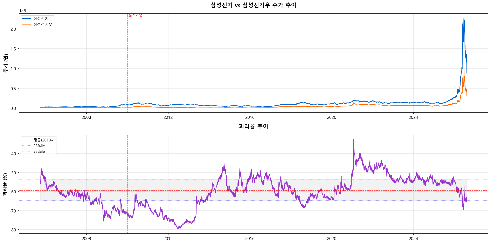

---

## 📌 현대차 (005380) vs 현대차우 (005385)

**분석 기간**: 2010-01-04 ~ 2026-08-07 (4,082일)
**전체 데이터**: 2005-09-29 ~ 2026-08-07 (5,152일) — 2010년 이전은 참고용

### 현재 상황

| 항목 | 값 |
|:----:|:---|
| 현대차 | 395,500원 |
| 현대차우 | 197,500원 |
| **현재 괴리율** | **-50.06%** |
| 우선주 할인율 | 50.06% |
| 역사적 위치 | 하위 56.7% |
| Z-Score | 0.30σ |
| 종합 점수 | -10점 (±100점 만점) |
| **판정** | **⚪ 중립** |

**판정 근거:**

- ❌ 최근 30일 평균보다 1%p 이상 높음

### 괴리율 통계 (2010년~)

| 지표 | 값 |
|:----:|:---|
| 평균 | -54.24% |
| 중간값 | -51.60% |
| 표준편차 | 14.06% |
| 최소 (우선주 최저평가) | -79.50% |
| 최대 (우선주 최고평가) | -20.11% |

| 백분위 | 괴리율 | 의미 |
|:-----:|:------:|:-----|
| 10% | -76.06% | 우선주 매우 저평가 |
| 25% | -60.67% | 우선주 저평가 |
| 50% | -51.60% | 중간값 |
| 75% | -46.40% | 우선주 고평가 |
| 90% | -39.10% | 우선주 매우 고평가 |

**📎 참고: 전체 기간 (2005-09-29~) 통계 비교**

| 지표 | 2010년 이후 | 전체 기간 |
|:----:|:----------:|:---------:|
| 평균 | -54.24% | -57.05% |
| 중간값 | -51.60% | -56.30% |
| 표준편차 | 14.06% | 14.09% |
| 최소 | -79.50% | -82.21% |
| 최대 | -20.11% | -20.11% |

### 기간별 괴리율

| 기간 | 평균 | 최소 | 최대 | 현재 대비 |
|:----:|:----:|:----:|:----:|:---------:|
| 최근 1개월 | -52.96% | -56.50% | -48.56% | +2.90%p |
| 최근 3개월 | -55.09% | -63.00% | -48.14% | +5.02%p |
| 최근 6개월 | -47.19% | -63.00% | -25.17% | -2.87%p |
| 최근 1년 | -35.83% | -63.00% | -20.11% | -14.24%p |
| 최근 3년 | -42.94% | -63.00% | -20.11% | -7.12%p |
| 최근 5년 | -47.68% | -63.08% | -20.11% | -2.38%p |

### 시장 상황별 괴리율

| 구분 | 기간 | 평균 괴리율 | 중간값 |
|:----:|:----:|:----------:|:------:|
| 상승장 | 1172일 (28.7%) | -55.39% | -52.65% |
| 하락장 | 821일 (20.1%) | -51.80% | -49.66% |
| 중립장 | 2089일 (51.2%) | -54.55% | -51.52% |

### 역사적 극단값 (Top 5)

**🟦 우선주 최저평가 시점 (괴리율 최저)**

| 날짜 | 현대차 | 현대차우 | 괴리율 |
|:----:|--------:|----------:|:------:|
| 2012-04-20 | 169,084원 | 34,658원 | **-79.50%** |
| 2012-04-23 | 166,421원 | 34,406원 | **-79.33%** |
| 2012-06-20 | 168,751원 | 34,909원 | **-79.31%** |
| 2012-08-02 | 158,765원 | 32,897원 | **-79.28%** |
| 2012-04-19 | 172,745원 | 35,815원 | **-79.27%** |

**🟥 보통주 최저평가 시점 (괴리율 최고)**

| 날짜 | 현대차 | 현대차우 | 괴리율 |
|:----:|--------:|----------:|:------:|
| 2025-05-23 | 173,027원 | 138,223원 | **-20.11%** |
| 2025-06-04 | 181,332원 | 144,557원 | **-20.28%** |
| 2025-05-26 | 174,950원 | 139,076원 | **-20.51%** |
| 2025-05-27 | 174,950원 | 138,508원 | **-20.83%** |
| 2025-06-05 | 184,842원 | 146,100원 | **-20.96%** |

### 차트

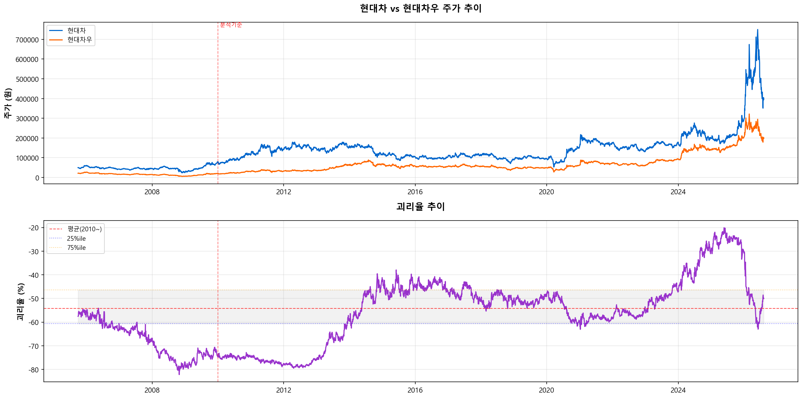

---

## 📌 미래에셋증권 (006800) vs 미래에셋증권우 (006805)

**분석 기간**: 2010-01-04 ~ 2026-08-07 (4,082일)
**전체 데이터**: 2005-09-29 ~ 2026-08-07 (5,152일) — 2010년 이전은 참고용

### 현재 상황

| 항목 | 값 |
|:----:|:---|
| 미래에셋증권 | 33,900원 |
| 미래에셋증권우 | 12,210원 |
| **현재 괴리율** | **-63.98%** |
| 우선주 할인율 | 63.98% |
| 역사적 위치 | 하위 27.3% |
| Z-Score | -0.91σ |
| 종합 점수 | 0점 (±100점 만점) |
| **판정** | **⚪ 중립** |

### 괴리율 통계 (2010년~)

| 지표 | 값 |
|:----:|:---|
| 평균 | -54.42% |
| 중간값 | -52.52% |
| 표준편차 | 10.51% |
| 최소 (우선주 최저평가) | -73.11% |
| 최대 (우선주 최고평가) | -30.41% |

| 백분위 | 괴리율 | 의미 |
|:-----:|:------:|:-----|
| 10% | -69.92% | 우선주 매우 저평가 |
| 25% | -65.72% | 우선주 저평가 |
| 50% | -52.52% | 중간값 |
| 75% | -46.89% | 우선주 고평가 |
| 90% | -40.96% | 우선주 매우 고평가 |

**📎 참고: 전체 기간 (2005-09-29~) 통계 비교**

| 지표 | 2010년 이후 | 전체 기간 |
|:----:|:----------:|:---------:|
| 평균 | -54.42% | -56.22% |
| 중간값 | -52.52% | -54.86% |
| 표준편차 | 10.51% | 10.62% |
| 최소 | -73.11% | -76.17% |
| 최대 | -30.41% | -30.41% |

### 기간별 괴리율

| 기간 | 평균 | 최소 | 최대 | 현재 대비 |
|:----:|:----:|:----:|:----:|:---------:|
| 최근 1개월 | -64.24% | -66.42% | -61.05% | +0.25%p |
| 최근 3개월 | -67.30% | -72.46% | -61.05% | +3.32%p |
| 최근 6개월 | -61.22% | -72.46% | -30.41% | -2.76%p |
| 최근 1년 | -57.61% | -72.46% | -30.41% | -6.37%p |
| 최근 3년 | -49.63% | -72.46% | -30.41% | -14.35%p |
| 최근 5년 | -48.52% | -72.46% | -30.41% | -15.46%p |

### 시장 상황별 괴리율

| 구분 | 기간 | 평균 괴리율 | 중간값 |
|:----:|:----:|:----------:|:------:|
| 상승장 | 1100일 (26.9%) | -56.29% | -53.83% |
| 하락장 | 1077일 (26.4%) | -55.47% | -53.84% |
| 중립장 | 1905일 (46.7%) | -52.75% | -49.76% |

### 역사적 극단값 (Top 5)

**🟦 우선주 최저평가 시점 (괴리율 최저)**

| 날짜 | 미래에셋증권 | 미래에셋증권우 | 괴리율 |
|:----:|--------:|----------:|:------:|
| 2012-09-27 | 9,530원 | 2,563원 | **-73.11%** |
| 2012-09-19 | 9,933원 | 2,674원 | **-73.08%** |
| 2012-09-21 | 9,750원 | 2,635원 | **-72.97%** |
| 2012-10-02 | 9,310원 | 2,518원 | **-72.95%** |
| 2012-09-24 | 9,566원 | 2,590원 | **-72.92%** |

**🟥 보통주 최저평가 시점 (괴리율 최고)**

| 날짜 | 미래에셋증권 | 미래에셋증권우 | 괴리율 |
|:----:|--------:|----------:|:------:|
| 2025-12-26 | 22,635원 | 15,752원 | **-30.41%** |
| 2022-08-16 | 6,153원 | 4,167원 | **-32.27%** |
| 2022-08-19 | 6,098원 | 4,079원 | **-33.10%** |
| 2022-08-04 | 5,960원 | 3,987원 | **-33.11%** |
| 2022-08-12 | 6,217원 | 4,155원 | **-33.17%** |

### 차트

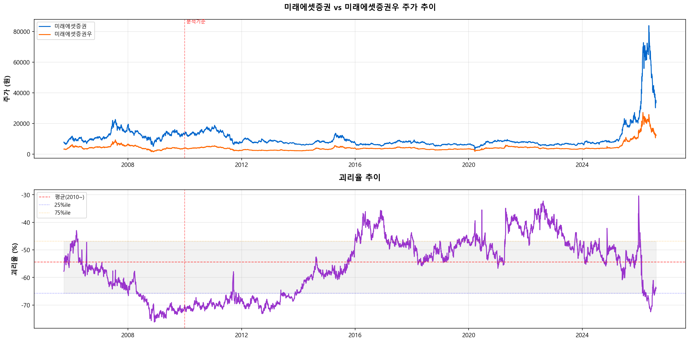

---

## 📌 CJ (001040) vs CJ우 (001045)

**분석 기간**: 2010-01-04 ~ 2026-08-07 (4,082일)
**전체 데이터**: 2000-01-04 ~ 2026-08-07 (6,649일) — 2010년 이전은 참고용

### 현재 상황

| 항목 | 값 |
|:----:|:---|
| CJ | 145,700원 |
| CJ우 | 76,000원 |
| **현재 괴리율** | **-47.84%** |
| 우선주 할인율 | 47.84% |
| 역사적 위치 | 하위 77.7% |
| Z-Score | 0.96σ |
| 종합 점수 | -35점 (±100점 만점) |
| **판정** | **🟥 보통주 매수** |

**판정 근거:**

- ❌ 역사적 상위 25% (우선주 고평가)
- ❌ 최근 30일 평균보다 1%p 이상 높음

### 괴리율 통계 (2010년~)

| 지표 | 값 |
|:----:|:---|
| 평균 | -59.51% |
| 중간값 | -59.11% |
| 표준편차 | 12.19% |
| 최소 (우선주 최저평가) | -83.09% |
| 최대 (우선주 최고평가) | -34.59% |

| 백분위 | 괴리율 | 의미 |
|:-----:|:------:|:-----|
| 10% | -79.79% | 우선주 매우 저평가 |
| 25% | -67.95% | 우선주 저평가 |
| 50% | -59.11% | 중간값 |
| 75% | -49.20% | 우선주 고평가 |
| 90% | -44.22% | 우선주 매우 고평가 |

**📎 참고: 전체 기간 (2000-01-04~) 통계 비교**

| 지표 | 2010년 이후 | 전체 기간 |
|:----:|:----------:|:---------:|
| 평균 | -59.51% | 70.41% |
| 중간값 | -59.11% | -52.57% |
| 표준편차 | 12.19% | 213.95% |
| 최소 | -83.09% | -83.09% |
| 최대 | -34.59% | 845.98% |

### 기간별 괴리율

| 기간 | 평균 | 최소 | 최대 | 현재 대비 |
|:----:|:----:|:----:|:----:|:---------:|
| 최근 1개월 | -51.44% | -57.69% | -46.09% | +3.60%p |
| 최근 3개월 | -55.03% | -59.87% | -46.09% | +7.19%p |
| 최근 6개월 | -53.79% | -59.87% | -46.09% | +5.96%p |
| 최근 1년 | -50.04% | -59.87% | -39.60% | +2.20%p |
| 최근 3년 | -47.76% | -59.87% | -34.59% | -0.08%p |
| 최근 5년 | -48.91% | -61.63% | -34.59% | +1.07%p |

### 시장 상황별 괴리율

| 구분 | 기간 | 평균 괴리율 | 중간값 |
|:----:|:----:|:----------:|:------:|
| 상승장 | 1297일 (31.8%) | -60.81% | -59.21% |
| 하락장 | 1089일 (26.7%) | -57.52% | -58.50% |
| 중립장 | 1696일 (41.5%) | -59.79% | -59.80% |

### 역사적 극단값 (Top 5)

**🟦 우선주 최저평가 시점 (괴리율 최저)**

| 날짜 | CJ | CJ우 | 괴리율 |
|:----:|--------:|----------:|:------:|
| 2013-02-28 | 105,339원 | 17,815원 | **-83.09%** |
| 2012-10-29 | 76,722원 | 13,029원 | **-83.02%** |
| 2013-02-21 | 95,474원 | 16,273원 | **-82.96%** |
| 2013-02-05 | 95,122원 | 16,216원 | **-82.95%** |
| 2013-02-27 | 101,464원 | 17,329원 | **-82.92%** |

**🟥 보통주 최저평가 시점 (괴리율 최고)**

| 날짜 | CJ | CJ우 | 괴리율 |
|:----:|--------:|----------:|:------:|
| 2023-07-13 | 57,779원 | 37,792원 | **-34.59%** |
| 2023-07-26 | 57,873원 | 37,530원 | **-35.15%** |
| 2023-07-12 | 58,529원 | 37,749원 | **-35.51%** |
| 2023-07-10 | 57,591원 | 37,049원 | **-35.67%** |
| 2023-07-14 | 58,623원 | 37,661원 | **-35.76%** |

### 차트

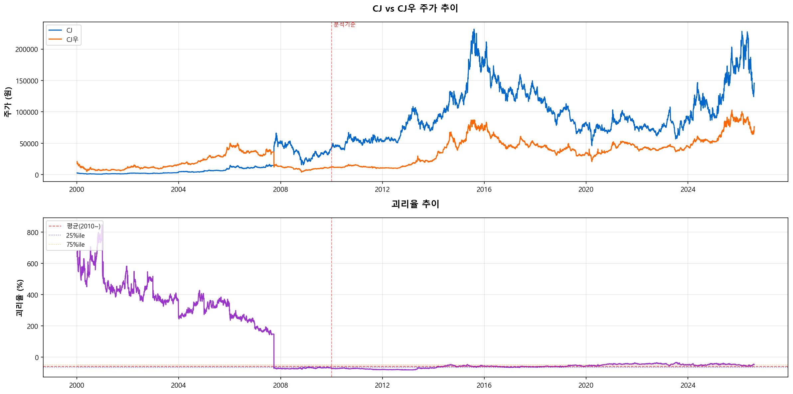

---

## 📌 대상 (001680) vs 대상우 (001685)

**분석 기간**: 2010-01-04 ~ 2026-08-07 (4,082일)
**전체 데이터**: 2005-09-29 ~ 2026-08-07 (5,152일) — 2010년 이전은 참고용

### 현재 상황

| 항목 | 값 |
|:----:|:---|
| 대상 | 18,550원 |
| 대상우 | 14,380원 |
| **현재 괴리율** | **-22.48%** |
| 우선주 할인율 | 22.48% |
| 역사적 위치 | 하위 88.9% |
| Z-Score | 1.24σ |
| 종합 점수 | -35점 (±100점 만점) |
| **판정** | **🟥 보통주 매수** |

**판정 근거:**

- ❌ 역사적 상위 25% (우선주 고평가)
- ❌ 평균 대비 1.0σ 이상 높음
- ✅ 최근 30일 평균보다 1%p 이상 낮음

### 괴리율 통계 (2010년~)

| 지표 | 값 |
|:----:|:---|
| 평균 | -49.58% |
| 중간값 | -54.85% |
| 표준편차 | 21.83% |
| 최소 (우선주 최저평가) | -85.54% |
| 최대 (우선주 최고평가) | 54.56% |

| 백분위 | 괴리율 | 의미 |
|:-----:|:------:|:-----|
| 10% | -77.61% | 우선주 매우 저평가 |
| 25% | -67.00% | 우선주 저평가 |
| 50% | -54.85% | 중간값 |
| 75% | -28.28% | 우선주 고평가 |
| 90% | -21.88% | 우선주 매우 고평가 |

**📎 참고: 전체 기간 (2005-09-29~) 통계 비교**

| 지표 | 2010년 이후 | 전체 기간 |
|:----:|:----------:|:---------:|
| 평균 | -49.58% | -53.07% |
| 중간값 | -54.85% | -59.12% |
| 표준편차 | 21.83% | 20.70% |
| 최소 | -85.54% | -85.54% |
| 최대 | 54.56% | 54.56% |

### 기간별 괴리율

| 기간 | 평균 | 최소 | 최대 | 현재 대비 |
|:----:|:----:|:----:|:----:|:---------:|
| 최근 1개월 | -18.66% | -23.38% | -11.45% | -3.82%p |
| 최근 3개월 | -18.98% | -23.65% | -11.45% | -3.50%p |
| 최근 6개월 | -20.17% | -26.25% | -11.45% | -2.31%p |
| 최근 1년 | -23.07% | -33.74% | -11.45% | +0.59%p |
| 최근 3년 | -21.86% | -33.74% | 54.56% | -0.62%p |
| 최근 5년 | -28.84% | -58.52% | 54.56% | +6.36%p |

### 시장 상황별 괴리율

| 구분 | 기간 | 평균 괴리율 | 중간값 |
|:----:|:----:|:----------:|:------:|
| 상승장 | 1214일 (29.7%) | -58.74% | -63.67% |
| 하락장 | 1009일 (24.7%) | -48.12% | -53.59% |
| 중립장 | 1859일 (45.5%) | -44.40% | -46.60% |

### 역사적 극단값 (Top 5)

**🟦 우선주 최저평가 시점 (괴리율 최저)**

| 날짜 | 대상 | 대상우 | 괴리율 |
|:----:|--------:|----------:|:------:|
| 2013-03-26 | 25,069원 | 3,624원 | **-85.54%** |
| 2013-03-27 | 26,159원 | 3,806원 | **-85.45%** |
| 2013-03-22 | 24,742원 | 3,600원 | **-85.45%** |
| 2013-03-28 | 26,631원 | 3,878원 | **-85.44%** |
| 2013-03-15 | 24,197원 | 3,528원 | **-85.42%** |

**🟥 보통주 최저평가 시점 (괴리율 최고)**

| 날짜 | 대상 | 대상우 | 괴리율 |
|:----:|--------:|----------:|:------:|
| 2023-12-18 | 18,434원 | 28,493원 | **54.56%** |
| 2023-12-14 | 18,835원 | 28,667원 | **52.20%** |
| 2023-12-19 | 18,390원 | 26,965원 | **46.63%** |
| 2023-12-15 | 18,568원 | 27,053원 | **45.70%** |
| 2023-12-20 | 18,657원 | 26,005원 | **39.39%** |

### 차트

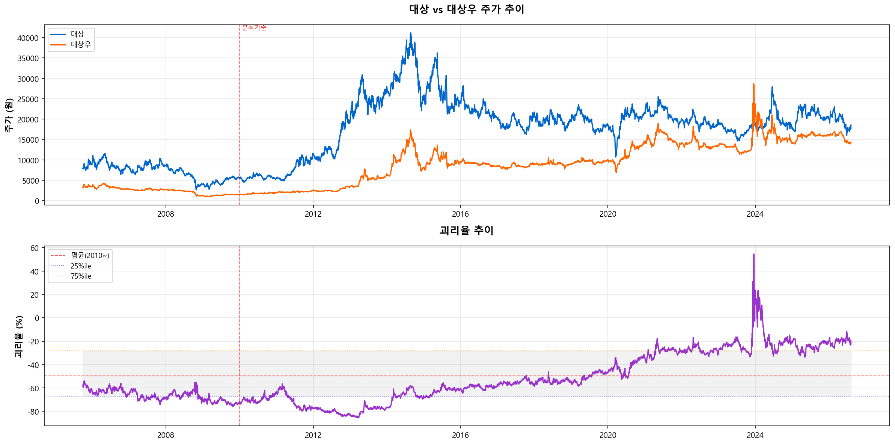

---

## 📌 SK (034730) vs SK우 (03473K)

**분석 기간**: 2015-08-17 ~ 2026-08-07 (2,688일)

### 현재 상황

| 항목 | 값 |
|:----:|:---|
| SK | 508,000원 |
| SK우 | 340,000원 |
| **현재 괴리율** | **-33.07%** |
| 우선주 할인율 | 33.07% |
| 역사적 위치 | 하위 41.4% |
| Z-Score | -0.34σ |
| 종합 점수 | -10점 (±100점 만점) |
| **판정** | **⚪ 중립** |

**판정 근거:**

- ❌ 최근 30일 평균보다 1%p 이상 높음

### 괴리율 통계

| 지표 | 값 |
|:----:|:---|
| 평균 | -27.62% |
| 중간값 | -23.89% |
| 표준편차 | 16.02% |
| 최소 (우선주 최저평가) | -53.66% |
| 최대 (우선주 최고평가) | 50.62% |

| 백분위 | 괴리율 | 의미 |
|:-----:|:------:|:-----|
| 10% | -47.86% | 우선주 매우 저평가 |
| 25% | -43.62% | 우선주 저평가 |
| 50% | -23.89% | 중간값 |
| 75% | -14.19% | 우선주 고평가 |
| 90% | -10.36% | 우선주 매우 고평가 |

### 기간별 괴리율

| 기간 | 평균 | 최소 | 최대 | 현재 대비 |
|:----:|:----:|:----:|:----:|:---------:|
| 최근 1개월 | -40.69% | -45.27% | -32.91% | +7.61%p |
| 최근 3개월 | -34.81% | -45.27% | -22.40% | +1.74%p |
| 최근 6개월 | -30.91% | -45.27% | -22.40% | -2.16%p |
| 최근 1년 | -24.43% | -45.27% | -7.52% | -8.64%p |
| 최근 3년 | -18.81% | -45.27% | 15.96% | -14.27%p |
| 최근 5년 | -18.95% | -49.11% | 50.62% | -14.12%p |

### 시장 상황별 괴리율

| 구분 | 기간 | 평균 괴리율 | 중간값 |
|:----:|:----:|:----------:|:------:|
| 상승장 | 649일 (24.1%) | -27.04% | -25.95% |
| 하락장 | 639일 (23.8%) | -21.70% | -16.04% |
| 중립장 | 1400일 (52.1%) | -30.58% | -34.92% |

### 역사적 극단값 (Top 5)

**🟦 우선주 최저평가 시점 (괴리율 최저)**

| 날짜 | SK | SK우 | 괴리율 |
|:----:|--------:|----------:|:------:|
| 2018-12-21 | 212,815원 | 98,612원 | **-53.66%** |
| 2018-12-19 | 215,997원 | 100,117원 | **-53.65%** |
| 2018-05-18 | 240,125원 | 111,374원 | **-53.62%** |
| 2019-01-17 | 215,796원 | 100,229원 | **-53.55%** |
| 2018-12-17 | 218,782원 | 101,623원 | **-53.55%** |

**🟥 보통주 최저평가 시점 (괴리율 최고)**

| 날짜 | SK | SK우 | 괴리율 |
|:----:|--------:|----------:|:------:|
| 2020-06-30 | 240,677원 | 362,516원 | **50.62%** |
| 2020-06-18 | 254,277원 | 378,368원 | **48.80%** |
| 2020-07-01 | 245,640원 | 361,714원 | **47.25%** |
| 2020-06-17 | 262,107원 | 375,968원 | **43.44%** |
| 2020-06-16 | 253,041원 | 340,371원 | **34.51%** |

### 차트

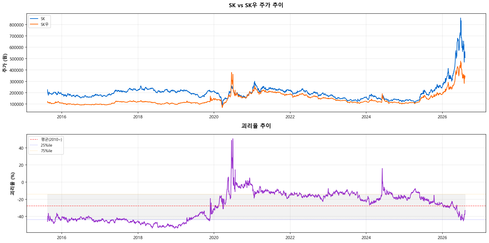

---

## 📌 한화 (000880) vs 한화3우B (00088K)

**분석 기간**: 2016-10-19 ~ 2026-08-07 (2,400일)

### 현재 상황

| 항목 | 값 |
|:----:|:---|
| 한화 | 83,800원 |
| 한화3우B | 29,250원 |
| **현재 괴리율** | **-65.10%** |
| 우선주 할인율 | 65.10% |
| 역사적 위치 | 하위 8.8% |
| Z-Score | -1.46σ |
| 종합 점수 | 60점 (±100점 만점) |
| **판정** | **🟦 우선주 강력 매수** |

**판정 근거:**

- ✅ 역사적 하위 10% (우선주 매우 저평가)
- ✅ 평균 대비 1.0σ 이상 낮음

### 괴리율 통계

| 지표 | 값 |
|:----:|:---|
| 평균 | -56.37% |
| 중간값 | -56.39% |
| 표준편차 | 5.98% |
| 최소 (우선주 최저평가) | -68.35% |
| 최대 (우선주 최고평가) | -37.82% |

| 백분위 | 괴리율 | 의미 |
|:-----:|:------:|:-----|
| 10% | -64.83% | 우선주 매우 저평가 |
| 25% | -61.40% | 우선주 저평가 |
| 50% | -56.39% | 중간값 |
| 75% | -51.47% | 우선주 고평가 |
| 90% | -48.24% | 우선주 매우 고평가 |

### 기간별 괴리율

| 기간 | 평균 | 최소 | 최대 | 현재 대비 |
|:----:|:----:|:----:|:----:|:---------:|
| 최근 1개월 | -64.94% | -66.69% | -63.62% | -0.16%p |
| 최근 3개월 | -63.95% | -67.00% | -59.61% | -1.14%p |
| 최근 6개월 | -61.06% | -67.00% | -53.61% | -4.03%p |
| 최근 1년 | -59.45% | -67.00% | -49.67% | -5.64%p |
| 최근 3년 | -53.15% | -67.00% | -43.97% | -11.95%p |
| 최근 5년 | -54.04% | -67.00% | -37.82% | -11.06%p |

### 시장 상황별 괴리율

| 구분 | 기간 | 평균 괴리율 | 중간값 |
|:----:|:----:|:----------:|:------:|
| 상승장 | 692일 (28.8%) | -58.19% | -58.36% |
| 하락장 | 561일 (23.4%) | -55.28% | -55.03% |
| 중립장 | 1147일 (47.8%) | -55.81% | -55.10% |

### 역사적 극단값 (Top 5)

**🟦 우선주 최저평가 시점 (괴리율 최저)**

| 날짜 | 한화 | 한화3우B | 괴리율 |
|:----:|--------:|----------:|:------:|
| 2017-08-11 | 41,507원 | 13,138원 | **-68.35%** |
| 2017-08-16 | 41,831원 | 13,301원 | **-68.20%** |
| 2017-08-18 | 41,912원 | 13,366원 | **-68.11%** |
| 2017-08-24 | 41,669원 | 13,301원 | **-68.08%** |
| 2017-08-14 | 41,102원 | 13,138원 | **-68.04%** |

**🟥 보통주 최저평가 시점 (괴리율 최고)**

| 날짜 | 한화 | 한화3우B | 괴리율 |
|:----:|--------:|----------:|:------:|
| 2020-03-19 | 10,816원 | 6,725원 | **-37.82%** |
| 2020-03-18 | 12,763원 | 7,431원 | **-41.78%** |
| 2020-03-23 | 10,426원 | 5,974원 | **-42.70%** |
| 2020-03-13 | 14,710원 | 8,285원 | **-43.67%** |
| 2020-03-20 | 11,897원 | 6,688원 | **-43.79%** |

### 차트

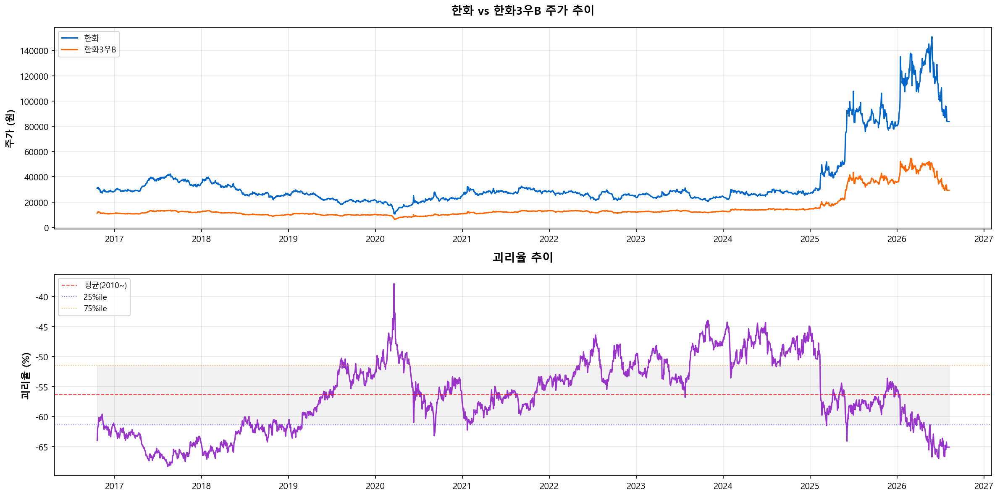

---

## 📌 LG (003550) vs LG우 (003555)

**분석 기간**: 2010-01-04 ~ 2026-08-07 (4,082일)
**전체 데이터**: 2005-09-29 ~ 2026-08-07 (5,152일) — 2010년 이전은 참고용

### 현재 상황

| 항목 | 값 |
|:----:|:---|
| LG | 108,100원 |
| LG우 | 67,200원 |
| **현재 괴리율** | **-37.84%** |
| 우선주 할인율 | 37.84% |
| 역사적 위치 | 하위 66.5% |
| Z-Score | 0.51σ |
| 종합 점수 | 10점 (±100점 만점) |
| **판정** | **⚪ 중립** |

**판정 근거:**

- ✅ 최근 30일 평균보다 1%p 이상 낮음

### 괴리율 통계 (2010년~)

| 지표 | 값 |
|:----:|:---|
| 평균 | -46.71% |
| 중간값 | -48.08% |
| 표준편차 | 17.40% |
| 최소 (우선주 최저평가) | -77.01% |
| 최대 (우선주 최고평가) | -12.16% |

| 백분위 | 괴리율 | 의미 |
|:-----:|:------:|:-----|
| 10% | -73.05% | 우선주 매우 저평가 |
| 25% | -56.52% | 우선주 저평가 |
| 50% | -48.08% | 중간값 |
| 75% | -29.57% | 우선주 고평가 |
| 90% | -23.80% | 우선주 매우 고평가 |

**📎 참고: 전체 기간 (2005-09-29~) 통계 비교**

| 지표 | 2010년 이후 | 전체 기간 |
|:----:|:----------:|:---------:|
| 평균 | -46.71% | -50.73% |
| 중간값 | -48.08% | -51.67% |
| 표준편차 | 17.40% | 17.56% |
| 최소 | -77.01% | -77.01% |
| 최대 | -12.16% | -12.16% |

### 기간별 괴리율

| 기간 | 평균 | 최소 | 최대 | 현재 대비 |
|:----:|:----:|:----:|:----:|:---------:|
| 최근 1개월 | -35.00% | -37.84% | -31.26% | -2.84%p |
| 최근 3개월 | -33.09% | -44.99% | -23.19% | -4.74%p |
| 최근 6개월 | -27.09% | -44.99% | -15.65% | -10.75%p |
| 최근 1년 | -22.77% | -44.99% | -12.16% | -15.06%p |
| 최근 3년 | -25.30% | -44.99% | -12.16% | -12.54%p |
| 최근 5년 | -30.89% | -52.96% | -12.16% | -6.95%p |

### 시장 상황별 괴리율

| 구분 | 기간 | 평균 괴리율 | 중간값 |
|:----:|:----:|:----------:|:------:|
| 상승장 | 956일 (23.4%) | -48.85% | -49.82% |
| 하락장 | 836일 (20.5%) | -47.21% | -47.27% |
| 중립장 | 2290일 (56.1%) | -45.64% | -47.83% |

### 역사적 극단값 (Top 5)

**🟦 우선주 최저평가 시점 (괴리율 최저)**

| 날짜 | LG | LG우 | 괴리율 |
|:----:|--------:|----------:|:------:|
| 2011-04-22 | 73,676원 | 16,936원 | **-77.01%** |
| 2011-04-21 | 73,158원 | 16,936원 | **-76.85%** |
| 2011-04-20 | 71,385원 | 16,775원 | **-76.50%** |
| 2011-04-25 | 73,380원 | 17,285원 | **-76.44%** |
| 2011-05-18 | 73,084원 | 17,258원 | **-76.39%** |

**🟥 보통주 최저평가 시점 (괴리율 최고)**

| 날짜 | LG | LG우 | 괴리율 |
|:----:|--------:|----------:|:------:|
| 2025-04-11 | 59,276원 | 52,067원 | **-12.16%** |
| 2025-04-10 | 58,698원 | 51,400원 | **-12.43%** |
| 2025-10-10 | 69,618원 | 60,447원 | **-13.17%** |
| 2025-04-09 | 56,385원 | 48,825원 | **-13.41%** |
| 2025-10-01 | 69,618원 | 59,963원 | **-13.87%** |

### 차트

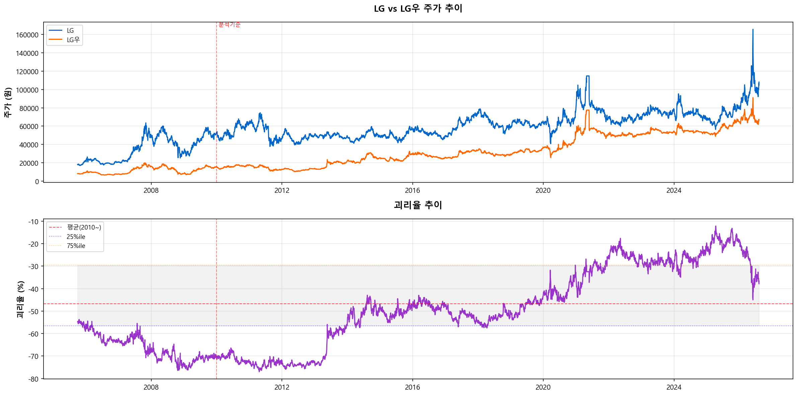

---

## 📌 GS (078930) vs GS우 (078935)

**분석 기간**: 2010-01-04 ~ 2026-08-07 (4,082일)
**전체 데이터**: 2005-09-29 ~ 2026-08-07 (5,152일) — 2010년 이전은 참고용

### 현재 상황

| 항목 | 값 |
|:----:|:---|
| GS | 98,900원 |
| GS우 | 58,900원 |
| **현재 괴리율** | **-40.44%** |
| 우선주 할인율 | 40.44% |
| 역사적 위치 | 하위 43.6% |
| Z-Score | -0.10σ |
| 종합 점수 | 10점 (±100점 만점) |
| **판정** | **⚪ 중립** |

**판정 근거:**

- ✅ 최근 30일 평균보다 1%p 이상 낮음

### 괴리율 통계 (2010년~)

| 지표 | 값 |
|:----:|:---|
| 평균 | -38.39% |
| 중간값 | -37.66% |
| 표준편차 | 20.70% |
| 최소 (우선주 최저평가) | -78.71% |
| 최대 (우선주 최고평가) | 1.02% |

| 백분위 | 괴리율 | 의미 |
|:-----:|:------:|:-----|
| 10% | -72.07% | 우선주 매우 저평가 |
| 25% | -51.10% | 우선주 저평가 |
| 50% | -37.66% | 중간값 |
| 75% | -21.03% | 우선주 고평가 |
| 90% | -13.82% | 우선주 매우 고평가 |

**📎 참고: 전체 기간 (2005-09-29~) 통계 비교**

| 지표 | 2010년 이후 | 전체 기간 |
|:----:|:----------:|:---------:|
| 평균 | -38.39% | -42.40% |
| 중간값 | -37.66% | -42.83% |
| 표준편차 | 20.70% | 20.14% |
| 최소 | -78.71% | -78.71% |
| 최대 | 1.02% | 1.02% |

### 기간별 괴리율

| 기간 | 평균 | 최소 | 최대 | 현재 대비 |
|:----:|:----:|:----:|:----:|:---------:|
| 최근 1개월 | -32.82% | -40.44% | -19.36% | -7.62%p |
| 최근 3개월 | -27.24% | -40.44% | -15.96% | -13.21%p |
| 최근 6개월 | -22.44% | -40.44% | -11.90% | -18.00%p |
| 최근 1년 | -14.49% | -40.44% | 0.36% | -25.96%p |
| 최근 3년 | -16.09% | -40.44% | 1.02% | -24.36%p |
| 최근 5년 | -19.62% | -40.44% | 1.02% | -20.82%p |

### 시장 상황별 괴리율

| 구분 | 기간 | 평균 괴리율 | 중간값 |
|:----:|:----:|:----------:|:------:|
| 상승장 | 1180일 (28.9%) | -43.13% | -43.17% |
| 하락장 | 865일 (21.2%) | -39.34% | -37.91% |
| 중립장 | 2037일 (49.9%) | -35.25% | -35.47% |

### 역사적 극단값 (Top 5)

**🟦 우선주 최저평가 시점 (괴리율 최저)**

| 날짜 | GS | GS우 | 괴리율 |
|:----:|--------:|----------:|:------:|
| 2011-04-21 | 57,127원 | 12,160원 | **-78.71%** |
| 2011-03-29 | 53,799원 | 11,500원 | **-78.62%** |
| 2011-04-25 | 56,018원 | 12,011원 | **-78.56%** |
| 2011-04-22 | 55,741원 | 12,011원 | **-78.45%** |
| 2011-04-07 | 52,524원 | 11,372원 | **-78.35%** |

**🟥 보통주 최저평가 시점 (괴리율 최고)**

| 날짜 | GS | GS우 | 괴리율 |
|:----:|--------:|----------:|:------:|
| 2024-07-26 | 42,470원 | 42,905원 | **1.02%** |
| 2025-02-28 | 34,575원 | 34,699원 | **0.36%** |
| 2025-03-04 | 34,239원 | 34,176원 | **-0.18%** |
| 2025-03-05 | 34,287원 | 34,176원 | **-0.32%** |
| 2025-04-09 | 33,472원 | 33,178원 | **-0.88%** |

### 차트

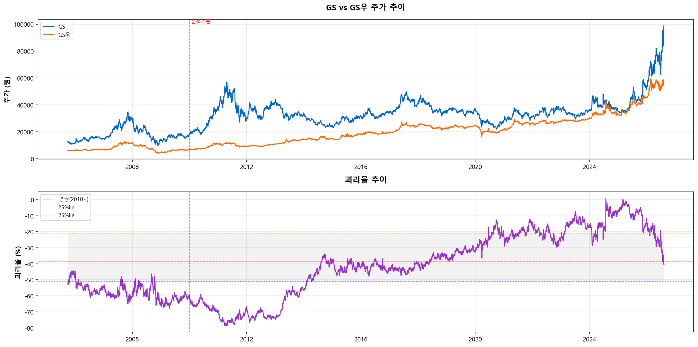

---

## 📌 두산 (000150) vs 두산우 (000155)

**분석 기간**: 2010-01-04 ~ 2026-08-07 (4,082일)
**전체 데이터**: 2000-01-04 ~ 2026-08-07 (6,649일) — 2010년 이전은 참고용

### 현재 상황

| 항목 | 값 |
|:----:|:---|
| 두산 | 1,191,000원 |
| 두산우 | 436,000원 |
| **현재 괴리율** | **-63.39%** |
| 우선주 할인율 | 63.39% |
| 역사적 위치 | 하위 26.2% |
| Z-Score | -0.70σ |
| 종합 점수 | -10점 (±100점 만점) |
| **판정** | **⚪ 중립** |

**판정 근거:**

- ❌ 최근 30일 평균보다 1%p 이상 높음

### 괴리율 통계 (2010년~)

| 지표 | 값 |
|:----:|:---|
| 평균 | -50.19% |
| 중간값 | -46.84% |
| 표준편차 | 18.81% |
| 최소 (우선주 최저평가) | -84.18% |
| 최대 (우선주 최고평가) | 2.80% |

| 백분위 | 괴리율 | 의미 |
|:-----:|:------:|:-----|
| 10% | -79.48% | 우선주 매우 저평가 |
| 25% | -65.44% | 우선주 저평가 |
| 50% | -46.84% | 중간값 |
| 75% | -37.43% | 우선주 고평가 |
| 90% | -27.18% | 우선주 매우 고평가 |

**📎 참고: 전체 기간 (2000-01-04~) 통계 비교**

| 지표 | 2010년 이후 | 전체 기간 |
|:----:|:----------:|:---------:|
| 평균 | -50.19% | -59.87% |
| 중간값 | -46.84% | -67.40% |
| 표준편차 | 18.81% | 19.42% |
| 최소 | -84.18% | -89.30% |
| 최대 | 2.80% | 2.80% |

### 기간별 괴리율

| 기간 | 평균 | 최소 | 최대 | 현재 대비 |
|:----:|:----:|:----:|:----:|:---------:|
| 최근 1개월 | -64.95% | -66.73% | -59.44% | +1.56%p |
| 최근 3개월 | -62.78% | -70.41% | -53.90% | -0.61%p |
| 최근 6개월 | -53.53% | -70.41% | -35.25% | -9.86%p |
| 최근 1년 | -47.82% | -70.41% | -22.69% | -15.57%p |
| 최근 3년 | -45.59% | -70.41% | -15.67% | -17.80%p |
| 최근 5년 | -37.75% | -70.41% | 2.80% | -25.64%p |

### 시장 상황별 괴리율

| 구분 | 기간 | 평균 괴리율 | 중간값 |
|:----:|:----:|:----------:|:------:|
| 상승장 | 1449일 (35.5%) | -52.32% | -49.51% |
| 하락장 | 1073일 (26.3%) | -44.27% | -41.55% |
| 중립장 | 1560일 (38.2%) | -52.29% | -47.79% |

### 역사적 극단값 (Top 5)

**🟦 우선주 최저평가 시점 (괴리율 최저)**

| 날짜 | 두산 | 두산우 | 괴리율 |
|:----:|--------:|----------:|:------:|
| 2012-02-09 | 119,456원 | 18,901원 | **-84.18%** |
| 2012-02-06 | 118,030원 | 18,901원 | **-83.99%** |
| 2012-02-10 | 117,317원 | 18,953원 | **-83.84%** |
| 2012-02-03 | 116,960원 | 18,901원 | **-83.84%** |
| 2012-02-15 | 119,100원 | 19,290원 | **-83.80%** |

**🟥 보통주 최저평가 시점 (괴리율 최고)**

| 날짜 | 두산 | 두산우 | 괴리율 |
|:----:|--------:|----------:|:------:|
| 2020-06-18 | 37,870원 | 38,929원 | **2.80%** |
| 2020-03-26 | 33,079원 | 32,229원 | **-2.57%** |
| 2020-03-18 | 29,283원 | 28,285원 | **-3.41%** |
| 2020-06-19 | 36,604원 | 35,324원 | **-3.50%** |
| 2020-06-17 | 38,457원 | 36,554원 | **-4.95%** |

### 차트

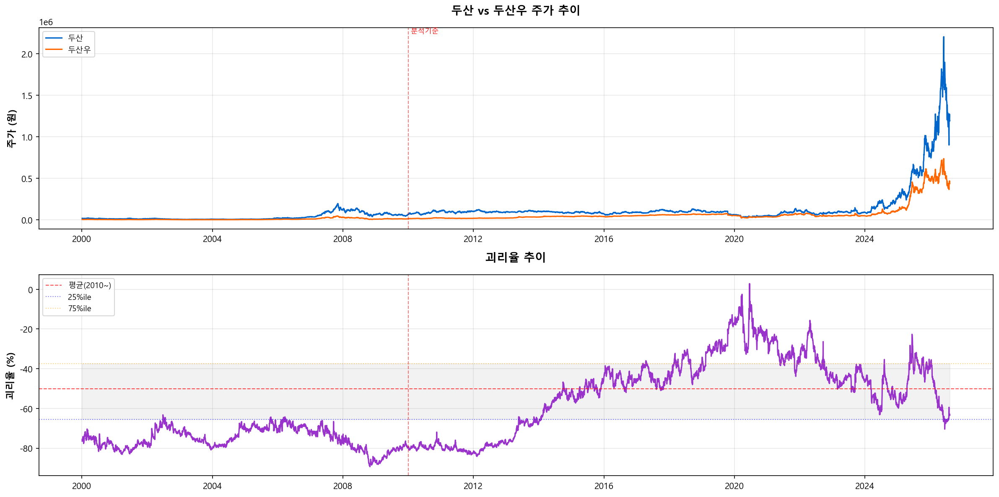

---

## 📌 아모레퍼시픽 (090430) vs 아모레퍼시픽우 (090435)

**분석 기간**: 2010-01-04 ~ 2026-08-07 (4,082일)
**전체 데이터**: 2006-06-29 ~ 2026-08-07 (4,963일) — 2010년 이전은 참고용

### 현재 상황

| 항목 | 값 |
|:----:|:---|
| 아모레퍼시픽 | 141,800원 |
| 아모레퍼시픽우 | 46,500원 |
| **현재 괴리율** | **-67.21%** |
| 우선주 할인율 | 67.21% |
| 역사적 위치 | 하위 42.6% |
| Z-Score | -0.36σ |
| 종합 점수 | 0점 (±100점 만점) |
| **판정** | **⚪ 중립** |

### 괴리율 통계 (2010년~)

| 지표 | 값 |
|:----:|:---|
| 평균 | -63.58% |
| 중간값 | -65.74% |
| 표준편차 | 10.19% |
| 최소 (우선주 최저평가) | -81.90% |
| 최대 (우선주 최고평가) | -39.31% |

| 백분위 | 괴리율 | 의미 |
|:-----:|:------:|:-----|
| 10% | -76.65% | 우선주 매우 저평가 |
| 25% | -71.98% | 우선주 저평가 |
| 50% | -65.74% | 중간값 |
| 75% | -54.50% | 우선주 고평가 |
| 90% | -49.01% | 우선주 매우 고평가 |

**📎 참고: 전체 기간 (2006-06-29~) 통계 비교**

| 지표 | 2010년 이후 | 전체 기간 |
|:----:|:----------:|:---------:|
| 평균 | -63.58% | -65.32% |
| 중간값 | -65.74% | -66.96% |
| 표준편차 | 10.19% | 10.43% |
| 최소 | -81.90% | -87.29% |
| 최대 | -39.31% | -39.31% |

### 기간별 괴리율

| 기간 | 평균 | 최소 | 최대 | 현재 대비 |
|:----:|:----:|:----:|:----:|:---------:|
| 최근 1개월 | -66.59% | -68.66% | -64.05% | -0.62%p |
| 최근 3개월 | -65.92% | -68.92% | -63.23% | -1.28%p |
| 최근 6개월 | -65.25% | -68.92% | -62.39% | -1.96%p |
| 최근 1년 | -66.72% | -71.99% | -62.39% | -0.48%p |
| 최근 3년 | -68.06% | -75.83% | -51.56% | +0.86%p |
| 최근 5년 | -65.63% | -75.83% | -46.91% | -1.58%p |

### 시장 상황별 괴리율

| 구분 | 기간 | 평균 괴리율 | 중간값 |
|:----:|:----:|:----------:|:------:|
| 상승장 | 1307일 (32.0%) | -64.12% | -65.26% |
| 하락장 | 1234일 (30.2%) | -61.85% | -64.50% |
| 중립장 | 1541일 (37.8%) | -64.50% | -66.41% |

### 역사적 극단값 (Top 5)

**🟦 우선주 최저평가 시점 (괴리율 최저)**

| 날짜 | 아모레퍼시픽 | 아모레퍼시픽우 | 괴리율 |
|:----:|--------:|----------:|:------:|
| 2011-10-27 | 118,892원 | 21,517원 | **-81.90%** |
| 2011-10-05 | 114,761원 | 21,201원 | **-81.53%** |
| 2011-10-25 | 111,364원 | 20,609원 | **-81.49%** |
| 2011-06-02 | 118,066원 | 21,912원 | **-81.44%** |
| 2011-10-06 | 117,331원 | 21,833원 | **-81.39%** |

**🟥 보통주 최저평가 시점 (괴리율 최고)**

| 날짜 | 아모레퍼시픽 | 아모레퍼시픽우 | 괴리율 |
|:----:|--------:|----------:|:------:|
| 2017-05-02 | 273,856원 | 166,209원 | **-39.31%** |
| 2017-05-04 | 296,086원 | 178,600원 | **-39.68%** |
| 2017-01-09 | 282,370원 | 168,345원 | **-40.38%** |
| 2017-04-28 | 276,221원 | 162,364원 | **-41.22%** |
| 2017-05-08 | 315,006원 | 185,009원 | **-41.27%** |

### 차트

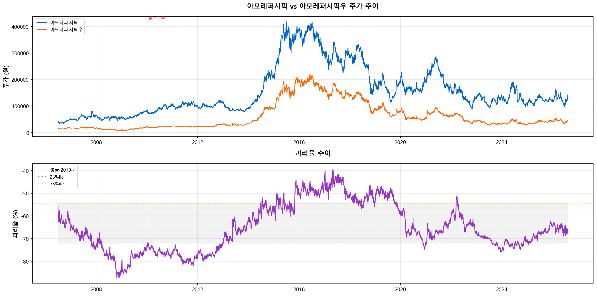

---

## 📌 LG화학 (051910) vs LG화학우 (051915)

**분석 기간**: 2010-01-04 ~ 2026-08-07 (4,082일)
**전체 데이터**: 2005-09-29 ~ 2026-08-07 (5,152일) — 2010년 이전은 참고용

### 현재 상황

| 항목 | 값 |
|:----:|:---|
| LG화학 | 276,000원 |
| LG화학우 | 128,500원 |
| **현재 괴리율** | **-53.44%** |
| 우선주 할인율 | 53.44% |
| 역사적 위치 | 하위 39.9% |
| Z-Score | -0.16σ |
| 종합 점수 | 0점 (±100점 만점) |
| **판정** | **⚪ 중립** |

### 괴리율 통계 (2010년~)

| 지표 | 값 |
|:----:|:---|
| 평균 | -51.50% |
| 중간값 | -50.60% |
| 표준편차 | 12.48% |
| 최소 (우선주 최저평가) | -75.07% |
| 최대 (우선주 최고평가) | -24.75% |

| 백분위 | 괴리율 | 의미 |
|:-----:|:------:|:-----|
| 10% | -71.57% | 우선주 매우 저평가 |
| 25% | -57.53% | 우선주 저평가 |
| 50% | -50.60% | 중간값 |
| 75% | -40.77% | 우선주 고평가 |
| 90% | -35.55% | 우선주 매우 고평가 |

**📎 참고: 전체 기간 (2005-09-29~) 통계 비교**

| 지표 | 2010년 이후 | 전체 기간 |
|:----:|:----------:|:---------:|
| 평균 | -51.50% | -53.89% |
| 중간값 | -50.60% | -53.31% |
| 표준편차 | 12.48% | 12.56% |
| 최소 | -75.07% | -75.07% |
| 최대 | -24.75% | -24.75% |

### 기간별 괴리율

| 기간 | 평균 | 최소 | 최대 | 현재 대비 |
|:----:|:----:|:----:|:----:|:---------:|
| 최근 1개월 | -53.01% | -55.10% | -48.60% | -0.43%p |
| 최근 3개월 | -52.91% | -55.29% | -48.60% | -0.53%p |
| 최근 6개월 | -51.65% | -55.29% | -47.58% | -1.79%p |
| 최근 1년 | -51.12% | -55.29% | -44.85% | -2.32%p |
| 최근 3년 | -46.45% | -59.07% | -29.16% | -6.99%p |
| 최근 5년 | -49.16% | -60.34% | -29.16% | -4.28%p |

### 시장 상황별 괴리율

| 구분 | 기간 | 평균 괴리율 | 중간값 |
|:----:|:----:|:----------:|:------:|
| 상승장 | 1267일 (31.0%) | -53.31% | -52.66% |
| 하락장 | 1207일 (29.6%) | -48.63% | -48.12% |
| 중립장 | 1608일 (39.4%) | -52.23% | -50.16% |

### 역사적 극단값 (Top 5)

**🟦 우선주 최저평가 시점 (괴리율 최저)**

| 날짜 | LG화학 | LG화학우 | 괴리율 |
|:----:|--------:|----------:|:------:|
| 2012-04-16 | 301,157원 | 75,089원 | **-75.07%** |
| 2012-04-17 | 296,165원 | 74,381원 | **-74.89%** |
| 2012-04-13 | 307,396원 | 77,214원 | **-74.88%** |
| 2012-07-11 | 253,321원 | 63,897원 | **-74.78%** |
| 2012-10-02 | 279,527원 | 70,555원 | **-74.76%** |

**🟥 보통주 최저평가 시점 (괴리율 최고)**

| 날짜 | LG화학 | LG화학우 | 괴리율 |
|:----:|--------:|----------:|:------:|
| 2014-12-02 | 166,026원 | 124,938원 | **-24.75%** |
| 2014-11-05 | 148,527원 | 111,309원 | **-25.06%** |
| 2014-12-04 | 169,014원 | 123,803원 | **-26.75%** |
| 2014-12-03 | 167,307원 | 122,288원 | **-26.91%** |
| 2014-11-07 | 160,905원 | 116,988원 | **-27.29%** |

### 차트

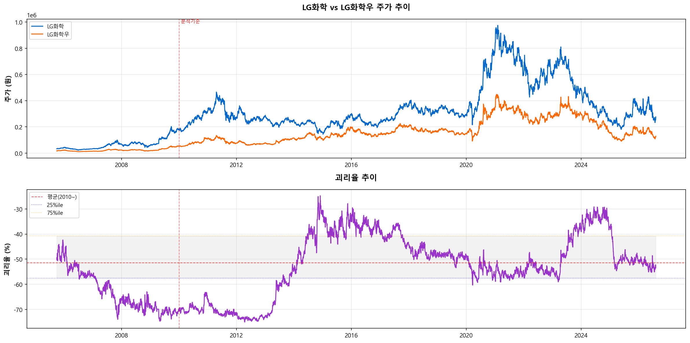

---

## 📌 삼성SDI (006400) vs 삼성SDI우 (006405)

**분석 기간**: 2010-01-04 ~ 2026-08-07 (4,082일)
**전체 데이터**: 2005-09-29 ~ 2026-08-07 (5,152일) — 2010년 이전은 참고용

### 현재 상황

| 항목 | 값 |
|:----:|:---|
| 삼성SDI | 459,000원 |
| 삼성SDI우 | 207,500원 |
| **현재 괴리율** | **-54.79%** |
| 우선주 할인율 | 54.79% |
| 역사적 위치 | 하위 43.1% |
| Z-Score | -0.19σ |
| 종합 점수 | -10점 (±100점 만점) |
| **판정** | **⚪ 중립** |

**판정 근거:**

- ❌ 최근 30일 평균보다 1%p 이상 높음

### 괴리율 통계 (2010년~)

| 지표 | 값 |
|:----:|:---|
| 평균 | -52.77% |
| 중간값 | -51.96% |
| 표준편차 | 10.69% |
| 최소 (우선주 최저평가) | -72.87% |
| 최대 (우선주 최고평가) | -23.65% |

| 백분위 | 괴리율 | 의미 |
|:-----:|:------:|:-----|
| 10% | -67.69% | 우선주 매우 저평가 |
| 25% | -62.14% | 우선주 저평가 |
| 50% | -51.96% | 중간값 |
| 75% | -44.24% | 우선주 고평가 |
| 90% | -38.73% | 우선주 매우 고평가 |

**📎 참고: 전체 기간 (2005-09-29~) 통계 비교**

| 지표 | 2010년 이후 | 전체 기간 |
|:----:|:----------:|:---------:|
| 평균 | -52.77% | -52.95% |
| 중간값 | -51.96% | -52.11% |
| 표준편차 | 10.69% | 10.36% |
| 최소 | -72.87% | -72.87% |
| 최대 | -23.65% | -23.65% |

### 기간별 괴리율

| 기간 | 평균 | 최소 | 최대 | 현재 대비 |
|:----:|:----:|:----:|:----:|:---------:|
| 최근 1개월 | -55.79% | -58.35% | -53.42% | +1.00%p |
| 최근 3개월 | -53.33% | -58.35% | -48.28% | -1.47%p |
| 최근 6개월 | -48.01% | -58.35% | -37.38% | -6.78%p |
| 최근 1년 | -43.25% | -58.35% | -32.82% | -11.55%p |
| 최근 3년 | -45.89% | -58.35% | -32.82% | -8.90%p |
| 최근 5년 | -46.98% | -63.81% | -23.65% | -7.81%p |

### 시장 상황별 괴리율

| 구분 | 기간 | 평균 괴리율 | 중간값 |
|:----:|:----:|:----------:|:------:|
| 상승장 | 1365일 (33.4%) | -52.88% | -53.07% |
| 하락장 | 1175일 (28.8%) | -49.63% | -48.10% |
| 중립장 | 1542일 (37.8%) | -55.07% | -55.79% |

### 역사적 극단값 (Top 5)

**🟦 우선주 최저평가 시점 (괴리율 최저)**

| 날짜 | 삼성SDI | 삼성SDI우 | 괴리율 |
|:----:|--------:|----------:|:------:|
| 2012-08-20 | 141,303원 | 38,343원 | **-72.87%** |
| 2012-05-15 | 155,760원 | 42,906원 | **-72.45%** |
| 2012-08-21 | 138,505원 | 38,343원 | **-72.32%** |
| 2012-08-22 | 137,572원 | 38,257원 | **-72.19%** |
| 2012-05-21 | 145,967원 | 40,816원 | **-72.04%** |

**🟥 보통주 최저평가 시점 (괴리율 최고)**

| 날짜 | 삼성SDI | 삼성SDI우 | 괴리율 |
|:----:|--------:|----------:|:------:|
| 2021-01-27 | 781,721원 | 596,871원 | **-23.65%** |
| 2021-01-28 | 759,924원 | 573,311원 | **-24.56%** |
| 2021-03-17 | 633,105원 | 465,324원 | **-26.50%** |
| 2021-03-18 | 655,893원 | 481,522원 | **-26.59%** |
| 2020-06-11 | 383,254원 | 279,723원 | **-27.01%** |

### 차트

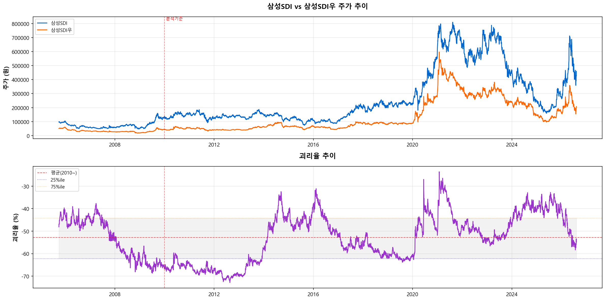

---

## 📌 LG전자 (066570) vs LG전자우 (066575)

**분석 기간**: 2010-01-04 ~ 2026-08-07 (4,082일)
**전체 데이터**: 2005-09-29 ~ 2026-08-07 (5,152일) — 2010년 이전은 참고용

### 현재 상황

| 항목 | 값 |
|:----:|:---|
| LG전자 | 185,000원 |
| LG전자우 | 65,600원 |
| **현재 괴리율** | **-64.54%** |
| 우선주 할인율 | 64.54% |
| 역사적 위치 | 하위 26.6% |
| Z-Score | -0.59σ |
| 종합 점수 | 0점 (±100점 만점) |
| **판정** | **⚪ 중립** |

### 괴리율 통계 (2010년~)

| 지표 | 값 |
|:----:|:---|
| 평균 | -60.33% |
| 중간값 | -59.12% |
| 표준편차 | 7.19% |
| 최소 (우선주 최저평가) | -77.93% |
| 최대 (우선주 최고평가) | -40.47% |

| 백분위 | 괴리율 | 의미 |
|:-----:|:------:|:-----|
| 10% | -69.91% | 우선주 매우 저평가 |
| 25% | -64.96% | 우선주 저평가 |
| 50% | -59.12% | 중간값 |
| 75% | -54.58% | 우선주 고평가 |
| 90% | -51.95% | 우선주 매우 고평가 |

**📎 참고: 전체 기간 (2005-09-29~) 통계 비교**

| 지표 | 2010년 이후 | 전체 기간 |
|:----:|:----------:|:---------:|
| 평균 | -60.33% | -59.75% |
| 중간값 | -59.12% | -58.96% |
| 표준편차 | 7.19% | 7.20% |
| 최소 | -77.93% | -77.93% |
| 최대 | -40.47% | -40.47% |

### 기간별 괴리율

| 기간 | 평균 | 최소 | 최대 | 현재 대비 |
|:----:|:----:|:----:|:----:|:---------:|
| 최근 1개월 | -63.66% | -64.78% | -62.20% | -0.88%p |
| 최근 3개월 | -61.75% | -70.11% | -54.39% | -2.79%p |
| 최근 6개월 | -55.86% | -70.11% | -42.96% | -8.68%p |
| 최근 1년 | -53.45% | -70.11% | -40.47% | -11.10%p |
| 최근 3년 | -54.58% | -70.11% | -40.47% | -9.96%p |
| 최근 5년 | -56.73% | -70.11% | -40.47% | -7.81%p |

### 시장 상황별 괴리율

| 구분 | 기간 | 평균 괴리율 | 중간값 |
|:----:|:----:|:----------:|:------:|
| 상승장 | 1224일 (30.0%) | -61.05% | -60.19% |
| 하락장 | 1175일 (28.8%) | -60.03% | -59.54% |
| 중립장 | 1683일 (41.2%) | -60.02% | -58.05% |

### 역사적 극단값 (Top 5)

**🟦 우선주 최저평가 시점 (괴리율 최저)**

| 날짜 | LG전자 | LG전자우 | 괴리율 |
|:----:|--------:|----------:|:------:|
| 2012-10-25 | 66,108원 | 14,593원 | **-77.93%** |
| 2012-10-19 | 65,750원 | 14,555원 | **-77.86%** |
| 2012-10-29 | 67,092원 | 14,861원 | **-77.85%** |
| 2012-10-23 | 65,302원 | 14,478원 | **-77.83%** |
| 2012-10-26 | 65,302원 | 14,555원 | **-77.71%** |

**🟥 보통주 최저평가 시점 (괴리율 최고)**

| 날짜 | LG전자 | LG전자우 | 괴리율 |
|:----:|--------:|----------:|:------:|
| 2025-11-07 | 87,630원 | 52,167원 | **-40.47%** |
| 2025-11-06 | 91,004원 | 52,854원 | **-41.92%** |
| 2025-11-10 | 88,920원 | 51,282원 | **-42.33%** |
| 2025-11-13 | 91,798원 | 52,363원 | **-42.96%** |
| 2025-11-11 | 89,912원 | 51,184원 | **-43.07%** |

### 차트

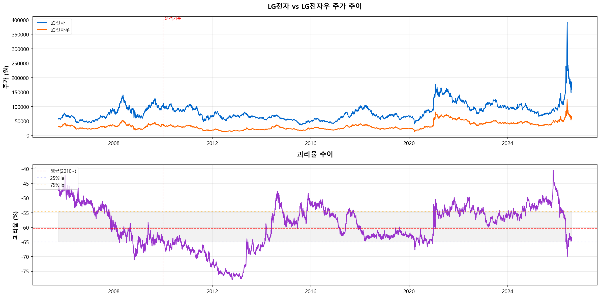

---

## 📌 삼성화재 (000810) vs 삼성화재우 (000815)

**분석 기간**: 2010-01-04 ~ 2026-08-07 (4,082일)
**전체 데이터**: 2005-09-29 ~ 2026-08-07 (5,152일) — 2010년 이전은 참고용

### 현재 상황

| 항목 | 값 |
|:----:|:---|
| 삼성화재 | 645,000원 |
| 삼성화재우 | 403,500원 |
| **현재 괴리율** | **-37.44%** |
| 우선주 할인율 | 37.44% |
| 역사적 위치 | 하위 58.1% |
| Z-Score | 0.36σ |
| 종합 점수 | 0점 (±100점 만점) |
| **판정** | **⚪ 중립** |

### 괴리율 통계 (2010년~)

| 지표 | 값 |
|:----:|:---|
| 평균 | -43.32% |
| 중간값 | -40.97% |
| 표준편차 | 16.15% |
| 최소 (우선주 최저평가) | -75.65% |
| 최대 (우선주 최고평가) | -14.33% |

| 백분위 | 괴리율 | 의미 |
|:-----:|:------:|:-----|
| 10% | -70.41% | 우선주 매우 저평가 |
| 25% | -52.31% | 우선주 저평가 |
| 50% | -40.97% | 중간값 |
| 75% | -28.74% | 우선주 고평가 |
| 90% | -25.18% | 우선주 매우 고평가 |

**📎 참고: 전체 기간 (2005-09-29~) 통계 비교**

| 지표 | 2010년 이후 | 전체 기간 |
|:----:|:----------:|:---------:|
| 평균 | -43.32% | -48.27% |
| 중간값 | -40.97% | -44.60% |
| 표준편차 | 16.15% | 17.48% |
| 최소 | -75.65% | -80.28% |
| 최대 | -14.33% | -14.33% |

### 기간별 괴리율

| 기간 | 평균 | 최소 | 최대 | 현재 대비 |
|:----:|:----:|:----:|:----:|:---------:|
| 최근 1개월 | -37.58% | -41.87% | -34.14% | +0.14%p |
| 최근 3개월 | -31.15% | -43.63% | -17.62% | -6.30%p |
| 최근 6개월 | -27.53% | -43.63% | -14.33% | -9.91%p |
| 최근 1년 | -26.65% | -43.63% | -14.33% | -10.79%p |
| 최근 3년 | -26.61% | -43.63% | -14.33% | -10.83%p |
| 최근 5년 | -29.16% | -43.63% | -14.33% | -8.28%p |

### 시장 상황별 괴리율

| 구분 | 기간 | 평균 괴리율 | 중간값 |
|:----:|:----:|:----------:|:------:|
| 상승장 | 891일 (21.8%) | -41.03% | -36.13% |
| 하락장 | 527일 (12.9%) | -43.42% | -38.19% |
| 중립장 | 2664일 (65.3%) | -44.07% | -42.14% |

### 역사적 극단값 (Top 5)

**🟦 우선주 최저평가 시점 (괴리율 최저)**

| 날짜 | 삼성화재 | 삼성화재우 | 괴리율 |
|:----:|--------:|----------:|:------:|
| 2011-10-25 | 137,503원 | 33,479원 | **-75.65%** |
| 2011-10-31 | 141,059원 | 34,360원 | **-75.64%** |
| 2011-11-01 | 141,948원 | 34,592원 | **-75.63%** |
| 2012-06-01 | 130,266원 | 31,975원 | **-75.45%** |
| 2012-05-14 | 138,106원 | 33,922원 | **-75.44%** |

**🟥 보통주 최저평가 시점 (괴리율 최고)**

| 날짜 | 삼성화재 | 삼성화재우 | 괴리율 |
|:----:|--------:|----------:|:------:|
| 2026-03-27 | 443,000원 | 379,500원 | **-14.33%** |
| 2026-03-26 | 453,000원 | 377,500원 | **-16.67%** |
| 2026-03-23 | 437,373원 | 361,585원 | **-17.33%** |
| 2026-03-20 | 455,617원 | 375,858원 | **-17.51%** |
| 2026-03-30 | 445,500원 | 367,000원 | **-17.62%** |

### 차트

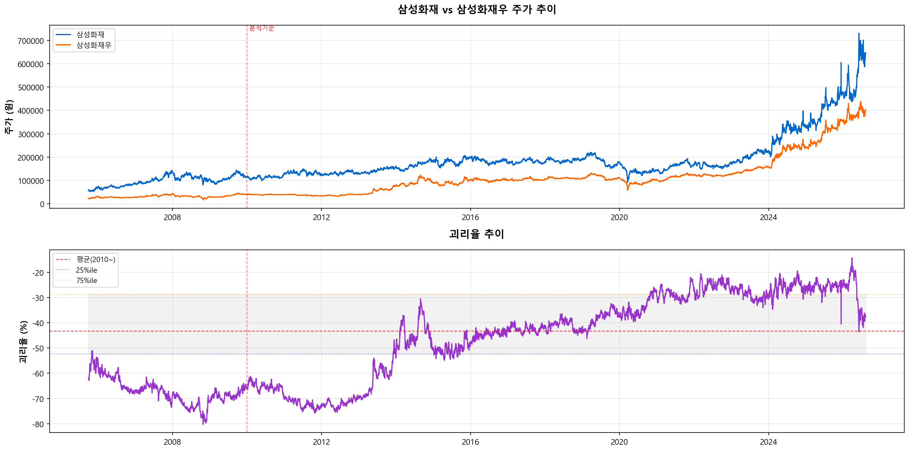

---

## 📌 S-Oil (010950) vs S-Oil우 (010955)

**분석 기간**: 2010-01-04 ~ 2026-08-07 (4,082일)
**전체 데이터**: 2000-01-04 ~ 2026-08-07 (6,649일) — 2010년 이전은 참고용

### 현재 상황

| 항목 | 값 |
|:----:|:---|
| S-Oil | 137,600원 |
| S-Oil우 | 65,800원 |
| **현재 괴리율** | **-52.18%** |
| 우선주 할인율 | 52.18% |
| 역사적 위치 | 하위 9.1% |
| Z-Score | -1.28σ |
| 종합 점수 | 70점 (±100점 만점) |
| **판정** | **🟦 우선주 강력 매수** |

**판정 근거:**

- ✅ 역사적 하위 10% (우선주 매우 저평가)
- ✅ 평균 대비 1.0σ 이상 낮음
- ✅ 최근 30일 평균보다 1%p 이상 낮음

### 괴리율 통계 (2010년~)

| 지표 | 값 |
|:----:|:---|
| 평균 | -40.33% |
| 중간값 | -40.65% |
| 표준편차 | 9.28% |
| 최소 (우선주 최저평가) | -64.19% |
| 최대 (우선주 최고평가) | -17.62% |

| 백분위 | 괴리율 | 의미 |
|:-----:|:------:|:-----|
| 10% | -51.37% | 우선주 매우 저평가 |
| 25% | -46.69% | 우선주 저평가 |
| 50% | -40.65% | 중간값 |
| 75% | -33.66% | 우선주 고평가 |
| 90% | -27.76% | 우선주 매우 고평가 |

**📎 참고: 전체 기간 (2000-01-04~) 통계 비교**

| 지표 | 2010년 이후 | 전체 기간 |
|:----:|:----------:|:---------:|
| 평균 | -40.33% | -41.32% |
| 중간값 | -40.65% | -41.33% |
| 표준편차 | 9.28% | 9.15% |
| 최소 | -64.19% | -67.72% |
| 최대 | -17.62% | 34.47% |

### 기간별 괴리율

| 기간 | 평균 | 최소 | 최대 | 현재 대비 |
|:----:|:----:|:----:|:----:|:---------:|
| 최근 1개월 | -50.64% | -53.90% | -43.78% | -1.54%p |
| 최근 3개월 | -51.01% | -54.35% | -43.78% | -1.17%p |
| 최근 6개월 | -48.33% | -56.50% | -40.43% | -3.85%p |
| 최근 1년 | -41.40% | -56.50% | -30.97% | -10.78%p |
| 최근 3년 | -36.69% | -56.50% | -24.34% | -15.49%p |
| 최근 5년 | -39.62% | -56.50% | -24.34% | -12.56%p |

### 시장 상황별 괴리율

| 구분 | 기간 | 평균 괴리율 | 중간값 |
|:----:|:----:|:----------:|:------:|
| 상승장 | 1361일 (33.3%) | -43.78% | -44.94% |
| 하락장 | 1127일 (27.6%) | -37.98% | -37.03% |
| 중립장 | 1594일 (39.0%) | -39.05% | -38.81% |

### 역사적 극단값 (Top 5)

**🟦 우선주 최저평가 시점 (괴리율 최저)**

| 날짜 | S-Oil | S-Oil우 | 괴리율 |
|:----:|--------:|----------:|:------:|
| 2011-07-27 | 110,438원 | 39,549원 | **-64.19%** |
| 2011-07-28 | 109,748원 | 39,436원 | **-64.07%** |
| 2011-07-26 | 109,748원 | 39,606원 | **-63.91%** |
| 2011-08-03 | 106,642원 | 38,811원 | **-63.61%** |
| 2011-08-01 | 108,022원 | 39,322원 | **-63.60%** |

**🟥 보통주 최저평가 시점 (괴리율 최고)**

| 날짜 | S-Oil | S-Oil우 | 괴리율 |
|:----:|--------:|----------:|:------:|
| 2018-07-03 | 89,651원 | 73,855원 | **-17.62%** |
| 2018-05-11 | 92,672원 | 76,083원 | **-17.90%** |
| 2018-05-14 | 92,672원 | 76,083원 | **-17.90%** |
| 2018-05-10 | 92,672원 | 76,002원 | **-17.99%** |
| 2018-05-30 | 92,672원 | 76,002원 | **-17.99%** |

### 차트

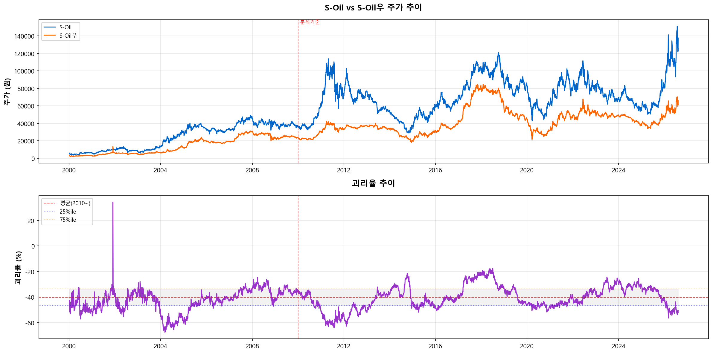

---

## 📌 대한항공 (003490) vs 대한항공우 (003495)

**분석 기간**: 2010-01-04 ~ 2026-08-07 (4,082일)
**전체 데이터**: 2005-09-29 ~ 2026-08-07 (5,152일) — 2010년 이전은 참고용

### 현재 상황

| 항목 | 값 |
|:----:|:---|
| 대한항공 | 27,150원 |
| 대한항공우 | 21,400원 |
| **현재 괴리율** | **-21.18%** |
| 우선주 할인율 | 21.18% |
| 역사적 위치 | 하위 56.1% |
| Z-Score | -0.12σ |
| 종합 점수 | 10점 (±100점 만점) |
| **판정** | **⚪ 중립** |

**판정 근거:**

- ✅ 최근 30일 평균보다 1%p 이상 낮음

### 괴리율 통계 (2010년~)

| 지표 | 값 |
|:----:|:---|
| 평균 | -17.07% |
| 중간값 | -31.11% |
| 표준편차 | 34.08% |
| 최소 (우선주 최저평가) | -65.08% |
| 최대 (우선주 최고평가) | 140.76% |

| 백분위 | 괴리율 | 의미 |
|:-----:|:------:|:-----|
| 10% | -56.93% | 우선주 매우 저평가 |
| 25% | -41.83% | 우선주 저평가 |
| 50% | -31.11% | 중간값 |
| 75% | 9.70% | 우선주 고평가 |
| 90% | 29.38% | 우선주 매우 고평가 |

**📎 참고: 전체 기간 (2005-09-29~) 통계 비교**

| 지표 | 2010년 이후 | 전체 기간 |
|:----:|:----------:|:---------:|
| 평균 | -17.07% | -21.88% |
| 중간값 | -31.11% | -33.07% |
| 표준편차 | 34.08% | 32.28% |
| 최소 | -65.08% | -65.08% |
| 최대 | 140.76% | 140.76% |

### 기간별 괴리율

| 기간 | 평균 | 최소 | 최대 | 현재 대비 |
|:----:|:----:|:----:|:----:|:---------:|
| 최근 1개월 | -18.41% | -22.81% | -12.65% | -2.77%p |
| 최근 3개월 | -12.84% | -23.37% | 0.22% | -8.34%p |
| 최근 6개월 | -5.53% | -23.37% | 12.48% | -15.65%p |
| 최근 1년 | -2.50% | -23.37% | 22.18% | -18.68%p |
| 최근 3년 | 8.92% | -23.37% | 34.63% | -30.10%p |
| 최근 5년 | 15.57% | -41.64% | 140.76% | -36.75%p |

### 시장 상황별 괴리율

| 구분 | 기간 | 평균 괴리율 | 중간값 |
|:----:|:----:|:----------:|:------:|
| 상승장 | 1112일 (27.2%) | -17.78% | -36.31% |
| 하락장 | 1105일 (27.1%) | -22.29% | -31.63% |
| 중립장 | 1865일 (45.7%) | -13.55% | -10.83% |

### 역사적 극단값 (Top 5)

**🟦 우선주 최저평가 시점 (괴리율 최저)**

| 날짜 | 대한항공 | 대한항공우 | 괴리율 |
|:----:|--------:|----------:|:------:|
| 2012-07-06 | 30,430원 | 10,627원 | **-65.08%** |
| 2012-07-10 | 30,253원 | 10,585원 | **-65.01%** |
| 2012-07-05 | 30,371원 | 10,627원 | **-65.01%** |
| 2012-07-11 | 29,900원 | 10,501원 | **-64.88%** |
| 2012-07-19 | 30,488원 | 10,754원 | **-64.73%** |

**🟥 보통주 최저평가 시점 (괴리율 최고)**

| 날짜 | 대한항공 | 대한항공우 | 괴리율 |
|:----:|--------:|----------:|:------:|
| 2020-12-02 | 18,233원 | 43,899원 | **140.76%** |
| 2020-12-03 | 18,374원 | 43,327원 | **135.80%** |
| 2020-12-01 | 18,586원 | 43,459원 | **133.83%** |
| 2020-12-04 | 18,445원 | 41,962원 | **127.50%** |
| 2020-12-08 | 18,833원 | 42,270원 | **124.45%** |

### 차트

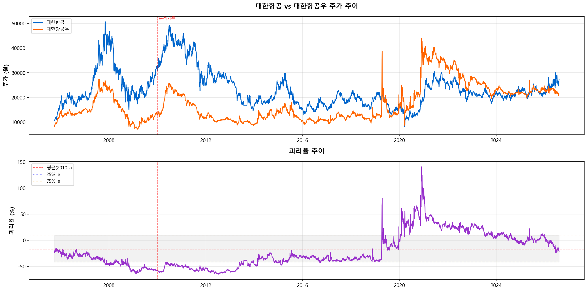

---

## 📌 유한양행 (000100) vs 유한양행우 (000105)

**분석 기간**: 2010-01-04 ~ 2026-08-07 (4,082일)
**전체 데이터**: 2005-09-29 ~ 2026-08-07 (5,152일) — 2010년 이전은 참고용

### 현재 상황

| 항목 | 값 |
|:----:|:---|
| 유한양행 | 80,600원 |
| 유한양행우 | 66,300원 |
| **현재 괴리율** | **-17.74%** |
| 우선주 할인율 | 17.74% |
| 역사적 위치 | 하위 19.2% |
| Z-Score | -1.04σ |
| 종합 점수 | 55점 (±100점 만점) |
| **판정** | **🟦 우선주 강력 매수** |

**판정 근거:**

- ✅ 역사적 하위 25% (우선주 저평가)
- ✅ 평균 대비 1.0σ 이상 낮음
- ✅ 최근 30일 평균보다 1%p 이상 낮음

### 괴리율 통계 (2010년~)

| 지표 | 값 |
|:----:|:---|
| 평균 | 1.03% |
| 중간값 | 4.38% |
| 표준편차 | 18.11% |
| 최소 (우선주 최저평가) | -35.71% |
| 최대 (우선주 최고평가) | 57.25% |

| 백분위 | 괴리율 | 의미 |
|:-----:|:------:|:-----|
| 10% | -24.06% | 우선주 매우 저평가 |
| 25% | -13.97% | 우선주 저평가 |
| 50% | 4.38% | 중간값 |
| 75% | 14.73% | 우선주 고평가 |
| 90% | 23.59% | 우선주 매우 고평가 |

**📎 참고: 전체 기간 (2005-09-29~) 통계 비교**

| 지표 | 2010년 이후 | 전체 기간 |
|:----:|:----------:|:---------:|
| 평균 | 1.03% | 7.52% |
| 중간값 | 4.38% | 8.37% |
| 표준편차 | 18.11% | 23.67% |
| 최소 | -35.71% | -35.71% |
| 최대 | 57.25% | 92.74% |

### 기간별 괴리율

| 기간 | 평균 | 최소 | 최대 | 현재 대비 |
|:----:|:----:|:----:|:----:|:---------:|
| 최근 1개월 | -15.28% | -17.74% | -11.30% | -2.47%p |
| 최근 3개월 | -14.39% | -17.74% | -8.06% | -3.35%p |
| 최근 6개월 | -12.84% | -17.74% | -8.06% | -4.91%p |
| 최근 1년 | -11.57% | -17.74% | -4.80% | -6.17%p |
| 최근 3년 | -5.32% | -23.18% | 45.03% | -12.42%p |
| 최근 5년 | 2.85% | -23.18% | 55.76% | -20.60%p |

### 시장 상황별 괴리율

| 구분 | 기간 | 평균 괴리율 | 중간값 |
|:----:|:----:|:----------:|:------:|
| 상승장 | 1076일 (26.4%) | -2.70% | -4.28% |
| 하락장 | 816일 (20.0%) | 5.00% | 5.08% |
| 중립장 | 2190일 (53.7%) | 1.38% | 6.47% |

### 역사적 극단값 (Top 5)

**🟦 우선주 최저평가 시점 (괴리율 최저)**

| 날짜 | 유한양행 | 유한양행우 | 괴리율 |
|:----:|--------:|----------:|:------:|
| 2013-04-29 | 26,360원 | 16,947원 | **-35.71%** |
| 2015-05-11 | 33,180원 | 21,368원 | **-35.60%** |
| 2015-05-08 | 32,741원 | 21,185원 | **-35.29%** |
| 2013-04-30 | 25,867원 | 16,823원 | **-34.96%** |
| 2015-05-07 | 30,984원 | 20,363원 | **-34.28%** |

**🟥 보통주 최저평가 시점 (괴리율 최고)**

| 날짜 | 유한양행 | 유한양행우 | 괴리율 |
|:----:|--------:|----------:|:------:|
| 2011-08-24 | 13,751원 | 21,624원 | **57.25%** |
| 2020-07-23 | 42,343원 | 65,955원 | **55.76%** |
| 2020-07-27 | 45,045원 | 69,517원 | **54.33%** |
| 2011-02-14 | 17,083원 | 26,000원 | **52.20%** |
| 2011-08-18 | 14,721원 | 22,139원 | **50.39%** |

### 차트

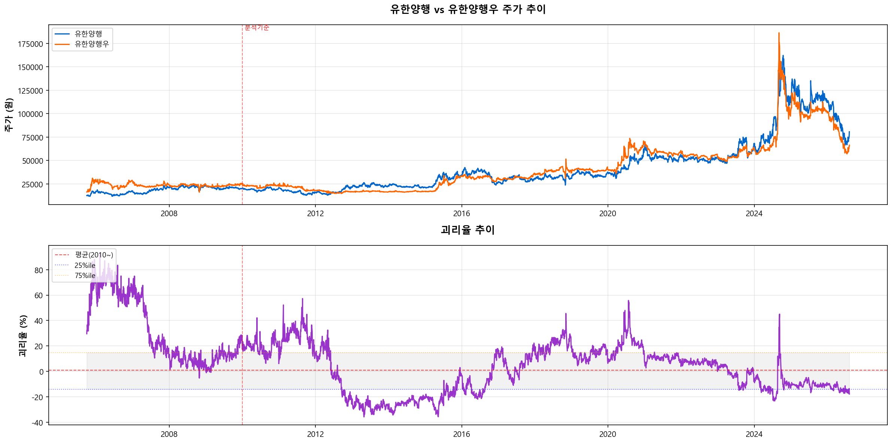

---

## 📌 LG생활건강 (051900) vs LG생활건강우 (051905)

**분석 기간**: 2010-01-04 ~ 2026-08-07 (4,082일)
**전체 데이터**: 2005-09-29 ~ 2026-08-07 (5,152일) — 2010년 이전은 참고용

### 현재 상황

| 항목 | 값 |
|:----:|:---|
| LG생활건강 | 333,500원 |
| LG생활건강우 | 118,000원 |
| **현재 괴리율** | **-64.62%** |
| 우선주 할인율 | 64.62% |
| 역사적 위치 | 하위 22.2% |
| Z-Score | -0.55σ |
| 종합 점수 | 35점 (±100점 만점) |
| **판정** | **🟦 우선주 매수** |

**판정 근거:**

- ✅ 역사적 하위 25% (우선주 저평가)
- ✅ 최근 30일 평균보다 1%p 이상 낮음

### 괴리율 통계 (2010년~)

| 지표 | 값 |
|:----:|:---|
| 평균 | -58.14% |
| 중간값 | -57.27% |
| 표준편차 | 11.70% |
| 최소 (우선주 최저평가) | -82.82% |
| 최대 (우선주 최고평가) | -35.07% |

| 백분위 | 괴리율 | 의미 |
|:-----:|:------:|:-----|
| 10% | -78.06% | 우선주 매우 저평가 |
| 25% | -62.35% | 우선주 저평가 |
| 50% | -57.27% | 중간값 |
| 75% | -48.64% | 우선주 고평가 |
| 90% | -44.07% | 우선주 매우 고평가 |

**📎 참고: 전체 기간 (2005-09-29~) 통계 비교**

| 지표 | 2010년 이후 | 전체 기간 |
|:----:|:----------:|:---------:|
| 평균 | -58.14% | -60.64% |
| 중간값 | -57.27% | -58.66% |
| 표준편차 | 11.70% | 12.09% |
| 최소 | -82.82% | -86.83% |
| 최대 | -35.07% | -35.07% |

### 기간별 괴리율

| 기간 | 평균 | 최소 | 최대 | 현재 대비 |
|:----:|:----:|:----:|:----:|:---------:|
| 최근 1개월 | -61.57% | -64.62% | -57.72% | -3.05%p |
| 최근 3개월 | -58.70% | -64.62% | -54.77% | -5.91%p |
| 최근 6개월 | -58.09% | -64.62% | -53.15% | -6.53%p |
| 최근 1년 | -59.42% | -64.62% | -53.15% | -5.20%p |
| 최근 3년 | -57.05% | -64.62% | -40.73% | -7.57%p |
| 최근 5년 | -54.38% | -64.62% | -39.62% | -10.24%p |

### 시장 상황별 괴리율

| 구분 | 기간 | 평균 괴리율 | 중간값 |
|:----:|:----:|:----------:|:------:|
| 상승장 | 1094일 (26.8%) | -59.49% | -57.43% |
| 하락장 | 1068일 (26.2%) | -54.76% | -56.05% |
| 중립장 | 1920일 (47.0%) | -59.25% | -57.95% |

### 역사적 극단값 (Top 5)

**🟦 우선주 최저평가 시점 (괴리율 최저)**

| 날짜 | LG생활건강 | LG생활건강우 | 괴리율 |
|:----:|--------:|----------:|:------:|
| 2011-03-31 | 366,198원 | 62,906원 | **-82.82%** |
| 2011-03-30 | 361,303원 | 62,216원 | **-82.78%** |
| 2011-07-12 | 424,932원 | 73,493원 | **-82.70%** |
| 2011-07-11 | 431,606원 | 74,874원 | **-82.65%** |
| 2011-08-18 | 444,955원 | 77,866원 | **-82.50%** |

**🟥 보통주 최저평가 시점 (괴리율 최고)**

| 날짜 | LG생활건강 | LG생활건강우 | 괴리율 |
|:----:|--------:|----------:|:------:|
| 2018-10-31 | 974,804원 | 632,947원 | **-35.07%** |
| 2017-09-25 | 788,546원 | 489,741원 | **-37.89%** |
| 2017-09-26 | 788,546원 | 489,741원 | **-37.89%** |
| 2017-08-08 | 897,886원 | 553,732원 | **-38.33%** |
| 2017-09-13 | 821,904원 | 505,952원 | **-38.44%** |

### 차트

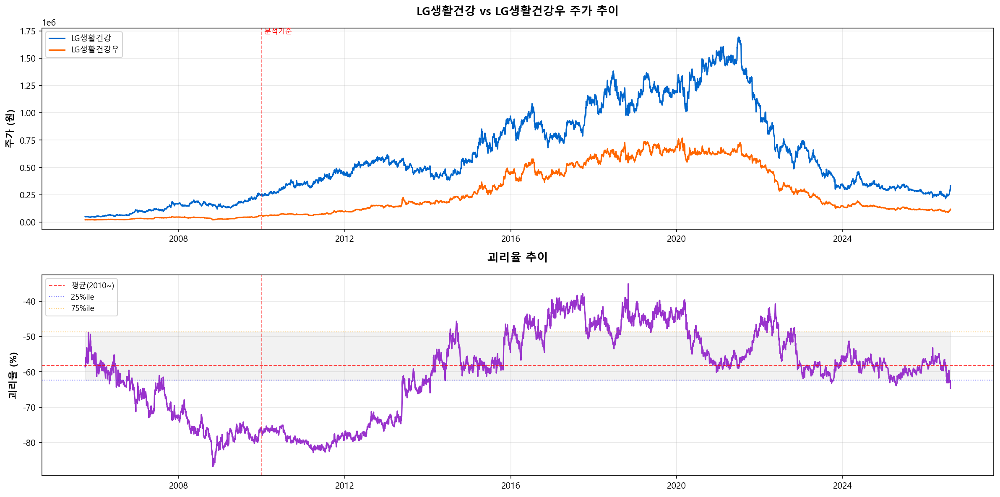

---

## 📌 CJ제일제당 (097950) vs CJ제일제당우 (097955)

**분석 기간**: 2010-01-04 ~ 2026-08-07 (4,082일)
**전체 데이터**: 2007-09-28 ~ 2026-08-07 (4,655일) — 2010년 이전은 참고용

### 현재 상황

| 항목 | 값 |
|:----:|:---|
| CJ제일제당 | 204,500원 |
| CJ제일제당우 | 127,000원 |
| **현재 괴리율** | **-37.90%** |
| 우선주 할인율 | 37.90% |
| 역사적 위치 | 하위 97.0% |
| Z-Score | 2.06σ |
| 종합 점수 | -60점 (±100점 만점) |
| **판정** | **🟥 보통주 강력 매수** |

**판정 근거:**

- ❌ 역사적 상위 10% (우선주 매우 고평가)
- ❌ 평균 대비 1.5σ 이상 높음
- ✅ 최근 30일 평균보다 1%p 이상 낮음

### 괴리율 통계 (2010년~)

| 지표 | 값 |
|:----:|:---|
| 평균 | -62.08% |
| 중간값 | -60.75% |
| 표준편차 | 11.75% |
| 최소 (우선주 최저평가) | -85.09% |
| 최대 (우선주 최고평가) | -32.37% |

| 백분위 | 괴리율 | 의미 |
|:-----:|:------:|:-----|
| 10% | -81.13% | 우선주 매우 저평가 |
| 25% | -68.98% | 우선주 저평가 |
| 50% | -60.75% | 중간값 |
| 75% | -55.71% | 우선주 고평가 |
| 90% | -48.29% | 우선주 매우 고평가 |

**📎 참고: 전체 기간 (2007-09-28~) 통계 비교**

| 지표 | 2010년 이후 | 전체 기간 |
|:----:|:----------:|:---------:|
| 평균 | -62.08% | -63.95% |
| 중간값 | -60.75% | -62.03% |
| 표준편차 | 11.75% | 12.10% |
| 최소 | -85.09% | -85.09% |
| 최대 | -32.37% | -32.37% |

### 기간별 괴리율

| 기간 | 평균 | 최소 | 최대 | 현재 대비 |
|:----:|:----:|:----:|:----:|:---------:|
| 최근 1개월 | -36.30% | -39.60% | -33.97% | -1.60%p |
| 최근 3개월 | -38.62% | -43.77% | -33.97% | +0.72%p |
| 최근 6개월 | -37.06% | -43.77% | -32.37% | -0.83%p |
| 최근 1년 | -40.17% | -49.78% | -32.37% | +2.27%p |
| 최근 3년 | -51.58% | -62.92% | -32.37% | +13.68%p |
| 최근 5년 | -55.11% | -66.65% | -32.37% | +17.21%p |

### 시장 상황별 괴리율

| 구분 | 기간 | 평균 괴리율 | 중간값 |
|:----:|:----:|:----------:|:------:|
| 상승장 | 947일 (23.2%) | -64.82% | -61.94% |
| 하락장 | 875일 (21.4%) | -58.47% | -57.35% |
| 중립장 | 2260일 (55.4%) | -62.33% | -61.34% |

### 역사적 극단값 (Top 5)

**🟦 우선주 최저평가 시점 (괴리율 최저)**

| 날짜 | CJ제일제당 | CJ제일제당우 | 괴리율 |
|:----:|--------:|----------:|:------:|
| 2012-05-09 | 315,982원 | 47,119원 | **-85.09%** |
| 2012-04-30 | 315,560원 | 47,187원 | **-85.05%** |
| 2012-05-10 | 313,029원 | 47,051원 | **-84.97%** |
| 2012-05-11 | 310,919원 | 46,778원 | **-84.95%** |
| 2012-05-04 | 312,185원 | 46,983원 | **-84.95%** |

**🟥 보통주 최저평가 시점 (괴리율 최고)**

| 날짜 | CJ제일제당 | CJ제일제당우 | 괴리율 |
|:----:|--------:|----------:|:------:|
| 2026-03-04 | 190,300원 | 128,700원 | **-32.37%** |
| 2026-01-07 | 201,613원 | 135,802원 | **-32.64%** |
| 2026-03-06 | 195,900원 | 131,300원 | **-32.98%** |
| 2025-12-11 | 204,096원 | 136,693원 | **-33.03%** |
| 2026-01-06 | 204,096원 | 136,594원 | **-33.07%** |

### 차트

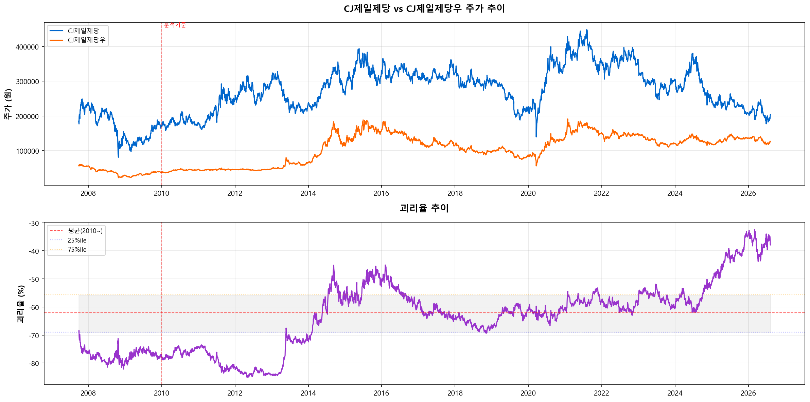

---

## 📌 현대건설 (000720) vs 현대건설우 (000725)

**분석 기간**: 2010-01-04 ~ 2026-08-07 (4,082일)
**전체 데이터**: 2005-09-29 ~ 2026-08-07 (5,152일) — 2010년 이전은 참고용

### 현재 상황

| 항목 | 값 |
|:----:|:---|
| 현대건설 | 109,900원 |
| 현대건설우 | 51,600원 |
| **현재 괴리율** | **-53.05%** |
| 우선주 할인율 | 53.05% |
| 역사적 위치 | 하위 6.8% |
| Z-Score | -0.84σ |
| 종합 점수 | 40점 (±100점 만점) |
| **판정** | **🟦 우선주 강력 매수** |

**판정 근거:**

- ✅ 역사적 하위 10% (우선주 매우 저평가)

### 괴리율 통계 (2010년~)

| 지표 | 값 |
|:----:|:---|
| 평균 | 66.25% |
| 중간값 | 28.97% |
| 표준편차 | 141.30% |
| 최소 (우선주 최저평가) | -64.95% |
| 최대 (우선주 최고평가) | 1296.81% |

| 백분위 | 괴리율 | 의미 |
|:-----:|:------:|:-----|
| 10% | -50.30% | 우선주 매우 저평가 |
| 25% | -35.59% | 우선주 저평가 |
| 50% | 28.97% | 중간값 |
| 75% | 70.97% | 우선주 고평가 |
| 90% | 271.05% | 우선주 매우 고평가 |

**📎 참고: 전체 기간 (2005-09-29~) 통계 비교**

| 지표 | 2010년 이후 | 전체 기간 |
|:----:|:----------:|:---------:|
| 평균 | 66.25% | 42.80% |
| 중간값 | 28.97% | -16.14% |
| 표준편차 | 141.30% | 133.93% |
| 최소 | -64.95% | -64.95% |
| 최대 | 1296.81% | 1296.81% |

### 기간별 괴리율

| 기간 | 평균 | 최소 | 최대 | 현재 대비 |
|:----:|:----:|:----:|:----:|:---------:|
| 최근 1개월 | -52.30% | -55.88% | -46.27% | -0.75%p |
| 최근 3개월 | -55.23% | -64.95% | -46.27% | +2.18%p |
| 최근 6개월 | -45.24% | -64.95% | -12.81% | -7.81%p |
| 최근 1년 | -19.74% | -64.95% | 50.03% | -33.30%p |
| 최근 3년 | 30.20% | -64.95% | 104.03% | -83.24%p |
| 최근 5년 | 136.93% | -64.95% | 1296.81% | -189.98%p |

### 시장 상황별 괴리율

| 구분 | 기간 | 평균 괴리율 | 중간값 |
|:----:|:----:|:----------:|:------:|
| 상승장 | 1194일 (29.3%) | 61.99% | 14.69% |
| 하락장 | 1227일 (30.1%) | 67.20% | 41.67% |
| 중립장 | 1661일 (40.7%) | 68.62% | 38.47% |

### 역사적 극단값 (Top 5)

**🟦 우선주 최저평가 시점 (괴리율 최저)**

| 날짜 | 현대건설 | 현대건설우 | 괴리율 |
|:----:|--------:|----------:|:------:|
| 2026-06-12 | 157,500원 | 55,200원 | **-64.95%** |
| 2012-12-20 | 60,505원 | 23,481원 | **-61.19%** |
| 2013-01-29 | 60,943원 | 23,946원 | **-60.71%** |
| 2013-01-30 | 60,859원 | 23,946원 | **-60.65%** |
| 2013-03-08 | 56,578원 | 22,393원 | **-60.42%** |

**🟥 보통주 최저평가 시점 (괴리율 최고)**

| 날짜 | 현대건설 | 현대건설우 | 괴리율 |
|:----:|--------:|----------:|:------:|
| 2020-06-25 | 30,599원 | 427,413원 | **1296.81%** |
| 2020-06-24 | 31,699원 | 427,413원 | **1248.36%** |
| 2020-06-23 | 31,470원 | 328,959원 | **945.32%** |
| 2020-06-26 | 30,737원 | 299,562원 | **874.61%** |
| 2020-07-08 | 31,561원 | 288,364원 | **813.66%** |

### 차트

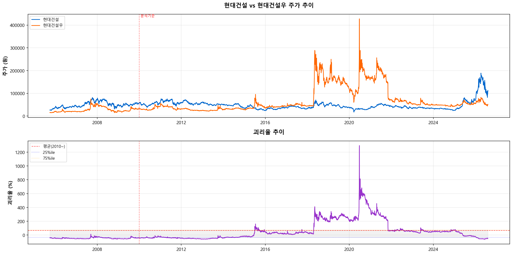

---

## 📌 금호석유 (011780) vs 금호석유우 (011785)

**분석 기간**: 2010-01-04 ~ 2026-08-07 (4,082일)
**전체 데이터**: 2005-09-29 ~ 2026-08-07 (5,152일) — 2010년 이전은 참고용

### 현재 상황

| 항목 | 값 |
|:----:|:---|
| 금호석유 | 129,600원 |
| 금호석유우 | 52,500원 |
| **현재 괴리율** | **-59.49%** |
| 우선주 할인율 | 59.49% |
| 역사적 위치 | 하위 64.0% |
| Z-Score | 0.40σ |
| 종합 점수 | 10점 (±100점 만점) |
| **판정** | **⚪ 중립** |

**판정 근거:**

- ✅ 최근 30일 평균보다 1%p 이상 낮음

### 괴리율 통계 (2010년~)

| 지표 | 값 |
|:----:|:---|
| 평균 | -64.62% |
| 중간값 | -66.09% |
| 표준편차 | 12.97% |
| 최소 (우선주 최저평가) | -87.43% |
| 최대 (우선주 최고평가) | -32.47% |

| 백분위 | 괴리율 | 의미 |
|:-----:|:------:|:-----|
| 10% | -82.83% | 우선주 매우 저평가 |
| 25% | -72.80% | 우선주 저평가 |
| 50% | -66.09% | 중간값 |
| 75% | -53.45% | 우선주 고평가 |
| 90% | -48.35% | 우선주 매우 고평가 |

**📎 참고: 전체 기간 (2005-09-29~) 통계 비교**

| 지표 | 2010년 이후 | 전체 기간 |
|:----:|:----------:|:---------:|
| 평균 | -64.62% | -66.88% |
| 중간값 | -66.09% | -69.22% |
| 표준편차 | 12.97% | 12.56% |
| 최소 | -87.43% | -87.43% |
| 최대 | -32.47% | -32.47% |

### 기간별 괴리율

| 기간 | 평균 | 최소 | 최대 | 현재 대비 |
|:----:|:----:|:----:|:----:|:---------:|
| 최근 1개월 | -57.50% | -59.51% | -55.25% | -1.99%p |
| 최근 3개월 | -57.04% | -59.85% | -52.29% | -2.45%p |
| 최근 6개월 | -53.79% | -59.85% | -45.82% | -5.70%p |
| 최근 1년 | -52.52% | -59.85% | -45.74% | -6.97%p |
| 최근 3년 | -50.26% | -59.85% | -32.47% | -9.23%p |
| 최근 5년 | -54.49% | -71.53% | -32.47% | -5.00%p |

### 시장 상황별 괴리율

| 구분 | 기간 | 평균 괴리율 | 중간값 |
|:----:|:----:|:----------:|:------:|
| 상승장 | 1338일 (32.8%) | -68.26% | -67.98% |
| 하락장 | 1197일 (29.3%) | -62.31% | -60.47% |
| 중립장 | 1547일 (37.9%) | -63.26% | -65.61% |

### 역사적 극단값 (Top 5)

**🟦 우선주 최저평가 시점 (괴리율 최저)**

| 날짜 | 금호석유 | 금호석유우 | 괴리율 |
|:----:|--------:|----------:|:------:|
| 2011-08-23 | 127,643원 | 16,041원 | **-87.43%** |
| 2011-08-24 | 122,552원 | 15,631원 | **-87.25%** |
| 2011-10-17 | 160,009원 | 20,631원 | **-87.11%** |
| 2011-10-18 | 157,099원 | 20,438원 | **-86.99%** |
| 2011-08-25 | 122,552원 | 15,945원 | **-86.99%** |

**🟥 보통주 최저평가 시점 (괴리율 최고)**

| 날짜 | 금호석유 | 금호석유우 | 괴리율 |
|:----:|--------:|----------:|:------:|
| 2022-09-02 | 113,287원 | 76,504원 | **-32.47%** |
| 2022-09-07 | 112,380원 | 75,836원 | **-32.52%** |
| 2022-09-05 | 114,193원 | 76,671원 | **-32.86%** |
| 2022-09-27 | 104,224원 | 69,913원 | **-32.92%** |
| 2022-09-06 | 114,646원 | 76,837원 | **-32.98%** |

### 차트

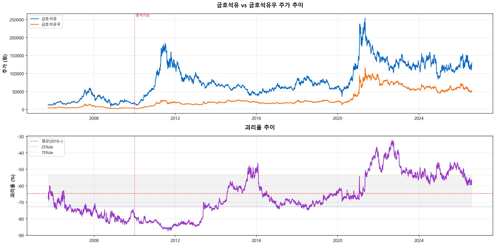

---

## 📌 코오롱인더 (120110) vs 코오롱인더우 (120115)

**분석 기간**: 2010-02-01 ~ 2026-08-07 (4,062일)

### 현재 상황

| 항목 | 값 |
|:----:|:---|
| 코오롱인더 | 58,600원 |
| 코오롱인더우 | 25,400원 |
| **현재 괴리율** | **-56.66%** |
| 우선주 할인율 | 56.66% |
| 역사적 위치 | 하위 69.8% |
| Z-Score | 0.49σ |
| 종합 점수 | 0점 (±100점 만점) |
| **판정** | **⚪ 중립** |

### 괴리율 통계

| 지표 | 값 |
|:----:|:---|
| 평균 | -62.66% |
| 중간값 | -64.06% |
| 표준편차 | 12.28% |
| 최소 (우선주 최저평가) | -84.10% |
| 최대 (우선주 최고평가) | -30.95% |

| 백분위 | 괴리율 | 의미 |
|:-----:|:------:|:-----|
| 10% | -79.75% | 우선주 매우 저평가 |
| 25% | -71.63% | 우선주 저평가 |
| 50% | -64.06% | 중간값 |
| 75% | -53.59% | 우선주 고평가 |
| 90% | -45.73% | 우선주 매우 고평가 |

### 기간별 괴리율

| 기간 | 평균 | 최소 | 최대 | 현재 대비 |
|:----:|:----:|:----:|:----:|:---------:|
| 최근 1개월 | -56.44% | -60.80% | -50.81% | -0.22%p |
| 최근 3개월 | -62.29% | -67.85% | -50.81% | +5.63%p |
| 최근 6개월 | -56.07% | -67.85% | -40.66% | -0.58%p |
| 최근 1년 | -47.53% | -67.85% | -33.20% | -9.12%p |
| 최근 3년 | -47.97% | -67.85% | -30.95% | -8.69%p |
| 최근 5년 | -51.83% | -67.85% | -30.95% | -4.82%p |

### 시장 상황별 괴리율

| 구분 | 기간 | 평균 괴리율 | 중간값 |
|:----:|:----:|:----------:|:------:|
| 상승장 | 1286일 (31.7%) | -64.96% | -65.95% |
| 하락장 | 1254일 (30.9%) | -60.97% | -61.61% |
| 중립장 | 1522일 (37.5%) | -62.10% | -64.30% |

### 역사적 극단값 (Top 5)

**🟦 우선주 최저평가 시점 (괴리율 최저)**

| 날짜 | 코오롱인더 | 코오롱인더우 | 괴리율 |
|:----:|--------:|----------:|:------:|
| 2011-08-18 | 87,610원 | 13,929원 | **-84.10%** |
| 2011-08-17 | 83,543원 | 13,584원 | **-83.74%** |
| 2011-08-16 | 78,738원 | 13,107원 | **-83.35%** |
| 2011-08-11 | 77,259원 | 12,921원 | **-83.28%** |
| 2011-08-09 | 73,858원 | 12,364원 | **-83.26%** |

**🟥 보통주 최저평가 시점 (괴리율 최고)**

| 날짜 | 코오롱인더 | 코오롱인더우 | 괴리율 |
|:----:|--------:|----------:|:------:|
| 2024-12-09 | 24,006원 | 16,576원 | **-30.95%** |
| 2024-12-05 | 24,797원 | 17,018원 | **-31.37%** |
| 2024-12-06 | 24,936원 | 16,912원 | **-32.18%** |
| 2025-02-04 | 25,798원 | 17,471원 | **-32.28%** |
| 2024-12-02 | 25,495원 | 17,239원 | **-32.38%** |

### 차트

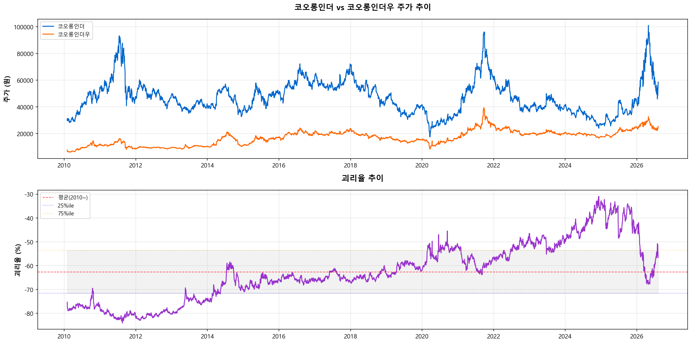

---

## 📌 코오롱 (002020) vs 코오롱우 (002025)

**분석 기간**: 2010-01-04 ~ 2026-08-07 (4,082일)
**전체 데이터**: 2005-09-29 ~ 2026-08-07 (5,152일) — 2010년 이전은 참고용

### 현재 상황

| 항목 | 값 |
|:----:|:---|
| 코오롱 | 25,750원 |
| 코오롱우 | 13,890원 |
| **현재 괴리율** | **-46.06%** |
| 우선주 할인율 | 46.06% |
| 역사적 위치 | 하위 64.2% |
| Z-Score | 0.27σ |
| 종합 점수 | -10점 (±100점 만점) |
| **판정** | **⚪ 중립** |

**판정 근거:**

- ❌ 최근 30일 평균보다 1%p 이상 높음

### 괴리율 통계 (2010년~)

| 지표 | 값 |
|:----:|:---|
| 평균 | -50.50% |
| 중간값 | -53.94% |
| 표준편차 | 16.19% |
| 최소 (우선주 최저평가) | -78.13% |
| 최대 (우선주 최고평가) | -6.52% |

| 백분위 | 괴리율 | 의미 |
|:-----:|:------:|:-----|
| 10% | -69.14% | 우선주 매우 저평가 |
| 25% | -62.98% | 우선주 저평가 |
| 50% | -53.94% | 중간값 |
| 75% | -38.55% | 우선주 고평가 |
| 90% | -25.82% | 우선주 매우 고평가 |

**📎 참고: 전체 기간 (2005-09-29~) 통계 비교**

| 지표 | 2010년 이후 | 전체 기간 |
|:----:|:----------:|:---------:|
| 평균 | -50.50% | -52.52% |
| 중간값 | -53.94% | -55.39% |
| 표준편차 | 16.19% | 15.76% |
| 최소 | -78.13% | -80.65% |
| 최대 | -6.52% | -6.52% |

### 기간별 괴리율

| 기간 | 평균 | 최소 | 최대 | 현재 대비 |
|:----:|:----:|:----:|:----:|:---------:|
| 최근 1개월 | -48.65% | -51.55% | -43.38% | +2.60%p |
| 최근 3개월 | -52.03% | -60.35% | -43.38% | +5.97%p |
| 최근 6개월 | -51.61% | -60.35% | -43.38% | +5.56%p |
| 최근 1년 | -47.59% | -60.35% | -16.57% | +1.53%p |
| 최근 3년 | -32.53% | -60.35% | -6.52% | -13.53%p |
| 최근 5년 | -35.71% | -60.35% | -6.52% | -10.35%p |

### 시장 상황별 괴리율

| 구분 | 기간 | 평균 괴리율 | 중간값 |
|:----:|:----:|:----------:|:------:|
| 상승장 | 1167일 (28.6%) | -55.11% | -57.23% |
| 하락장 | 1372일 (33.6%) | -51.71% | -54.47% |
| 중립장 | 1543일 (37.8%) | -45.93% | -48.82% |

### 역사적 극단값 (Top 5)

**🟦 우선주 최저평가 시점 (괴리율 최저)**

| 날짜 | 코오롱 | 코오롱우 | 괴리율 |
|:----:|--------:|----------:|:------:|
| 2010-02-05 | 24,272원 | 5,309원 | **-78.13%** |
| 2010-02-04 | 24,272원 | 5,389원 | **-77.80%** |
| 2010-02-08 | 22,844원 | 5,150원 | **-77.46%** |
| 2010-07-27 | 25,700원 | 5,813원 | **-77.38%** |
| 2010-07-13 | 24,665원 | 5,601원 | **-77.29%** |

**🟥 보통주 최저평가 시점 (괴리율 최고)**

| 날짜 | 코오롱 | 코오롱우 | 괴리율 |
|:----:|--------:|----------:|:------:|
| 2024-12-19 | 13,939원 | 13,031원 | **-6.52%** |
| 2024-12-20 | 13,634원 | 12,573원 | **-7.78%** |
| 2024-11-14 | 12,585원 | 11,575원 | **-8.03%** |
| 2024-11-15 | 12,576원 | 11,565원 | **-8.04%** |
| 2024-11-13 | 12,595원 | 11,491원 | **-8.77%** |

### 차트

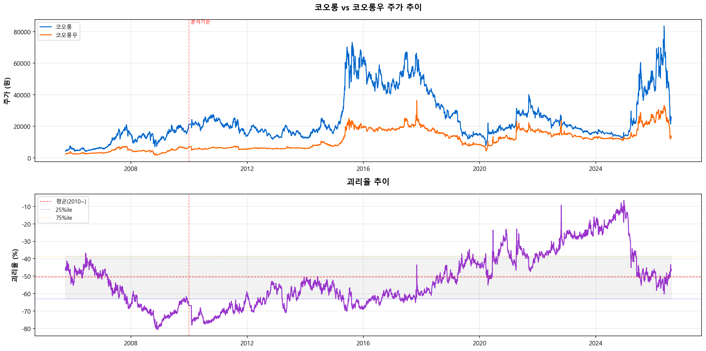

---

## 📌 호텔신라 (008770) vs 호텔신라우 (008775)

**분석 기간**: 2010-01-04 ~ 2026-08-07 (4,082일)
**전체 데이터**: 2005-09-29 ~ 2026-08-07 (5,152일) — 2010년 이전은 참고용

### 현재 상황

| 항목 | 값 |
|:----:|:---|
| 호텔신라 | 42,700원 |
| 호텔신라우 | 29,350원 |
| **현재 괴리율** | **-31.26%** |
| 우선주 할인율 | 31.26% |
| 역사적 위치 | 하위 58.8% |
| Z-Score | 0.24σ |
| 종합 점수 | -10점 (±100점 만점) |
| **판정** | **⚪ 중립** |

**판정 근거:**

- ❌ 최근 30일 평균보다 1%p 이상 높음

### 괴리율 통계 (2010년~)

| 지표 | 값 |
|:----:|:---|
| 평균 | -36.51% |
| 중간값 | -37.05% |
| 표준편차 | 22.06% |
| 최소 (우선주 최저평가) | -77.64% |
| 최대 (우선주 최고평가) | 42.97% |

| 백분위 | 괴리율 | 의미 |
|:-----:|:------:|:-----|
| 10% | -67.60% | 우선주 매우 저평가 |
| 25% | -54.06% | 우선주 저평가 |
| 50% | -37.05% | 중간값 |
| 75% | -20.84% | 우선주 고평가 |
| 90% | -6.52% | 우선주 매우 고평가 |

**📎 참고: 전체 기간 (2005-09-29~) 통계 비교**

| 지표 | 2010년 이후 | 전체 기간 |
|:----:|:----------:|:---------:|
| 평균 | -36.51% | -40.10% |
| 중간값 | -37.05% | -41.21% |
| 표준편차 | 22.06% | 21.02% |
| 최소 | -77.64% | -77.64% |
| 최대 | 42.97% | 42.97% |

### 기간별 괴리율

| 기간 | 평균 | 최소 | 최대 | 현재 대비 |
|:----:|:----:|:----:|:----:|:---------:|
| 최근 1개월 | -36.97% | -43.17% | -30.12% | +5.70%p |
| 최근 3개월 | -35.97% | -45.15% | -20.77% | +4.71%p |
| 최근 6개월 | -28.18% | -45.15% | -14.70% | -3.09%p |
| 최근 1년 | -21.96% | -45.15% | 0.32% | -9.30%p |
| 최근 3년 | -22.10% | -45.15% | 0.32% | -9.16%p |
| 최근 5년 | -20.86% | -49.09% | 42.97% | -10.40%p |

### 시장 상황별 괴리율

| 구분 | 기간 | 평균 괴리율 | 중간값 |
|:----:|:----:|:----------:|:------:|
| 상승장 | 1284일 (31.5%) | -44.45% | -43.70% |
| 하락장 | 1102일 (27.0%) | -32.00% | -33.57% |
| 중립장 | 1696일 (41.5%) | -33.44% | -32.50% |

### 역사적 극단값 (Top 5)

**🟦 우선주 최저평가 시점 (괴리율 최저)**

| 날짜 | 호텔신라 | 호텔신라우 | 괴리율 |
|:----:|--------:|----------:|:------:|
| 2013-03-21 | 52,651원 | 11,773원 | **-77.64%** |
| 2013-03-22 | 51,787원 | 11,866원 | **-77.09%** |
| 2013-03-29 | 52,746원 | 12,098원 | **-77.06%** |
| 2013-03-20 | 51,691원 | 11,866원 | **-77.04%** |
| 2013-03-28 | 52,746원 | 12,144원 | **-76.98%** |

**🟥 보통주 최저평가 시점 (괴리율 최고)**

| 날짜 | 호텔신라 | 호텔신라우 | 괴리율 |
|:----:|--------:|----------:|:------:|
| 2021-04-26 | 83,920원 | 119,985원 | **42.97%** |
| 2021-04-27 | 83,424원 | 113,072원 | **35.54%** |
| 2017-02-17 | 46,277원 | 62,405원 | **34.85%** |
| 2017-02-22 | 47,449원 | 61,253원 | **29.09%** |
| 2017-03-10 | 43,934원 | 56,164원 | **27.84%** |

### 차트

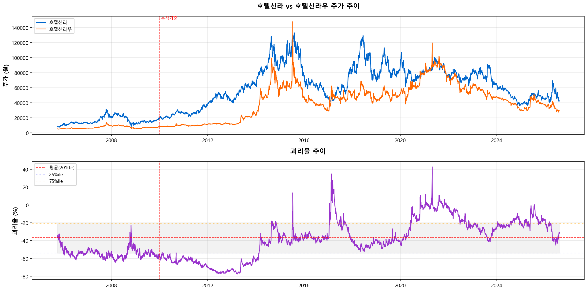

---

## 📌 DL (000210) vs DL우 (000215)

**분석 기간**: 2010-01-04 ~ 2026-08-07 (4,082일)
**전체 데이터**: 2005-09-29 ~ 2026-08-07 (5,152일) — 2010년 이전은 참고용

### 현재 상황

| 항목 | 값 |
|:----:|:---|
| DL | 50,900원 |
| DL우 | 23,000원 |
| **현재 괴리율** | **-54.81%** |
| 우선주 할인율 | 54.81% |
| 역사적 위치 | 하위 21.6% |
| Z-Score | -0.69σ |
| 종합 점수 | 25점 (±100점 만점) |
| **판정** | **🟦 우선주 매수** |

**판정 근거:**

- ✅ 역사적 하위 25% (우선주 저평가)

### 괴리율 통계 (2010년~)

| 지표 | 값 |
|:----:|:---|
| 평균 | -47.07% |
| 중간값 | -46.32% |
| 표준편차 | 11.22% |
| 최소 (우선주 최저평가) | -70.56% |
| 최대 (우선주 최고평가) | -2.22% |

| 백분위 | 괴리율 | 의미 |
|:-----:|:------:|:-----|
| 10% | -64.67% | 우선주 매우 저평가 |
| 25% | -53.64% | 우선주 저평가 |
| 50% | -46.32% | 중간값 |
| 75% | -40.52% | 우선주 고평가 |
| 90% | -35.63% | 우선주 매우 고평가 |

**📎 참고: 전체 기간 (2005-09-29~) 통계 비교**

| 지표 | 2010년 이후 | 전체 기간 |
|:----:|:----------:|:---------:|
| 평균 | -47.07% | -44.91% |
| 중간값 | -46.32% | -45.17% |
| 표준편차 | 11.22% | 12.71% |
| 최소 | -70.56% | -70.56% |
| 최대 | -2.22% | 3.03% |

### 기간별 괴리율

| 기간 | 평균 | 최소 | 최대 | 현재 대비 |
|:----:|:----:|:----:|:----:|:---------:|
| 최근 1개월 | -54.03% | -57.47% | -50.76% | -0.79%p |
| 최근 3개월 | -55.07% | -58.33% | -50.76% | +0.25%p |
| 최근 6개월 | -48.24% | -58.33% | -32.95% | -6.58%p |
| 최근 1년 | -45.29% | -58.33% | -32.10% | -9.53%p |
| 최근 3년 | -46.04% | -58.33% | -32.10% | -8.77%p |
| 최근 5년 | -42.05% | -58.33% | -2.22% | -12.77%p |

### 시장 상황별 괴리율

| 구분 | 기간 | 평균 괴리율 | 중간값 |
|:----:|:----:|:----------:|:------:|
| 상승장 | 1151일 (28.2%) | -50.36% | -49.90% |
| 하락장 | 1340일 (32.8%) | -46.84% | -45.05% |
| 중립장 | 1591일 (39.0%) | -44.87% | -45.10% |

### 역사적 극단값 (Top 5)

**🟦 우선주 최저평가 시점 (괴리율 최저)**

| 날짜 | DL | DL우 | 괴리율 |
|:----:|--------:|----------:|:------:|
| 2012-02-02 | 130,776원 | 38,506원 | **-70.56%** |
| 2012-02-03 | 131,866원 | 39,200원 | **-70.27%** |
| 2011-09-07 | 121,289원 | 36,564원 | **-69.85%** |
| 2012-02-06 | 130,232원 | 39,663원 | **-69.54%** |
| 2012-02-09 | 138,950원 | 42,364원 | **-69.51%** |

**🟥 보통주 최저평가 시점 (괴리율 최고)**

| 날짜 | DL | DL우 | 괴리율 |
|:----:|--------:|----------:|:------:|
| 2020-12-28 | 100,004원 | 97,788원 | **-2.22%** |
| 2020-12-29 | 102,664원 | 100,334원 | **-2.27%** |
| 2020-12-30 | 102,664원 | 100,334원 | **-2.27%** |
| 2021-01-04 | 102,664원 | 100,334원 | **-2.27%** |
| 2021-01-05 | 102,664원 | 100,334원 | **-2.27%** |

### 차트

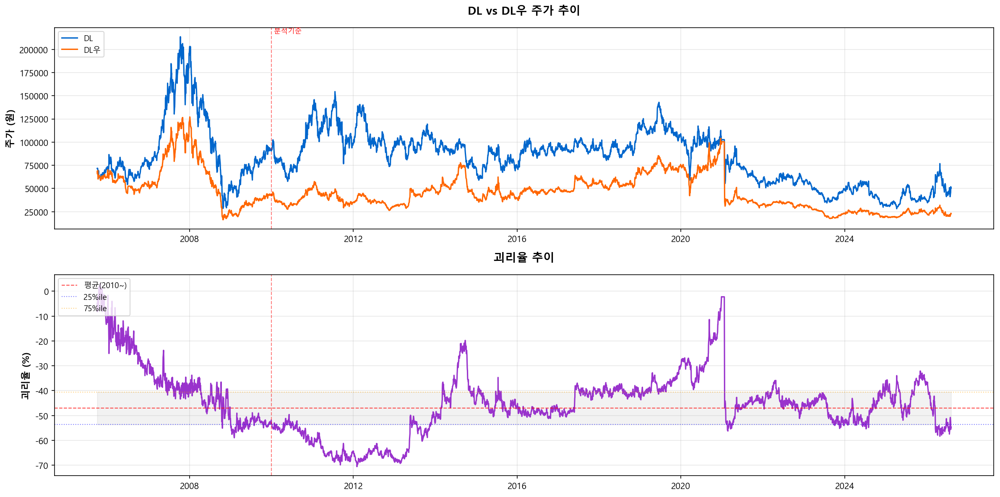

---

## 📌 한국금융지주 (071050) vs 한국금융지주우 (071055)

**분석 기간**: 2010-01-04 ~ 2026-08-07 (4,082일)
**전체 데이터**: 2005-09-29 ~ 2026-08-07 (5,152일) — 2010년 이전은 참고용

### 현재 상황

| 항목 | 값 |
|:----:|:---|
| 한국금융지주 | 188,000원 |
| 한국금융지주우 | 147,600원 |
| **현재 괴리율** | **-21.49%** |
| 우선주 할인율 | 21.49% |
| 역사적 위치 | 하위 94.9% |
| Z-Score | 1.40σ |
| 종합 점수 | -70점 (±100점 만점) |
| **판정** | **🟥 보통주 강력 매수** |

**판정 근거:**

- ❌ 역사적 상위 10% (우선주 매우 고평가)
- ❌ 평균 대비 1.0σ 이상 높음
- ❌ 최근 30일 평균보다 1%p 이상 높음

### 괴리율 통계 (2010년~)

| 지표 | 값 |
|:----:|:---|
| 평균 | -48.75% |
| 중간값 | -50.73% |
| 표준편차 | 19.45% |
| 최소 (우선주 최저평가) | -81.32% |
| 최대 (우선주 최고평가) | -9.56% |

| 백분위 | 괴리율 | 의미 |
|:-----:|:------:|:-----|
| 10% | -77.78% | 우선주 매우 저평가 |
| 25% | -64.07% | 우선주 저평가 |
| 50% | -50.73% | 중간값 |
| 75% | -30.64% | 우선주 고평가 |
| 90% | -24.55% | 우선주 매우 고평가 |

**📎 참고: 전체 기간 (2005-09-29~) 통계 비교**

| 지표 | 2010년 이후 | 전체 기간 |
|:----:|:----------:|:---------:|
| 평균 | -48.75% | -53.34% |
| 중간값 | -50.73% | -55.29% |
| 표준편차 | 19.45% | 19.67% |
| 최소 | -81.32% | -82.35% |
| 최대 | -9.56% | -9.56% |

### 기간별 괴리율

| 기간 | 평균 | 최소 | 최대 | 현재 대비 |
|:----:|:----:|:----:|:----:|:---------:|
| 최근 1개월 | -30.65% | -35.61% | -21.49% | +9.16%p |
| 최근 3개월 | -30.70% | -35.61% | -21.49% | +9.21%p |
| 최근 6개월 | -28.67% | -38.27% | -20.03% | +7.18%p |
| 최근 1년 | -29.25% | -38.33% | -20.03% | +7.76%p |
| 최근 3년 | -27.09% | -38.33% | -9.56% | +5.60%p |
| 최근 5년 | -30.45% | -49.80% | -9.56% | +8.96%p |

### 시장 상황별 괴리율

| 구분 | 기간 | 평균 괴리율 | 중간값 |
|:----:|:----:|:----------:|:------:|
| 상승장 | 1295일 (31.7%) | -48.91% | -51.78% |
| 하락장 | 878일 (21.5%) | -46.90% | -47.63% |
| 중립장 | 1909일 (46.8%) | -49.49% | -51.83% |

### 역사적 극단값 (Top 5)

**🟦 우선주 최저평가 시점 (괴리율 최저)**

| 날짜 | 한국금융지주 | 한국금융지주우 | 괴리율 |
|:----:|--------:|----------:|:------:|
| 2011-12-05 | 24,703원 | 4,614원 | **-81.32%** |
| 2011-12-01 | 24,608원 | 4,605원 | **-81.29%** |
| 2011-12-07 | 24,482원 | 4,642원 | **-81.04%** |
| 2011-12-06 | 23,914원 | 4,549원 | **-80.98%** |
| 2012-03-05 | 29,246원 | 5,589원 | **-80.89%** |

**🟥 보통주 최저평가 시점 (괴리율 최고)**

| 날짜 | 한국금융지주 | 한국금융지주우 | 괴리율 |
|:----:|--------:|----------:|:------:|
| 2022-09-07 | 45,590원 | 41,234원 | **-9.56%** |
| 2022-08-29 | 47,878원 | 43,220원 | **-9.73%** |
| 2022-08-31 | 48,132원 | 43,379원 | **-9.88%** |
| 2022-07-15 | 47,963원 | 43,220원 | **-9.89%** |
| 2022-09-01 | 47,115원 | 42,346원 | **-10.12%** |

### 차트

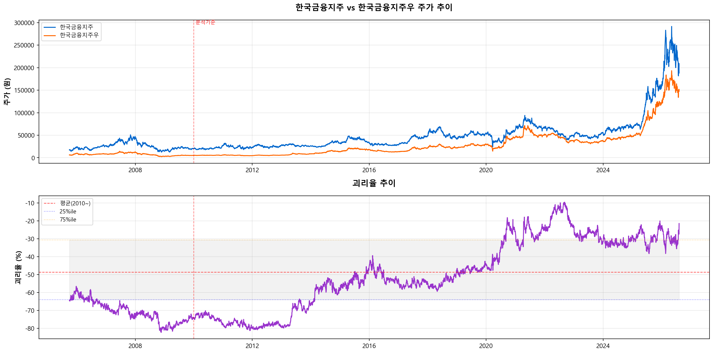

---

## 📌 삼성물산 (028260) vs 삼성물산우B (02826K)

**분석 기간**: 2014-12-18 ~ 2026-08-07 (2,851일)

### 현재 상황

| 항목 | 값 |
|:----:|:---|
| 삼성물산 | 336,500원 |
| 삼성물산우B | 208,500원 |
| **현재 괴리율** | **-38.04%** |
| 우선주 할인율 | 38.04% |
| 역사적 위치 | 하위 23.4% |
| Z-Score | -0.87σ |
| 종합 점수 | 15점 (±100점 만점) |
| **판정** | **⚪ 중립** |

**판정 근거:**

- ✅ 역사적 하위 25% (우선주 저평가)
- ❌ 최근 30일 평균보다 1%p 이상 높음

### 괴리율 통계

| 지표 | 값 |
|:----:|:---|
| 평균 | -27.38% |
| 중간값 | -28.87% |
| 표준편차 | 12.21% |
| 최소 (우선주 최저평가) | -50.47% |
| 최대 (우선주 최고평가) | 10.12% |

| 백분위 | 괴리율 | 의미 |
|:-----:|:------:|:-----|
| 10% | -42.16% | 우선주 매우 저평가 |
| 25% | -37.69% | 우선주 저평가 |
| 50% | -28.87% | 중간값 |
| 75% | -14.87% | 우선주 고평가 |
| 90% | -8.93% | 우선주 매우 고평가 |

### 기간별 괴리율

| 기간 | 평균 | 최소 | 최대 | 현재 대비 |
|:----:|:----:|:----:|:----:|:---------:|
| 최근 1개월 | -40.67% | -44.14% | -37.28% | +2.63%p |
| 최근 3개월 | -41.29% | -50.47% | -33.33% | +3.25%p |
| 최근 6개월 | -39.90% | -50.47% | -32.79% | +1.86%p |
| 최근 1년 | -34.48% | -50.47% | -24.14% | -3.56%p |
| 최근 3년 | -23.58% | -50.47% | -3.33% | -14.46%p |
| 최근 5년 | -21.61% | -50.47% | 10.12% | -16.43%p |

### 시장 상황별 괴리율

| 구분 | 기간 | 평균 괴리율 | 중간값 |
|:----:|:----:|:----------:|:------:|
| 상승장 | 780일 (27.4%) | -29.82% | -31.66% |
| 하락장 | 603일 (21.2%) | -27.54% | -28.93% |
| 중립장 | 1468일 (51.5%) | -26.02% | -27.48% |

### 역사적 극단값 (Top 5)

**🟦 우선주 최저평가 시점 (괴리율 최저)**

| 날짜 | 삼성물산 | 삼성물산우B | 괴리율 |
|:----:|--------:|----------:|:------:|
| 2026-06-04 | 535,000원 | 265,000원 | **-50.47%** |
| 2026-06-05 | 460,500원 | 231,500원 | **-49.73%** |
| 2026-06-17 | 490,000원 | 248,500원 | **-49.29%** |
| 2026-06-15 | 495,000원 | 252,000원 | **-49.09%** |
| 2026-06-16 | 497,000원 | 254,000원 | **-48.89%** |

**🟥 보통주 최저평가 시점 (괴리율 최고)**

| 날짜 | 삼성물산 | 삼성물산우B | 괴리율 |
|:----:|--------:|----------:|:------:|
| 2020-10-27 | 101,791원 | 112,092원 | **10.12%** |
| 2020-10-29 | 97,825원 | 106,958원 | **9.34%** |
| 2020-10-30 | 97,384원 | 103,963원 | **6.76%** |
| 2021-04-26 | 124,099원 | 128,525원 | **3.57%** |
| 2020-10-26 | 103,994원 | 105,675원 | **1.62%** |

### 차트

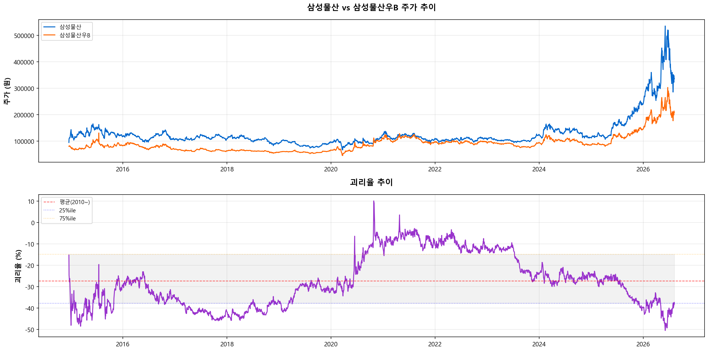

---

## 📌 아모레G (002790) vs 아모레G우 (002795)

**분석 기간**: 2010-01-04 ~ 2026-08-07 (4,082일)
**전체 데이터**: 2000-01-04 ~ 2026-08-07 (6,649일) — 2010년 이전은 참고용

### 현재 상황

| 항목 | 값 |
|:----:|:---|
| 아모레G | 27,250원 |
| 아모레G우 | 11,320원 |
| **현재 괴리율** | **-58.46%** |
| 우선주 할인율 | 58.46% |
| 역사적 위치 | 하위 80.5% |
| Z-Score | 0.76σ |
| 종합 점수 | -15점 (±100점 만점) |
| **판정** | **⚪ 중립** |

**판정 근거:**

- ❌ 역사적 상위 25% (우선주 고평가)
- ✅ 최근 30일 평균보다 1%p 이상 낮음

### 괴리율 통계 (2010년~)

| 지표 | 값 |
|:----:|:---|
| 평균 | -63.03% |
| 중간값 | -62.50% |
| 표준편차 | 6.05% |
| 최소 (우선주 최저평가) | -83.40% |
| 최대 (우선주 최고평가) | -45.20% |

| 백분위 | 괴리율 | 의미 |
|:-----:|:------:|:-----|
| 10% | -71.19% | 우선주 매우 저평가 |
| 25% | -66.02% | 우선주 저평가 |
| 50% | -62.50% | 중간값 |
| 75% | -59.36% | 우선주 고평가 |
| 90% | -56.41% | 우선주 매우 고평가 |

**📎 참고: 전체 기간 (2000-01-04~) 통계 비교**

| 지표 | 2010년 이후 | 전체 기간 |
|:----:|:----------:|:---------:|
| 평균 | -63.03% | -65.76% |
| 중간값 | -62.50% | -64.52% |
| 표준편차 | 6.05% | 7.54% |
| 최소 | -83.40% | -84.09% |
| 최대 | -45.20% | -45.20% |

### 기간별 괴리율

| 기간 | 평균 | 최소 | 최대 | 현재 대비 |
|:----:|:----:|:----:|:----:|:---------:|
| 최근 1개월 | -56.31% | -58.54% | -51.93% | -2.15%p |
| 최근 3개월 | -56.17% | -59.61% | -51.70% | -2.29%p |
| 최근 6개월 | -56.81% | -64.16% | -51.70% | -1.65%p |
| 최근 1년 | -58.02% | -64.16% | -51.70% | -0.44%p |
| 최근 3년 | -62.37% | -69.81% | -51.70% | +3.91%p |
| 최근 5년 | -63.09% | -69.85% | -51.70% | +4.63%p |

### 시장 상황별 괴리율

| 구분 | 기간 | 평균 괴리율 | 중간값 |
|:----:|:----:|:----------:|:------:|
| 상승장 | 1402일 (34.3%) | -64.30% | -63.13% |
| 하락장 | 1348일 (33.0%) | -61.71% | -61.93% |
| 중립장 | 1332일 (32.6%) | -63.03% | -62.72% |

### 역사적 극단값 (Top 5)

**🟦 우선주 최저평가 시점 (괴리율 최저)**

| 날짜 | 아모레G | 아모레G우 | 괴리율 |
|:----:|--------:|----------:|:------:|
| 2012-07-27 | 34,379원 | 5,708원 | **-83.40%** |
| 2012-08-02 | 34,012원 | 5,653원 | **-83.38%** |
| 2012-07-30 | 34,150원 | 5,708원 | **-83.28%** |
| 2012-08-13 | 35,248원 | 5,931원 | **-83.17%** |
| 2012-08-08 | 33,555원 | 5,668원 | **-83.11%** |

**🟥 보통주 최저평가 시점 (괴리율 최고)**

| 날짜 | 아모레G | 아모레G우 | 괴리율 |
|:----:|--------:|----------:|:------:|
| 2015-11-20 | 135,931원 | 74,495원 | **-45.20%** |
| 2015-11-18 | 134,539원 | 73,668원 | **-45.24%** |
| 2018-10-04 | 73,947원 | 39,925원 | **-46.01%** |
| 2015-12-11 | 135,931원 | 72,840원 | **-46.41%** |
| 2016-01-21 | 126,986원 | 67,767원 | **-46.63%** |

### 차트

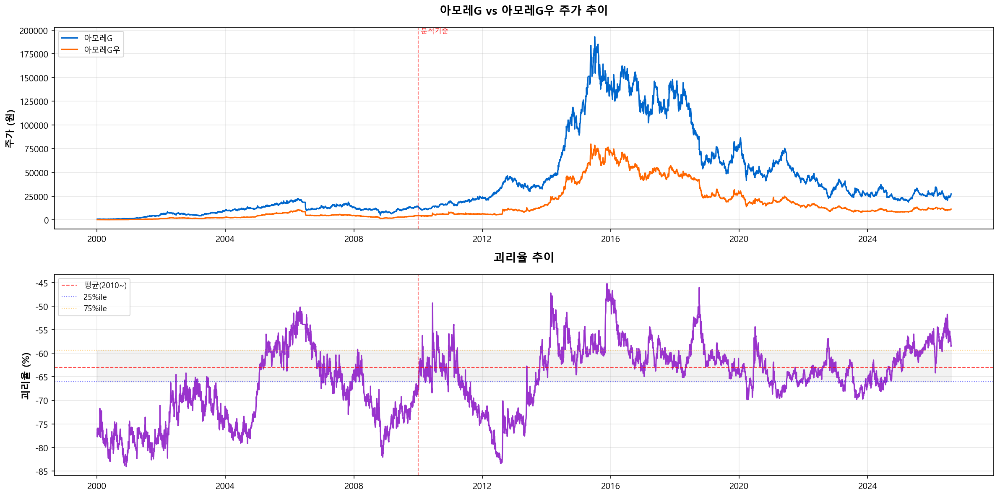

---

## 📌 NH투자증권 (005940) vs NH투자증권우 (005945)

**분석 기간**: 2010-01-04 ~ 2026-08-07 (4,082일)
**전체 데이터**: 2005-09-29 ~ 2026-08-07 (5,152일) — 2010년 이전은 참고용

### 현재 상황

| 항목 | 값 |
|:----:|:---|
| NH투자증권 | 27,800원 |
| NH투자증권우 | 24,900원 |
| **현재 괴리율** | **-10.43%** |
| 우선주 할인율 | 10.43% |
| 역사적 위치 | 하위 84.8% |
| Z-Score | 1.23σ |
| 종합 점수 | -55점 (±100점 만점) |
| **판정** | **🟥 보통주 강력 매수** |

**판정 근거:**

- ❌ 역사적 상위 25% (우선주 고평가)
- ❌ 평균 대비 1.0σ 이상 높음
- ❌ 최근 30일 평균보다 1%p 이상 높음

### 괴리율 통계 (2010년~)

| 지표 | 값 |
|:----:|:---|
| 평균 | -37.92% |
| 중간값 | -41.41% |
| 표준편차 | 22.28% |
| 최소 (우선주 최저평가) | -71.54% |
| 최대 (우선주 최고평가) | 0.75% |

| 백분위 | 괴리율 | 의미 |
|:-----:|:------:|:-----|
| 10% | -68.18% | 우선주 매우 저평가 |
| 25% | -58.64% | 우선주 저평가 |
| 50% | -41.41% | 중간값 |
| 75% | -14.42% | 우선주 고평가 |
| 90% | -8.13% | 우선주 매우 고평가 |

**📎 참고: 전체 기간 (2005-09-29~) 통계 비교**

| 지표 | 2010년 이후 | 전체 기간 |
|:----:|:----------:|:---------:|
| 평균 | -37.92% | -42.88% |
| 중간값 | -41.41% | -46.75% |
| 표준편차 | 22.28% | 22.18% |
| 최소 | -71.54% | -75.64% |
| 최대 | 0.75% | 0.75% |

### 기간별 괴리율

| 기간 | 평균 | 최소 | 최대 | 현재 대비 |
|:----:|:----:|:----:|:----:|:---------:|
| 최근 1개월 | -15.98% | -21.75% | -8.65% | +5.55%p |
| 최근 3개월 | -19.59% | -25.85% | -8.65% | +9.16%p |
| 최근 6개월 | -17.07% | -29.04% | -7.28% | +6.64%p |
| 최근 1년 | -14.52% | -29.04% | -3.90% | +4.08%p |
| 최근 3년 | -10.36% | -29.04% | 0.75% | -0.08%p |
| 최근 5년 | -16.34% | -44.09% | 0.75% | +5.90%p |

### 시장 상황별 괴리율

| 구분 | 기간 | 평균 괴리율 | 중간값 |
|:----:|:----:|:----------:|:------:|
| 상승장 | 1056일 (25.9%) | -38.91% | -43.56% |
| 하락장 | 843일 (20.7%) | -44.19% | -45.01% |
| 중립장 | 2183일 (53.5%) | -35.03% | -40.11% |

### 역사적 극단값 (Top 5)

**🟦 우선주 최저평가 시점 (괴리율 최저)**

| 날짜 | NH투자증권 | NH투자증권우 | 괴리율 |
|:----:|--------:|----------:|:------:|
| 2012-09-19 | 7,098원 | 2,020원 | **-71.54%** |
| 2013-01-29 | 6,880원 | 1,967원 | **-71.41%** |
| 2013-01-28 | 6,880원 | 1,971원 | **-71.35%** |
| 2013-02-22 | 7,016원 | 2,016원 | **-71.27%** |
| 2013-01-30 | 6,853원 | 1,971원 | **-71.23%** |

**🟥 보통주 최저평가 시점 (괴리율 최고)**

| 날짜 | NH투자증권 | NH투자증권우 | 괴리율 |
|:----:|--------:|----------:|:------:|
| 2022-06-10 | 7,928원 | 7,988원 | **0.75%** |
| 2022-09-23 | 7,342원 | 7,343원 | **0.01%** |
| 2022-09-22 | 7,421원 | 7,418원 | **-0.04%** |
| 2022-04-27 | 8,124원 | 8,100원 | **-0.28%** |
| 2022-04-25 | 8,202원 | 8,175원 | **-0.32%** |

### 차트

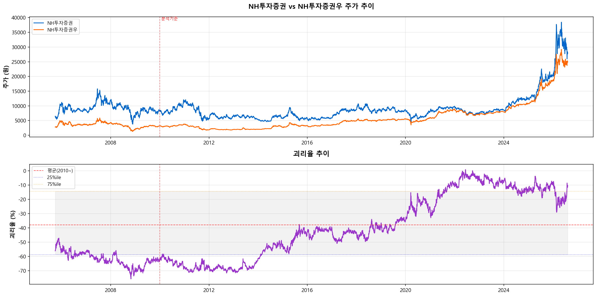

---

## 📌 SK하이닉스 (000660) vs SK스퀘어 (402340)

**분석 기간**: 2021-11-29 ~ 2026-08-07 (1,145일)

### 현재 상황

| 항목 | 값 |
|:----:|:---|
| SK하이닉스 | 1,422,000원 |
| SK스퀘어 | 939,000원 |
| **현재 괴리율** | **-33.97%** |
| 우선주 할인율 | 33.97% |
| 역사적 위치 | 하위 98.5% |
| Z-Score | 2.38σ |
| 종합 점수 | -80점 (±100점 만점) |
| **판정** | **🟥 보통주 강력 매수** |

**판정 근거:**

- ❌ 역사적 상위 10% (우선주 매우 고평가)
- ❌ 평균 대비 1.5σ 이상 높음
- ❌ 최근 30일 평균보다 1%p 이상 높음

### 괴리율 통계

| 지표 | 값 |
|:----:|:---|
| 평균 | -51.88% |
| 중간값 | -53.54% |
| 표준편차 | 7.53% |
| 최소 (우선주 최저평가) | -65.76% |
| 최대 (우선주 최고평가) | -28.30% |

| 백분위 | 괴리율 | 의미 |
|:-----:|:------:|:-----|
| 10% | -60.98% | 우선주 매우 저평가 |
| 25% | -56.71% | 우선주 저평가 |
| 50% | -53.54% | 중간값 |
| 75% | -47.07% | 우선주 고평가 |
| 90% | -40.14% | 우선주 매우 고평가 |

### 기간별 괴리율

| 기간 | 평균 | 최소 | 최대 | 현재 대비 |
|:----:|:----:|:----:|:----:|:---------:|
| 최근 1개월 | -35.83% | -40.32% | -30.27% | +1.87%p |
| 최근 3개월 | -38.53% | -47.15% | -28.30% | +4.57%p |
| 최근 6개월 | -40.31% | -50.19% | -28.30% | +6.35%p |
| 최근 1년 | -43.58% | -55.03% | -28.30% | +9.61%p |
| 최근 3년 | -52.07% | -65.76% | -28.30% | +18.11%p |

### 시장 상황별 괴리율

| 구분 | 기간 | 평균 괴리율 | 중간값 |
|:----:|:----:|:----------:|:------:|
| 상승장 | 536일 (46.8%) | -50.14% | -52.32% |
| 하락장 | 215일 (18.8%) | -51.94% | -53.60% |
| 중립장 | 394일 (34.4%) | -54.23% | -54.30% |

### 역사적 극단값 (Top 5)

**🟦 우선주 최저평가 시점 (괴리율 최저)**

| 날짜 | SK하이닉스 | SK스퀘어 | 괴리율 |
|:----:|--------:|----------:|:------:|
| 2023-10-24 | 124,397원 | 42,594원 | **-65.76%** |
| 2023-10-20 | 123,808원 | 42,644원 | **-65.56%** |
| 2023-09-14 | 119,577원 | 41,346원 | **-65.42%** |
| 2023-10-23 | 121,650원 | 42,295원 | **-65.23%** |
| 2023-10-18 | 127,536원 | 44,442원 | **-65.15%** |

**🟥 보통주 최저평가 시점 (괴리율 최고)**

| 날짜 | SK하이닉스 | SK스퀘어 | 괴리율 |
|:----:|--------:|----------:|:------:|
| 2026-06-23 | 2,555,000원 | 1,832,000원 | **-28.30%** |
| 2026-07-02 | 2,187,000원 | 1,525,000원 | **-30.27%** |
| 2021-11-29 | 109,990원 | 75,901원 | **-30.99%** |
| 2026-06-24 | 2,621,000원 | 1,799,000원 | **-31.36%** |
| 2026-07-01 | 2,560,000원 | 1,757,000원 | **-31.37%** |

### 차트

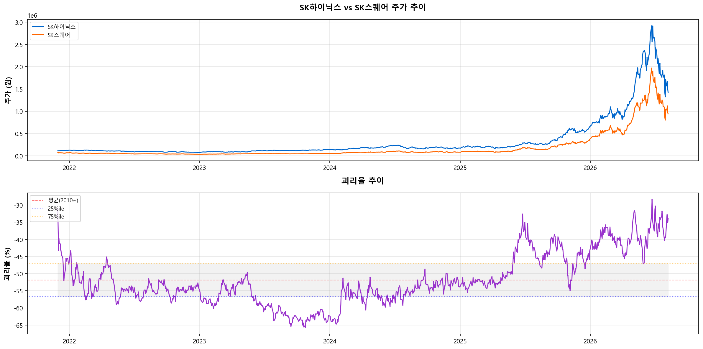

---

## ⚠️ 주의사항

1. **괴리율은 평균 회귀 경향**이 있지만, 장기간 지속될 수도 있습니다.
2. **우선주는 유동성이 낮아** 대량 매매 시 슬리피지가 발생할 수 있습니다.
3. **배당 기준일 전후**로 괴리율이 일시적으로 변동할 수 있습니다.
4. 이 분석은 **참고용**이며, 투자 판단은 본인의 책임입니다.

---

**데이터 출처**: market_data.db (SQLite) / Yahoo Finance (fallback)  
**분석 도구**: Python + pandas
