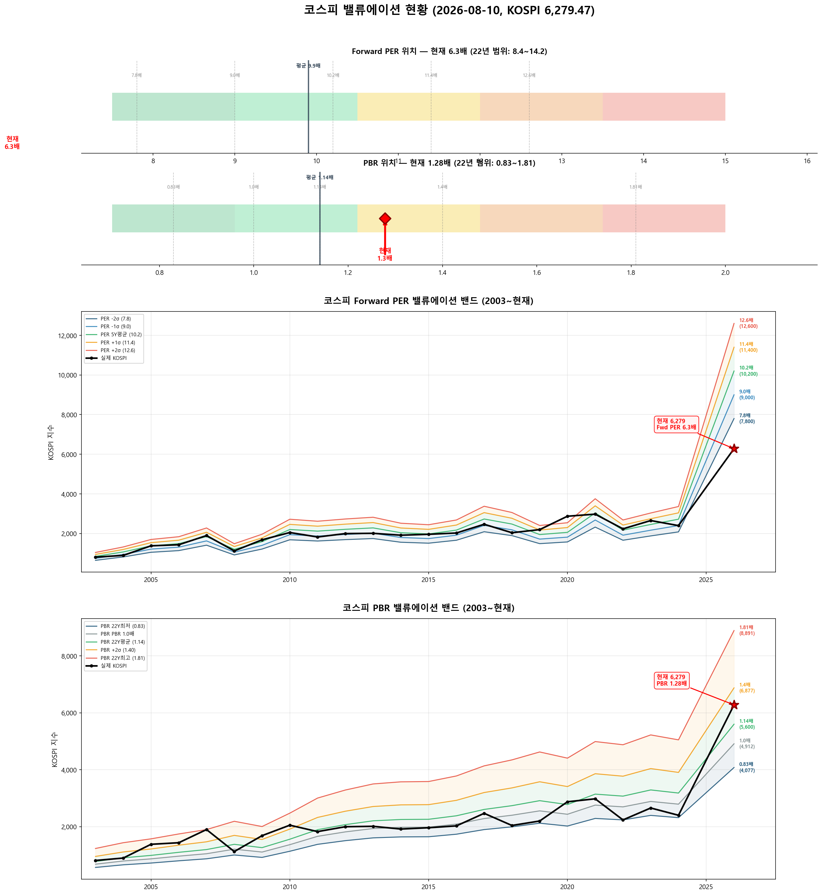

# 📋 MarketTop 일일 종합 (2026-08-10 09:06)

> A4 한 장 요약 — 상세는 각 시장 리포트 참조

---

### 🔴 코스피 6,279.47  —  📉 하락장 (신뢰도 100%)

| 과열 점수 | 38/100 🔵 저평가 |
|:---:|:---|

> ✅ **다음 매도 목표 6,564(+4.5%) 대기**

**📈 상승 시**

| 다음 매도 목표 | **6,564** (+4.5%) → 이격도106(MA10) + RSI80+ + MFI85+ (승률 71%) |
|:---:|:---|

**📉 하락 시**

| 1차 방어선 | **6,091** (-3%) → 30% 손절 |
|:---:|:---|
| 핵심 하락감지 | BB100%반전 + 이격도122(MA60) (승률 75%) |
| 강력 매도 | 전체 2개+ 전략 동시 발동 시 → 50% 청산 (검증승률 71%) |

**📍 분할매도 단계**

| 단계 | 목표가 | 등락률 | 전략 | 승률 | 틀렸을 때 |
|:---:|---:|:---:|:---|:---:|:---|
| 🎯 1단계 | **6,564** | +4.5% | 이격도106(MA10) + RSI80+ + MFI85+ | 71% | 평균+7% |

**🛑 손절 단계**

| 단계 | 손절가 | 비중 | 전략 | 승률 |
|:---:|---:|:---:|:---|:---:|
| 1단계 | **6,091** (-3%) | 30% | BB100%반전 + 이격도122(MA60) | 75% |
| 2단계 | **5,965** (-5%) | 30% | CCI100반전 + 이격도128(MA60) | 71% |

**🎯 방향성 종합**: 🟢 **상승 우세**

| 방향 | 전략 | 평균 승률 | 예상 변동 |
|:----:|:---:|:--------:|:--------:|
| 🔴 하락(매도) | 3개 | 72.6% | -2.33% |
| 🟢 상승(매수) | 6개 | 81.8% | +4.88% |

**📐 매도 Top1 [BB100%반전 + 이격도122(MA60)] 20일 수익률 분포**

  • 중앙값: **-5.1%** | 5%분위 -14.3% ~ 95%분위 +10.1%

**📐 매수 Top1 [하향이격도89(MA120) + RSI15- + Stoch5-] 20일 수익률 분포**

  • 중앙값: **+3.7%** | 5%분위 +2.1% ~ 95%분위 +23.9%

**💰 Kelly 권장 매도비중**

| 지표 | 값 | 의미 |
|:---|---:|:---|
| 평균 Half-Kelly (Top5) | **17%** | 매수 후 매도 신호 시 권장 청산비율 |
| 최대 Half-Kelly | 22% | 가장 강한 전략의 권장 비중 |
| 평균 Sharpe (Top5) | 0.85 | 보통 |
| 2% 이내 임박 전략 수 | 0개 | 신호 발동 임박도 |

---

### 🔵 코스닥 816.41  —  ↔️ 횡보장 (신뢰도 45%)

| 과열 점수 | 71/100 🟡 주의 |
|:---:|:---|
| ⚠️ 과열 지표 | Stoch 100 |

> ⚠️ **1/2단계 초과 — 초과분 매도 실행, 다음 목표 1,057(+29.5%) 대기**

**📈 상승 시**

| 단계 | 매도가 | 등락률 | 전략 | 승률 | 틀렸을 때 |
|:---:|---:|:---:|:---|:---:|:---|
| 🔴 1단계 | **762** | -6.7% | 이격도102(MA10) + 거래량2.5배+ | 88% | 평균+3.1% |
| ▶ 2단계 | **1,057** | +29.5% | 이격도116(MA60) + CCI160+ + ADX15+ | 86% | 잔여분 매도 |

> 💡 🔴 = 이미 초과 (즉시 축소). ▶ = 과거 유사 상황의 실제 상승폭 기반 목표.

**📉 하락 시**

| 1차 방어선 | **792** (-3%) → 30% 손절 |
|:---:|:---|
| 핵심 하락감지 | ADX15+ + MACD데드 + RSI70+ (승률 86%) |
| 강력 매도 | 하락반전 2개 중 2개+ 동시 발동 시 → 50% 청산 |

**📍 분할매도 단계**

| 단계 | 목표가 | 등락률 | 전략 | 승률 | 틀렸을 때 |
|:---:|---:|:---:|:---|:---:|:---|
| ⏳ 1단계 | **1,057** | +29.5% | 이격도116(MA60) + CCI160+ + ADX15+ | 86% | 평균+10% |

**🛑 손절 단계**

| 단계 | 손절가 | 비중 | 전략 | 승률 |
|:---:|---:|:---:|:---|:---:|
| 1단계 | **792** (-3%) | 30% | ADX15+ + MACD데드 + RSI70+ | 86% |
| 2단계 | **776** (-5%) | 30% | MFI65반전 + CCI200+ | 71% |

**🎯 방향성 종합**: 🔴 **하락 우세** (1개 임박)

| 방향 | 전략 | 평균 승률 | 예상 변동 |
|:----:|:---:|:--------:|:--------:|
| 🔴 하락(매도) | 4개 | 82.6% | -4.01% |
| 🟢 상승(매수) | 3개 | 85.2% | +7.70% |

**📐 매도 Top1 [이격도102(MA10) + 거래량2.5배+] 20일 수익률 분포**

  • 중앙값: **-3.4%** | 5%분위 -17.3% ~ 95%분위 +1.9%

**📐 매수 Top1 [하향이격도85(MA40) + RSI25-] 20일 수익률 분포**

  • 중앙값: **+8.1%** | 5%분위 -7.8% ~ 95%분위 +30.7%

**💰 Kelly 권장 매도비중**

| 지표 | 값 | 의미 |
|:---|---:|:---|
| 평균 Half-Kelly (Top5) | **32%** | 매수 후 매도 신호 시 권장 청산비율 |
| 최대 Half-Kelly | 41% | 가장 강한 전략의 권장 비중 |
| 평균 Sharpe (Top5) | 1.95 | 우수 |
| 2% 이내 임박 전략 수 | 0개 | 신호 발동 임박도 |

---

### 📊 코스피 밸류에이션

| 지표 | 현재 | 22Y평균 | 판단 |
|:---:|:---:|:---:|:---|
| **Fwd PER** | **6.3배** | 9.9배 | 극저평가 🟢🟢 |
| **PBR** | **1.28배** | 1.14배 | 적정 ⚪ |
| Fwd EPS | 1000 | - | BPS 4912 |

| PER 밴드 | 적정지수 | 괴리 |
|:---:|---:|:---:|
| -2σ (7.8) | 7,800 | +24.2% |
| -1σ (9.0) | 9,000 | +43.3% |
| 5Y평균 (10.2) | 10,200 | +62.4% |
| +1σ (11.4) | 11,400 | +81.5% |
| +2σ (12.6) | 12,600 | +100.7% |

---

### 📊 코스피 향후 60일 등락 위험 분석

> 💡 과거 30년간 지금과 비슷했던 상황(이격도 83%, 2개월 상승률 -20%) **171번** 발생
> → 그때 이후 2개월간 실제로 얼마나 올랐고 빠졌는지 통계

**📈 상승 가능성:**

| 항목 | 결과 | 해석 |
|:---|:---:|:---|
| **2개월 내 평균 최대상승폭** | **+13.8%** | 중위값 +11.6% |
| 역대 최고 사례 | +50.3% | 지수 9,437 |

| 상승폭 | 발생 확률 | 그때 지수 |
|:---|:---:|---:|
| +5% 이상 상승 | **75%** | 6,593 |
| +10% 이상 상승 | **55%** | 6,907 |
| +15% 이상 상승 | **37%** | 7,221 |
| +20% 이상 상승 | **26%** | 7,535 |

**📉 하락 위험:** 🔴 고위험

| 항목 | 결과 | 해석 |
|:---|:---:|:---|
| **2개월 내 평균 최대낙폭** | **-13.2%** | 중위값 -10.6% |
| 역대 최악의 경우 | -43.9% | 지수 3,523 |
| ⚠️ 평소보다 위험한 정도 | **2.3배** | 평소보다 2.3배 더 빠질 수 있음 |

**2개월 내 하락 확률과 예상 지수:**

| 하락폭 | 발생 확률 | 그때 지수 |
|:---|:---:|---:|
| -5% 이상 하락 | **69%** | 5,965 |
| -10% 이상 하락 | **51%** | 5,652 |
| -15% 이상 하락 | **37%** | 5,338 |
| -20% 이상 하락 | **23%** | 5,024 |

**💡 확률 기반 판단:**

> 과거 유사 상황에서 **+10%까지 상승할 확률이 50% 이상**이었고,
> 동시에 **-10%까지 하락할 확률도 50% 이상**이었습니다.
>
> 📌 상승·하락 기대값이 비슷합니다 (상승 10.4 vs 하락 9.1).
> 현재가 부근에서 **분할 익절** 추천. 목표 **6,907**(+10%), 손절 **5,652**(-10%)

### 📊 코스닥 향후 60일 등락 위험 분석

> 💡 과거 30년간 지금과 비슷했던 상황(이격도 90%, 2개월 상승률 -31%) **109번** 발생
> → 그때 이후 2개월간 실제로 얼마나 올랐고 빠졌는지 통계

**📈 상승 가능성:**

| 항목 | 결과 | 해석 |
|:---|:---:|:---|
| **2개월 내 평균 최대상승폭** | **+8.8%** | 중위값 +4.4% |
| 역대 최고 사례 | +40.6% | 지수 1,148 |

| 상승폭 | 발생 확률 | 그때 지수 |
|:---|:---:|---:|
| +5% 이상 상승 | **48%** | 857 |
| +10% 이상 상승 | **37%** | 898 |
| +15% 이상 상승 | **23%** | 939 |
| +20% 이상 상승 | **14%** | 980 |

**📉 하락 위험:** 🔴 고위험

| 항목 | 결과 | 해석 |
|:---|:---:|:---|
| **2개월 내 평균 최대낙폭** | **-19.6%** | 중위값 -22.7% |
| 역대 최악의 경우 | -48.6% | 지수 420 |
| ⚠️ 평소보다 위험한 정도 | **2.2배** | 평소보다 2.2배 더 빠질 수 있음 |

**2개월 내 하락 확률과 예상 지수:**

| 하락폭 | 발생 확률 | 그때 지수 |
|:---|:---:|---:|
| -5% 이상 하락 | **72%** | 776 |
| -10% 이상 하락 | **60%** | 735 |
| -15% 이상 하락 | **58%** | 694 |
| -20% 이상 하락 | **54%** | 653 |

**💡 확률 기반 판단:**

> 📌 -20% 하락 확률이 높고 큰 상승 확률은 낮습니다.
> **비중 축소** 후 **653**(-20%) 이탈 시 전량 손절 추천

---

### 🔮 코스피 과거 유사 패턴 분석

> 💡 현재와 가격 움직임 + 기술적 지표가 비슷했던 과거 **14개 시점** 발견 (평균 유사도 70%)
> → 그 시점 이후 40일간 실제로 어떻게 움직였는지 통계

**📊 유사 패턴 이후 40일간 등락 범위:**

| 구분 | 평균 | 중위값 | 지수 환산 |
|:---|:---:|:---:|---:|
| 📈 최대 상승폭 | **+8.8%** | +7.7% | 6,762 |
| 📉 최대 하락폭 | **-8.5%** | -3.8% | 6,044 |
| 🚀 최고 사례 | +23.8% | - | 7,775 |
| 💥 최악 사례 | -35.5% | - | 4,048 |

**🔄 반전 패턴:**

| 패턴 | 평균 크기 | 해석 |
|:---|:---:|:---|
| 고점 찍고 반락 | **-14.9%** | 상승 후 평균 이만큼 되돌림 |
| 저점 찍고 반등 | **+14.4%** | 하락 후 평균 이만큼 회복 |

**⏰ 시간대별 상승 확률:**

| 기간 | 상승 확률 | 평균 수익률 | 예상 지수 |
|:---|:---:|:---:|---:|
| 10일 후 | **57%** | -0.2% | 6,269 |
| 20일 후 | **64%** | +0.1% | 6,285 |
| 40일 후 | **64%** | +2.1% | 6,412 |

**📈 대표 경로 (중위값):**

| 시점 | 낙관(상위25%) | 중립(중위) | 비관(하위25%) | 중립 지수 |
|:---|:---:|:---:|:---:|---:|
| 5일 후 | +2.9% | +1.6% | -3.7% | 6,378 |
| 10일 후 | +4.3% | +1.6% | -5.4% | 6,381 |
| 20일 후 | +7.6% | +3.4% | -2.4% | 6,491 |
| 30일 후 | +10.0% | +5.5% | -3.7% | 6,624 |
| 40일 후 | +9.6% | +4.9% | -2.0% | 6,585 |

**📅 가장 유사했던 과거 시점 (최근 5개):**

- **2025-04-18** (유사도 73%) — 지수 2,483 → 40일간 최대+21.7%, 최대0.0%, 최종+21.7%
- **2020-03-30** (유사도 72%) — 지수 1,717 → 40일간 최대+18.3%, 최대-1.8%, 최종+18.2%
- **2017-04-21** (유사도 71%) — 지수 2,165 → 40일간 최대+10.0%, 최대0.0%, 최종+9.9%
- **2015-09-03** (유사도 72%) — 지수 1,916 → 40일간 최대+6.9%, 최대-1.9%, 최종+6.9%
- **2011-10-07** (유사도 69%) — 지수 1,760 → 40일간 최대+9.6%, 최대0.0%, 최종+8.9%

### 🔮 코스닥 과거 유사 패턴 분석

> 💡 현재와 가격 움직임 + 기술적 지표가 비슷했던 과거 **20개 시점** 발견 (평균 유사도 72%)
> → 그 시점 이후 40일간 실제로 어떻게 움직였는지 통계

**📊 유사 패턴 이후 40일간 등락 범위:**

| 구분 | 평균 | 중위값 | 지수 환산 |
|:---|:---:|:---:|---:|
| 📈 최대 상승폭 | **+5.0%** | +3.4% | 845 |
| 📉 최대 하락폭 | **-10.6%** | -5.7% | 770 |
| 🚀 최고 사례 | +14.9% | - | 938 |
| 💥 최악 사례 | -44.1% | - | 457 |

**🔄 반전 패턴:**

| 패턴 | 평균 크기 | 해석 |
|:---|:---:|:---|
| 고점 찍고 반락 | **-16.4%** | 상승 후 평균 이만큼 되돌림 |
| 저점 찍고 반등 | **+10.8%** | 하락 후 평균 이만큼 회복 |

**⏰ 시간대별 상승 확률:**

| 기간 | 상승 확률 | 평균 수익률 | 예상 지수 |
|:---|:---:|:---:|---:|
| 10일 후 | **60%** | -0.7% | 811 |
| 20일 후 | **40%** | -2.3% | 797 |
| 40일 후 | **40%** | -2.0% | 800 |

**📈 대표 경로 (중위값):**

| 시점 | 낙관(상위25%) | 중립(중위) | 비관(하위25%) | 중립 지수 |
|:---|:---:|:---:|:---:|---:|
| 5일 후 | +1.7% | +0.3% | -1.9% | 819 |
| 10일 후 | +1.9% | +0.7% | -3.3% | 822 |
| 20일 후 | +3.7% | -2.6% | -5.2% | 795 |
| 30일 후 | +5.6% | -0.9% | -10.5% | 809 |
| 40일 후 | +8.3% | -1.6% | -12.0% | 803 |

**📅 가장 유사했던 과거 시점 (최근 5개):**

- **2025-04-18** (유사도 74%) — 지수 718 → 40일간 최대+10.3%, 최대-0.6%, 최종+10.3%
- **2024-12-18** (유사도 69%) — 지수 698 → 40일간 최대+11.6%, 최대-4.5%, 최종+11.0%
- **2024-06-11** (유사도 71%) — 지수 868 → 40일간 최대+0.3%, 최대-20.4%, 최종-15.6%
- **2023-07-19** (유사도 75%) — 지수 924 → 40일간 최대+1.8%, 최대-5.0%, 최종-2.6%
- **2020-02-12** (유사도 75%) — 지수 687 → 40일간 최대+0.9%, 최대-37.6%, 최종-11.5%

---

### 📎 상세 리포트

- 코스피: [코스피_고점판독리포트_20260810_090553.md](코스피_고점판독리포트_20260810_090553.md)
- 코스닥: [코스닥_고점판독리포트_20260810_090602.md](코스닥_고점판독리포트_20260810_090602.md)

---

*본 리포트는 백테스트 기반 참고용이며, 투자 판단의 최종 책임은 투자자 본인에게 있습니다.*