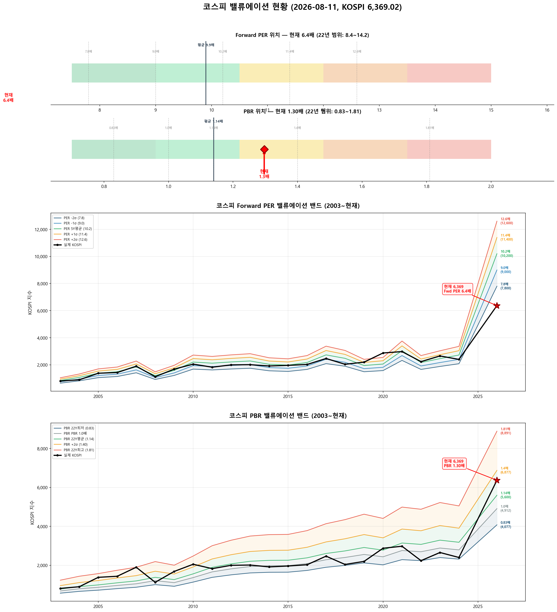

# 📋 MarketTop 일일 종합 (2026-08-11 15:17)

> A4 한 장 요약 — 상세는 각 시장 리포트 참조

---

### 🔴 코스피 6,369.02  —  📉 하락장 (신뢰도 100%)

| 과열 점수 | 41/100 🟢 정상 |
|:---:|:---|

> ✅ **다음 매도 목표 6,603(+3.7%) 대기**

**📈 상승 시**

| 다음 매도 목표 | **6,603** (+3.7%) → 이격도106(MA10) + RSI80+ + MFI85+ (승률 71%) |
|:---:|:---|

**📉 하락 시**

| 1차 방어선 | **6,178** (-3%) → 30% 손절 |
|:---:|:---|
| 핵심 하락감지 | BB100%반전 + 이격도122(MA60) (승률 75%) |
| 강력 매도 | 전체 2개+ 전략 동시 발동 시 → 50% 청산 (검증승률 71%) |

**📍 분할매도 단계**

| 단계 | 목표가 | 등락률 | 전략 | 승률 | 틀렸을 때 |
|:---:|---:|:---:|:---|:---:|:---|
| 🎯 1단계 | **6,603** | +3.7% | 이격도106(MA10) + RSI80+ + MFI85+ | 71% | 평균+7% |

**🛑 손절 단계**

| 단계 | 손절가 | 비중 | 전략 | 승률 |
|:---:|---:|:---:|:---|:---:|
| 1단계 | **6,178** (-3%) | 30% | BB100%반전 + 이격도122(MA60) | 75% |
| 2단계 | **6,051** (-5%) | 30% | CCI100반전 + 이격도128(MA60) | 71% |

**🎯 방향성 종합**: 🟢 **상승 우세**

| 방향 | 전략 | 평균 승률 | 예상 변동 |
|:----:|:---:|:--------:|:--------:|
| 🔴 하락(매도) | 3개 | 72.6% | -2.33% |
| 🟢 상승(매수) | 6개 | 81.8% | +4.88% |

**📐 매도 Top1 [BB100%반전 + 이격도122(MA60)] 20일 수익률 분포**

  • 중앙값: **-5.1%** | 5%분위 -14.3% ~ 95%분위 +10.1%

**📐 매수 Top1 [하향이격도89(MA120) + RSI15- + Stoch5-] 20일 수익률 분포**

  • 중앙값: **+3.7%** | 5%분위 +2.1% ~ 95%분위 +23.9%

**💰 Kelly 권장 매도비중**

| 지표 | 값 | 의미 |
|:---|---:|:---|
| 평균 Half-Kelly (Top5) | **17%** | 매수 후 매도 신호 시 권장 청산비율 |
| 최대 Half-Kelly | 22% | 가장 강한 전략의 권장 비중 |
| 평균 Sharpe (Top5) | 0.85 | 보통 |
| 2% 이내 임박 전략 수 | 0개 | 신호 발동 임박도 |

---

### 🔵 코스닥 853.78  —  ↔️ 횡보장 (신뢰도 80%)

| 과열 점수 | 75/100 🔴 과열 |
|:---:|:---|
| ⚠️ 과열 지표 | Stoch 91, CCI 155, BB 90% |

> ⚠️ **1/2단계 초과 — 초과분 매도 실행, 다음 목표 1,052(+23.2%) 대기**

**📈 상승 시**

| 단계 | 매도가 | 등락률 | 전략 | 승률 | 틀렸을 때 |
|:---:|---:|:---:|:---|:---:|:---|
| 🔴 1단계 | **781** | -8.6% | 이격도102(MA10) + 거래량2.5배+ | 88% | 평균+3.1% |
| ▶ 2단계 | **1,052** | +23.2% | 이격도116(MA60) + CCI160+ + ADX15+ | 86% | 잔여분 매도 |

> 💡 🔴 = 이미 초과 (즉시 축소). ▶ = 과거 유사 상황의 실제 상승폭 기반 목표.

**📉 하락 시**

| 1차 방어선 | **828** (-3%) → 30% 손절 |
|:---:|:---|
| 핵심 하락감지 | ADX15+ + MACD데드 + RSI70+ (승률 86%) |
| 강력 매도 | 하락반전 2개 중 2개+ 동시 발동 시 → 50% 청산 |

**📍 분할매도 단계**

| 단계 | 목표가 | 등락률 | 전략 | 승률 | 틀렸을 때 |
|:---:|---:|:---:|:---|:---:|:---|
| ⏳ 1단계 | **1,052** | +23.2% | 이격도116(MA60) + CCI160+ + ADX15+ | 86% | 평균+10% |

**🛑 손절 단계**

| 단계 | 손절가 | 비중 | 전략 | 승률 |
|:---:|---:|:---:|:---|:---:|
| 1단계 | **828** (-3%) | 30% | ADX15+ + MACD데드 + RSI70+ | 86% |
| 2단계 | **811** (-5%) | 30% | MFI65반전 + CCI200+ | 71% |

**🎯 방향성 종합**: 🔴 **하락 우세** (1개 임박)

| 방향 | 전략 | 평균 승률 | 예상 변동 |
|:----:|:---:|:--------:|:--------:|
| 🔴 하락(매도) | 4개 | 82.6% | -4.01% |
| 🟢 상승(매수) | 3개 | 85.2% | +7.70% |

**📐 매도 Top1 [이격도102(MA10) + 거래량2.5배+] 20일 수익률 분포**

  • 중앙값: **-3.4%** | 5%분위 -17.3% ~ 95%분위 +1.9%

**📐 매수 Top1 [하향이격도85(MA40) + RSI25-] 20일 수익률 분포**

  • 중앙값: **+8.1%** | 5%분위 -7.8% ~ 95%분위 +30.7%

**💰 Kelly 권장 매도비중**

| 지표 | 값 | 의미 |
|:---|---:|:---|
| 평균 Half-Kelly (Top5) | **32%** | 매수 후 매도 신호 시 권장 청산비율 |
| 최대 Half-Kelly | 41% | 가장 강한 전략의 권장 비중 |
| 평균 Sharpe (Top5) | 1.95 | 우수 |
| 2% 이내 임박 전략 수 | 0개 | 신호 발동 임박도 |

---

### 📊 코스피 밸류에이션

| 지표 | 현재 | 22Y평균 | 판단 |
|:---:|:---:|:---:|:---|
| **Fwd PER** | **6.4배** | 9.9배 | 극저평가 🟢🟢 |
| **PBR** | **1.30배** | 1.14배 | 적정 ⚪ |
| Fwd EPS | 1000 | - | BPS 4912 |

| PER 밴드 | 적정지수 | 괴리 |
|:---:|---:|:---:|
| -2σ (7.8) | 7,800 | +22.5% |
| -1σ (9.0) | 9,000 | +41.3% |
| 5Y평균 (10.2) | 10,200 | +60.2% |
| +1σ (11.4) | 11,400 | +79.0% |
| +2σ (12.6) | 12,600 | +97.8% |

---

### 📊 코스피 향후 60일 등락 위험 분석

> 💡 과거 30년간 지금과 비슷했던 상황(이격도 84%, 2개월 상승률 -20%) **243번** 발생
> → 그때 이후 2개월간 실제로 얼마나 올랐고 빠졌는지 통계

**📈 상승 가능성:**

| 항목 | 결과 | 해석 |
|:---|:---:|:---|
| **2개월 내 평균 최대상승폭** | **+13.3%** | 중위값 +10.3% |
| 역대 최고 사례 | +50.3% | 지수 9,572 |

| 상승폭 | 발생 확률 | 그때 지수 |
|:---|:---:|---:|
| +5% 이상 상승 | **76%** | 6,687 |
| +10% 이상 상승 | **52%** | 7,006 |
| +15% 이상 상승 | **35%** | 7,324 |
| +20% 이상 상승 | **23%** | 7,643 |

**📉 하락 위험:** 🔴 고위험

| 항목 | 결과 | 해석 |
|:---|:---:|:---|
| **2개월 내 평균 최대낙폭** | **-13.0%** | 중위값 -9.8% |
| 역대 최악의 경우 | -45.8% | 지수 3,452 |
| ⚠️ 평소보다 위험한 정도 | **2.2배** | 평소보다 2.2배 더 빠질 수 있음 |

**2개월 내 하락 확률과 예상 지수:**

| 하락폭 | 발생 확률 | 그때 지수 |
|:---|:---:|---:|
| -5% 이상 하락 | **69%** | 6,051 |
| -10% 이상 하락 | **49%** | 5,732 |
| -15% 이상 하락 | **34%** | 5,414 |
| -20% 이상 하락 | **21%** | 5,095 |

**💡 확률 기반 판단:**

> 과거 유사 상황에서 **+10%까지 상승할 확률이 50% 이상**이었고,
> 동시에 **-5%까지 하락할 확률도 50% 이상**이었습니다.
>
> 📌 상승·하락 기대값이 비슷합니다 (상승 10.1 vs 하락 8.9).
> 현재가 부근에서 **분할 익절** 추천. 목표 **7,006**(+10%), 손절 **6,051**(-5%)

### 📊 코스닥 향후 60일 등락 위험 분석

> 💡 과거 30년간 지금과 비슷했던 상황(이격도 94%, 2개월 상승률 -28%) **111번** 발생
> → 그때 이후 2개월간 실제로 얼마나 올랐고 빠졌는지 통계

**📈 상승 가능성:**

| 항목 | 결과 | 해석 |
|:---|:---:|:---|
| **2개월 내 평균 최대상승폭** | **+8.5%** | 중위값 +7.0% |
| 역대 최고 사례 | +34.7% | 지수 1,150 |

| 상승폭 | 발생 확률 | 그때 지수 |
|:---|:---:|---:|
| +5% 이상 상승 | **52%** | 896 |
| +10% 이상 상승 | **47%** | 939 |
| +15% 이상 상승 | **13%** | 982 |
| +20% 이상 상승 | **12%** | 1,025 |

**📉 하락 위험:** 🔴 고위험

| 항목 | 결과 | 해석 |
|:---|:---:|:---|
| **2개월 내 평균 최대낙폭** | **-15.8%** | 중위값 -10.6% |
| 역대 최악의 경우 | -50.5% | 지수 423 |
| ⚠️ 평소보다 위험한 정도 | **1.8배** | 평소보다 1.8배 더 빠질 수 있음 |

**2개월 내 하락 확률과 예상 지수:**

| 하락폭 | 발생 확률 | 그때 지수 |
|:---|:---:|---:|
| -5% 이상 하락 | **65%** | 811 |
| -10% 이상 하락 | **53%** | 768 |
| -15% 이상 하락 | **39%** | 726 |
| -20% 이상 하락 | **35%** | 683 |

**💡 확률 기반 판단:**

> 과거 유사 상황에서 **+5%까지 상승할 확률이 50% 이상**이었고,
> 동시에 **-10%까지 하락할 확률도 50% 이상**이었습니다.
>
> 📌 **하락 기대값(10.2)이 상승 기대값(4.4)보다 큽니다 (2.3배)**.
> **비중 축소 우선**. 보유 시 **768**(-10%) 반드시 손절, 목표 **896**(+5%)

---

### 🔮 코스피 과거 유사 패턴 분석

> 💡 현재와 가격 움직임 + 기술적 지표가 비슷했던 과거 **20개 시점** 발견 (평균 유사도 71%)
> → 그 시점 이후 40일간 실제로 어떻게 움직였는지 통계

**📊 유사 패턴 이후 40일간 등락 범위:**

| 구분 | 평균 | 중위값 | 지수 환산 |
|:---|:---:|:---:|---:|
| 📈 최대 상승폭 | **+9.7%** | +8.3% | 6,901 |
| 📉 최대 하락폭 | **-6.6%** | -2.9% | 6,187 |
| 🚀 최고 사례 | +47.1% | - | 9,366 |
| 💥 최악 사례 | -35.2% | - | 4,129 |

**🔄 반전 패턴:**

| 패턴 | 평균 크기 | 해석 |
|:---|:---:|:---|
| 고점 찍고 반락 | **-12.7%** | 상승 후 평균 이만큼 되돌림 |
| 저점 찍고 반등 | **+13.2%** | 하락 후 평균 이만큼 회복 |

**⏰ 시간대별 상승 확률:**

| 기간 | 상승 확률 | 평균 수익률 | 예상 지수 |
|:---|:---:|:---:|---:|
| 10일 후 | **55%** | +1.4% | 6,459 |
| 20일 후 | **65%** | +2.1% | 6,500 |
| 40일 후 | **75%** | +3.0% | 6,561 |

**📈 대표 경로 (중위값):**

| 시점 | 낙관(상위25%) | 중립(중위) | 비관(하위25%) | 중립 지수 |
|:---|:---:|:---:|:---:|---:|
| 5일 후 | +3.2% | +2.1% | -0.8% | 6,505 |
| 10일 후 | +5.3% | +0.6% | -2.6% | 6,406 |
| 20일 후 | +7.7% | +4.3% | -3.7% | 6,643 |
| 30일 후 | +8.4% | +3.8% | -2.2% | 6,609 |
| 40일 후 | +9.1% | +2.9% | -1.0% | 6,553 |

**📅 가장 유사했던 과거 시점 (최근 5개):**

- **2025-04-21** (유사도 79%) — 지수 2,488 → 40일간 최대+21.4%, 최대-0.1%, 최종+21.1%
- **2023-07-20** (유사도 70%) — 지수 2,600 → 40일간 최대+2.6%, 최대-3.7%, 최종+0.0%
- **2021-03-09** (유사도 67%) — 지수 2,976 → 40일간 최대+8.2%, 최대-0.6%, 최종+5.8%
- **2020-03-31** (유사도 72%) — 지수 1,755 → 40일간 최대+17.7%, 최대-3.9%, 최종+17.7%
- **2017-04-24** (유사도 72%) — 지수 2,174 → 40일간 최대+9.9%, 최대0.0%, 최종+9.9%

### 🔮 코스닥 과거 유사 패턴 분석

> 💡 현재와 가격 움직임 + 기술적 지표가 비슷했던 과거 **20개 시점** 발견 (평균 유사도 72%)
> → 그 시점 이후 40일간 실제로 어떻게 움직였는지 통계

**📊 유사 패턴 이후 40일간 등락 범위:**

| 구분 | 평균 | 중위값 | 지수 환산 |
|:---|:---:|:---:|---:|
| 📈 최대 상승폭 | **+3.7%** | +1.4% | 866 |
| 📉 최대 하락폭 | **-10.2%** | -7.5% | 790 |
| 🚀 최고 사례 | +11.7% | - | 953 |
| 💥 최악 사례 | -37.7% | - | 532 |

**🔄 반전 패턴:**

| 패턴 | 평균 크기 | 해석 |
|:---|:---:|:---|
| 고점 찍고 반락 | **-13.8%** | 상승 후 평균 이만큼 되돌림 |
| 저점 찍고 반등 | **+9.3%** | 하락 후 평균 이만큼 회복 |

**⏰ 시간대별 상승 확률:**

| 기간 | 상승 확률 | 평균 수익률 | 예상 지수 |
|:---|:---:|:---:|---:|
| 10일 후 | **40%** | -1.4% | 842 |
| 20일 후 | **35%** | -3.2% | 827 |
| 40일 후 | **35%** | -3.3% | 826 |

**📈 대표 경로 (중위값):**

| 시점 | 낙관(상위25%) | 중립(중위) | 비관(하위25%) | 중립 지수 |
|:---|:---:|:---:|:---:|---:|
| 5일 후 | +1.3% | -0.5% | -1.5% | 849 |
| 10일 후 | +2.0% | -1.3% | -4.2% | 843 |
| 20일 후 | +0.8% | -2.0% | -6.0% | 837 |
| 30일 후 | +4.5% | -5.6% | -8.3% | 806 |
| 40일 후 | +6.3% | -2.7% | -7.8% | 830 |

**📅 가장 유사했던 과거 시점 (최근 5개):**

- **2025-04-21** (유사도 74%) — 지수 715 → 40일간 최대+10.6%, 최대-0.2%, 최종+9.7%
- **2024-06-12** (유사도 71%) — 지수 871 → 40일간 최대+0.1%, 최대-20.6%, 최종-14.0%
- **2023-12-19** (유사도 74%) — 지수 858 → 40일간 최대+3.1%, 최대-6.9%, 최종+0.9%
- **2023-07-20** (유사도 79%) — 지수 932 → 40일간 최대+0.9%, 최대-5.8%, 최종-3.5%
- **2022-11-02** (유사도 73%) — 지수 697 → 40일간 최대+6.8%, 최대-2.6%, 최종-2.6%

---

### 📎 상세 리포트

- 코스피: [코스피_고점판독리포트_20260811_151659.md](코스피_고점판독리포트_20260811_151659.md)
- 코스닥: [코스닥_고점판독리포트_20260811_151719.md](코스닥_고점판독리포트_20260811_151719.md)

---

*본 리포트는 백테스트 기반 참고용이며, 투자 판단의 최종 책임은 투자자 본인에게 있습니다.*