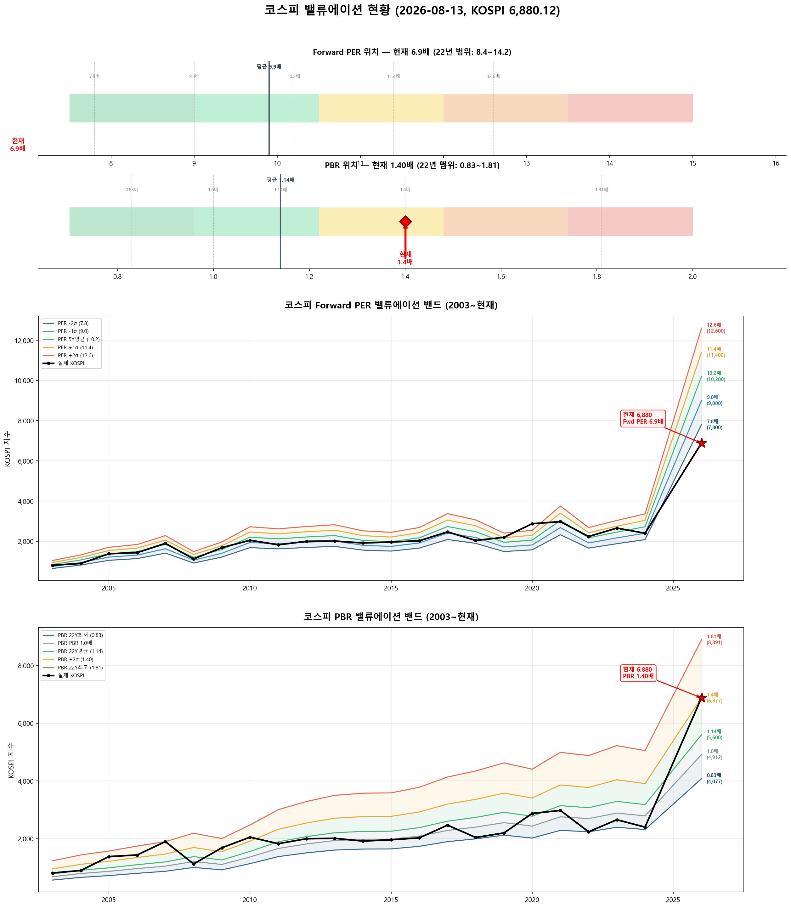

# 📋 MarketTop 일일 종합 (2026-08-13 09:12)

> A4 한 장 요약 — 상세는 각 시장 리포트 참조

---

### 🔵 코스피 6,880.12  —  ↔️ 횡보장 (신뢰도 55%)

| 과열 점수 | 66/100 🟡 주의 |
|:---:|:---|
| ⚠️ 과열 지표 | Stoch 99 |

> 🚨 **매도 목표 전 1단계 초과 — 보유분 즉시 축소 권장**

**📈 상승 시**

| 단계 | 매도가 | 등락률 | 전략 | 승률 | 틀렸을 때 |
|:---:|---:|:---:|:---|:---:|:---|
| 🔴 1단계 | **6,834** | -0.7% | 이격도106(MA10) + RSI80+ + MFI85+ | 71% | 평균+7.0% |
| ▶ 2단계 | **7,052** | +2.5% | 10일내 중위 상승폭 (확률 50%) | - | 잔여분 익절 |

> 💡 🔴 = 이미 초과 (즉시 축소). ▶ = 과거 유사 상황의 실제 상승폭 기반 목표.

**📉 하락 시**

| 1차 방어선 | **6,674** (-3%) → 30% 손절 |
|:---:|:---|
| 핵심 하락감지 | BB100%반전 + 이격도122(MA60) (승률 75%) |
| 강력 매도 | 전체 2개+ 전략 동시 발동 시 → 50% 청산 (검증승률 71%) |

**📍 분할매도 단계**

> 🚨 **전 1단계 매도 목표 초과** — 보유분 즉시 축소 권장

**🛑 손절 단계**

| 단계 | 손절가 | 비중 | 전략 | 승률 |
|:---:|---:|:---:|:---|:---:|
| 1단계 | **6,674** (-3%) | 30% | BB100%반전 + 이격도122(MA60) | 75% |
| 2단계 | **6,536** (-5%) | 30% | CCI100반전 + 이격도128(MA60) | 71% |

**🎯 방향성 종합**: 🟡 **약한 상승**

| 방향 | 전략 | 평균 승률 | 예상 변동 |
|:----:|:---:|:--------:|:--------:|
| 🔴 하락(매도) | 3개 | 72.6% | -2.33% |
| 🟢 상승(매수) | 5개 | 77.4% | +2.45% |

**📐 매도 Top1 [BB100%반전 + 이격도122(MA60)] 20일 수익률 분포**

  • 중앙값: **-5.1%** | 5%분위 -14.3% ~ 95%분위 +10.1%

**📐 매수 Top1 [외국인상위5%매수 + MFI35-] 20일 수익률 분포**

  • 중앙값: **+2.0%** | 5%분위 -3.2% ~ 95%분위 +5.3%

**💰 Kelly 권장 매도비중**

| 지표 | 값 | 의미 |
|:---|---:|:---|
| 평균 Half-Kelly (Top5) | **17%** | 매수 후 매도 신호 시 권장 청산비율 |
| 최대 Half-Kelly | 22% | 가장 강한 전략의 권장 비중 |
| 평균 Sharpe (Top5) | 0.85 | 보통 |
| 2% 이내 임박 전략 수 | 0개 | 신호 발동 임박도 |

---

### 🔵 코스닥 859.32  —  ↔️ 횡보장 (신뢰도 100%)

| 과열 점수 | 75/100 🔴 과열 |
|:---:|:---|
| ⚠️ 과열 지표 | Stoch 94, CCI 138, BB 86% |

> ⚠️ **1/2단계 초과 — 초과분 매도 실행, 다음 목표 1,042(+21.2%) 대기**

**📈 상승 시**

| 단계 | 매도가 | 등락률 | 전략 | 승률 | 틀렸을 때 |
|:---:|---:|:---:|:---|:---:|:---|
| 🔴 1단계 | **823** | -4.2% | 이격도102(MA10) + 거래량2.5배+ | 88% | 평균+3.1% |
| ▶ 2단계 | **1,042** | +21.2% | 이격도116(MA60) + CCI160+ + ADX15+ | 86% | 잔여분 매도 |

> 💡 🔴 = 이미 초과 (즉시 축소). ▶ = 과거 유사 상황의 실제 상승폭 기반 목표.

**📉 하락 시**

| 1차 방어선 | **834** (-3%) → 30% 손절 |
|:---:|:---|
| 핵심 하락감지 | ADX15+ + MACD데드 + RSI70+ (승률 86%) |
| 강력 매도 | 하락반전 2개 중 2개+ 동시 발동 시 → 50% 청산 |

**📍 분할매도 단계**

| 단계 | 목표가 | 등락률 | 전략 | 승률 | 틀렸을 때 |
|:---:|---:|:---:|:---|:---:|:---|
| ⏳ 1단계 | **1,042** | +21.2% | 이격도116(MA60) + CCI160+ + ADX15+ | 86% | 평균+10% |

**🛑 손절 단계**

| 단계 | 손절가 | 비중 | 전략 | 승률 |
|:---:|---:|:---:|:---|:---:|
| 1단계 | **834** (-3%) | 30% | ADX15+ + MACD데드 + RSI70+ | 86% |
| 2단계 | **816** (-5%) | 30% | MFI65반전 + CCI200+ | 71% |

**🎯 방향성 종합**: 🔴 **하락 우세** (1개 임박)

| 방향 | 전략 | 평균 승률 | 예상 변동 |
|:----:|:---:|:--------:|:--------:|
| 🔴 하락(매도) | 4개 | 82.6% | -4.01% |
| 🟢 상승(매수) | 3개 | 85.2% | +7.70% |

**📐 매도 Top1 [이격도102(MA10) + 거래량2.5배+] 20일 수익률 분포**

  • 중앙값: **-3.4%** | 5%분위 -17.3% ~ 95%분위 +1.9%

**📐 매수 Top1 [하향이격도85(MA40) + RSI25-] 20일 수익률 분포**

  • 중앙값: **+8.1%** | 5%분위 -7.8% ~ 95%분위 +30.7%

**💰 Kelly 권장 매도비중**

| 지표 | 값 | 의미 |
|:---|---:|:---|
| 평균 Half-Kelly (Top5) | **32%** | 매수 후 매도 신호 시 권장 청산비율 |
| 최대 Half-Kelly | 41% | 가장 강한 전략의 권장 비중 |
| 평균 Sharpe (Top5) | 1.95 | 우수 |
| 2% 이내 임박 전략 수 | 0개 | 신호 발동 임박도 |

---

### 📊 코스피 밸류에이션

| 지표 | 현재 | 22Y평균 | 판단 |
|:---:|:---:|:---:|:---|
| **Fwd PER** | **6.9배** | 9.9배 | 극저평가 🟢🟢 |
| **PBR** | **1.40배** | 1.14배 | 고평가 🟡 |
| Fwd EPS | 1000 | - | BPS 4912 |

| PER 밴드 | 적정지수 | 괴리 |
|:---:|---:|:---:|
| -2σ (7.8) | 7,800 | +13.4% |
| -1σ (9.0) | 9,000 | +30.8% |
| 5Y평균 (10.2) | 10,200 | +48.3% |
| +1σ (11.4) | 11,400 | +65.7% |
| +2σ (12.6) | 12,600 | +83.1% |

---

### 📊 코스피 향후 60일 등락 위험 분석

> 💡 과거 30년간 지금과 비슷했던 상황(이격도 91%, 2개월 상승률 -8%) **971번** 발생
> → 그때 이후 2개월간 실제로 얼마나 올랐고 빠졌는지 통계

**📈 상승 가능성:**

| 항목 | 결과 | 해석 |
|:---|:---:|:---|
| **2개월 내 평균 최대상승폭** | **+9.3%** | 중위값 +6.5% |
| 역대 최고 사례 | +108.9% | 지수 14,372 |

| 상승폭 | 발생 확률 | 그때 지수 |
|:---|:---:|---:|
| +5% 이상 상승 | **60%** | 7,224 |
| +10% 이상 상승 | **34%** | 7,568 |
| +15% 이상 상승 | **15%** | 7,912 |
| +20% 이상 상승 | **11%** | 8,256 |

**📉 하락 위험:** 🟠 주의

| 항목 | 결과 | 해석 |
|:---|:---:|:---|
| **2개월 내 평균 최대낙폭** | **-9.8%** | 중위값 -6.4% |
| 역대 최악의 경우 | -50.0% | 지수 3,440 |
| ⚠️ 평소보다 위험한 정도 | **1.7배** | 평소보다 1.7배 더 빠질 수 있음 |

**2개월 내 하락 확률과 예상 지수:**

| 하락폭 | 발생 확률 | 그때 지수 |
|:---|:---:|---:|
| -5% 이상 하락 | **56%** | 6,536 |
| -10% 이상 하락 | **33%** | 6,192 |
| -15% 이상 하락 | **21%** | 5,848 |
| -20% 이상 하락 | **15%** | 5,504 |

**💡 확률 기반 판단:**

> 과거 유사 상황에서 **+5%까지 상승할 확률이 50% 이상**이었고,
> 동시에 **-5%까지 하락할 확률도 50% 이상**이었습니다.
>
> 📌 상승·하락 기대값이 비슷합니다 (상승 5.6 vs 하락 5.5).
> 현재가 부근에서 **분할 익절** 추천. 목표 **7,224**(+5%), 손절 **6,536**(-5%)

### 📊 코스닥 향후 60일 등락 위험 분석

> 💡 과거 30년간 지금과 비슷했던 상황(이격도 96%, 2개월 상승률 -23%) **262번** 발생
> → 그때 이후 2개월간 실제로 얼마나 올랐고 빠졌는지 통계

**📈 상승 가능성:**

| 항목 | 결과 | 해석 |
|:---|:---:|:---|
| **2개월 내 평균 최대상승폭** | **+9.1%** | 중위값 +8.3% |
| 역대 최고 사례 | +33.8% | 지수 1,150 |

| 상승폭 | 발생 확률 | 그때 지수 |
|:---|:---:|---:|
| +5% 이상 상승 | **68%** | 902 |
| +10% 이상 상승 | **39%** | 945 |
| +15% 이상 상승 | **12%** | 988 |
| +20% 이상 상승 | **10%** | 1,031 |

**📉 하락 위험:** 🟠 주의

| 항목 | 결과 | 해석 |
|:---|:---:|:---|
| **2개월 내 평균 최대낙폭** | **-9.4%** | 중위값 -5.7% |
| 역대 최악의 경우 | -50.4% | 지수 426 |
| 평소보다 위험한 정도 | 1.1배 | 평소와 비슷한 수준 |

**2개월 내 하락 확률과 예상 지수:**

| 하락폭 | 발생 확률 | 그때 지수 |
|:---|:---:|---:|
| -5% 이상 하락 | **53%** | 816 |
| -10% 이상 하락 | **37%** | 773 |
| -15% 이상 하락 | **21%** | 730 |
| -20% 이상 하락 | **15%** | 687 |

**💡 확률 기반 판단:**

> 과거 유사 상황에서 **+5%까지 상승할 확률이 50% 이상**이었고,
> 동시에 **-5%까지 하락할 확률도 50% 이상**이었습니다.
>
> 📌 상승·하락 기대값이 비슷합니다 (상승 6.2 vs 하락 5.0).
> 현재가 부근에서 **분할 익절** 추천. 목표 **902**(+5%), 손절 **816**(-5%)

---

### 🔮 코스피 과거 유사 패턴 분석

> 💡 현재와 가격 움직임 + 기술적 지표가 비슷했던 과거 **20개 시점** 발견 (평균 유사도 73%)
> → 그 시점 이후 40일간 실제로 어떻게 움직였는지 통계

**📊 유사 패턴 이후 40일간 등락 범위:**

| 구분 | 평균 | 중위값 | 지수 환산 |
|:---|:---:|:---:|---:|
| 📈 최대 상승폭 | **+7.9%** | +7.3% | 7,379 |
| 📉 최대 하락폭 | **-3.0%** | -1.1% | 6,804 |
| 🚀 최고 사례 | +23.1% | - | 8,467 |
| 💥 최악 사례 | -18.1% | - | 5,633 |

**🔄 반전 패턴:**

| 패턴 | 평균 크기 | 해석 |
|:---|:---:|:---|
| 고점 찍고 반락 | **-7.5%** | 상승 후 평균 이만큼 되돌림 |
| 저점 찍고 반등 | **+9.6%** | 하락 후 평균 이만큼 회복 |

**⏰ 시간대별 상승 확률:**

| 기간 | 상승 확률 | 평균 수익률 | 예상 지수 |
|:---|:---:|:---:|---:|
| 10일 후 | **60%** | +2.1% | 7,024 |
| 20일 후 | **80%** | +3.6% | 7,125 |
| 40일 후 | **75%** | +4.5% | 7,192 |

**📈 대표 경로 (중위값):**

| 시점 | 낙관(상위25%) | 중립(중위) | 비관(하위25%) | 중립 지수 |
|:---|:---:|:---:|:---:|---:|
| 5일 후 | +2.7% | +1.3% | +0.6% | 6,972 |
| 10일 후 | +4.1% | +2.9% | -0.6% | 7,078 |
| 20일 후 | +6.7% | +4.9% | +3.8% | 7,215 |
| 30일 후 | +7.6% | +5.2% | +0.7% | 7,236 |
| 40일 후 | +8.8% | +6.5% | +0.8% | 7,330 |

**📅 가장 유사했던 과거 시점 (최근 5개):**

- **2025-04-23** (유사도 83%) — 지수 2,526 → 40일간 최대+23.1%, 최대-0.1%, 최종+23.1%
- **2024-02-01** (유사도 74%) — 지수 2,542 → 40일간 최대+8.4%, 최대0.0%, 최종+8.3%
- **2023-07-24** (유사도 76%) — 지수 2,629 → 40일간 최대+1.5%, 최대-4.7%, 최종-2.6%
- **2022-10-18** (유사도 72%) — 지수 2,250 → 40일간 최대+10.4%, 최대-1.6%, 최종+5.4%
- **2022-07-18** (유사도 68%) — 지수 2,375 → 40일간 최대+6.7%, 최대-0.2%, 최종+1.1%

### 🔮 코스닥 과거 유사 패턴 분석

> 💡 현재와 가격 움직임 + 기술적 지표가 비슷했던 과거 **20개 시점** 발견 (평균 유사도 73%)
> → 그 시점 이후 40일간 실제로 어떻게 움직였는지 통계

**📊 유사 패턴 이후 40일간 등락 범위:**

| 구분 | 평균 | 중위값 | 지수 환산 |
|:---|:---:|:---:|---:|
| 📈 최대 상승폭 | **+5.1%** | +2.5% | 881 |
| 📉 최대 하락폭 | **-8.3%** | -6.4% | 805 |
| 🚀 최고 사례 | +20.6% | - | 1,036 |
| 💥 최악 사례 | -38.2% | - | 531 |

**🔄 반전 패턴:**

| 패턴 | 평균 크기 | 해석 |
|:---|:---:|:---|
| 고점 찍고 반락 | **-11.9%** | 상승 후 평균 이만큼 되돌림 |
| 저점 찍고 반등 | **+10.7%** | 하락 후 평균 이만큼 회복 |

**⏰ 시간대별 상승 확률:**

| 기간 | 상승 확률 | 평균 수익률 | 예상 지수 |
|:---|:---:|:---:|---:|
| 10일 후 | **45%** | -1.0% | 851 |
| 20일 후 | **40%** | -2.4% | 839 |
| 40일 후 | **50%** | -0.9% | 852 |

**📈 대표 경로 (중위값):**

| 시점 | 낙관(상위25%) | 중립(중위) | 비관(하위25%) | 중립 지수 |
|:---|:---:|:---:|:---:|---:|
| 5일 후 | +1.8% | +0.1% | -1.5% | 860 |
| 10일 후 | +2.4% | -0.4% | -3.4% | 856 |
| 20일 후 | +3.4% | -2.5% | -6.5% | 838 |
| 30일 후 | +7.3% | -0.8% | -7.3% | 852 |
| 40일 후 | +6.0% | -0.6% | -7.7% | 855 |

**📅 가장 유사했던 과거 시점 (최근 5개):**

- **2025-09-15** (유사도 72%) — 지수 853 → 40일간 최대+8.7%, 최대-2.1%, 최종+5.9%
- **2025-04-23** (유사도 75%) — 지수 726 → 40일간 최대+10.3%, 최대-1.7%, 최종+9.9%
- **2023-12-21** (유사도 75%) — 지수 859 → 40일간 최대+2.9%, 최대-7.1%, 최종+1.2%
- **2023-07-24** (유사도 81%) — 지수 930 → 40일간 최대+1.1%, 최대-5.7%, 최종-4.9%
- **2023-01-16** (유사도 73%) — 지수 717 → 40일간 최대+13.9%, 최대-1.0%, 최종+9.1%

---

### 📎 상세 리포트

- 코스피: [코스피_고점판독리포트_20260813_091245.md](코스피_고점판독리포트_20260813_091245.md)
- 코스닥: [코스닥_고점판독리포트_20260813_091257.md](코스닥_고점판독리포트_20260813_091257.md)

---

*본 리포트는 백테스트 기반 참고용이며, 투자 판단의 최종 책임은 투자자 본인에게 있습니다.*