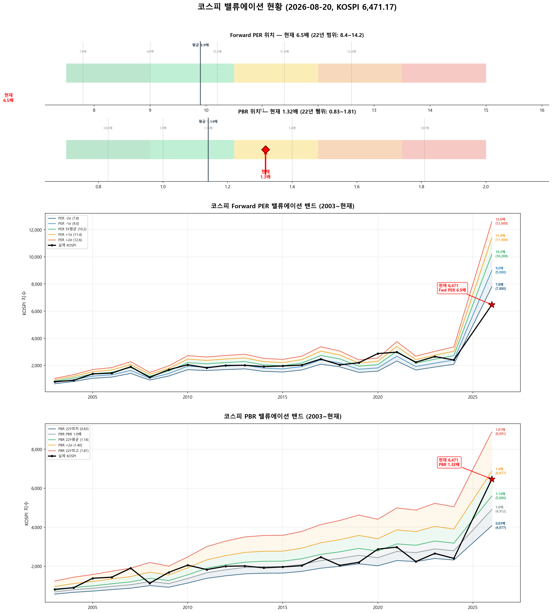

# 📋 MarketTop 일일 종합 (2026-08-20 08:40)

> A4 한 장 요약 — 상세는 각 시장 리포트 참조

---

### 🔵 코스피 6,471.17  —  ↔️ 횡보장 (신뢰도 80%)

| 과열 점수 | 54/100 🟢 정상 |
|:---:|:---|

> ✅ **다음 매도 목표 6,944(+7.3%) 대기**

**📈 상승 시**

| 다음 매도 목표 | **6,944** (+7.3%) → 이격도106(MA10) + RSI80+ + MFI85+ (승률 71%) |
|:---:|:---|

**📉 하락 시**

| 1차 방어선 | **6,277** (-3%) → 30% 손절 |
|:---:|:---|
| 핵심 하락감지 | BB100%반전 + 이격도122(MA60) (승률 75%) |
| 강력 매도 | 전체 2개+ 전략 동시 발동 시 → 50% 청산 (검증승률 71%) |

**📍 분할매도 단계**

| 단계 | 목표가 | 등락률 | 전략 | 승률 | 틀렸을 때 |
|:---:|---:|:---:|:---|:---:|:---|
| ⏳ 1단계 | **6,944** | +7.3% | 이격도106(MA10) + RSI80+ + MFI85+ | 71% | 평균+7% |

**🛑 손절 단계**

| 단계 | 손절가 | 비중 | 전략 | 승률 |
|:---:|---:|:---:|:---|:---:|
| 1단계 | **6,277** (-3%) | 30% | BB100%반전 + 이격도122(MA60) | 75% |
| 2단계 | **6,148** (-5%) | 30% | CCI100반전 + 이격도128(MA60) | 71% |

**🎯 방향성 종합**: 🟢 **상승 우세**

| 방향 | 전략 | 평균 승률 | 예상 변동 |
|:----:|:---:|:--------:|:--------:|
| 🔴 하락(매도) | 3개 | 72.6% | -2.33% |
| 🟢 상승(매수) | 6개 | 76.4% | +2.99% |

**📐 매도 Top1 [BB100%반전 + 이격도122(MA60)] 20일 수익률 분포**

  • 중앙값: **-5.1%** | 5%분위 -14.3% ~ 95%분위 +10.1%

**📐 매수 Top1 [MDD-20%이하 + 외국인매수전환 + RSI30-] 20일 수익률 분포**

  • 중앙값: **+5.7%** | 5%분위 -4.7% ~ 95%분위 +17.5%

**💰 Kelly 권장 매도비중**

| 지표 | 값 | 의미 |
|:---|---:|:---|
| 평균 Half-Kelly (Top5) | **17%** | 매수 후 매도 신호 시 권장 청산비율 |
| 최대 Half-Kelly | 22% | 가장 강한 전략의 권장 비중 |
| 평균 Sharpe (Top5) | 0.85 | 보통 |
| 2% 이내 임박 전략 수 | 0개 | 신호 발동 임박도 |

---

### 🔵 코스닥 824.46  —  ↔️ 횡보장 (신뢰도 65%)

| 과열 점수 | 68/100 🟡 주의 |
|:---:|:---|
| ⚠️ 과열 지표 | RSI 79 |

> ✅ **다음 매도 목표 852(+3.4%) 대기**

**📈 상승 시**

| 다음 매도 목표 | **852** (+3.4%) → 이격도102(MA10) + 거래량2.5배+ (승률 88%) |
|:---:|:---|

**📉 하락 시**

| 1차 방어선 | **800** (-3%) → 30% 손절 |
|:---:|:---|
| 핵심 하락감지 | ADX15+ + MACD데드 + RSI70+ (승률 86%) |
| 강력 매도 | 하락반전 2개 중 2개+ 동시 발동 시 → 50% 청산 |

**📍 분할매도 단계**

| 단계 | 목표가 | 등락률 | 전략 | 승률 | 틀렸을 때 |
|:---:|---:|:---:|:---|:---:|:---|
| 🎯 1단계 | **852** | +3.4% | 이격도102(MA10) + 거래량2.5배+ | 88% | 평균+3% |
| ⏳ 2단계 | **1,028** | +24.7% | 이격도116(MA60) + CCI160+ + ADX15+ | 86% | 평균+10% |

**🛑 손절 단계**

| 단계 | 손절가 | 비중 | 전략 | 승률 |
|:---:|---:|:---:|:---|:---:|
| 1단계 | **800** (-3%) | 30% | ADX15+ + MACD데드 + RSI70+ | 86% |
| 2단계 | **783** (-5%) | 30% | MFI65반전 + CCI200+ | 71% |

**🎯 방향성 종합**: 🔴 **하락 우세** (1개 임박)

| 방향 | 전략 | 평균 승률 | 예상 변동 |
|:----:|:---:|:--------:|:--------:|
| 🔴 하락(매도) | 4개 | 82.6% | -4.01% |
| 🟢 상승(매수) | 3개 | 85.2% | +7.70% |

**📐 매도 Top1 [이격도102(MA10) + 거래량2.5배+] 20일 수익률 분포**

  • 중앙값: **-3.4%** | 5%분위 -17.3% ~ 95%분위 +1.9%

**📐 매수 Top1 [하향이격도85(MA40) + RSI25-] 20일 수익률 분포**

  • 중앙값: **+8.1%** | 5%분위 -7.8% ~ 95%분위 +30.7%

**💰 Kelly 권장 매도비중**

| 지표 | 값 | 의미 |
|:---|---:|:---|
| 평균 Half-Kelly (Top5) | **32%** | 매수 후 매도 신호 시 권장 청산비율 |
| 최대 Half-Kelly | 41% | 가장 강한 전략의 권장 비중 |
| 평균 Sharpe (Top5) | 1.95 | 우수 |
| 2% 이내 임박 전략 수 | 0개 | 신호 발동 임박도 |

---

### 📊 코스피 밸류에이션

| 지표 | 현재 | 22Y평균 | 판단 |
|:---:|:---:|:---:|:---|
| **Fwd PER** | **6.5배** | 9.9배 | 극저평가 🟢🟢 |
| **PBR** | **1.32배** | 1.14배 | 고평가 🟡 |
| Fwd EPS | 1000 | - | BPS 4912 |

| PER 밴드 | 적정지수 | 괴리 |
|:---:|---:|:---:|
| -2σ (7.8) | 7,800 | +20.5% |
| -1σ (9.0) | 9,000 | +39.1% |
| 5Y평균 (10.2) | 10,200 | +57.6% |
| +1σ (11.4) | 11,400 | +76.2% |
| +2σ (12.6) | 12,600 | +94.7% |

---

### 📊 코스피 향후 60일 등락 위험 분석

> 💡 과거 30년간 지금과 비슷했던 상황(이격도 86%, 2개월 상승률 -17%) **362번** 발생
> → 그때 이후 2개월간 실제로 얼마나 올랐고 빠졌는지 통계

**📈 상승 가능성:**

| 항목 | 결과 | 해석 |
|:---|:---:|:---|
| **2개월 내 평균 최대상승폭** | **+12.0%** | 중위값 +9.5% |
| 역대 최고 사례 | +50.3% | 지수 9,726 |

| 상승폭 | 발생 확률 | 그때 지수 |
|:---|:---:|---:|
| +5% 이상 상승 | **73%** | 6,795 |
| +10% 이상 상승 | **46%** | 7,118 |
| +15% 이상 상승 | **27%** | 7,442 |
| +20% 이상 상승 | **19%** | 7,765 |

**📉 하락 위험:** 🔴 고위험

| 항목 | 결과 | 해석 |
|:---|:---:|:---|
| **2개월 내 평균 최대낙폭** | **-12.8%** | 중위값 -9.6% |
| 역대 최악의 경우 | -47.5% | 지수 3,395 |
| ⚠️ 평소보다 위험한 정도 | **2.2배** | 평소보다 2.2배 더 빠질 수 있음 |

**2개월 내 하락 확률과 예상 지수:**

| 하락폭 | 발생 확률 | 그때 지수 |
|:---|:---:|---:|
| -5% 이상 하락 | **67%** | 6,148 |
| -10% 이상 하락 | **48%** | 5,824 |
| -15% 이상 하락 | **31%** | 5,500 |
| -20% 이상 하락 | **22%** | 5,177 |

**💡 확률 기반 판단:**

> 과거 유사 상황에서 **+5%까지 상승할 확률이 50% 이상**이었고,
> 동시에 **-5%까지 하락할 확률도 50% 이상**이었습니다.
>
> 📌 상승·하락 기대값이 비슷합니다 (상승 8.8 vs 하락 8.6).
> 현재가 부근에서 **분할 익절** 추천. 목표 **6,795**(+5%), 손절 **6,148**(-5%)

### 📊 코스닥 향후 60일 등락 위험 분석

> 💡 과거 30년간 지금과 비슷했던 상황(이격도 93%, 2개월 상승률 -25%) **233번** 발생
> → 그때 이후 2개월간 실제로 얼마나 올랐고 빠졌는지 통계

**📈 상승 가능성:**

| 항목 | 결과 | 해석 |
|:---|:---:|:---|
| **2개월 내 평균 최대상승폭** | **+8.4%** | 중위값 +7.8% |
| 역대 최고 사례 | +37.6% | 지수 1,135 |

| 상승폭 | 발생 확률 | 그때 지수 |
|:---|:---:|---:|
| +5% 이상 상승 | **58%** | 866 |
| +10% 이상 상승 | **43%** | 907 |
| +15% 이상 상승 | **11%** | 948 |
| +20% 이상 상승 | **9%** | 989 |

**📉 하락 위험:** 🔴 고위험

| 항목 | 결과 | 해석 |
|:---|:---:|:---|
| **2개월 내 평균 최대낙폭** | **-15.5%** | 중위값 -10.9% |
| 역대 최악의 경우 | -51.6% | 지수 399 |
| ⚠️ 평소보다 위험한 정도 | **1.7배** | 평소보다 1.7배 더 빠질 수 있음 |

**2개월 내 하락 확률과 예상 지수:**

| 하락폭 | 발생 확률 | 그때 지수 |
|:---|:---:|---:|
| -5% 이상 하락 | **67%** | 783 |
| -10% 이상 하락 | **53%** | 742 |
| -15% 이상 하락 | **37%** | 701 |
| -20% 이상 하락 | **32%** | 660 |

**💡 확률 기반 판단:**

> 과거 유사 상황에서 **+5%까지 상승할 확률이 50% 이상**이었고,
> 동시에 **-10%까지 하락할 확률도 50% 이상**이었습니다.
>
> 📌 **하락 기대값(10.4)이 상승 기대값(4.9)보다 큽니다 (2.1배)**.
> **비중 축소 우선**. 보유 시 **742**(-10%) 반드시 손절, 목표 **866**(+5%)

---

### 🔮 코스피 과거 유사 패턴 분석

> 💡 현재와 가격 움직임 + 기술적 지표가 비슷했던 과거 **20개 시점** 발견 (평균 유사도 70%)
> → 그 시점 이후 40일간 실제로 어떻게 움직였는지 통계

**📊 유사 패턴 이후 40일간 등락 범위:**

| 구분 | 평균 | 중위값 | 지수 환산 |
|:---|:---:|:---:|---:|
| 📈 최대 상승폭 | **+7.9%** | +6.9% | 6,920 |
| 📉 최대 하락폭 | **-4.3%** | -2.7% | 6,296 |
| 🚀 최고 사례 | +21.9% | - | 7,891 |
| 💥 최악 사례 | -17.6% | - | 5,335 |

**🔄 반전 패턴:**

| 패턴 | 평균 크기 | 해석 |
|:---|:---:|:---|
| 고점 찍고 반락 | **-8.3%** | 상승 후 평균 이만큼 되돌림 |
| 저점 찍고 반등 | **+10.6%** | 하락 후 평균 이만큼 회복 |

**⏰ 시간대별 상승 확률:**

| 기간 | 상승 확률 | 평균 수익률 | 예상 지수 |
|:---|:---:|:---:|---:|
| 10일 후 | **60%** | +1.2% | 6,549 |
| 20일 후 | **70%** | +2.2% | 6,614 |
| 40일 후 | **80%** | +3.7% | 6,713 |

**📈 대표 경로 (중위값):**

| 시점 | 낙관(상위25%) | 중립(중위) | 비관(하위25%) | 중립 지수 |
|:---|:---:|:---:|:---:|---:|
| 5일 후 | +2.7% | +0.5% | -2.2% | 6,503 |
| 10일 후 | +3.3% | +0.3% | -0.7% | 6,493 |
| 20일 후 | +6.2% | +2.9% | -1.7% | 6,657 |
| 30일 후 | +5.2% | +3.9% | -1.5% | 6,721 |
| 40일 후 | +6.8% | +5.3% | +2.3% | 6,817 |

**📅 가장 유사했던 과거 시점 (최근 5개):**

- **2025-04-28** (유사도 76%) — 지수 2,549 → 40일간 최대+21.9%, 최대0.0%, 최종+20.5%
- **2023-07-27** (유사도 71%) — 지수 2,604 → 40일간 최대+2.4%, 최대-3.8%, 최종-3.7%
- **2022-10-21** (유사도 71%) — 지수 2,213 → 40일간 최대+12.2%, 최대0.0%, 최종+6.6%
- **2021-06-29** (유사도 68%) — 지수 3,287 → 40일간 최대+0.6%, 최대-6.9%, 최종-4.3%
- **2021-03-16** (유사도 71%) — 지수 3,067 → 40일간 최대+5.9%, 최대-2.3%, 최종+3.1%

### 🔮 코스닥 과거 유사 패턴 분석

> 💡 현재와 가격 움직임 + 기술적 지표가 비슷했던 과거 **20개 시점** 발견 (평균 유사도 73%)
> → 그 시점 이후 40일간 실제로 어떻게 움직였는지 통계

**📊 유사 패턴 이후 40일간 등락 범위:**

| 구분 | 평균 | 중위값 | 지수 환산 |
|:---|:---:|:---:|---:|
| 📈 최대 상승폭 | **+6.1%** | +6.1% | 875 |
| 📉 최대 하락폭 | **-7.5%** | -3.6% | 795 |
| 🚀 최고 사례 | +21.7% | - | 1,003 |
| 💥 최악 사례 | -37.2% | - | 518 |

**🔄 반전 패턴:**

| 패턴 | 평균 크기 | 해석 |
|:---|:---:|:---|
| 고점 찍고 반락 | **-12.8%** | 상승 후 평균 이만큼 되돌림 |
| 저점 찍고 반등 | **+11.3%** | 하락 후 평균 이만큼 회복 |

**⏰ 시간대별 상승 확률:**

| 기간 | 상승 확률 | 평균 수익률 | 예상 지수 |
|:---|:---:|:---:|---:|
| 10일 후 | **55%** | +0.0% | 825 |
| 20일 후 | **55%** | -1.4% | 813 |
| 40일 후 | **50%** | +0.4% | 828 |

**📈 대표 경로 (중위값):**

| 시점 | 낙관(상위25%) | 중립(중위) | 비관(하위25%) | 중립 지수 |
|:---|:---:|:---:|:---:|---:|
| 5일 후 | +1.5% | +0.4% | -1.2% | 828 |
| 10일 후 | +4.0% | +1.2% | -2.8% | 834 |
| 20일 후 | +4.6% | +2.1% | -5.6% | 842 |
| 30일 후 | +5.4% | +2.3% | -4.6% | 843 |
| 40일 후 | +7.5% | +0.4% | -4.8% | 828 |

**📅 가장 유사했던 과거 시점 (최근 5개):**

- **2025-04-28** (유사도 74%) — 지수 719 → 40일간 최대+11.3%, 최대-0.8%, 최종+8.6%
- **2023-12-27** (유사도 70%) — 지수 860 → 40일간 최대+2.9%, 최대-7.1%, 최종-0.7%
- **2023-01-19** (유사도 71%) — 지수 713 → 40일간 최대+14.5%, 최대0.0%, 최종+12.6%
- **2022-07-21** (유사도 73%) — 지수 795 → 40일간 최대+5.0%, 최대-5.4%, 최종-4.4%
- **2021-09-09** (유사도 70%) — 지수 1,035 → 40일간 최대+1.1%, 최대-10.9%, 최종-4.1%

---

### 📎 상세 리포트

- 코스피: [코스피_고점판독리포트_20260820_083951.md](코스피_고점판독리포트_20260820_083951.md)
- 코스닥: [코스닥_고점판독리포트_20260820_084007.md](코스닥_고점판독리포트_20260820_084007.md)

---

*본 리포트는 백테스트 기반 참고용이며, 투자 판단의 최종 책임은 투자자 본인에게 있습니다.*