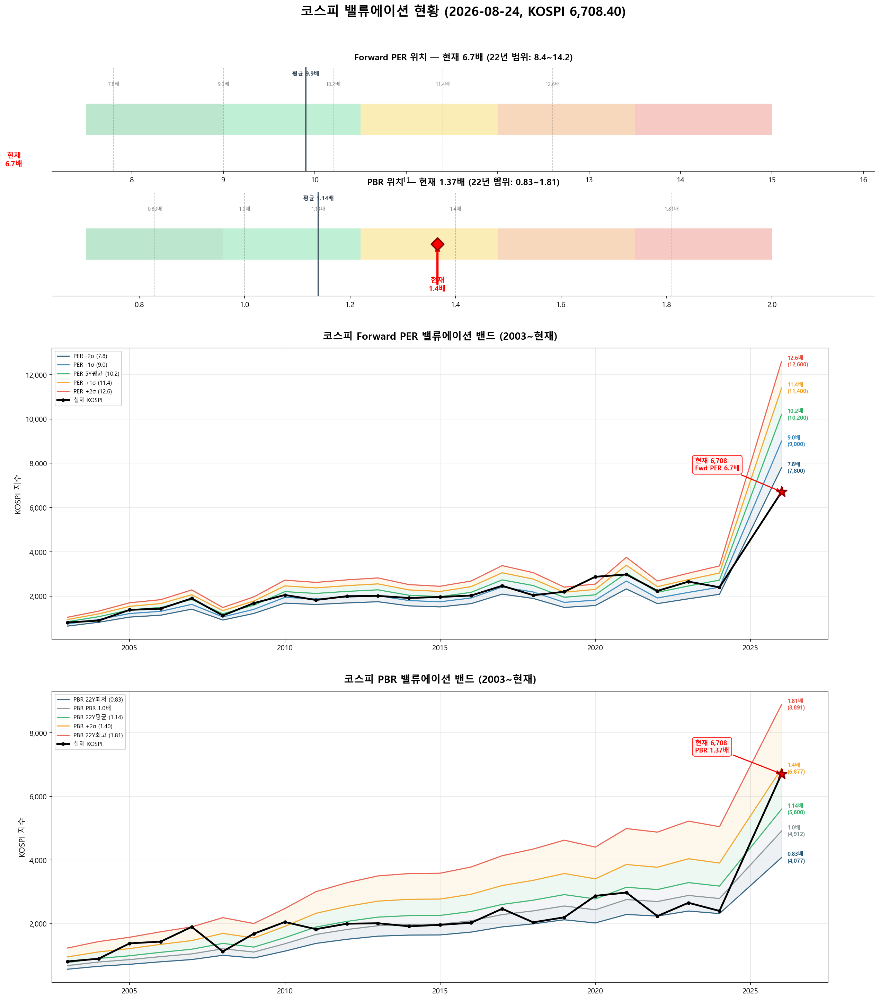

# 📋 MarketTop 일일 종합 (2026-08-24 15:39)

> A4 한 장 요약 — 상세는 각 시장 리포트 참조

---

### 🔵 코스피 6,708.40  —  ↔️ 횡보장 (신뢰도 55%)

| 과열 점수 | 60/100 🟢 정상 |
|:---:|:---|

> ✅ **다음 매도 목표 7,084(+5.6%) 대기**

**📈 상승 시**

| 다음 매도 목표 | **7,084** (+5.6%) → 이격도106(MA10) + RSI80+ + MFI85+ (승률 71%) |
|:---:|:---|

**📉 하락 시**

| 1차 방어선 | **6,507** (-3%) → 30% 손절 |
|:---:|:---|
| 핵심 하락감지 | BB100%반전 + 이격도122(MA60) (승률 75%) |
| 강력 매도 | 전체 2개+ 전략 동시 발동 시 → 50% 청산 (검증승률 71%) |

**📍 분할매도 단계**

| 단계 | 목표가 | 등락률 | 전략 | 승률 | 틀렸을 때 |
|:---:|---:|:---:|:---|:---:|:---|
| ⏳ 1단계 | **7,084** | +5.6% | 이격도106(MA10) + RSI80+ + MFI85+ | 71% | 평균+7% |

**🛑 손절 단계**

| 단계 | 손절가 | 비중 | 전략 | 승률 |
|:---:|---:|:---:|:---|:---:|
| 1단계 | **6,507** (-3%) | 30% | BB100%반전 + 이격도122(MA60) | 75% |
| 2단계 | **6,373** (-5%) | 30% | CCI100반전 + 이격도128(MA60) | 71% |

**🎯 방향성 종합**: 🟢 **상승 우세**

| 방향 | 전략 | 평균 승률 | 예상 변동 |
|:----:|:---:|:--------:|:--------:|
| 🔴 하락(매도) | 3개 | 72.6% | -2.33% |
| 🟢 상승(매수) | 6개 | 76.4% | +2.99% |

**📐 매도 Top1 [BB100%반전 + 이격도122(MA60)] 20일 수익률 분포**

  • 중앙값: **-5.1%** | 5%분위 -14.3% ~ 95%분위 +10.1%

**📐 매수 Top1 [MDD-20%이하 + 외국인매수전환 + RSI30-] 20일 수익률 분포**

  • 중앙값: **+5.7%** | 5%분위 -4.7% ~ 95%분위 +17.5%

**💰 Kelly 권장 매도비중**

| 지표 | 값 | 의미 |
|:---|---:|:---|
| 평균 Half-Kelly (Top5) | **17%** | 매수 후 매도 신호 시 권장 청산비율 |
| 최대 Half-Kelly | 22% | 가장 강한 전략의 권장 비중 |
| 평균 Sharpe (Top5) | 0.85 | 보통 |
| 2% 이내 임박 전략 수 | 0개 | 신호 발동 임박도 |

---

### 🔵 코스닥 813.07  —  ↔️ 횡보장 (신뢰도 65%)

| 과열 점수 | 56/100 🟢 정상 |
|:---:|:---|

> ✅ **다음 매도 목표 858(+5.5%) 대기**

**📈 상승 시**

| 다음 매도 목표 | **858** (+5.5%) → 이격도102(MA10) + 거래량2.5배+ (승률 88%) |
|:---:|:---|

**📉 하락 시**

| 1차 방어선 | **789** (-3%) → 30% 손절 |
|:---:|:---|
| 핵심 하락감지 | ADX15+ + MACD데드 + RSI70+ (승률 86%) |
| 강력 매도 | 하락반전 2개 중 2개+ 동시 발동 시 → 50% 청산 |

**📍 분할매도 단계**

| 단계 | 목표가 | 등락률 | 전략 | 승률 | 틀렸을 때 |
|:---:|---:|:---:|:---|:---:|:---|
| ⏳ 1단계 | **858** | +5.5% | 이격도102(MA10) + 거래량2.5배+ | 88% | 평균+3% |
| ⏳ 2단계 | **1,008** | +24.0% | 이격도116(MA60) + CCI160+ + ADX15+ | 86% | 평균+10% |

**🛑 손절 단계**

| 단계 | 손절가 | 비중 | 전략 | 승률 |
|:---:|---:|:---:|:---|:---:|
| 1단계 | **789** (-3%) | 30% | ADX15+ + MACD데드 + RSI70+ | 86% |
| 2단계 | **772** (-5%) | 30% | MFI65반전 + CCI200+ | 71% |

**🎯 방향성 종합**: 🟠 **약한 하락 압력**

| 방향 | 전략 | 평균 승률 | 예상 변동 |
|:----:|:---:|:--------:|:--------:|
| 🔴 하락(매도) | 4개 | 82.6% | -4.01% |
| 🟢 상승(매수) | 3개 | 85.2% | +7.70% |

**📐 매도 Top1 [이격도102(MA10) + 거래량2.5배+] 20일 수익률 분포**

  • 중앙값: **-3.4%** | 5%분위 -17.3% ~ 95%분위 +1.9%

**📐 매수 Top1 [하향이격도85(MA40) + RSI25-] 20일 수익률 분포**

  • 중앙값: **+8.1%** | 5%분위 -7.8% ~ 95%분위 +30.7%

**💰 Kelly 권장 매도비중**

| 지표 | 값 | 의미 |
|:---|---:|:---|
| 평균 Half-Kelly (Top5) | **32%** | 매수 후 매도 신호 시 권장 청산비율 |
| 최대 Half-Kelly | 41% | 가장 강한 전략의 권장 비중 |
| 평균 Sharpe (Top5) | 1.95 | 우수 |
| 2% 이내 임박 전략 수 | 0개 | 신호 발동 임박도 |

---

### 📊 코스피 밸류에이션

| 지표 | 현재 | 22Y평균 | 판단 |
|:---:|:---:|:---:|:---|
| **Fwd PER** | **6.7배** | 9.9배 | 극저평가 🟢🟢 |
| **PBR** | **1.37배** | 1.14배 | 고평가 🟡 |
| Fwd EPS | 1000 | - | BPS 4912 |

| PER 밴드 | 적정지수 | 괴리 |
|:---:|---:|:---:|
| -2σ (7.8) | 7,800 | +16.3% |
| -1σ (9.0) | 9,000 | +34.2% |
| 5Y평균 (10.2) | 10,200 | +52.0% |
| +1σ (11.4) | 11,400 | +69.9% |
| +2σ (12.6) | 12,600 | +87.8% |

---

### 📊 코스피 향후 60일 등락 위험 분석

> 💡 과거 30년간 지금과 비슷했던 상황(이격도 90%, 2개월 상승률 -18%) **599번** 발생
> → 그때 이후 2개월간 실제로 얼마나 올랐고 빠졌는지 통계

**📈 상승 가능성:**

| 항목 | 결과 | 해석 |
|:---|:---:|:---|
| **2개월 내 평균 최대상승폭** | **+10.7%** | 중위값 +8.2% |
| 역대 최고 사례 | +49.3% | 지수 10,013 |

| 상승폭 | 발생 확률 | 그때 지수 |
|:---|:---:|---:|
| +5% 이상 상승 | **68%** | 7,044 |
| +10% 이상 상승 | **41%** | 7,379 |
| +15% 이상 상승 | **25%** | 7,715 |
| +20% 이상 상승 | **16%** | 8,050 |

**📉 하락 위험:** 🔴 고위험

| 항목 | 결과 | 해석 |
|:---|:---:|:---|
| **2개월 내 평균 최대낙폭** | **-12.2%** | 중위값 -7.7% |
| 역대 최악의 경우 | -49.1% | 지수 3,414 |
| ⚠️ 평소보다 위험한 정도 | **2.1배** | 평소보다 2.1배 더 빠질 수 있음 |

**2개월 내 하락 확률과 예상 지수:**

| 하락폭 | 발생 확률 | 그때 지수 |
|:---|:---:|---:|
| -5% 이상 하락 | **63%** | 6,373 |
| -10% 이상 하락 | **42%** | 6,038 |
| -15% 이상 하락 | **27%** | 5,702 |
| -20% 이상 하락 | **21%** | 5,367 |

**💡 확률 기반 판단:**

> 과거 유사 상황에서 **+5%까지 상승할 확률이 50% 이상**이었고,
> 동시에 **-5%까지 하락할 확률도 50% 이상**이었습니다.
>
> 📌 **하락 기대값(7.7)이 상승 기대값(7.3)보다 큽니다 (1.1배)**.
> **비중 축소 우선**. 보유 시 **6,373**(-5%) 반드시 손절, 목표 **7,044**(+5%)

### 📊 코스닥 향후 60일 등락 위험 분석

> 💡 과거 30년간 지금과 비슷했던 상황(이격도 94%, 2개월 상승률 -28%) **132번** 발생
> → 그때 이후 2개월간 실제로 얼마나 올랐고 빠졌는지 통계

**📈 상승 가능성:**

| 항목 | 결과 | 해석 |
|:---|:---:|:---|
| **2개월 내 평균 최대상승폭** | **+8.3%** | 중위값 +7.0% |
| 역대 최고 사례 | +34.7% | 지수 1,095 |

| 상승폭 | 발생 확률 | 그때 지수 |
|:---|:---:|---:|
| +5% 이상 상승 | **52%** | 854 |
| +10% 이상 상승 | **46%** | 894 |
| +15% 이상 상승 | **12%** | 935 |
| +20% 이상 상승 | **11%** | 976 |

**📉 하락 위험:** 🔴 고위험

| 항목 | 결과 | 해석 |
|:---|:---:|:---|
| **2개월 내 평균 최대낙폭** | **-16.5%** | 중위값 -11.4% |
| 역대 최악의 경우 | -50.5% | 지수 403 |
| ⚠️ 평소보다 위험한 정도 | **1.8배** | 평소보다 1.8배 더 빠질 수 있음 |

**2개월 내 하락 확률과 예상 지수:**

| 하락폭 | 발생 확률 | 그때 지수 |
|:---|:---:|---:|
| -5% 이상 하락 | **67%** | 772 |
| -10% 이상 하락 | **55%** | 732 |
| -15% 이상 하락 | **41%** | 691 |
| -20% 이상 하락 | **36%** | 650 |

**💡 확률 기반 판단:**

> 과거 유사 상황에서 **+5%까지 상승할 확률이 50% 이상**이었고,
> 동시에 **-10%까지 하락할 확률도 50% 이상**이었습니다.
>
> 📌 **하락 기대값(11.1)이 상승 기대값(4.3)보다 큽니다 (2.6배)**.
> **비중 축소 우선**. 보유 시 **732**(-10%) 반드시 손절, 목표 **854**(+5%)

---

### 🔮 코스피 과거 유사 패턴 분석

> 💡 현재와 가격 움직임 + 기술적 지표가 비슷했던 과거 **20개 시점** 발견 (평균 유사도 74%)
> → 그 시점 이후 40일간 실제로 어떻게 움직였는지 통계

**📊 유사 패턴 이후 40일간 등락 범위:**

| 구분 | 평균 | 중위값 | 지수 환산 |
|:---|:---:|:---:|---:|
| 📈 최대 상승폭 | **+6.5%** | +5.7% | 7,088 |
| 📉 최대 하락폭 | **-5.5%** | -4.0% | 6,439 |
| 🚀 최고 사례 | +21.7% | - | 8,167 |
| 💥 최악 사례 | -22.2% | - | 5,219 |

**🔄 반전 패턴:**

| 패턴 | 평균 크기 | 해석 |
|:---|:---:|:---|
| 고점 찍고 반락 | **-9.5%** | 상승 후 평균 이만큼 되돌림 |
| 저점 찍고 반등 | **+8.9%** | 하락 후 평균 이만큼 회복 |

**⏰ 시간대별 상승 확률:**

| 기간 | 상승 확률 | 평균 수익률 | 예상 지수 |
|:---|:---:|:---:|---:|
| 10일 후 | **60%** | +1.2% | 6,787 |
| 20일 후 | **60%** | +0.1% | 6,717 |
| 40일 후 | **65%** | +1.0% | 6,772 |

**📈 대표 경로 (중위값):**

| 시점 | 낙관(상위25%) | 중립(중위) | 비관(하위25%) | 중립 지수 |
|:---|:---:|:---:|:---:|---:|
| 5일 후 | +2.2% | +0.7% | -1.9% | 6,753 |
| 10일 후 | +3.9% | +1.8% | -0.9% | 6,828 |
| 20일 후 | +3.9% | +1.4% | -3.5% | 6,799 |
| 30일 후 | +4.0% | +0.3% | -3.5% | 6,726 |
| 40일 후 | +4.0% | +1.9% | -3.5% | 6,836 |

**📅 가장 유사했던 과거 시점 (최근 5개):**

- **2025-05-02** (유사도 80%) — 지수 2,560 → 40일간 최대+21.7%, 최대0.0%, 최종+21.7%
- **2023-12-06** (유사도 70%) — 지수 2,495 → 40일간 최대+7.0%, 최대-2.4%, 최종+3.8%
- **2022-10-26** (유사도 74%) — 지수 2,250 → 40일간 최대+10.4%, 최대0.0%, 최종+3.5%
- **2021-11-23** (유사도 70%) — 지수 2,997 → 40일간 최대+1.1%, 최대-5.3%, 최종-4.5%
- **2021-09-14** (유사도 70%) — 지수 3,149 → 40일간 최대+0.1%, 최대-7.6%, 최종-4.8%

### 🔮 코스닥 과거 유사 패턴 분석

> 💡 현재와 가격 움직임 + 기술적 지표가 비슷했던 과거 **20개 시점** 발견 (평균 유사도 73%)
> → 그 시점 이후 40일간 실제로 어떻게 움직였는지 통계

**📊 유사 패턴 이후 40일간 등락 범위:**

| 구분 | 평균 | 중위값 | 지수 환산 |
|:---|:---:|:---:|---:|
| 📈 최대 상승폭 | **+6.4%** | +5.6% | 858 |
| 📉 최대 하락폭 | **-7.8%** | -2.5% | 793 |
| 🚀 최고 사례 | +27.8% | - | 1,039 |
| 💥 최악 사례 | -34.8% | - | 530 |

**🔄 반전 패턴:**

| 패턴 | 평균 크기 | 해석 |
|:---|:---:|:---|
| 고점 찍고 반락 | **-11.8%** | 상승 후 평균 이만큼 되돌림 |
| 저점 찍고 반등 | **+12.8%** | 하락 후 평균 이만큼 회복 |

**⏰ 시간대별 상승 확률:**

| 기간 | 상승 확률 | 평균 수익률 | 예상 지수 |
|:---|:---:|:---:|---:|
| 10일 후 | **55%** | -0.0% | 813 |
| 20일 후 | **60%** | -1.9% | 798 |
| 40일 후 | **45%** | +0.6% | 818 |

**📈 대표 경로 (중위값):**

| 시점 | 낙관(상위25%) | 중립(중위) | 비관(하위25%) | 중립 지수 |
|:---|:---:|:---:|:---:|---:|
| 5일 후 | +2.8% | +1.2% | -1.1% | 823 |
| 10일 후 | +5.0% | +1.2% | -3.7% | 823 |
| 20일 후 | +5.7% | +1.1% | -3.2% | 822 |
| 30일 후 | +6.4% | +1.8% | -3.5% | 827 |
| 40일 후 | +5.8% | -0.4% | -3.7% | 810 |

**📅 가장 유사했던 과거 시점 (최근 5개):**

- **2025-12-17** (유사도 80%) — 지수 911 → 40일간 최대+27.8%, 최대-1.1%, 최종+27.4%
- **2025-05-02** (유사도 80%) — 지수 722 → 40일간 최대+11.0%, 최대-1.1%, 최종+9.9%
- **2022-11-04** (유사도 75%) — 지수 694 → 40일간 최대+7.4%, 최대-3.2%, 최종-2.7%
- **2022-07-26** (유사도 77%) — 지수 790 → 40일간 최대+5.7%, 최대-7.7%, 최종-7.7%
- **2021-11-04** (유사도 69%) — 지수 1,001 → 40일간 최대+4.0%, 최대-3.6%, 최종+3.3%

---

### 📎 상세 리포트

- 코스피: [코스피_고점판독리포트_20260824_153910.md](코스피_고점판독리포트_20260824_153910.md)
- 코스닥: [코스닥_고점판독리포트_20260824_153927.md](코스닥_고점판독리포트_20260824_153927.md)

---

*본 리포트는 백테스트 기반 참고용이며, 투자 판단의 최종 책임은 투자자 본인에게 있습니다.*