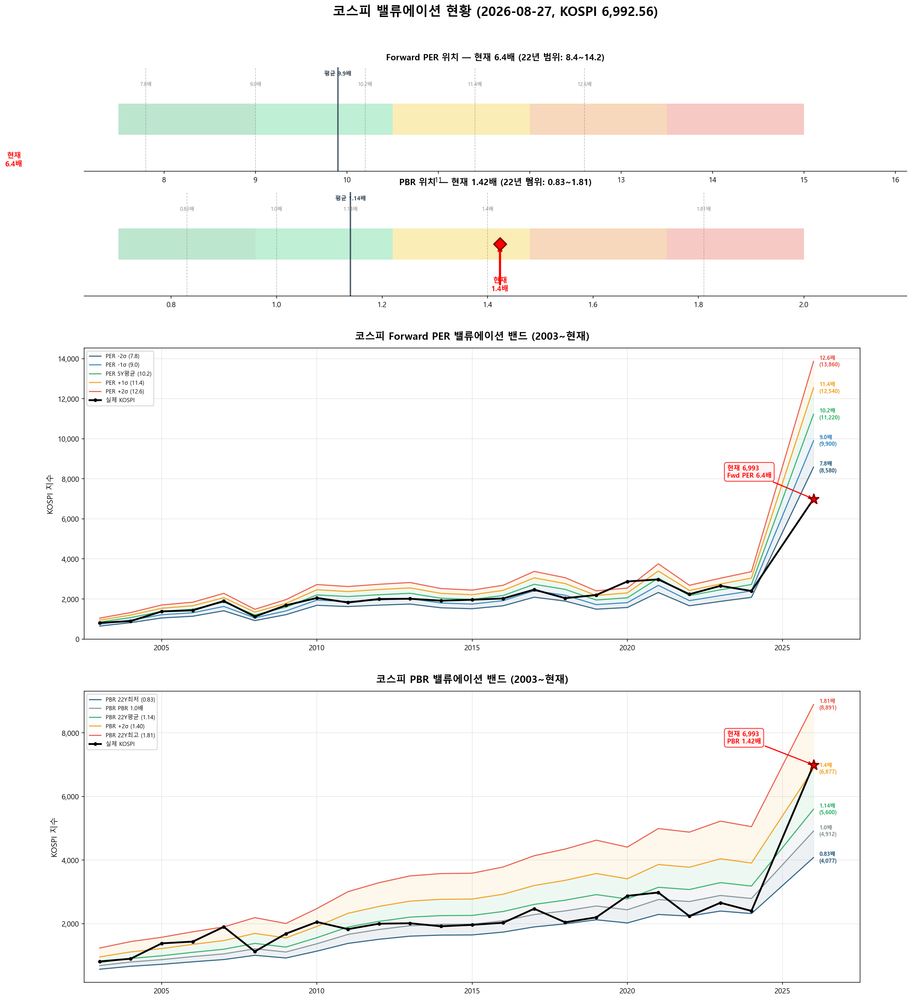

# 📋 MarketTop 일일 종합 (2026-08-27 09:22)

> A4 한 장 요약 — 상세는 각 시장 리포트 참조

---

### 🔵 코스피 6,992.56  —  ↔️ 횡보장 (신뢰도 45%)

| 과열 점수 | 69/100 🟡 주의 |
|:---:|:---|
| ⚠️ 과열 지표 | CCI 111, BB 81% |

> ✅ **다음 매도 목표 7,198(+2.9%) 대기**

**📈 상승 시**

| 다음 매도 목표 | **7,198** (+2.9%) → 이격도106(MA10) + RSI80+ + MFI85+ (승률 71%) |
|:---:|:---|

**📉 하락 시**

| 1차 방어선 | **6,783** (-3%) → 30% 손절 |
|:---:|:---|
| 핵심 하락감지 | BB100%반전 + 이격도122(MA60) (승률 75%) |
| 강력 매도 | 전체 2개+ 전략 동시 발동 시 → 50% 청산 (검증승률 71%) |

**📍 분할매도 단계**

| 단계 | 목표가 | 등락률 | 전략 | 승률 | 틀렸을 때 |
|:---:|---:|:---:|:---|:---:|:---|
| 🎯 1단계 | **7,198** | +2.9% | 이격도106(MA10) + RSI80+ + MFI85+ | 71% | 평균+7% |

**🛑 손절 단계**

| 단계 | 손절가 | 비중 | 전략 | 승률 |
|:---:|---:|:---:|:---|:---:|
| 1단계 | **6,783** (-3%) | 30% | BB100%반전 + 이격도122(MA60) | 75% |
| 2단계 | **6,643** (-5%) | 30% | CCI100반전 + 이격도128(MA60) | 71% |

**🎯 방향성 종합**: 🟢 **상승 우세**

| 방향 | 전략 | 평균 승률 | 예상 변동 |
|:----:|:---:|:--------:|:--------:|
| 🔴 하락(매도) | 3개 | 72.6% | -2.33% |
| 🟢 상승(매수) | 6개 | 76.4% | +4.00% |

**📐 매도 Top1 [BB100%반전 + 이격도122(MA60)] 20일 수익률 분포**

  • 중앙값: **-5.1%** | 5%분위 -14.3% ~ 95%분위 +10.1%

**📐 매수 Top1 [하향이격도91(MA5) + Stoch25-] 20일 수익률 분포**

  • 중앙값: **+7.6%** | 5%분위 -10.5% ~ 95%분위 +42.8%

**💰 Kelly 권장 매도비중**

| 지표 | 값 | 의미 |
|:---|---:|:---|
| 평균 Half-Kelly (Top5) | **17%** | 매수 후 매도 신호 시 권장 청산비율 |
| 최대 Half-Kelly | 22% | 가장 강한 전략의 권장 비중 |
| 평균 Sharpe (Top5) | 0.85 | 보통 |
| 2% 이내 임박 전략 수 | 0개 | 신호 발동 임박도 |

---

### 🔵 코스닥 834.53  —  ↔️ 횡보장 (신뢰도 90%)

| 과열 점수 | 56/100 🟢 정상 |
|:---:|:---|

> ✅ **다음 매도 목표 853(+2.2%) 대기**

**📈 상승 시**

| 다음 매도 목표 | **853** (+2.2%) → 이격도102(MA10) + 거래량2.5배+ (승률 88%) |
|:---:|:---|

**📉 하락 시**

| 1차 방어선 | **809** (-3%) → 30% 손절 |
|:---:|:---|
| 핵심 하락감지 | ADX15+ + MACD데드 + RSI70+ (승률 86%) |
| 강력 매도 | 하락반전 2개 중 2개+ 동시 발동 시 → 50% 청산 |

**📍 분할매도 단계**

| 단계 | 목표가 | 등락률 | 전략 | 승률 | 틀렸을 때 |
|:---:|---:|:---:|:---|:---:|:---|
| 🎯 1단계 | **853** | +2.2% | 이격도102(MA10) + 거래량2.5배+ | 88% | 평균+3% |
| ⏳ 2단계 | **998** | +19.6% | 이격도116(MA60) + CCI160+ + ADX15+ | 86% | 평균+10% |

**🛑 손절 단계**

| 단계 | 손절가 | 비중 | 전략 | 승률 |
|:---:|---:|:---:|:---|:---:|
| 1단계 | **809** (-3%) | 30% | ADX15+ + MACD데드 + RSI70+ | 86% |
| 2단계 | **793** (-5%) | 30% | MFI65반전 + CCI200+ | 71% |

**🎯 방향성 종합**: 🔴 **하락 우세** (1개 임박)

| 방향 | 전략 | 평균 승률 | 예상 변동 |
|:----:|:---:|:--------:|:--------:|
| 🔴 하락(매도) | 4개 | 82.6% | -4.01% |
| 🟢 상승(매수) | 3개 | 85.2% | +7.70% |

**📐 매도 Top1 [이격도102(MA10) + 거래량2.5배+] 20일 수익률 분포**

  • 중앙값: **-3.4%** | 5%분위 -17.3% ~ 95%분위 +1.9%

**📐 매수 Top1 [하향이격도85(MA40) + RSI25-] 20일 수익률 분포**

  • 중앙값: **+8.1%** | 5%분위 -7.8% ~ 95%분위 +30.7%

**💰 Kelly 권장 매도비중**

| 지표 | 값 | 의미 |
|:---|---:|:---|
| 평균 Half-Kelly (Top5) | **32%** | 매수 후 매도 신호 시 권장 청산비율 |
| 최대 Half-Kelly | 41% | 가장 강한 전략의 권장 비중 |
| 평균 Sharpe (Top5) | 1.95 | 우수 |
| 2% 이내 임박 전략 수 | 0개 | 신호 발동 임박도 |

---

### 📊 코스피 밸류에이션

| 지표 | 현재 | 22Y평균 | 판단 |
|:---:|:---:|:---:|:---|
| **Fwd PER** | **6.4배** | 9.9배 | 극저평가 🟢🟢 |
| **PBR** | **1.42배** | 1.14배 | 고평가 🟡 |
| Fwd EPS | 1100 | - | BPS 4912 |

| PER 밴드 | 적정지수 | 괴리 |
|:---:|---:|:---:|
| -2σ (7.8) | 8,580 | +22.7% |
| -1σ (9.0) | 9,900 | +41.6% |
| 5Y평균 (10.2) | 11,220 | +60.5% |
| +1σ (11.4) | 12,540 | +79.3% |
| +2σ (12.6) | 13,860 | +98.2% |

---

### 📊 코스피 향후 60일 등락 위험 분석

> 💡 과거 30년간 지금과 비슷했던 상황(이격도 94%, 2개월 상승률 -18%) **745번** 발생
> → 그때 이후 2개월간 실제로 얼마나 올랐고 빠졌는지 통계

**📈 상승 가능성:**

| 항목 | 결과 | 해석 |
|:---|:---:|:---|
| **2개월 내 평균 최대상승폭** | **+9.1%** | 중위값 +6.9% |
| 역대 최고 사례 | +49.3% | 지수 10,437 |

| 상승폭 | 발생 확률 | 그때 지수 |
|:---|:---:|---:|
| +5% 이상 상승 | **61%** | 7,342 |
| +10% 이상 상승 | **33%** | 7,692 |
| +15% 이상 상승 | **19%** | 8,041 |
| +20% 이상 상승 | **12%** | 8,391 |

**📉 하락 위험:** 🟠 주의

| 항목 | 결과 | 해석 |
|:---|:---:|:---|
| **2개월 내 평균 최대낙폭** | **-10.5%** | 중위값 -7.0% |
| 역대 최악의 경우 | -50.0% | 지수 3,496 |
| ⚠️ 평소보다 위험한 정도 | **1.8배** | 평소보다 1.8배 더 빠질 수 있음 |

**2개월 내 하락 확률과 예상 지수:**

| 하락폭 | 발생 확률 | 그때 지수 |
|:---|:---:|---:|
| -5% 이상 하락 | **60%** | 6,643 |
| -10% 이상 하락 | **38%** | 6,293 |
| -15% 이상 하락 | **23%** | 5,944 |
| -20% 이상 하락 | **16%** | 5,594 |

**💡 확률 기반 판단:**

> 과거 유사 상황에서 **+5%까지 상승할 확률이 50% 이상**이었고,
> 동시에 **-5%까지 하락할 확률도 50% 이상**이었습니다.
>
> 📌 **하락 기대값(6.3)이 상승 기대값(5.6)보다 큽니다 (1.1배)**.
> **비중 축소 우선**. 보유 시 **6,643**(-5%) 반드시 손절, 목표 **7,342**(+5%)

### 📊 코스닥 향후 60일 등락 위험 분석

> 💡 과거 30년간 지금과 비슷했던 상황(이격도 97%, 2개월 상승률 -22%) **213번** 발생
> → 그때 이후 2개월간 실제로 얼마나 올랐고 빠졌는지 통계

**📈 상승 가능성:**

| 항목 | 결과 | 해석 |
|:---|:---:|:---|
| **2개월 내 평균 최대상승폭** | **+9.7%** | 중위값 +8.4% |
| 역대 최고 사례 | +31.4% | 지수 1,097 |

| 상승폭 | 발생 확률 | 그때 지수 |
|:---|:---:|---:|
| +5% 이상 상승 | **71%** | 876 |
| +10% 이상 상승 | **41%** | 918 |
| +15% 이상 상승 | **16%** | 960 |
| +20% 이상 상승 | **13%** | 1,001 |

**📉 하락 위험:** 🟠 주의

| 항목 | 결과 | 해석 |
|:---|:---:|:---|
| **2개월 내 평균 최대낙폭** | **-8.4%** | 중위값 -4.1% |
| 역대 최악의 경우 | -35.6% | 지수 538 |
| 평소보다 위험한 정도 | 0.9배 | 평소와 비슷한 수준 |

**2개월 내 하락 확률과 예상 지수:**

| 하락폭 | 발생 확률 | 그때 지수 |
|:---|:---:|---:|
| -5% 이상 하락 | **46%** | 793 |
| -10% 이상 하락 | **31%** | 751 |
| -15% 이상 하락 | **22%** | 709 |
| -20% 이상 하락 | **13%** | 668 |

**💡 확률 기반 판단:**

> 📌 +5% 상승 확률이 높고 큰 하락 확률은 낮습니다.
> **876**(+5%)까지 보유 후 익절 추천

---

### 🔮 코스피 과거 유사 패턴 분석

> 💡 현재와 가격 움직임 + 기술적 지표가 비슷했던 과거 **20개 시점** 발견 (평균 유사도 72%)
> → 그 시점 이후 40일간 실제로 어떻게 움직였는지 통계

**📊 유사 패턴 이후 40일간 등락 범위:**

| 구분 | 평균 | 중위값 | 지수 환산 |
|:---|:---:|:---:|---:|
| 📈 최대 상승폭 | **+7.3%** | +5.3% | 7,364 |
| 📉 최대 하락폭 | **-5.9%** | -3.4% | 6,754 |
| 🚀 최고 사례 | +28.6% | - | 8,992 |
| 💥 최악 사례 | -26.0% | - | 5,173 |

**🔄 반전 패턴:**

| 패턴 | 평균 크기 | 해석 |
|:---|:---:|:---|
| 고점 찍고 반락 | **-11.2%** | 상승 후 평균 이만큼 되돌림 |
| 저점 찍고 반등 | **+10.2%** | 하락 후 평균 이만큼 회복 |

**⏰ 시간대별 상승 확률:**

| 기간 | 상승 확률 | 평균 수익률 | 예상 지수 |
|:---|:---:|:---:|---:|
| 10일 후 | **55%** | +1.4% | 7,090 |
| 20일 후 | **55%** | +0.9% | 7,057 |
| 40일 후 | **55%** | +0.5% | 7,027 |

**📈 대표 경로 (중위값):**

| 시점 | 낙관(상위25%) | 중립(중위) | 비관(하위25%) | 중립 지수 |
|:---|:---:|:---:|:---:|---:|
| 5일 후 | +3.0% | +1.0% | -1.5% | 7,059 |
| 10일 후 | +4.4% | +0.8% | -2.0% | 7,051 |
| 20일 후 | +5.9% | +1.0% | -2.4% | 7,066 |
| 30일 후 | +6.5% | +2.9% | -4.6% | 7,196 |
| 40일 후 | +5.1% | +0.4% | -3.8% | 7,020 |

**📅 가장 유사했던 과거 시점 (최근 5개):**

- **2025-05-08** (유사도 80%) — 지수 2,579 → 40일간 최대+20.8%, 최대-0.1%, 최종+18.6%
- **2023-11-29** (유사도 69%) — 지수 2,520 → 40일간 최대+6.0%, 최대-3.3%, 최종-0.8%
- **2022-08-10** (유사도 70%) — 지수 2,481 → 40일간 최대+2.1%, 최대-13.1%, 최종-11.2%
- **2021-07-06** (유사도 70%) — 지수 3,305 → 40일간 최대+0.0%, 최대-7.4%, 최종-3.0%
- **2019-11-01** (유사도 69%) — 지수 2,100 → 40일간 최대+5.0%, 최대-1.9%, 최종+4.6%

### 🔮 코스닥 과거 유사 패턴 분석

> 💡 현재와 가격 움직임 + 기술적 지표가 비슷했던 과거 **20개 시점** 발견 (평균 유사도 71%)
> → 그 시점 이후 40일간 실제로 어떻게 움직였는지 통계

**📊 유사 패턴 이후 40일간 등락 범위:**

| 구분 | 평균 | 중위값 | 지수 환산 |
|:---|:---:|:---:|---:|
| 📈 최대 상승폭 | **+7.5%** | +7.1% | 894 |
| 📉 최대 하락폭 | **-4.6%** | -2.6% | 813 |
| 🚀 최고 사례 | +27.2% | - | 1,062 |
| 💥 최악 사례 | -17.2% | - | 691 |

**🔄 반전 패턴:**

| 패턴 | 평균 크기 | 해석 |
|:---|:---:|:---|
| 고점 찍고 반락 | **-9.8%** | 상승 후 평균 이만큼 되돌림 |
| 저점 찍고 반등 | **+11.3%** | 하락 후 평균 이만큼 회복 |

**⏰ 시간대별 상승 확률:**

| 기간 | 상승 확률 | 평균 수익률 | 예상 지수 |
|:---|:---:|:---:|---:|
| 10일 후 | **60%** | +0.8% | 841 |
| 20일 후 | **65%** | +1.0% | 843 |
| 40일 후 | **55%** | +2.2% | 853 |

**📈 대표 경로 (중위값):**

| 시점 | 낙관(상위25%) | 중립(중위) | 비관(하위25%) | 중립 지수 |
|:---|:---:|:---:|:---:|---:|
| 5일 후 | +2.8% | +1.0% | -0.8% | 843 |
| 10일 후 | +4.2% | +1.6% | -1.8% | 848 |
| 20일 후 | +4.4% | +1.2% | -1.8% | 844 |
| 30일 후 | +7.6% | +2.8% | -1.9% | 858 |
| 40일 후 | +6.3% | +0.6% | -2.2% | 839 |

**📅 가장 유사했던 과거 시점 (최근 5개):**

- **2025-12-19** (유사도 71%) — 지수 915 → 40일간 최대+27.2%, 최대-0.0%, 최종+25.9%
- **2025-05-08** (유사도 75%) — 지수 730 → 40일간 최대+9.8%, 최대-2.2%, 최종+6.7%
- **2025-01-07** (유사도 70%) — 지수 718 → 40일간 최대+8.4%, 최대-2.0%, 최종+0.4%
- **2022-11-08** (유사도 69%) — 지수 713 → 40일간 최대+4.4%, 최대-5.9%, 최종-4.7%
- **2022-07-28** (유사도 75%) — 지수 798 → 40일간 최대+4.6%, 최대-13.3%, 최종-12.6%

---

### 📎 상세 리포트

- 코스피: [코스피_고점판독리포트_20260827_092234.md](코스피_고점판독리포트_20260827_092234.md)
- 코스닥: [코스닥_고점판독리포트_20260827_092244.md](코스닥_고점판독리포트_20260827_092244.md)

---

*본 리포트는 백테스트 기반 참고용이며, 투자 판단의 최종 책임은 투자자 본인에게 있습니다.*