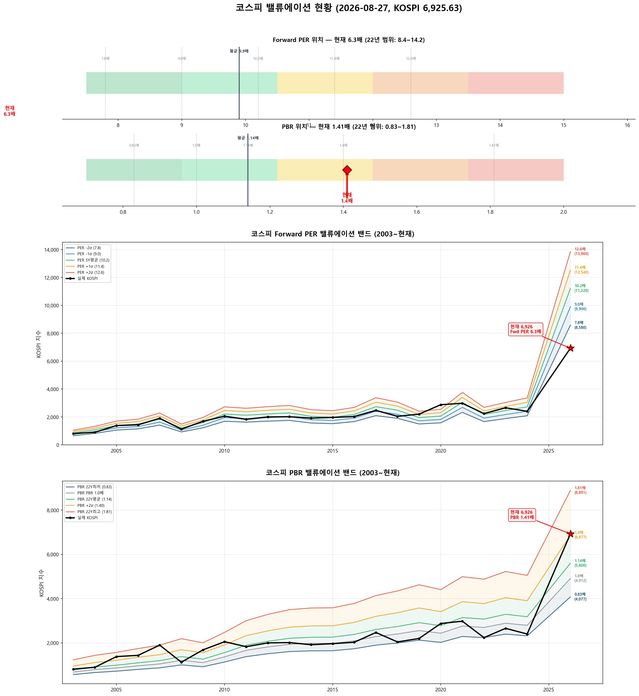

# 📋 MarketTop 일일 종합 (2026-08-27 13:09)

> A4 한 장 요약 — 상세는 각 시장 리포트 참조

---

### 🔵 코스피 6,925.63  —  ↔️ 횡보장 (신뢰도 15%)

| 과열 점수 | 70/100 🟡 주의 |
|:---:|:---|

> ✅ **다음 매도 목표 7,216(+4.2%) 대기**

**📈 상승 시**

| 다음 매도 목표 | **7,216** (+4.2%) → 이격도106(MA10) + RSI80+ + MFI85+ (승률 71%) |
|:---:|:---|

**📉 하락 시**

| 1차 방어선 | **6,718** (-3%) → 30% 손절 |
|:---:|:---|
| 핵심 하락감지 | BB100%반전 + 이격도122(MA60) (승률 75%) |
| 강력 매도 | 전체 2개+ 전략 동시 발동 시 → 50% 청산 (검증승률 71%) |

**📍 분할매도 단계**

| 단계 | 목표가 | 등락률 | 전략 | 승률 | 틀렸을 때 |
|:---:|---:|:---:|:---|:---:|:---|
| 🎯 1단계 | **7,216** | +4.2% | 이격도106(MA10) + RSI80+ + MFI85+ | 71% | 평균+7% |

**🛑 손절 단계**

| 단계 | 손절가 | 비중 | 전략 | 승률 |
|:---:|---:|:---:|:---|:---:|
| 1단계 | **6,718** (-3%) | 30% | BB100%반전 + 이격도122(MA60) | 75% |
| 2단계 | **6,579** (-5%) | 30% | CCI100반전 + 이격도128(MA60) | 71% |

**🎯 방향성 종합**: 🟢 **상승 우세**

| 방향 | 전략 | 평균 승률 | 예상 변동 |
|:----:|:---:|:--------:|:--------:|
| 🔴 하락(매도) | 3개 | 72.6% | -2.33% |
| 🟢 상승(매수) | 7개 | 75.5% | +4.34% |

**📐 매도 Top1 [BB100%반전 + 이격도122(MA60)] 20일 수익률 분포**

  • 중앙값: **-5.1%** | 5%분위 -14.3% ~ 95%분위 +10.1%

**📐 매수 Top1 [하향이격도91(MA5) + Stoch25-] 20일 수익률 분포**

  • 중앙값: **+7.6%** | 5%분위 -10.5% ~ 95%분위 +42.8%

**💰 Kelly 권장 매도비중**

| 지표 | 값 | 의미 |
|:---|---:|:---|
| 평균 Half-Kelly (Top5) | **17%** | 매수 후 매도 신호 시 권장 청산비율 |
| 최대 Half-Kelly | 22% | 가장 강한 전략의 권장 비중 |
| 평균 Sharpe (Top5) | 0.85 | 보통 |
| 2% 이내 임박 전략 수 | 0개 | 신호 발동 임박도 |

---

### 🔵 코스닥 836.05  —  ↔️ 횡보장 (신뢰도 90%)

| 과열 점수 | 56/100 🟢 정상 |
|:---:|:---|

> ✅ **다음 매도 목표 850(+1.6%) 대기**

**📈 상승 시**

| 다음 매도 목표 | **850** (+1.6%) → 이격도102(MA10) + 거래량2.5배+ (승률 88%) |
|:---:|:---|

**📉 하락 시**

| 1차 방어선 | **811** (-3%) → 30% 손절 |
|:---:|:---|
| 핵심 하락감지 | ADX15+ + MACD데드 + RSI70+ (승률 86%) |
| 강력 매도 | 하락반전 2개 중 2개+ 동시 발동 시 → 50% 청산 |

**📍 분할매도 단계**

| 단계 | 목표가 | 등락률 | 전략 | 승률 | 틀렸을 때 |
|:---:|---:|:---:|:---|:---:|:---|
| ⚡ 1단계 | **850** | +1.6% | 이격도102(MA10) + 거래량2.5배+ | 88% | 평균+3% |
| ⏳ 2단계 | **994** | +18.9% | 이격도116(MA60) + CCI160+ + ADX15+ | 86% | 평균+10% |

**🛑 손절 단계**

| 단계 | 손절가 | 비중 | 전략 | 승률 |
|:---:|---:|:---:|:---|:---:|
| 1단계 | **811** (-3%) | 30% | ADX15+ + MACD데드 + RSI70+ | 86% |
| 2단계 | **794** (-5%) | 30% | MFI65반전 + CCI200+ | 71% |

**🎯 방향성 종합**: 🔴 **하락 우세** (1개 임박)

| 방향 | 전략 | 평균 승률 | 예상 변동 |
|:----:|:---:|:--------:|:--------:|
| 🔴 하락(매도) | 4개 | 82.6% | -4.01% |
| 🟢 상승(매수) | 3개 | 85.2% | +7.70% |

**📐 매도 Top1 [이격도102(MA10) + 거래량2.5배+] 20일 수익률 분포**

  • 중앙값: **-3.4%** | 5%분위 -17.3% ~ 95%분위 +1.9%

**📐 매수 Top1 [하향이격도85(MA40) + RSI25-] 20일 수익률 분포**

  • 중앙값: **+8.1%** | 5%분위 -7.8% ~ 95%분위 +30.7%

**💰 Kelly 권장 매도비중**

| 지표 | 값 | 의미 |
|:---|---:|:---|
| 평균 Half-Kelly (Top5) | **32%** | 매수 후 매도 신호 시 권장 청산비율 |
| 최대 Half-Kelly | 41% | 가장 강한 전략의 권장 비중 |
| 평균 Sharpe (Top5) | 1.95 | 우수 |
| 2% 이내 임박 전략 수 | 1개 | 신호 발동 임박도 |

---

### 📊 코스피 밸류에이션

| 지표 | 현재 | 22Y평균 | 판단 |
|:---:|:---:|:---:|:---|
| **Fwd PER** | **6.3배** | 9.9배 | 극저평가 🟢🟢 |
| **PBR** | **1.41배** | 1.14배 | 고평가 🟡 |
| Fwd EPS | 1100 | - | BPS 4912 |

| PER 밴드 | 적정지수 | 괴리 |
|:---:|---:|:---:|
| -2σ (7.8) | 8,580 | +23.9% |
| -1σ (9.0) | 9,900 | +42.9% |
| 5Y평균 (10.2) | 11,220 | +62.0% |
| +1σ (11.4) | 12,540 | +81.1% |
| +2σ (12.6) | 13,860 | +100.1% |

---

### 📊 코스피 향후 60일 등락 위험 분석

> 💡 과거 30년간 지금과 비슷했던 상황(이격도 94%, 2개월 상승률 -21%) **378번** 발생
> → 그때 이후 2개월간 실제로 얼마나 올랐고 빠졌는지 통계

**📈 상승 가능성:**

| 항목 | 결과 | 해석 |
|:---|:---:|:---|
| **2개월 내 평균 최대상승폭** | **+11.3%** | 중위값 +9.5% |
| 역대 최고 사례 | +46.7% | 지수 10,158 |

| 상승폭 | 발생 확률 | 그때 지수 |
|:---|:---:|---:|
| +5% 이상 상승 | **70%** | 7,272 |
| +10% 이상 상승 | **48%** | 7,618 |
| +15% 이상 상승 | **31%** | 7,964 |
| +20% 이상 상승 | **18%** | 8,311 |

**📉 하락 위험:** 🟠 주의

| 항목 | 결과 | 해석 |
|:---|:---:|:---|
| **2개월 내 평균 최대낙폭** | **-11.7%** | 중위값 -7.2% |
| 역대 최악의 경우 | -47.5% | 지수 3,633 |
| ⚠️ 평소보다 위험한 정도 | **2.0배** | 평소보다 2.0배 더 빠질 수 있음 |

**2개월 내 하락 확률과 예상 지수:**

| 하락폭 | 발생 확률 | 그때 지수 |
|:---|:---:|---:|
| -5% 이상 하락 | **61%** | 6,579 |
| -10% 이상 하락 | **39%** | 6,233 |
| -15% 이상 하락 | **28%** | 5,887 |
| -20% 이상 하락 | **21%** | 5,541 |

**💡 확률 기반 판단:**

> 과거 유사 상황에서 **+5%까지 상승할 확률이 50% 이상**이었고,
> 동시에 **-5%까지 하락할 확률도 50% 이상**이었습니다.
>
> 📌 상승·하락 기대값이 비슷합니다 (상승 7.9 vs 하락 7.1).
> 현재가 부근에서 **분할 익절** 추천. 목표 **7,272**(+5%), 손절 **6,579**(-5%)

### 📊 코스닥 향후 60일 등락 위험 분석

> 💡 과거 30년간 지금과 비슷했던 상황(이격도 98%, 2개월 상승률 -20%) **284번** 발생
> → 그때 이후 2개월간 실제로 얼마나 올랐고 빠졌는지 통계

**📈 상승 가능성:**

| 항목 | 결과 | 해석 |
|:---|:---:|:---|
| **2개월 내 평균 최대상승폭** | **+8.7%** | 중위값 +7.5% |
| 역대 최고 사례 | +31.4% | 지수 1,099 |

| 상승폭 | 발생 확률 | 그때 지수 |
|:---|:---:|---:|
| +5% 이상 상승 | **67%** | 878 |
| +10% 이상 상승 | **34%** | 920 |
| +15% 이상 상승 | **13%** | 961 |
| +20% 이상 상승 | **10%** | 1,003 |

**📉 하락 위험:** 🟠 주의

| 항목 | 결과 | 해석 |
|:---|:---:|:---|
| **2개월 내 평균 최대낙폭** | **-8.0%** | 중위값 -5.5% |
| 역대 최악의 경우 | -35.9% | 지수 536 |
| 평소보다 위험한 정도 | 0.9배 | 평소와 비슷한 수준 |

**2개월 내 하락 확률과 예상 지수:**

| 하락폭 | 발생 확률 | 그때 지수 |
|:---|:---:|---:|
| -5% 이상 하락 | **51%** | 794 |
| -10% 이상 하락 | **31%** | 752 |
| -15% 이상 하락 | **23%** | 711 |
| -20% 이상 하락 | **7%** | 669 |

**💡 확률 기반 판단:**

> 과거 유사 상황에서 **+5%까지 상승할 확률이 50% 이상**이었고,
> 동시에 **-5%까지 하락할 확률도 50% 이상**이었습니다.
>
> 📌 상승·하락 기대값이 비슷합니다 (상승 5.8 vs 하락 4.1).
> 현재가 부근에서 **분할 익절** 추천. 목표 **878**(+5%), 손절 **794**(-5%)

---

### 🔮 코스피 과거 유사 패턴 분석

> 💡 현재와 가격 움직임 + 기술적 지표가 비슷했던 과거 **20개 시점** 발견 (평균 유사도 71%)
> → 그 시점 이후 40일간 실제로 어떻게 움직였는지 통계

**📊 유사 패턴 이후 40일간 등락 범위:**

| 구분 | 평균 | 중위값 | 지수 환산 |
|:---|:---:|:---:|---:|
| 📈 최대 상승폭 | **+5.4%** | +4.3% | 7,222 |
| 📉 최대 하락폭 | **-6.8%** | -3.8% | 6,663 |
| 🚀 최고 사례 | +20.9% | - | 8,374 |
| 💥 최악 사례 | -26.4% | - | 5,097 |

**🔄 반전 패턴:**

| 패턴 | 평균 크기 | 해석 |
|:---|:---:|:---|
| 고점 찍고 반락 | **-10.9%** | 상승 후 평균 이만큼 되돌림 |
| 저점 찍고 반등 | **+8.7%** | 하락 후 평균 이만큼 회복 |

**⏰ 시간대별 상승 확률:**

| 기간 | 상승 확률 | 평균 수익률 | 예상 지수 |
|:---|:---:|:---:|---:|
| 10일 후 | **65%** | +0.1% | 6,934 |
| 20일 후 | **60%** | -1.2% | 6,843 |
| 40일 후 | **45%** | -1.2% | 6,840 |

**📈 대표 경로 (중위값):**

| 시점 | 낙관(상위25%) | 중립(중위) | 비관(하위25%) | 중립 지수 |
|:---|:---:|:---:|:---:|---:|
| 5일 후 | +2.0% | +0.7% | -0.9% | 6,971 |
| 10일 후 | +2.3% | +0.7% | -2.6% | 6,973 |
| 20일 후 | +2.1% | +0.3% | -1.9% | 6,946 |
| 30일 후 | +2.9% | -1.7% | -4.4% | 6,811 |
| 40일 후 | +3.7% | -1.6% | -4.5% | 6,815 |

**📅 가장 유사했던 과거 시점 (최근 5개):**

- **2025-05-09** (유사도 79%) — 지수 2,577 → 40일간 최대+20.9%, 최대0.0%, 최종+20.9%
- **2023-11-30** (유사도 72%) — 지수 2,535 → 40일간 최대+5.3%, 최대-3.9%, 최종-1.4%
- **2018-11-28** (유사도 74%) — 지수 2,108 → 40일간 최대+3.3%, 최대-5.4%, 최종+3.3%
- **2017-01-04** (유사도 72%) — 지수 2,046 → 40일간 최대+3.0%, 최대-0.2%, 최종+1.7%
- **2015-04-10** (유사도 70%) — 지수 2,088 → 40일간 최대+4.1%, 최대-1.7%, 최종-1.7%

### 🔮 코스닥 과거 유사 패턴 분석

> 💡 현재와 가격 움직임 + 기술적 지표가 비슷했던 과거 **20개 시점** 발견 (평균 유사도 69%)
> → 그 시점 이후 40일간 실제로 어떻게 움직였는지 통계

**📊 유사 패턴 이후 40일간 등락 범위:**

| 구분 | 평균 | 중위값 | 지수 환산 |
|:---|:---:|:---:|---:|
| 📈 최대 상승폭 | **+7.6%** | +5.4% | 881 |
| 📉 최대 하락폭 | **-7.8%** | -3.2% | 809 |
| 🚀 최고 사례 | +29.8% | - | 1,085 |
| 💥 최악 사례 | -36.3% | - | 532 |

**🔄 반전 패턴:**

| 패턴 | 평균 크기 | 해석 |
|:---|:---:|:---|
| 고점 찍고 반락 | **-12.7%** | 상승 후 평균 이만큼 되돌림 |
| 저점 찍고 반등 | **+12.8%** | 하락 후 평균 이만큼 회복 |

**⏰ 시간대별 상승 확률:**

| 기간 | 상승 확률 | 평균 수익률 | 예상 지수 |
|:---|:---:|:---:|---:|
| 10일 후 | **65%** | +0.7% | 842 |
| 20일 후 | **50%** | +0.8% | 842 |
| 40일 후 | **50%** | +1.5% | 849 |

**📈 대표 경로 (중위값):**

| 시점 | 낙관(상위25%) | 중립(중위) | 비관(하위25%) | 중립 지수 |
|:---|:---:|:---:|:---:|---:|
| 5일 후 | +2.9% | +0.7% | -0.9% | 842 |
| 10일 후 | +3.6% | +1.6% | -1.7% | 849 |
| 20일 후 | +4.7% | +0.2% | -3.6% | 838 |
| 30일 후 | +7.9% | -0.5% | -4.9% | 832 |
| 40일 후 | +4.6% | +0.5% | -3.8% | 840 |

**📅 가장 유사했던 과거 시점 (최근 5개):**

- **2026-02-24** (유사도 70%) — 지수 1,165 → 40일간 최대+2.4%, 최대-16.0%, 최종+1.4%
- **2025-12-24** (유사도 69%) — 지수 915 → 40일간 최대+29.8%, 최대0.0%, 최종+29.8%
- **2025-12-22** (유사도 68%) — 지수 929 → 40일간 최대+25.4%, 최대-1.5%, 최종+25.4%
- **2025-05-09** (유사도 79%) — 지수 723 → 40일간 최대+10.9%, 최대-1.2%, 최종+8.5%
- **2025-01-08** (유사도 67%) — 지수 720 → 40일간 최대+8.1%, 최대-2.2%, 최종+1.4%

---

### 📎 상세 리포트

- 코스피: [코스피_고점판독리포트_20260827_130858.md](코스피_고점판독리포트_20260827_130858.md)
- 코스닥: [코스닥_고점판독리포트_20260827_130904.md](코스닥_고점판독리포트_20260827_130904.md)

---

*본 리포트는 백테스트 기반 참고용이며, 투자 판단의 최종 책임은 투자자 본인에게 있습니다.*