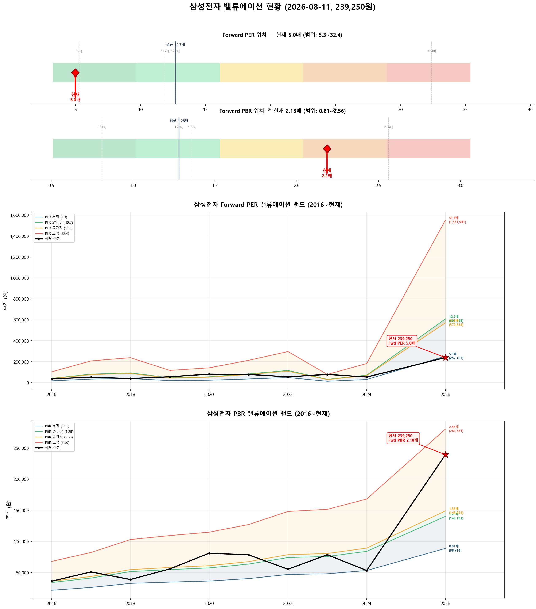
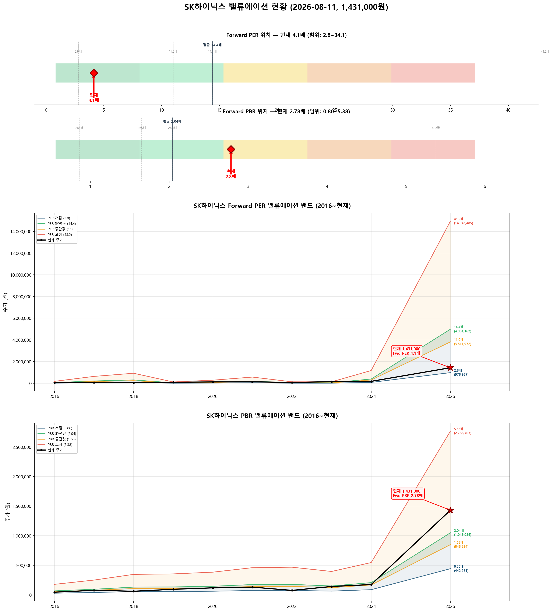

# 📊 삼성전자 · SK하이닉스 밸류에이션 분석 리포트

**분석일시**: 2026년 08월 11일 15:18  
**데이터 출처**: 네이버금융, wisereport 컨센서스  
**분석 방법론**: Forward PER 중심 (싸이클 산업 특성 반영)  

---

## ⚙️ 싸이클 산업과 Forward PER

> **반도체는 대표적인 싸이클 산업**입니다. Trailing PER(과거 실적 기준)은 오해를 유발합니다:  
> - **사이클 저점**: 실적 악화 → Trailing PER 급등 → 수치만 보면 "비싸 보이지만" 실제로는 매수 적기  
> - **사이클 고점**: 실적 폭증 → Trailing PER 급락 → 수치만 보면 "싸 보이지만" 실제로는 고점 부근  
> 
> 따라서 **Forward PER (향후 12개월 예상 실적 기준)**을 핵심 지표로 사용합니다.  
> Forward PER = 현재 주가 ÷ 26년(E) EPS

---

## 🎯 종합 밸류에이션 요약

| 항목 | 삼성전자 | SK하이닉스 |
|:---:|:---:|:---:|
| 현재 주가 | 239,250원 | 1,431,000원 |
| 시가총액 | 13,987,221억 | 10,453,345억 |
| 52주 고/저 | 374,500 / 67,500 | 2,987,000 / 245,000 |
|  |  |  |
| **━━ Forward 지표 (핵심) ━━** |  |  |
| **Forward PER (26E)** | **5.0배** | **4.1배** |
| **Forward PBR (26E)** | **2.18배** | **2.78배** |
| 26년(E) EPS | 47,929원 | 345,914원 |
| 26년(E) BPS | 109,524원 | 514,257원 |
| 26년(E) ROE | 43.8% | 67.3% |
| **Forward PER 판단** | **✅ Forward PER 매우 낮음 — 강한 저평가** | **✅ Forward PER 매우 낮음 — 강한 저평가** |
|  |  |  |
| ━━ Trailing 지표 (참고) ━━ |  |  |
| Trailing PER | 35.0배 | 24.1배 |
| 12M Forward PER | 7.4배 | 4.9배 |
| 현재 PBR | 3.59배 | 8.27배 |
| 현재 ROE | 10.3% | 34.3% |
| 배당수익률 | 0.73% | 0.21% |
|  |  |  |
| ━━ 적정주가 ━━ |  |  |
| 컨센서스 목표주가 | 493,542원 | 3,322,083원 |
| **적정주가 (Fwd PER)** | **608,698원** | **4,981,162원** |
| **적정주가 (Fwd PBR)** | **140,191원** | **1,049,084원** |
| **적정주가 (평균)** | **374,445원** | **3,015,123원** |
| **현재 대비 괴리율** | **-36.1%** | **-52.5%** |
| **종합 판단** | **✅ 상당히 저평가** | **✅ 상당히 저평가** |

---

## 📈 삼성전자 (A005930) 상세 분석

### 📊 밸류에이션 밴드 차트



### 현재 위치

- **주가**: 239,250원
- **52주 고점 대비**: -36.1%
- **52주 저점 대비**: +254.4%
- **외국인 지분율**: 49.6%
- **컨센서스 목표주가**: 493,542원 (현재 대비 ↑51.5%)

### ⭐ Forward PER 분석 (핵심)

| 항목 | 값 |
|:----:|:---:|
| 26년(E) EPS | 47,929원 |
| **Forward PER** | **5.0배** |
| 5년 평균 PER | 12.7배 |
| Forward vs 5년평균 | -60.7% |
| **판단** | **✅ Forward PER 매우 낮음 — 강한 저평가** |

**Forward PER Band (26년E EPS = 47,929원 기준)**

| PER 배수 | 주가 수준 | 현재 주가 대비 |
|:--------:|:--------:|:------------:|
| 3배 | 143,787원 | +66.4% |
| 5배 | 239,645원 | -0.2% ◀◀ |
| 7배 | 335,503원 | -28.7% |
| 10배 | 479,290원 | -50.1% |
| 13배 | 623,077원 | -61.6% |
| 15배 | 718,935원 | -66.7% |
| 20배 | 958,580원 | -75.0% |
| 25배 | 1,198,225원 | -80.0% |

**Forward PER Band 시각화**

```
       143,787원 │ ██████ PER 3x
       239,250원 ★ ▓▓▓▓▓▓▓▓▓ ★ 현재 주가
       239,645원 │ ██████████ PER 5x
       335,503원 │ ██████████████ PER 7x
       479,290원 │ ████████████████████ PER 10x
       623,077원 │ ██████████████████████████ PER 13x
       718,935원 │ ██████████████████████████████ PER 15x
       958,580원 │ ████████████████████████████████████████ PER 20x
     1,198,225원 │ ██████████████████████████████████████████████████ PER 25x
```

### PER Band (히스토리컬 레벨)

**현재 EPS**: 7,477원 / **26년(E) EPS**: 47,929원

| PER 수준 | PER 배수 | 현재EPS 기준 | 26년E 기준 | 현재 주가 위치 |
|:--------:|:-------:|:----------:|:---------:|:------------:|
| 저점 | 5.3배 | 39,329원 | 252,107원 ◀ | 아래 (-5%) |
| 5년평균 | 12.7배 | 94,958원 | 608,698원 | 아래 (-61%) |
| 중간값 | 11.9배 | 89,051원 | 570,834원 | 아래 (-58%) |
| 고점 | 32.4배 | 242,105원 | 1,551,941원 | 아래 (-85%) |

**PER 밴드 시각화 (26년E EPS 기준)**

```
       239,250원 ★ ▓▓▓▓▓▓ ★ 현재 주가
       252,107원 │ ███████ 저점 PER 5.3x
       570,834원 │ ████████████████ 중간값 PER 11.9x
       608,698원 │ █████████████████ 5년평균 PER 12.7x
     1,551,941원 │ █████████████████████████████████████████████ 고점 PER 32.4x
```

### PBR Band 분석

**현재 BPS**: 71,679원 / **26년(E) BPS**: 109,524원  
**Forward PBR**: 2.18배 (5년 평균 1.28배)

**Forward PBR Band (26년E BPS = 109,524원 기준)**

| PBR 배수 | 주가 수준 | 현재 주가 대비 |
|:--------:|:--------:|:------------:|
| 0.5배 | 54,762원 | +336.9% |
| 0.8배 | 87,619원 | +173.1% |
| 1.0배 | 109,524원 | +118.4% |
| 1.3배 | 142,381원 | +68.0% |
| 1.5배 | 164,286원 | +45.6% |
| 2.0배 | 219,048원 | +9.2% ◀◀ |
| 2.5배 | 273,810원 | -12.6% ◀◀ |
| 3.0배 | 328,572원 | -27.2% |
| 4.0배 | 438,096원 | -45.4% |
| 5.0배 | 547,620원 | -56.3% |

| PBR 수준 | PBR 배수 | 현재BPS 기준 | 26년E 기준 | 현재 주가 위치 |
|:--------:|:-------:|:----------:|:---------:|:------------:|
| 저점 | 0.81배 | 58,060원 | 88,714원 | 위 (+170%) |
| 5년평균 | 1.28배 | 91,749원 | 140,191원 | 위 (+71%) |
| 중간값 | 1.36배 | 97,483원 | 148,953원 | 위 (+61%) |
| 고점 | 2.56배 | 183,498원 | 280,381원 | 아래 (-15%) |

**PBR 밴드 시각화 (26년E BPS 기준)**

```
        88,714원 │ ██████████████ 저점 PBR 0.81x
       140,191원 │ ██████████████████████ 5년평균 PBR 1.28x
       148,953원 │ ███████████████████████ 중간값 PBR 1.36x
       239,250원 ★ ▓▓▓▓▓▓▓▓▓▓▓▓▓▓▓▓▓▓▓▓▓▓▓▓▓▓▓▓▓▓▓▓▓▓▓▓▓▓ ★ 현재 주가
       280,381원 │ █████████████████████████████████████████████ 고점 PBR 2.56x
```

### 히스토리컬 PER·PBR 추이

| 연도 | 주가 | EPS | PER | BPS | PBR | ROE |
|:----:|:----:|:---:|:---:|:---:|:---:|:---:|
| 16년 | 36,040 | 3,187 | 11.3 | 26,503 | 1.36 | 12.0% |
| 17년 | 50,960 | 6,405 | 8.0 | 32,102 | 1.59 | 19.9% |
| 18년 | 38,700 | 7,352 | 5.3 | 40,214 | 0.96 | 18.3% |
| 19년 | 55,800 | 3,602 | 15.5 | 42,701 | 1.31 | 8.4% |
| 20년 | 81,000 | 4,370 | 18.5 | 44,838 | 1.81 | 9.8% |
| 21년 | 78,300 | 6,574 | 11.9 | 49,623 | 1.58 | 13.2% |
| 22년 | 55,300 | 9,168 | 6.0 | 57,822 | 0.96 | 15.9% |
| 23년 | 78,500 | 2,424 | 32.4 | 59,170 | 1.33 | 4.1% |
| 24년 | 53,200 | 5,632 | 9.4 | 65,612 | 0.81 | 8.6% |
| 25년4Q(E) | 183,500 | 7,477 | 24.5 | 71,679 | 2.56 | 10.4% |

### 실적 현황

| 항목 | 25년4Q 연환산 | 26년(E) 컨센서스 | YoY |
|:----:|:----------:|:-------------:|:---:|
| 매출액 | 3,336,059억 | 5,159,507억 | +55% |
| 영업이익 | 436,012억 | 1,925,789억 | +342% |
| 지배순이익 | 442,610억 | 1,602,675억 | +262% |
| OPM | 13.1% | 37.3% | |
| EPS | 7,477원 | 47,929원 | +541% |
| BPS | 71,679원 | 109,524원 | +53% |
| ROE | 10.3% | 43.8% | |

### 적정주가 산출

**방법 1: Forward PER 기반** (5년 평균 PER × 26년E EPS)
- 12.7배 × 47,929원 = **608,698원** (현재 대비 -60.7%)

**방법 2: Forward PBR 기반** (5년 평균 PBR × 26년E BPS)
- 1.28배 × 109,524원 = **140,191원** (현재 대비 +70.7%)

**방법 3: 컨센서스 기반** (애널리스트 목표주가)
- **493,542원** (현재 대비 -51.5%)

**종합 적정주가**: **374,445원** → 현재 대비 **-36.1%**

> **판단: ✅ 상당히 저평가**  
> **Forward PER 관점: ✅ Forward PER 매우 낮음 — 강한 저평가**

---

## 📈 SK하이닉스 (A000660) 상세 분석

### 📊 밸류에이션 밴드 차트



### 현재 위치

- **주가**: 1,431,000원
- **52주 고점 대비**: -52.1%
- **52주 저점 대비**: +484.1%
- **외국인 지분율**: 53.5%
- **컨센서스 목표주가**: 3,322,083원 (현재 대비 ↑56.9%)

### ⭐ Forward PER 분석 (핵심)

| 항목 | 값 |
|:----:|:---:|
| 26년(E) EPS | 345,914원 |
| **Forward PER** | **4.1배** |
| 5년 평균 PER | 14.4배 |
| Forward vs 5년평균 | -71.3% |
| **판단** | **✅ Forward PER 매우 낮음 — 강한 저평가** |

**Forward PER Band (26년E EPS = 345,914원 기준)**

| PER 배수 | 주가 수준 | 현재 주가 대비 |
|:--------:|:--------:|:------------:|
| 3배 | 1,037,742원 | +37.9% |
| 5배 | 1,729,570원 | -17.3% |
| 7배 | 2,421,398원 | -40.9% |
| 10배 | 3,459,140원 | -58.6% |
| 13배 | 4,496,882원 | -68.2% |
| 15배 | 5,188,710원 | -72.4% |
| 20배 | 6,918,280원 | -79.3% |
| 25배 | 8,647,850원 | -83.5% |

**Forward PER Band 시각화**

```
     1,037,742원 │ ██████ PER 3x
     1,431,000원 ★ ▓▓▓▓▓▓▓▓ ★ 현재 주가
     1,729,570원 │ ██████████ PER 5x
     2,421,398원 │ ██████████████ PER 7x
     3,459,140원 │ ████████████████████ PER 10x
     4,496,882원 │ ██████████████████████████ PER 13x
     5,188,710원 │ ██████████████████████████████ PER 15x
     6,918,280원 │ ████████████████████████████████████████ PER 20x
     8,647,850원 │ ██████████████████████████████████████████████████ PER 25x
```

### PER Band (히스토리컬 레벨)

**현재 EPS**: 60,221원 / **26년(E) EPS**: 345,914원

| PER 수준 | PER 배수 | 현재EPS 기준 | 26년E 기준 | 현재 주가 위치 |
|:--------:|:-------:|:----------:|:---------:|:------------:|
| 저점 | 2.8배 | 170,425원 | 978,937원 | 위 (+46%) |
| 5년평균 | 14.4배 | 867,182원 | 4,981,162원 | 아래 (-71%) |
| 중간값 | 11.0배 | 663,635원 | 3,811,972원 | 아래 (-62%) |
| 고점 | 68.9배 | 4,149,829원 | 23,836,934원 | 아래 (-94%) |

**PER 밴드 시각화 (26년E EPS 기준)**

```
       978,937원 │ █ 저점 PER 2.8x
     1,431,000원 ★ ▓▓ ★ 현재 주가
     3,811,972원 │ ███████ 중간값 PER 11.0x
     4,981,162원 │ █████████ 5년평균 PER 14.4x
    23,836,934원 │ █████████████████████████████████████████████ 고점 PER 68.9x
```

### PBR Band 분석

**현재 BPS**: 169,098원 / **26년(E) BPS**: 514,257원  
**Forward PBR**: 2.78배 (5년 평균 2.04배)

**Forward PBR Band (26년E BPS = 514,257원 기준)**

| PBR 배수 | 주가 수준 | 현재 주가 대비 |
|:--------:|:--------:|:------------:|
| 0.5배 | 257,128원 | +456.5% |
| 0.8배 | 411,406원 | +247.8% |
| 1.0배 | 514,257원 | +178.3% |
| 1.3배 | 668,534원 | +114.1% |
| 1.5배 | 771,386원 | +85.5% |
| 2.0배 | 1,028,514원 | +39.1% |
| 2.5배 | 1,285,642원 | +11.3% ◀◀ |
| 3.0배 | 1,542,771원 | -7.2% ◀◀ |
| 4.0배 | 2,057,028원 | -30.4% |
| 5.0배 | 2,571,285원 | -44.3% |

| PBR 수준 | PBR 배수 | 현재BPS 기준 | 26년E 기준 | 현재 주가 위치 |
|:--------:|:-------:|:----------:|:---------:|:------------:|
| 저점 | 0.86배 | 145,424원 | 442,261원 | 위 (+224%) |
| 5년평균 | 2.04배 | 344,960원 | 1,049,084원 | 위 (+36%) |
| 중간값 | 1.65배 | 279,012원 | 848,524원 | 위 (+69%) |
| 고점 | 5.38배 | 909,747원 | 2,766,703원 | 아래 (-48%) |

**PBR 밴드 시각화 (26년E BPS 기준)**

```
       442,261원 │ ███████ 저점 PBR 0.86x
       848,524원 │ █████████████ 중간값 PBR 1.65x
     1,049,084원 │ █████████████████ 5년평균 PBR 2.04x
     1,431,000원 ★ ▓▓▓▓▓▓▓▓▓▓▓▓▓▓▓▓▓▓▓▓▓▓▓ ★ 현재 주가
     2,766,703원 │ █████████████████████████████████████████████ 고점 PBR 5.38x
```

### 히스토리컬 PER·PBR 추이

| 연도 | 주가 | EPS | PER | BPS | PBR | ROE |
|:----:|:----:|:---:|:---:|:---:|:---:|:---:|
| 16년 | 44,700 | 4,057 | 11.0 | 32,990 | 1.35 | 12.3% |
| 17년 | 76,500 | 14,617 | 5.2 | 46,449 | 1.65 | 31.5% |
| 18년 | 60,500 | 21,346 | 2.8 | 64,348 | 0.94 | 33.2% |
| 19년 | 94,100 | 2,755 | 34.1 | 65,825 | 1.43 | 4.2% |
| 20년 | 118,500 | 6,532 | 18.1 | 71,275 | 1.66 | 9.2% |
| 21년 | 131,000 | 13,190 | 9.9 | 85,380 | 1.53 | 15.4% |
| 22년 | 75,000 | 3,063 | 24.5 | 86,904 | 0.86 | 3.5% |
| 23년 | 141,500 | -12,517 | 적자 | 73,495 | 1.93 | -17.0% |
| 24년 | 173,900 | 27,182 | 6.4 | 101,515 | 1.71 | 26.8% |
| 25년4Q(E) | 910,000 | 60,221 | 15.1 | 169,098 | 5.38 | 35.6% |

### 실적 현황

| 항목 | 25년4Q 연환산 | 26년(E) 컨센서스 | YoY |
|:----:|:----------:|:-------------:|:---:|
| 매출액 | 971,467억 | 2,299,806억 | +137% |
| 영업이익 | 472,064억 | 1,606,938억 | +240% |
| 지배순이익 | 429,193억 | 1,299,259억 | +203% |
| OPM | 48.6% | 69.9% | |
| EPS | 60,221원 | 345,914원 | +474% |
| BPS | 169,098원 | 514,257원 | +204% |
| ROE | 34.3% | 67.3% | |

### 적정주가 산출

**방법 1: Forward PER 기반** (5년 평균 PER × 26년E EPS)
- 14.4배 × 345,914원 = **4,981,162원** (현재 대비 -71.3%)

**방법 2: Forward PBR 기반** (5년 평균 PBR × 26년E BPS)
- 2.04배 × 514,257원 = **1,049,084원** (현재 대비 +36.4%)

**방법 3: 컨센서스 기반** (애널리스트 목표주가)
- **3,322,083원** (현재 대비 -56.9%)

**종합 적정주가**: **3,015,123원** → 현재 대비 **-52.5%**

> **판단: ✅ 상당히 저평가**  
> **Forward PER 관점: ✅ Forward PER 매우 낮음 — 강한 저평가**

---

## 🔍 삼성전자 vs SK하이닉스 비교

| 구분 | 삼성전자 | SK하이닉스 | 비고 |
|:----:|:-------:|:--------:|:----:|
| **Forward PER** | **5.0배** | **4.1배** | 핵심 지표 |
| **Forward PBR** | **2.18배** | **2.78배** | |
| Trailing PER | 35.0배 | 24.1배 | 참고 (싸이클 왜곡) |
| 12M Fwd PER | 7.4배 | 4.9배 | |
| 현재 PBR | 3.59배 | 8.27배 | |
| 현재 ROE | 10.3% | 34.3% | |
| 26년E ROE | 43.8% | 67.3% | |
| OPM | 13.1% | 48.6% | |
| 26년E EPS 성장률 | +541% | +474% | |
| 적정주가 괴리율 | -36.1% | -52.5% | |
| **Forward PER 판단** | **✅ Forward PER 매우 낮음 — 강한 저평가** | **✅ Forward PER 매우 낮음 — 강한 저평가** | |
| **밸류 판단** | **✅ 상당히 저평가** | **✅ 상당히 저평가** | |

---

## 💡 투자 시사점

### 삼성전자

- **Forward PER 5.0배** → ✅ Forward PER 매우 낮음 — 강한 저평가
- Trailing PER(35.0배)과의 괴리가 큼 → 26년 실적 대폭 개선 전망 반영
- 현재 주가(239,250원)는 적정주가(374,445원) 대비 **36.1% 저평가** 상태
- 26년 실적 성장이 예상대로 실현되면 상당한 업사이드 잠재력
- 52주 고점(374,500원) 대비 -36.1%
- 애널리스트 목표주가 493,542원 (현재 대비 +106.3%)

### SK하이닉스

- **Forward PER 4.1배** → ✅ Forward PER 매우 낮음 — 강한 저평가
- Trailing PER(24.1배)과의 괴리가 큼 → 26년 실적 대폭 개선 전망 반영
- 현재 주가(1,431,000원)는 적정주가(3,015,123원) 대비 **52.5% 저평가** 상태
- 26년 실적 성장이 예상대로 실현되면 상당한 업사이드 잠재력
- 52주 고점(2,987,000원) 대비 -52.1%
- 애널리스트 목표주가 3,322,083원 (현재 대비 +132.2%)

---

## ⚠️ 리스크 요인

- **반도체 사이클**: 메모리 업황 사이클에 따른 실적 변동성 존재. Forward PER가 낮아도 사이클 피크 리스크 점검 필요
- **컨센서스 리스크**: 26년 실적이 컨센서스에 못 미칠 경우 Forward PER 재산출 시 밸류에이션 급등
- **AI 기대감 과반영**: 현재 주가에 AI 수혜 기대가 상당히 반영된 상태
- **환율·지정학**: 원/달러 환율, 미중 갈등, 수출 규제 리스크
- **PBR 고점 리스크**: 역사적 PBR 고점 부근에 위치 → 순자산 대비 프리미엄 과도 여부 점검
- **싸이클 고점 시나리오**: Trailing PER이 낮을 때가 오히려 사이클 고점일 수 있음 (역설적 위험)

---

> **면책 조항**: 본 리포트는 공개된 데이터를 기반으로 한 기계적 분석이며, 투자 권유가 아닙니다. 투자 판단은 본인의 책임하에 이루어져야 합니다.

**분석 도구**: Python  
**데이터 출처**: 네이버금융, wisereport (navercomp.wisereport.co.kr)
